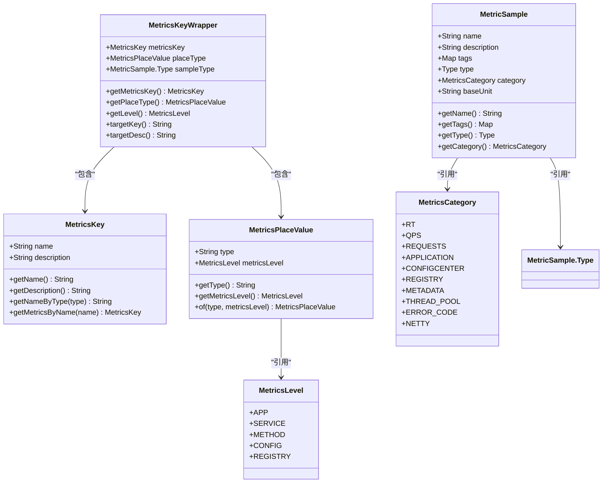
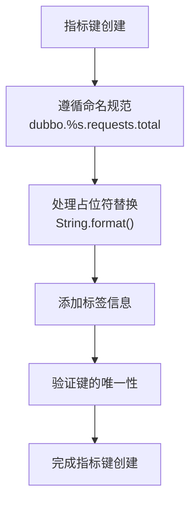
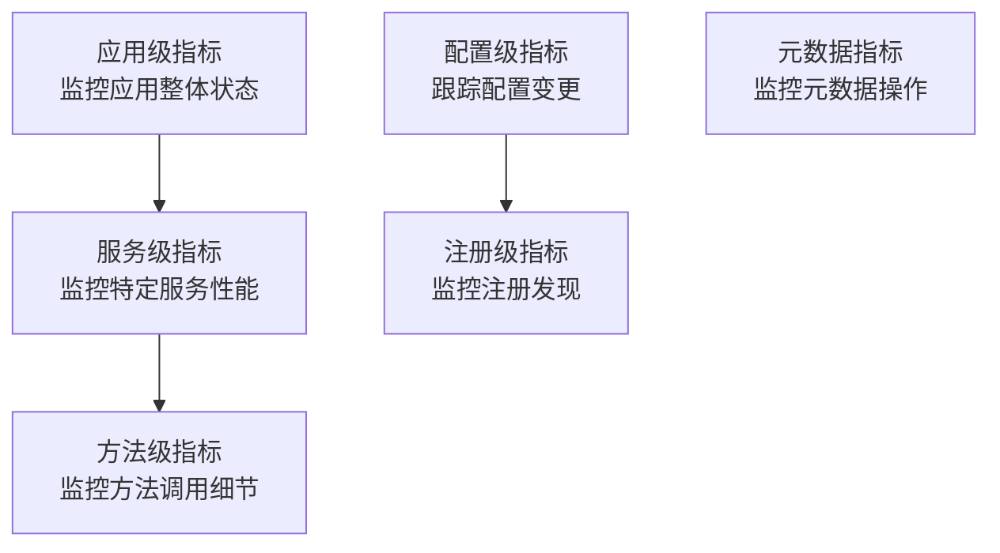
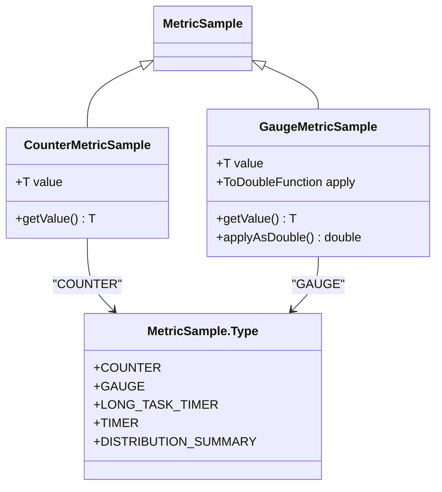

# 指标数据模型

<cite>
**本文档中引用的文件**  
- [MetricsKey.java](file://dubbo-metrics/dubbo-metrics-event/src/main/java/org/apache/dubbo/metrics/model/key/MetricsKey.java)
- [MetricsLevel.java](file://dubbo-metrics/dubbo-metrics-event/src/main/java/org/apache/dubbo/metrics/model/key/MetricsLevel.java)
- [MetricsKeyWrapper.java](file://dubbo-metrics/dubbo-metrics-api/src/main/java/org/apache/dubbo/metrics/model/key/MetricsKeyWrapper.java)
- [MetricsPlaceValue.java](file://dubbo-metrics/dubbo-metrics-api/src/main/java/org/apache/dubbo/metrics/model/key/MetricsPlaceValue.java)
- [MetricSample.java](file://dubbo-metrics/dubbo-metrics-api/src/main/java/org/apache/dubbo/metrics/model/sample/MetricSample.java)
- [GaugeMetricSample.java](file://dubbo-metrics/dubbo-metrics-api/src/main/java/org/apache/dubbo/metrics/model/sample/GaugeMetricSample.java)
- [CounterMetricSample.java](file://dubbo-metrics/dubbo-metrics-api/src/main/java/org/apache/dubbo/metrics/model/sample/CounterMetricSample.java)
- [MetricsCategory.java](file://dubbo-metrics/dubbo-metrics-api/src/main/java/org/apache/dubbo/metrics/model/MetricsCategory.java)
- [MetricsSupport.java](file://dubbo-metrics/dubbo-metrics-api/src/main/java/org/apache/dubbo/metrics/model/MetricsSupport.java)
- [MetadataMetricsConstants.java](file://dubbo-metrics/dubbo-metrics-metadata/src/main/java/org/apache/dubbo/metrics/metadata/MetadataMetricsConstants.java)
</cite>

## 目录
1. [引言](#引言)
2. [核心数据结构](#核心数据结构)
3. [指标键设计原则](#指标键设计原则)
4. [指标级别分类](#指标级别分类)
5. [指标数据类型系统](#指标数据类型系统)
6. [序列化机制与存储优化](#序列化机制与存储优化)
7. [命名最佳实践](#命名最佳实践)
8. [高级数据建模技巧](#高级数据建模技巧)
9. [性能优化建议](#性能优化建议)

## 引言
Dubbo的指标数据模型为分布式系统提供了全面的监控能力，通过精心设计的数据结构和分类体系，实现了对JVM、应用、服务等不同层级的精细化监控。本模型以MetricsKey和MetricsLevel为核心，构建了完整的指标体系，支持多种指标类型，并提供了灵活的标签系统和维度管理功能。

## 核心数据结构

Dubbo指标数据模型的核心由多个关键类组成，这些类共同构成了完整的指标体系。MetricsKey作为指标的唯一标识，MetricsLevel定义了指标的层级结构，而MetricSample则封装了指标的具体数据和元信息。



**图示来源**
- [MetricsKey.java](file://dubbo-metrics/dubbo-metrics-event/src/main/java/org/apache/dubbo/metrics/model/key/MetricsKey.java)
- [MetricsLevel.java](file://dubbo-metrics/dubbo-metrics-event/src/main/java/org/apache/dubbo/metrics/model/key/MetricsLevel.java)
- [MetricsKeyWrapper.java](file://dubbo-metrics/dubbo-metrics-api/src/main/java/org/apache/dubbo/metrics/model/key/MetricsKeyWrapper.java)
- [MetricsPlaceValue.java](file://dubbo-metrics/dubbo-metrics-api/src/main/java/org/apache/dubbo/metrics/model/key/MetricsPlaceValue.java)
- [MetricSample.java](file://dubbo-metrics/dubbo-metrics-api/src/main/java/org/apache/dubbo/metrics/model/sample/MetricSample.java)
- [MetricsCategory.java](file://dubbo-metrics/dubbo-metrics-api/src/main/java/org/apache/dubbo/metrics/model/MetricsCategory.java)

**本节来源**
- [MetricsKey.java](file://dubbo-metrics/dubbo-metrics-event/src/main/java/org/apache/dubbo/metrics/model/key/MetricsKey.java#L1-L183)
- [MetricsLevel.java](file://dubbo-metrics/dubbo-metrics-event/src/main/java/org/apache/dubbo/metrics/model/key/MetricsLevel.java#L1-L26)
- [MetricsKeyWrapper.java](file://dubbo-metrics/dubbo-metrics-api/src/main/java/org/apache/dubbo/metrics/model/key/MetricsKeyWrapper.java#L1-L127)
- [MetricsPlaceValue.java](file://dubbo-metrics/dubbo-metrics-api/src/main/java/org/apache/dubbo/metrics/model/key/MetricsPlaceValue.java#L1-L62)

## 指标键设计原则

### 命名规范
Dubbo指标键的命名遵循统一的规范，采用点分隔的层级结构，如`dubbo.%s.requests.total`。这种命名方式既保证了可读性，又支持动态占位符替换。命名中的`%s`占位符用于表示动态部分，如服务名、方法名等，在实际使用时会被具体值替换。

### 标签系统
指标标签系统通过Map<String, String>结构实现，为每个指标提供了丰富的上下文信息。标签可以包含应用名称、服务接口、IP地址等维度信息，使得指标查询和分析更加灵活。例如，通过applicationTags方法可以为指标添加应用级别的标签。



**图示来源**
- [MetricsKey.java](file://dubbo-metrics/dubbo-metrics-event/src/main/java/org/apache/dubbo/metrics/model/key/MetricsKey.java#L161-L163)
- [MetricsSupport.java](file://dubbo-metrics/dubbo-metrics-api/src/main/java/org/apache/dubbo/metrics/model/MetricsSupport.java#L67-L99)

### 维度管理
维度管理通过MetricsKeyWrapper和MetricsPlaceValue协同实现。MetricsPlaceValue封装了指标的类型和层级信息，而MetricsKeyWrapper则作为装饰器，将MetricsKey与MetricsPlaceValue组合在一起，实现了多维度的指标管理。这种设计模式既保持了代码的简洁性，又提供了强大的扩展能力。

**本节来源**
- [MetricsKeyWrapper.java](file://dubbo-metrics/dubbo-metrics-api/src/main/java/org/apache/dubbo/metrics/model/key/MetricsKeyWrapper.java#L45-L126)
- [MetricsPlaceValue.java](file://dubbo-metrics/dubbo-metrics-api/src/main/java/org/apache/dubbo/metrics/model/key/MetricsPlaceValue.java#L24-L42)
- [MetricsSupport.java](file://dubbo-metrics/dubbo-metrics-api/src/main/java/org/apache/dubbo/metrics/model/MetricsSupport.java#L67-L99)

## 指标级别分类

### 分类方式
Dubbo将指标分为五个主要级别：应用级(APP)、服务级(SERVICE)、方法级(METHOD)、配置级(CONFIG)和注册级(REGISTRY)。这种分级体系反映了分布式系统中不同粒度的监控需求，从宏观的应用整体状态到微观的方法调用细节，形成了完整的监控层次。

### 使用场景
不同级别的指标适用于不同的监控场景。应用级指标用于监控整个应用的运行状态，如配置变更总数；服务级指标关注特定服务的性能表现；方法级指标则深入到具体方法的调用细节；配置级指标跟踪配置中心的变化；注册级指标监控服务注册与发现的过程。



**图示来源**
- [MetricsLevel.java](file://dubbo-metrics/dubbo-metrics-event/src/main/java/org/apache/dubbo/metrics/model/key/MetricsLevel.java#L19-L25)
- [MetadataMetricsConstants.java](file://dubbo-metrics/dubbo-metrics-metadata/src/main/java/org/apache/dubbo/metrics/metadata/MetadataMetricsConstants.java#L44-L58)

### 级别间关系
各级别指标之间存在层次化的包含关系。高级别的指标通常由低级别指标聚合而成，形成完整的监控视图。例如，应用级的请求总数是所有服务级请求的总和，而服务级的指标又是其包含的所有方法级指标的聚合。

**本节来源**
- [MetricsLevel.java](file://dubbo-metrics/dubbo-metrics-event/src/main/java/org/apache/dubbo/metrics/model/key/MetricsLevel.java#L19-L25)
- [MetadataMetricsConstants.java](file://dubbo-metrics/dubbo-metrics-metadata/src/main/java/org/apache/dubbo/metrics/metadata/MetadataMetricsConstants.java#L44-L58)

## 指标数据类型系统

### 类型分类
Dubbo支持多种指标类型，包括计数器(COUNTER)、仪表(GAUGE)、长任务计时器(LONG_TASK_TIMER)、计时器(TIMER)和分布摘要(DISTRIBUTION_SUMMARY)。这些类型覆盖了常见的监控需求，从简单的计数到复杂的分布统计。



**图示来源**
- [MetricSample.java](file://dubbo-metrics/dubbo-metrics-api/src/main/java/org/apache/dubbo/metrics/model/sample/MetricSample.java#L132-L138)
- [CounterMetricSample.java](file://dubbo-metrics/dubbo-metrics-api/src/main/java/org/apache/dubbo/metrics/model/sample/CounterMetricSample.java#L24-L42)
- [GaugeMetricSample.java](file://dubbo-metrics/dubbo-metrics-api/src/main/java/org/apache/dubbo/metrics/model/sample/GaugeMetricSample.java#L35-L114)

### 在Dubbo中的应用
在Dubbo中，不同类型的指标应用于不同的监控场景。计数器用于统计请求次数、错误次数等累积值；仪表用于监控当前活跃的请求数、线程池大小等瞬时值；计时器用于记录请求响应时间；分布摘要用于统计响应时间的分布情况。

### 类型选择指南
选择合适的指标类型对于有效的监控至关重要。对于单调递增的值，应使用计数器；对于可能增加或减少的值，应使用仪表；对于需要记录时间间隔的场景，应使用计时器；对于需要了解值分布情况的场景，应使用分布摘要。

**本节来源**
- [MetricSample.java](file://dubbo-metrics/dubbo-metrics-api/src/main/java/org/apache/dubbo/metrics/model/sample/MetricSample.java#L132-L138)
- [CounterMetricSample.java](file://dubbo-metrics/dubbo-metrics-api/src/main/java/org/apache/dubbo/metrics/model/sample/CounterMetricSample.java#L24-L42)
- [GaugeMetricSample.java](file://dubbo-metrics/dubbo-metrics-api/src/main/java/org/apache/dubbo/metrics/model/sample/GaugeMetricSample.java#L35-L114)

## 序列化机制与存储优化

### 序列化机制
Dubbo指标数据的序列化通过标准的Java序列化机制实现，同时利用了高效的字符串格式化技术。对于包含占位符的指标键，使用String.format()方法进行动态替换，确保了序列化的效率和准确性。

### 存储优化
存储优化主要体现在两个方面：一是通过MetricsKeyWrapper的装饰器模式减少内存占用，避免重复创建相似的指标对象；二是利用HashMap等高效数据结构存储指标数据，确保快速的读写性能。

### 查询性能
查询性能的优化通过合理的索引设计和缓存机制实现。指标数据按照类别和标签进行组织，支持高效的多维度查询。同时，常用的指标键会被缓存，减少重复计算的开销。

**本节来源**
- [MetricsKeyWrapper.java](file://dubbo-metrics/dubbo-metrics-api/src/main/java/org/apache/dubbo/metrics/model/key/MetricsKeyWrapper.java#L83-L93)
- [MetricsSupport.java](file://dubbo-metrics/dubbo-metrics-api/src/main/java/org/apache/dubbo/metrics/model/MetricsSupport.java#L67-L99)
- [MetricSample.java](file://dubbo-metrics/dubbo-metrics-api/src/main/java/org/apache/dubbo/metrics/model/sample/MetricSample.java#L103-L119)

## 命名最佳实践

### 初学者指南
对于初学者，建议遵循以下命名最佳实践：使用清晰、描述性的名称；采用统一的命名前缀（如dubbo.）；合理使用占位符；避免使用特殊字符；保持命名的一致性。

### 示例
```java
// 推荐的命名方式
MetricsKey REQUESTS_TOTAL = new MetricsKey("dubbo.%s.requests.total", "Total Requests");
MetricsKey RT_AVG = new MetricsKey("dubbo.%s.rt.milliseconds.avg", "Average Response Time");

// 避免的命名方式
MetricsKey BAD_NAME = new MetricsKey("req_total", "Total"); // 缺少前缀和描述性
```

**本节来源**
- [MetricsKey.java](file://dubbo-metrics/dubbo-metrics-event/src/main/java/org/apache/dubbo/metrics/model/key/MetricsKey.java#L20-L152)

## 高级数据建模技巧

### 组合模式应用
通过MetricsKeyWrapper和MetricsPlaceValue的组合，可以创建复杂的多维度指标模型。这种模式允许在不修改原有指标键的情况下，添加新的维度信息，提高了代码的可维护性和扩展性。

### 装饰器模式
MetricsKeyWrapper作为装饰器，为MetricsKey添加了额外的功能，如动态类型支持和层级信息。这种设计模式使得指标系统更加灵活，能够适应不同的监控需求。

### 工厂方法
通过静态工厂方法（如wrapper()）创建MetricsKeyWrapper实例，简化了对象创建过程，提高了代码的可读性和一致性。

**本节来源**
- [MetricsKeyWrapper.java](file://dubbo-metrics/dubbo-metrics-api/src/main/java/org/apache/dubbo/metrics/model/key/MetricsKeyWrapper.java#L105-L107)
- [MetricsPlaceValue.java](file://dubbo-metrics/dubbo-metrics-api/src/main/java/org/apache/dubbo/metrics/model/key/MetricsPlaceValue.java#L32-L34)

## 性能优化建议

### 内存优化
避免频繁创建MetricsKey对象，可以使用枚举或常量池模式重用常用的指标键。对于包含占位符的指标，考虑使用StringBuilder进行字符串拼接，减少临时对象的创建。

### 计算优化
对于需要频繁计算的指标，考虑使用缓存机制存储计算结果。同时，合理使用原子操作和并发容器，确保在高并发场景下的性能表现。

### 查询优化
建立适当的索引结构，支持高效的多维度查询。对于常用的查询模式，可以预先计算并存储聚合结果，减少实时计算的开销。

**本节来源**
- [MetricsKeyWrapper.java](file://dubbo-metrics/dubbo-metrics-api/src/main/java/org/apache/dubbo/metrics/model/key/MetricsKeyWrapper.java#L110-L126)
- [MetricSample.java](file://dubbo-metrics/dubbo-metrics-api/src/main/java/org/apache/dubbo/metrics/model/sample/MetricSample.java#L103-L119)