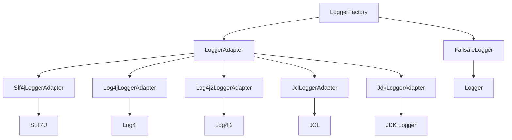
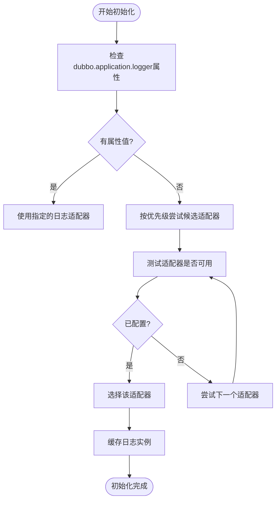
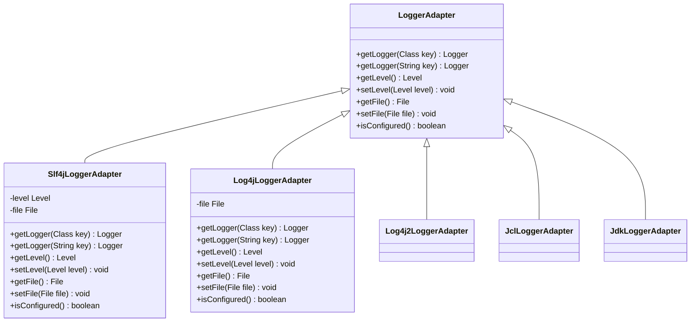
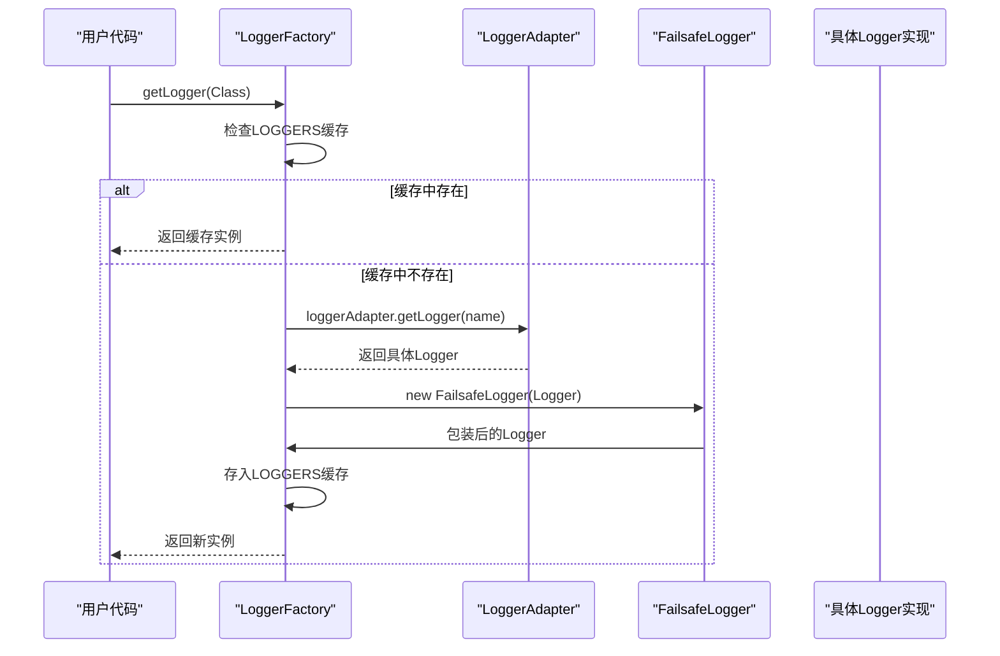
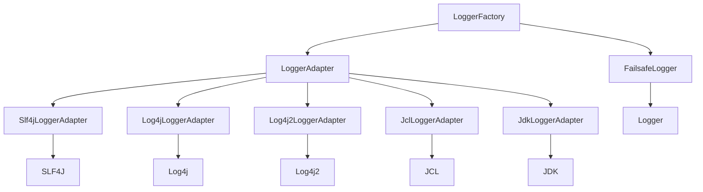

# 日志工厂

<cite>
**本文档中引用的文件**  
- [LoggerFactory.java](file://dubbo-common\src\main\java\org\apache\dubbo\common\logger\LoggerFactory.java)
- [LoggerAdapter.java](file://dubbo-common\src\main\java\org\apache\dubbo\common\logger\LoggerAdapter.java)
- [Logger.java](file://dubbo-common\src\main\java\org\apache\dubbo\common\logger\Logger.java)
- [FailsafeLogger.java](file://dubbo-common\src\main\java\org\apache\dubbo\common\logger\support\FailsafeLogger.java)
- [FailsafeErrorTypeAwareLogger.java](file://dubbo-common\src\main\java\org\apache\dubbo\common\logger\support\FailsafeErrorTypeAwareLogger.java)
- [Slf4jLoggerAdapter.java](file://dubbo-common\src\main\java\org\apache\dubbo\common\logger\slf4j\Slf4jLoggerAdapter.java)
- [Log4jLoggerAdapter.java](file://dubbo-common\src\main\java\org\apache\dubbo\common\logger\log4j\Log4jLoggerAdapter.java)
- [JdkLoggerAdapter.java](file://dubbo-common\src\main\java\org\apache\dubbo\common\logger\jdk\JdkLoggerAdapter.java)
- [LoggerFactoryTest.java](file://dubbo-common\src\test\java\org\apache\dubbo\common\logger\LoggerFactoryTest.java)
</cite>

## 目录
1. [简介](#简介)
2. [核心组件](#核心组件)
3. [架构概述](#架构概述)
4. [详细组件分析](#详细组件分析)
5. [依赖分析](#依赖分析)
6. [性能考虑](#性能考虑)
7. [故障排除指南](#故障排除指南)
8. [结论](#结论)

## 简介
日志工厂（LoggerFactory）是Dubbo框架中的核心日志管理组件，采用静态工厂模式实现。它通过自动探测机制发现并加载合适的日志适配器，为应用程序创建具体的日志实例。该工厂在初始化时会根据系统属性配置或自动探测可用的日志框架（如SLF4J、Log4j、JDK Logger等），选择最合适的日志实现。LoggerFactory提供了线程安全的日志实例获取机制，确保在高并发环境下日志记录的正确性和性能。它还支持用户自定义日志适配器设置，并提供了丰富的API来获取不同类型的日志实例，包括普通日志和错误类型感知日志。本文档将深入解析LoggerFactory的实现原理、初始化过程、线程安全机制和性能优化策略。

## 核心组件
LoggerFactory的核心组件包括Logger接口、LoggerAdapter接口、各种具体的日志适配器实现以及FailsafeLogger包装器。Logger接口定义了日志记录的基本方法，如trace、debug、info、warn和error等不同级别的日志输出。LoggerAdapter接口作为日志适配器的抽象，负责创建具体的Logger实例，并提供获取当前日志级别和日志文件的方法。具体的日志适配器实现（如Slf4jLoggerAdapter、Log4jLoggerAdapter等）将Dubbo的Logger接口与底层日志框架进行桥接。FailsafeLogger作为装饰器模式的实现，为日志操作提供了故障安全保护，即使底层日志框架出现异常也不会影响应用程序的正常运行。这些组件共同构成了一个灵活、可扩展且健壮的日志管理系统。

**本文档中引用的文件**
- [LoggerFactory.java](file://dubbo-common\src\main\java\org\apache\dubbo\common\logger\LoggerFactory.java)
- [LoggerAdapter.java](file://dubbo-common\src\main\java\org\apache\dubbo\common\logger\LoggerAdapter.java)
- [Logger.java](file://dubbo-common\src\main\java\org\apache\dubbo\common\logger\Logger.java)
- [FailsafeLogger.java](file://dubbo-common\src\main\java\org\apache\dubbo\common\logger\support\FailsafeLogger.java)

## 架构概述
LoggerFactory的架构设计体现了典型的工厂模式和适配器模式的结合。工厂负责根据运行时环境自动选择合适的日志适配器，而适配器则负责将统一的日志接口映射到具体日志框架的实现上。整个架构分为三层：最上层是LoggerFactory静态工厂，提供统一的日志实例获取入口；中间层是各种LoggerAdapter实现，作为不同日志框架的适配器；最底层是具体的日志框架（如SLF4J、Log4j等）。这种分层设计使得Dubbo可以无缝集成多种日志框架，同时保持API的统一性。此外，通过FailsafeLogger的包装，整个日志系统具备了良好的容错能力，即使在日志框架配置错误或缺失的情况下，也不会导致应用程序崩溃。

**图表来源**
- [LoggerFactory.java](file://dubbo-common\src\main\java\org\apache\dubbo\common\logger\LoggerFactory.java)
- [LoggerAdapter.java](file://dubbo-common\src\main\java\org\apache\dubbo\common\logger\LoggerAdapter.java)

## 详细组件分析

### LoggerFactory分析
LoggerFactory作为静态工厂类，其核心功能是通过静态代码块完成初始化，自动探测并加载合适的日志适配器。初始化过程首先检查系统属性"dubbo.application.logger"的配置，如果指定了特定的日志框架（如slf4j、log4j等），则直接使用对应的适配器。如果没有指定，则按照预定义的优先级顺序（Log4j、SLF4J、Log4j2、JCL、JDK Logger）依次尝试加载各个适配器。对于每个候选适配器，工厂会创建其实例并调用getLogger方法进行测试，如果适配器能够成功创建日志实例且已正确配置（通过isConfigured方法判断），则选择该适配器作为当前使用的日志实现。这种探测机制确保了在多种日志框架共存的环境中能够选择最合适的实现。工厂还维护了一个ConcurrentHashMap来缓存已创建的日志实例，避免重复创建，提高性能。

**图表来源**
- [LoggerFactory.java](file://dubbo-common\src\main\java\org\apache\dubbo\common\logger\LoggerFactory.java)

### LoggerAdapter分析
LoggerAdapter接口定义了日志适配器的基本契约，包括创建Logger实例、获取和设置日志级别、获取日志文件等功能。各个具体的适配器实现都遵循这个接口规范，将Dubbo的Logger接口与底层日志框架进行桥接。例如，Slf4jLoggerAdapter通过SLF4J的LoggerFactory获取具体的SLF4J Logger实例，并将其包装为Dubbo的Logger实现。适配器的isConfigured方法用于检测对应的日志框架是否已正确配置，这通常通过检查类路径中是否存在必要的类或配置文件来实现。这种设计使得LoggerFactory能够在运行时动态判断各个日志框架的可用性，从而做出最佳选择。适配器模式的应用使得Dubbo可以轻松支持新的日志框架，只需实现相应的LoggerAdapter即可，无需修改核心代码。

**图表来源**
- [LoggerAdapter.java](file://dubbo-common\src\main\java\org\apache\dubbo\common\logger\LoggerAdapter.java)
- [Slf4jLoggerAdapter.java](file://dubbo-common\src\main\java\org\apache\dubbo\common\logger\slf4j\Slf4jLoggerAdapter.java)
- [Log4jLoggerAdapter.java](file://dubbo-common\src\main\java\org\apache\dubbo\common\logger\log4j\Log4jLoggerAdapter.java)

### getLogger方法实现
getLogger方法是LoggerFactory的核心API，负责根据类名或名称创建对应的日志实例。该方法采用ConcurrentHashMapUtils.computeIfAbsent方法实现线程安全的懒加载模式，确保在多线程环境下每个日志名称只创建一个日志实例。当调用getLogger(Class<?> key)时，方法使用类的全限定名作为日志名称；当调用getLogger(String key)时，直接使用传入的字符串作为日志名称。创建的日志实例会被包装在FailsafeLogger中，以提供故障安全保护。FailsafeLogger在调用底层日志方法时会捕获所有异常，防止日志记录失败影响应用程序的正常执行。这种设计既保证了性能（通过实例缓存避免重复创建），又确保了可靠性（通过异常捕获防止日志系统故障扩散）。

**图表来源**
- [LoggerFactory.java](file://dubbo-common\src\main\java\org\apache\dubbo\common\logger\LoggerFactory.java)
- [FailsafeLogger.java](file://dubbo-common\src\main\java\org\apache\dubbo\common\logger\support\FailsafeLogger.java)

### Dubbo组件中的使用示例
在Dubbo组件中，LoggerFactory被广泛用于获取日志实例。典型的使用方式是在类中定义一个静态的Logger字段，通过LoggerFactory.getLogger(当前类.class)获取日志实例。例如，在AbstractConfigurator类中，通过private static final Logger logger = LoggerFactory.getLogger(AbstractConfigurator.class);定义日志实例。这种方式确保了每个类都有独立的日志命名空间，便于日志的分类和过滤。在实际使用中，开发者可以直接调用logger.info()、logger.error()等方法记录日志，而无需关心底层使用的是哪种日志框架。这种统一的日志API大大简化了代码，提高了可维护性。同时，由于LoggerFactory的自动探测机制，应用程序可以在不同环境中无缝切换日志实现，而无需修改代码。

**本文档中引用的文件**
- [LoggerFactory.java](file://dubbo-common\src\main\java\org\apache\dubbo\common\logger\LoggerFactory.java)
- [AbstractConfigurator.java](file://dubbo-cluster\src\main\java\org\apache\dubbo\rpc\cluster\configurator\AbstractConfigurator.java)

## 依赖分析
LoggerFactory的依赖关系体现了其作为日志抽象层的设计理念。核心依赖包括Logger接口、LoggerAdapter接口以及各种具体的适配器实现。这些组件之间的依赖关系形成了一个典型的桥接模式：LoggerFactory依赖于LoggerAdapter接口，而具体的适配器实现又依赖于各自的底层日志框架（如SLF4J、Log4j等）。通过这种设计，LoggerFactory与具体的日志实现解耦，可以在运行时动态选择最合适的日志框架。同时，FailsafeLogger作为装饰器，依赖于具体的Logger实现，为其添加了故障安全功能。这种分层依赖结构使得日志系统既灵活又健壮，能够适应不同的部署环境和需求。

**图表来源**
- [LoggerFactory.java](file://dubbo-common\src\main\java\org\apache\dubbo\common\logger\LoggerFactory.java)
- [LoggerAdapter.java](file://dubbo-common\src\main\java\org\apache\dubbo\common\logger\LoggerAdapter.java)

## 性能考虑
LoggerFactory在设计时充分考虑了性能因素。首先，通过静态代码块在类加载时完成初始化，避免了运行时的探测开销。其次，使用ConcurrentHashMap缓存已创建的日志实例，确保每个日志名称只创建一个实例，减少了对象创建的开销。getLogger方法采用computeIfAbsent的原子操作，既保证了线程安全，又避免了显式的同步开销。FailsafeLogger的异常捕获机制虽然会带来一定的性能开销，但通过将异常处理限制在日志记录的边界内，防止了异常的扩散，实际上提高了系统的整体稳定性。此外，日志级别的检查（如isDebugEnabled）在记录日志前进行，避免了不必要的字符串拼接和参数计算，进一步优化了性能。这些设计使得LoggerFactory在高并发场景下仍能保持良好的性能表现。

## 故障排除指南
当遇到日志记录问题时，可以按照以下步骤进行排查：首先检查是否正确配置了日志框架，确保相应的日志库（如log4j-slf4j-impl、log4j-core等）已在类路径中。其次，查看系统属性"dubbo.application.logger"是否正确设置，如果需要指定特定的日志实现，可以通过该属性进行配置。如果日志完全不输出，可能是LoggerFactory未能找到合适的适配器，此时应检查类路径中是否存在冲突的日志实现。可以通过调用LoggerFactory.getAvailableAdapter()和LoggerFactory.getCurrentAdapter()方法来查看可用和当前使用的适配器。如果遇到日志格式或输出位置问题，需要检查具体日志框架的配置文件（如log4j2.xml、logback.xml等）。最后，如果怀疑是FailsafeLogger的故障安全机制导致日志被静默忽略，可以暂时禁用FailsafeLogger进行调试。

**本文档中引用的文件**
- [LoggerFactory.java](file://dubbo-common\src\main\java\org\apache\dubbo\common\logger\LoggerFactory.java)
- [LoggerFactoryTest.java](file://dubbo-common\src\test\java\org\apache\dubbo\common\logger\LoggerFactoryTest.java)

## 结论
LoggerFactory作为Dubbo框架的日志管理核心，通过静态工厂模式和适配器模式的巧妙结合，实现了灵活、可扩展且健壮的日志系统。其自动探测机制能够智能选择最合适的日志实现，而FailsafeLogger的包装则提供了强大的故障安全保护。线程安全的设计和实例缓存机制确保了在高并发环境下的性能表现。对于初学者，简单的getLogger调用即可满足基本需求；对于高级开发者，深入理解其内部机制有助于更好地配置和优化日志系统。总体而言，LoggerFactory的设计充分体现了软件工程中的开闭原则和依赖倒置原则，是Java日志抽象层设计的一个优秀范例。