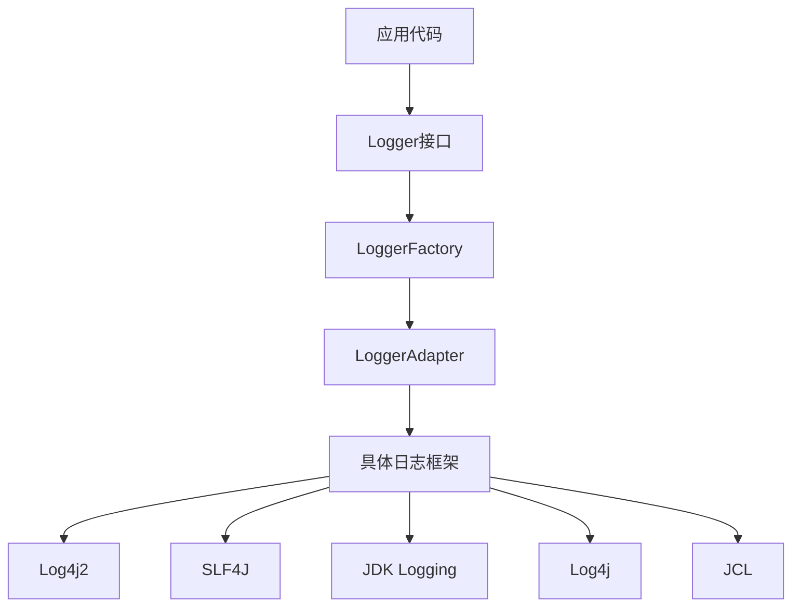
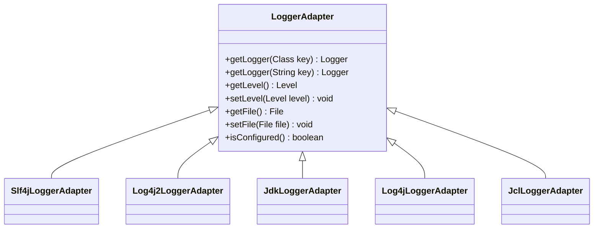
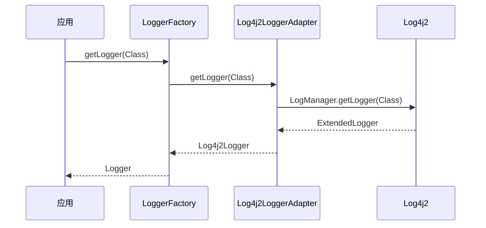
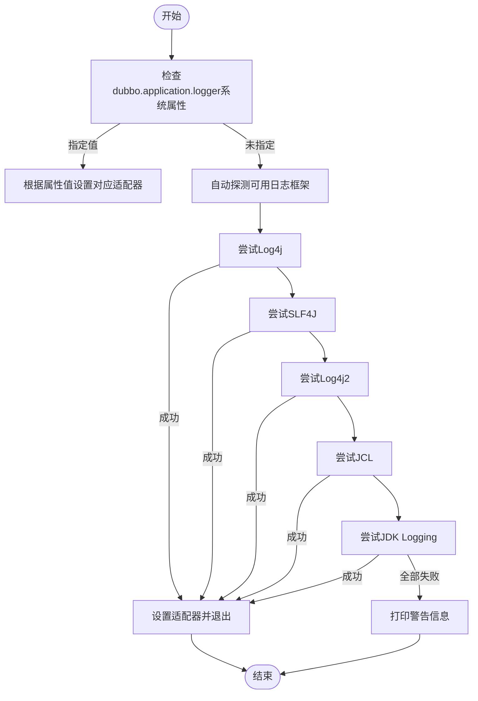
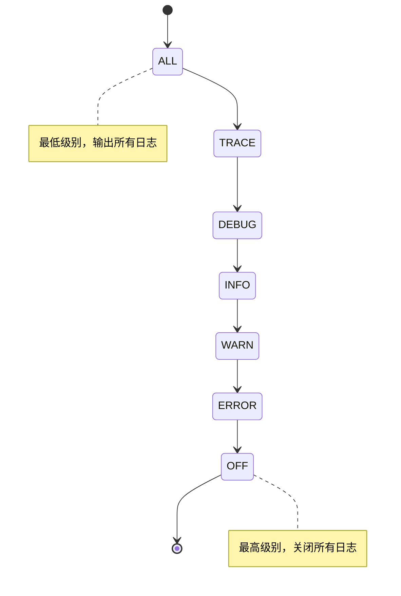
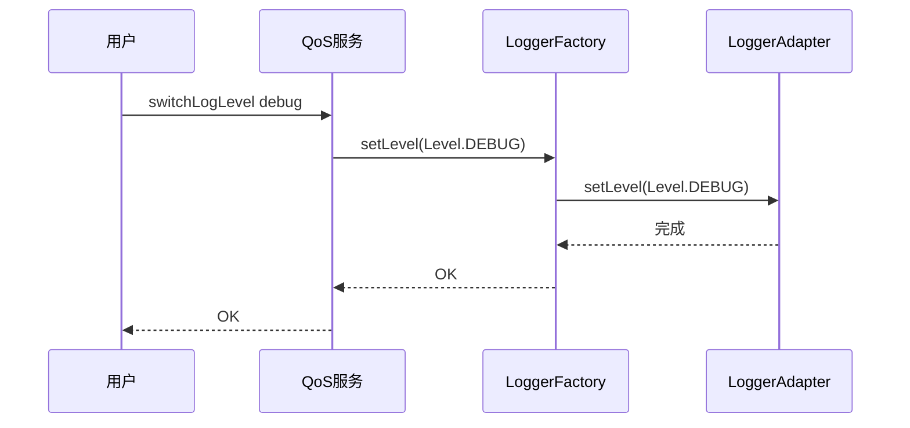
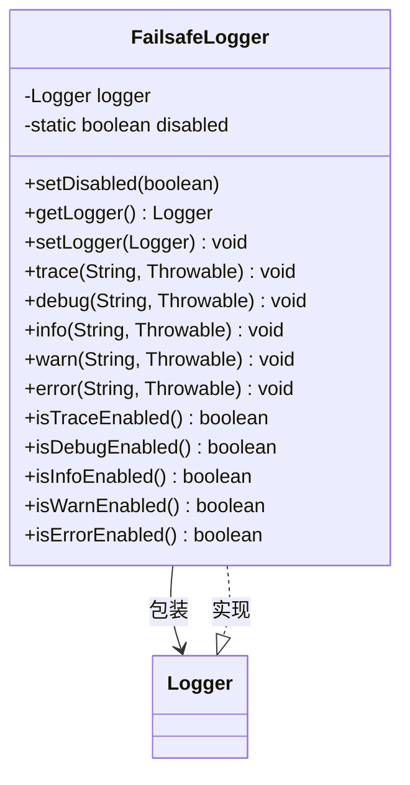

# 日志系统

<cite>
**本文档中引用的文件**  
- [LoggerFactory.java](file://dubbo-common\src\main\java\org\apache\dubbo\common\logger\LoggerFactory.java)
- [LoggerAdapter.java](file://dubbo-common\src\main\java\org\apache\dubbo\common\logger\LoggerAdapter.java)
- [Logger.java](file://dubbo-common\src\main\java\org\apache\dubbo\common\logger\Logger.java)
- [Level.java](file://dubbo-common\src\main\java\org\apache\dubbo\common\logger\Level.java)
- [Log4j2LoggerAdapter.java](file://dubbo-common\src\main\java\org\apache\dubbo\common\logger\log4j2\Log4j2LoggerAdapter.java)
- [Slf4jLoggerAdapter.java](file://dubbo-common\src\main\java\org\apache\dubbo\common\logger\slf4j\Slf4jLoggerAdapter.java)
- [JdkLoggerAdapter.java](file://dubbo-common\src\main\java\org\apache\dubbo\common\logger\jdk\JdkLoggerAdapter.java)
- [FailsafeLogger.java](file://dubbo-common\src\main\java\org\apache\dubbo\common\logger\support\FailsafeLogger.java)
- [org.apache.dubbo.common.logger.LoggerAdapter](file://dubbo-common\src\main\resources\META-INF\dubbo\internal\org.apache.dubbo.common.logger.LoggerAdapter)
</cite>

## 目录
1. [简介](#简介)
2. [日志抽象层架构](#日志抽象层架构)
3. [LoggerAdapter适配机制](#loggeradapter适配机制)
4. [LoggerFactory初始化过程](#loggerfactory初始化过程)
5. [日志级别与配置](#日志级别与配置)
6. [日志实例创建与使用](#日志实例创建与使用)
7. [日志输出机制](#日志输出机制)
8. [错误处理与容错机制](#错误处理与容错机制)
9. [自定义日志适配器](#自定义日志适配器)
10. [性能优化与高级特性](#性能优化与高级特性)

## 简介

Dubbo的日志系统提供了一个灵活且可扩展的日志抽象层，旨在支持多种日志框架的无缝集成。该系统通过统一的接口和适配器模式，实现了对不同日志实现的抽象，使开发者能够根据项目需求选择合适的日志框架。日志系统的核心组件包括LoggerAdapter、LoggerFactory和Logger接口，它们共同构成了一个完整的日志解决方案。

## 日志抽象层架构

Dubbo日志抽象层采用分层设计，主要包括三个核心组件：Logger接口、LoggerAdapter适配器和LoggerFactory工厂。这种设计模式实现了日志功能的解耦，使得上层应用无需关心底层日志实现的具体细节。



**图表来源**
- [LoggerFactory.java](file://dubbo-common\src\main\java\org\apache\dubbo\common\logger\LoggerFactory.java)
- [LoggerAdapter.java](file://dubbo-common\src\main\java\org\apache\dubbo\common\logger\LoggerAdapter.java)
- [Logger.java](file://dubbo-common\src\main\java\org\apache\dubbo\common\logger\Logger.java)

**本节来源**
- [LoggerFactory.java](file://dubbo-common\src\main\java\org\apache\dubbo\common\logger\LoggerFactory.java#L17-L298)
- [LoggerAdapter.java](file://dubbo-common\src\main\java\org\apache\dubbo\common\logger\LoggerAdapter.java#L1-L106)

## LoggerAdapter适配机制

LoggerAdapter是Dubbo日志系统的核心适配器接口，负责将Dubbo的统一日志接口映射到具体的日志框架实现。通过SPI（Service Provider Interface）机制，Dubbo支持多种日志框架的动态加载和切换。

### 适配器接口定义

LoggerAdapter接口定义了获取日志记录器、设置日志级别和日志文件等核心方法。所有具体的日志适配器都必须实现这个接口。



**图表来源**
- [LoggerAdapter.java](file://dubbo-common\src\main\java\org\apache\dubbo\common\logger\LoggerAdapter.java#L27-L106)
- [Slf4jLoggerAdapter.java](file://dubbo-common\src\main\java\org\apache\dubbo\common\logger\slf4j\Slf4jLoggerAdapter.java)
- [Log4j2LoggerAdapter.java](file://dubbo-common\src\main\java\org\apache\dubbo\common\logger\log4j2\Log4j2LoggerAdapter.java)
- [JdkLoggerAdapter.java](file://dubbo-common\src\main\java\org\apache\dubbo\common\logger\jdk\JdkLoggerAdapter.java)

### Log4j2适配器实现

Log4j2LoggerAdapter是针对Log4j2框架的具体实现，它通过LogManager获取日志记录器实例，并将Dubbo的日志级别映射到Log4j2的级别。



**图表来源**
- [Log4j2LoggerAdapter.java](file://dubbo-common\src\main\java\org\apache\dubbo\common\logger\log4j2\Log4j2LoggerAdapter.java#L29-L133)

### SLF4J适配器实现

Slf4jLoggerAdapter实现了SLF4J框架的适配，通过SLF4J的LoggerFactory获取具体的日志记录器实例。与其他适配器不同，SLF4J的级别设置是只读的，只能获取当前配置的级别。

**本节来源**
- [Slf4jLoggerAdapter.java](file://dubbo-common\src\main\java\org\apache\dubbo\common\logger\slf4j\Slf4jLoggerAdapter.java#L28-L94)

### JDK日志适配器实现

JdkLoggerAdapter适配了Java自带的java.util.logging框架。在初始化时，它会尝试加载classpath下的logging.properties配置文件，并检查FileHandler以确定日志输出文件。

**本节来源**
- [JdkLoggerAdapter.java](file://dubbo-common\src\main\java\org\apache\dubbo\common\logger\jdk\JdkLoggerAdapter.java#L30-L152)

## LoggerFactory初始化过程

LoggerFactory是日志系统的工厂类，负责日志适配器的初始化和日志记录器的创建。其初始化过程在静态代码块中完成，通过系统属性和自动探测机制确定最终使用的日志框架。

### 初始化流程



**图表来源**
- [LoggerFactory.java](file://dubbo-common\src\main\java\org\apache\dubbo\common\logger\LoggerFactory.java#L52-L122)

### 自动探测机制

当未通过系统属性指定日志框架时，LoggerFactory会按照预定义的优先级顺序（Log4j、SLF4J、Log4j2、JCL、JDK）依次尝试加载各个日志框架。对于每个候选框架，会创建适配器实例并调用getLogger方法，如果成功且isConfigured()返回true，则选择该框架。

**本节来源**
- [LoggerFactory.java](file://dubbo-common\src\main\java\org\apache\dubbo\common\logger\LoggerFactory.java#L72-L96)

### SPI配置

Dubbo通过SPI机制配置可用的日志适配器，相关配置位于META-INF/dubbo/internal/org.apache.dubbo.common.logger.LoggerAdapter文件中，定义了各个适配器的名称和实现类。

**本节来源**
- [org.apache.dubbo.common.logger.LoggerAdapter](file://dubbo-common\src\main\resources\META-INF\dubbo\internal\org.apache.dubbo.common.logger.LoggerAdapter)

## 日志级别与配置

Dubbo定义了一套统一的日志级别系统，支持从ALL到OFF的多个级别，满足不同场景下的日志输出需求。

### 日志级别定义



**图表来源**
- [Level.java](file://dubbo-common\src\main\java\org\apache\dubbo\common\logger\Level.java#L22-L58)

### 级别使用场景

| 日志级别 | 使用场景 | 配置方法 |
|---------|---------|---------|
| **ALL** | 调试所有信息，包括追踪信息 | `LoggerFactory.setLevel(Level.ALL)` |
| **TRACE** | 详细追踪信息，用于问题诊断 | `LoggerFactory.setLevel(Level.TRACE)` |
| **DEBUG** | 调试信息，开发阶段使用 | `LoggerFactory.setLevel(Level.DEBUG)` |
| **INFO** | 一般信息，运行状态报告 | `LoggerFactory.setLevel(Level.INFO)` |
| **WARN** | 警告信息，潜在问题提示 | `LoggerFactory.setLevel(Level.WARN)` |
| **ERROR** | 错误信息，异常和故障 | `LoggerFactory.setLevel(Level.ERROR)` |
| **OFF** | 关闭日志输出 | `LoggerFactory.setLevel(Level.OFF)` |

**本节来源**
- [Level.java](file://dubbo-common\src\main\java\org\apache\dubbo\common\logger\Level.java#L22-L58)
- [LoggerFactory.java](file://dubbo-common\src\main\java\org\apache\dubbo\common\logger\LoggerFactory.java#L230-L241)

### 动态级别切换

Dubbo支持通过QoS命令动态切换日志级别，无需重启应用即可调整日志输出详细程度。



**本节来源**
- [SwitchLogLevel.java](file://dubbo-plugin\dubbo-qos\src\main\java\org\apache\dubbo\qos\command\impl\SwitchLogLevel.java#L27-L67)

## 日志实例创建与使用

日志实例的创建和使用遵循工厂模式，通过LoggerFactory获取具体的Logger实例，然后进行日志记录操作。

### 实例创建流程

```mermaid
flowchart TD
A[应用请求日志记录器] --> B{LoggerFactory.getLogger()}
B --> C[检查缓存中是否存在]
C --> |存在| D[返回缓存实例]
C --> |不存在| E[创建FailsafeLogger]
E --> F[通过LoggerAdapter创建具体Logger]
F --> G[包装为FailsafeLogger]
G --> H[存入缓存]
H --> I[返回Logger实例]
D --> I
I --> J[应用使用Logger]
```

**图表来源**
- [LoggerFactory.java](file://dubbo-common\src\main\java\org\apache\dubbo\common\logger\LoggerFactory.java#L157-L171)
- [FailsafeLogger.java](file://dubbo-common\src\main\java\org\apache\dubbo\common\logger\support\FailsafeLogger.java#L23-L334)

### 基本使用示例

```java
// 获取日志记录器
Logger logger = LoggerFactory.getLogger(YourClass.class);

// 不同级别的日志输出
logger.trace("跟踪信息");
logger.debug("调试信息");
logger.info("一般信息");
logger.warn("警告信息");
logger.error("错误信息");

// 带参数的日志输出
logger.info("用户{}登录成功", username);

// 带异常的日志输出
try {
    // 业务逻辑
} catch (Exception e) {
    logger.error("处理请求失败", e);
}
```

**本节来源**
- [Logger.java](file://dubbo-common\src\main\java\org\apache\dubbo\common\logger\Logger.java#L24-L211)

## 日志输出机制

Dubbo的日志输出机制设计考虑了性能、可靠性和灵活性，确保在各种场景下都能稳定工作。

### 异步输出

虽然Dubbo的日志抽象层本身不直接提供异步输出功能，但可以通过底层日志框架的配置实现异步日志。例如，Log4j2可以通过AsyncAppender或AsyncLogger实现高性能的异步日志输出。

### 格式化机制

日志格式化由底层日志框架负责，Dubbo通过适配器将日志消息传递给具体框架，由框架根据配置的PatternLayout等格式化器进行格式化输出。

### 过滤机制

日志过滤主要通过日志框架的Level机制和Appender的过滤器实现。Dubbo的LoggerAdapter提供了基本的级别控制，复杂的过滤逻辑由底层框架的过滤器链处理。

**本节来源**
- [LoggerAdapter.java](file://dubbo-common\src\main\java\org\apache\dubbo\common\logger\LoggerAdapter.java#L68-L105)
- [Logger.java](file://dubbo-common\src\main\java\org\apache\dubbo\common\logger\Logger.java#L24-L211)

## 错误处理与容错机制

Dubbo日志系统内置了完善的错误处理和容错机制，确保在日志框架出现问题时不会影响主业务流程。

### FailsafeLogger设计

FailsafeLogger是Dubbo日志系统的核心容错组件，它包装了具体的日志记录器，提供了异常捕获和静默失败的能力。



**图表来源**
- [FailsafeLogger.java](file://dubbo-common\src\main\java\org\apache\dubbo\common\logger\support\FailsafeLogger.java#L23-L334)

### 异常处理策略

FailsafeLogger在每个日志方法中都包含了try-catch块，捕获所有异常并静默处理，确保即使日志框架出现严重问题，也不会影响业务代码的执行。

**本节来源**
- [FailsafeLogger.java](file://dubbo-common\src\main\java\org\apache\dubbo\common\logger\support\FailsafeLogger.java#L54-L334)

## 自定义日志适配器

Dubbo提供了扩展机制，允许开发者创建自定义的日志适配器以支持其他日志框架或特殊需求。

### 扩展步骤

1. 实现LoggerAdapter接口
2. 实现对应的Logger接口
3. 在META-INF/dubbo/internal/org.apache.dubbo.common.logger.LoggerAdapter中注册
4. 通过系统属性或配置指定使用自定义适配器

### 示例代码

```java
@SPI("custom")
public class CustomLoggerAdapter implements LoggerAdapter {
    private Level level;
    
    @Override
    public Logger getLogger(Class<?> key) {
        return new CustomLogger(key.getName());
    }
    
    @Override
    public Logger getLogger(String key) {
        return new CustomLogger(key);
    }
    
    @Override
    public Level getLevel() {
        return level;
    }
    
    @Override
    public void setLevel(Level level) {
        this.level = level;
    }
    
    @Override
    public File getFile() {
        return null;
    }
    
    @Override
    public void setFile(File file) {
        // 忽略
    }
}
```

**本节来源**
- [LoggerAdapter.java](file://dubbo-common\src\main\java\org\apache\dubbo\common\logger\LoggerAdapter.java#L27-L106)

## 性能优化与高级特性

Dubbo日志系统在设计时充分考虑了性能因素，提供了多种优化策略和高级特性。

### 性能优化

- **缓存机制**：LoggerFactory使用ConcurrentHashMap缓存已创建的日志记录器实例，避免重复创建
- **延迟初始化**：日志记录器在首次使用时才创建，减少启动开销
- **轻量级包装**：FailsafeLogger的异常处理开销极小，不影响正常日志输出性能

### 结构化输出

通过底层日志框架的MDC（Mapped Diagnostic Context）或ThreadContext功能，支持结构化日志输出，便于日志分析和追踪。

### 高级配置

- 可通过`-Ddubbo.application.logger`系统属性指定日志框架
- 支持在应用配置中指定日志框架
- 提供QoS命令行工具动态调整日志级别

**本节来源**
- [LoggerFactory.java](file://dubbo-common\src\main\java\org\apache\dubbo\common\logger\LoggerFactory.java#L46-L48)
- [LoggerFactory.java](file://dubbo-common\src\main\java\org\apache\dubbo\common\logger\LoggerFactory.java#L53-L71)