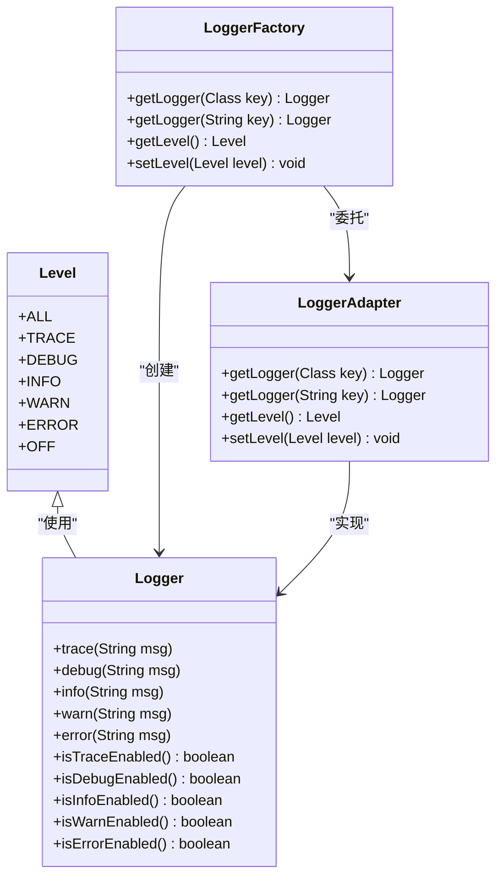
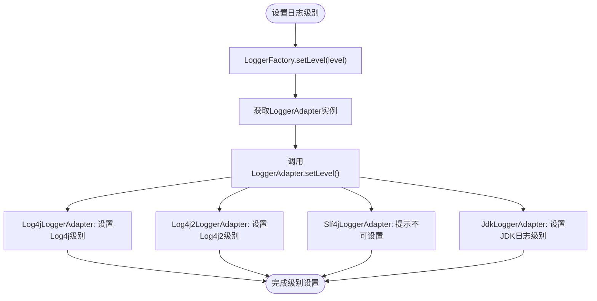
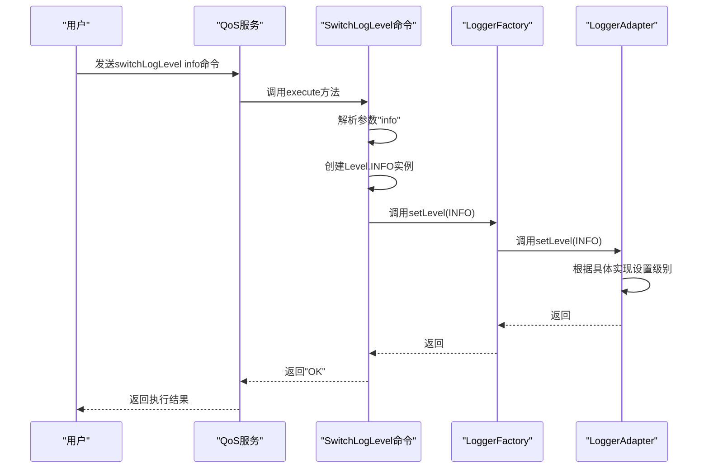
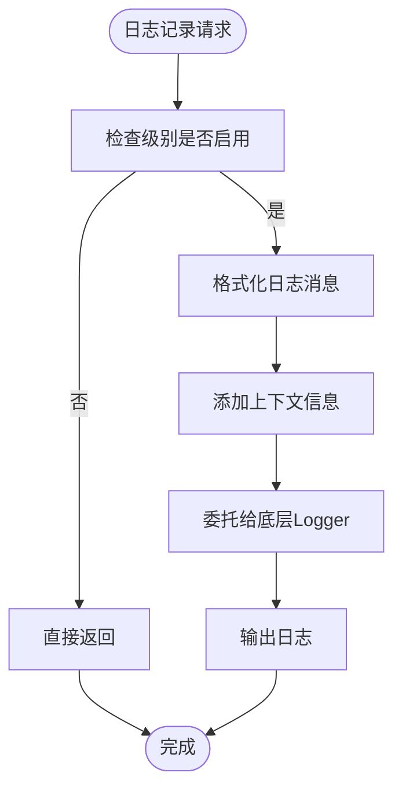
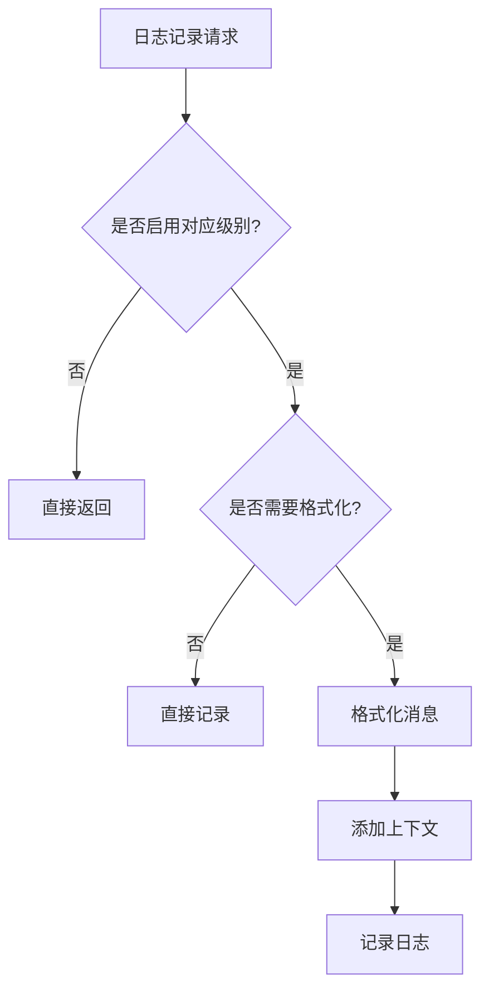

# 日志级别

<cite>
**本文档引用的文件**   
- [Level.java](file://dubbo-common\src\main\java\org\apache\dubbo\common\logger\Level.java)
- [Logger.java](file://dubbo-common\src\main\java\org\apache\dubbo\common\logger\Logger.java)
- [LoggerFactory.java](file://dubbo-common\src\main\java\org\apache\dubbo\common\logger\LoggerFactory.java)
- [LoggerAdapter.java](file://dubbo-common\src\main\java\org\apache\dubbo\common\logger\LoggerAdapter.java)
- [SwitchLogLevel.java](file://dubbo-plugin\dubbo-qos\src\main\java\org\apache\dubbo\qos\command\impl\SwitchLogLevel.java)
- [log4j2.xml](file://dubbo-demo\dubbo-demo-mcp-server\src\main\resources\log4j2.xml)
- [log4j2-test.xml](file://dubbo-common\src\test\resources\log4j2-test.xml)
</cite>

## 目录
1. [简介](#简介)
2. [日志级别设计](#日志级别设计)
3. [日志级别语义与适用场景](#日志级别语义与适用场景)
4. [级别优先级关系](#级别优先级关系)
5. [运行时动态调整日志级别](#运行时动态调整日志级别)
6. [日志过滤与性能优化](#日志过滤与性能优化)
7. [Dubbo应用中的配置示例](#dubbo应用中的配置示例)
8. [初学者使用指南](#初学者使用指南)
9. [高级特性使用方法](#高级特性使用方法)
10. [结论](#结论)

## 简介
本文档详细介绍了Dubbo框架中日志级别的设计和使用。重点分析了Level枚举类的设计原理，详细解释了DEBUG、INFO、WARN、ERROR等不同日志级别的语义和适用场景。文档还描述了级别之间的优先级关系，以及如何在运行时动态调整日志级别。同时，说明了级别在日志过滤和性能优化中的作用，以及如何通过合理设置级别来平衡调试信息和系统性能。提供了配置示例，展示如何在Dubbo应用中设置不同组件的日志级别。为初学者提供基本的日志级别使用指南，同时为经验丰富的开发者介绍级别与条件日志输出、采样日志等高级特性的结合使用方法。

## 日志级别设计
Dubbo框架中的日志级别通过`Level`枚举类实现，该类定义了从ALL到OFF的多个日志级别。这些级别按照优先级从高到低排列，形成了一个完整的日志记录体系。`Level`枚举类位于`org.apache.dubbo.common.logger`包中，是整个日志系统的核心组成部分。



**图源**
- [Level.java](file://dubbo-common\src\main\java\org\apache\dubbo\common\logger\Level.java#L22-L58)
- [Logger.java](file://dubbo-common\src\main\java\org\apache\dubbo\common\logger\Logger.java#L24-L210)
- [LoggerFactory.java](file://dubbo-common\src\main\java\org\apache\dubbo\common\logger\LoggerFactory.java#L44-L297)
- [LoggerAdapter.java](file://dubbo-common\src\main\java\org\apache\dubbo\common\logger\LoggerAdapter.java#L28-L105)

**本节来源**
- [Level.java](file://dubbo-common\src\main\java\org\apache\dubbo\common\logger\Level.java#L1-L58)
- [Logger.java](file://dubbo-common\src\main\java\org\apache\dubbo\common\logger\Logger.java#L1-L211)
- [LoggerFactory.java](file://dubbo-common\src\main\java\org\apache\dubbo\common\logger\LoggerFactory.java#L1-L298)
- [LoggerAdapter.java](file://dubbo-common\src\main\java\org\apache\dubbo\common\logger\LoggerAdapter.java#L1-L106)

## 日志级别语义与适用场景
Dubbo框架定义了七个日志级别，每个级别都有其特定的语义和适用场景：

- **ALL**: 最低级别，记录所有日志信息。主要用于开发和调试阶段，生产环境中通常不使用。
- **TRACE**: 比DEBUG更详细的日志信息，用于追踪程序执行的详细路径。适用于需要深入了解程序执行流程的场景。
- **DEBUG**: 调试信息，用于开发和问题排查。记录程序执行的关键步骤和变量值，帮助开发者理解程序运行状态。
- **INFO**: 一般信息，记录程序正常运行的关键事件。如服务启动、配置加载等，用于监控系统运行状态。
- **WARN**: 警告信息，记录可能存在问题但不影响程序继续运行的情况。如配置项缺失、性能瓶颈等。
- **ERROR**: 错误信息，记录导致程序功能异常的错误。如异常抛出、服务调用失败等，需要及时处理。
- **OFF**: 最高级别，关闭所有日志输出。用于性能敏感的生产环境，或在问题排查完成后临时关闭日志。

这些级别通过`Logger`接口的方法体现，每个级别都有对应的日志记录方法和启用状态检查方法。例如，`debug(String msg)`方法用于记录DEBUG级别的日志，而`isDebugEnabled()`方法用于检查DEBUG级别是否启用。

**本节来源**
- [Level.java](file://dubbo-common\src\main\java\org\apache\dubbo\common\logger\Level.java#L22-L58)
- [Logger.java](file://dubbo-common\src\main\java\org\apache\dubbo\common\logger\Logger.java#L24-L210)

## 级别优先级关系
日志级别之间存在明确的优先级关系，从高到低依次为：OFF > ERROR > WARN > INFO > DEBUG > TRACE > ALL。这种优先级关系决定了日志的过滤机制：当设置某个级别时，只有该级别及更高级别的日志会被记录。

例如，当设置日志级别为WARN时，只有WARN和ERROR级别的日志会被输出，而INFO、DEBUG、TRACE级别的日志将被过滤掉。这种设计使得开发者可以根据需要灵活控制日志输出量，在调试时使用较低级别以获取更多细节，在生产环境中使用较高级别以减少日志量。

优先级关系在`LoggerFactory`和`LoggerAdapter`的实现中得到体现。`LoggerFactory`作为日志系统的入口，通过`setLevel(Level level)`方法设置全局日志级别，该设置会传递给底层的`LoggerAdapter`实现。不同的日志框架适配器（如Log4j、Log4j2、SLF4J等）会根据这个级别进行相应的配置。



**图源**
- [LoggerFactory.java](file://dubbo-common\src\main\java\org\apache\dubbo\common\logger\LoggerFactory.java#L239-L241)
- [LoggerAdapter.java](file://dubbo-common\src\main\java\org\apache\dubbo\common\logger\LoggerAdapter.java#L80-L81)
- [Log4jLoggerAdapter.java](file://dubbo-common\src\main\java\org\apache\dubbo\common\logger\log4j\Log4jLoggerAdapter.java#L131-L132)
- [Log4j2LoggerAdapter.java](file://dubbo-common\src\main\java\org\apache\dubbo\common\logger\log4j2\Log4j2LoggerAdapter.java#L115-L116)
- [Slf4jLoggerAdapter.java](file://dubbo-common\src\main\java\org\apache\dubbo\common\logger\slf4j\Slf4jLoggerAdapter.java#L70-L71)
- [JdkLoggerAdapter.java](file://dubbo-common\src\main\java\org\apache\dubbo\common\logger\jdk\JdkLoggerAdapter.java#L131-L132)

**本节来源**
- [Level.java](file://dubbo-common\src\main\java\org\apache\dubbo\common\logger\Level.java#L22-L58)
- [LoggerFactory.java](file://dubbo-common\src\main\java\org\apache\dubbo\common\logger\LoggerFactory.java#L239-L241)
- [LoggerAdapter.java](file://dubbo-common\src\main\java\org\apache\dubbo\common\logger\LoggerAdapter.java#L80-L81)

## 运行时动态调整日志级别
Dubbo框架支持在运行时动态调整日志级别，这对于生产环境的问题排查非常有用。通过QoS（Quality of Service）命令`switchLogLevel`，可以在不重启应用的情况下修改日志级别。

`SwitchLogLevel`命令实现了`BaseCommand`接口，通过`execute`方法处理日志级别切换请求。该命令支持数字和字符串两种格式的参数，数字0-6对应ALL到OFF级别，字符串则直接对应级别名称。命令执行时，会调用`LoggerFactory.setLevel(level)`方法设置新的日志级别。



**图源**
- [SwitchLogLevel.java](file://dubbo-plugin\dubbo-qos\src\main\java\org\apache\dubbo\qos\command\impl\SwitchLogLevel.java#L32-L67)
- [LoggerFactory.java](file://dubbo-common\src\main\java\org\apache\dubbo\common\logger\LoggerFactory.java#L239-L241)
- [LoggerAdapter.java](file://dubbo-common\src\main\java\org\apache\dubbo\common\logger\LoggerAdapter.java#L80-L81)

**本节来源**
- [SwitchLogLevel.java](file://dubbo-plugin\dubbo-qos\src\main\java\org\apache\dubbo\qos\command\impl\SwitchLogLevel.java#L27-L67)
- [LoggerFactory.java](file://dubbo-common\src\main\java\org\apache\dubbo\common\logger\LoggerFactory.java#L239-L241)

## 日志过滤与性能优化
日志级别在日志过滤和性能优化中起着关键作用。通过合理设置日志级别，可以在获取必要调试信息的同时，最大限度地减少对系统性能的影响。

Dubbo通过`FailsafeLogger`包装器实现日志性能优化。`FailsafeLogger`在记录日志前会先检查对应级别的日志是否启用，只有在启用的情况下才会调用底层日志实现。这种设计避免了不必要的字符串拼接和方法调用开销。



此外，Dubbo还提供了`LoggerInfo`命令，用于查看当前日志配置信息，包括可用的日志适配器、当前使用的适配器和日志级别。这对于诊断日志配置问题非常有帮助。

**图源**
- [FailsafeLogger.java](file://dubbo-common\src\main\java\org\apache\dubbo\common\logger\support\FailsafeLogger.java#L55-L274)
- [LoggerInfo.java](file://dubbo-plugin\dubbo-qos\src\main\java\org\apache\dubbo\qos\command\impl\LoggerInfo.java#L30-L39)

**本节来源**
- [FailsafeLogger.java](file://dubbo-common\src\main\java\org\apache\dubbo\common\logger\support\FailsafeLogger.java#L1-L334)
- [LoggerInfo.java](file://dubbo-plugin\dubbo-qos\src\main\java\org\apache\dubbo\qos\command\impl\LoggerInfo.java#L1-L40)

## Dubbo应用中的配置示例
在Dubbo应用中，可以通过配置文件设置日志级别。以下是一个典型的log4j2.xml配置示例：

```xml
<Configuration status="WARN">
    <Appenders>
        <Console name="Console" target="SYSTEM_OUT" follow="true">
            <PatternLayout pattern="%style{%d{HH:mm:ss.SSS}}{Magenta} %style{|-}{White}%highlight{%-5p} [%t] %style{%40.40c}{Cyan}:%style{%-3L}{Blue} %style{-|}{White} %m%n%rEx{filters(jdk.internal.reflect,java.lang.reflect,sun.reflect)}" disableAnsi="false" charset="UTF-8"/>
        </Console>
    </Appenders>
    <Loggers>
        <Root level="info">
            <AppenderRef ref="Console"/>
        </Root>
        <Logger name="org.apache.dubbo.rpc.protocol.tri" level="debug"/>
        <Logger name="org.apache.dubbo.remoting.http12" level="debug"/>
        <Logger name="org.apache.dubbo.config" level="warn"/>
    </Loggers>
</Configuration>
```

在这个配置中：
- 根日志级别设置为info，这意味着只有INFO及以上级别的日志会被记录
- `org.apache.dubbo.rpc.protocol.tri`和`org.apache.dubbo.remoting.http12`包的日志级别设置为debug，用于调试特定组件
- `org.apache.dubbo.config`包的日志级别设置为warn，减少配置相关的日志输出

**本节来源**
- [log4j2.xml](file://dubbo-demo\dubbo-demo-mcp-server\src\main\resources\log4j2.xml#L1-L33)
- [log4j2-test.xml](file://dubbo-common\src\test\resources\log4j2-test.xml#L1-L30)

## 初学者使用指南
对于初学者，建议遵循以下日志级别使用原则：

1. **开发阶段**：使用DEBUG级别，以便获取足够的调试信息
2. **测试阶段**：使用INFO级别，记录关键的业务流程信息
3. **生产阶段**：使用WARN或ERROR级别，只记录重要的警告和错误信息

基本的使用方法如下：
- 使用`LoggerFactory.getLogger(Class<?> key)`获取日志记录器
- 根据需要选择合适的日志级别方法（debug、info、warn、error）
- 在记录日志前，使用`isDebugEnabled()`等方法检查级别是否启用，避免不必要的性能开销

```java
Logger logger = LoggerFactory.getLogger(MyClass.class);
if (logger.isDebugEnabled()) {
    logger.debug("Processing request: " + request);
}
```

**本节来源**
- [LoggerFactory.java](file://dubbo-common\src\main\java\org\apache\dubbo\common\logger\LoggerFactory.java#L157-L171)
- [Logger.java](file://dubbo-common\src\main\java\org\apache\dubbo\common\logger\Logger.java#L61-L64)

## 高级特性使用方法
对于经验丰富的开发者，可以结合以下高级特性使用日志级别：

1. **条件日志输出**：利用`isDebugEnabled()`等方法实现条件日志输出，避免在日志级别关闭时执行昂贵的日志消息构建操作
2. **采样日志**：对于高频日志，可以实现采样机制，只记录部分日志以减少日志量
3. **多适配器支持**：Dubbo支持多种日志框架适配器，可以根据需要选择合适的日志实现
4. **运行时调整**：通过QoS命令在运行时动态调整日志级别，便于生产环境的问题排查



**图源**
- [FailsafeLogger.java](file://dubbo-common\src\main\java\org\apache\dubbo\common\logger\support\FailsafeLogger.java#L55-L274)
- [SwitchLogLevel.java](file://dubbo-plugin\dubbo-qos\src\main\java\org\apache\dubbo\qos\command\impl\SwitchLogLevel.java#L32-L67)

**本节来源**
- [FailsafeLogger.java](file://dubbo-common\src\main\java\org\apache\dubbo\common\logger\support\FailsafeLogger.java#L1-L334)
- [SwitchLogLevel.java](file://dubbo-plugin\dubbo-qos\src\main\java\org\apache\dubbo\qos\command\impl\SwitchLogLevel.java#L27-L67)

## 结论
Dubbo框架的日志级别设计充分考虑了实际使用场景的需求，提供了灵活的日志控制机制。通过`Level`枚举类定义了清晰的日志级别体系，结合`LoggerFactory`和`LoggerAdapter`实现了对多种日志框架的统一抽象。运行时动态调整功能使得生产环境的问题排查更加便捷，而`FailsafeLogger`等优化措施则确保了日志系统对应用性能的影响最小化。合理使用日志级别，可以在获取必要调试信息的同时，保持系统的高性能运行。