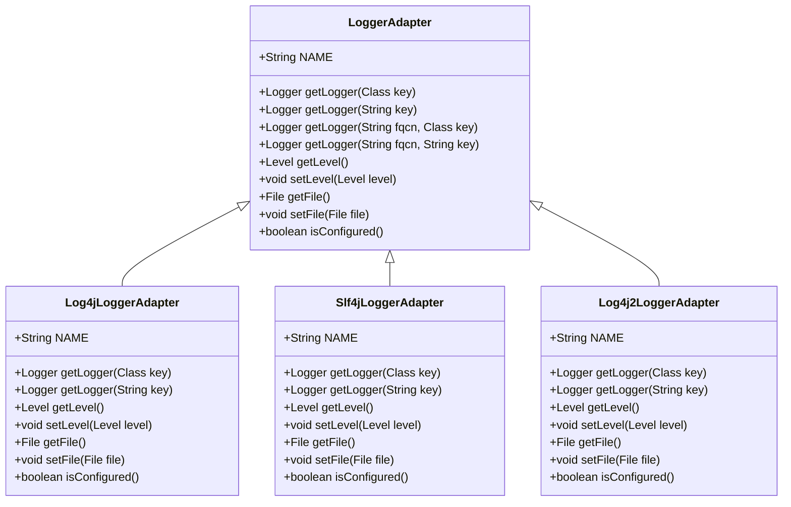
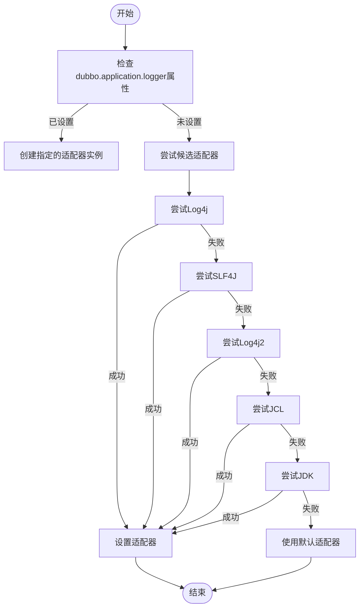
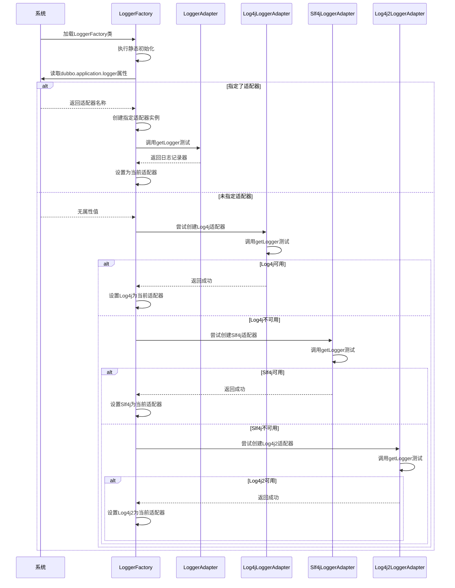
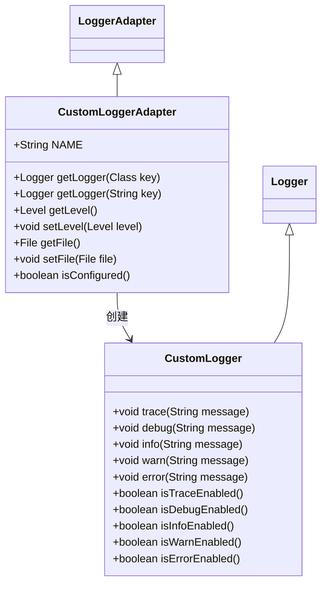
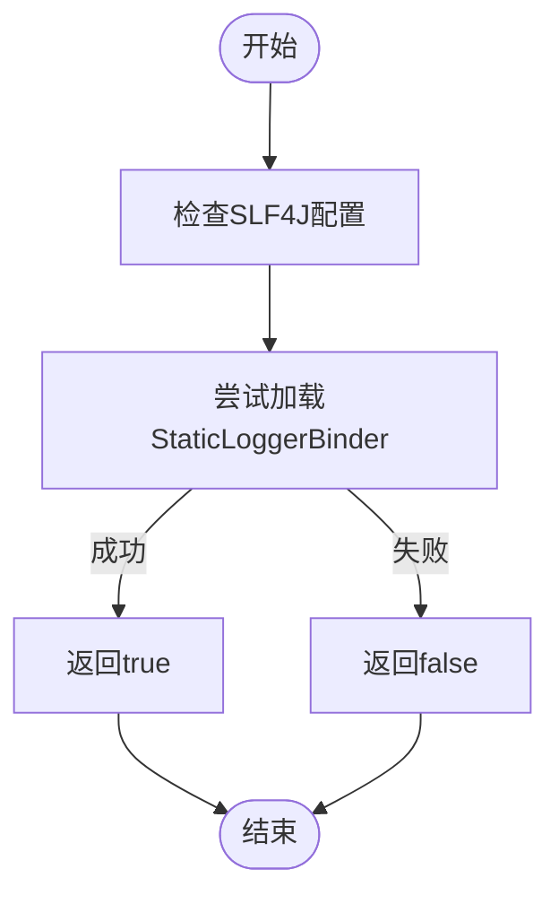
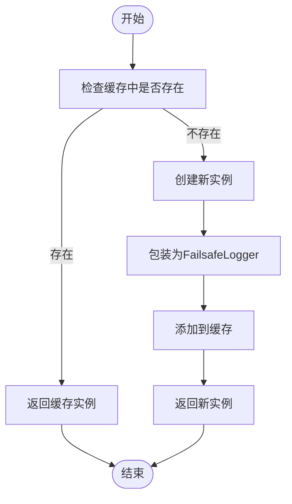

# 日志适配器

<cite>
**本文档引用的文件**  
- [LoggerAdapter.java](file://dubbo-common\src\main\java\org\apache\dubbo\common\logger\LoggerAdapter.java)
- [LoggerFactory.java](file://dubbo-common\src\main\java\org\apache\dubbo\common\logger\LoggerFactory.java)
- [Log4jLoggerAdapter.java](file://dubbo-common\src\main\java\org\apache\dubbo\common\logger\log4j\Log4jLoggerAdapter.java)
- [Slf4jLoggerAdapter.java](file://dubbo-common\src\main\java\org\apache\dubbo\common\logger\slf4j\Slf4jLoggerAdapter.java)
- [Log4j2LoggerAdapter.java](file://dubbo-common\src\main\java\org\apache\dubbo\common\logger\log4j2\Log4j2LoggerAdapter.java)
- [JclLoggerAdapter.java](file://dubbo-common\src\main\java\org\apache\dubbo\common\logger\jcl\JclLoggerAdapter.java)
- [JdkLoggerAdapter.java](file://dubbo-common\src\main\java\org\apache\dubbo\common\logger\jdk\JdkLoggerAdapter.java)
- [LoggerAdapterTest.java](file://dubbo-common\src\test\java\org\apache\dubbo\common\logger\LoggerAdapterTest.java)
- [org.apache.dubbo.common.logger.LoggerAdapter](file://dubbo-common\src\main\resources\META-INF\dubbo\internal\org.apache.dubbo.common.logger.LoggerAdapter)
</cite>

## 目录
1. [引言](#引言)
2. [日志适配器设计原理](#日志适配器设计原理)
3. [核心接口与实现](#核心接口与实现)
4. [SPI扩展机制与发现流程](#spi扩展机制与发现流程)
5. [适配器初始化流程](#适配器初始化流程)
6. [自定义适配器实现](#自定义适配器实现)
7. [兼容性处理机制](#兼容性处理机制)
8. [使用示例](#使用示例)
9. [高级定制方案](#高级定制方案)
10. [结论](#结论)

## 引言
Dubbo框架提供了灵活的日志适配器机制，通过抽象层统一适配多种日志框架，包括Log4j、SLF4J、Log4j2等。这种设计使得Dubbo可以在不同环境中无缝集成各种日志系统，为开发者提供了极大的灵活性。本文档将深入探讨日志适配器的设计原理、实现机制和使用方法，帮助开发者理解和应用这一重要功能。

## 日志适配器设计原理
日志适配器的核心设计原理是通过抽象层隔离Dubbo框架与具体日志实现的耦合。`LoggerAdapter`接口作为抽象层，定义了日志系统的基本操作规范，包括获取日志记录器、设置日志级别和获取日志文件等功能。这种设计模式遵循了依赖倒置原则，使得Dubbo框架不依赖于任何具体的日志实现，而是依赖于抽象接口。

适配器模式的应用使得不同日志框架可以通过实现`LoggerAdapter`接口来适配Dubbo框架。每个具体的日志框架都有对应的适配器实现，如`Log4jLoggerAdapter`、`Slf4jLoggerAdapter`等。这些适配器负责将Dubbo的日志调用转换为对应日志框架的API调用，实现了日志功能的统一访问。

**节来源**
- [LoggerAdapter.java](file://dubbo-common\src\main\java\org\apache\dubbo\common\logger\LoggerAdapter.java#L27-L105)

## 核心接口与实现
`LoggerAdapter`接口是日志适配器体系的核心，定义了所有日志适配器必须实现的方法。接口中的主要方法包括`getLogger`用于获取日志记录器，`getLevel`和`setLevel`用于获取和设置日志级别，以及`getFile`和`setFile`用于获取和设置日志文件。



**图来源**  
- [LoggerAdapter.java](file://dubbo-common\src\main\java\org\apache\dubbo\common\logger\LoggerAdapter.java#L27-L105)
- [Log4jLoggerAdapter.java](file://dubbo-common\src\main\java\org\apache\dubbo\common\logger\log4j\Log4jLoggerAdapter.java#L30-L169)
- [Slf4jLoggerAdapter.java](file://dubbo-common\src\main\java\org\apache\dubbo\common\logger\slf4j\Slf4jLoggerAdapter.java#L28-L93)
- [Log4j2LoggerAdapter.java](file://dubbo-common\src\main\java\org\apache\dubbo\common\logger\log4j2\Log4j2LoggerAdapter.java#L29-L132)

**节来源**
- [LoggerAdapter.java](file://dubbo-common\src\main\java\org\apache\dubbo\common\logger\LoggerAdapter.java#L27-L105)

## SPI扩展机制与发现流程
Dubbo日志适配器采用SPI（Service Provider Interface）扩展机制来实现动态加载。在`META-INF/dubbo/internal/org.apache.dubbo.common.logger.LoggerAdapter`配置文件中，定义了各个日志适配器的实现类映射：

```
slf4j=org.apache.dubbo.common.logger.slf4j.Slf4jLoggerAdapter
jcl=org.apache.dubbo.common.logger.jcl.JclLoggerAdapter
log4j=org.apache.dubbo.common.logger.log4j.Log4jLoggerAdapter
jdk=org.apache.dubbo.common.logger.jdk.JdkLoggerAdapter
log4j2=org.apache.dubbo.common.logger.log4j2.Log4j2LoggerAdapter
```

适配器的发现流程始于`LoggerFactory`的静态初始化块。系统首先检查`dubbo.application.logger`系统属性，如果指定了特定的日志适配器，则直接使用该适配器。如果没有指定，则按照预定义的优先级顺序（Log4j、SLF4J、Log4j2、JCL、JDK）依次尝试加载各个适配器。



**图来源**  
- [org.apache.dubbo.common.logger.LoggerAdapter](file://dubbo-common\src\main\resources\META-INF\dubbo\internal\org.apache.dubbo.common.logger.LoggerAdapter)
- [LoggerFactory.java](file://dubbo-common\src\main\java\org\apache\dubbo\common\logger\LoggerFactory.java#L51-L121)

**节来源**
- [LoggerFactory.java](file://dubbo-common\src\main\java\org\apache\dubbo\common\logger\LoggerFactory.java#L51-L121)

## 适配器初始化流程
日志适配器的初始化流程在Dubbo启动过程中自动完成。当`LoggerFactory`类被加载时，其静态初始化块会执行适配器的选择和初始化逻辑。初始化流程首先尝试从系统属性中获取用户指定的日志适配器名称，如果找到匹配的适配器则直接使用。

如果未指定特定适配器，系统会按照预定义的优先级顺序遍历候选适配器列表。对于每个候选适配器，系统会尝试创建其实例并调用`getLogger`方法进行测试。如果适配器能够成功创建日志记录器并且`isConfigured`方法返回true，则认为该适配器已正确配置，将其设置为当前使用的适配器。



**图来源**  
- [LoggerFactory.java](file://dubbo-common\src\main\java\org\apache\dubbo\common\logger\LoggerFactory.java#L51-L121)

**节来源**
- [LoggerFactory.java](file://dubbo-common\src\main\java\org\apache\dubbo\common\logger\LoggerFactory.java#L51-L121)

## 自定义适配器实现
开发者可以实现自定义的日志适配器来集成其他日志框架。要创建自定义适配器，需要实现`LoggerAdapter`接口并提供必要的功能。以下是一个自定义适配器的基本实现框架：



实现`getLogger`方法时，需要将Dubbo的类或字符串标识转换为底层日志框架的对应日志记录器。例如，在`Log4jLoggerAdapter`中，`getLogger`方法通过`LogManager.getLogger(key)`获取Log4j的日志记录器，并将其包装为`Log4jLogger`实例。

```java
@Override
public Logger getLogger(Class<?> key) {
    return new Log4jLogger(LogManager.getLogger(key));
}

@Override
public Logger getLogger(String key) {
    return new Log4jLogger(LogManager.getLogger(key));
}
```

设置日志级别时，需要在Dubbo的`Level`枚举和底层日志框架的级别之间进行转换。每个适配器都提供了相应的转换方法，如`Log4jLoggerAdapter`中的`toLog4jLevel`和`fromLog4jLevel`方法。

**图来源**  
- [Log4jLoggerAdapter.java](file://dubbo-common\src\main\java\org\apache\dubbo\common\logger\log4j\Log4jLoggerAdapter.java#L104-L122)
- [Slf4jLoggerAdapter.java](file://dubbo-common\src\main\java\org\apache\dubbo\common\logger\slf4j\Slf4jLoggerAdapter.java#L40-L58)

**节来源**
- [Log4jLoggerAdapter.java](file://dubbo-common\src\main\java\org\apache\dubbo\common\logger\log4j\Log4jLoggerAdapter.java#L104-L122)

## 兼容性处理机制
日志适配器的兼容性处理机制确保了在不同环境下的稳定运行。`isConfigured`方法是兼容性检查的关键，它用于判断适配器是否已正确配置。例如，`Slf4jLoggerAdapter`通过检查`org.slf4j.impl.StaticLoggerBinder`类是否存在来确定SLF4J是否已正确配置。



对于日志级别设置，不同日志框架的级别定义可能存在差异。适配器通过转换方法处理这些差异，确保在不同框架间的一致性。例如，JDK日志框架没有直接的TRACE级别，`JdkLoggerAdapter`将其映射到`FINER`级别。

当无法找到合适的日志适配器时，系统会尝试加载任何可用的适配器，并在控制台输出警告信息。如果所有适配器都无法使用，系统会输出错误信息，提示用户配置日志框架。

**图来源**  
- [Slf4jLoggerAdapter.java](file://dubbo-common\src\main\java\org\apache\dubbo\common\logger\slf4j\Slf4jLoggerAdapter.java#L84-L91)
- [JdkLoggerAdapter.java](file://dubbo-common\src\main\java\org\apache\dubbo\common\logger\jdk\JdkLoggerAdapter.java#L148-L149)

**节来源**
- [Slf4jLoggerAdapter.java](file://dubbo-common\src\main\java\org\apache\dubbo\common\logger\slf4j\Slf4jLoggerAdapter.java#L84-L91)

## 使用示例
对于初学者，使用日志适配器非常简单。通常情况下，无需任何配置，Dubbo会自动选择合适的日志适配器。如果需要指定特定的日志框架，可以通过系统属性进行设置：

```java
// 通过系统属性指定日志适配器
System.setProperty("dubbo.application.logger", "slf4j");
```

在代码中使用日志功能时，通过`LoggerFactory`获取日志记录器：

```java
import org.apache.dubbo.common.logger.Logger;
import org.apache.dubbo.common.logger.LoggerFactory;

public class Example {
    private static final Logger logger = LoggerFactory.getLogger(Example.class);
    
    public void doSomething() {
        logger.info("执行操作");
        logger.debug("调试信息");
    }
}
```

也可以通过编程方式设置日志适配器：

```java
// 设置日志级别
LoggerFactory.setLevel(Level.DEBUG);

// 获取当前使用的适配器名称
String adapterName = LoggerFactory.getCurrentAdapter();

// 获取可用的适配器列表
List<String> availableAdapters = LoggerFactory.getAvailableAdapter();
```

**节来源**
- [LoggerFactory.java](file://dubbo-common\src\main\java\org\apache\dubbo\common\logger\LoggerFactory.java#L157-L171)

## 高级定制方案
对于经验丰富的开发者，可以进行更高级的适配器定制。性能优化方面，可以考虑缓存日志记录器实例，避免重复创建。异常处理方面，适配器应该优雅地处理底层日志框架可能出现的异常，确保不会影响主业务流程。



在实现自定义适配器时，应该充分考虑线程安全性和性能影响。可以参考现有适配器的实现，特别是错误处理和资源管理方面的最佳实践。同时，应该提供充分的测试用例，确保适配器在各种场景下的稳定性和可靠性。

**图来源**  
- [LoggerFactory.java](file://dubbo-common\src\main\java\org\apache\dubbo\common\logger\LoggerFactory.java#L158-L159)

**节来源**
- [LoggerFactory.java](file://dubbo-common\src\main\java\org\apache\dubbo\common\logger\LoggerFactory.java#L158-L159)

## 结论
Dubbo的日志适配器机制通过抽象层设计和SPI扩展机制，实现了对多种日志框架的统一支持。这种设计不仅提高了框架的灵活性和可扩展性，还为开发者提供了便捷的日志集成方案。通过深入理解适配器的设计原理和实现机制，开发者可以更好地利用这一功能，为应用程序提供稳定可靠的日志支持。