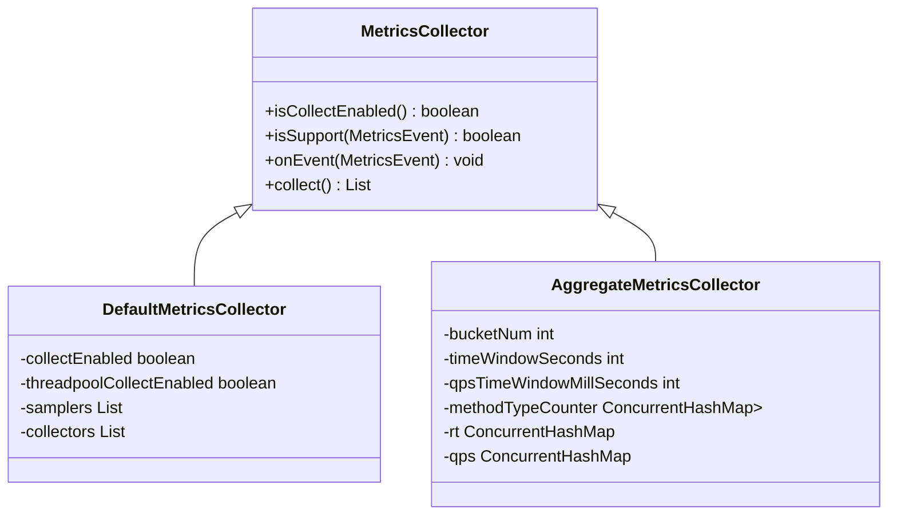
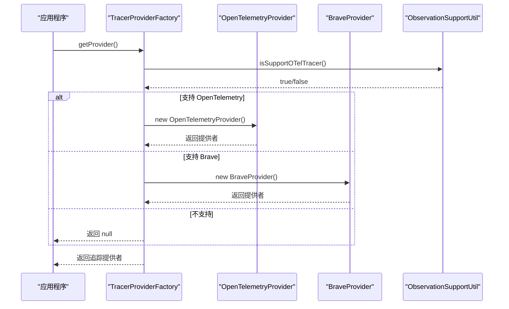
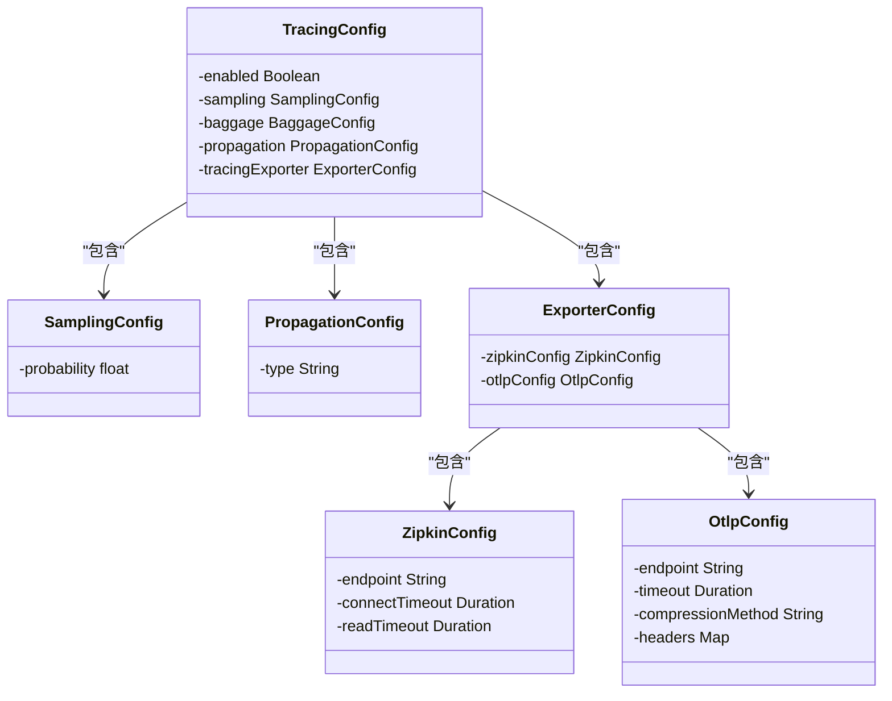
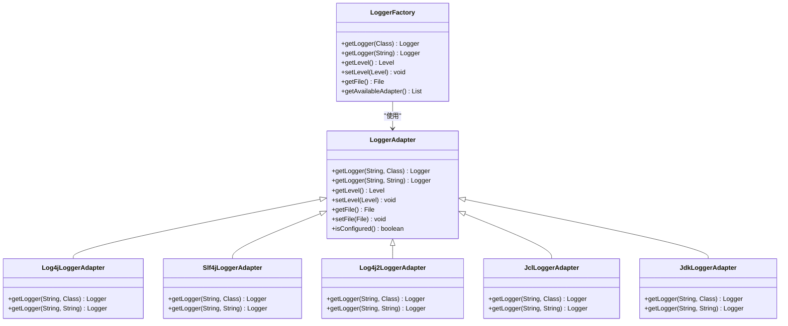
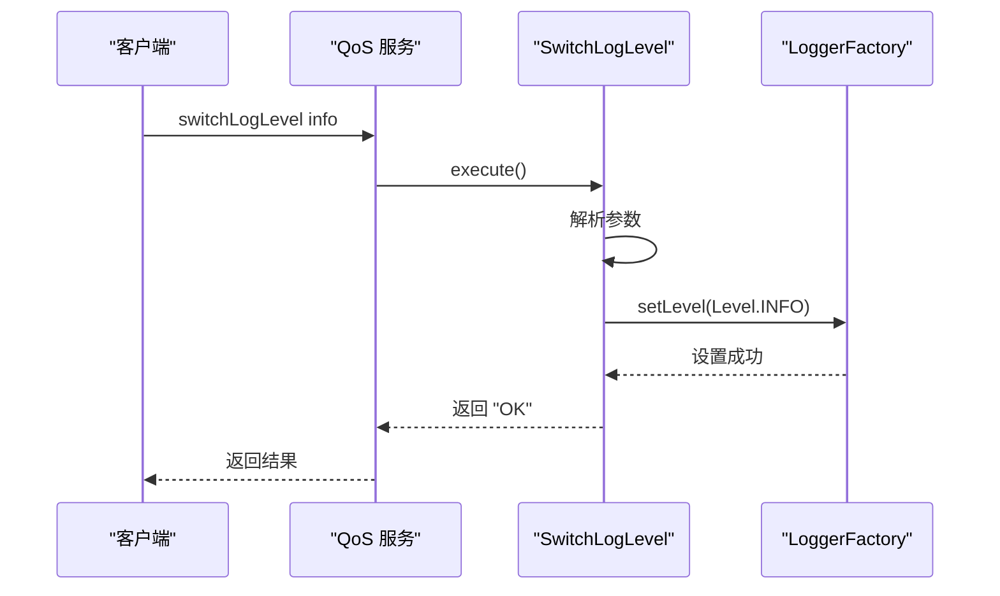
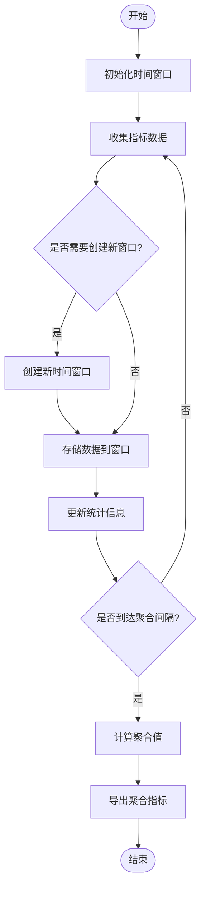
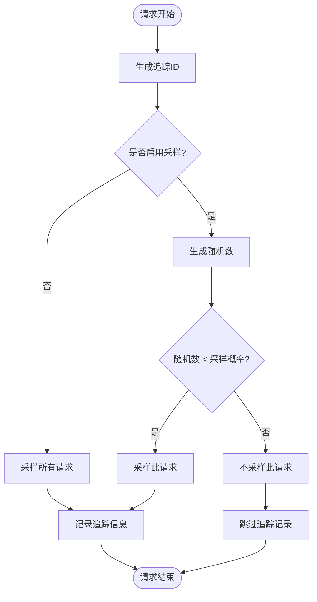
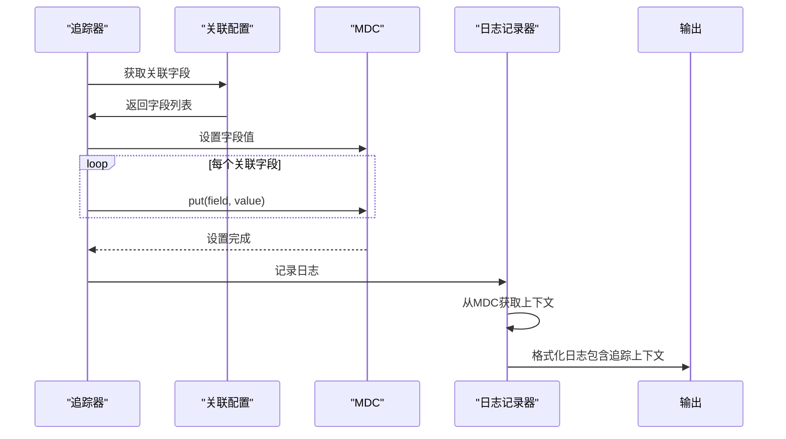

# 监控与追踪

<cite>
**本文档引用文件**  
- [ExporterConfig.java](file://dubbo-common\src\main\java\org\apache\dubbo\config\nested\ExporterConfig.java)
- [ObservationSupportUtil.java](file://dubbo-metrics\dubbo-tracing\src\main\java\org\apache\dubbo\tracing\utils\ObservationSupportUtil.java)
- [dubbo.xsd](file://dubbo-config\dubbo-config-spring\src\main\resources\META-INF\dubbo.xsd)
- [dubbo-tracing\pom.xml](file://dubbo-metrics\dubbo-tracing\pom.xml)
- [LoggerFactory.java](file://dubbo-common\src\main\java\org\apache\dubbo\common\logger\LoggerFactory.java)
- [SwitchLogLevel.java](file://dubbo-plugin\dubbo-qos\src\main\java\org\apache\dubbo\qos\command\impl\SwitchLogLevel.java)
- [MonitorFilter.java](file://dubbo-metrics\dubbo-metrics-default\src\main\java\org\apache\dubbo\monitor\support\MonitorFilter.java)
- [RequestEvent.java](file://dubbo-metrics\dubbo-metrics-default\src\main\java\org\apache\dubbo\metrics\event\RequestEvent.java)
- [PropagationType.java](file://dubbo-metrics\dubbo-tracing\src\main\java\org\apache\dubbo\tracing\utils\PropagationType.java)
- [TracingConfig.java](file://dubbo-common\src\main\java\org\apache\dubbo\config\TracingConfig.java)
- [OpenTelemetryProvider.java](file://dubbo-metrics\dubbo-tracing\src\main\java\org\apache\dubbo\tracing\tracer\otel\OpenTelemetryProvider.java)
- [BraveProvider.java](file://dubbo-metrics\dubbo-tracing\src\main\java\org\apache\dubbo\tracing\tracer\brave\BraveProvider.java)
- [DefaultMetricsCollector.java](file://dubbo-metrics\dubbo-metrics-default\src\main\java\org\apache\dubbo\metrics\collector\DefaultMetricsCollector.java)
- [AbstractMetricsReporter.java](file://dubbo-metrics\dubbo-metrics-default\src\main\java\org\apache\dubbo\metrics\report\AbstractMetricsReporter.java)
- [SamplingConfig.java](file://dubbo-common\src\main\java\org\apache\dubbo\config\nested\SamplingConfig.java)
- [TracerProviderFactory.java](file://dubbo-metrics\dubbo-tracing\src\main\java\org\apache\dubbo\tracing\tracer\TracerProviderFactory.java)
- [AggregateMetricsCollector.java](file://dubbo-metrics\dubbo-metrics-default\src\main\java\org\apache\dubbo\metrics\collector\AggregateMetricsCollector.java)
</cite>

## 目录
1. [引言](#引言)
2. [指标收集](#指标收集)
3. [分布式追踪](#分布式追踪)
4. [日志系统](#日志系统)
5. [配置示例](#配置示例)
6. [高级特性](#高级特性)
7. [结论](#结论)

## 引言

Dubbo 提供了全面的可观测性能力，包括指标收集、分布式追踪和日志系统。这些功能帮助开发者监控系统性能、诊断问题并优化服务。本文档详细介绍了 Dubbo 的监控与追踪功能，包括关键指标的采集、与 OpenTelemetry 和 Zipkin 等追踪系统的集成，以及日志系统的配置和使用。

**本节不分析具体源文件，因此不提供源引用**

## 指标收集

Dubbo 的指标收集功能基于 Micrometer 实现，能够采集 QPS、响应时间、错误率等关键指标。指标收集通过 `MetricsCollector` 接口实现，主要的收集器包括 `DefaultMetricsCollector` 和 `AggregateMetricsCollector`。

### 指标类型

Dubbo 收集的指标主要分为以下几类：

- **QPS（每秒查询率）**：衡量服务的请求处理能力
- **响应时间（RT）**：记录请求的处理时间，包括 P50、P90、P95、P99 等分位数
- **错误率**：统计请求失败的比例，包括业务错误、超时、限流等不同类型的错误

### 指标收集器

`DefaultMetricsCollector` 是默认的指标收集器，负责收集基本的请求指标。它通过监听 `RequestEvent` 事件来收集指标数据。

`AggregateMetricsCollector` 是聚合指标收集器，当启用指标聚合功能时使用。它能够对指标进行时间窗口聚合，提供更精确的性能分析。



**图表来源**
- [DefaultMetricsCollector.java](file://dubbo-metrics\dubbo-metrics-default\src\main\java\org\apache\dubbo\metrics\collector\DefaultMetricsCollector.java)
- [AggregateMetricsCollector.java](file://dubbo-metrics\dubbo-metrics-default\src\main\java\org\apache\dubbo\metrics\collector\AggregateMetricsCollector.java)

**本节来源**
- [DefaultMetricsCollector.java](file://dubbo-metrics\dubbo-metrics-default\src\main\java\org\apache\dubbo\metrics\collector\DefaultMetricsCollector.java)
- [AggregateMetricsCollector.java](file://dubbo-metrics\dubbo-metrics-default\src\main\java\org\apache\dubbo\metrics\collector\AggregateMetricsCollector.java)

## 分布式追踪

Dubbo 支持与 OpenTelemetry 和 Zipkin 等分布式追踪系统的集成，通过 `TracerProviderFactory` 实现追踪功能的自动选择和配置。

### 追踪集成

Dubbo 通过 `TracerProviderFactory` 类来选择和创建追踪提供者。该工厂类会根据类路径中可用的依赖自动选择合适的追踪实现：

- 如果 `io.opentelemetry.api.OpenTelemetry` 类存在，则使用 OpenTelemetry 实现
- 如果 `brave.Tracing` 类存在，则使用 Brave 实现
- 否则不启用追踪功能



**图表来源**
- [TracerProviderFactory.java](file://dubbo-metrics\dubbo-tracing\src\main\java\org\apache\dubbo\tracing\tracer\TracerProviderFactory.java)
- [ObservationSupportUtil.java](file://dubbo-metrics\dubbo-tracing\src\main\java\org\apache\dubbo\tracing\utils\ObservationSupportUtil.java)

### 追踪配置

追踪功能通过 `TracingConfig` 类进行配置，主要配置项包括：

- **采样策略（Sampling）**：通过 `SamplingConfig` 配置采样概率，范围从 0.0 到 1.0
- **上下文传播（Propagation）**：支持 W3C 和 B3 两种传播类型
- **追踪导出器（Exporter）**：支持 Zipkin 和 OTLP 两种导出方式



**图表来源**
- [TracingConfig.java](file://dubbo-common\src\main\java\org\apache\dubbo\config\TracingConfig.java)
- [SamplingConfig.java](file://dubbo-common\src\main\java\org\apache\dubbo\config\nested\SamplingConfig.java)
- [ExporterConfig.java](file://dubbo-common\src\main\java\org\apache\dubbo\config\nested\ExporterConfig.java)

**本节来源**
- [TracingConfig.java](file://dubbo-common\src\main\java\org\apache\dubbo\config\TracingConfig.java)
- [SamplingConfig.java](file://dubbo-common\src\main\java\org\apache\dubbo\config\nested\SamplingConfig.java)
- [ExporterConfig.java](file://dubbo-common\src\main\java\org\apache\dubbo\config\nested\ExporterConfig.java)
- [TracerProviderFactory.java](file://dubbo-metrics\dubbo-tracing\src\main\java\org\apache\dubbo\tracing\tracer\TracerProviderFactory.java)

## 日志系统

Dubbo 提供了灵活的日志系统配置，支持多种日志框架，包括 Log4j、SLF4J、Log4j2、JCL 和 JDK 日志。

### 日志适配器

Dubbo 通过 `LoggerAdapter` 接口实现对不同日志框架的适配。系统会自动检测可用的日志框架，并选择合适的适配器。



**图表来源**
- [LoggerFactory.java](file://dubbo-common\src\main\java\org\apache\dubbo\common\logger\LoggerFactory.java)
- [LoggerAdapter.java](file://dubbo-common\src\main\java\org\apache\dubbo\common\logger\LoggerAdapter.java)

### 日志级别管理

Dubbo 提供了运行时动态切换日志级别的功能，通过 QoS（Quality of Service）命令实现。`SwitchLogLevel` 命令允许在不重启应用的情况下修改日志级别。



**图表来源**
- [SwitchLogLevel.java](file://dubbo-plugin\dubbo-qos\src\main\java\org\apache\dubbo\qos\command\impl\SwitchLogLevel.java)
- [LoggerFactory.java](file://dubbo-common\src\main\java\org\apache\dubbo\common\logger\LoggerFactory.java)

**本节来源**
- [LoggerFactory.java](file://dubbo-common\src\main\java\org\apache\dubbo\common\logger\LoggerFactory.java)
- [SwitchLogLevel.java](file://dubbo-plugin\dubbo-qos\src\main\java\org\apache\dubbo\qos\command\impl\SwitchLogLevel.java)

## 配置示例

### 基本监控配置

以下是一个基本的监控配置示例，展示了如何启用指标收集和分布式追踪：

```xml
<dubbo:metrics enable-rpc="true">
    <dubbo:aggregation enabled="true" bucket-num="12" time-window-seconds="120"/>
    <dubbo:histogram enabled="true"/>
</dubbo:metrics>

<dubbo:tracing enabled="true">
    <dubbo:sampling probability="0.1"/>
    <dubbo:propagation type="W3C"/>
    <dubbo:exporter>
        <dubbo:otlp endpoint="http://localhost:4317"/>
    </dubbo:exporter>
</dubbo:tracing>
```

### 高级配置示例

以下是一个高级配置示例，展示了如何自定义指标收集、追踪上下文传播和日志过滤：

```xml
<dubbo:metrics enable-rpc="true">
    <dubbo:aggregation enabled="true" bucket-num="24" time-window-seconds="300" enable-qps="true" enable-rt="true"/>
    <dubbo:histogram enabled="true" local="true"/>
    <dubbo:prometheus-exporter port="9090"/>
</dubbo:metrics>

<dubbo:tracing enabled="true">
    <dubbo:sampling probability="0.05"/>
    <dubbo:propagation type="B3"/>
    <dubbo:baggage enabled="true">
        <dubbo:remote-fields>
            <dubbo:field>trace-id</dubbo:field>
            <dubbo:field>span-id</dubbo:field>
        </dubbo:remote-fields>
        <dubbo:correlation enabled="true">
            <dubbo:fields>
                <dubbo:field>trace-id</dubbo:field>
                <dubbo:field>user-id</dubbo:field>
            </dubbo:fields>
        </dubbo:correlation>
    </dubbo:baggage>
    <dubbo:exporter>
        <dubbo:zipkin endpoint="http://localhost:9411/api/v2/spans" connect-timeout="2" read-timeout="15"/>
    </dubbo:exporter>
</dubbo:tracing>
```

**本节来源**
- [dubbo.xsd](file://dubbo-config\dubbo-config-spring\src\main\resources\META-INF\dubbo.xsd)

## 高级特性

### 指标聚合

Dubbo 支持指标聚合功能，通过时间窗口对指标进行聚合计算。`AggregateMetricsCollector` 使用 `TimeWindowCounter` 和 `TimeWindowQuantile` 等数据结构来实现时间窗口内的指标统计。



**图表来源**
- [AggregateMetricsCollector.java](file://dubbo-metrics\dubbo-metrics-default\src\main\java\org\apache\dubbo\metrics\collector\AggregateMetricsCollector.java)

### 追踪采样策略

Dubbo 支持可配置的追踪采样策略，通过 `SamplingConfig` 类实现。采样概率可以在 0.0 到 1.0 之间配置，0.0 表示不采样任何追踪，1.0 表示采样所有追踪。



**图表来源**
- [SamplingConfig.java](file://dubbo-common\src\main\java\org\apache\dubbo\config\nested\SamplingConfig.java)

### 日志结构化输出

Dubbo 支持将追踪上下文信息注入到日志中，实现日志的结构化输出。通过 `correlation` 配置，可以将特定的追踪字段（如 trace-id、span-id）注入到 MDC（Mapped Diagnostic Context）中，便于日志分析和问题追踪。



**图表来源**
- [BraveProvider.java](file://dubbo-metrics\dubbo-tracing\src\main\java\org\apache\dubbo\tracing\tracer\brave\BraveProvider.java)

**本节来源**
- [AggregateMetricsCollector.java](file://dubbo-metrics\dubbo-metrics-default\src\main\java\org\apache\dubbo\metrics\collector\AggregateMetricsCollector.java)
- [SamplingConfig.java](file://dubbo-common\src\main\java\org\apache\dubbo\config\nested\SamplingConfig.java)
- [BraveProvider.java](file://dubbo-metrics\dubbo-tracing\src\main\java\org\apache\dubbo\tracing\tracer\brave\BraveProvider.java)

## 结论

Dubbo 提供了全面的监控与追踪功能，通过指标收集、分布式追踪和日志系统三个维度实现了系统的可观测性。指标收集基于 Micrometer 实现，能够采集 QPS、响应时间和错误率等关键指标；分布式追踪支持 OpenTelemetry 和 Zipkin 等主流追踪系统，提供了灵活的配置选项；日志系统支持多种日志框架，并提供了运行时动态调整日志级别的能力。

通过合理的配置，开发者可以充分利用 Dubbo 的可观测性能力，实现对微服务系统的全面监控和问题诊断。从基础的指标采集到高级的追踪上下文传播和日志结构化输出，Dubbo 为不同层次的开发者提供了丰富的功能选择。

**本节不分析具体源文件，因此不提供源引用**