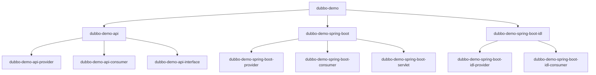
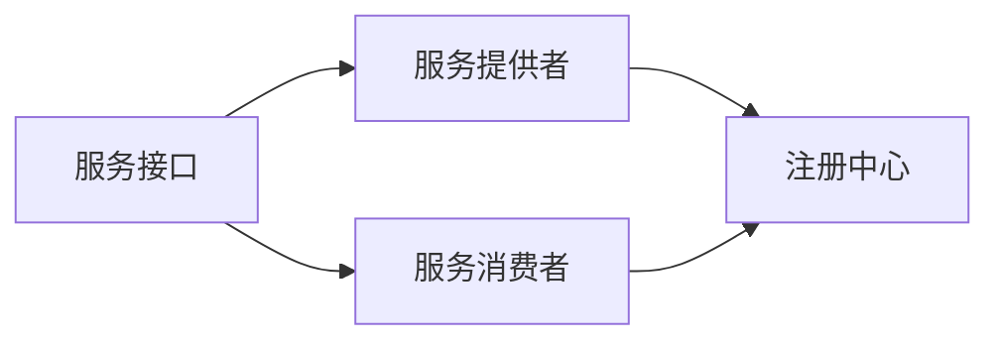

# 示例应用

<cite>
**本文档中引用的文件**  
- [README.md](file://dubbo-demo/README.md)
- [DemoService.java](file://dubbo-demo/dubbo-demo-api/dubbo-demo-api-interface/src/main/java/org/apache/dubbo/api/demo/DemoService.java)
- [application.yml](file://dubbo-demo/dubbo-demo-spring-boot/dubbo-demo-spring-boot-provider/src/main/resources/application.yml)
- [application.yml](file://dubbo-demo/dubbo-demo-spring-boot/dubbo-demo-spring-boot-consumer/src/main/resources/application.yml)
- [application.yml](file://dubbo-demo/dubbo-demo-spring-boot-idl/dubbo-demo-spring-boot-idl-provider/src/main/resources/application.yml)
- [application.yml](file://dubbo-demo/dubbo-demo-spring-boot-idl/dubbo-demo-spring-boot-idl-consumer/src/main/resources/application.yml)
- [ProviderApplication.java](file://dubbo-demo/dubbo-demo-spring-boot/dubbo-demo-spring-boot-provider/src/main/java/org/apache/dubbo/springboot/demo/provider/ProviderApplication.java)
- [ConsumerApplication.java](file://dubbo-demo/dubbo-demo-spring-boot/dubbo-demo-spring-boot-consumer/src/main/java/org/apache/dubbo/springboot/demo/consumer/ConsumerApplication.java)
- [ProviderApplication.java](file://dubbo-demo/dubbo-demo-spring-boot-idl/dubbo-demo-spring-boot-idl-provider/src/main/java/org/apache/dubbo/springboot/idl/demo/provider/ProviderApplication.java)
- [ConsumerApplication.java](file://dubbo-demo/dubbo-demo-spring-boot-idl/dubbo-demo-spring-boot-idl-consumer/src/main/java/org/apache/dubbo/springboot/idl/demo/consumer/ConsumerApplication.java)
- [pom.xml](file://dubbo-demo/dubbo-demo-api/pom.xml)
- [README.md](file://dubbo-demo/dubbo-demo-spring-boot-idl/dubbo-demo-spring-boot-idl-provider/README.md)
</cite>

## 目录
1. [简介](#简介)
2. [项目结构](#项目结构)
3. [核心示例应用](#核心示例应用)
4. [API基础示例](#api基础示例)
5. [Spring Boot集成示例](#spring-boot集成示例)
6. [IDL示例](#idl示例)
7. [配置与部署](#配置与部署)
8. [调试与测试](#调试与测试)
9. [最佳实践与扩展](#最佳实践与扩展)
10. [常见问题与解决方案](#常见问题与解决方案)

## 简介
本文档详细介绍了Apache Dubbo提供的各种示例应用，旨在为开发者提供全面的使用指南。文档涵盖了基础的API示例、Spring Boot集成示例以及IDL（接口定义语言）示例，帮助初学者快速上手并为经验丰富的开发者提供扩展思路。通过详细的结构分析、功能解释和配置说明，本文档将指导用户如何运行、测试和自定义这些示例应用。

## 项目结构
Dubbo示例应用仓库包含多个模块，每个模块专注于不同的使用场景和技术集成。主要示例应用位于`dubbo-demo`目录下，包括基础API示例、Spring Boot集成示例和IDL示例。这些示例展示了Dubbo的核心功能，如服务提供者、服务消费者和接口定义的实现。



**图示来源**  
- [README.md](file://dubbo-demo/README.md)

## 核心示例应用
Dubbo提供了三种主要的示例应用，每种都针对不同的使用场景和技术需求。这些示例不仅展示了Dubbo的基本用法，还体现了其在现代微服务架构中的集成能力。

### API基础示例
`dubbo-demo-api`示例展示了Dubbo RPC协议的基本用法，是理解Dubbo核心概念的基础。该示例包含服务提供者、服务消费者和接口定义三个主要组件，演示了如何定义和实现一个简单的RPC服务。

**核心组件**
- 服务接口定义
- 服务提供者实现
- 服务消费者调用

**功能特点**
- 基础RPC调用
- 同步和异步方法支持
- 简单的服务注册与发现

**示例结构**


**本节来源**  
- [README.md](file://dubbo-demo/README.md)
- [pom.xml](file://dubbo-demo/dubbo-demo-api/pom.xml)
- [DemoService.java](file://dubbo-demo/dubbo-demo-api/dubbo-demo-api-interface/src/main/java/org/apache/dubbo/api/demo/DemoService.java)

## API基础示例
`dubbo-demo-api`示例是理解Dubbo工作原理的起点。它展示了如何在没有Spring框架的情况下使用Dubbo进行基本的RPC通信。该示例包含三个子模块：接口定义、服务提供者和服务消费者。

### 接口定义
接口定义模块包含了服务契约，定义了服务提供者和消费者之间的通信协议。`DemoService`接口定义了基本的`sayHello`方法和一个异步的`sayHelloAsync`方法。

### 服务提供者
服务提供者实现了接口定义，并通过Dubbo暴露服务。它负责处理来自消费者的请求并返回响应。

### 服务消费者
服务消费者通过Dubbo引用远程服务，并调用其方法。它展示了如何配置和使用Dubbo客户端来调用远程服务。

**本节来源**  
- [README.md](file://dubbo-demo/README.md)
- [DemoService.java](file://dubbo-demo/dubbo-demo-api/dubbo-demo-api-interface/src/main/java/org/apache/dubbo/api/demo/DemoService.java)

## Spring Boot集成示例
`dubbo-demo-spring-boot`示例展示了如何将Dubbo与Spring Boot框架集成。这种集成方式使得Dubbo服务可以无缝地融入Spring Boot应用，利用Spring的依赖注入和自动配置特性。

### 配置文件分析
Spring Boot示例使用YAML配置文件来配置Dubbo相关参数。配置文件中定义了应用名称、协议、注册中心、配置中心和元数据报告等关键信息。

```yaml
spring:
  application:
    name: dubbo-springboot-demo-provider

dubbo:
  application:
    name: ${spring.application.name}
  protocol:
    name: tri
    port: -1
  registry:
    id: zk-registry
    address: zookeeper://127.0.0.1:2181
  config-center:
    address: zookeeper://127.0.0.1:2181
  metadata-report:
    address: zookeeper://127.0.0.1:2181
```

### 应用启动类
Spring Boot示例使用标准的Spring Boot启动类，并通过`@EnableDubbo`注解启用Dubbo功能。服务提供者和消费者都使用`@SpringBootApplication`和`@EnableDubbo`注解来配置应用。

```java
@SpringBootApplication
@EnableDubbo(scanBasePackages = {"org.apache.dubbo.springboot.demo.provider"})
public class ProviderApplication {
    public static void main(String[] args) throws Exception {
        SpringApplication.run(ProviderApplication.class, args);
        new CountDownLatch(1).await();
    }
}
```

### 服务消费者实现
服务消费者通过`@DubboReference`注解引用远程服务，并在业务逻辑中调用该服务。示例展示了同步调用和异步调用两种方式。

```java
@Service
public class ConsumerApplication {
    @DubboReference
    private DemoService demoService;

    public String doSayHello(String name) {
        return demoService.sayHello(name);
    }

    public CompletableFuture<String> doSayHelloAsync(String name) {
        return demoService.sayHelloAsync(name);
    }
}
```

**本节来源**  
- [application.yml](file://dubbo-demo/dubbo-demo-spring-boot/dubbo-demo-spring-boot-provider/src/main/resources/application.yml)
- [application.yml](file://dubbo-demo/dubbo-demo-spring-boot/dubbo-demo-spring-boot-consumer/src/main/resources/application.yml)
- [ProviderApplication.java](file://dubbo-demo/dubbo-demo-spring-boot/dubbo-demo-spring-boot-provider/src/main/java/org/apache/dubbo/springboot/demo/provider/ProviderApplication.java)
- [ConsumerApplication.java](file://dubbo-demo/dubbo-demo-spring-boot/dubbo-demo-spring-boot-consumer/src/main/java/org/apache/dubbo/springboot/demo/consumer/ConsumerApplication.java)

## IDL示例
`dubbo-demo-spring-boot-idl`示例展示了如何使用IDL（接口定义语言）文件（如Proto文件）与Dubbo集成。这种模式特别适用于需要强类型接口定义和跨语言服务调用的场景。

### IDL工作流程
IDL示例的工作流程包括：
1. 定义Proto文件
2. 使用Maven插件生成Java代码
3. 实现服务提供者
4. 调用服务消费者

### HTTP请求示例
IDL示例支持通过HTTP直接调用gRPC服务，这使得非Java客户端也能轻松访问Dubbo服务。

```shell
# 基本请求
curl -v -d '{"name":"dubbo"}' -H 'Content-Type: application/json' http://127.0.0.1:50051/org.apache.dubbo.demo.hello.GreeterService/sayHello

# 异步请求
curl -v -d '{"name":"dubbo async"}' -H 'Content-Type: application/json' http://127.0.0.1:50051/org.apache.dubbo.demo.hello.GreeterService/sayHelloAsync

# 服务端流式请求
curl -v -d '{"name":"dubbo"}' -H 'Content-Type: application/json' http://127.0.0.1:50051/org.apache.dubbo.demo.hello.GreeterService/sayHelloStream
```

### 配置特点
IDL示例的配置与Spring Boot示例类似，但使用了`tri`协议（Triple协议），这是Dubbo对gRPC的扩展实现。

```yaml
dubbo:
  protocol:
    name: tri
    port: -1
```

**本节来源**  
- [application.yml](file://dubbo-demo/dubbo-demo-spring-boot-idl/dubbo-demo-spring-boot-idl-provider/src/main/resources/application.yml)
- [application.yml](file://dubbo-demo/dubbo-demo-spring-boot-idl/dubbo-demo-spring-boot-idl-consumer/src/main/resources/application.yml)
- [ProviderApplication.java](file://dubbo-demo/dubbo-demo-spring-boot-idl/dubbo-demo-spring-boot-idl-provider/src/main/java/org/apache/dubbo/springboot/idl/demo/provider/ProviderApplication.java)
- [ConsumerApplication.java](file://dubbo-demo/dubbo-demo-spring-boot-idl/dubbo-demo-spring-boot-idl-consumer/src/main/java/org/apache/dubbo/springboot/idl/demo/consumer/ConsumerApplication.java)
- [README.md](file://dubbo-demo/dubbo-demo-spring-boot-idl/dubbo-demo-spring-boot-idl-provider/README.md)

## 配置与部署
本节介绍如何配置和部署Dubbo示例应用，包括必要的依赖、配置文件和运行环境。

### 依赖管理
所有示例都通过Maven进行依赖管理。基础API示例依赖于Dubbo核心库，而Spring Boot示例还依赖于Spring Boot相关库。

### 配置中心
示例应用使用ZooKeeper作为注册中心、配置中心和元数据报告中心。配置文件中指定了ZooKeeper的地址：

```
zookeeper://127.0.0.1:2181
```

### 协议选择
- `dubbo-demo-api`和`dubbo-demo-spring-boot`：使用`dubbo`或`tri`协议
- `dubbo-demo-spring-boot-idl`：使用`tri`协议（Triple协议）

### 部署步骤
1. 确保ZooKeeper服务已启动
2. 编译项目（对于IDL示例，需要先运行`dubbo:compile`插件）
3. 先启动服务提供者
4. 再启动服务消费者

## 调试与测试
本节提供调试和测试Dubbo示例应用的实用技巧。

### 调试技巧
- 使用QoS（Quality of Service）功能监控服务状态
- 查看日志输出以诊断问题
- 使用`telnet`或`curl`直接测试服务端点

### 测试方法
- 单元测试：测试服务接口的正确性
- 集成测试：测试服务提供者和消费者的完整交互
- 性能测试：评估服务的吞吐量和响应时间

### 常见测试场景
- 正常调用测试
- 异常处理测试
- 超时和重试测试
- 负载均衡测试

## 最佳实践与扩展
本节提供基于示例应用的最佳实践和扩展思路。

### 最佳实践
- 使用接口定义分离服务契约
- 合理配置超时和重试策略
- 使用异步调用提高系统吞吐量
- 启用服务治理功能（如熔断、限流）

### 扩展思路
- 集成其他注册中心（如Nacos、Eureka）
- 使用不同的序列化方式（如JSON、Hessian）
- 添加安全认证机制
- 集成监控和追踪系统

## 常见问题与解决方案
本节列出使用Dubbo示例应用时可能遇到的常见问题及其解决方案。

### 服务无法注册
**问题**：服务提供者无法注册到ZooKeeper  
**解决方案**：检查ZooKeeper服务是否正常运行，确认网络连接和配置地址是否正确

### 消费者无法发现服务
**问题**：服务消费者无法发现服务提供者  
**解决方案**：确认服务提供者已成功启动并注册，检查消费者和提供者的配置是否匹配

### 序列化错误
**问题**：对象序列化/反序列化失败  
**解决方案**：确保传输对象实现了Serializable接口，或使用兼容的序列化方式

### 性能瓶颈
**问题**：服务调用性能不佳  
**解决方案**：优化线程池配置，使用异步调用，考虑服务降级策略