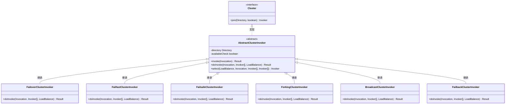
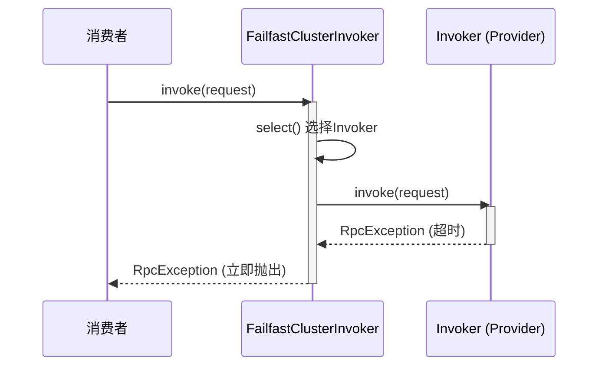
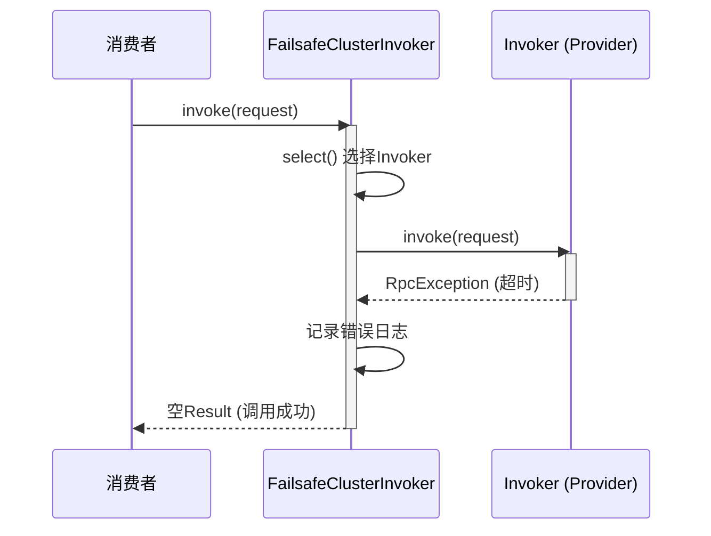
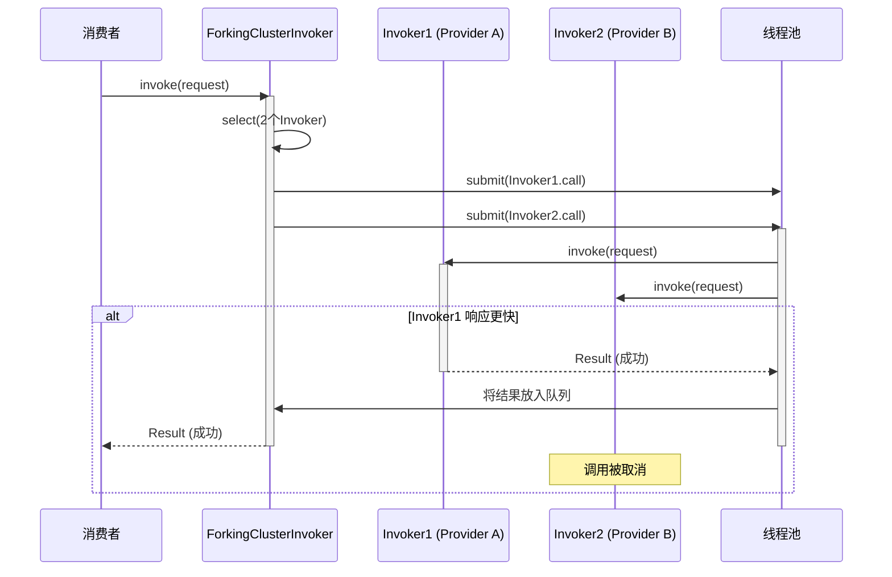
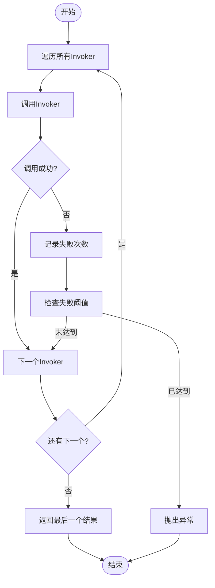

# 容错机制

<cite>
**本文档引用的文件**   
- [FailoverClusterInvoker.java](file://dubbo-cluster\src\main\java\org\apache\dubbo\rpc\cluster\support\FailoverClusterInvoker.java)
- [FailfastClusterInvoker.java](file://dubbo-cluster\src\main\java\org\apache\dubbo\rpc\cluster\support\FailfastClusterInvoker.java)
- [FailsafeClusterInvoker.java](file://dubbo-cluster\src\main\java\org\apache\dubbo\rpc\cluster\support\FailsafeClusterInvoker.java)
- [ForkingClusterInvoker.java](file://dubbo-cluster\src\main\java\org\apache\dubbo\rpc\cluster\support\ForkingClusterInvoker.java)
- [BroadcastClusterInvoker.java](file://dubbo-cluster\src\main\java\org\apache\dubbo\rpc\cluster\support\BroadcastClusterInvoker.java)
- [FailbackClusterInvoker.java](file://dubbo-cluster\src\main\java\org\apache\dubbo\rpc\cluster\support\FailbackClusterInvoker.java)
- [AbstractClusterInvoker.java](file://dubbo-cluster\src\main\java\org\apache\dubbo\rpc\cluster\support\AbstractClusterInvoker.java)
- [Cluster.java](file://dubbo-cluster\src\main\java\org\apache\dubbo\rpc\cluster\Cluster.java)
- [org.apache.dubbo.rpc.cluster.Cluster](file://dubbo-cluster\src\main\resources\META-INF\dubbo\internal\org.apache.dubbo.rpc.cluster.Cluster)
</cite>

## 目录
1. [引言](#引言)
2. [核心容错策略实现原理](#核心容错策略实现原理)
3. [失败重试（Failover）](#失败重试failover)
4. [快速失败（Failfast）](#快速失败failfast)
5. [失败安全（Failsafe）](#失败安全failsafe)
6. [并行调用（Forking）](#并行调用forking)
7. [广播调用（Broadcast）](#广播调用broadcast)
8. [失败自动恢复（Failback）](#失败自动恢复failback)
9. [关键配置参数](#关键配置参数)
10. [容错策略选择指南](#容错策略选择指南)
11. [自定义容错策略扩展](#自定义容错策略扩展)
12. [总结](#总结)

## 引言

Dubbo作为一款高性能的Java RPC框架，其容错机制是保障分布式系统稳定性的核心组件。当服务调用过程中出现网络抖动、服务提供者宕机等异常情况时，Dubbo的容错机制能够自动采取相应的策略，确保服务调用的最终成功或优雅降级，从而提升整个系统的可用性和健壮性。

Dubbo的容错机制主要在集群调用层（Cluster）实现，通过`Cluster`接口和`ClusterInvoker`抽象类构建了一套灵活的策略模式。不同的容错策略以SPI（Service Provider Interface）的方式进行扩展和注册，用户可以根据业务场景的需要，灵活选择和配置最适合的容错方案。本文将深入剖析Dubbo提供的多种容错策略，包括失败重试、快速失败、失败安全、并行调用、广播调用和失败自动恢复，详细解释其源码实现、使用场景和配置方法。

## 核心容错策略实现原理

Dubbo的容错机制基于`Cluster`接口和`AbstractClusterInvoker`抽象类构建。`Cluster`接口是SPI扩展点，定义了`join`方法，用于将一个`Directory`（服务目录）包装成一个具有特定容错能力的`Invoker`。`AbstractClusterInvoker`是所有具体容错策略的基类，它实现了`Invoker`接口，并提供了统一的调用流程和基础功能。



**图源**
- [Cluster.java](file://dubbo-cluster\src\main\java\org\apache\dubbo\rpc\cluster\Cluster#L34-L79)
- [AbstractClusterInvoker.java](file://dubbo-cluster\src\main\java\org\apache\dubbo\rpc\cluster\support\AbstractClusterInvoker#L62-L500)

**核心流程**：
1.  **调用入口**：消费者发起调用时，会调用`ClusterInvoker`的`invoke`方法。
2.  **路由与筛选**：`invoke`方法首先会通过`list`方法从`Directory`中获取当前可用的服务提供者列表。
3.  **负载均衡**：通过`initLoadBalance`方法初始化负载均衡器。
4.  **策略执行**：调用抽象方法`doInvoke`，该方法由具体的容错策略子类实现，是容错逻辑的核心。
5.  **结果返回**：`doInvoke`方法根据策略执行调用，并返回结果。

## 失败重试（Failover）

### 实现原理与源码分析

失败重试（Failover）是Dubbo的默认容错策略，其核心思想是当一次调用失败后，自动从剩余的服务提供者中选择另一个进行重试，直到成功或达到最大重试次数。这种策略适用于读操作或幂等的写操作，能够有效应对网络抖动或个别服务节点临时不可用的情况。

其核心实现位于`FailoverClusterInvoker`类的`doInvoke`方法中。该方法通过一个`for`循环来控制重试次数。在每次循环中，它会调用`select`方法选择一个`Invoker`进行调用。如果调用成功，则直接返回结果；如果调用失败且不是业务异常（`BizException`），则记录异常，并在循环结束后抛出。如果在重试次数内所有调用都失败，则抛出最后一次的异常。

```mermaid
sequenceDiagram
participant Consumer as 消费者
participant FailoverInvoker as FailoverClusterInvoker
participant Invoker1 as Invoker1 (Provider A)
participant Invoker2 as Invoker2 (Provider B)
Consumer->>FailoverInvoker : invoke(request)
activate FailoverInvoker
loop 重试循环 (最多3次)
FailoverInvoker->>FailoverInvoker : select() 选择Invoker
alt 选择Invoker1
FailoverInvoker->>Invoker1 : invoke(request)
activate Invoker1
Invoker1-->>FailoverInvoker : RpcException (超时)
deactivate Invoker1
else 选择Invoker2
FailoverInvoker->>Invoker2 : invoke(request)
activate Invoker2
Invoker2-->>FailoverInvoker : Result (成功)
deactivate Invoker2
break 调用成功，退出循环
end
end
FailoverInvoker-->>Consumer : Result (成功)
deactivate FailoverInvoker
```

**图源**
- [FailoverClusterInvoker.java](file://dubbo-cluster\src\main\java\org\apache\dubbo\rpc\cluster\support\FailoverClusterInvoker#L58-L143)

### 使用场景与配置

*   **适用场景**：查询接口、幂等的更新操作、对数据一致性要求不高的场景。
*   **配置方法**：通过`retries`参数设置重试次数（不包含第一次调用）。例如，在Spring配置中：
    ```xml
    <dubbo:reference id="demoService" interface="com.example.DemoService" retries="2" />
    ```
    或在注解中：
    ```java
    @DubboReference(retries = 2)
    private DemoService demoService;
    ```
*   **潜在风险**：非幂等操作（如支付、下单）使用此策略可能导致重复执行，引发数据不一致问题。重试会增加整体调用延迟。

## 快速失败（Failfast）

### 实现原理与源码分析

快速失败（Failfast）策略强调“快速响应”，其核心思想是一旦调用失败，立即抛出异常，不再进行任何重试。这种策略适用于非幂等的写操作，如创建订单、扣减库存等，可以避免因重试导致的数据重复或状态混乱。

其实现非常简单，位于`FailfastClusterInvoker`的`doInvoke`方法中。它首先通过`select`方法选择一个`Invoker`，然后直接调用`invoke`方法。无论成功与否，结果都会被返回。如果调用过程中抛出异常，它会捕获该异常，如果是业务异常则直接抛出，否则会包装成一个`RpcException`并抛出，整个过程没有循环或重试逻辑。



**图源**
- [FailfastClusterInvoker.java](file://dubbo-cluster\src\main\java\org\apache\dubbo\rpc\cluster\support\FailfastClusterInvoker#L43-L65)

### 使用场景与配置

*   **适用场景**：非幂等的写操作，如创建订单、提交支付、修改用户信息等。
*   **配置方法**：通过`cluster`参数指定为`failfast`。
    ```xml
    <dubbo:reference id="orderService" interface="com.example.OrderService" cluster="failfast" />
    ```
*   **潜在风险**：服务端短暂不可用时，客户端会立即失败，用户体验较差。需要上层业务逻辑或前端进行重试或降级处理。

## 失败安全（Failsafe）

### 实现原理与源码分析

失败安全（Failsafe）策略是一种“静默失败”的机制。其核心思想是当调用失败时，仅记录错误日志，然后返回一个空的结果（`AsyncRpcResult.newDefaultAsyncResult(null, null, invocation)`），不会将异常抛给调用方。这种策略适用于那些即使失败也不会影响核心业务流程的操作。

其实现位于`FailsafeClusterInvoker`的`doInvoke`方法中。它同样会`select`一个`Invoker`并进行调用。如果调用成功，则返回结果；如果调用过程中捕获到任何`Throwable`，它会先记录一条错误日志，然后返回一个空的`AsyncResult`，从而保证调用链不会中断。



**图源**
- [FailsafeClusterInvoker.java](file://dubbo-cluster\src\main\java\org\apache\dubbo\rpc\cluster\support\FailsafeClusterInvoker#L48-L64)

### 使用场景与配置

*   **适用场景**：写入审计日志、发送通知消息、更新缓存等非核心、可丢失的操作。
*   **配置方法**：通过`cluster`参数指定为`failsafe`。
    ```xml
    <dubbo:reference id="logService" interface="com.example.LogService" cluster="failsafe" />
    ```
*   **潜在风险**：调用失败对调用方是透明的，可能会导致数据丢失或状态不一致，需要确保这些操作的失败是可以接受的。

## 并行调用（Forking）

### 实现原理与源码分析

并行调用（Forking）策略的核心思想是同时向多个服务提供者发起调用，只要其中一个成功返回，就立即返回该结果，并取消其他正在进行的调用。这种策略可以显著降低响应时间的P99值，但会成倍地消耗服务提供者的资源。

其实现位于`ForkingClusterInvoker`的`doInvoke`方法中。它首先根据`forks`参数确定要并行调用的`Invoker`数量。然后，它会使用线程池（`executor`）为每个选中的`Invoker`异步发起调用。这些异步调用的结果会被放入一个容量为1的`BlockingQueue`中。`doInvoke`方法会阻塞地从队列中获取结果，一旦有结果（无论是成功还是失败）被放入队列，就会立即返回。如果在超时时间内没有获取到结果，则会抛出超时异常。



**图源**
- [ForkingClusterInvoker.java](file://dubbo-cluster\src\main\java\org\apache\dubbo\rpc\cluster\support\ForkingClusterInvoker#L70-L138)

### 使用场景与配置

*   **适用场景**：对实时性要求极高，且服务提供者资源充足的场景，如实时推荐、秒杀系统的部分查询。
*   **配置方法**：通过`cluster`参数指定为`forking`，并通过`forks`参数指定并行数。
    ```xml
    <dubbo:reference id="realTimeService" interface="com.example.RealTimeService" cluster="forking" forks="2" />
    ```
*   **潜在风险**：资源消耗巨大，可能导致服务提供者过载。不适合写操作。

## 广播调用（Broadcast）

### 实现原理与源码分析

广播调用（Broadcast）策略的核心思想是将请求广播给所有可用的服务提供者，要求所有提供者都必须成功执行。如果任何一个提供者调用失败，整个调用即视为失败。这种策略通常用于通知所有节点进行某种操作，如刷新本地缓存、更新配置等。

其实现位于`BroadcastClusterInvoker`的`doInvoke`方法中。它会遍历所有`Invoker`，依次进行同步调用。它会记录调用失败的次数，并通过`broadcast.fail.percent`参数（默认100%）来控制失败的容忍度。例如，如果该参数设置为50%，则当失败的提供者数量超过总数的一半时，才会抛出异常。否则，即使有部分失败，只要未达到阈值，仍会继续调用剩余的提供者。



**图源**
- [BroadcastClusterInvoker.java](file://dubbo-cluster\src\main\java\org\apache\dubbo\rpc\cluster\support\BroadcastClusterInvoker#L52-L157)

### 使用场景与配置

*   **适用场景**：集群配置更新、本地缓存刷新、服务状态通知等需要所有节点都执行的操作。
*   **配置方法**：通过`cluster`参数指定为`broadcast`。
    ```xml
    <dubbo:reference id="configService" interface="com.example.ConfigService" cluster="broadcast" />
    ```
*   **潜在风险**：调用耗时等于所有提供者中最慢的那个，性能较差。任何一个节点故障都会导致整个调用失败。

## 失败自动恢复（Failback）

### 实现原理与源码分析

失败自动恢复（Failback）策略是一种异步的、后台重试的机制。其核心思想是当调用失败时，不立即返回失败，而是将失败的请求记录下来，并由一个后台定时器定期进行重试，直到成功为止。这种策略适用于那些对实时性要求不高，但必须保证最终成功的操作。

其实现位于`FailbackClusterInvoker`的`doInvoke`方法中。它会尝试选择一个`Invoker`进行异步调用。如果调用成功，则返回结果；如果调用失败，它会记录一条错误日志，并调用`addFailed`方法。`addFailed`方法会创建一个`RetryTimerTask`，并将其提交到一个`HashedWheelTimer`定时器中。这个定时器会在`RETRY_FAILED_PERIOD`（默认5秒）后执行该任务。`RetryTimerTask`的`run`方法会再次尝试调用，如果仍然失败，则会递增重试次数，如果未达到最大重试次数，则会将任务重新放入定时器进行下一次重试。

```mermaid
sequenceDiagram
participant Consumer as 消费者
participant FailbackInvoker as FailbackClusterInvoker
participant Invoker as Invoker (Provider)
participant Timer as HashedWheelTimer
participant Task as RetryTimerTask
Consumer->>FailbackInvoker : invoke(request)
activate FailbackInvoker
FailbackInvoker->>FailbackInvoker : select() 选择Invoker
FailbackInvoker->>Invoker : invoke(request) (异步)
activate Invoker
Invoker-->>FailbackInvoker : RpcException (超时)
deactivate Invoker
FailbackInvoker->>FailbackInvoker : addFailed()
FailbackInvoker->>Timer : newTimeout(Task, 5s)
FailbackInvoker-->>Consumer : 空Result (调用成功)
deactivate FailbackInvoker
Note over Timer : 5秒后...
Timer->>Task : run()
activate Task
Task->>Task : select() 重新选择Invoker
Task->>Invoker : invoke(request) (异步)
activate Invoker
alt 调用成功
Invoker-->>Task : Result
deactivate Invoker
deactivate Task
else 调用失败
Invoker-->>Task : RpcException
deactivate Invoker
Task->>Task : retriedTimes++
alt 未达到最大重试次数
Task->>Timer : rePut(新timeout)
deactivate Task
else 达到最大重试次数
Task->>Task : 记录最终失败日志
deactivate Task
end
end
```

**图源**
- [FailbackClusterInvoker.java](file://dubbo-cluster\src\main\java\org\apache\dubbo\rpc\cluster\support\FailbackClusterInvoker#L117-L233)

### 使用场景与配置

*   **适用场景**：发送通知、写入日志、数据同步等对实时性要求不高，但需要保证最终一致性的操作。
*   **配置方法**：通过`cluster`参数指定为`failback`，并通过`retries`参数设置后台重试次数。
    ```xml
    <dubbo:reference id="notifyService" interface="com.example.NotifyService" cluster="failback" retries="3" />
    ```
*   **潜在风险**：调用方无法感知最终是否成功，需要通过日志或监控来确认。后台重试任务会占用系统资源。

## 关键配置参数

| 参数名称 | 参数含义 | 默认值 | 作用范围 | 说明 |
| :--- | :--- | :--- | :--- | :--- |
| `cluster` | 容错策略类型 | `failover` | 服务消费者 | 可选值：`failover`, `failfast`, `failsafe`, `forking`, `broadcast`, `failback` |
| `retries` | 重试次数 | `2` | 服务消费者 | 仅对`failover`和`failback`策略有效。`failover`指失败后的重试次数；`failback`指后台重试的最大次数。 |
| `forks` | 并行数 | `2` | 服务消费者 | 仅对`forking`策略有效，指定并行调用的`Invoker`数量。 |
| `timeout` | 调用超时时间 | `1000` (1秒) | 服务消费者 | 所有策略都受此参数影响，定义了单次调用的最长等待时间。 |
| `broadcast.fail.percent` | 广播失败百分比 | `100` | 服务消费者 | 仅对`broadcast`策略有效，定义了允许失败的提供者比例（0-100），超过此比例则抛出异常。 |

## 容错策略选择指南

为初学者提供以下选择指南：

*   **不确定时**：使用默认的`failover`策略，它能应对大多数网络波动场景。
*   **查询操作**：优先考虑`failover`，保证高可用性。
*   **创建/支付等写操作**：必须使用`failfast`，避免重复执行。
*   **日志/通知等非核心操作**：使用`failsafe`，保证主流程不被阻塞。
*   **刷新缓存/配置**：使用`broadcast`，确保所有节点都收到通知。
*   **对延迟敏感的查询**：在资源允许的情况下，可尝试`forking`。
*   **必须最终成功的异步任务**：使用`failback`。

为高级用户提供优化建议：

*   **精细化配置**：不要在全局配置容错策略，而应在具体的服务引用上进行配置，以满足不同业务的需求。
*   **监控与告警**：对`failback`的重试任务、`forking`的资源消耗、`broadcast`的失败率进行监控，并设置告警。
*   **结合熔断**：容错机制应与熔断机制（如Sentinel）结合使用。当某个服务提供者持续失败时，应将其熔断，避免`failover`策略不断重试一个已知的故障节点。
*   **评估重试成本**：对于非幂等操作，即使使用`failfast`，也应在业务层设计幂等性校验，以防网络超时导致的重复请求。

## 自定义容错策略扩展

Dubbo通过SPI机制提供了强大的扩展能力。要实现一个自定义的容错策略，需要以下步骤：

1.  **实现`Cluster`接口**：创建一个类实现`org.apache.dubbo.rpc.cluster.Cluster`接口。
2.  **继承`AbstractClusterInvoker`**：创建一个`Invoker`类，继承`org.apache.dubbo.rpc.cluster.support.AbstractClusterInvoker`，并实现`doInvoke`方法，编写自定义的容错逻辑。
3.  **在SPI配置文件中注册**：在`META-INF/dubbo/org.apache.dubbo.rpc.cluster.Cluster`文件中添加一行，格式为`自定义名称=全限定类名`。

例如，创建一个名为`mycluster`的策略：
```java
public class MyCluster implements Cluster {
    @Override
    public <T> Invoker<T> join(Directory<T> directory, boolean buildFilterChain) throws RpcException {
        return new MyClusterInvoker<>(directory);
    }
}
```
然后在`META-INF/dubbo/org.apache.dubbo.rpc.cluster.Cluster`文件中添加：
```
mycluster=com.example.MyCluster
```
之后，就可以通过`cluster="mycluster"`来使用这个自定义策略了。

## 总结

Dubbo提供了丰富且灵活的容错机制，涵盖了从快速失败到后台重试等多种策略，能够满足不同业务场景的需求。理解每种策略的实现原理、适用场景和潜在风险，是构建高可用分布式系统的关键。通过合理配置`cluster`、`retries`、`timeout`等关键参数，并结合业务特点进行选择，可以有效提升系统的稳定性和用户体验。同时，利用Dubbo的SPI机制，开发者还可以根据特殊需求扩展出更复杂的容错逻辑，使系统具备更强的适应能力。