# 负载均衡与容错

<cite>
**本文档引用的文件**   
- [RandomLoadBalance.java](file://dubbo-cluster\src\main\java\org\apache\dubbo\rpc\cluster\loadbalance\RandomLoadBalance.java)
- [LeastActiveLoadBalance.java](file://dubbo-cluster\src\main\java\org\apache\dubbo\rpc\cluster\loadbalance\LeastActiveLoadBalance.java)
- [RoundRobinLoadBalance.java](file://dubbo-cluster\src\main\java\org\apache\dubbo\rpc\cluster\loadbalance\RoundRobinLoadBalance.java)
- [ConsistentHashLoadBalance.java](file://dubbo-cluster\src\main\java\org\apache\dubbo\rpc\cluster\loadbalance\ConsistentHashLoadBalance.java)
- [ShortestResponseLoadBalance.java](file://dubbo-cluster\src\main\java\org\apache\dubbo\rpc\cluster\loadbalance\ShortestResponseLoadBalance.java)
- [FailoverClusterInvoker.java](file://dubbo-cluster\src\main\java\org\apache\dubbo\rpc\cluster\support\FailoverClusterInvoker.java)
- [FailfastClusterInvoker.java](file://dubbo-cluster\src\main\java\org\apache\dubbo\rpc\cluster\support\FailfastClusterInvoker.java)
- [FailsafeClusterInvoker.java](file://dubbo-cluster\src\main\java\org\apache\dubbo\rpc\cluster\support\FailsafeClusterInvoker.java)
- [ForkingClusterInvoker.java](file://dubbo-cluster\src\main\java\org\apache\dubbo\rpc\cluster\support\ForkingClusterInvoker.java)
- [BroadcastClusterInvoker.java](file://dubbo-cluster\src\main\java\org\apache\dubbo\rpc\cluster\support\BroadcastClusterInvoker.java)
- [AbstractClusterInvoker.java](file://dubbo-cluster\src\main\java\org\apache\dubbo\rpc\cluster\support\AbstractClusterInvoker.java)
- [AbstractLoadBalance.java](file://dubbo-cluster\src\main\java\org\apache\dubbo\rpc\cluster\loadbalance\AbstractLoadBalance.java)
- [Constants.java](file://dubbo-cluster\src\main\java\org\apache\dubbo\rpc\cluster\Constants.java)
- [StickyTest.java](file://dubbo-cluster\src\test\java\org\apache\dubbo\rpc\cluster\StickyTest.java)
</cite>

## 目录
1. [引言](#引言)
2. [负载均衡策略](#负载均衡策略)
3. [容错机制](#容错机制)
4. [集群容错扩展接口](#集群容错扩展接口)
5. [策略对比与选择指南](#策略对比与选择指南)
6. [高级特性](#高级特性)
7. [配置示例](#配置示例)
8. [结论](#结论)

## 引言

Dubbo作为一个高性能的Java RPC框架，其集群管理能力是确保分布式系统高可用性和性能的关键。本文档详细介绍了Dubbo的负载均衡与容错机制，重点阐述了各种负载均衡策略的实现原理、适用场景以及容错机制的工作方式。通过深入分析源码，为开发者提供全面的技术指导，帮助其根据实际业务需求选择合适的策略，并进行有效的性能优化。

## 负载均衡策略

负载均衡是分布式系统中将请求合理分配到多个服务提供者的关键技术。Dubbo提供了多种负载均衡策略，每种策略都有其独特的算法和适用场景。

### 随机负载均衡 (Random Load Balance)

随机负载均衡策略是最简单的负载均衡算法之一。它通过随机数生成器从服务提供者列表中随机选择一个提供者。当所有提供者的权重相同时，直接使用`random.nextInt(number of invokers)`进行选择；当权重不同时，则使用`random.nextInt(w1 + w2 + ... + wn)`，权重越大，被选中的概率越高。

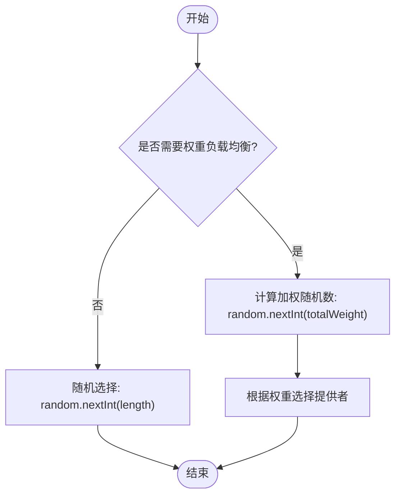

**图源**
- [RandomLoadBalance.java](file://dubbo-cluster\src\main\java\org\apache\dubbo\rpc\cluster\loadbalance\RandomLoadBalance.java#L55-L62)

### 轮询负载均衡 (Round Robin Load Balance)

轮询负载均衡策略按照顺序循环地将请求分配给每个服务提供者。Dubbo的实现采用了加权轮询算法，通过维护一个`WeightedRoundRobin`对象来跟踪每个提供者的权重和当前值。每次选择时，会增加当前值，选择当前值最大的提供者，然后将其当前值减去总权重，从而实现平滑的加权轮询。

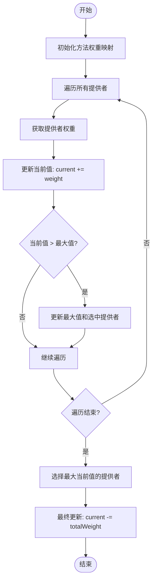

**图源**
- [RoundRobinLoadBalance.java](file://dubbo-cluster\src\main\java\org\apache\dubbo\rpc\cluster\loadbalance\RoundRobinLoadBalance.java#L92-L134)

### 最少活跃调用数负载均衡 (Least Active Load Balance)

最少活跃调用数负载均衡策略会选择当前活跃调用数最少的服务提供者。活跃调用数是指正在处理的请求数量。该策略能够有效地将新请求分配给负载较低的服务器，从而实现更均衡的负载分布。当有多个提供者的活跃调用数相同时，再根据权重进行随机选择。

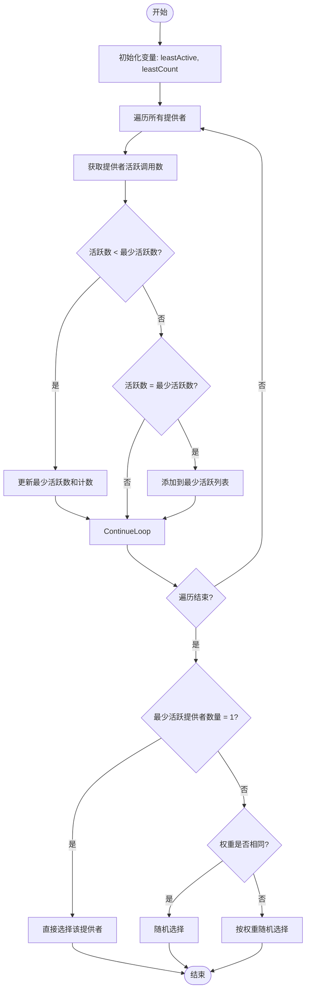

**图源**
- [LeastActiveLoadBalance.java](file://dubbo-cluster\src\main\java\org\apache\dubbo\rpc\cluster\loadbalance\LeastActiveLoadBalance.java#L40-L57)

### 一致性哈希负载均衡 (Consistent Hash Load Balance)

一致性哈希负载均衡策略通过哈希算法将请求映射到一个虚拟的哈希环上，从而实现服务提供者的均匀分布。当服务提供者数量发生变化时，只有少量的请求需要重新映射，大大减少了缓存失效等问题。Dubbo允许配置哈希节点数和参与哈希计算的参数索引。

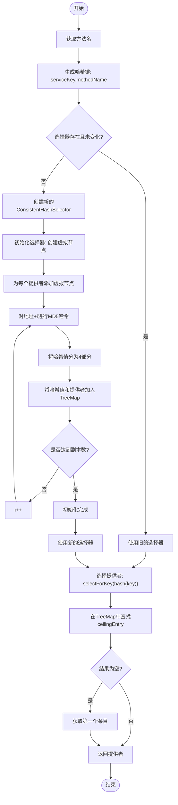

**图源**
- [ConsistentHashLoadBalance.java](file://dubbo-cluster\src\main\java\org\apache\dubbo\rpc\cluster\loadbalance\ConsistentHashLoadBalance.java#L49-L67)

### 最短响应时间负载均衡 (Shortest Response Load Balance)

最短响应时间负载均衡策略会选择预估响应时间最短的服务提供者。预估响应时间是通过活跃调用数乘以成功调用的平均耗时来计算的。该策略能够有效地将请求分配给响应速度最快的服务器，从而降低整体的响应延迟。

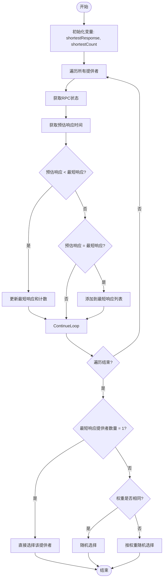

**图源**
- [ShortestResponseLoadBalance.java](file://dubbo-cluster\src\main\java\org\apache\dubbo\rpc\cluster\loadbalance\ShortestResponseLoadBalance.java#L123-L150)

### 权重与预热机制

Dubbo的负载均衡策略支持权重配置，允许根据服务器的性能设置不同的权重。此外，还引入了预热机制，新启动的服务提供者权重会随运行时间逐渐增加，避免在启动初期因突然承受大量流量而导致性能问题。权重计算公式为：`weight = min(uptime / (warmup / weight), weight)`。

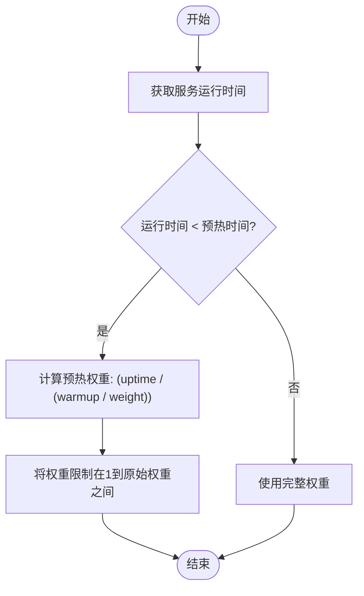

**图源**
- [AbstractLoadBalance.java](file://dubbo-cluster\src\main\java\org\apache\dubbo\rpc\cluster\loadbalance\AbstractLoadBalance.java#L46-L49)

## 容错机制

容错机制是确保分布式系统在部分服务提供者出现故障时仍能正常工作的关键。Dubbo提供了多种容错策略，以应对不同的故障场景。

### 失败重试 (Failover Cluster)

失败重试是Dubbo默认的容错策略。当调用失败时，会自动切换到另一个服务提供者进行重试，最多重试指定次数（默认2次，加上第一次调用，共3次）。这种策略能够有效处理网络抖动或临时性故障，但会增加整体的调用延迟。

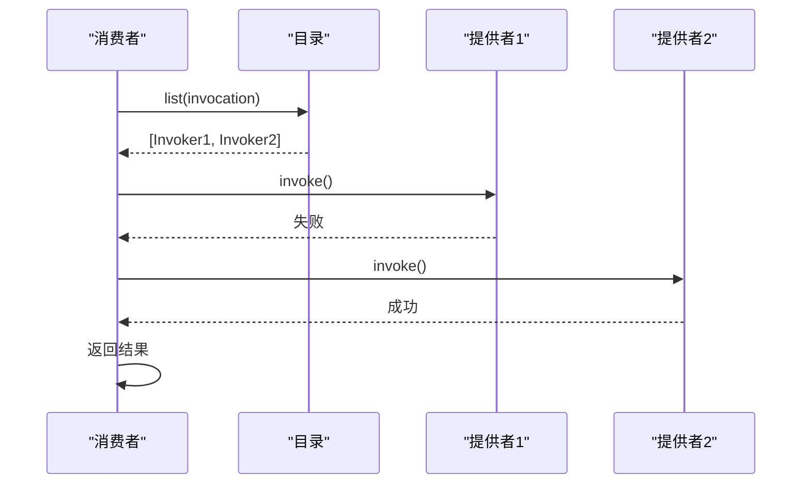

**图源**
- [FailoverClusterInvoker.java](file://dubbo-cluster\src\main\java\org\apache\dubbo\rpc\cluster\support\FailoverClusterInvoker.java#L57-L144)

### 快速失败 (Failfast Cluster)

快速失败策略在调用失败时立即抛出异常，不会进行重试。这种策略适用于幂等性操作，如查询，可以快速失败并通知上层应用，避免不必要的等待。

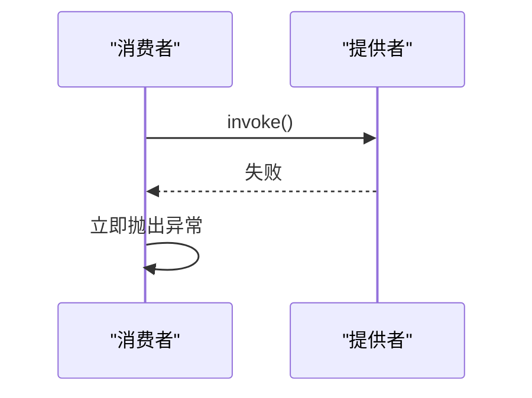

**图源**
- [FailfastClusterInvoker.java](file://dubbo-cluster\src\main\java\org\apache\dubbo\rpc\cluster\support\FailfastClusterInvoker.java#L48-L64)

### 失败安全 (Failsafe Cluster)

失败安全策略在调用失败时会记录错误日志，但不会抛出异常，而是返回一个空结果。这种策略适用于写入审计日志等操作，即使失败也不会影响主业务流程。

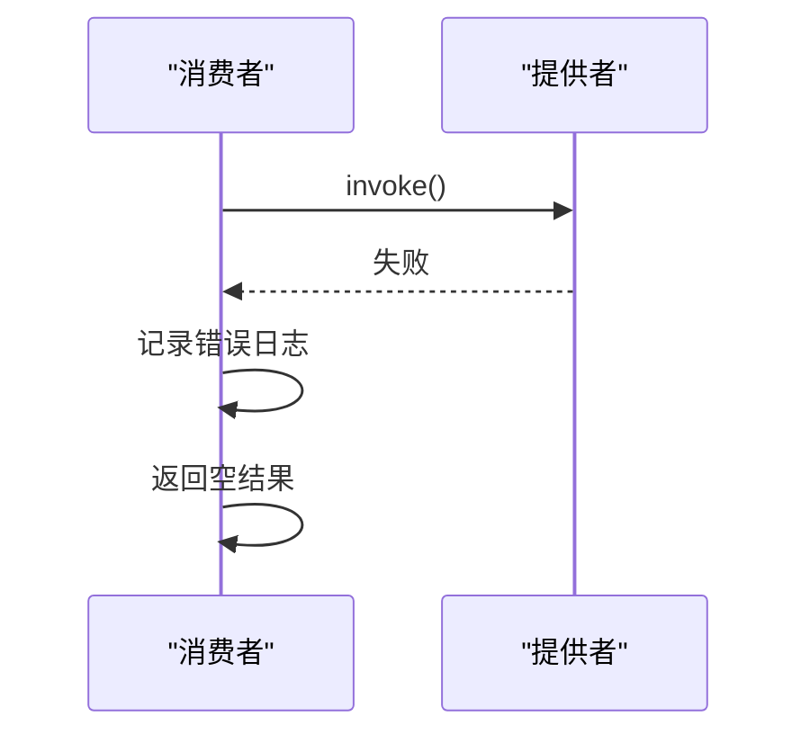

**图源**
- [FailsafeClusterInvoker.java](file://dubbo-cluster\src\main\java\org\apache\dubbo\rpc\cluster\support\FailsafeClusterInvoker.java#L48-L64)

### 并行调用 (Forking Cluster)

并行调用策略会同时向多个服务提供者发起调用，只要有一个成功就立即返回。这种策略可以显著降低响应时间，但会消耗更多的服务资源，适用于对实时性要求极高的场景。

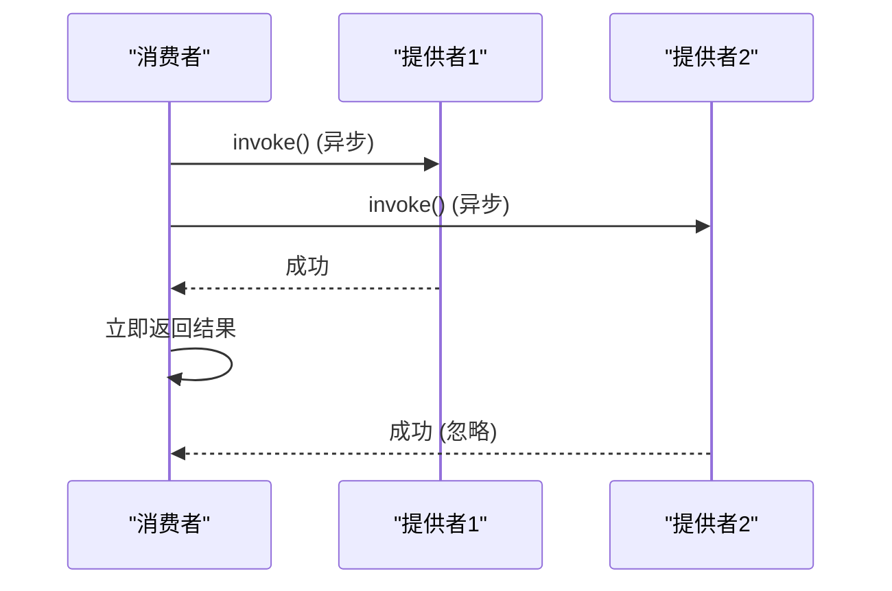

**图源**
- [ForkingClusterInvoker.java](file://dubbo-cluster\src\main\java\org\apache\dubbo\rpc\cluster\support\ForkingClusterInvoker.java#L72-L139)

### 广播调用 (Broadcast Cluster)

广播调用策略会向所有服务提供者发起调用，直到所有调用完成或失败率达到阈值。这种策略适用于需要通知所有节点的场景，如缓存刷新。

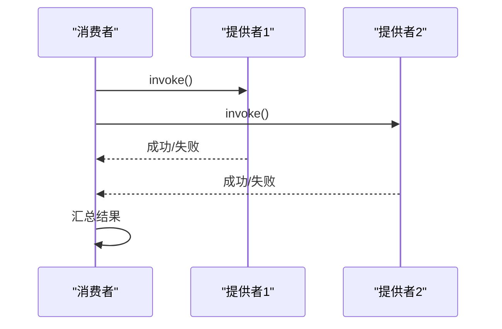

**图源**
- [BroadcastClusterInvoker.java](file://dubbo-cluster\src\main\java\org\apache\dubbo\rpc\cluster\support\BroadcastClusterInvoker.java#L54-L158)

## 集群容错扩展接口

Dubbo通过SPI（Service Provider Interface）机制提供了强大的扩展能力，开发者可以轻松地自定义负载均衡和容错策略。

### 自定义负载均衡策略

要实现自定义的负载均衡策略，需要实现`LoadBalance`接口，并使用`@SPI`注解指定默认实现。核心是实现`doSelect`方法，根据业务逻辑选择最合适的服务提供者。

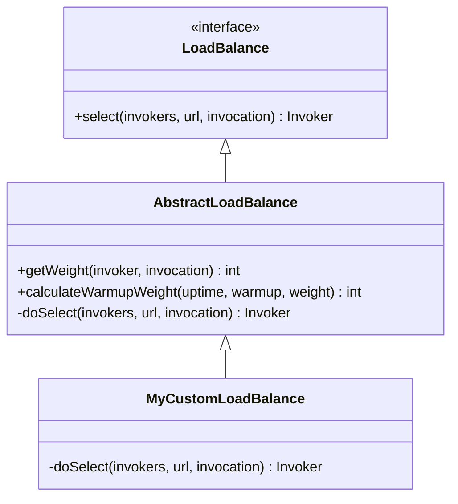

**图源**
- [LoadBalance.java](file://dubbo-cluster\src\main\java\org\apache\dubbo\rpc\cluster\LoadBalance.java#L35-L48)
- [AbstractLoadBalance.java](file://dubbo-cluster\src\main\java\org\apache\dubbo\rpc\cluster\loadbalance\AbstractLoadBalance.java#L36-L62)

### 自定义容错策略

要实现自定义的容错策略，需要实现`Cluster`接口，并继承`AbstractClusterInvoker`。核心是实现`doInvoke`方法，定义具体的容错逻辑。

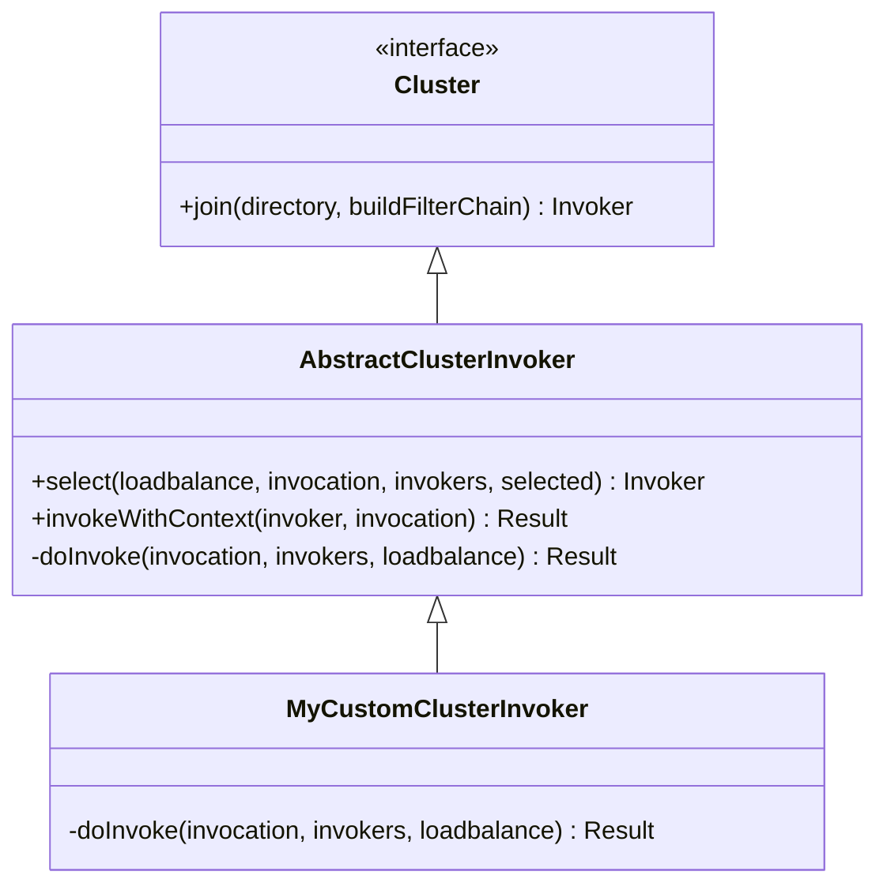

**图源**
- [Cluster.java](file://dubbo-cluster\src\main\java\org\apache\dubbo\rpc\cluster\Cluster.java#L33-L78)
- [AbstractClusterInvoker.java](file://dubbo-cluster\src\main\java\org\apache\dubbo\rpc\cluster\support\AbstractClusterInvoker.java#L62-L501)

## 策略对比与选择指南

为了帮助开发者选择合适的策略，以下表格对比了各种负载均衡和容错策略的特性。

### 负载均衡策略对比

| 策略 | 原理 | 优点 | 缺点 | 适用场景 |
| :--- | :--- | :--- | :--- | :--- |
| **随机** | 根据权重随机选择 | 实现简单，性能高 | 在请求数量少时可能不均衡 | 一般场景，对均衡性要求不高的场景 |
| **轮询** | 按顺序循环选择 | 简单直观，绝对均衡 | 未考虑服务器性能差异 | 服务器性能相近的场景 |
| **最少活跃调用数** | 选择活跃调用数最少的提供者 | 能有效反映服务器负载 | 需要维护活跃调用数 | 服务器性能差异大，对响应时间敏感的场景 |
| **一致性哈希** | 基于哈希环选择 | 服务器增减时影响小，适合有状态服务 | 实现复杂 | 需要会话保持、缓存等场景 |
| **最短响应时间** | 选择预估响应时间最短的提供者 | 能有效降低整体响应时间 | 需要统计响应时间 | 对响应时间要求极高的场景 |

### 容错策略对比

| 策略 | 原理 | 优点 | 缺点 | 适用场景 |
| :--- | :--- | :--- | :--- | :--- |
| **失败重试** | 失败后自动重试其他提供者 | 提高调用成功率 | 增加延迟，可能重复执行非幂等操作 | 读操作，幂等性操作 |
| **快速失败** | 失败立即抛出异常 | 快速失败，减少等待 | 调用直接失败 | 对延迟敏感，非关键操作 |
| **失败安全** | 失败时记录日志并返回空结果 | 不影响主流程 | 业务可能丢失 | 写入日志、监控等非关键操作 |
| **并行调用** | 同时调用多个提供者，取最快结果 | 极大降低响应时间 | 消耗大量资源 | 对实时性要求极高的核心操作 |
| **广播调用** | 向所有提供者发起调用 | 确保所有节点都收到通知 | 性能差，资源消耗大 | 缓存刷新、配置更新等通知类操作 |

### 策略选择指导原则

1.  **负载均衡选择**：
    *   **一般场景**：优先选择`最少活跃调用数`，它能动态适应服务器负载。
    *   **性能差异大**：使用`最少活跃调用数`或`最短响应时间`，并配合权重配置。
    *   **需要会话保持**：必须使用`一致性哈希`。
    *   **简单场景**：可使用`随机`或`轮询`。

2.  **容错策略选择**：
    *   **读操作/幂等操作**：使用`失败重试`，提高可用性。
    *   **写操作/非幂等操作**：使用`快速失败`，避免重复执行。
    *   **非关键操作**：使用`失败安全`，保证主流程。
    *   **核心实时操作**：考虑`并行调用`，但需评估资源消耗。
    *   **通知类操作**：使用`广播调用`。

## 高级特性

### 粘滞连接 (Sticky Connection)

粘滞连接是一种特殊的负载均衡策略，它会尽量让同一个消费者的后续调用都落在同一个服务提供者上。这在某些需要会话保持的场景下非常有用，尽管Dubbo更推荐使用一致性哈希来实现类似功能。

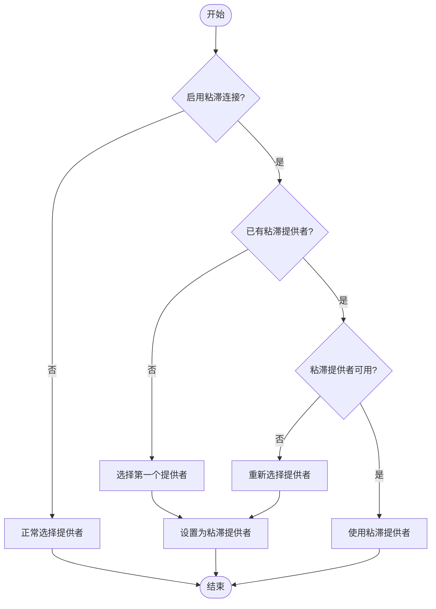

**图源**
- [AbstractClusterInvoker.java](file://dubbo-cluster\src\main\java\org\apache\dubbo\rpc\cluster\support\AbstractClusterInvoker.java#L164-L185)
- [StickyTest.java](file://dubbo-cluster\src\test\java\org\apache\dubbo\rpc\cluster\StickyTest.java#L35)

### 动态切换与权重调整

Dubbo支持在运行时动态调整负载均衡策略和权重。这可以通过配置中心（如Nacos、Zookeeper）实现，当配置发生变化时，Dubbo会自动重新加载配置并应用新的策略。

## 配置示例

以下是一些常见的配置示例：

### XML配置

```xml
<dubbo:reference id="demoService" interface="com.example.DemoService" loadbalance="leastactive" cluster="failover" retries="2"/>
<dubbo:service interface="com.example.DemoService" ref="demoServiceImpl" loadbalance="consistenthash" cluster="failfast"/>
```

### 注解配置

```java
@DubboReference(loadbalance = "leastactive", cluster = "failover", retries = 2)
private DemoService demoService;

@DubboService(loadbalance = "consistenthash", cluster = "failfast")
public class DemoServiceImpl implements DemoService {
    // ...
}
```

### 属性配置

```properties
dubbo.reference.com.example.DemoService.loadbalance=leastactive
dubbo.reference.com.example.DemoService.cluster=failover
dubbo.reference.com.example.DemoService.retries=2
```

## 结论

Dubbo的负载均衡与容错机制为构建高可用、高性能的分布式系统提供了坚实的基础。通过深入理解各种策略的原理和适用场景，开发者可以根据具体的业务需求做出最佳选择。合理利用权重、预热、粘滞连接等高级特性，可以进一步优化系统的性能和稳定性。同时，Dubbo开放的SPI扩展机制也为满足特殊需求提供了无限可能。在实际应用中，建议结合监控数据和业务特点，持续调优集群策略，以达到最佳效果。