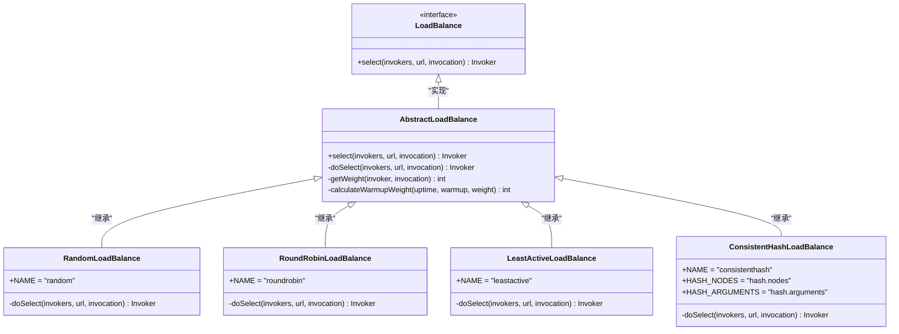
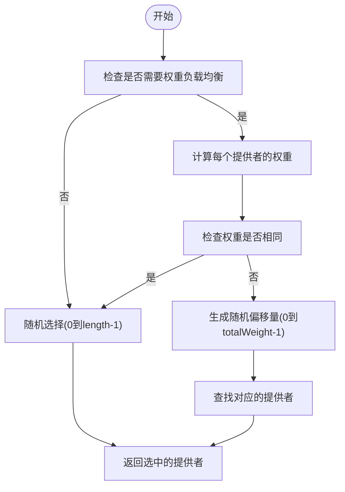
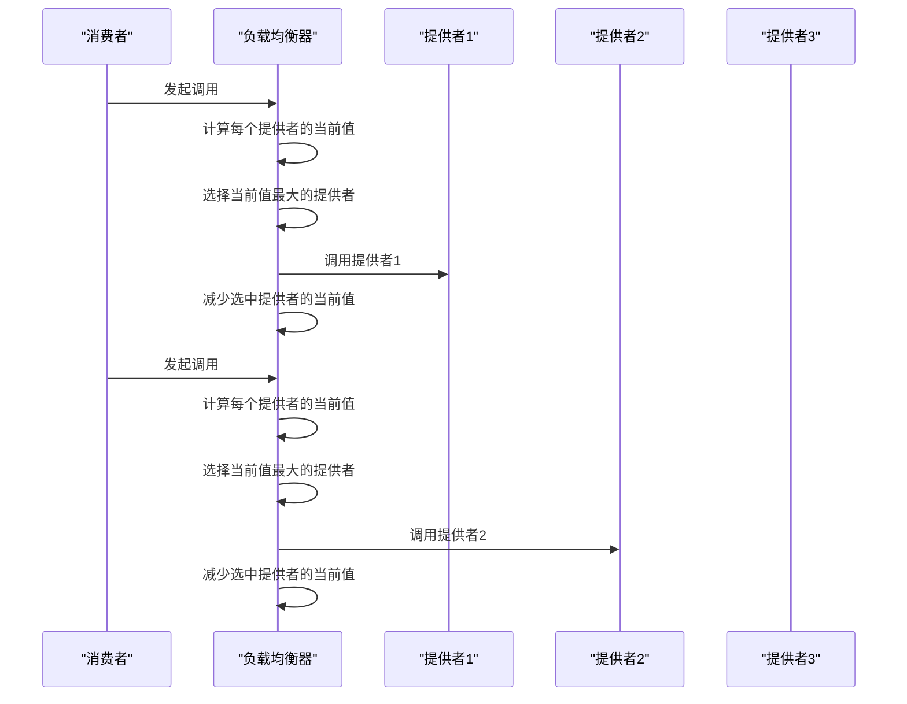
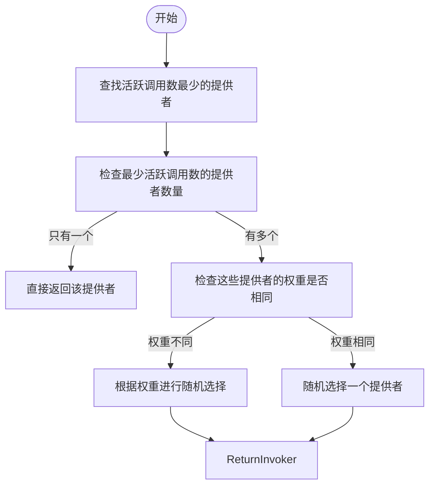
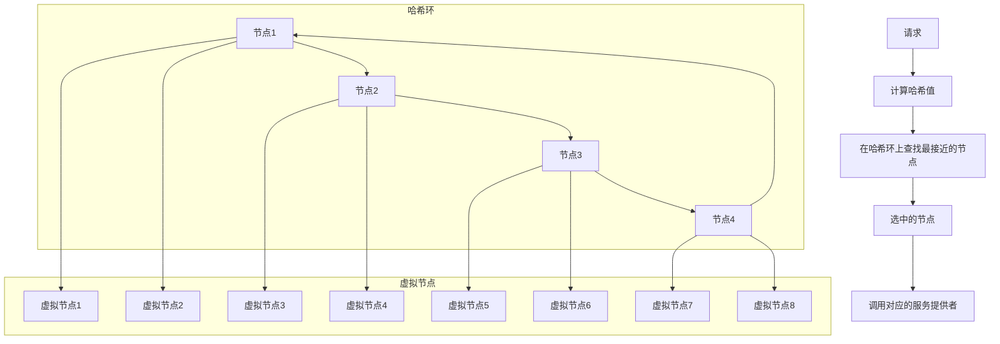
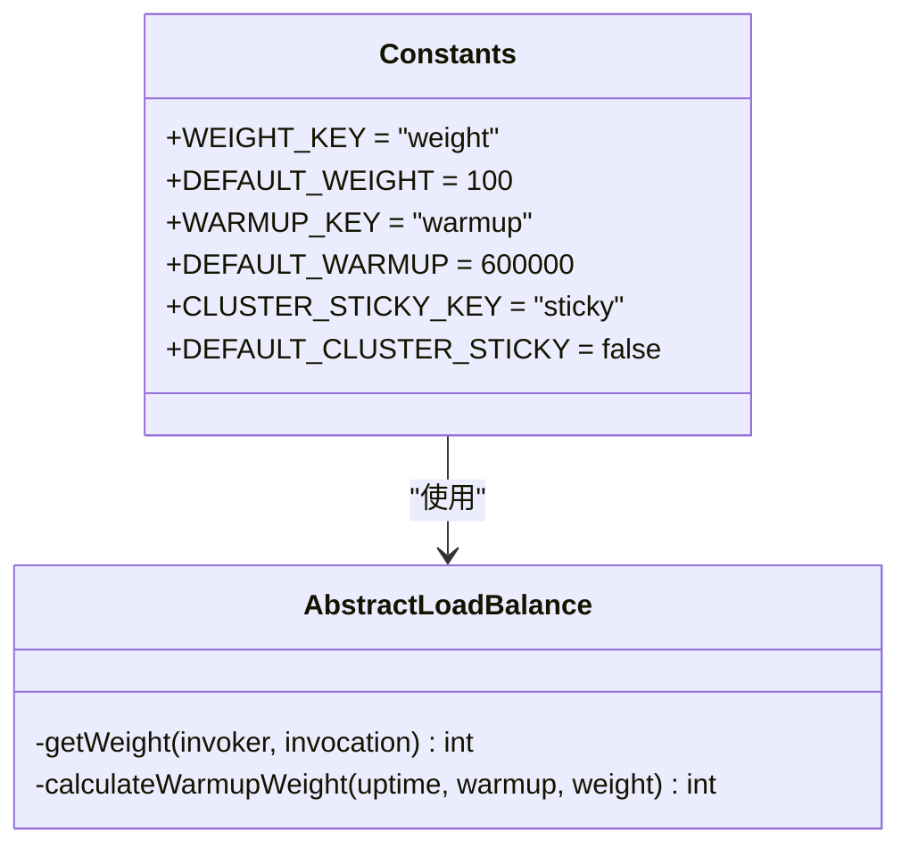
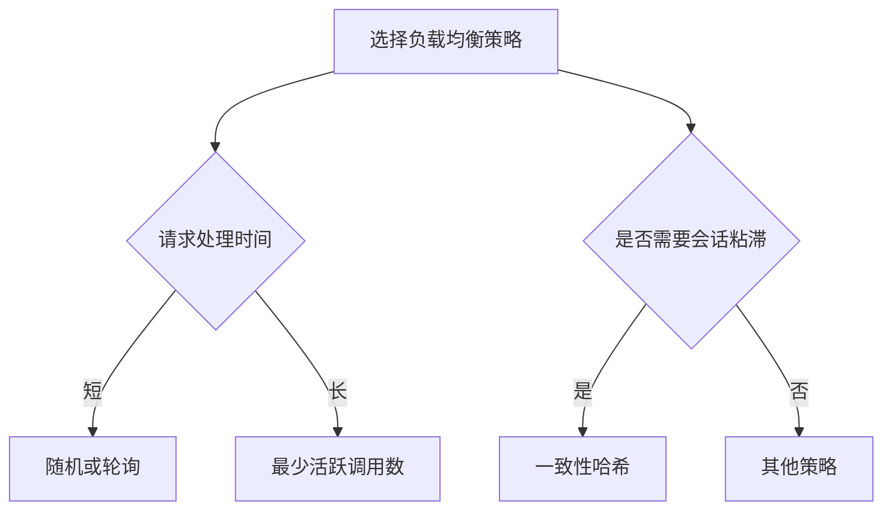
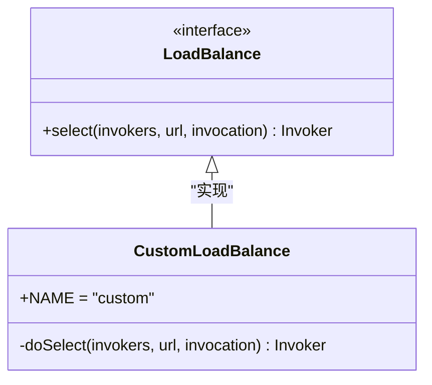

# 负载均衡策略

<cite>
**本文档中引用的文件**  
- [LoadBalance.java](file://dubbo-cluster\src\main\java\org\apache\dubbo\rpc\cluster\LoadBalance.java)
- [AbstractLoadBalance.java](file://dubbo-cluster\src\main\java\org\apache\dubbo\rpc\cluster\loadbalance\AbstractLoadBalance.java)
- [RandomLoadBalance.java](file://dubbo-cluster\src\main\java\org\apache\dubbo\rpc\cluster\loadbalance\RandomLoadBalance.java)
- [RoundRobinLoadBalance.java](file://dubbo-cluster\src\main\java\org\apache\dubbo\rpc\cluster\loadbalance\RoundRobinLoadBalance.java)
- [LeastActiveLoadBalance.java](file://dubbo-cluster\src\main\java\org\apache\dubbo\rpc\cluster\loadbalance\LeastActiveLoadBalance.java)
- [ConsistentHashLoadBalance.java](file://dubbo-cluster\src\main\java\org\apache\dubbo\rpc\cluster\loadbalance\ConsistentHashLoadBalance.java)
- [Constants.java](file://dubbo-cluster\src\main\java\org\apache\dubbo\rpc\cluster\Constants.java)
</cite>

## 目录
1. [引言](#引言)
2. [负载均衡策略概述](#负载均衡策略概述)
3. [随机负载均衡策略](#随机负载均衡策略)
4. [轮询负载均衡策略](#轮询负载均衡策略)
5. [最少活跃调用数负载均衡策略](#最少活跃调用数负载均衡策略)
6. [一致性哈希负载均衡策略](#一致性哈希负载均衡策略)
7. [权重配置与粘滞连接](#权重配置与粘滞连接)
8. [策略选择指南](#策略选择指南)
9. [自定义负载均衡算法扩展](#自定义负载均衡算法扩展)
10. [总结](#总结)

## 引言
Dubbo作为一款高性能的Java RPC框架，其负载均衡机制是确保服务调用高效、稳定的关键组件。本文深入分析Dubbo提供的多种负载均衡策略，包括随机、轮询、最少活跃调用数和一致性哈希等算法的实现原理和源码细节。通过详细解析每种策略的工作机制、性能特点和适用场景，为开发者提供全面的指导，帮助其根据业务需求选择合适的负载均衡策略，并进行有效的性能调优。

**节来源**
- [LoadBalance.java](file://dubbo-cluster\src\main\java\org\apache\dubbo\rpc\cluster\LoadBalance.java)

## 负载均衡策略概述
Dubbo的负载均衡策略通过`LoadBalance`接口定义，该接口是SPI（Service Provider Interface）扩展点，允许用户自定义实现。`LoadBalance`接口的核心方法是`select`，它根据给定的调用上下文从多个服务提供者中选择一个合适的调用者。Dubbo默认提供了多种负载均衡策略，每种策略都有其特定的应用场景和优势。

**图来源**
- [LoadBalance.java](file://dubbo-cluster\src\main\java\org\apache\dubbo\rpc\cluster\LoadBalance.java)
- [AbstractLoadBalance.java](file://dubbo-cluster\src\main\java\org\apache\dubbo\rpc\cluster\loadbalance\AbstractLoadBalance.java)
- [RandomLoadBalance.java](file://dubbo-cluster\src\main\java\org\apache\dubbo\rpc\cluster\loadbalance\RandomLoadBalance.java)
- [RoundRobinLoadBalance.java](file://dubbo-cluster\src\main\java\org\apache\dubbo\rpc\cluster\loadbalance\RoundRobinLoadBalance.java)
- [LeastActiveLoadBalance.java](file://dubbo-cluster\src\main\java\org\apache\dubbo\rpc\cluster\loadbalance\LeastActiveLoadBalance.java)
- [ConsistentHashLoadBalance.java](file://dubbo-cluster\src\main\java\org\apache\dubbo\rpc\cluster\loadbalance\ConsistentHashLoadBalance.java)

**节来源**
- [LoadBalance.java](file://dubbo-cluster\src\main\java\org\apache\dubbo\rpc\cluster\LoadBalance.java)
- [AbstractLoadBalance.java](file://dubbo-cluster\src\main\java\org\apache\dubbo\rpc\cluster\loadbalance\AbstractLoadBalance.java)

## 随机负载均衡策略
随机负载均衡策略（RandomLoadBalance）是Dubbo的默认负载均衡策略。它通过随机选择一个服务提供者来实现负载均衡。当所有服务提供者的权重相同时，直接使用`ThreadLocalRandom.current().nextInt(length)`进行随机选择；当权重不同时，则根据权重进行加权随机选择。

**图来源**
- [RandomLoadBalance.java](file://dubbo-cluster\src\main\java\org\apache\dubbo\rpc\cluster\loadbalance\RandomLoadBalance.java)

**节来源**
- [RandomLoadBalance.java](file://dubbo-cluster\src\main\java\org\apache\dubbo\rpc\cluster\loadbalance\RandomLoadBalance.java)

## 轮询负载均衡策略
轮询负载均衡策略（RoundRobinLoadBalance）按照顺序依次选择服务提供者，实现均匀的负载分配。Dubbo的实现支持权重轮询，即权重越高的服务提供者被选中的概率越大。该策略使用`WeightedRoundRobin`类来维护每个服务提供者的权重和当前值，通过增加当前值并选择最大值的方式来实现加权轮询。

**图来源**
- [RoundRobinLoadBalance.java](file://dubbo-cluster\src\main\java\org\apache\dubbo\rpc\cluster\loadbalance\RoundRobinLoadBalance.java)

**节来源**
- [RoundRobinLoadBalance.java](file://dubbo-cluster\src\main\java\org\apache\dubbo\rpc\cluster\loadbalance\RoundRobinLoadBalance.java)

## 最少活跃调用数负载均衡策略
最少活跃调用数负载均衡策略（LeastActiveLoadBalance）优先选择活跃调用数最少的服务提供者。活跃调用数是指当前正在处理的请求数量。该策略能够有效避免某些服务提供者过载，而其他提供者空闲的情况，特别适用于处理时间较长的请求。

**图来源**
- [LeastActiveLoadBalance.java](file://dubbo-cluster\src\main\java\org\apache\dubbo\rpc\cluster\loadbalance\LeastActiveLoadBalance.java)

**节来源**
- [LeastActiveLoadBalance.java](file://dubbo-cluster\src\main\java\org\apache\dubbo\rpc\cluster\loadbalance\LeastActiveLoadBalance.java)

## 一致性哈希负载均衡策略
一致性哈希负载均衡策略（ConsistentHashLoadBalance）通过一致性哈希算法将请求映射到服务提供者上，确保相同的请求总是被路由到同一个提供者，从而实现会话粘滞。该策略使用MD5哈希算法生成虚拟节点，并将这些节点分布在哈希环上，通过查找最接近请求哈希值的节点来选择服务提供者。

**图来源**
- [ConsistentHashLoadBalance.java](file://dubbo-cluster\src\main\java\org\apache\dubbo\rpc\cluster\loadbalance\ConsistentHashLoadBalance.java)

**节来源**
- [ConsistentHashLoadBalance.java](file://dubbo-cluster\src\main\java\org\apache\dubbo\rpc\cluster\loadbalance\ConsistentHashLoadBalance.java)

## 权重配置与粘滞连接
Dubbo支持通过配置权重来调整服务提供者的负载分配。权重值越大，被选中的概率越高。此外，Dubbo还支持粘滞连接（Sticky Connection），即让同一个消费者的后续请求尽可能调用到同一个服务提供者，这对于需要保持会话状态的场景非常有用。

**图来源**
- [Constants.java](file://dubbo-cluster\src\main\java\org\apache\dubbo\rpc\cluster\Constants.java)
- [AbstractLoadBalance.java](file://dubbo-cluster\src\main\java\org\apache\dubbo\rpc\cluster\loadbalance\AbstractLoadBalance.java)

**节来源**
- [Constants.java](file://dubbo-cluster\src\main\java\org\apache\dubbo\rpc\cluster\Constants.java)
- [AbstractLoadBalance.java](file://dubbo-cluster\src\main\java\org\apache\dubbo\rpc\cluster\loadbalance\AbstractLoadBalance.java)

## 策略选择指南
选择合适的负载均衡策略对于系统的性能和稳定性至关重要。以下是一些选择指南：

- **随机策略**：适用于服务提供者性能相近且请求处理时间较短的场景。
- **轮询策略**：适用于需要均匀分配负载的场景，特别是当服务提供者性能相近时。
- **最少活跃调用数策略**：适用于处理时间较长的请求，能够有效避免某些服务提供者过载。
- **一致性哈希策略**：适用于需要会话粘滞的场景，如购物车、用户会话等。

**图来源**
- [RandomLoadBalance.java](file://dubbo-cluster\src\main\java\org\apache\dubbo\rpc\cluster\loadbalance\RandomLoadBalance.java)
- [RoundRobinLoadBalance.java](file://dubbo-cluster\src\main\java\org\apache\dubbo\rpc\cluster\loadbalance\RoundRobinLoadBalance.java)
- [LeastActiveLoadBalance.java](file://dubbo-cluster\src\main\java\org\apache\dubbo\rpc\cluster\loadbalance\LeastActiveLoadBalance.java)
- [ConsistentHashLoadBalance.java](file://dubbo-cluster\src\main\java\org\apache\dubbo\rpc\cluster\loadbalance\ConsistentHashLoadBalance.java)

**节来源**
- [RandomLoadBalance.java](file://dubbo-cluster\src\main\java\org\apache\dubbo\rpc\cluster\loadbalance\RandomLoadBalance.java)
- [RoundRobinLoadBalance.java](file://dubbo-cluster\src\main\java\org\apache\dubbo\rpc\cluster\loadbalance\RoundRobinLoadBalance.java)
- [LeastActiveLoadBalance.java](file://dubbo-cluster\src\main\java\org\apache\dubbo\rpc\cluster\loadbalance\LeastActiveLoadBalance.java)
- [ConsistentHashLoadBalance.java](file://dubbo-cluster\src\main\java\org\apache\dubbo\rpc\cluster\loadbalance\ConsistentHashLoadBalance.java)

## 自定义负载均衡算法扩展
Dubbo通过SPI机制支持自定义负载均衡算法的扩展。开发者只需实现`LoadBalance`接口，并在`META-INF/dubbo/internal/org.apache.dubbo.rpc.cluster.LoadBalance`文件中注册自己的实现类，即可在配置中使用自定义的负载均衡策略。

**图来源**
- [LoadBalance.java](file://dubbo-cluster\src\main\java\org\apache\dubbo\rpc\cluster\LoadBalance.java)

**节来源**
- [LoadBalance.java](file://dubbo-cluster\src\main\java\org\apache\dubbo\rpc\cluster\LoadBalance.java)

## 总结
Dubbo提供了多种负载均衡策略，每种策略都有其特定的应用场景和优势。通过深入理解这些策略的实现原理和工作机制，开发者可以根据业务需求选择合适的负载均衡策略，并进行有效的性能调优。此外，Dubbo的SPI机制使得自定义负载均衡算法的扩展变得简单易行，为开发者提供了极大的灵活性。