# 集群扩展

<cite>
**本文档中引用的文件**  
- [Cluster.java](file://dubbo-cluster\src\main\java\org\apache\dubbo\rpc\cluster\Cluster.java)
- [ClusterInvoker.java](file://dubbo-cluster\src\main\java\org\apache\dubbo\rpc\cluster\ClusterInvoker.java)
- [FailoverCluster.java](file://dubbo-cluster\src\main\java\org\apache\dubbo\rpc\cluster\support\FailoverCluster.java)
- [FailoverClusterInvoker.java](file://dubbo-cluster\src\main\java\org\apache\dubbo\rpc\cluster\support\FailoverClusterInvoker.java)
- [ZoneAwareCluster.java](file://dubbo-cluster\src\main\java\org\apache\dubbo\rpc\cluster\support\registry\ZoneAwareCluster.java)
- [ZoneAwareClusterInvoker.java](file://dubbo-cluster\src\main\java\org\apache\dubbo\rpc\cluster\support\registry\ZoneAwareClusterInvoker.java)
- [AbstractCluster.java](file://dubbo-cluster\src\main\java\org\apache\dubbo\rpc\cluster\support\wrapper\AbstractCluster.java)
- [org.apache.dubbo.rpc.cluster.Cluster](file://dubbo-cluster\src\main\resources\META-INF\dubbo\internal\org.apache.dubbo.rpc.cluster.Cluster)
- [ExtensionLoader.java](file://dubbo-common\src\main\java\org\apache\dubbo\common\extension\ExtensionLoader.java)
- [SPI.java](file://dubbo-common\src\main\java\org\apache\dubbo\common\extension\SPI.java)
- [Adaptive.java](file://dubbo-common\src\main\java\org\apache\dubbo\common\extension\Adaptive.java)
- [Activate.java](file://dubbo-common\src\main\java\org\apache\dubbo\common\extension\Activate.java)
</cite>

## 目录
1. [引言](#引言)
2. [核心接口设计](#核心接口设计)
3. [SPI扩展机制](#spi扩展机制)
4. [集群策略实现](#集群策略实现)
5. [自定义集群扩展](#自定义集群扩展)
6. [生命周期与线程安全](#生命周期与线程安全)
7. [测试与性能评估](#测试与性能评估)
8. [最佳实践](#最佳实践)
9. [常见问题](#常见问题)
10. [总结](#总结)

## 引言

Dubbo的集群扩展机制是其高可用性和容错能力的核心。该机制通过Cluster和ClusterInvoker接口实现，为服务消费者提供了多种集群策略选择，如失败转移、快速失败、并行调用等。本文档将深入分析这些接口的设计原理和实现方式，并指导开发者如何通过SPI机制自定义集群策略。

## 核心接口设计

### Cluster接口

Cluster接口是Dubbo集群扩展的核心，通过SPI机制实现可插拔的集群策略。该接口定义了将多个服务提供者合并为一个虚拟调用者的功能。

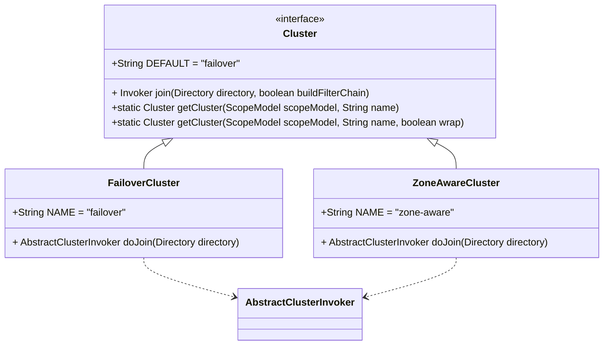

**图源**  
- [Cluster.java](file://dubbo-cluster\src\main\java\org\apache\dubbo\rpc\cluster\Cluster.java#L27-L79)
- [FailoverCluster.java](file://dubbo-cluster\src\main\java\org\apache\dubbo\rpc\cluster\support\FailoverCluster.java#L17-L35)
- [ZoneAwareCluster.java](file://dubbo-cluster\src\main\java\org\apache\dubbo\rpc\cluster\support\registry\ZoneAwareCluster.java#L17-L32)

**本节源码**  
- [Cluster.java](file://dubbo-cluster\src\main\java\org\apache\dubbo\rpc\cluster\Cluster.java#L27-L79)

### ClusterInvoker接口

ClusterInvoker接口继承自Invoker，代表最终被RPC代理引用的调用者类型。它持有多个普通调用者（Invoker），并提供负载均衡和高可用策略。

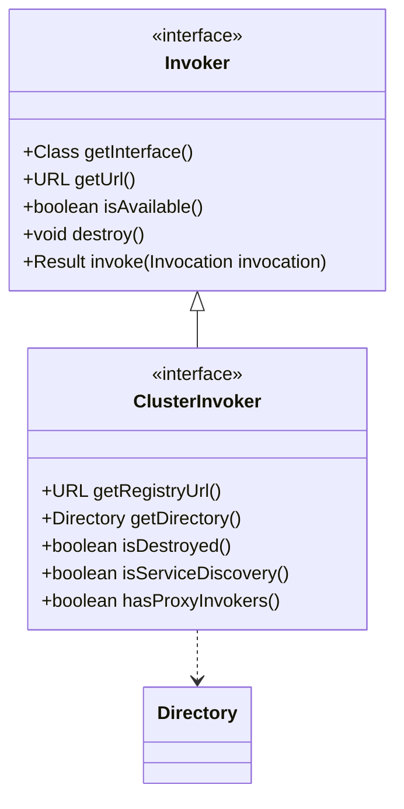

**图源**  
- [ClusterInvoker.java](file://dubbo-cluster\src\main\java\org\apache\dubbo\rpc\cluster\ClusterInvoker.java#L22-L57)
- [Invoker.java](file://dubbo-common\src\main\java\org\apache\dubbo\rpc\Invoker.java)

**本节源码**  
- [ClusterInvoker.java](file://dubbo-cluster\src\main\java\org\apache\dubbo\rpc\cluster\ClusterInvoker.java#L22-L57)

## SPI扩展机制

### SPI核心组件

Dubbo的SPI扩展机制是其插件化架构的基础，通过ExtensionLoader类管理所有扩展的加载、缓存和依赖注入。

```mermaid
classDiagram
class ExtensionLoader {
-Class<?> type
-ConcurrentMap<Class<?>, Object> extensionInstances
-ConcurrentMap<Class<?>, String> cachedNames
-Holder<Map<String, Class<?>>> cachedClasses
+<T> ExtensionLoader<T> getExtensionLoader(Class<T> type)
+T getExtension(String name)
+T getAdaptiveExtension()
+List<T> getActivateExtension(URL url, String key)
}
class SPI {
<<annotation>>
+String value() default ""
+ExtensionScope scope() default ExtensionScope.FRAMEWORK
}
class Adaptive {
<<annotation>>
+String[] value() default {}
}
class Activate {
<<annotation>>
+String[] value() default {}
+String[] group() default {}
+String[] onClass() default {}
}
ExtensionLoader ..> SPI
ExtensionLoader ..> Adaptive
ExtensionLoader ..> Activate
```

**图源**  
- [ExtensionLoader.java](file://dubbo-common\src\main\java\org\apache\dubbo\common\extension\ExtensionLoader.java#L92-L141)
- [SPI.java](file://dubbo-common\src\main\java\org\apache\dubbo\common\extension\SPI.java)
- [Adaptive.java](file://dubbo-common\src\main\java\org\apache\dubbo\common\extension\Adaptive.java)
- [Activate.java](file://dubbo-common\src\main\java\org\apache\dubbo\common\extension\Activate.java)

**本节源码**  
- [ExtensionLoader.java](file://dubbo-common\src\main\java\org\apache\dubbo\common\extension\ExtensionLoader.java#L92-L141)

### 扩展加载策略

Dubbo遵循特定的加载策略来查找和加载扩展实现，优先级从高到低如下：

1. `META-INF/dubbo/internal/` - Dubbo内部扩展
2. `META-INF/dubbo/` - 用户扩展
3. `META-INF/services/` - Java SPI兼容

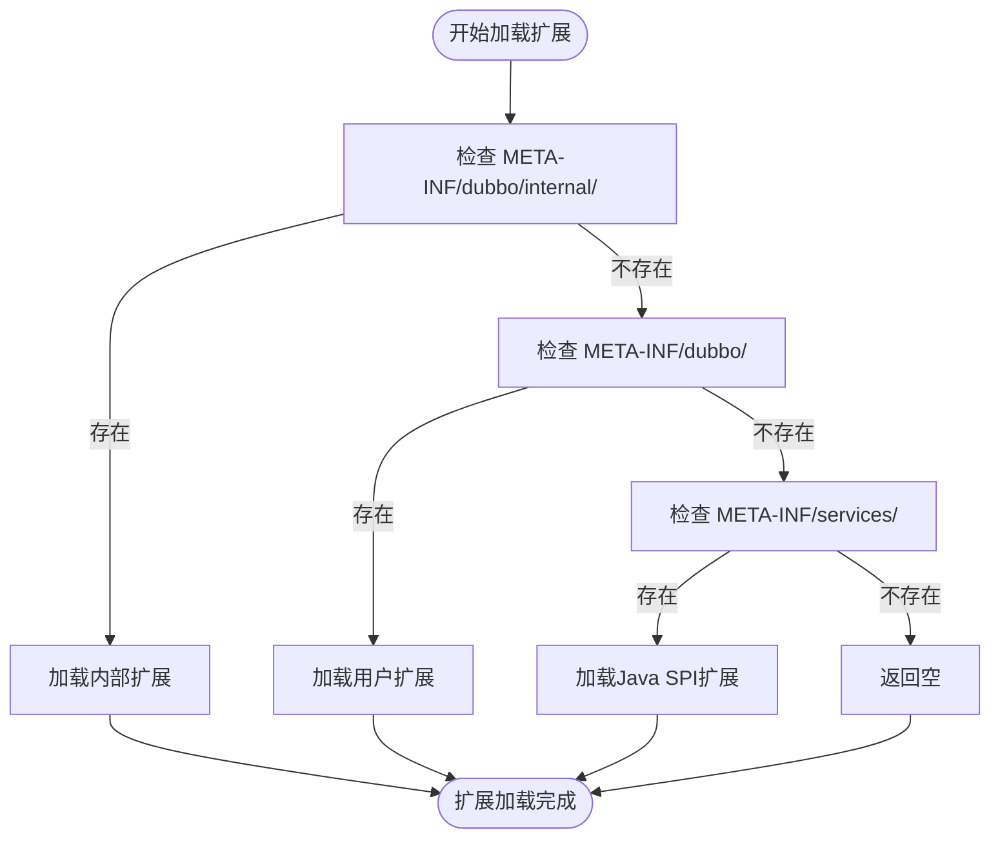

**图源**  
- [org.apache.dubbo.rpc.cluster.Cluster](file://dubbo-cluster\src\main\resources\META-INF\dubbo\internal\org.apache.dubbo.rpc.cluster.Cluster)

**本节源码**  
- [org.apache.dubbo.rpc.cluster.Cluster](file://dubbo-cluster\src\main\resources\META-INF\dubbo\internal\org.apache.dubbo.rpc.cluster.Cluster)

## 集群策略实现

### FailoverCluster实现

FailoverCluster是Dubbo默认的集群策略，当调用失败时会自动重试其他服务提供者。

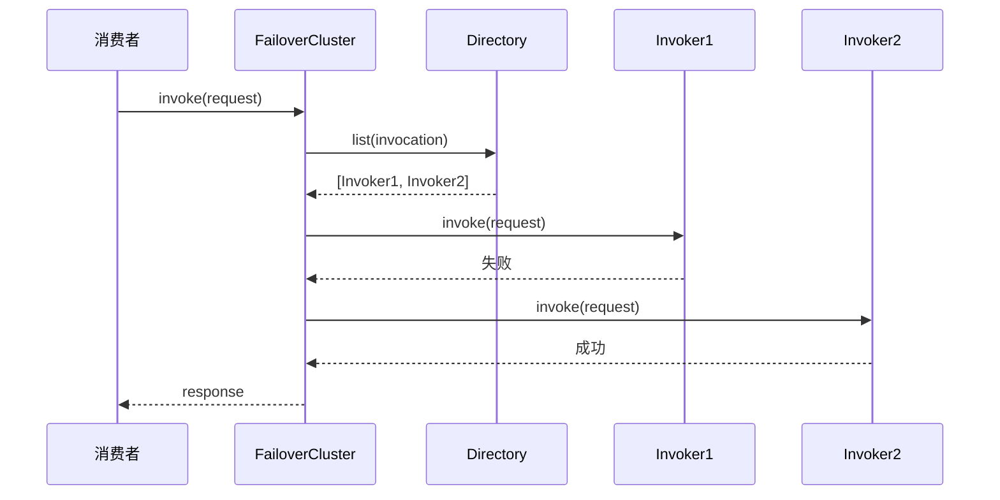

**图源**  
- [FailoverCluster.java](file://dubbo-cluster\src\main\java\org\apache\dubbo\rpc\cluster\support\FailoverCluster.java#L17-L35)
- [FailoverClusterInvoker.java](file://dubbo-cluster\src\main\java\org\apache\dubbo\rpc\cluster\support\FailoverClusterInvoker.java#L17-L143)

**本节源码**  
- [FailoverCluster.java](file://dubbo-cluster\src\main\java\org\apache\dubbo\rpc\cluster\support\FailoverCluster.java#L17-L35)
- [FailoverClusterInvoker.java](file://dubbo-cluster\src\main\java\org\apache\dubbo\rpc\cluster\support\FailoverClusterInvoker.java#L17-L143)

### ZoneAwareCluster实现

ZoneAwareCluster专为多注册中心场景设计，支持区域感知的负载均衡策略。

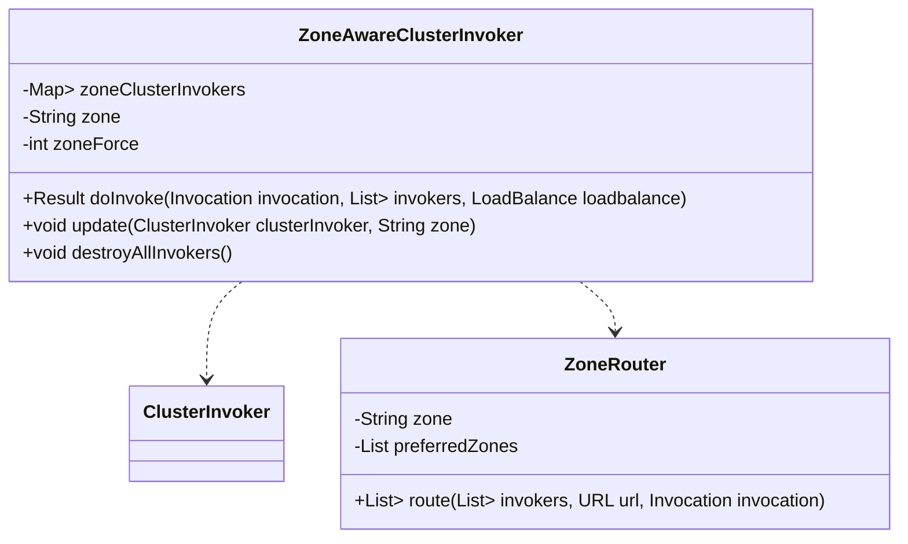

**图源**  
- [ZoneAwareCluster.java](file://dubbo-cluster\src\main\java\org\apache\dubbo\rpc\cluster\support\registry\ZoneAwareCluster.java#L17-L32)
- [ZoneAwareClusterInvoker.java](file://dubbo-cluster\src\main\java\org\apache\dubbo\rpc\cluster\support\registry\ZoneAwareClusterInvoker.java)

**本节源码**  
- [ZoneAwareCluster.java](file://dubbo-cluster\src\main\java\org\apache\dubbo\rpc\cluster\support\registry\ZoneAwareCluster.java#L17-L32)

## 自定义集群扩展

### 自定义Cluster实现

要创建自定义集群策略，需要实现Cluster接口并使用@SPI注解标记。

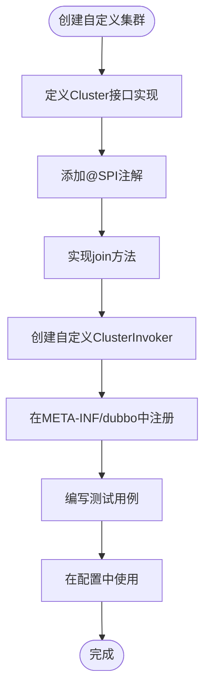

**本节源码**  
- [AbstractCluster.java](file://dubbo-cluster\src\main\java\org\apache\dubbo\rpc\cluster\support\wrapper\AbstractCluster.java#L43-L283)

### 配置使用示例

自定义集群策略可以通过配置文件或注解方式使用。

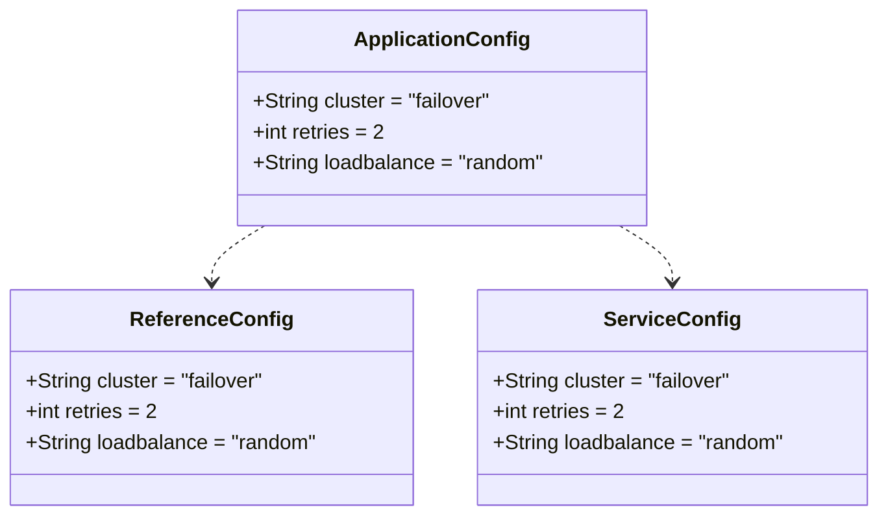

**本节源码**  
- [Cluster.java](file://dubbo-cluster\src\main\java\org\apache\dubbo\rpc\cluster\Cluster.java#L34-L38)

## 生命周期与线程安全

### 生命周期管理

集群扩展的生命周期由Dubbo框架管理，包括创建、初始化和销毁。

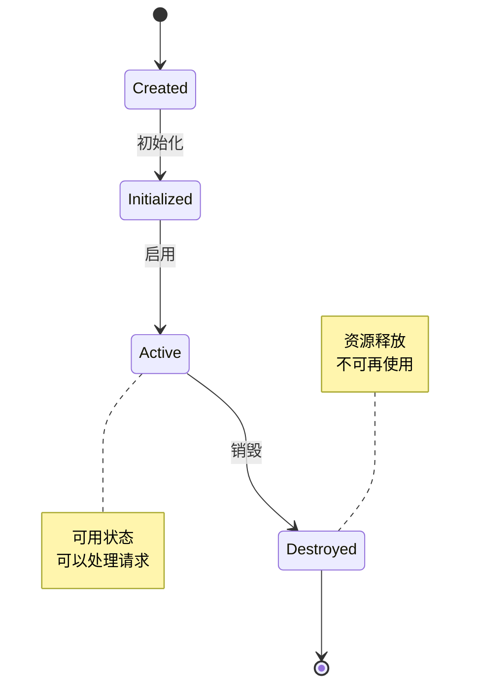

**本节源码**  
- [ClusterInvoker.java](file://dubbo-cluster\src\main\java\org\apache\dubbo\rpc\cluster\ClusterInvoker.java#L40-L41)

### 线程安全考虑

Dubbo的集群实现需要考虑多线程环境下的安全性。

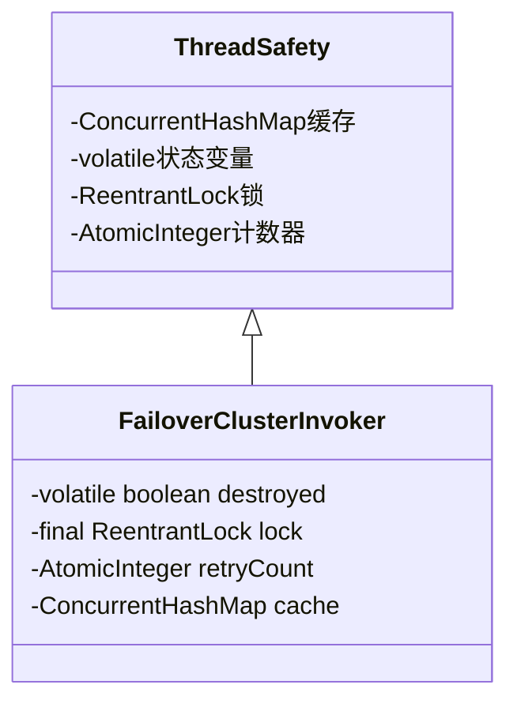

**本节源码**  
- [FailoverClusterInvoker.java](file://dubbo-cluster\src\main\java\org\apache\dubbo\rpc\cluster\support\FailoverClusterInvoker.java#L48-L143)

## 测试与性能评估

### 测试方法

集群扩展的测试需要覆盖正常流程、异常处理和边界条件。

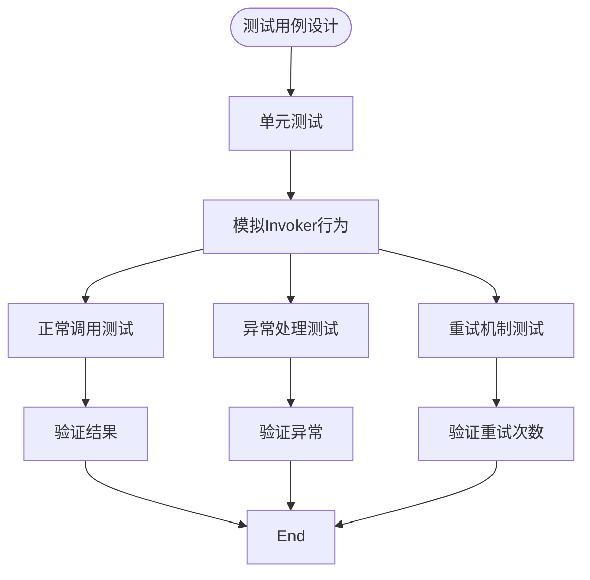

**本节源码**  
- [FailoverClusterInvokerTest.java](file://dubbo-cluster\src\test\java\org\apache\dubbo\rpc\cluster\support\FailoverClusterInvokerTest.java)

### 性能评估指标

评估集群扩展性能的关键指标包括：

```mermaid
erDiagram
PERFORMANCE_METRICS {
string name PK
double value
string unit
timestamp timestamp
string category
string description
}
CATEGORY {
string name PK
string description
}
PERFORMANCE_METRICS ||--o{ CATEGORY : belongs_to
PERFORMANCE_METRICS {
"响应时间" string
"吞吐量" string
"错误率" string
"重试次数" string
"资源消耗" string
}
CATEGORY {
"性能" string
"可靠性" string
"资源" string
}
```

**本节源码**  
- [FailoverClusterInvoker.java](file://dubbo-cluster\src\main\java\org\apache\dubbo\rpc\cluster\support\FailoverClusterInvoker.java#L57-L143)

## 最佳实践

### 设计原则

开发集群扩展时应遵循以下最佳实践：

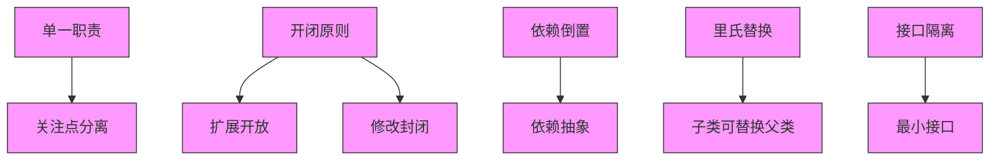

**本节源码**  
- [AbstractCluster.java](file://dubbo-cluster\src\main\java\org\apache\dubbo\rpc\cluster\support\wrapper\AbstractCluster.java)

### 配置建议

合理的配置可以优化集群扩展的性能和可靠性。

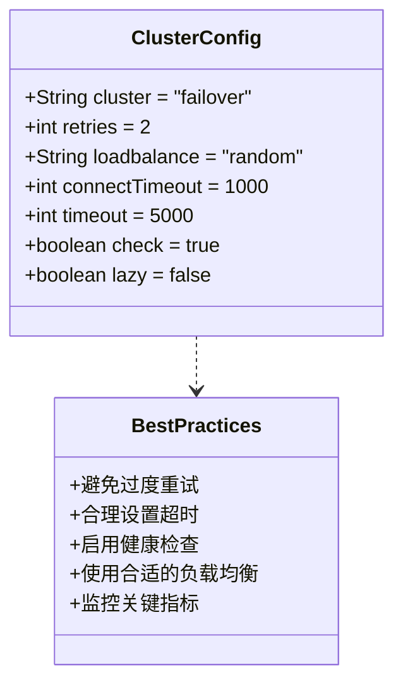

**本节源码**  
- [Cluster.java](file://dubbo-cluster\src\main\java\org\apache\dubbo\rpc\cluster\Cluster.java)

## 常见问题

### 问题排查

常见的集群扩展问题及解决方案：

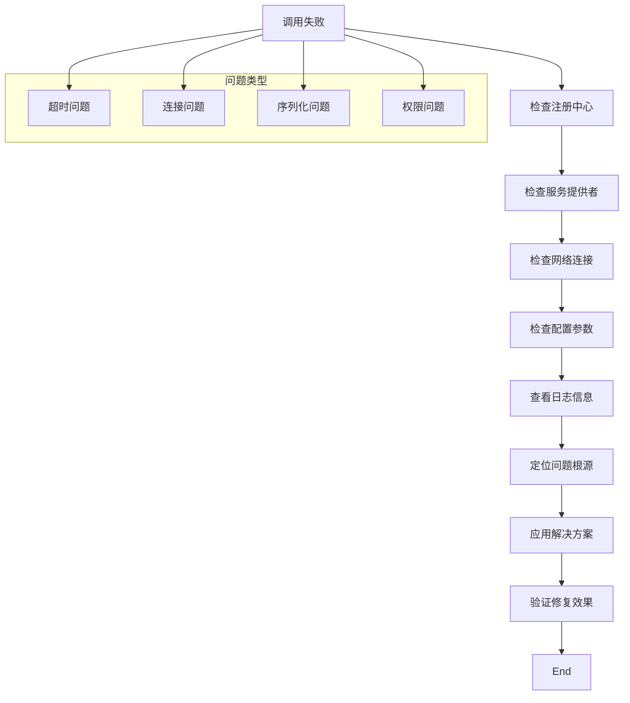

**本节源码**  
- [FailoverClusterInvoker.java](file://dubbo-cluster\src\main\java\org\apache\dubbo\rpc\cluster\support\FailoverClusterInvoker.java#L103-L126)

### 调试技巧

有效的调试方法可以帮助快速定位问题。

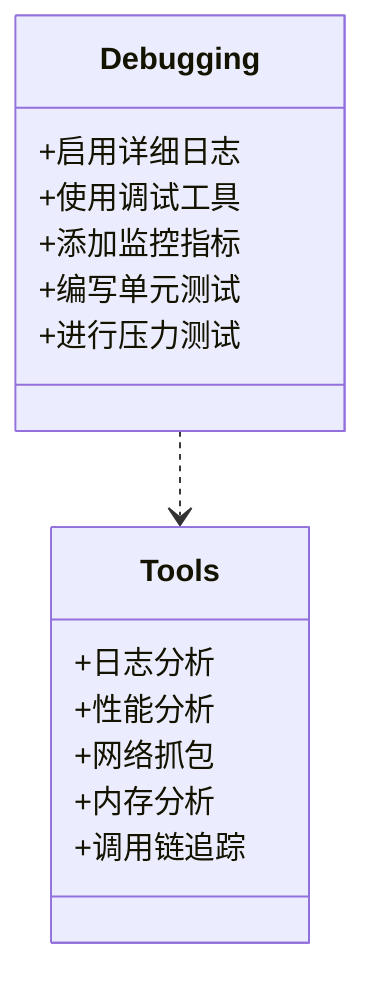

**本节源码**  
- [FailoverClusterInvoker.java](file://dubbo-cluster\src\main\java\org\apache\dubbo\rpc\cluster\support\FailoverClusterInvoker.java#L50-L51)

## 总结

Dubbo的集群扩展机制通过精心设计的Cluster和ClusterInvoker接口，结合强大的SPI扩展机制，为开发者提供了灵活、可扩展的集群策略实现方案。通过理解这些核心接口的设计原理和实现方式，开发者可以轻松地自定义集群策略，满足特定业务场景的需求。同时，遵循最佳实践和注意生命周期管理、线程安全等问题，可以确保扩展的稳定性和性能。