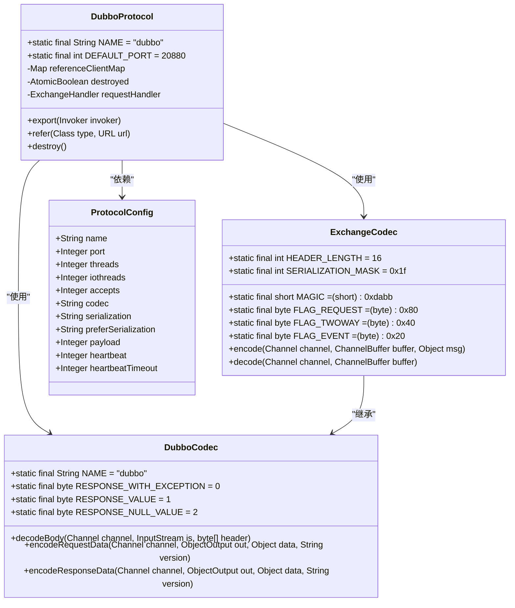
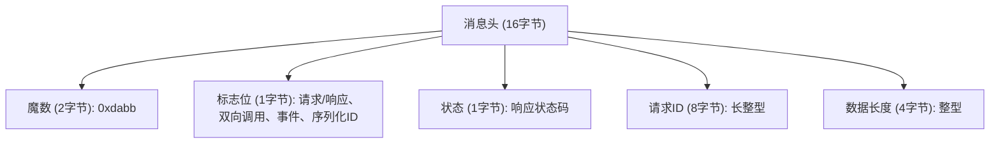
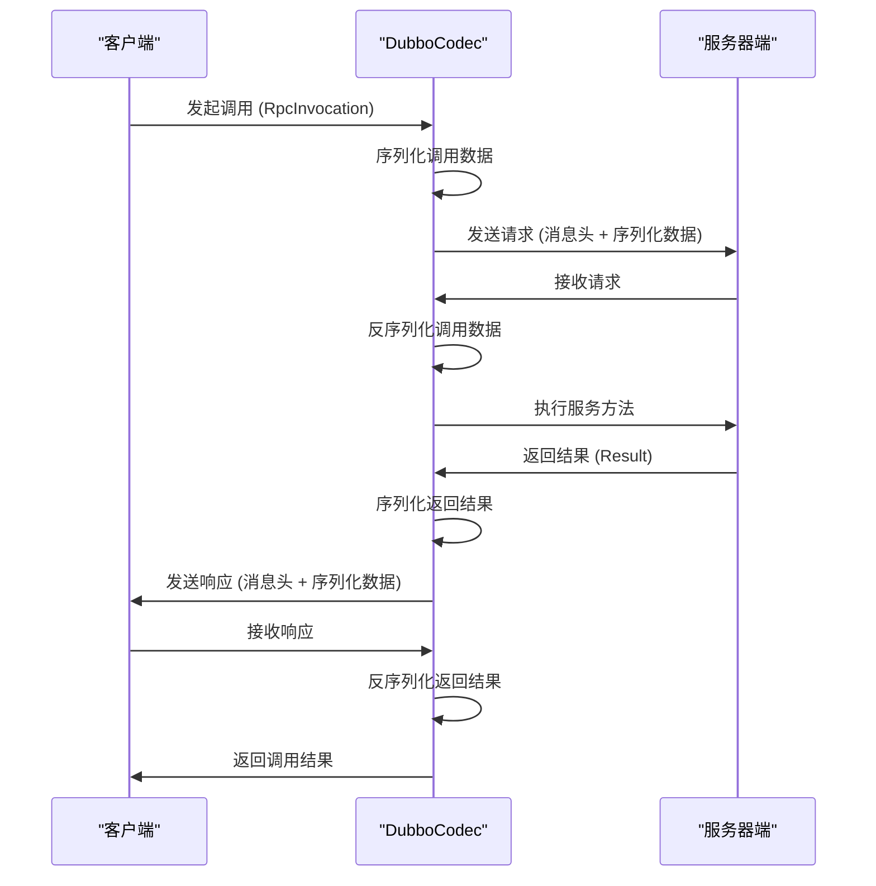
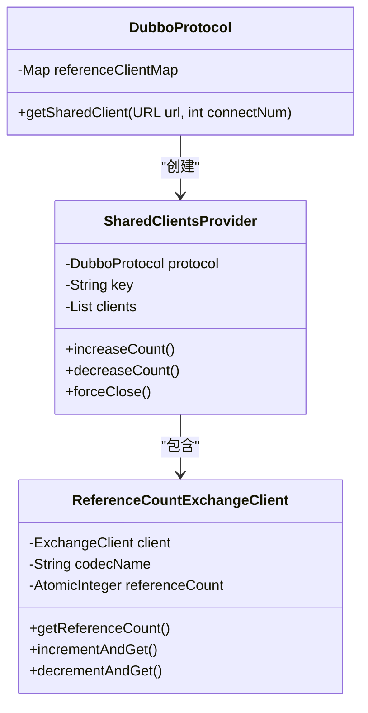
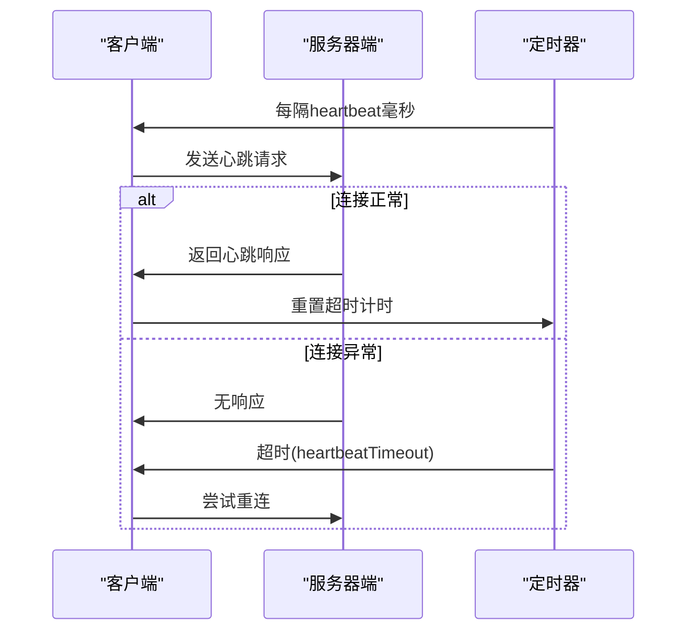
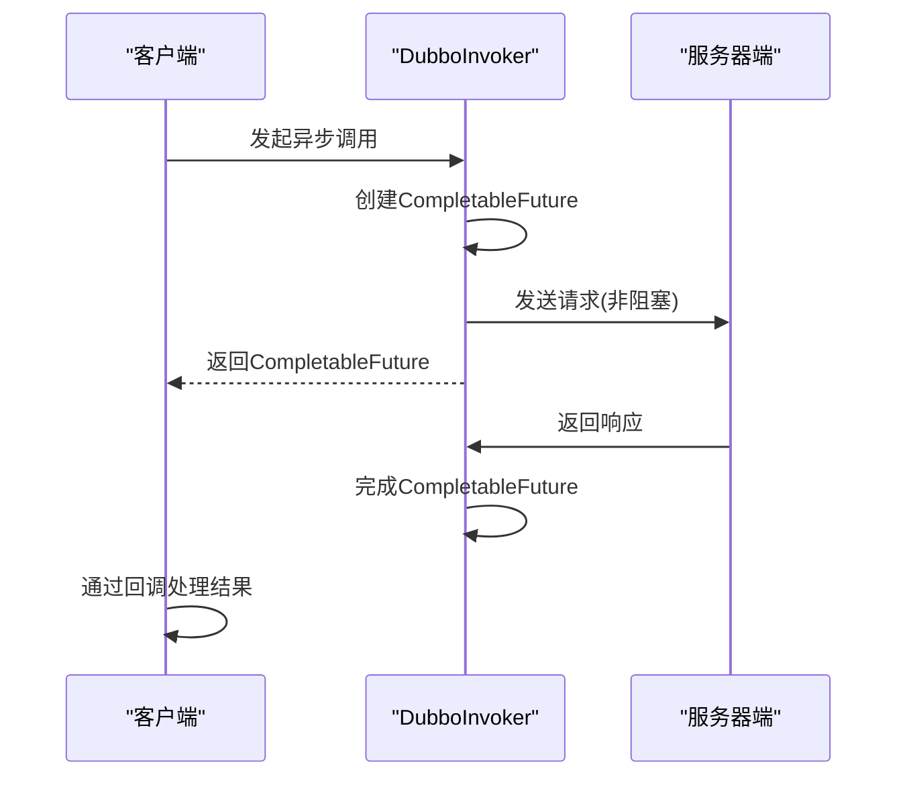
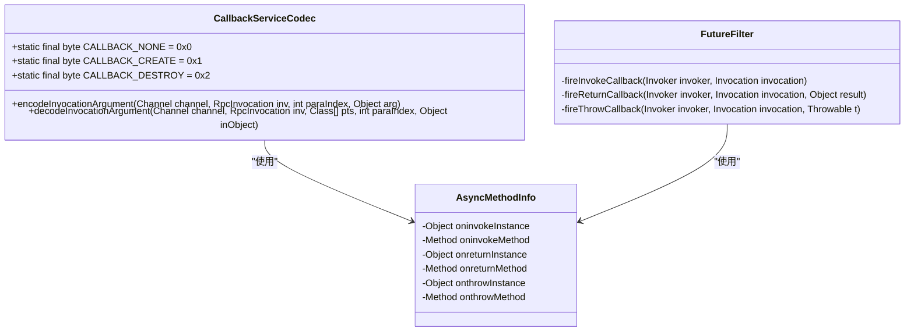

# Dubbo协议

<cite>
**本文档引用的文件**   
- [DubboProtocol.java](file://dubbo-rpc\dubbo-rpc-dubbo\src\main\java\org\apache\dubbo\rpc\protocol\dubbo\DubboProtocol.java)
- [ExchangeCodec.java](file://dubbo-remoting\dubbo-remoting-api\src\main\java\org\apache\dubbo\remoting\exchange\codec\ExchangeCodec.java)
- [DubboCodec.java](file://dubbo-rpc\dubbo-rpc-dubbo\src\main\java\org\apache\dubbo\rpc\protocol\dubbo\DubboCodec.java)
- [ProtocolConfig.java](file://dubbo-common\src\main\java\org\apache\dubbo\config\ProtocolConfig.java)
- [DubboInvoker.java](file://dubbo-rpc\dubbo-rpc-dubbo\src\main\java\org\apache\dubbo\rpc\protocol\dubbo\DubboInvoker.java)
- [CallbackServiceCodec.java](file://dubbo-rpc\dubbo-rpc-dubbo\src\main\java\org\apache\dubbo\rpc\protocol\dubbo\CallbackServiceCodec.java)
- [HeaderExchangeClient.java](file://dubbo-remoting\dubbo-remoting-api\src\main\java\org\apache\dubbo\remoting\exchange\support\header\HeaderExchangeClient.java)
- [AsyncMethodInfo.java](file://dubbo-common\src\main\java\org\apache\dubbo\rpc\model\AsyncMethodInfo.java)
</cite>

## 目录
1. [引言](#引言)
2. [协议设计与实现](#协议设计与实现)
3. [二进制编解码机制](#二进制编解码机制)
4. [连接复用与心跳检测](#连接复用与心跳检测)
5. [异步调用与回调功能](#异步调用与回调功能)
6. [配置与使用](#配置与使用)
7. [Dubbo协议与Triple协议对比](#dubbo协议与triple协议对比)
8. [协议扩展与自定义编解码器](#协议扩展与自定义编解码器)
9. [性能调优与故障排查](#性能调优与故障排查)
10. [安全加固](#安全加固)
11. [结论](#结论)

## 引言

Dubbo协议是Dubbo框架的传统高性能协议，基于TCP长连接和二进制编解码，为分布式服务调用提供了高效、可靠的通信机制。作为Dubbo的核心协议，它在性能、稳定性和功能完整性方面表现出色，广泛应用于各种生产环境。本文档将深入剖析Dubbo协议的设计与实现，重点介绍其二进制编解码机制、连接复用策略、心跳检测、异步调用和回调功能，并提供详细的配置使用指南和高级实践。

## 协议设计与实现

Dubbo协议的设计遵循了高性能、高可靠性的原则，其核心实现位于`DubboProtocol`类中。该协议基于TCP传输，通过长连接减少连接建立的开销，并采用二进制编解码提高序列化和反序列化的效率。



**图源**
- [DubboProtocol.java](file://dubbo-rpc\dubbo-rpc-dubbo\src\main\java\org\apache\dubbo\rpc\protocol\dubbo\DubboProtocol.java)
- [ExchangeCodec.java](file://dubbo-remoting\dubbo-remoting-api\src\main\java\org\apache\dubbo\remoting\exchange\codec\ExchangeCodec.java)
- [DubboCodec.java](file://dubbo-rpc\dubbo-rpc-dubbo\src\main\java\org\apache\dubbo\rpc\protocol\dubbo\DubboCodec.java)
- [ProtocolConfig.java](file://dubbo-common\src\main\java\org\apache\dubbo\config\ProtocolConfig.java)

**节源**
- [DubboProtocol.java](file://dubbo-rpc\dubbo-rpc-dubbo\src\main\java\org\apache\dubbo\rpc\protocol\dubbo\DubboProtocol.java#L95-L652)
- [ExchangeCodec.java](file://dubbo-remoting\dubbo-remoting-api\src\main\java\org\apache\dubbo\remoting\exchange\codec\ExchangeCodec.java#L57-L562)
- [DubboCodec.java](file://dubbo-rpc\dubbo-rpc-dubbo\src\main\java\org\apache\dubbo\rpc\protocol\dubbo\DubboCodec.java#L61-L349)
- [ProtocolConfig.java](file://dubbo-common\src\main\java\org\apache\dubbo\config\ProtocolConfig.java#L89-L280)

## 二进制编解码机制

Dubbo协议的二进制编解码机制是其高性能的关键。它定义了固定的消息头和灵活的消息体结构，通过高效的序列化方式传输数据。

### 消息头结构

消息头固定为16字节，包含协议魔数、标志位、请求ID和数据长度等关键信息。



**图源**
- [ExchangeCodec.java](file://dubbo-remoting\dubbo-remoting-api\src\main\java\org\apache\dubbo\remoting\exchange\codec\ExchangeCodec.java#L60-L69)

**节源**
- [ExchangeCodec.java](file://dubbo-remoting\dubbo-remoting-api\src\main\java\org\apache\dubbo\remoting\exchange\codec\ExchangeCodec.java#L60-L69)

### 消息体与序列化过程

消息体包含实际的调用数据，其序列化过程由`DubboCodec`类负责。根据配置的序列化方式（如Hessian2、Fastjson2等），对调用参数和返回值进行序列化。



**图源**
- [DubboCodec.java](file://dubbo-rpc\dubbo-rpc-dubbo\src\main\java\org\apache\dubbo\rpc\protocol\dubbo\DubboCodec.java#L269-L328)
- [ExchangeCodec.java](file://dubbo-remoting\dubbo-remoting-api\src\main\java\org\apache\dubbo\remoting\exchange\codec\ExchangeCodec.java#L257-L428)

**节源**
- [DubboCodec.java](file://dubbo-rpc\dubbo-rpc-dubbo\src\main\java\org\apache\dubbo\rpc\protocol\dubbo\DubboCodec.java#L269-L328)
- [ExchangeCodec.java](file://dubbo-remoting\dubbo-remoting-api\src\main\java\org\apache\dubbo\remoting\exchange\codec\ExchangeCodec.java#L257-L428)

## 连接复用与心跳检测

Dubbo协议通过连接复用和心跳检测机制，保证了长连接的稳定性和可靠性。

### 连接复用机制

连接复用通过共享连接池来减少连接开销。`DubboProtocol`中的`referenceClientMap`维护了共享的客户端连接。



**图源**
- [DubboProtocol.java](file://dubbo-rpc\dubbo-rpc-dubbo\src\main\java\org\apache\dubbo\rpc\protocol\dubbo\DubboProtocol.java#L107-L494)
- [SharedClientsProvider.java](file://dubbo-rpc\dubbo-rpc-dubbo\src\main\java\org\apache\dubbo\rpc\protocol\dubbo\SharedClientsProvider.java)

**节源**
- [DubboProtocol.java](file://dubbo-rpc\dubbo-rpc-dubbo\src\main\java\org\apache\dubbo\rpc\protocol\dubbo\DubboProtocol.java#L107-L494)

### 心跳检测机制

心跳检测通过定时发送心跳包来维持连接活性，防止连接因网络问题而中断。



**图源**
- [HeaderExchangeClient.java](file://dubbo-remoting\dubbo-remoting-api\src\main\java\org\apache\dubbo\remoting\exchange\support\header\HeaderExchangeClient.java#L212-L218)
- [UrlUtils.java](file://dubbo-remoting\dubbo-remoting-api\src\main\java\org\apache\dubbo\remoting\utils\UrlUtils.java#L72-L84)

**节源**
- [HeaderExchangeClient.java](file://dubbo-remoting\dubbo-remoting-api\src\main\java\org\apache\dubbo\remoting\exchange\support\header\HeaderExchangeClient.java#L212-L218)
- [UrlUtils.java](file://dubbo-remoting\dubbo-remoting-api\src\main\java\org\apache\dubbo\remoting\utils\UrlUtils.java#L72-L84)

## 异步调用与回调功能

Dubbo协议支持异步调用和回调功能，提高了系统的响应性和灵活性。

### 异步调用实现

异步调用通过`Future`模式实现，客户端发起调用后立即返回`CompletableFuture`，无需等待服务端响应。



**图源**
- [DubboInvoker.java](file://dubbo-rpc\dubbo-rpc-dubbo\src\main\java\org\apache\dubbo\rpc\protocol\dubbo\DubboInvoker.java#L136-L144)
- [AsyncRpcResult.java](file://dubbo-rpc\dubbo-rpc-api\src\main\java\org\apache\dubbo\rpc\AsyncRpcResult.java)

**节源**
- [DubboInvoker.java](file://dubbo-rpc\dubbo-rpc-dubbo\src\main\java\org\apache\dubbo\rpc\protocol\dubbo\DubboInvoker.java#L136-L144)

### 回调功能实现

回调功能允许服务端调用客户端的方法，通过`CallbackServiceCodec`实现回调服务的编解码。



**图源**
- [CallbackServiceCodec.java](file://dubbo-rpc\dubbo-rpc-dubbo\src\main\java\org\apache\dubbo\rpc\protocol\dubbo\CallbackServiceCodec.java#L78-L80)
- [AsyncMethodInfo.java](file://dubbo-common\src\main\java\org\apache\dubbo\rpc\model\AsyncMethodInfo.java)
- [FutureFilter.java](file://dubbo-rpc\dubbo-rpc-api\src\main\java\org\apache\dubbo\rpc\protocol\dubbo\filter\FutureFilter.java#L70-L98)

**节源**
- [CallbackServiceCodec.java](file://dubbo-rpc\dubbo-rpc-dubbo\src\main\java\org\apache\dubbo\rpc\protocol\dubbo\CallbackServiceCodec.java#L78-L80)
- [AsyncMethodInfo.java](file://dubbo-common\src\main\java\org\apache\dubbo\rpc\model\AsyncMethodInfo.java)
- [FutureFilter.java](file://dubbo-rpc\dubbo-rpc-api\src\main\java\org\apache\dubbo\rpc\protocol\dubbo\filter\FutureFilter.java#L70-L98)

## 配置与使用

Dubbo协议的配置主要通过`ProtocolConfig`类进行，包括连接池、超时设置和线程模型等参数。

### 配置参数说明

| 参数 | 说明 | 默认值 |
| :--- | :--- | :--- |
| `name` | 协议名称 | dubbo |
| `port` | 服务端口 | 20880 |
| `threads` | 服务线程池大小 | 200 |
| `iothreads` | IO线程池大小 | CPU核心数 |
| `accepts` | 最大可接受连接数 | 无限制 |
| `codec` | 协议编解码器 | dubbo |
| `serialization` | 序列化方式 | hessian2 |
| `preferSerialization` | 优先序列化方式 | hessian2,fastjson2 |
| `payload` | 最大传输数据包大小 | 8M |
| `heartbeat` | 心跳间隔(毫秒) | 60000 |
| `heartbeatTimeout` | 心跳超时时间(毫秒) | 3倍heartbeat |

**节源**
- [ProtocolConfig.java](file://dubbo-common\src\main\java\org\apache\dubbo\config\ProtocolConfig.java#L89-L135)

### 使用示例

```java
// 服务提供方配置
ProtocolConfig protocol = new ProtocolConfig();
protocol.setName("dubbo");
protocol.setPort(20880);
protocol.setThreads(200);
protocol.setSerialization("hessian2");
protocol.setPayload(8388608); // 8M
protocol.setHeartbeat(60000);

// 服务消费方配置
ReferenceConfig<DemoService> reference = new ReferenceConfig<>();
reference.setInterface(DemoService.class);
reference.setProtocol("dubbo");
reference.setTimeout(3000);
reference.setRetries(2);
reference.setConnections(10); // 连接数

// 异步调用配置
reference.setAsync(true);
reference.setReturn(true);
```

**节源**
- [ProtocolConfig.java](file://dubbo-common\src\main\java\org\apache\dubbo\config\ProtocolConfig.java#L89-L135)
- [DubboProtocolTest.java](file://dubbo-rpc\dubbo-rpc-dubbo\src\test\java\org\apache\dubbo\rpc\protocol\dubbo\DubboProtocolTest.java#L100-L120)

## Dubbo协议与Triple协议对比

| 特性 | Dubbo协议 | Triple协议 |
| :--- | :--- | :--- |
| **传输层** | TCP | HTTP/2 |
| **编解码** | 二进制 | Protobuf |
| **性能** | 高 | 高 |
| **跨语言** | 一般 | 优秀 |
| **流式调用** | 不支持 | 支持 |
| **双向流** | 不支持 | 支持 |
| **云原生支持** | 一般 | 优秀 |
| **协议扩展** | 灵活 | 标准化 |
| **适用场景** | 内部高性能服务 | 微服务、云原生环境 |

**节源**
- [DubboProtocol.java](file://dubbo-rpc\dubbo-rpc-dubbo\src\main\java\org\apache\dubbo\rpc\protocol\dubbo\DubboProtocol.java)
- [TripleProtocol.java](file://dubbo-rpc\dubbo-rpc-triple\src\main\java\org\apache\dubbo\rpc\protocol\tri\TripleProtocol.java)

## 协议扩展与自定义编解码器

Dubbo协议支持通过SPI机制进行扩展，可以自定义编解码器、序列化方式等。

### 自定义编解码器

```java
@SPI("custom")
public interface CustomCodec extends Codec2 {
    // 自定义编解码逻辑
}

// 在META-INF/dubbo/org.apache.dubbo.remoting.Codec中配置
custom=com.example.CustomCodecImpl
```

**节源**
- [Codec2.java](file://dubbo-remoting\dubbo-remoting-api\src\main\java\org\apache\dubbo\remoting\Codec2.java)
- [ExtensionLoader.java](file://dubbo-common\src\main\java\org\apache\dubbo\common\extension\ExtensionLoader.java)

## 性能调优与故障排查

### 性能调优建议

1. **线程池配置**: 根据业务特性调整`threads`和`iothreads`参数
2. **连接池优化**: 合理设置`connections`和`shareConnections`参数
3. **序列化选择**: 优先使用`hessian2`或`fastjson2`等高性能序列化方式
4. **负载均衡**: 根据场景选择合适的负载均衡策略
5. **缓存策略**: 合理使用本地缓存减少远程调用

### 故障排查指南

1. **连接超时**: 检查网络状况、防火墙设置和`timeout`参数
2. **序列化异常**: 检查对象是否可序列化、类路径是否一致
3. **服务不可用**: 检查服务注册、网络连通性和服务状态
4. **性能瓶颈**: 分析线程池使用情况、GC日志和网络延迟
5. **心跳失败**: 检查网络稳定性、防火墙和心跳参数配置

**节源**
- [DubboProtocol.java](file://dubbo-rpc\dubbo-rpc-dubbo\src\main\java\org\apache\dubbo\rpc\protocol\dubbo\DubboProtocol.java)
- [ProtocolConfig.java](file://dubbo-common\src\main\java\org\apache\dubbo\config\ProtocolConfig.java)

## 安全加固

1. **访问控制**: 配置服务访问权限和白名单
2. **加密传输**: 启用SSL/TLS加密通信
3. **参数校验**: 严格校验输入参数，防止注入攻击
4. **限流降级**: 配置合理的限流和降级策略
5. **日志审计**: 记录关键操作日志，便于审计追踪

**节源**
- [ProtocolSecurityWrapper.java](file://dubbo-rpc\dubbo-rpc-api\src\main\java\org\apache\dubbo\rpc\protocol\ProtocolSecurityWrapper.java)
- [CertProvider.java](file://dubbo-plugin\dubbo-security\src\main\resources\META-INF\dubbo\internal\org.apache.dubbo.common.ssl.CertProvider)

## 结论

Dubbo协议作为Dubbo框架的传统高性能协议，通过基于TCP的二进制编解码、连接复用和心跳检测等机制，为分布式服务调用提供了高效、可靠的通信基础。其丰富的配置选项和扩展机制，使得开发者可以根据具体需求进行灵活调整和定制。对于追求极致性能的内部服务，Dubbo协议仍然是首选；而对于需要跨语言、云原生支持的场景，Triple协议则更具优势。理解Dubbo协议的内部机制，有助于更好地进行性能调优、故障排查和系统设计。