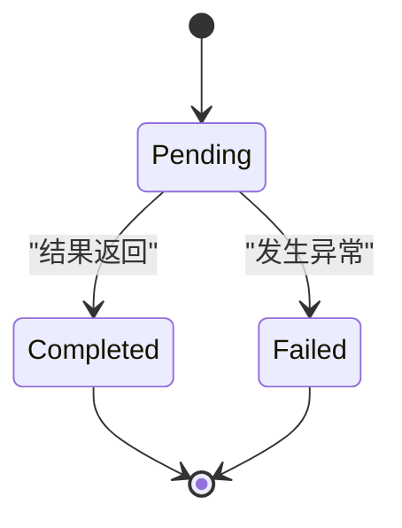
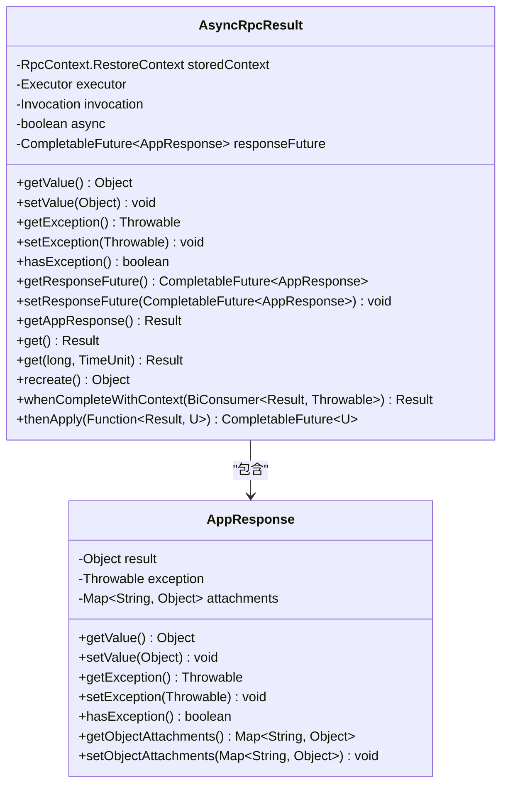
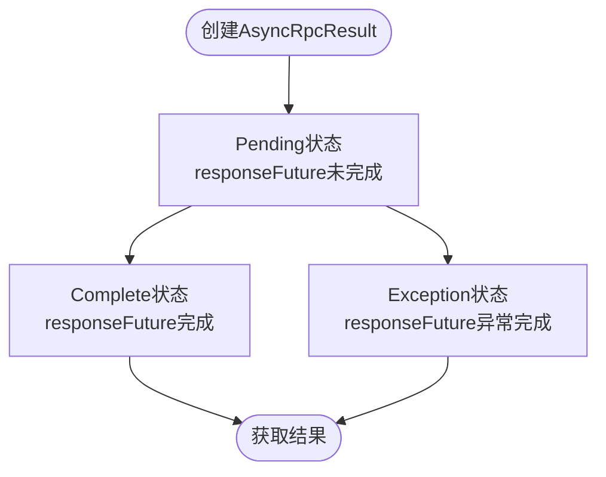
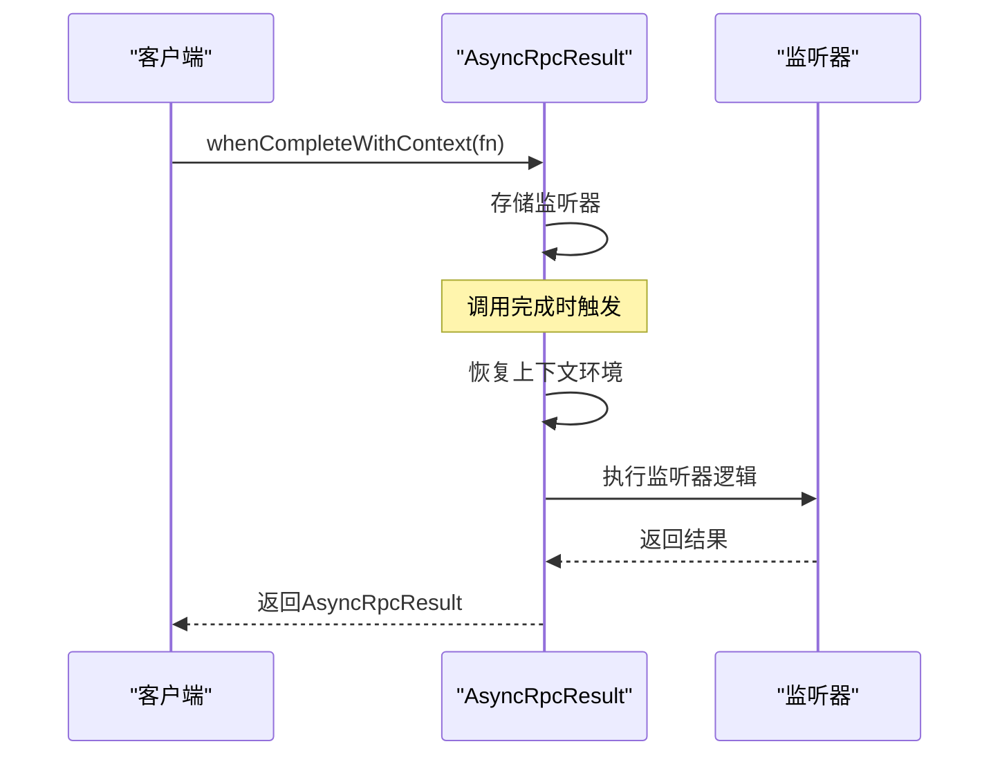
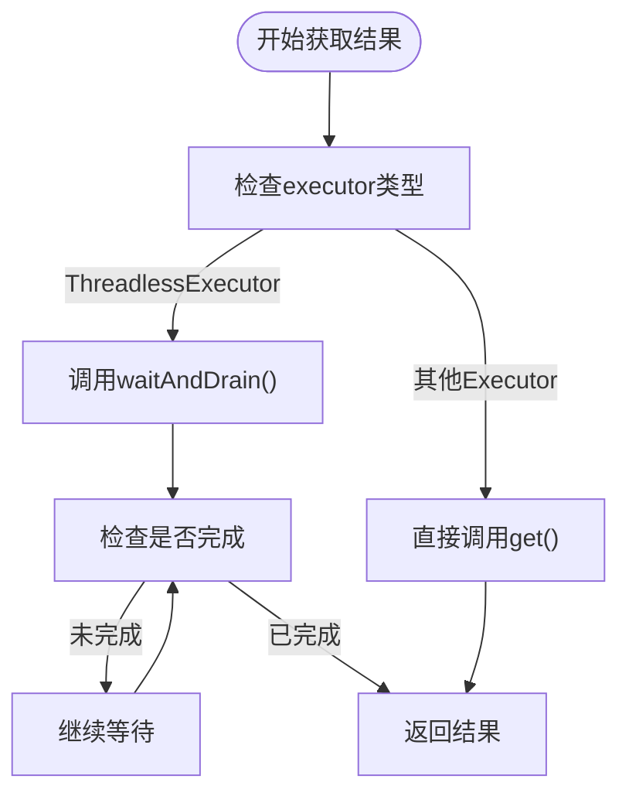
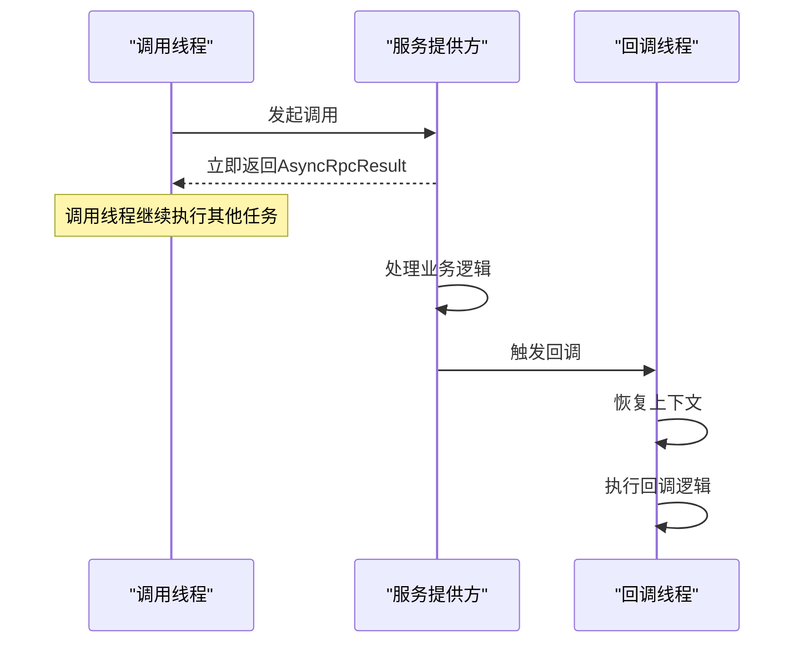
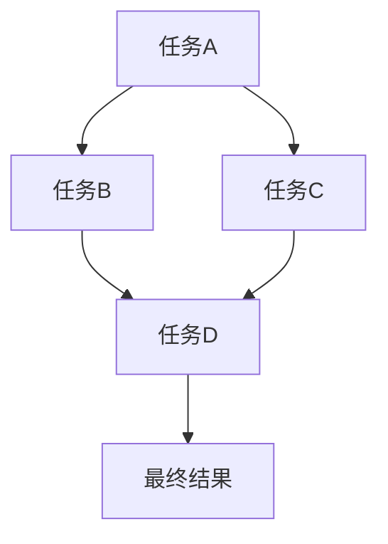
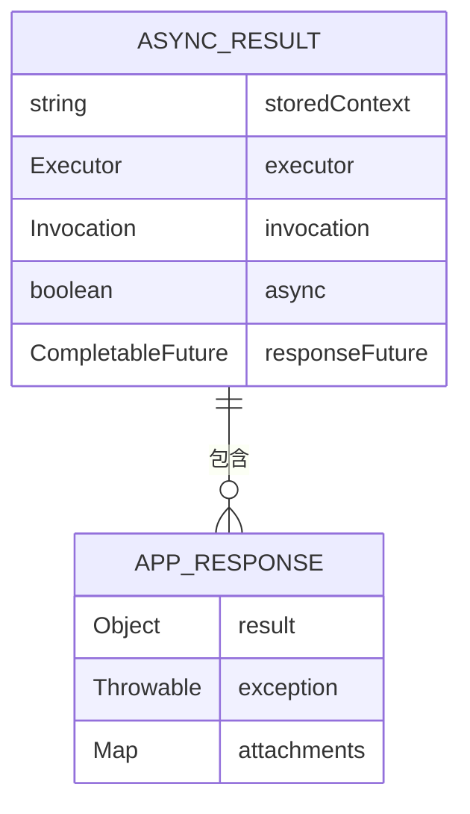

# Future模式应用

<cite>
**本文档引用文件**   
- [AsyncRpcResult.java](file://dubbo-rpc\dubbo-rpc-api\src\main\java\org\apache\dubbo\rpc\AsyncRpcResult.java)
- [AppResponse.java](file://dubbo-rpc\dubbo-rpc-api\src\main\java\org\apache\dubbo\rpc\AppResponse.java)
- [FutureAdapter.java](file://dubbo-rpc\dubbo-rpc-api\src\main\java\org\apache\dubbo\rpc\protocol\dubbo\FutureAdapter.java)
- [ThreadlessExecutor.java](file://dubbo-common\src\main\java\org\apache\dubbo\common\threadpool\ThreadlessExecutor.java)
- [DemoService.java](file://dubbo-demo\dubbo-demo-api\dubbo-demo-api-interface\src\main\java\org\apache\dubbo\api\demo\DemoService.java)
- [ConsumerApplication.java](file://dubbo-demo\dubbo-demo-spring-boot\dubbo-demo-spring-boot-consumer\src\main\java\org\apache\dubbo\springboot\demo\consumer\ConsumerApplication.java)
- [TripleInvoker.java](file://dubbo-rpc\dubbo-rpc-triple\src\main\java\org\apache\dubbo\rpc\protocol\tri\TripleInvoker.java)
</cite>

## 目录
1. [引言](#引言)
2. [Future模式基础概念](#future模式基础概念)
3. [AsyncRpcResult设计原理](#asyncrpcresult设计原理)
4. [状态转换机制](#状态转换机制)
5. [监听器注册流程](#监听器注册流程)
6. [结果获取方式](#结果获取方式)
7. [调用线程与执行线程解耦](#调用线程与执行线程解耦)
8. [使用场景示例](#使用场景示例)
9. [复杂异步编程技巧](#复杂异步编程技巧)
10. [性能特征与内存分析](#性能特征与内存分析)
11. [最佳实践建议](#最佳实践建议)

## 引言
Future模式在Dubbo协议中扮演着至关重要的角色，它通过AsyncRpcResult类的精心设计，实现了调用线程与执行线程的完全解耦。这种解耦机制极大地提升了系统的吞吐量和资源利用率，使得Dubbo能够在高并发场景下保持卓越的性能表现。本文将深入剖析AsyncRpcResult的核心功能，详细阐述其状态转换机制、监听器注册流程和结果获取方式，为开发者提供全面的技术指导。

## Future模式基础概念
Future模式是一种异步编程范式，它允许调用方在发起远程调用后立即返回，而不需要等待实际结果的返回。调用方获得一个Future对象作为占位符，该对象代表了未来某个时刻才会完成的计算结果。通过Future模式，系统可以避免线程阻塞，充分利用CPU资源，从而显著提升整体性能。

在Dubbo中，Future模式的应用主要体现在AsyncRpcResult类的设计上。该类实现了Result接口，并通过CompletableFuture<AppResponse>来管理异步调用的状态。当消费者发起调用时，会立即返回一个AsyncRpcResult实例，该实例包含了对实际结果的引用。调用线程可以继续执行其他任务，而无需等待远程服务的响应。



**图示来源**
- [AsyncRpcResult.java](file://dubbo-rpc\dubbo-rpc-api\src\main\java\org\apache\dubbo\rpc\AsyncRpcResult.java#L53-L379)

## AsyncRpcResult设计原理
AsyncRpcResult类是Dubbo中Future模式的核心实现，其设计充分考虑了异步调用的各种场景和需求。该类的主要设计特点包括：

1. **上下文管理**：通过storedContext字段保存调用时的RpcContext，确保在回调执行时能够恢复正确的上下文环境。
2. **执行器支持**：executor字段允许指定特定的执行器来处理回调任务，提供了灵活的线程管理能力。
3. **异步标识**：async字段标记了调用是否为异步模式，用于在回调时决定是否需要恢复上下文。
4. **未来结果管理**：responseFuture字段使用CompletableFuture<AppResponse>来管理异步调用的结果，提供了丰富的异步操作支持。



**图示来源**
- [AsyncRpcResult.java](file://dubbo-rpc\dubbo-rpc-api\src\main\java\org\apache\dubbo\rpc\AsyncRpcResult.java#L53-L379)
- [AppResponse.java](file://dubbo-rpc\dubbo-rpc-api\src\main\java\org\apache\dubbo\rpc\AppResponse.java#L54-L272)

## 状态转换机制
AsyncRpcResult的状态转换机制是其核心功能之一，它通过CompletableFuture来管理异步调用的生命周期。状态转换主要发生在以下几个关键点：

1. **初始化状态**：当AsyncRpcResult被创建时，responseFuture处于未完成状态，表示调用正在进行中。
2. **完成状态**：当远程服务返回结果或发生异常时，responseFuture会被标记为完成，此时可以通过get()方法获取结果。
3. **异常状态**：如果在调用过程中发生异常，responseFuture会被标记为异常完成，get()方法会抛出相应的异常。

状态转换的具体实现通过CompletableFuture的complete()和completeExceptionally()方法完成。当结果返回时，系统会创建一个AppResponse实例并将其设置到responseFuture中。如果调用已经完成，则直接更新AppResponse的内容。



**图示来源**
- [AsyncRpcResult.java](file://dubbo-rpc\dubbo-rpc-api\src\main\java\org\apache\dubbo\rpc\AsyncRpcResult.java#L134-L153)
- [AsyncRpcResult.java](file://dubbo-rpc\dubbo-rpc-api\src\main\java\org\apache\dubbo\rpc\AsyncRpcResult.java#L108-L127)

## 监听器注册流程
AsyncRpcResult提供了丰富的监听器注册机制，允许开发者在异步调用完成时执行自定义逻辑。主要的监听器方法包括：

1. **whenCompleteWithContext**：注册一个BiConsumer监听器，该监听器会在调用完成时被调用，无论成功还是失败。此方法会自动恢复调用时的上下文环境。
2. **thenApply**：注册一个Function监听器，该监听器会在调用成功完成时被调用，可以对结果进行转换处理。

监听器的注册流程通过CompletableFuture的whenComplete()和thenApply()方法实现。当调用完成时，系统会依次执行所有注册的监听器。对于whenCompleteWithContext方法，系统会先恢复存储的上下文环境，然后再执行监听器逻辑。



**图示来源**
- [AsyncRpcResult.java](file://dubbo-rpc\dubbo-rpc-api\src\main\java\org\apache\dubbo\rpc\AsyncRpcResult.java#L248-L262)
- [AsyncRpcResult.java](file://dubbo-rpc\dubbo-rpc-api\src\main\java\org\apache\dubbo\rpc\AsyncRpcResult.java#L264-L267)

## 结果获取方式
AsyncRpcResult提供了多种结果获取方式，以满足不同场景的需求：

1. **同步获取**：通过get()方法阻塞等待结果返回，适用于需要立即获取结果的场景。
2. **超时获取**：通过get(long timeout, TimeUnit unit)方法在指定时间内等待结果，超时则抛出TimeoutException。
3. **非阻塞检查**：通过isDone()方法检查调用是否已完成，适用于轮询检查的场景。

对于同步获取方式，AsyncRpcResult特别处理了ThreadlessExecutor的情况。当executor为ThreadlessExecutor时，系统会调用waitAndDrain()方法在当前线程中处理回调任务，直到结果返回或超时。



**图示来源**
- [AsyncRpcResult.java](file://dubbo-rpc\dubbo-rpc-api\src\main\java\org\apache\dubbo\rpc\AsyncRpcResult.java#L195-L208)
- [AsyncRpcResult.java](file://dubbo-rpc\dubbo-rpc-api\src\main\java\org\apache\dubbo\rpc\AsyncRpcResult.java#L210-L234)

## 调用线程与执行线程解耦
Future模式的核心优势在于实现了调用线程与执行线程的完全解耦。在Dubbo中，这一解耦机制通过以下方式实现：

1. **异步调用标识**：通过InvokeMode枚举（SYNC、ASYNC、FUTURE）明确区分不同的调用模式。
2. **上下文快照**：在异步调用时，通过RpcContext.clearAndStoreContext()保存当前上下文快照，在回调时通过RpcContext.restoreContext()恢复上下文。
3. **无阻塞返回**：调用线程在发起调用后立即返回AsyncRpcResult实例，无需等待远程服务的响应。

这种解耦机制使得调用线程可以立即释放，用于处理其他任务，从而大大提高了线程的利用率。同时，执行线程可以在后台独立处理远程调用，不受调用线程的影响。



**图示来源**
- [AsyncRpcResult.java](file://dubbo-rpc\dubbo-rpc-api\src\main\java\org\apache\dubbo\rpc\AsyncRpcResult.java#L75-L86)
- [InvokeMode.java](file://dubbo-rpc\dubbo-rpc-api\src\main\java\org\apache\dubbo\rpc\InvokeMode.java#L19-L23)

## 使用场景示例
### 简单异步调用
简单异步调用是最常见的使用场景，通过返回CompletableFuture来实现异步处理：

```java
public interface DemoService {
    default CompletableFuture<String> sayHelloAsync(String name) {
        return CompletableFuture.completedFuture(sayHello(name));
    }
}
```

**代码来源**
- [DemoService.java](file://dubbo-demo\dubbo-demo-api\dubbo-demo-api-interface\src\main\java\org\apache\dubbo\api\demo\DemoService.java#L37-L39)

### 批量异步调用
批量异步调用适用于需要并行处理多个请求的场景：

```java
public CompletableFuture<List<String>> batchSayHelloAsync(List<String> names) {
    List<CompletableFuture<String>> futures = names.stream()
        .map(this::sayHelloAsync)
        .collect(Collectors.toList());
    
    return CompletableFuture.allOf(futures.toArray(new CompletableFuture[0]))
        .thenApply(v -> futures.stream()
            .map(CompletableFuture::join)
            .collect(Collectors.toList()));
}
```

### 异步链式调用
异步链式调用通过thenApply等方法实现多个异步操作的串联：

```java
public CompletableFuture<String> chainedCall(String name) {
    return sayHelloAsync(name)
        .thenApply(result -> result + " - processed")
        .thenApply(processed -> "Final: " + processed);
}
```

**代码来源**
- [ConsumerApplication.java](file://dubbo-demo\dubbo-demo-spring-boot\dubbo-demo-spring-boot-consumer\src\main\java\org\apache\dubbo\springboot\demo\consumer\ConsumerApplication.java#L49-L56)

## 复杂异步编程技巧
### 异步任务编排
通过CompletableFuture的组合操作，可以实现复杂的异步任务编排：



### 超时控制
AsyncRpcResult内置了超时控制机制，可以通过get()方法的超时参数实现：

```java
try {
    Result result = asyncRpcResult.get(5, TimeUnit.SECONDS);
} catch (TimeoutException e) {
    // 处理超时情况
}
```

### 异常处理
异常处理需要区分业务异常和系统异常，通过hasException()和getException()方法进行判断：

```java
if (asyncRpcResult.hasException()) {
    Throwable exception = asyncRpcResult.getException();
    // 处理异常情况
} else {
    Object result = asyncRpcResult.getValue();
    // 处理正常结果
}
```

## 性能特征与内存分析
### 性能特征
Future模式在Dubbo中的性能特征主要体现在：

1. **高吞吐量**：由于调用线程无需阻塞等待，系统可以处理更多的并发请求。
2. **低延迟**：异步调用减少了线程上下文切换的开销，降低了整体延迟。
3. **资源利用率高**：线程资源得到充分利用，避免了线程池的过度扩张。

### 内存占用分析
AsyncRpcResult的内存占用主要包括：

1. **对象开销**：AsyncRpcResult实例本身的内存占用。
2. **上下文快照**：storedContext保存的RpcContext快照。
3. **回调队列**：ThreadlessExecutor中的任务队列。

通过合理配置和使用，可以有效控制内存占用，避免内存泄漏。



**图示来源**
- [AsyncRpcResult.java](file://dubbo-rpc\dubbo-rpc-api\src\main\java\org\apache\dubbo\rpc\AsyncRpcResult.java#L53-L379)
- [AppResponse.java](file://dubbo-rpc\dubbo-rpc-api\src\main\java\org\apache\dubbo\rpc\AppResponse.java#L54-L272)

## 最佳实践建议
1. **合理使用异步模式**：根据业务需求选择合适的调用模式，避免过度使用异步导致代码复杂度增加。
2. **及时处理结果**：尽快处理异步调用的结果，避免长时间持有AsyncRpcResult实例。
3. **正确处理异常**：完善异常处理机制，确保系统稳定性。
4. **监控和调优**：通过监控工具观察异步调用的性能表现，及时进行调优。
5. **避免内存泄漏**：注意监听器的生命周期管理，防止内存泄漏。