# 回调服务机制

<cite>
**本文档引用文件**   
- [CallbackServiceCodec.java](file://dubbo-rpc\dubbo-rpc-dubbo\src\main\java\org\apache\dubbo\rpc\protocol\dubbo\CallbackServiceCodec.java)
- [FutureFilter.java](file://dubbo-rpc\dubbo-rpc-api\src\main\java\org\apache\dubbo\rpc\protocol\dubbo\filter\FutureFilter.java)
- [MethodConfig.java](file://dubbo-common\src\main\java\org\apache\dubbo\config\MethodConfig.java)
- [AsyncMethodInfo.java](file://dubbo-common\src\main\java\org\apache\dubbo\rpc\model\AsyncMethodInfo.java)
- [ArgumentConfig.java](file://dubbo-common\src\main\java\org\apache\dubbo\config\ArgumentConfig.java)
- [CommonConstants.java](file://dubbo-common\src\main\java\org\apache\dubbo\common\constants\CommonConstants.java)
- [ArgumentCallbackTest.java](file://dubbo-rpc\dubbo-rpc-dubbo\src\test\java\org\apache\dubbo\rpc\protocol\dubbo\ArgumentCallbackTest.java)
</cite>

## 目录
1. [引言](#引言)
2. [回调服务核心机制](#回调服务核心机制)
3. [onreturn和onthrow参数实现原理](#onreturn和onthrow参数实现原理)
4. [回调服务注册流程](#回调服务注册流程)
5. [生命周期管理与线程安全](#生命周期管理与线程安全)
6. [回调接口定义与注册示例](#回调接口定义与注册示例)
7. [回调模式应用场景](#回调模式应用场景)
8. [性能瓶颈与连接复用策略](#性能瓶颈与连接复用策略)
9. [错误恢复与超时处理](#错误恢复与超时处理)
10. [监控方案](#监控方案)
11. [安全控制措施](#安全控制措施)

## 引言
Dubbo框架中的回调服务机制是一种重要的异步通信模式，它允许客户端暴露可被服务端反向调用的接口。这种机制在需要服务端主动通知客户端的场景中非常有用，如实时消息推送、状态变更通知等。本文将深入解析Dubbo协议中的回调服务机制，重点阐述其核心实现原理、配置方式和最佳实践。

## 回调服务核心机制

Dubbo的回调服务机制通过`CallbackServiceCodec`类实现，该类负责在客户端和服务端之间建立双向通信通道。当客户端调用服务端方法并传递一个回调接口作为参数时，Dubbo会在底层自动创建一个反向调用通道。

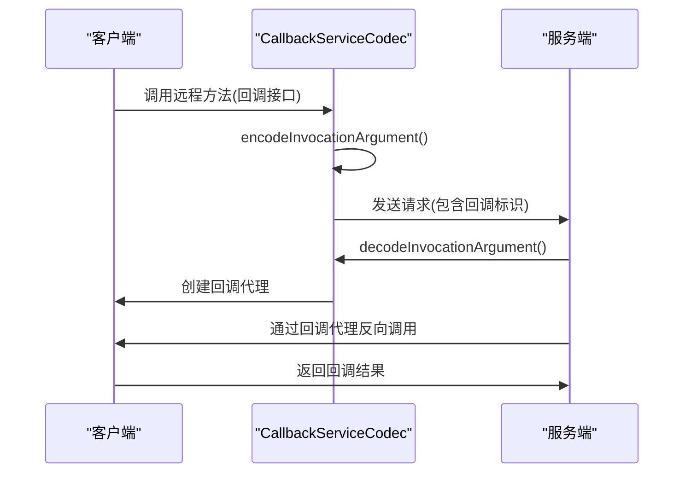

**图示来源**
- [CallbackServiceCodec.java](file://dubbo-rpc\dubbo-rpc-dubbo\src\main\java\org\apache\dubbo\rpc\protocol\dubbo\CallbackServiceCodec.java#L357-L425)

**本节来源**
- [CallbackServiceCodec.java](file://dubbo-rpc\dubbo-rpc-dubbo\src\main\java\org\apache\dubbo\rpc\protocol\dubbo\CallbackServiceCodec.java#L74-L425)

## onreturn和onthrow参数实现原理

`onreturn`和`onthrow`参数是Dubbo异步调用中的重要特性，它们允许开发者指定在正常返回和异常情况下执行的回调方法。

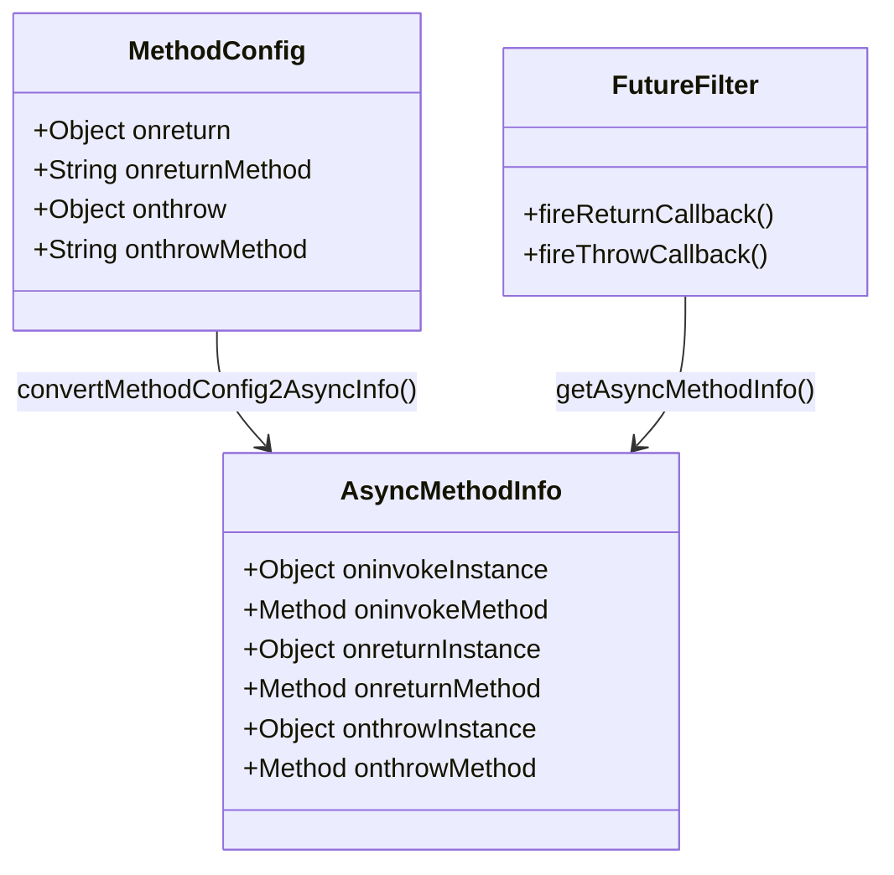

**图示来源**
- [AsyncMethodInfo.java](file://dubbo-common\src\main\java\org\apache\dubbo\rpc\model\AsyncMethodInfo.java#L40-L87)
- [MethodConfig.java](file://dubbo-common\src\main\java\org\apache\dubbo\config\MethodConfig.java#L103-L119)

`FutureFilter`是处理`onreturn`和`onthrow`回调的核心过滤器，它在调用完成后根据结果类型触发相应的回调方法：

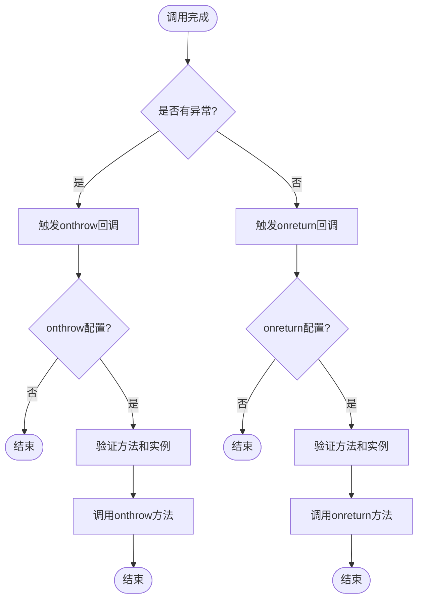

**图示来源**
- [FutureFilter.java](file://dubbo-rpc\dubbo-rpc-api\src\main\java\org\apache\dubbo\rpc\protocol\dubbo\filter\FutureFilter.java#L56-L68)

**本节来源**
- [FutureFilter.java](file://dubbo-rpc\dubbo-rpc-api\src\main\java\org\apache\dubbo\rpc\protocol\dubbo\filter\FutureFilter.java#L41-L225)
- [MethodConfig.java](file://dubbo-common\src\main\java\org\apache\dubbo\config\MethodConfig.java#L272-L299)

## 回调服务注册流程

回调服务的注册流程涉及客户端和服务端的协同工作，确保回调接口能够被正确暴露和引用。

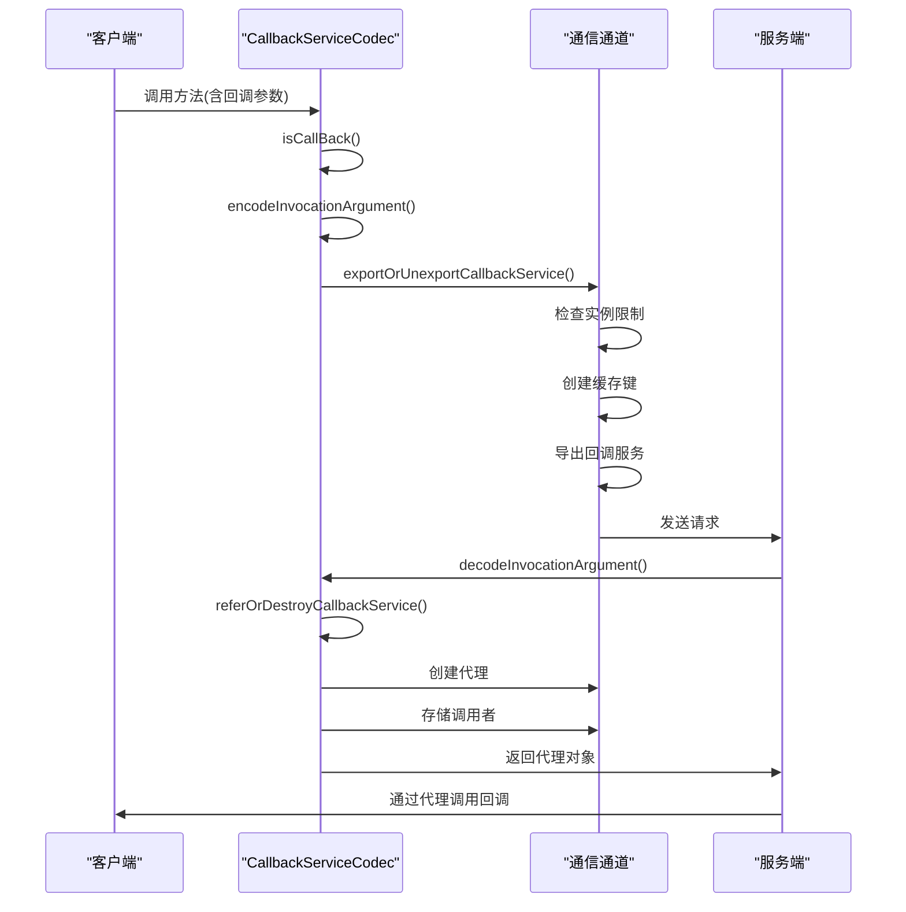

**图示来源**
- [CallbackServiceCodec.java](file://dubbo-rpc\dubbo-rpc-dubbo\src\main\java\org\apache\dubbo\rpc\protocol\dubbo\CallbackServiceCodec.java#L123-L214)

回调服务的注册主要通过以下步骤完成：
1. 客户端在调用远程方法时传递回调接口作为参数
2. `CallbackServiceCodec`检测到参数标记为回调（通过`.callback=true`配置）
3. 在客户端侧导出回调服务，创建一个本地服务供服务端反向调用
4. 服务端在接收到请求后，创建一个代理对象来引用客户端的回调服务
5. 服务端通过代理对象调用客户端的回调方法

**本节来源**
- [CallbackServiceCodec.java](file://dubbo-rpc\dubbo-rpc-dubbo\src\main\java\org\apache\dubbo\rpc\protocol\dubbo\CallbackServiceCodec.java#L96-L310)

## 生命周期管理与线程安全

回调服务的生命周期管理是确保系统稳定性的关键，Dubbo通过多种机制来管理回调服务的创建、使用和销毁。

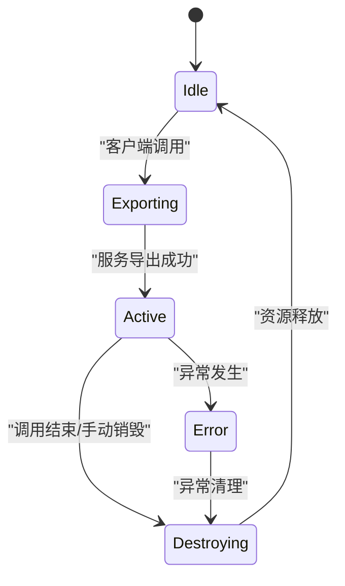

**图示来源**
- [CallbackServiceCodec.java](file://dubbo-rpc\dubbo-rpc-dubbo\src\main\java\org\apache\dubbo\rpc\protocol\dubbo\CallbackServiceCodec.java#L205-L212)

线程安全控制策略主要包括：
- 使用`ConcurrentHashSet`存储回调调用者，确保多线程环境下的安全性
- 通过`System.identityHashCode`生成实例ID，避免实例冲突
- 在通道属性中存储回调服务，利用通道的线程安全性

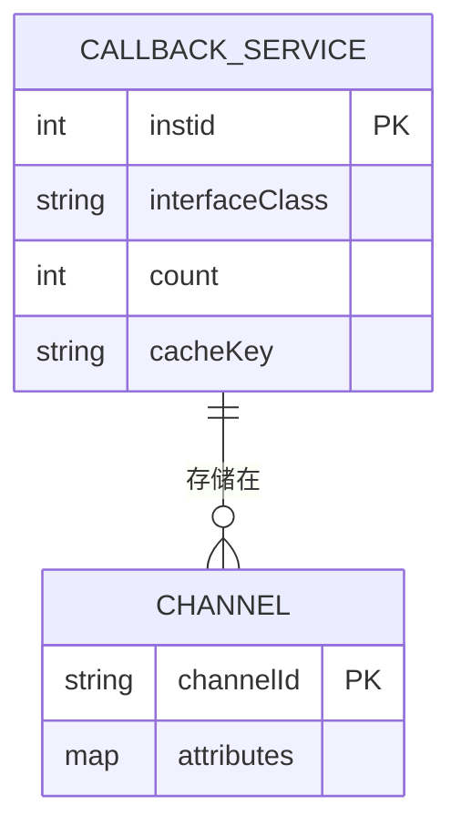

**图示来源**
- [CallbackServiceCodec.java](file://dubbo-rpc\dubbo-rpc-dubbo\src\main\java\org\apache\dubbo\rpc\protocol\dubbo\CallbackServiceCodec.java#L291-L310)

**本节来源**
- [CallbackServiceCodec.java](file://dubbo-rpc\dubbo-rpc-dubbo\src\main\java\org\apache\dubbo\rpc\protocol\dubbo\CallbackServiceCodec.java#L312-L355)

## 回调接口定义与注册示例

以下是一个完整的回调接口定义和注册示例：

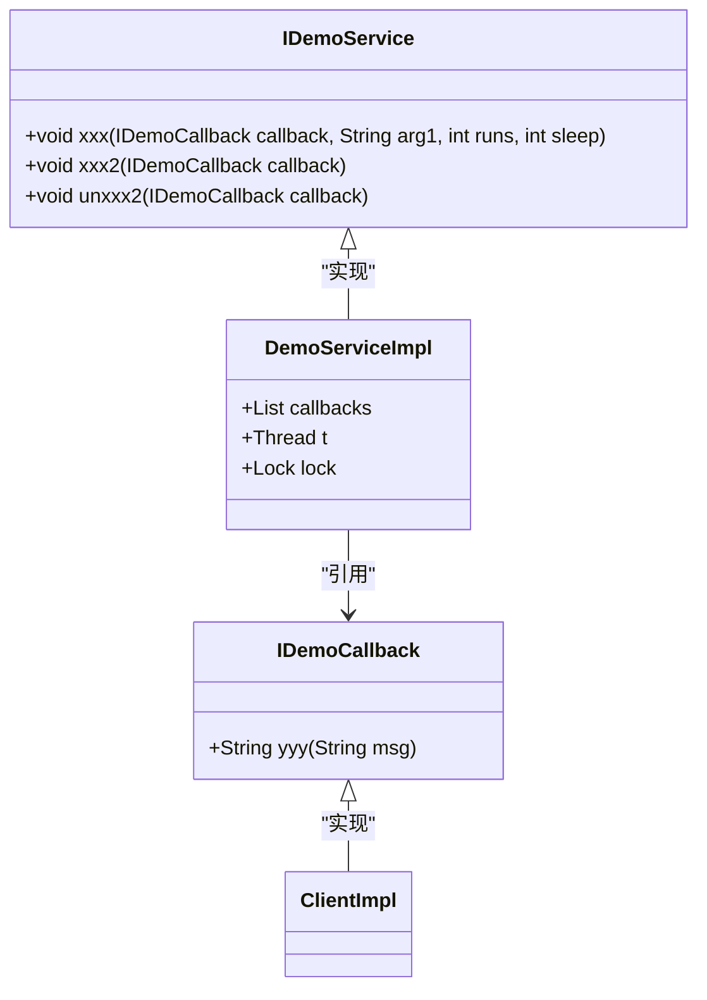

**图示来源**
- [ArgumentCallbackTest.java](file://dubbo-rpc\dubbo-rpc-dubbo\src\test\java\org\apache\dubbo\rpc\protocol\dubbo\ArgumentCallbackTest.java#L317-L381)

配置示例：
```java
// 在URL中配置回调参数
URL serviceURL = URL.valueOf(
    "dubbo://127.0.0.1:" + port + "/" + IDemoService.class.getName() + 
    "?group=test" +
    "&xxx.0.callback=true" +  // 第一个参数是回调接口
    "&xxx2.0.callback=true" + // 第一个参数是回调接口
    "&unxxx2.0.callback=false" + // 销毁回调
    "&callbacks=2" + // 回调实例限制
    "&timeout=3000"
);
```

**本节来源**
- [ArgumentCallbackTest.java](file://dubbo-rpc\dubbo-rpc-dubbo\src\test\java\org\apache\dubbo\rpc\protocol\dubbo\ArgumentCallbackTest.java#L87-L97)

## 回调模式应用场景

回调模式在分布式系统中有多种典型应用场景：

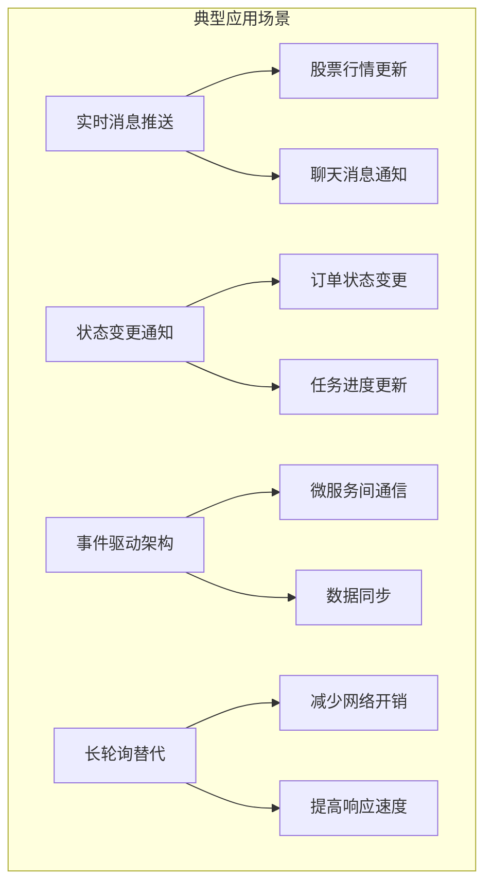

**图示来源**
- [ArgumentCallbackTest.java](file://dubbo-rpc\dubbo-rpc-dubbo\src\test\java\org\apache\dubbo\rpc\protocol\dubbo\ArgumentCallbackTest.java#L352-L368)

**本节来源**
- [ArgumentCallbackTest.java](file://dubbo-rpc\dubbo-rpc-dubbo\src\test\java\org\apache\dubbo\rpc\protocol\dubbo\ArgumentCallbackTest.java#L159-L169)

## 性能瓶颈与连接复用策略

回调服务可能面临的性能瓶颈及相应的优化策略：

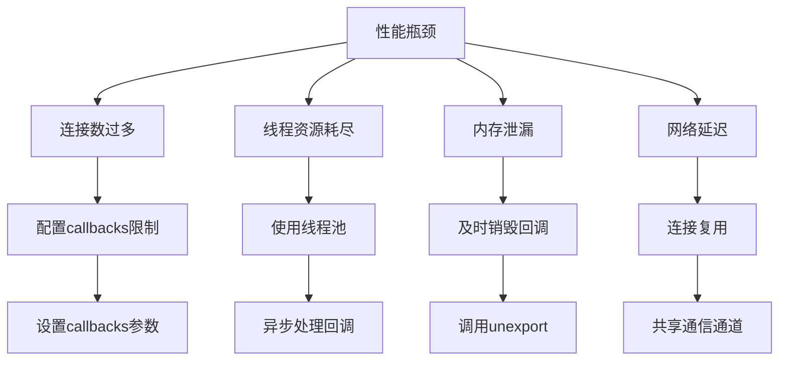

**图示来源**
- [CommonConstants.java](file://dubbo-common\src\main\java\org\apache\dubbo\common\constants\CommonConstants.java#L397-L407)

连接复用策略通过以下方式实现：
- 多个回调服务共享同一个通信通道
- 使用通道属性存储回调服务实例
- 通过实例ID区分不同的回调服务

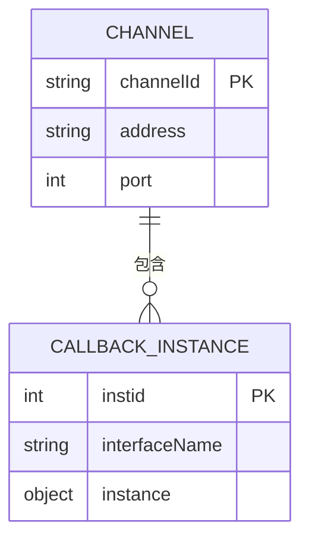

**图示来源**
- [CallbackServiceCodec.java](file://dubbo-rpc\dubbo-rpc-dubbo\src\main\java\org\apache\dubbo\rpc\protocol\dubbo\CallbackServiceCodec.java#L159-L160)

**本节来源**
- [CommonConstants.java](file://dubbo-common\src\main\java\org\apache\dubbo\common\constants\CommonConstants.java#L397-L407)
- [CallbackServiceCodec.java](file://dubbo-rpc\dubbo-rpc-dubbo\src\main\java\org\apache\dubbo\rpc\protocol\dubbo\CallbackServiceCodec.java#L291-L310)

## 错误恢复与超时处理

回调服务的错误恢复和超时处理机制确保系统的可靠性：

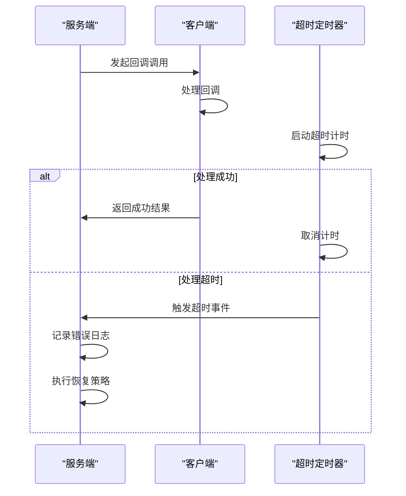

**图示来源**
- [FutureFilter.java](file://dubbo-rpc\dubbo-rpc-api\src\main\java\org\apache\dubbo\rpc\protocol\dubbo\filter\FutureFilter.java#L148-L199)

错误恢复策略包括：
- 异常捕获和日志记录
- 重试机制
- 降级处理
- 熔断保护

超时处理通过以下参数配置：
- `timeout`：设置调用超时时间
- `retries`：设置重试次数
- `callbacks`：限制回调实例数量

**本节来源**
- [FutureFilter.java](file://dubbo-rpc\dubbo-rpc-api\src\main\java\org\apache\dubbo\rpc\protocol\dubbo\filter\FutureFilter.java#L148-L207)
- [ArgumentCallbackTest.java](file://dubbo-rpc\dubbo-rpc-dubbo\src\test\java\org\apache\dubbo\rpc\protocol\dubbo\ArgumentCallbackTest.java#L94-L96)

## 监控方案

回调服务的监控方案包括多个层面的指标收集和告警：

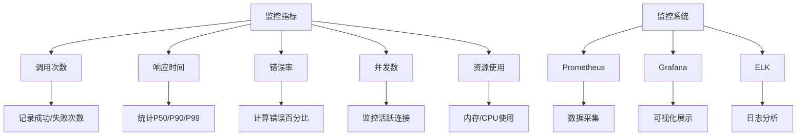

**图示来源**
- [FutureFilter.java](file://dubbo-rpc\dubbo-rpc-api\src\main\java\org\apache\dubbo\rpc\protocol\dubbo\filter\FutureFilter.java#L190-L197)

监控实现方式：
- 在`FutureFilter`中添加监控埋点
- 记录回调调用的成功和失败次数
- 统计响应时间分布
- 监控回调实例的生命周期

**本节来源**
- [FutureFilter.java](file://dubbo-rpc\dubbo-rpc-api\src\main\java\org\apache\dubbo\rpc\protocol\dubbo\filter\FutureFilter.java#L190-L197)

## 安全控制措施

回调服务的安全控制措施确保系统的安全性：

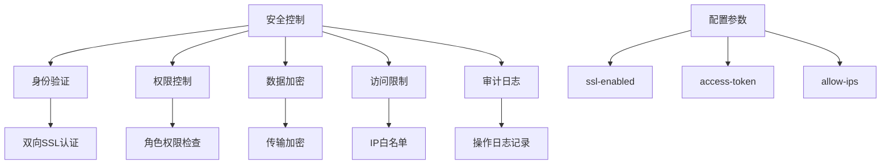

**图示来源**
- [CommonConstants.java](file://dubbo-common\src\main\java\org\apache\dubbo\common\constants\CommonConstants.java#L423-L424)

安全控制策略：
- 限制回调实例数量防止资源耗尽
- 验证回调接口的合法性
- 记录回调调用的审计日志
- 支持SSL加密通信

**本节来源**
- [CommonConstants.java](file://dubbo-common\src\main\java\org\apache\dubbo\common\constants\CommonConstants.java#L397-L407)
- [ArgumentConfig.java](file://dubbo-common\src\main\java\org\apache\dubbo\config\ArgumentConfig.java#L43-L46)