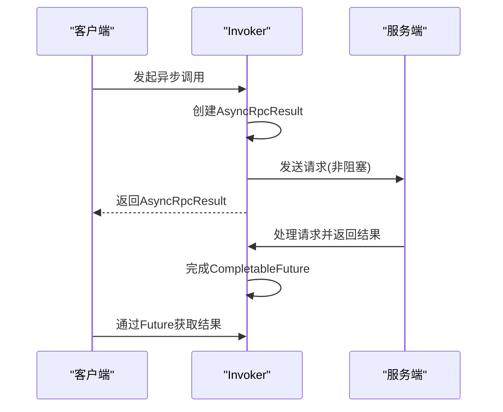
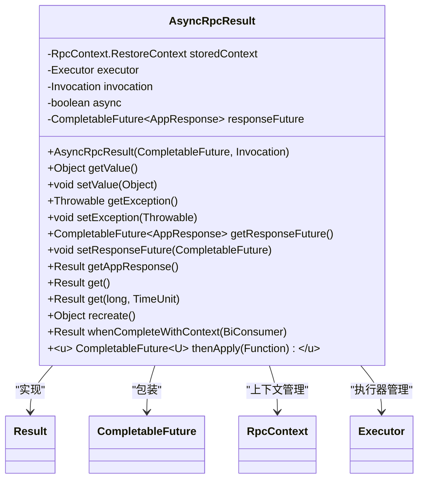
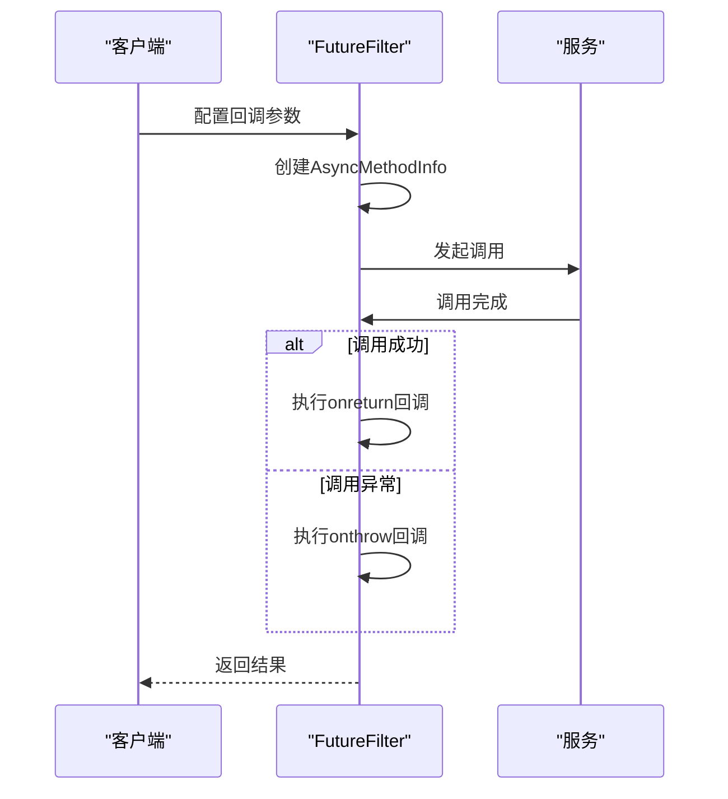
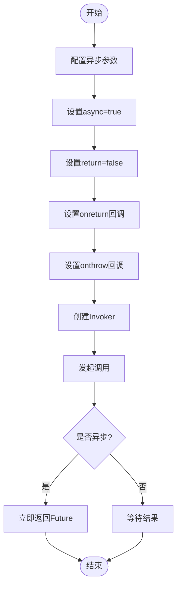
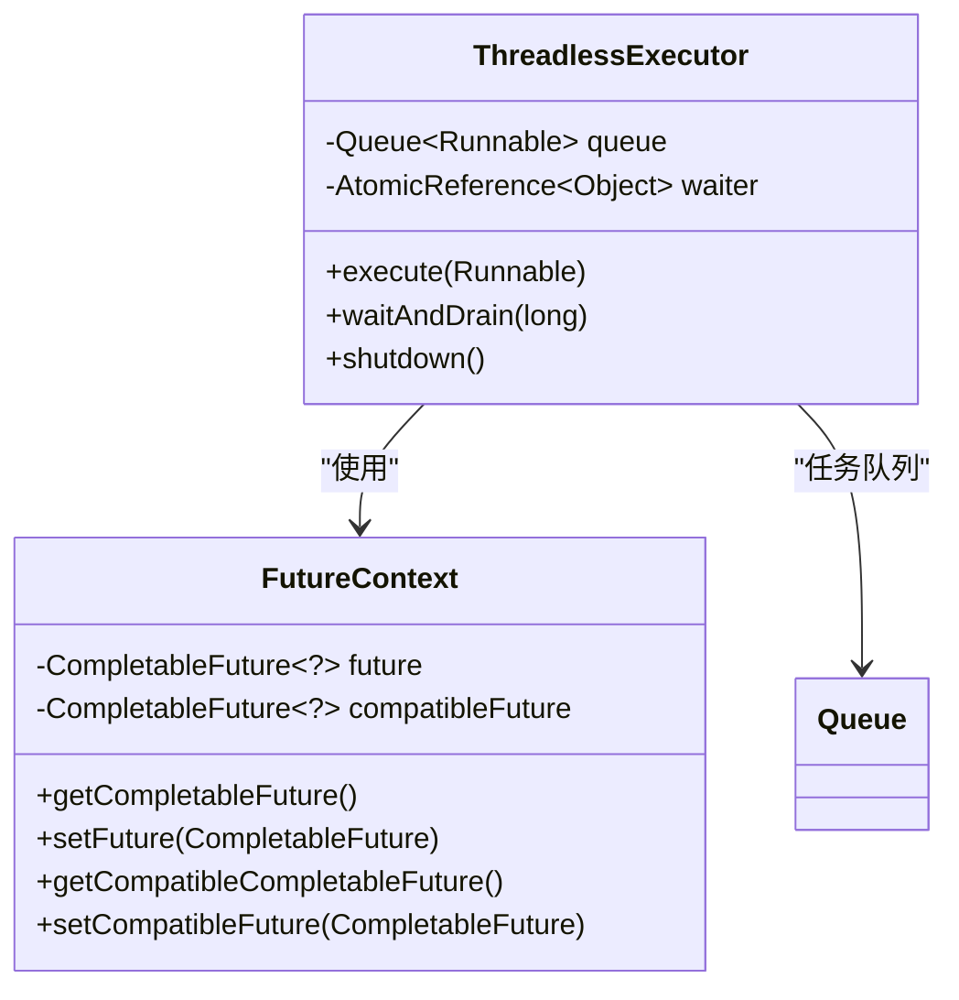
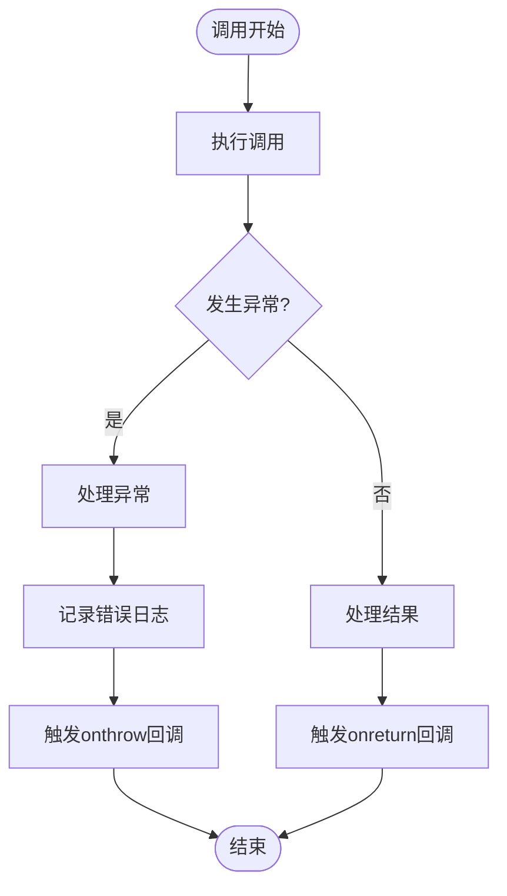

# 异步调用与回调

<cite>
**本文档引用文件**   
- [AsyncRpcResult.java](file://dubbo-rpc\dubbo-rpc-api\src\main\java\org\apache\dubbo\rpc\AsyncRpcResult.java)
- [FutureFilter.java](file://dubbo-rpc\dubbo-rpc-api\src\main\java\org\apache\dubbo\rpc\protocol\dubbo\filter\FutureFilter.java)
- [DubboInvoker.java](file://dubbo-rpc\dubbo-rpc-dubbo\src\main\java\org\apache\dubbo\rpc\protocol\dubbo\DubboInvoker.java)
- [AsyncMethodInfo.java](file://dubbo-common\src\main\java\org\apache\dubbo\rpc\model\AsyncMethodInfo.java)
- [FutureContext.java](file://dubbo-rpc\dubbo-rpc-api\src\main\java\org\apache\dubbo\rpc\FutureContext.java)
- [MethodConfig.java](file://dubbo-config\dubbo-config-api\src\main\java\org\apache\dubbo\config\MethodConfig.java)
- [DubboProtocol.java](file://dubbo-rpc\dubbo-rpc-dubbo\src\main\java\org\apache\dubbo\rpc\protocol\dubbo\DubboProtocol.java)
</cite>

## 目录
1. [引言](#引言)
2. [异步调用实现原理](#异步调用实现原理)
3. [AsyncRpcResult详解](#asyncrpcresult详解)
4. [回调功能机制](#回调功能机制)
5. [异步调用配置方法](#异步调用配置方法)
6. [线程模型与资源管理](#线程模型与资源管理)
7. [性能监控与错误处理](#性能监控与错误处理)
8. [高级话题](#高级话题)
9. [总结](#总结)

## 引言

Dubbo协议提供了强大的异步调用和回调功能，这些特性对于构建高性能、可扩展的分布式系统至关重要。异步调用允许客户端在发起远程调用后立即返回，无需等待服务端处理完成，从而提高了系统的吞吐量和响应速度。回调功能则允许服务端在特定事件发生时反向调用客户端，实现了双向通信。

本文档将深入探讨Dubbo协议中异步调用和回调功能的实现细节，重点关注其非阻塞I/O模型的实现。我们将详细解释如何通过Future模式实现异步调用，包括AsyncRpcResult的创建、监听和结果获取过程。同时，我们还将分析回调服务的注册与调用机制，说明如何在客户端暴露回调接口并由服务端进行反向调用。

**Section sources**
- [AsyncRpcResult.java](file://dubbo-rpc\dubbo-rpc-api\src\main\java\org\apache\dubbo\rpc\AsyncRpcResult.java#L40-L53)
- [FutureFilter.java](file://dubbo-rpc\dubbo-rpc-api\src\main\java\org\apache\dubbo\rpc\protocol\dubbo\filter\FutureFilter.java#L38-L42)

## 异步调用实现原理

Dubbo的异步调用基于Java的CompletableFuture实现，采用了非阻塞I/O模型。当客户端发起异步调用时，不会阻塞当前线程等待服务端响应，而是立即返回一个Future对象。客户端可以通过这个Future对象在后续的某个时间点获取调用结果。

异步调用的核心在于InvokeMode枚举，它定义了三种调用模式：SYNC（同步）、ASYNC（异步）和FUTURE。在异步模式下，Dubbo会创建一个AsyncRpcResult对象，该对象包装了一个CompletableFuture，用于异步获取调用结果。

**Diagram sources **
- [AsyncRpcResult.java](file://dubbo-rpc\dubbo-rpc-api\src\main\java\org\apache\dubbo\rpc\AsyncRpcResult.java#L76-L87)
- [DubboInvoker.java](file://dubbo-rpc\dubbo-rpc-dubbo\src\main\java\org\apache\dubbo\rpc\protocol\dubbo\DubboInvoker.java#L136-L144)

**Section sources**
- [AsyncRpcResult.java](file://dubbo-rpc\dubbo-rpc-api\src\main\java\org\apache\dubbo\rpc\AsyncRpcResult.java#L76-L87)
- [DubboInvoker.java](file://dubbo-rpc\dubbo-rpc-dubbo\src\main\java\org\apache\dubbo\rpc\protocol\dubbo\DubboInvoker.java#L136-L144)

## AsyncRpcResult详解

AsyncRpcResult是Dubbo异步调用的核心类，它实现了Result接口并包装了一个CompletableFuture<AppResponse>。这个类不仅代表了一个未完成的RPC调用，还持有调用上下文信息，确保在回调执行时能够恢复到调用时的上下文状态。

AsyncRpcResult的主要特性包括：

1. **上下文管理**：通过storedContext字段保存调用时的RpcContext，确保回调执行时上下文的一致性。
2. **Future包装**：通过responseFuture字段持有CompletableFuture，实现异步结果获取。
3. **执行器管理**：通过executor字段管理回调执行的线程池。

**Diagram sources **
- [AsyncRpcResult.java](file://dubbo-rpc\dubbo-rpc-api\src\main\java\org\apache\dubbo\rpc\AsyncRpcResult.java#L54-L380)

**Section sources**
- [AsyncRpcResult.java](file://dubbo-rpc\dubbo-rpc-api\src\main\java\org\apache\dubbo\rpc\AsyncRpcResult.java#L54-L380)

## 回调功能机制

Dubbo的回调功能通过FutureFilter实现，该过滤器在调用链中负责处理回调逻辑。回调机制允许在调用的不同阶段执行自定义的回调方法，包括调用前(oninvoke)、调用成功(onreturn)和调用异常(onthrow)。

回调功能的实现依赖于AsyncMethodInfo类，该类封装了回调方法和实例信息。当配置了回调参数时，Dubbo会在调用过程中创建AsyncMethodInfo对象，并在相应事件发生时通过反射调用对应的回调方法。

**Diagram sources **
- [FutureFilter.java](file://dubbo-rpc\dubbo-rpc-api\src\main\java\org\apache\dubbo\rpc\protocol\dubbo\filter\FutureFilter.java#L48-L68)
- [AsyncMethodInfo.java](file://dubbo-common\src\main\java\org\apache\dubbo\rpc\model\AsyncMethodInfo.java#L21-L87)

**Section sources**
- [FutureFilter.java](file://dubbo-rpc\dubbo-rpc-api\src\main\java\org\apache\dubbo\rpc\protocol\dubbo\filter\FutureFilter.java#L48-L68)
- [AsyncMethodInfo.java](file://dubbo-common\src\main\java\org\apache\dubbo\rpc\model\AsyncMethodInfo.java#L21-L87)

## 异步调用配置方法

Dubbo提供了多种方式来配置异步调用，包括使用async、return、onreturn、onthrow等参数。这些配置可以通过XML、注解或API方式进行设置。

### 配置参数说明

| 参数 | 说明 | 示例 |
|------|------|------|
| async | 是否启用异步调用 | async="true" |
| return | 是否等待返回值 | return="false" |
| onreturn | 调用成功后的回调方法 | onreturn="onReturn" |
| onthrow | 调用异常时的回调方法 | onthrow="onThrow" |

### 配置示例

**Diagram sources **
- [MethodConfig.java](file://dubbo-config\dubbo-config-api\src\main\java\org\apache\dubbo\config\MethodConfig.java)
- [FutureFilter.java](file://dubbo-rpc\dubbo-rpc-api\src\main\java\org\apache\dubbo\rpc\protocol\dubbo\filter\FutureFilter.java#L70-L98)

**Section sources**
- [MethodConfig.java](file://dubbo-config\dubbo-config-api\src\main\java\org\apache\dubbo\config\MethodConfig.java)
- [FutureFilter.java](file://dubbo-rpc\dubbo-rpc-api\src\main\java\org\apache\dubbo\rpc\protocol\dubbo\filter\FutureFilter.java#L70-L98)

## 线程模型与资源管理

Dubbo的异步调用采用了高效的线程模型和资源管理策略。通过ThreadlessExecutor实现无阻塞的线程调度，避免了传统线程池的资源浪费问题。

### 线程模型

**Diagram sources **
- [ThreadlessExecutor.java](file://dubbo-common\src\main\java\org\apache\dubbo\common\threadpool\ThreadlessExecutor.java)
- [FutureContext.java](file://dubbo-rpc\dubbo-rpc-api\src\main\java\org\apache\dubbo\rpc\FutureContext.java)

**Section sources**
- [ThreadlessExecutor.java](file://dubbo-common\src\main\java\org\apache\dubbo\common\threadpool\ThreadlessExecutor.java)
- [FutureContext.java](file://dubbo-rpc\dubbo-rpc-api\src\main\java\org\apache\dubbo\rpc\FutureContext.java)

## 性能监控与错误处理

Dubbo提供了完善的性能监控和错误处理机制，确保异步调用的稳定性和可靠性。

### 错误处理策略

**Diagram sources **
- [FutureFilter.java](file://dubbo-rpc\dubbo-rpc-api\src\main\java\org\apache\dubbo\rpc\protocol\dubbo\filter\FutureFilter.java#L148-L207)

**Section sources**
- [FutureFilter.java](file://dubbo-rpc\dubbo-rpc-api\src\main\java\org\apache\dubbo\rpc\protocol\dubbo\filter\FutureFilter.java#L148-L207)

## 高级话题

### 超时控制

Dubbo的异步调用支持精细的超时控制，可以在调用级别和方法级别设置超时时间。通过CompletableFuture的get方法，可以指定超时时间和时间单位，确保调用不会无限期等待。

### 资源管理

异步调用的资源管理至关重要。Dubbo通过引用计数机制管理共享连接，确保连接资源的高效利用。同时，通过优雅关闭机制，确保在应用关闭时能够正确释放所有资源。

### 性能优化

为了提高异步调用的性能，Dubbo采用了多种优化策略：
1. 连接共享：多个服务可以共享同一个连接，减少连接开销
2. 批量处理：支持批量发送请求，提高网络利用率
3. 缓存优化：对序列化结果进行缓存，减少序列化开销

## 总结

Dubbo的异步调用和回调功能为构建高性能分布式系统提供了强大的支持。通过非阻塞I/O模型和Future模式，实现了高效的异步通信。AsyncRpcResult作为核心类，封装了异步调用的完整生命周期。回调机制通过FutureFilter实现，支持在调用的不同阶段执行自定义逻辑。

对于初学者，建议从基本的异步调用配置开始，逐步理解Future模式的工作原理。对于高级开发者，可以深入研究线程模型、资源管理和性能优化等高级话题，以充分发挥Dubbo异步调用的潜力。

[No sources needed since this section summarizes without analyzing specific files]