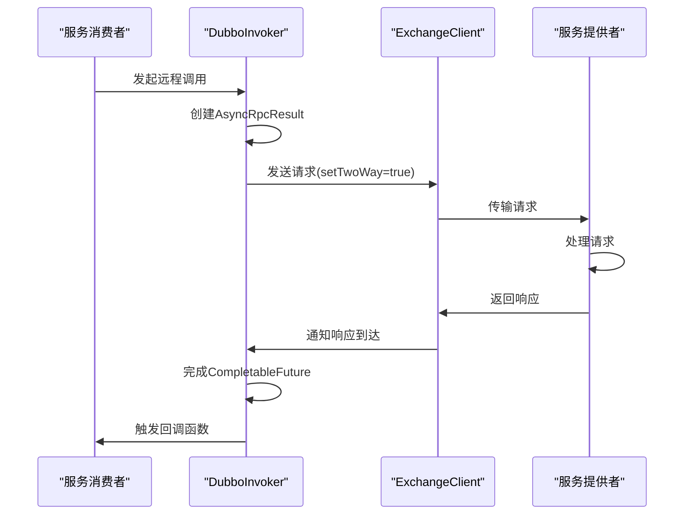
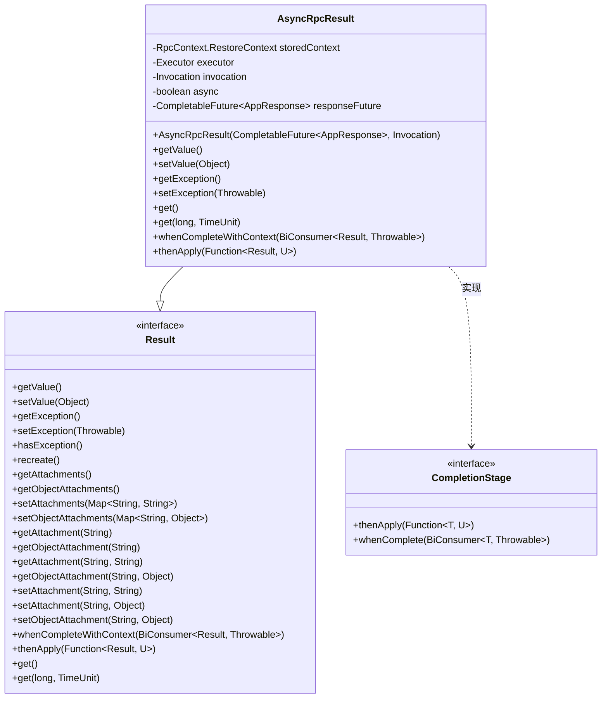
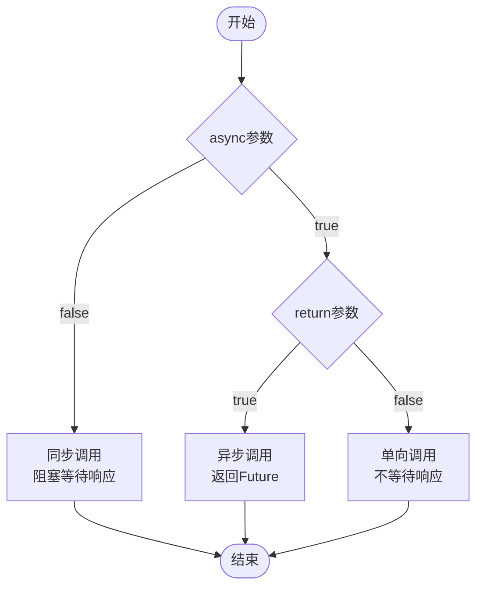
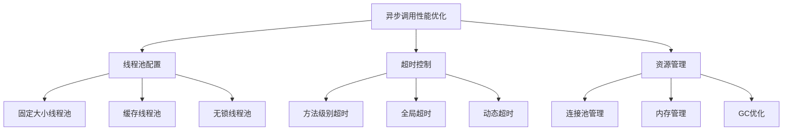
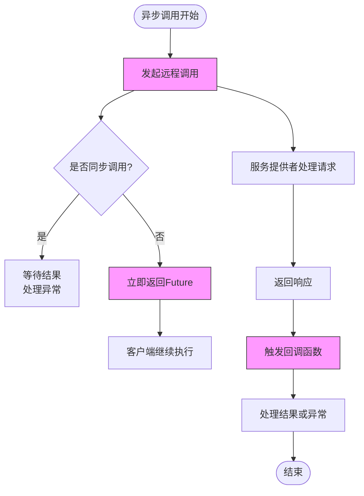

# 异步调用实现

<cite>
**本文档引用的文件**   
- [AsyncRpcResult.java](file://dubbo-rpc\dubbo-rpc-api\src\main\java\org\apache\dubbo\rpc\AsyncRpcResult.java)
- [DubboInvoker.java](file://dubbo-rpc\dubbo-rpc-dubbo\src\main\java\org\apache\dubbo\rpc\protocol\dubbo\DubboInvoker.java)
- [AbstractInvoker.java](file://dubbo-rpc\dubbo-rpc-api\src\main\java\org\apache\dubbo\rpc\protocol\AbstractInvoker.java)
- [RpcContext.java](file://dubbo-rpc\dubbo-rpc-api\src\main\java\org\apache\dubbo\rpc\RpcContext.java)
- [RpcServiceContext.java](file://dubbo-rpc\dubbo-rpc-api\src\main\java\org\apache\dubbo\rpc\RpcServiceContext.java)
- [FutureContext.java](file://dubbo-rpc\dubbo-rpc-api\src\main\java\org\apache\dubbo\rpc\FutureContext.java)
- [MethodConfig.java](file://dubbo-common\src\main\java\org\apache\dubbo\config\AbstractMethodConfig.java)
</cite>

## 目录
1. [异步调用概述](#异步调用概述)
2. [DubboInvoker异步调用机制](#dubboinvoker异步调用机制)
3. [AsyncRpcResult创建与状态管理](#asyncrpcresult创建与状态管理)
4. [异步调用配置参数](#异步调用配置参数)
5. [异步调用代码示例](#异步调用代码示例)
6. [性能优化与线程池配置](#性能优化与线程池配置)
7. [异常处理与资源管理](#异常处理与资源管理)

## 异步调用概述

Dubbo框架提供了强大的异步调用能力，允许服务消费者在发起远程调用后立即返回，无需阻塞等待服务提供者的响应。这种非阻塞I/O模型显著提高了系统的吞吐量和响应性，特别适用于高并发场景。Dubbo的异步调用基于Java的CompletableFuture实现，通过AsyncRpcResult类封装了异步调用的完整生命周期。

异步调用的核心优势在于它能够有效利用线程资源，避免因等待远程响应而导致的线程阻塞。在传统的同步调用模式下，每个请求都需要占用一个线程直到收到响应，这在高并发场景下会导致线程资源迅速耗尽。而异步调用模式下，发起调用的线程可以立即释放，用于处理其他任务，当响应到达时，由专门的回调线程池处理结果。

Dubbo的异步调用支持多种模式，包括简单的异步调用、带回调的异步调用以及单向调用。这些模式通过不同的配置参数和API来实现，为开发者提供了灵活的选择。异步调用不仅提高了系统的性能，还为实现复杂的业务逻辑提供了基础，如并行调用多个服务、超时控制和熔断机制等。

**Section sources**
- [AsyncRpcResult.java](file://dubbo-rpc\dubbo-rpc-api\src\main\java\org\apache\dubbo\rpc\AsyncRpcResult.java#L40-L53)
- [RpcContext.java](file://dubbo-rpc\dubbo-rpc-api\src\main\java\org\apache\dubbo\rpc\RpcContext.java#L33-L50)

## DubboInvoker异步调用机制

DubboInvoker是Dubbo协议中负责执行远程调用的核心组件，它通过非阻塞I/O模型实现了高效的异步远程调用。当服务消费者发起调用时，DubboInvoker会根据调用模式创建相应的异步结果对象。在异步模式下，DubboInvoker不会阻塞当前线程，而是立即返回一个AsyncRpcResult对象，该对象封装了对远程调用结果的引用。

DubboInvoker的异步调用机制基于CompletableFuture实现。当发起异步调用时，DubboInvoker会创建一个CompletableFuture对象，并将其包装在AsyncRpcResult中返回。这个CompletableFuture对象会在后台线程中等待远程服务的响应，一旦收到响应，就会自动完成CompletableFuture，触发注册的回调函数。这种设计使得调用方可以在不阻塞主线程的情况下处理远程调用的结果。

DubboInvoker还支持多种调用模式，包括同步调用、异步调用和单向调用。这些模式通过不同的参数配置来区分。例如，当isOneway为true时，表示这是一个单向调用，客户端发送请求后不会等待响应；当isOneway为false时，则表示这是一个需要响应的调用，DubboInvoker会创建一个CompletableFuture来等待响应。这种灵活的设计使得Dubbo能够适应不同的业务场景需求。



**Diagram sources**
- [DubboInvoker.java](file://dubbo-rpc\dubbo-rpc-dubbo\src\main\java\org\apache\dubbo\rpc\protocol\dubbo\DubboInvoker.java#L126-L145)
- [AbstractInvoker.java](file://dubbo-rpc\dubbo-rpc-api\src\main\java\org\apache\dubbo\rpc\protocol\AbstractInvoker.java#L173-L197)

**Section sources**
- [DubboInvoker.java](file://dubbo-rpc\dubbo-rpc-dubbo\src\main\java\org\apache\dubbo\rpc\protocol\dubbo\DubboInvoker.java#L63-L200)
- [AbstractInvoker.java](file://dubbo-rpc\dubbo-rpc-api\src\main\java\org\apache\dubbo\rpc\protocol\AbstractInvoker.java#L62-L353)

## AsyncRpcResult创建与状态管理

AsyncRpcResult是Dubbo异步调用的核心类，它代表了一个未完成的RPC调用，并持有调用上下文信息。当DubboInvoker发起异步调用时，会创建一个AsyncRpcResult实例，该实例封装了一个CompletableFuture对象，用于跟踪远程调用的状态。AsyncRpcResult实现了Result接口和CompletionStage接口，使其能够无缝集成到Java的异步编程模型中。

AsyncRpcResult的创建过程发生在DubboInvoker的doInvoke方法中。当检测到异步调用模式时，DubboInvoker会创建一个CompletableFuture对象，并将其传递给AsyncRpcResult的构造函数。这个CompletableFuture对象会在后台线程中等待远程服务的响应。同时，AsyncRpcResult还会保存当前的RpcContext和Invocation对象，确保在回调执行时能够恢复正确的调用上下文。

AsyncRpcResult的状态管理是通过CompletableFuture实现的。当远程服务返回响应时，CompletableFuture会被完成，触发注册的回调函数。AsyncRpcResult提供了丰富的API来管理异步调用的状态，包括whenCompleteWithContext、thenApply等方法。这些方法允许开发者在异步调用完成时执行自定义逻辑，如结果处理、异常处理等。特别地，whenCompleteWithContext方法确保了回调执行时的上下文一致性，这是异步编程中的一个重要特性。



**Diagram sources**
- [AsyncRpcResult.java](file://dubbo-rpc\dubbo-rpc-api\src\main\java\org\apache\dubbo\rpc\AsyncRpcResult.java#L54-L381)
- [Result.java](file://dubbo-rpc\dubbo-rpc-api\src\main\java\org\apache\dubbo\rpc\Result.java#L46-L189)

**Section sources**
- [AsyncRpcResult.java](file://dubbo-rpc\dubbo-rpc-api\src\main\java\org\apache\dubbo\rpc\AsyncRpcResult.java#L54-L381)
- [Result.java](file://dubbo-rpc\dubbo-rpc-api\src\main\java\org\apache\dubbo\rpc\Result.java#L46-L189)

## 异步调用配置参数

Dubbo提供了丰富的配置参数来控制异步调用的行为，其中最重要的两个参数是async和return。async参数用于开启异步调用模式，当设置为true时，服务消费者发起的调用将立即返回，不会阻塞等待服务提供者的响应。return参数用于控制是否需要返回值，当设置为false时，表示这是一个单向调用，客户端发送请求后不会等待响应。

async参数的配置可以通过多种方式实现，包括在ReferenceConfig中设置、在方法级别设置或通过RPC上下文动态设置。在ReferenceConfig中，可以通过setAsync(true)方法全局开启异步调用；在方法级别，可以通过MethodConfig的async属性为特定方法配置异步调用；通过RPC上下文，可以在运行时动态控制异步行为。这种灵活的配置方式使得开发者可以根据具体业务需求选择最合适的异步策略。

return参数主要用于实现单向调用，这种调用模式适用于那些不需要响应的场景，如日志记录、事件通知等。当return设置为false时，Dubbo会将调用标记为单向，客户端发送请求后立即返回，不会创建用于等待响应的Future对象。这可以进一步减少资源消耗，提高系统性能。需要注意的是，单向调用无法获取调用结果，也无法处理调用异常，因此应谨慎使用。



**Diagram sources**
- [AbstractMethodConfig.java](file://dubbo-common\src\main\java\org\apache\dubbo\config\AbstractMethodConfig.java#L62-L67)
- [RpcServiceContext.java](file://dubbo-rpc\dubbo-rpc-api\src\main\java\org\apache\dubbo\rpc\RpcServiceContext.java#L510-L559)

**Section sources**
- [AbstractMethodConfig.java](file://dubbo-common\src\main\java\org\apache\dubbo\config\AbstractMethodConfig.java#L62-L67)
- [RpcServiceContext.java](file://dubbo-rpc\dubbo-rpc-api\src\main\java\org\apache\dubbo\rpc\RpcServiceContext.java#L510-L559)

## 异步调用代码示例

在服务消费者端发起异步调用并处理响应结果的代码示例如下。首先，需要通过ReferenceConfig配置服务引用，并设置async参数为true以开启异步调用模式。然后，通过代理对象调用远程服务方法，该调用会立即返回一个CompletableFuture对象。最后，通过CompletableFuture的thenApply、whenComplete等方法注册回调函数来处理响应结果。

```java
// 配置服务引用
ReferenceConfig<DemoService> reference = new ReferenceConfig<>();
reference.setInterface(DemoService.class);
reference.setUrl("dubbo://127.0.0.1:20880");
reference.setAsync(true); // 开启异步调用

// 获取服务代理
DemoService demoService = reference.get();

// 发起异步调用
CompletableFuture<String> future = demoService.sayHello("world");

// 注册回调处理结果
future.thenApply(result -> {
    System.out.println("收到响应: " + result);
    return result;
}).whenComplete((result, throwable) -> {
    if (throwable != null) {
        System.err.println("调用失败: " + throwable.getMessage());
    } else {
        System.out.println("调用成功: " + result);
    }
});
```

除了通过配置开启异步调用外，还可以通过RPC上下文动态发起异步调用。这种方式更加灵活，允许在运行时根据条件决定是否使用异步调用。通过RpcContext的asyncCall方法，可以将任意Callable包装为异步调用，并返回CompletableFuture对象。

```java
// 通过RPC上下文发起异步调用
CompletableFuture<String> future = RpcContext.getContext().asyncCall(() -> {
    return demoService.sayHello("world");
});

// 处理异步结果
future.thenAccept(result -> {
    System.out.println("异步调用结果: " + result);
});
```

对于不需要响应的单向调用，可以使用asyncCall的Runnable版本，或者通过设置return参数为false来实现。这种方式适用于日志记录、事件通知等场景，可以最大限度地减少资源消耗。

```java
// 单向调用示例
RpcContext.getContext().asyncCall(() -> {
    demoService.logEvent("user_login");
    System.out.println("事件已发送");
});
```

**Section sources**
- [RpcContext.java](file://dubbo-rpc\dubbo-rpc-api\src\main\java\org\apache\dubbo\rpc\RpcContext.java#L393-L417)
- [RpcServiceContext.java](file://dubbo-rpc\dubbo-rpc-api\src\main\java\org\apache\dubbo\rpc\RpcServiceContext.java#L515-L560)

## 性能优化与线程池配置

为了充分发挥异步调用的性能优势，合理的线程池配置至关重要。Dubbo为异步调用提供了专门的回调线程池，用于执行异步调用的回调函数。这个线程池的大小和配置直接影响系统的吞吐量和响应时间。默认情况下，Dubbo会根据系统资源自动配置线程池，但开发者也可以根据具体业务需求进行定制。

线程池的配置主要通过ExecutorRepository来管理。Dubbo支持多种线程池类型，包括固定大小线程池、缓存线程池和无锁线程池等。对于高并发场景，建议使用固定大小线程池，以避免线程创建和销毁的开销。对于I/O密集型任务，可以使用缓存线程池，以充分利用空闲线程。特别地，Dubbo提供了ThreadlessExecutor，这是一种无锁线程池，适用于轻量级的回调任务，可以进一步减少线程切换的开销。

超时控制是异步调用中另一个重要的性能优化点。Dubbo允许为每个方法配置不同的超时时间，通过timeout参数来设置。合理的超时设置可以防止长时间等待导致的资源浪费，同时也能及时发现和处理服务异常。建议根据服务的SLA（服务水平协议）来设置超时时间，对于关键服务可以设置较短的超时时间，以快速失败并触发熔断机制。



**Diagram sources**
- [AbstractInvoker.java](file://dubbo-rpc\dubbo-rpc-api\src\main\java\org\apache\dubbo\rpc\protocol\AbstractInvoker.java#L340-L346)
- [DubboInvoker.java](file://dubbo-rpc\dubbo-rpc-dubbo\src\main\java\org\apache\dubbo\rpc\protocol\dubbo\DubboInvoker.java#L135-L143)

**Section sources**
- [AbstractInvoker.java](file://dubbo-rpc\dubbo-rpc-api\src\main\java\org\apache\dubbo\rpc\protocol\AbstractInvoker.java#L340-L346)
- [DubboInvoker.java](file://dubbo-rpc\dubbo-rpc-dubbo\src\main\java\org\apache\dubbo\rpc\protocol\dubbo\DubboInvoker.java#L135-L143)

## 异常处理与资源管理

异步调用中的异常处理和资源管理是确保系统稳定性的关键。由于异步调用的非阻塞特性，异常可能在任何时候发生，且可能发生在与调用线程不同的线程中。因此，必须建立完善的异常处理机制。Dubbo通过CompletableFuture的异常处理机制来管理异步调用中的异常，当远程调用发生异常时，CompletableFuture会被异常完成，触发注册的异常处理回调。

在异常处理方面，建议使用CompletableFuture的exceptionally、handle等方法来捕获和处理异常。这些方法允许开发者在异常发生时执行自定义逻辑，如记录日志、发送告警、降级处理等。特别需要注意的是，必须处理所有可能的异常情况，包括网络异常、超时异常、序列化异常等，以防止异常被忽略导致系统不稳定。

资源管理主要涉及连接管理、内存管理和线程管理。Dubbo通过连接池管理远程服务的连接，避免频繁创建和销毁连接带来的开销。对于内存管理，需要注意避免内存泄漏，特别是在使用回调函数时，应确保不会持有不必要的对象引用。线程管理方面，应合理配置回调线程池的大小，避免线程过多导致系统负载过高，或线程过少导致回调任务积压。



**Diagram sources**
- [AsyncRpcResult.java](file://dubbo-rpc\dubbo-rpc-api\src\main\java\org\apache\dubbo\rpc\AsyncRpcResult.java#L196-L235)
- [AbstractInvoker.java](file://dubbo-rpc\dubbo-rpc-api\src\main\java\org\apache\dubbo\rpc\protocol\AbstractInvoker.java#L280-L335)

**Section sources**
- [AsyncRpcResult.java](file://dubbo-rpc\dubbo-rpc-api\src\main\java\org\apache\dubbo\rpc\AsyncRpcResult.java#L196-L235)
- [AbstractInvoker.java](file://dubbo-rpc\dubbo-rpc-api\src\main\java\org\apache\dubbo\rpc\protocol\AbstractInvoker.java#L280-L335)