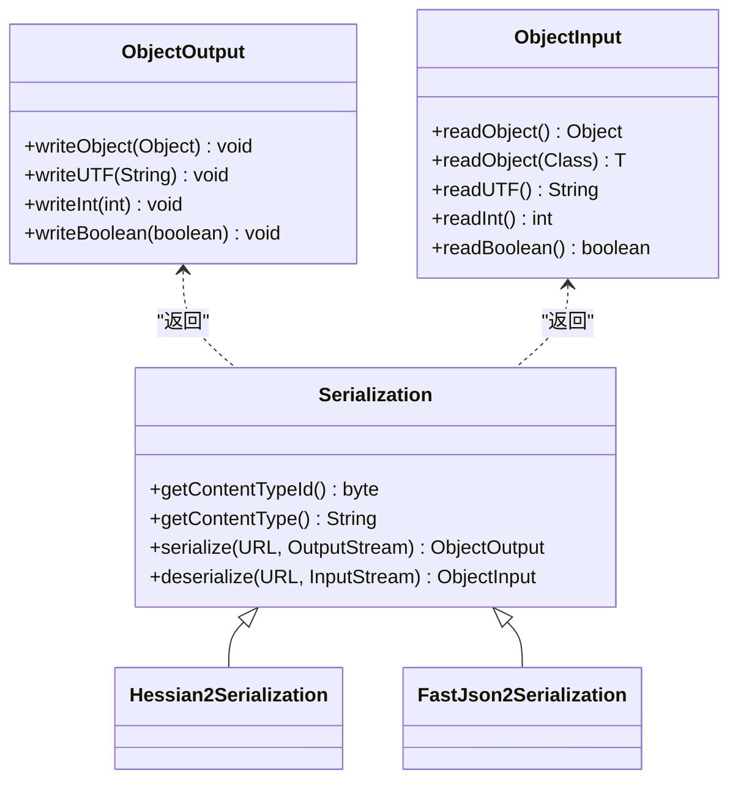
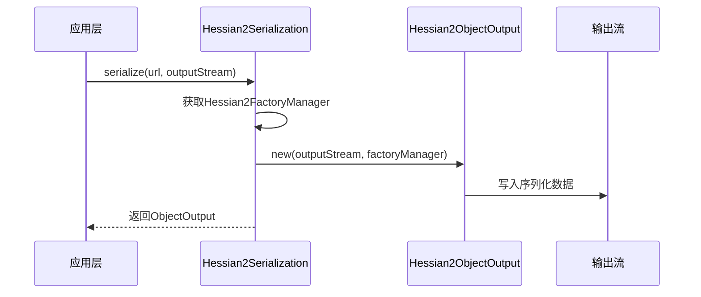
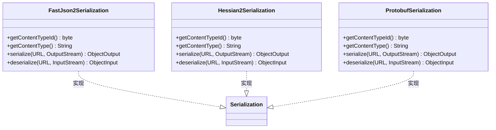
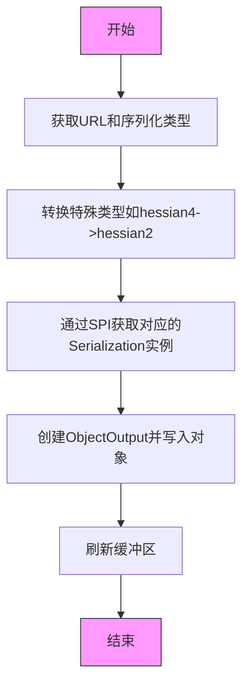

# 序列化机制

<cite>
**本文档引用的文件**  
- [Serialization.java](file://dubbo-serialization\dubbo-serialization-api\src\main\java\org\apache\dubbo\common\serialize\Serialization.java)
- [MultipleSerialization.java](file://dubbo-serialization\dubbo-serialization-api\src\main\java\org\apache\dubbo\common\serialize\MultipleSerialization.java)
- [DefaultMultipleSerialization.java](file://dubbo-serialization\dubbo-serialization-api\src\main\java\org\apache\dubbo\common\serialize\DefaultMultipleSerialization.java)
- [Constants.java](file://dubbo-serialization\dubbo-serialization-api\src\main\java\org\apache\dubbo\common\serialize\Constants.java)
- [Hessian2Serialization.java](file://dubbo-serialization\dubbo-serialization-hessian2\src\main\java\org\apache\dubbo\common\serialize\hessian2\Hessian2Serialization.java)
- [FastJson2Serialization.java](file://dubbo-serialization\dubbo-serialization-fastjson2\src\main\java\org\apache\dubbo\common\serialize\fastjson2\FastJson2Serialization.java)
- [ObjectInput.java](file://dubbo-serialization\dubbo-serialization-api\src\main\java\org\apache\dubbo\common\serialize\ObjectInput.java)
- [ObjectOutput.java](file://dubbo-serialization\dubbo-serialization-api\src\main\java\org\apache\dubbo\common\serialize\ObjectOutput.java)
- [org.apache.dubbo.common.serialize.Serialization](file://dubbo-serialization\dubbo-serialization-api\src\main\resources\META-INF\dubbo\internal\org.apache.dubbo.common.serialize.Serialization)
- [org.apache.dubbo.common.serialize.MultipleSerialization](file://dubbo-serialization\dubbo-serialization-api\src\main\resources\META-INF\dubbo\internal\org.apache.dubbo.common.serialize.MultipleSerialization)
</cite>

## 目录
1. [引言](#引言)
2. [核心序列化接口](#核心序列化接口)
3. [序列化类型码与规范](#序列化类型码与规范)
4. [Hessian2序列化机制](#hessian2序列化机制)
5. [其他序列化实现](#其他序列化实现)
6. [MultipleSerialization动态协商](#multipleserialization动态协商)
7. [SPI扩展机制](#spi扩展机制)
8. [性能分析与选型建议](#性能分析与选型建议)
9. [序列化安全指南](#序列化安全指南)
10. [总结](#总结)

## 引言
Dubbo协议的可插拔序列化机制是其高性能RPC通信的核心组件之一。该机制通过SPI（Service Provider Interface）设计模式实现了序列化方式的灵活扩展和动态切换，支持多种序列化协议在运行时的协商与选择。序列化过程在Dubbo的编解码阶段起着关键作用，直接影响网络传输效率、系统性能和跨语言兼容性。本文将深入分析Dubbo序列化机制的设计原理、核心接口、默认实现以及安全防护策略，为开发者提供全面的技术指导。

## 核心序列化接口
Dubbo的序列化机制围绕`Serialization`接口构建，该接口定义了序列化器的基本行为规范。通过`serialize`和`deserialize`方法，实现了对象到字节流以及字节流到对象的双向转换。接口的`@SPI`注解表明其为可扩展点，允许通过配置加载不同的实现。`ObjectInput`和`ObjectOutput`接口则提供了更高层次的抽象，封装了基本数据类型和复杂对象的读写操作，为上层应用提供了统一的序列化编程接口。

**本节来源**
- [Serialization.java](file://dubbo-serialization\dubbo-serialization-api\src\main\java\org\apache\dubbo\common\serialize\Serialization.java#L37-L76)
- [ObjectInput.java](file://dubbo-serialization\dubbo-serialization-api\src\main\java\org\apache\dubbo\common\serialize\ObjectInput.java#L26-L87)
- [ObjectOutput.java](file://dubbo-serialization\dubbo-serialization-api\src\main\java\org\apache\dubbo\common\serialize\ObjectOutput.java#L25-L59)

## 序列化类型码与规范
序列化类型码是Dubbo协议头部的重要组成部分，用于标识消息体的序列化格式。`Constants`接口定义了所有支持的序列化类型码，这些码值被限制在5位以内（0-31），以适应协议头部的空间限制。每个`Serialization`实现必须提供唯一的类型码，通过`getContentTypeId()`方法返回。同时，`getContentType()`方法提供了MIME类型的描述，便于调试和协议识别。这种设计确保了序列化方式的可识别性和向后兼容性。

**图表来源**
- [Serialization.java](file://dubbo-serialization\dubbo-serialization-api\src\main\java\org\apache\dubbo\common\serialize\Serialization.java#L37-L76)
- [Constants.java](file://dubbo-serialization\dubbo-serialization-api\src\main\java\org\apache\dubbo\common\serialize\Constants.java#L19-L40)

**本节来源**
- [Constants.java](file://dubbo-serialization\dubbo-serialization-api\src\main\java\org\apache\dubbo\common\serialize\Constants.java#L19-L40)

## Hessian2序列化机制
Hessian2作为Dubbo的默认序列化方式，具有出色的性能和广泛的兼容性。`Hessian2Serialization`类实现了`Serialization`接口，其`getContentTypeId()`返回`HESSIAN2_SERIALIZATION_ID`（值为2）。Hessian2采用二进制编码，相比Java原生序列化，具有更小的字节大小和更快的序列化速度。其实现通过`Hessian2ObjectOutput`和`Hessian2ObjectInput`包装了底层的Hessian库，利用`Hessian2FactoryManager`进行对象工厂管理，确保了序列化过程的线程安全和高效性。

**图表来源**
- [Hessian2Serialization.java](file://dubbo-serialization\dubbo-serialization-hessian2\src\main\java\org\apache\dubbo\common\serialize\hessian2\Hessian2Serialization.java#L41-L86)
- [Hessian2ObjectOutput.java](file://dubbo-serialization\dubbo-serialization-hessian2\src\main\java\org\apache\dubbo\common\serialize\hessian2\Hessian2ObjectOutput.java)

**本节来源**
- [Hessian2Serialization.java](file://dubbo-serialization\dubbo-serialization-hessian2\src\main\java\org\apache\dubbo\common\serialize\hessian2\Hessian2Serialization.java#L41-L86)

## 其他序列化实现
Dubbo支持多种序列化实现以适应不同的应用场景。`FastJson2Serialization`提供了基于JSON的文本序列化，适用于需要可读性和跨语言调试的场景。其`getContentTypeId()`返回`FASTJSON2_SERIALIZATION_ID`（值为23），内容类型为"text/jsonb"。类似的，Protobuf、Kryo等序列化器也通过SPI机制注册。这些实现都遵循相同的接口规范，开发者可以通过配置`<dubbo:protocol serialization="fastjson2"/>`来切换序列化方式，体现了框架的灵活性。

**图表来源**
- [FastJson2Serialization.java](file://dubbo-serialization\dubbo-serialization-fastjson2\src\main\java\org\apache\dubbo\common\serialize\fastjson2\FastJson2Serialization.java#L41-L97)
- [Hessian2Serialization.java](file://dubbo-serialization\dubbo-serialization-hessian2\src\main\java\org\apache\dubbo\common\serialize\hessian2\Hessian2Serialization.java#L41-L86)

**本节来源**
- [FastJson2Serialization.java](file://dubbo-serialization\dubbo-serialization-fastjson2\src\main\java\org\apache\dubbo\common\serialize\fastjson2\FastJson2Serialization.java#L41-L97)

## MultipleSerialization动态协商
`MultipleSerialization`接口支持在运行时动态协商序列化方式。`DefaultMultipleSerialization`作为其默认实现，允许根据URL参数中的`serializeType`选择具体的序列化器。该机制通过`getExtension()`从SPI加载器中获取对应的`Serialization`实例，实现了序列化方式的灵活切换。当接收到`hessian4`类型时，会自动转换为`hessian2`，保证了向后兼容性。这种设计使得Dubbo可以在同一个集群中支持多种序列化协议，便于系统升级和迁移。

**图表来源**
- [MultipleSerialization.java](file://dubbo-serialization\dubbo-serialization-api\src\main\java\org\apache\dubbo\common\serialize\MultipleSerialization.java#L28-L34)
- [DefaultMultipleSerialization.java](file://dubbo-serialization\dubbo-serialization-api\src\main\java\org\apache\dubbo\common\serialize\DefaultMultipleSerialization.java#L25-L55)

**本节来源**
- [MultipleSerialization.java](file://dubbo-serialization\dubbo-serialization-api\src\main\java\org\apache\dubbo\common\serialize\MultipleSerialization.java#L28-L34)
- [DefaultMultipleSerialization.java](file://dubbo-serialization\dubbo-serialization-api\src\main\java\org\apache\dubbo\common\serialize\DefaultMultipleSerialization.java#L25-L55)

## SPI扩展机制
Dubbo的序列化机制基于SPI实现可插拔设计。在`META-INF/dubbo/internal/`目录下，`org.apache.dubbo.common.serialize.Serialization`文件定义了所有可用的序列化器，如`hessian2=org.apache.dubbo.common.serialize.hessian2.Hessian2Serialization`。`MultipleSerialization`的配置文件则指定了默认实现。当系统启动时，ExtensionLoader会根据这些配置加载相应的类。开发者可以通过创建新的实现类并在SPI配置文件中注册，轻松扩展序列化功能，体现了Dubbo高度模块化的设计哲学。

**本节来源**
- [org.apache.dubbo.common.serialize.Serialization](file://dubbo-serialization\dubbo-serialization-hessian2\src\main\resources\META-INF\dubbo\internal\org.apache.dubbo.common.serialize.Serialization#L1-L2)
- [org.apache.dubbo.common.serialize.MultipleSerialization](file://dubbo-serialization\dubbo-serialization-api\src\main\resources\META-INF\dubbo\internal\org.apache.dubbo.common.serialize.MultipleSerialization#L1-L1)

## 性能分析与选型建议
序列化性能直接影响RPC调用的延迟和吞吐量。Hessian2在序列化速度和字节大小上表现优异，适合高并发场景。JSON类序列化（如Fastjson2）虽然可读性好，但性能和字节开销较大，适合调试和跨语言集成。Protobuf在性能和紧凑性上达到最佳平衡，但需要预定义schema。选型时应综合考虑性能需求、跨语言兼容性、开发便利性和安全性。对于内部服务间通信，推荐使用Hessian2；对于开放API，可考虑JSON或Protobuf。

## 序列化安全指南
反序列化漏洞是分布式系统的主要安全风险之一。Dubbo通过`SerializeSecurityManager`提供安全控制，支持白名单机制和序列化检查。`FastJson2SerializationTest`中的测试用例展示了如何通过`setCheckStatus(STRICT)`启用严格模式，防止恶意类加载。开发者应避免使用Java原生序列化，对输入数据进行严格校验，并定期更新序列化库以修复已知漏洞。生产环境应配置序列化白名单，仅允许必要的类进行序列化。

**本节来源**
- [FastJson2SerializationTest.java](file://dubbo-serialization\dubbo-serialization-fastjson2\src\test\java\org\apache\dubbo\common\serialize\fastjson2\FastJson2SerializationTest.java#L376-L514)

## 总结
Dubbo的可插拔序列化机制通过清晰的接口定义、灵活的SPI扩展和高效的默认实现，为分布式系统提供了可靠的通信基础。Hessian2作为默认序列化方式，在性能和兼容性之间取得了良好平衡。MultipleSerialization支持动态协商，适应复杂的生产环境。开发者应根据具体场景选择合适的序列化方式，并重视反序列化安全，通过合理的配置和最佳实践，构建高性能、高安全性的分布式应用。