# 消息体编码

<cite>
**本文档引用文件**   
- [DubboCodec.java](file://dubbo-rpc/dubbo-rpc-dubbo/src/main/java/org/apache/dubbo/rpc/protocol/dubbo/DubboCodec.java)
- [DubboCodecSupport.java](file://dubbo-rpc/dubbo-rpc-dubbo/src/main/java/org/apache/dubbo/rpc/protocol/dubbo/DubboCodecSupport.java)
- [RpcInvocation.java](file://dubbo-rpc/dubbo-rpc-api/src/main/java/org/apache/dubbo/rpc/RpcInvocation.java)
- [Invocation.java](file://dubbo-rpc/dubbo-rpc-api/src/main/java/org/apache/dubbo/rpc/Invocation.java)
- [CallbackServiceCodec.java](file://dubbo-rpc/dubbo-rpc-dubbo/src/main/java/org/apache/dubbo/rpc/protocol/dubbo/CallbackServiceCodec.java)
- [ObjectOutput.java](file://dubbo-serialization/dubbo-serialization-api/src/main/java/org/apache/dubbo/common/serialize/ObjectOutput.java)
- [Hessian2Serialization.java](file://dubbo-serialization/dubbo-serialization-hessian2/src/main/java/org/apache/dubbo/common/serialize/hessian2/Hessian2Serialization.java)
- [FastJson2Serialization.java](file://dubbo-serialization/dubbo-serialization-fastjson2/src/main/java/org/apache/dubbo/common/serialize/fastjson2/FastJson2Serialization.java)
</cite>

## 目录
1. [引言](#引言)
2. [消息体结构与编码规则](#消息体结构与编码规则)
3. [请求ID与调用类型](#请求id与调用类型)
4. [元数据编码](#元数据编码)
5. [参数与附加属性序列化](#参数与附加属性序列化)
6. [DubboCodec与ObjectOutput接口](#dubboCodec与objectOutput接口)
7. [泛型与复杂对象处理](#泛型与复杂对象处理)
8. [实际调用场景示例](#实际调用场景示例)
9. [消息体优化建议](#消息体优化建议)
10. [结论](#结论)

## 引言
Dubbo协议作为高性能的RPC通信协议，其消息体编码规则是实现高效远程调用的核心。本文深入解析Dubbo协议消息体的编码机制，涵盖请求ID、调用类型、元数据编码、参数序列化等关键方面。通过分析DubboCodec如何利用ObjectOutput接口将Invocation对象序列化为字节流，揭示Dubbo在异步调用、回调函数处理、泛型参数和复杂对象传输中的实现策略。为开发者提供全面的消息体编码知识，帮助优化网络传输性能。

## 消息体结构与编码规则
Dubbo协议消息体遵循严格的结构化编码规则，确保跨语言、跨平台的兼容性。消息体由固定头部和可变体部组成，头部包含协议魔数、标志位、状态码、请求ID和数据长度等关键信息。体部则根据请求或响应类型，包含服务接口名、方法名、参数类型签名、参数值和附加属性等数据。

消息体编码采用分层设计，首先通过ExchangeCodec处理通用的交换层协议，然后由DubboCodec处理具体的Dubbo协议细节。编码过程充分利用了Java的序列化机制，通过ObjectOutput接口将Java对象转换为字节流。这种设计既保证了协议的通用性，又提供了良好的扩展性。

**消息体编码流程**
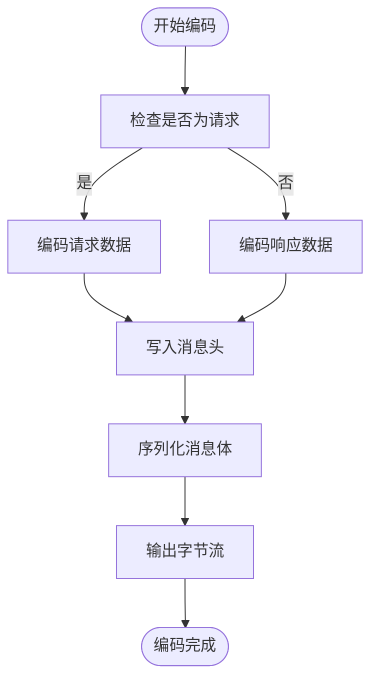
```mermaid
flowchart TD
Start([开始编码]) --> CheckRequest["检查是否为请求"]
CheckRequest --> |是| EncodeRequest["编码请求数据"]
CheckRequest --> |否| EncodeResponse["编码响应数据"]
EncodeRequest --> WriteHeader["写入消息头"]
EncodeResponse --> WriteHeader
WriteHeader --> SerializeBody["序列化消息体"]
SerializeBody --> Output["输出字节流"]
Output --> End([编码完成])
```

**消息体结构**
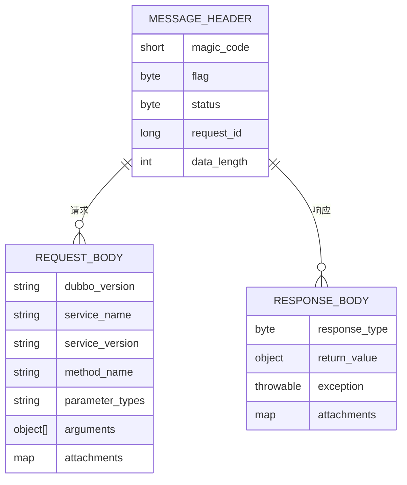
```mermaid
erDiagram
MESSAGE_HEADER {
short magic_code
byte flag
byte status
long request_id
int data_length
}
REQUEST_BODY {
string dubbo_version
string service_name
string service_version
string method_name
string parameter_types
object[] arguments
map attachments
}
RESPONSE_BODY {
byte response_type
object return_value
throwable exception
map attachments
}
MESSAGE_HEADER ||--o{ REQUEST_BODY : "请求"
MESSAGE_HEADER ||--o{ RESPONSE_BODY : "响应"
```

**消息体编码规则**
- **魔数（Magic Code）**：固定值0xdabb，用于标识Dubbo协议
- **标志位（Flag）**：包含序列化类型、请求/响应标识、双向调用标识等
- **状态码（Status）**：表示响应状态，如成功、异常等
- **请求ID（Request ID）**：64位长整型，用于关联请求和响应
- **数据长度（Data Length）**：32位整型，表示消息体的字节长度

**消息体编码示例**

```mermaid
flowchart LR
ServiceName["服务接口名: com.example.DemoService"] --> MethodName["方法名: sayHello"]
MethodName --> ParamTypes["参数类型: java.lang.String"]
ParamTypes --> Args["参数值: 'World'"]
Args --> Attachments["附加属性: {timeout=5000}"]
Attachments --> Serialized["序列化字节流"]
```

**消息体编码流程图**
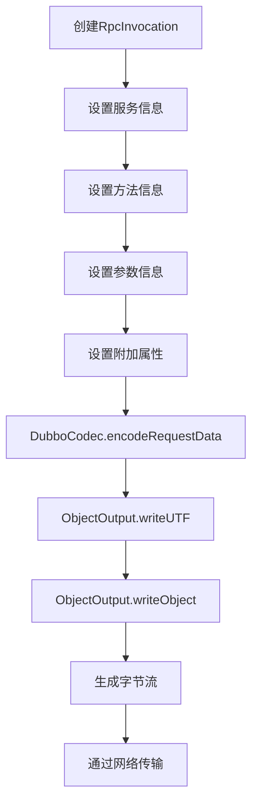
```mermaid
flowchart TD
A[创建RpcInvocation] --> B[设置服务信息]
B --> C[设置方法信息]
C --> D[设置参数信息]
D --> E[设置附加属性]
E --> F[DubboCodec.encodeRequestData]
F --> G[ObjectOutput.writeUTF]
G --> H[ObjectOutput.writeObject]
H --> I[生成字节流]
I --> J[通过网络传输]
```

**消息体编码规则表**
| 字段 | 类型 | 描述 | 编码方式 |
|------|------|------|---------|
| 魔数 | short | 协议标识 | 固定值0xdabb |
| 标志位 | byte | 协议状态 | 位操作 |
| 状态码 | byte | 响应状态 | 枚举值 |
| 请求ID | long | 请求标识 | Bytes.bytes2long |
| 数据长度 | int | 消息体长度 | Bytes.bytes2int |
| 服务名 | string | 接口全限定名 | UTF-8编码 |
| 方法名 | string | 方法名称 | UTF-8编码 |
| 参数类型 | string | 参数类型签名 | UTF-8编码 |
| 参数值 | object | 参数实际值 | 序列化 |
| 附加属性 | map | 附加信息 | 序列化 |

**Section sources**
- [DubboCodec.java](file://dubbo-rpc/dubbo-rpc-dubbo/src/main/java/org/apache/dubbo/rpc/protocol/dubbo/DubboCodec.java#L63-L290)
- [ExchangeCodec.java](file://dubbo-remoting/dubbo-remoting-api/src/main/java/org/apache/dubbo/remoting/exchange/codec/ExchangeCodec.java#L49-L498)

## 请求ID与调用类型
请求ID（Request ID）在Dubbo协议中扮演着至关重要的角色，特别是在异步调用场景中。每个请求都会分配一个唯一的64位长整型ID，这个ID在请求和响应之间保持一致，用于关联请求和响应。在异步调用中，客户端发送请求后立即返回，当服务端处理完成并返回响应时，客户端通过请求ID找到对应的回调函数或Future对象，实现异步结果的正确传递。

调用类型（Invocation Type）决定了Dubbo的调用方式，主要分为单向通知、同步调用和异步回调三种模式。单向通知（One-way Notification）适用于不需要返回结果的场景，如日志记录、事件通知等。同步调用（Synchronous Invocation）是最常见的调用方式，客户端发送请求后阻塞等待响应。异步回调（Asynchronous Callback）则允许客户端在发送请求后继续执行其他任务，当响应到达时通过回调函数处理结果。

**调用类型对比**
| 调用类型 | 特点 | 适用场景 | 性能影响 |
|---------|------|---------|---------|
| 单向通知 | 无返回值，不等待响应 | 日志记录、事件通知 | 最低延迟 |
| 同步调用 | 阻塞等待响应 | 大多数业务场景 | 中等延迟 |
| 异步回调 | 非阻塞，通过回调处理结果 | 高并发、耗时操作 | 高吞吐量 |

**异步调用流程**
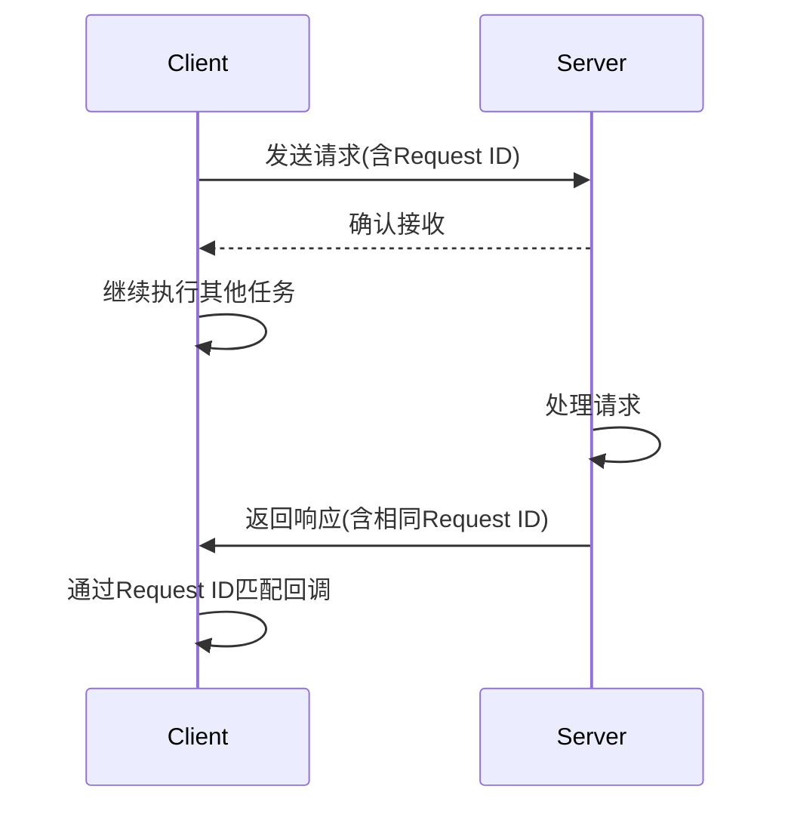
```mermaid
sequenceDiagram
participant Client
participant Server
Client->>Server : 发送请求(含Request ID)
Server-->>Client : 确认接收
Client->>Client : 继续执行其他任务
Server->>Server : 处理请求
Server->>Client : 返回响应(含相同Request ID)
Client->>Client : 通过Request ID匹配回调
```

**请求ID生成策略**
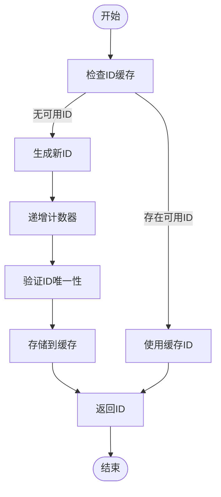
```mermaid
flowchart TD
Start([开始]) --> CheckCache["检查ID缓存"]
CheckCache --> |存在可用ID| UseCached["使用缓存ID"]
CheckCache --> |无可用ID| GenerateNew["生成新ID"]
GenerateNew --> Increment["递增计数器"]
Increment --> Validate["验证ID唯一性"]
Validate --> Store["存储到缓存"]
Store --> ReturnID["返回ID"]
UseCached --> ReturnID
ReturnID --> End([结束])
```

**调用类型处理机制**
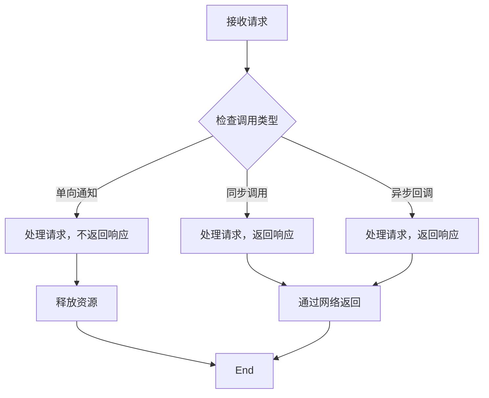
```mermaid
flowchart TD
A[接收请求] --> B{检查调用类型}
B --> |单向通知| C[处理请求，不返回响应]
B --> |同步调用| D[处理请求，返回响应]
B --> |异步回调| E[处理请求，返回响应]
C --> F[释放资源]
D --> G[通过网络返回]
E --> G
F --> End
G --> End
```

**请求ID与调用类型关系**
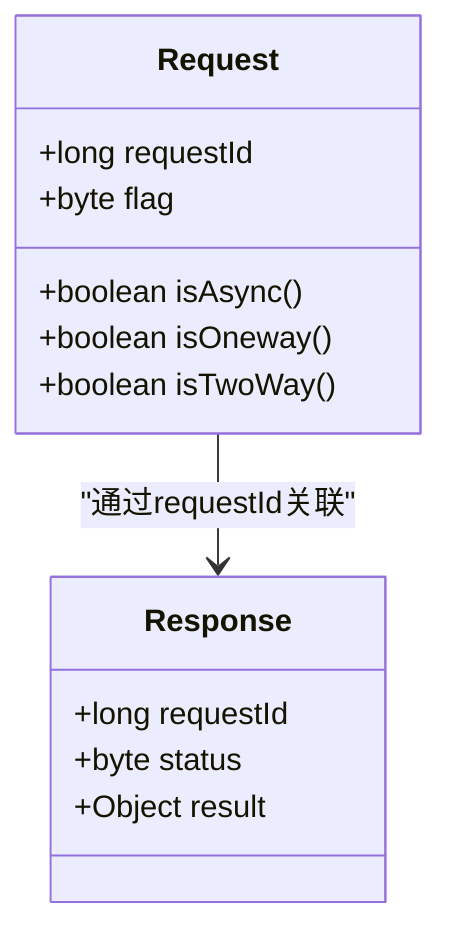
```mermaid
classDiagram
class Request {
+long requestId
+byte flag
+boolean isAsync()
+boolean isOneway()
+boolean isTwoWay()
}
class Response {
+long requestId
+byte status
+Object result
}
Request --> Response : "通过requestId关联"
```

**调用类型配置**
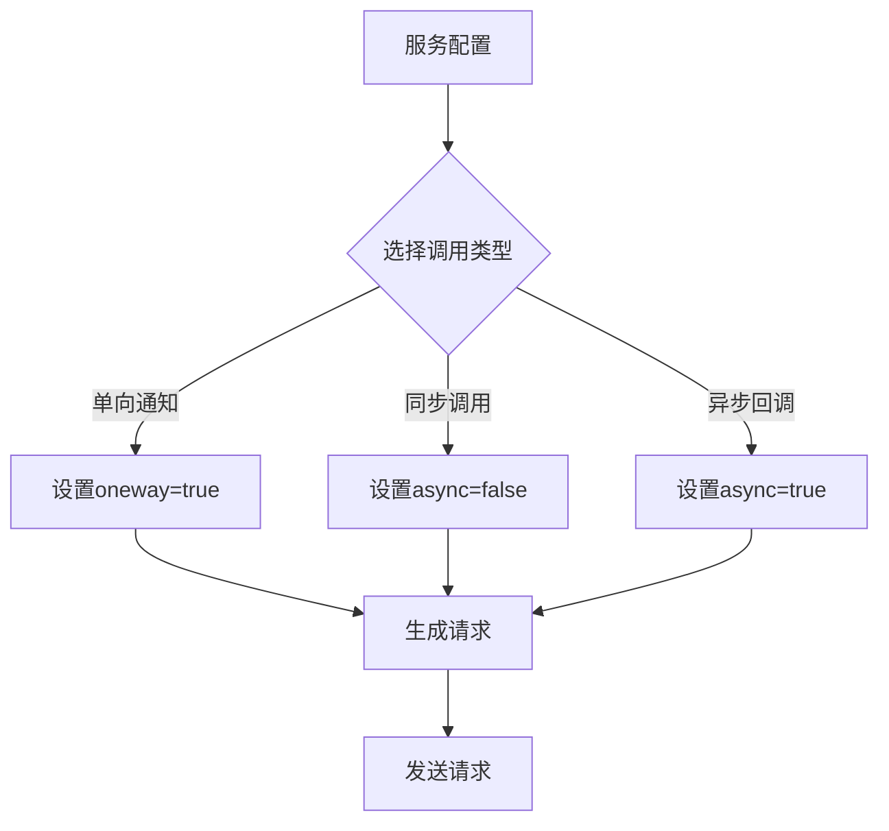
```mermaid
flowchart TD
A[服务配置] --> B{选择调用类型}
B --> |单向通知| C[设置oneway=true]
B --> |同步调用| D[设置async=false]
B --> |异步回调| E[设置async=true]
C --> F[生成请求]
D --> F
E --> F
F --> G[发送请求]
```

**Section sources**
- [DubboCodec.java](file://dubbo-rpc/dubbo-rpc-dubbo/src/main/java/org/apache/dubbo/rpc/protocol/dubbo/DubboCodec.java#L94-L105)
- [RpcInvocation.java](file://dubbo-rpc/dubbo-rpc-api/src/main/java/org/apache/dubbo/rpc/RpcInvocation.java#L95-L96)

## 元数据编码
Dubbo协议中的元数据编码是实现服务发现和调用的关键。元数据包括服务接口名、方法名和参数类型签名，这些信息在调用过程中被编码到消息体中，确保服务提供方能够准确识别和处理请求。服务接口名通常采用全限定类名（Fully Qualified Class Name）的形式，如"com.example.DemoService"。方法名直接使用Java方法的名称，如"sayHello"。参数类型签名则采用Java的类型描述符格式，如"Ljava/lang/String;"表示String类型。

元数据编码采用UTF-8字符串格式，通过ObjectOutput的writeUTF方法写入字节流。这种编码方式简单高效，同时保证了跨平台的兼容性。在DubboCodec的encodeRequestData方法中，首先写入Dubbo协议版本，然后依次写入服务名、服务版本、方法名和参数类型签名。这种顺序编码确保了接收方能够按照相同的顺序正确解析元数据。

**元数据编码流程**
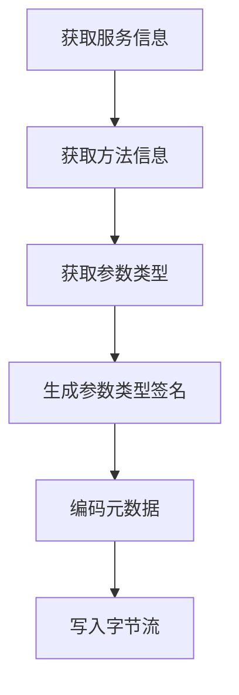
```mermaid
flowchart TD
A[获取服务信息] --> B[获取方法信息]
B --> C[获取参数类型]
C --> D[生成参数类型签名]
D --> E[编码元数据]
E --> F[写入字节流]
```

**参数类型签名规则**
| Java类型 | 类型签名 | 示例 |
|---------|---------|------|
| boolean | Z | Z |
| byte | B | B |
| char | C | C |
| short | S | S |
| int | I | I |
| long | J | J |
| float | F | F |
| double | D | D |
| String | Ljava/lang/String; | Ljava/lang/String; |
| 数组 | [类型 | [I表示int数组 |
| 对象 | L全限定类名; | Lcom/example/User; |

**元数据编码示例**

```mermaid
flowchart LR
ServiceName["服务接口名: com.example.DemoService"] --> MethodName["方法名: sayHello"]
MethodName --> ParamTypes["参数类型: Ljava/lang/String;"]
ParamTypes --> Signature["生成方法签名: sayHello(Ljava/lang/String;)"]
Signature --> Encode["编码为UTF-8字节流"]
```

**元数据编码类图**
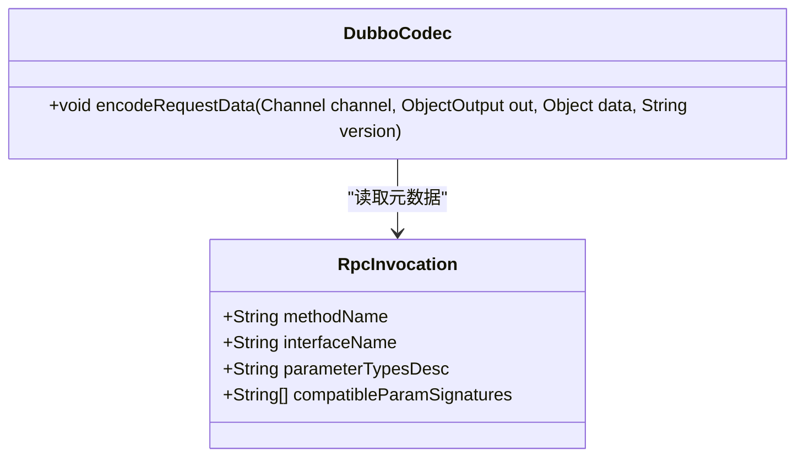
```mermaid
classDiagram
class RpcInvocation {
+String methodName
+String interfaceName
+String parameterTypesDesc
+String[] compatibleParamSignatures
}
class DubboCodec {
+void encodeRequestData(Channel channel, ObjectOutput out, Object data, String version)
}
DubboCodec --> RpcInvocation : "读取元数据"
```

**元数据编码时序图**
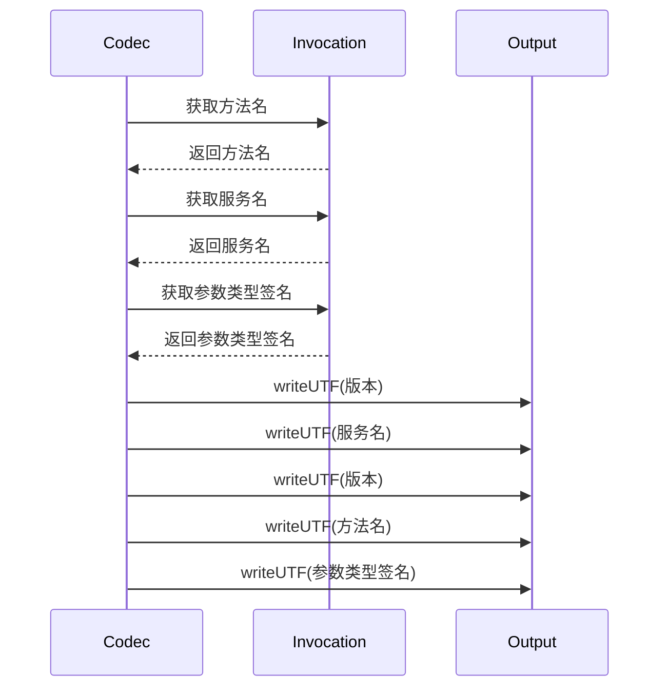
```mermaid
sequenceDiagram
participant Codec
participant Invocation
participant Output
Codec->>Invocation : 获取方法名
Invocation-->>Codec : 返回方法名
Codec->>Invocation : 获取服务名
Invocation-->>Codec : 返回服务名
Codec->>Invocation : 获取参数类型签名
Invocation-->>Codec : 返回参数类型签名
Codec->>Output : writeUTF(版本)
Codec->>Output : writeUTF(服务名)
Codec->>Output : writeUTF(版本)
Codec->>Output : writeUTF(方法名)
Codec->>Output : writeUTF(参数类型签名)
```

**元数据编码优化**
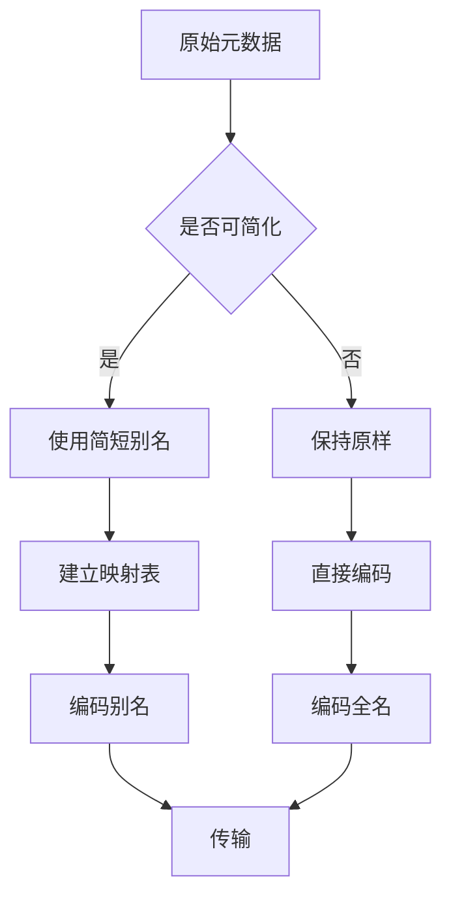
```mermaid
flowchart TD
A[原始元数据] --> B{是否可简化}
B --> |是| C[使用简短别名]
B --> |否| D[保持原样]
C --> E[建立映射表]
D --> F[直接编码]
E --> G[编码别名]
F --> H[编码全名]
G --> I[传输]
H --> I
```

**Section sources**
- [DubboCodec.java](file://dubbo-rpc/dubbo-rpc-dubbo/src/main/java/org/apache/dubbo/rpc/protocol/dubbo/DubboCodec.java#L283-L293)
- [RpcInvocation.java](file://dubbo-rpc/dubbo-rpc-api/src/main/java/org/apache/dubbo/rpc/RpcInvocation.java#L71-L73)

## 参数与附加属性序列化
参数值和附加属性（Attachments）的序列化是Dubbo消息体编码的重要组成部分。参数值通过ObjectOutput的writeObject方法进行序列化，支持各种Java对象类型，包括基本类型、集合、自定义对象等。附加属性则通过writeAttachments方法序列化，通常用于传递调用上下文信息，如超时时间、调用令牌等。

序列化过程由具体的Serialization实现类完成，如Hessian2Serialization或FastJson2Serialization。这些实现类负责将Java对象转换为字节流，并处理循环引用、空值等特殊情况。在DubboCodec中，参数序列化是逐个进行的，每个参数调用一次writeObject方法。附加属性作为一个Map对象整体序列化，保持了键值对的结构。

**参数序列化流程**
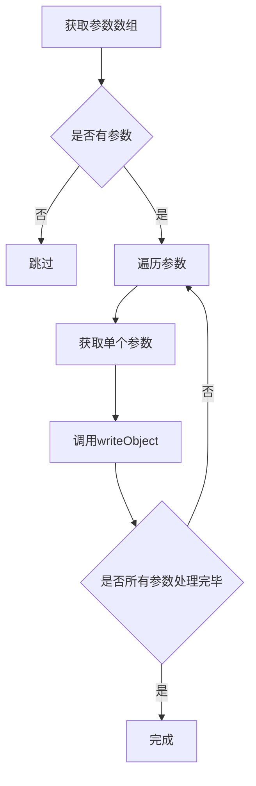
```mermaid
flowchart TD
A[获取参数数组] --> B{是否有参数}
B --> |否| C[跳过]
B --> |是| D[遍历参数]
D --> E[获取单个参数]
E --> F[调用writeObject]
F --> G{是否所有参数处理完毕}
G --> |否| D
G --> |是| H[完成]
```

**附加属性序列化流程**
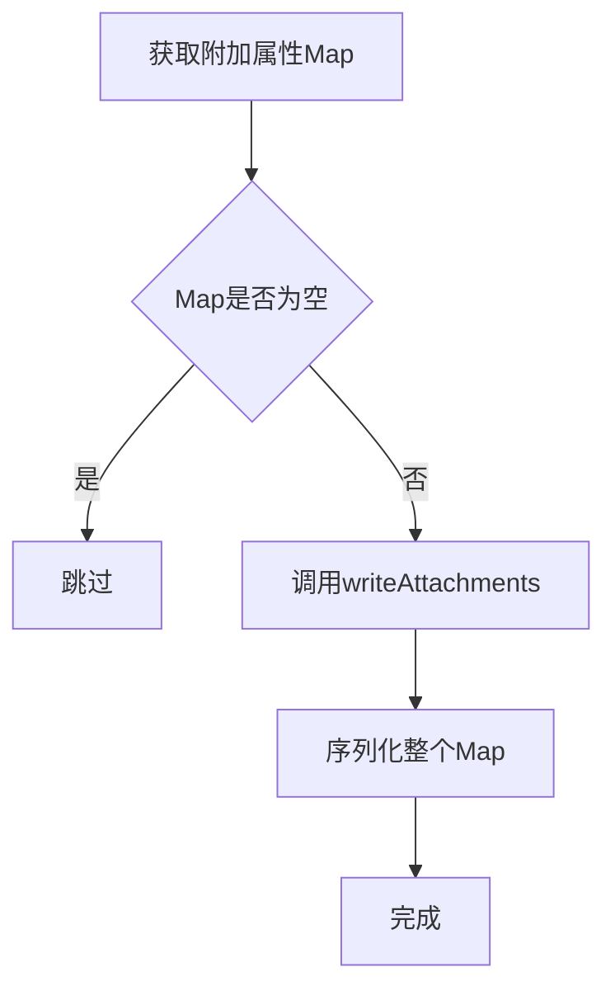
```mermaid
flowchart TD
A[获取附加属性Map] --> B{Map是否为空}
B --> |是| C[跳过]
B --> |否| D[调用writeAttachments]
D --> E[序列化整个Map]
E --> F[完成]
```

**序列化实现类关系**
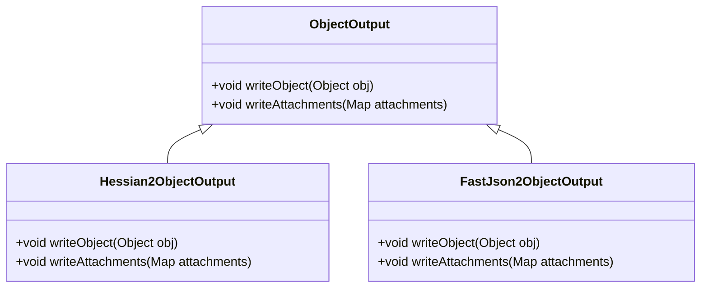
```mermaid
classDiagram
class ObjectOutput {
+void writeObject(Object obj)
+void writeAttachments(Map<String, Object> attachments)
}
class Hessian2ObjectOutput {
+void writeObject(Object obj)
+void writeAttachments(Map<String, Object> attachments)
}
class FastJson2ObjectOutput {
+void writeObject(Object obj)
+void writeAttachments(Map<String, Object> attachments)
}
ObjectOutput <|-- Hessian2ObjectOutput
ObjectOutput <|-- FastJson2ObjectOutput
```

**序列化过程时序图**
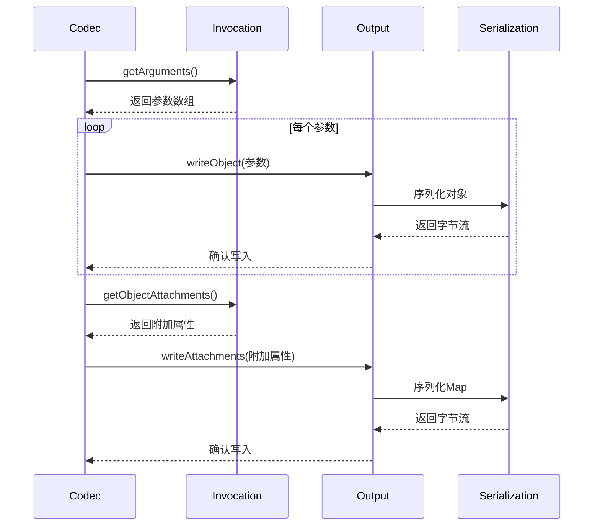
```mermaid
sequenceDiagram
participant Codec
participant Invocation
participant Output
participant Serialization
Codec->>Invocation : getArguments()
Invocation-->>Codec : 返回参数数组
loop 每个参数
Codec->>Output : writeObject(参数)
Output->>Serialization : 序列化对象
Serialization-->>Output : 返回字节流
Output-->>Codec : 确认写入
end
Codec->>Invocation : getObjectAttachments()
Invocation-->>Codec : 返回附加属性
Codec->>Output : writeAttachments(附加属性)
Output->>Serialization : 序列化Map
Serialization-->>Output : 返回字节流
Output-->>Codec : 确认写入
```

**序列化策略对比**
| 序列化方式 | 优点 | 缺点 | 适用场景 |
|-----------|------|------|---------|
| Hessian2 | 高性能，跨语言 | 二进制格式，可读性差 | 高并发场景 |
| FastJson2 | 可读性好，调试方便 | 性能略低 | 开发调试 |
| Java原生 | 简单易用 | 安全性差，性能低 | 内部测试 |

**序列化异常处理**
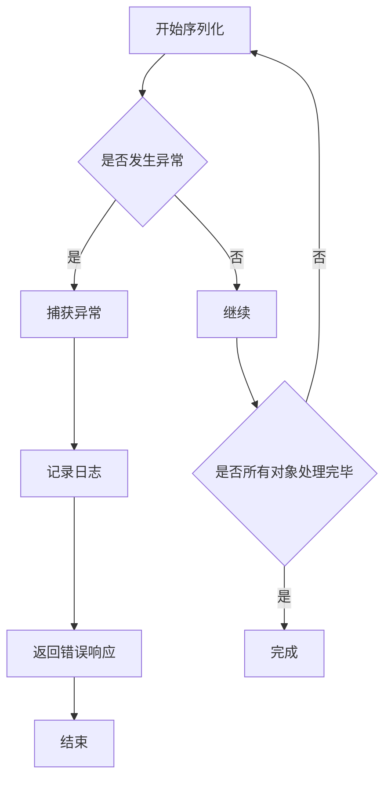
```mermaid
flowchart TD
A[开始序列化] --> B{是否发生异常}
B --> |否| C[继续]
B --> |是| D[捕获异常]
D --> E[记录日志]
E --> F[返回错误响应]
F --> G[结束]
C --> H{是否所有对象处理完毕}
H --> |否| A
H --> |是| I[完成]
```

**Section sources**
- [DubboCodec.java](file://dubbo-rpc/dubbo-rpc-dubbo/src/main/java/org/apache/dubbo/rpc/protocol/dubbo/DubboCodec.java#L294-L300)
- [ObjectOutput.java](file://dubbo-serialization/dubbo-serialization-api/src/main/java/org/apache/dubbo/common/serialize/ObjectOutput.java#L25-L59)

## DubboCodec与ObjectOutput接口
DubboCodec是Dubbo协议的核心编解码器，负责将RPC调用转换为网络传输的字节流。它继承自ExchangeCodec，实现了Dubbo协议特有的编码规则。DubboCodec通过ObjectOutput接口与具体的序列化实现解耦，使得Dubbo能够支持多种序列化方式，如Hessian2、FastJson2等。

ObjectOutput接口定义了writeObject、writeThrowable、writeAttachments等方法，为不同类型的对象提供了统一的序列化入口。DubboCodec在encodeRequestData方法中，首先写入协议版本、服务名、方法名等元数据，然后通过循环调用writeObject方法序列化每个参数，最后调用writeAttachments方法序列化附加属性。这种分步编码的方式确保了消息体结构的清晰和可维护性。

**DubboCodec类图**
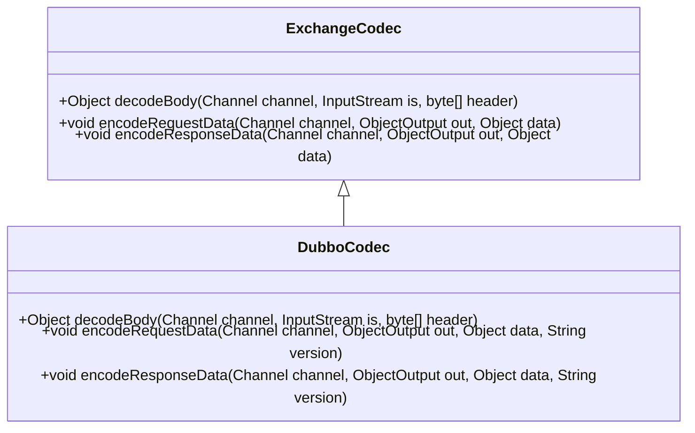
```mermaid
classDiagram
class ExchangeCodec {
+Object decodeBody(Channel channel, InputStream is, byte[] header)
+void encodeRequestData(Channel channel, ObjectOutput out, Object data)
+void encodeResponseData(Channel channel, ObjectOutput out, Object data)
}
class DubboCodec {
+Object decodeBody(Channel channel, InputStream is, byte[] header)
+void encodeRequestData(Channel channel, ObjectOutput out, Object data, String version)
+void encodeResponseData(Channel channel, ObjectOutput out, Object data, String version)
}
ExchangeCodec <|-- DubboCodec
```

**编码过程时序图**
```mermaid
sequenceDiagram
participant Channel
participant DubboCodec
participant ObjectOutput
participant RpcInvocation
Channel->>DubboCodec : encodeRequestData
DubboCodec->>ObjectOutput : writeUTF(版本)
DubboCodec->>ObjectOutput : writeUTF(服务名)
DubboCodec->>ObjectOutput : writeUTF(版本)
DubboCodec->>ObjectOutput : writeUTF(方法名)
DubboCodec->>ObjectOutput : writeUTF(参数类型)
loop 每个参数
DubboCodec->>ObjectOutput : writeObject(参数)
end
DubboCodec->>ObjectOutput : writeAttachments(附加属性)
DubboCodec-->>Channel : 返回编码结果
```

**序列化实现关系**
```mermaid
classDiagram
class Serialization {
+byte getContentTypeId()
+String getContentType()
+ObjectOutput serialize(URL url, OutputStream out)
+ObjectInput deserialize(URL url, InputStream is)
}
class Hessian2Serialization {
+ObjectOutput serialize(URL url, OutputStream out)
+ObjectInput deserialize(URL url, InputStream is)
}
class FastJson2Serialization {
+ObjectOutput serialize(URL url, OutputStream out)
+ObjectInput deserialize(URL url, InputStream is)
}
Serialization <|-- Hessian2Serialization
Serialization <|-- FastJson2Serialization
```

**编码流程图**
```mermaid
flowchart TD
A[开始编码] --> B[创建ObjectOutput]
B --> C[写入协议版本]
C --> D[写入服务信息]
D --> E[写入方法信息]
E --> F[写入参数类型]
F --> G[序列化参数值]
G --> H[序列化附加属性]
H --> I[完成编码]
```

**Section sources**
- [DubboCodec.java](file://dubbo-rpc/dubbo-rpc-dubbo/src/main/java/org/apache/dubbo/rpc/protocol/dubbo/DubboCodec.java#L269-L302)
- [ObjectOutput.java](file://dubbo-serialization/dubbo-serialization-api/src/main/java/org/apache/dubbo/common/serialize/ObjectOutput.java#L25-L59)

## 泛型与复杂对象处理
Dubbo在处理泛型参数和复杂对象时采用了特殊的序列化策略。对于泛型参数，Dubbo通过类型擦除后的原始类型进行序列化，同时在附加属性中保留泛型信息，确保接收方能够正确反序列化。复杂对象的处理则依赖于序列化框架的能力，如Hessian2能够处理循环引用、继承关系等复杂场景。

空值处理是Dubbo序列化中的一个重要方面。对于null参数，Dubbo直接写入null标记，而不是尝试序列化null对象。这种处理方式既节省了网络带宽，又避免了序列化异常。在反序列化时，接收方会正确识别null标记并恢复为null值。

**泛型处理流程**
```mermaid
flowchart TD
A[识别泛型参数] --> B[获取原始类型]
B --> C[序列化原始类型]
C --> D[保存泛型信息到附加属性]
D --> E[传输]
E --> F[接收方读取附加属性]
F --> G[恢复泛型类型]
G --> H[反序列化]
```

**复杂对象处理策略**
```mermaid
classDiagram
class ObjectOutput {
+void writeObject(Object obj)
}
class Hessian2ObjectOutput {
+void writeObject(Object obj)
+处理循环引用
+处理继承关系
+处理集合类型
}
ObjectOutput <|-- Hessian2ObjectOutput
```

**空值处理流程**
```mermaid
flowchart TD
A[检查参数是否为null] --> B{是null?}
B --> |是| C[写入null标记]
B --> |否| D[正常序列化]
C --> E[传输]
D --> E
E --> F[接收方检查null标记]
F --> G{是null标记?}
G --> |是| H[返回null]
G --> |否| I[正常反序列化]
```

**泛型序列化示例**
```mermaid
flowchart LR
GenericParam["泛型参数: List<String>"] --> RawType["原始类型: List"]
RawType --> Serialize["序列化List对象"]
Serialize --> Attachments["附加属性: genericType=List<String>"]
Attachments --> Transmit["传输"]
```

**复杂对象序列化时序图**
```mermaid
sequenceDiagram
participant Codec
participant Output
participant Serialization
participant Object
Codec->>Output : writeObject(复杂对象)
Output->>Serialization : 开始序列化
Serialization->>Object : 获取字段
Object-->>Serialization : 返回字段值
loop 每个字段
Serialization->>Serialization : 检查类型
alt 基本类型
Serialization->>Serialization : 直接写入
else 复杂类型
Serialization->>Serialization : 递归序列化
end
end
Serialization-->>Output : 返回字节流
Output-->>Codec : 确认写入
```

**Section sources**
- [RpcInvocation.java](file://dubbo-rpc/dubbo-rpc-api/src/main/java/org/apache/dubbo/rpc/RpcInvocation.java#L80-L81)
- [ObjectOutput.java](file://dubbo-serialization/dubbo-serialization-api/src/main/java/org/apache/dubbo/common/serialize/ObjectOutput.java#L32-L33)

## 实际调用场景示例
在实际调用场景中，Dubbo的消息体编码展示了其灵活性和高效性。以接口方法调用为例，当客户端调用服务接口的方法时，DubboCodec会将方法名、参数类型签名、参数值等信息编码到消息体中。服务端接收到请求后，根据这些元数据找到对应的方法并执行。

对于回调函数序列化，Dubbo采用了特殊的处理机制。当方法参数包含回调接口时，Dubbo会在客户端创建一个代理对象，将回调方法的调用转换为网络请求。这个代理对象的序列化包含了回调接口的元数据和客户端地址信息，确保服务端能够反向调用。

**接口方法调用流程**
```mermaid
sequenceDiagram
participant Client
participant Codec
participant Server
Client->>Codec : 调用sayHello("World")
Codec->>Codec : 创建RpcInvocation
Codec->>Codec : 编码元数据
Codec->>Codec : 序列化参数
Codec->>Server : 发送请求
Server->>Server : 解码请求
Server->>Server : 执行sayHello
Server->>Codec : 创建响应
Codec->>Client : 返回结果
```

**回调函数序列化流程**
```mermaid
flowchart TD
A[客户端调用含回调的方法] --> B[创建回调代理]
B --> C[编码回调接口元数据]
C --> D[编码客户端地址]
D --> E[序列化代理对象]
E --> F[发送请求]
F --> G[服务端接收]
G --> H[反序列化回调代理]
H --> I[调用回调方法]
I --> J[网络请求回客户端]
```

**完整调用示例**
```mermaid
flowchart LR
Client["客户端"] --> |调用| Codec["DubboCodec"]
Codec --> |编码| Network["网络传输"]
Network --> |解码| Codec2["服务端DubboCodec"]
Codec2 --> |执行| Service["服务实现"]
Service --> |返回| Codec2
Codec2 --> |编码响应| Network
Network --> |解码| Codec
Codec --> |返回结果| Client
```

**异步调用示例**
```mermaid
sequenceDiagram
participant Client
participant Future
participant Server
Client->>Future : 调用asyncMethod()
Future-->>Client : 返回Future对象
Client->>Client : 继续执行
Future->>Server : 发送异步请求
Server->>Server : 处理请求
Server->>Future : 返回响应
Future->>Client : 设置结果
```

**Section sources**
- [CallbackServiceCodec.java](file://dubbo-rpc/dubbo-rpc-dubbo/src/main/java/org/apache/dubbo/rpc/protocol/dubbo/CallbackServiceCodec.java#L357-L424)
- [DubboCodec.java](file://dubbo-rpc/dubbo-rpc-dubbo/src/main/java/org/apache/dubbo/rpc/protocol/dubbo/DubboCodec.java#L281-L302)

## 消息体优化建议
为了降低网络开销和提高传输效率，开发者可以采取多种消息体优化策略。首先，简化参数类型签名，避免使用过长的全限定类名，可以通过别名映射来缩短类型描述。其次，压缩附加属性，只传递必要的上下文信息，避免在附加属性中放置大量数据。

选择合适的序列化方式也是重要的优化手段。对于高性能要求的场景，推荐使用Hessian2序列化，它具有较小的序列化体积和较高的处理速度。对于需要调试的场景，可以选择FastJson2，其JSON格式便于查看和分析。

**消息体优化策略**
```mermaid
flowchart TD
A[分析消息体] --> B{是否可优化}
B --> |是| C[简化参数类型]
B --> |是| D[压缩附加属性]
B --> |是| E[选择合适序列化]
C --> F[使用类型别名]
D --> G[移除冗余信息]
E --> H[根据场景选择]
F --> I[测试优化效果]
G --> I
H --> I
I --> J[应用优化]
```

**参数类型简化示例**
```mermaid
flowchart LR
Original["原始类型: com.very.long.package.name.VeryLongClassName"] --> Simplified["简化类型: VLN"]
Simplified --> Mapping["映射表: VLN -> com.very.long.package.name.VeryLongClassName"]
```

**附加属性压缩策略**
```mermaid
classDiagram
class AttachmentsOptimizer {
+Map<String, Object> compress(Map<String, Object> attachments)
+Map<String, Object> decompress(Map<String, Object> compressed)
+boolean isRedundant(String key, Object value)
}
```

**序列化方式选择指南**
| 场景 | 推荐序列化 | 理由 |
|------|-----------|------|
| 生产环境 | Hessian2 | 高性能，小体积 |
| 开发调试 | FastJson2 | 可读性好 |
| 跨语言调用 | Protobuf | 标准化，兼容性好 |
| 安全敏感 | 自定义序列化 | 可控性强 |

**优化效果对比**
```mermaid
flowchart TD
A[优化前] --> B[消息体大小: 1024字节]
A --> C[序列化时间: 10ms]
A --> D[反序列化时间: 12ms]
B --> E[优化后]
C --> E
D --> E
E --> F[消息体大小: 600字节]
E --> G[序列化时间: 6ms]
E --> H[反序列化时间: 7ms]
```

**Section sources**
- [DubboCodec.java](file://dubbo-rpc/dubbo-rpc-dubbo/src/main/java/org/apache/dubbo/rpc/protocol/dubbo/DubboCodec.java#L283-L300)
- [ObjectOutput.java](file://dubbo-serialization/dubbo-serialization-api/src/main/java/org/apache/dubbo/common/serialize/ObjectOutput.java#L56-L58)

## 结论
Dubbo协议的消息体编码机制体现了高性能RPC框架的设计精髓。通过深入分析请求ID、调用类型、元数据编码、参数序列化等关键方面，我们揭示了Dubbo在实现高效远程调用中的技术细节。DubboCodec与ObjectOutput接口的分层设计，既保证了协议的通用性，又提供了良好的扩展性。

对于泛型参数、复杂对象和空值的处理策略，展示了Dubbo在应对各种复杂场景时的灵活性和健壮性。实际调用场景的分析进一步验证了这些机制的有效性。开发者通过理解这些编码规则，可以更好地优化消息体，降低网络开销，提高系统性能。

未来，随着微服务架构的不断发展，Dubbo的消息体编码机制将继续演进，支持更多序列化方式，优化传输效率，为构建高性能分布式系统提供坚实的基础。