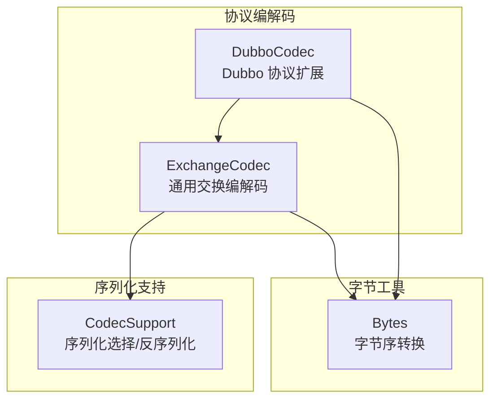
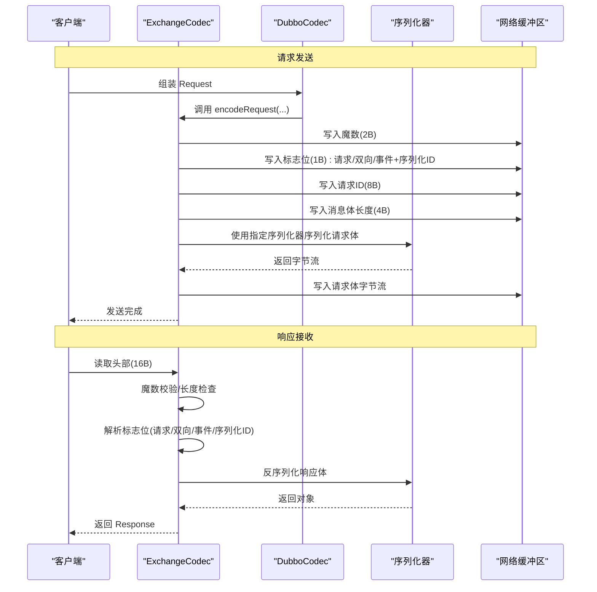
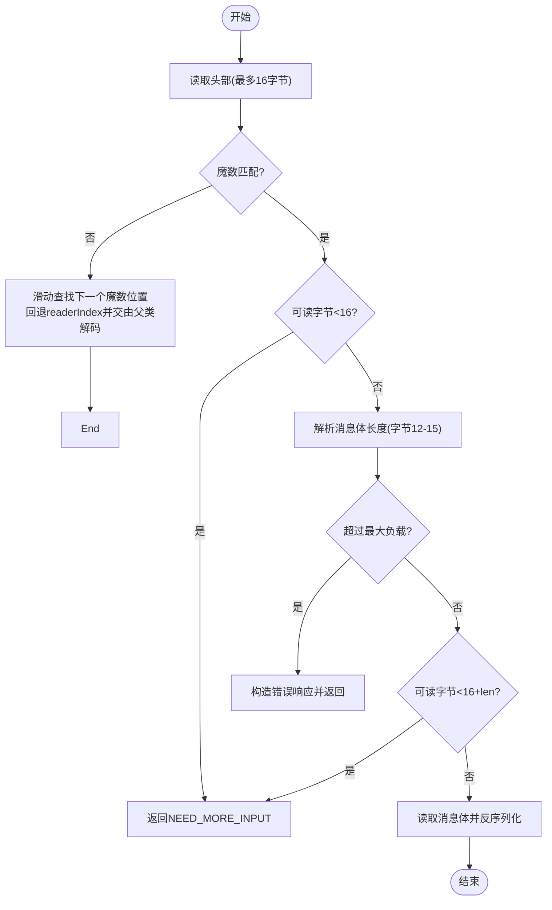
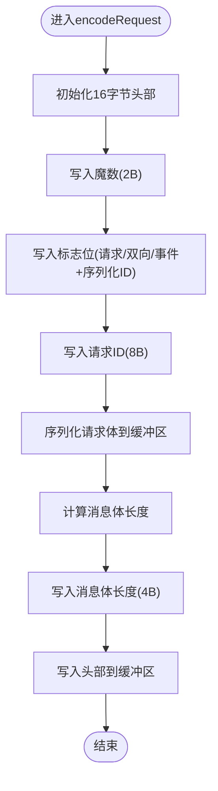
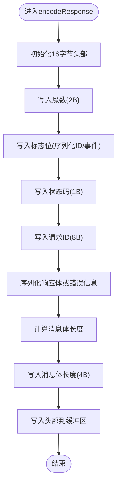
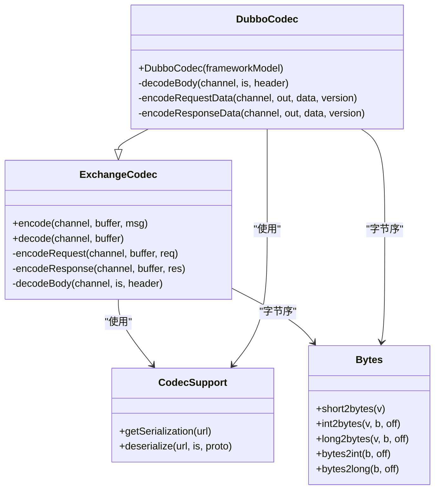
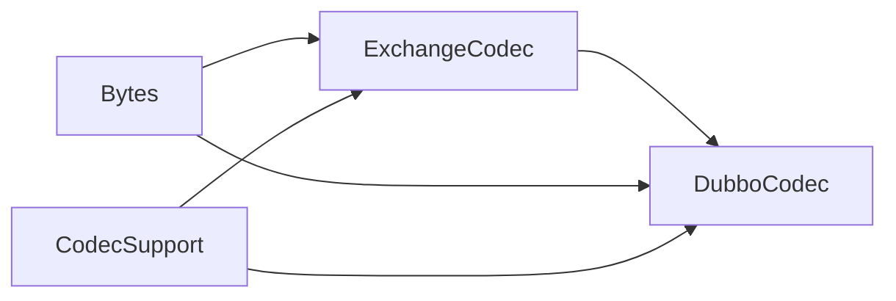

# 消息头结构

<cite>
**本文引用的文件**
- [ExchangeCodec.java](file://dubbo-remoting/dubbo-remoting-api/src/main/java/org/apache/dubbo/remoting/exchange/codec/ExchangeCodec.java)
- [DubboCodec.java](file://dubbo-rpc/dubbo-rpc-dubbo/src/main/java/org/apache/dubbo/rpc/protocol/dubbo/DubboCodec.java)
- [CodecSupport.java](file://dubbo-remoting/dubbo-remoting-api/src/main/java/org/apache/dubbo/remoting/transport/CodecSupport.java)
- [Bytes.java](file://dubbo-common/src/main/java/org/apache/dubbo/common/io/Bytes.java)
- [ExchangeCodecTest.java](file://dubbo-remoting/dubbo-remoting-api/src/test/java/org/apache/dubbo/remoting/codec/ExchangeCodecTest.java)
- [DubboTelnetDecodeTest.java](file://dubbo-rpc/dubbo-rpc-dubbo/src/test/java/org/apache/dubbo/rpc/protocol/dubbo/decode/DubboTelnetDecodeTest.java)
</cite>

## 目录
1. [引言](#引言)
2. [项目结构](#项目结构)
3. [核心组件](#核心组件)
4. [架构总览](#架构总览)
5. [详细组件分析](#详细组件分析)
6. [依赖关系分析](#依赖关系分析)
7. [性能考量](#性能考量)
8. [故障排查指南](#故障排查指南)
9. [结论](#结论)
10. [附录](#附录)

## 引言
本文件围绕 Dubbo 协议的“16 字节固定消息头”进行系统性解析，重点阐述以下字段与行为：
- 魔数（Magic Number）：用于快速识别 Dubbo 协议帧起始，避免与其它协议或噪声数据混淆。
- 序列化类型（Serialization Type）：通过低 5 位标识当前使用的序列化方式（如 Hessian2、JSON、Protobuf 等），并支持动态选择。
- 事件标志（Event Flag）：区分普通调用、心跳事件与异常响应等特殊场景。
- 双向通信标识（Two-way Flag）：控制请求-响应模式，决定是否需要等待响应。
- 消息体长度（Body Length）：用于 TCP 粘包/拆包处理，确保按完整帧边界读取。
- 字节序与位图：明确各字段在 16 字节中的偏移与位域布局，以及大端序写入/读取规则。
- 编解码流程：结合 ExchangeCodec 中的 writeRequestData/readMessageHeader 实现细节，说明读写顺序与错误处理路径。

同时，面向初学者提供消息头位图示意图，面向高级开发者给出优化建议（例如减少不必要的标志位设置以提升解析效率）。

## 项目结构
与消息头直接相关的核心代码位于：
- 协议编解码层：ExchangeCodec（通用交换层）、DubboCodec（Dubbo 协议扩展）
- 序列化支持：CodecSupport（序列化选择与反序列化）
- 字节工具：Bytes（整型/长整型/短整型与字节数组互转，含字节序）



图表来源
- [ExchangeCodec.java](file://dubbo-remoting/dubbo-remoting-api/src/main/java/org/apache/dubbo/remoting/exchange/codec/ExchangeCodec.java#L54-L120)
- [DubboCodec.java](file://dubbo-rpc/dubbo-rpc-dubbo/src/main/java/org/apache/dubbo/rpc/protocol/dubbo/DubboCodec.java#L90-L120)
- [CodecSupport.java](file://dubbo-remoting/dubbo-remoting-api/src/main/java/org/apache/dubbo/remoting/transport/CodecSupport.java#L87-L104)
- [Bytes.java](file://dubbo-common/src/main/java/org/apache/dubbo/common/io/Bytes.java#L98-L209)

章节来源
- [ExchangeCodec.java](file://dubbo-remoting/dubbo-remoting-api/src/main/java/org/apache/dubbo/remoting/exchange/codec/ExchangeCodec.java#L54-L120)
- [DubboCodec.java](file://dubbo-rpc/dubbo-rpc-dubbo/src/main/java/org/apache/dubbo/rpc/protocol/dubbo/DubboCodec.java#L90-L120)
- [CodecSupport.java](file://dubbo-remoting/dubbo-remoting-api/src/main/java/org/apache/dubbo/remoting/transport/CodecSupport.java#L87-L104)
- [Bytes.java](file://dubbo-common/src/main/java/org/apache/dubbo/common/io/Bytes.java#L98-L209)

## 核心组件
- ExchangeCodec：负责 16 字节消息头的读写、魔数校验、长度检查、请求/响应分流、事件与双向标志处理、以及序列化类型掩码解析。
- DubboCodec：在 ExchangeCodec 基础上，针对 Dubbo 协议的请求/响应体进行具体编解码（版本号、接口名、方法签名、参数、附件等）。
- CodecSupport：根据序列化 ID 获取 Serialization 实例，并执行反序列化；提供心跳/事件判定与空对象序列化结果缓存。
- Bytes：提供 short/int/long 与字节数组之间的转换，采用大端序（网络序）。

章节来源
- [ExchangeCodec.java](file://dubbo-remoting/dubbo-remoting-api/src/main/java/org/apache/dubbo/remoting/exchange/codec/ExchangeCodec.java#L54-L120)
- [DubboCodec.java](file://dubbo-rpc/dubbo-rpc-dubbo/src/main/java/org/apache/dubbo/rpc/protocol/dubbo/DubboCodec.java#L90-L120)
- [CodecSupport.java](file://dubbo-remoting/dubbo-remoting-api/src/main/java/org/apache/dubbo/remoting/transport/CodecSupport.java#L87-L104)
- [Bytes.java](file://dubbo-common/src/main/java/org/apache/dubbo/common/io/Bytes.java#L98-L209)

## 架构总览
下图展示 Dubbo 协议消息头在编解码过程中的关键交互与职责划分。



图表来源
- [ExchangeCodec.java](file://dubbo-remoting/dubbo-remoting-api/src/main/java/org/apache/dubbo/remoting/exchange/codec/ExchangeCodec.java#L257-L308)
- [ExchangeCodec.java](file://dubbo-remoting/dubbo-remoting-api/src/main/java/org/apache/dubbo/remoting/exchange/codec/ExchangeCodec.java#L310-L369)
- [DubboCodec.java](file://dubbo-rpc/dubbo-rpc-dubbo/src/main/java/org/apache/dubbo/rpc/protocol/dubbo/DubboCodec.java#L90-L120)
- [CodecSupport.java](file://dubbo-remoting/dubbo-remoting-api/src/main/java/org/apache/dubbo/remoting/transport/CodecSupport.java#L87-L104)

## 详细组件分析

### 消息头字段定义与位图
- 固定长度：16 字节
- 字段布局（从偏移 0 开始）：
  - 0-1：魔数（2 字节，大端序）
  - 2：标志位（1 字节）
    - 位 7：请求/响应标记（1 表示请求，0 表示响应）
    - 位 6：双向通信标记（1 表示双向）
    - 位 5：事件标记（1 表示事件）
    - 位 4-0：序列化类型 ID（低 5 位）
  - 3：状态码（仅响应使用）
  - 4-11：请求 ID（8 字节，大端序）
  - 12-15：消息体长度（4 字节，大端序）

位图示意（二进制位编号从 7 到 0，高位在前）：
```
偏移:  0  1  2        3     4  5  6  7  8  9 10 11 12 13 14 15
内容: 魔数 魔数 标志位 状态码 请求ID(高) 请求ID(低) 消息体长度(高) 消息体长度(低)
位域:  7  6  5  4  3  2  1  0
      请求 双向 事件 序列化ID
```

章节来源
- [ExchangeCodec.java](file://dubbo-remoting/dubbo-remoting-api/src/main/java/org/apache/dubbo/remoting/exchange/codec/ExchangeCodec.java#L59-L74)
- [ExchangeCodecTest.java](file://dubbo-remoting/dubbo-remoting-api/src/test/java/org/apache/dubbo/remoting/codec/ExchangeCodecTest.java#L49-L66)

### 魔数（Magic Number）
- 设计目的：快速识别 Dubbo 协议帧起始，避免与 Telnet、HTTP 或其他协议混淆。
- 写入：编码时将固定值写入字节 0-1。
- 读取：解码时先读取 16 字节头部，若不匹配则尝试滑动窗口查找下一个魔数位置，再回退 readerIndex 并交由父类继续解码。

章节来源
- [ExchangeCodec.java](file://dubbo-remoting/dubbo-remoting-api/src/main/java/org/apache/dubbo/remoting/exchange/codec/ExchangeCodec.java#L95-L112)

### 序列化类型（Serialization Type）
- 作用：通过标志位的低 5 位记录当前使用的序列化方式 ID（如 Hessian2、JSON、Protobuf 等）。
- 选择策略：
  - 请求侧：ExchangeCodec 在编码请求时，将 FLAG_REQUEST 与序列化 ID 组合写入标志位。
  - 响应侧：DubboCodec 在响应中根据请求的 Invocation 或 HeartBeatResponse 的 proto 字段选择对应 Serialization。
- 反序列化：CodecSupport 根据 ID 获取 Serialization 实例并执行反序列化。

章节来源
- [ExchangeCodec.java](file://dubbo-remoting/dubbo-remoting-api/src/main/java/org/apache/dubbo/remoting/exchange/codec/ExchangeCodec.java#L264-L272)
- [ExchangeCodec.java](file://dubbo-remoting/dubbo-remoting-api/src/main/java/org/apache/dubbo/remoting/exchange/codec/ExchangeCodec.java#L318-L322)
- [DubboCodec.java](file://dubbo-rpc/dubbo-rpc-dubbo/src/main/java/org/apache/dubbo/rpc/protocol/dubbo/DubboCodec.java#L330-L347)
- [CodecSupport.java](file://dubbo-remoting/dubbo-remoting-api/src/main/java/org/apache/dubbo/remoting/transport/CodecSupport.java#L87-L104)

### 事件标志（Event Flag）
- 语义：
  - 请求事件：请求体携带事件数据（如只读事件字符串），心跳事件的事件体为空。
  - 响应事件：响应体携带事件数据或错误信息。
- 解析：
  - 解码时通过标志位判断是否为事件；若是事件，使用 CodecSupport 提供的事件反序列化能力。
- 心跳：
  - 心跳请求/响应通过事件标志与空体实现，避免额外开销。

章节来源
- [ExchangeCodec.java](file://dubbo-remoting/dubbo-remoting-api/src/main/java/org/apache/dubbo/remoting/exchange/codec/ExchangeCodec.java#L158-L179)
- [ExchangeCodec.java](file://dubbo-remoting/dubbo-remoting-api/src/main/java/org/apache/dubbo/remoting/exchange/codec/ExchangeCodec.java#L200-L217)
- [DubboCodec.java](file://dubbo-rpc/dubbo-rpc-dubbo/src/main/java/org/apache/dubbo/rpc/protocol/dubbo/DubboCodec.java#L160-L178)

### 双向通信标识（Two-way Flag）
- 语义：指示该请求是否期望响应（双向）。
- 写入：请求编码时根据 Request.isTwoWay() 设置标志位。
- 读取：响应解码时根据标志位设置 Response 的事件/状态；请求解码时设置 Request 的双向属性。

章节来源
- [ExchangeCodec.java](file://dubbo-remoting/dubbo-remoting-api/src/main/java/org/apache/dubbo/remoting/exchange/codec/ExchangeCodec.java#L267-L269)
- [ExchangeCodec.java](file://dubbo-remoting/dubbo-remoting-api/src/main/java/org/apache/dubbo/remoting/exchange/codec/ExchangeCodec.java#L228-L231)

### 消息体长度（Body Length）与 TCP 粘包/拆包
- 写入：编码完成后计算消息体长度，写入字节 12-15（大端序）。
- 读取：
  - 先读取头部，解析长度字段；
  - 若可读字节不足（len + 16），返回 NEED_MORE_INPUT；
  - 限制最大负载，防止内存占用过高；
  - 读取完消息体后，跳过未消费的流数据（避免影响后续帧）。
- 粘包/拆包：通过“固定头部 + 长度字段”的组合，确保每次读取都能准确识别一帧的边界。

章节来源
- [ExchangeCodec.java](file://dubbo-remoting/dubbo-remoting-api/src/main/java/org/apache/dubbo/remoting/exchange/codec/ExchangeCodec.java#L118-L131)
- [ExchangeCodec.java](file://dubbo-remoting/dubbo-remoting-api/src/main/java/org/apache/dubbo/remoting/exchange/codec/ExchangeCodec.java#L300-L307)
- [ExchangeCodec.java](file://dubbo-remoting/dubbo-remoting-api/src/main/java/org/apache/dubbo/remoting/exchange/codec/ExchangeCodec.java#L363-L369)

### 字节序与读写顺序
- 字节序：所有数值字段均采用大端序（网络序）。
- 写入顺序（请求）：
  1) 魔数（2B）
  2) 标志位（1B：请求/双向/事件+序列化ID）
  3) 请求 ID（8B）
  4) 消息体长度（4B）
  5) 消息体（按序列化输出）
- 写入顺序（响应）：
  1) 魔数（2B）
  2) 标志位（1B：序列化ID；心跳事件置事件标志）
  3) 状态码（1B）
  4) 请求 ID（8B）
  5) 消息体长度（4B）
  6) 消息体（按序列化输出）

章节来源
- [ExchangeCodec.java](file://dubbo-remoting/dubbo-remoting-api/src/main/java/org/apache/dubbo/remoting/exchange/codec/ExchangeCodec.java#L257-L308)
- [ExchangeCodec.java](file://dubbo-remoting/dubbo-remoting-api/src/main/java/org/apache/dubbo/remoting/exchange/codec/ExchangeCodec.java#L310-L369)
- [Bytes.java](file://dubbo-common/src/main/java/org/apache/dubbo/common/io/Bytes.java#L98-L209)

### 关键流程图：读取消息头与消息体


图表来源
- [ExchangeCodec.java](file://dubbo-remoting/dubbo-remoting-api/src/main/java/org/apache/dubbo/remoting/exchange/codec/ExchangeCodec.java#L95-L131)
- [ExchangeCodec.java](file://dubbo-remoting/dubbo-remoting-api/src/main/java/org/apache/dubbo/remoting/exchange/codec/ExchangeCodec.java#L540-L560)

### 关键流程图：写入请求数据（writeRequestData）


图表来源
- [ExchangeCodec.java](file://dubbo-remoting/dubbo-remoting-api/src/main/java/org/apache/dubbo/remoting/exchange/codec/ExchangeCodec.java#L257-L308)

### 关键流程图：写入响应数据（encodeResponse）


图表来源
- [ExchangeCodec.java](file://dubbo-remoting/dubbo-remoting-api/src/main/java/org/apache/dubbo/remoting/exchange/codec/ExchangeCodec.java#L310-L369)

### 类关系图：编解码器与序列化支持


图表来源
- [ExchangeCodec.java](file://dubbo-remoting/dubbo-remoting-api/src/main/java/org/apache/dubbo/remoting/exchange/codec/ExchangeCodec.java#L54-L120)
- [DubboCodec.java](file://dubbo-rpc/dubbo-rpc-dubbo/src/main/java/org/apache/dubbo/rpc/protocol/dubbo/DubboCodec.java#L90-L120)
- [CodecSupport.java](file://dubbo-remoting/dubbo-remoting-api/src/main/java/org/apache/dubbo/remoting/transport/CodecSupport.java#L87-L104)
- [Bytes.java](file://dubbo-common/src/main/java/org/apache/dubbo/common/io/Bytes.java#L98-L209)

## 依赖关系分析
- ExchangeCodec 依赖 Bytes 进行字节序转换，依赖 CodecSupport 进行序列化选择与反序列化。
- DubboCodec 扩展 ExchangeCodec，针对 Dubbo 协议的请求/响应体进行定制化编解码，并根据请求/响应上下文选择合适的序列化器。
- 测试用例验证了魔数校验、长度不足、无效序列化 ID、心跳事件、事件大小阈值等关键行为。



图表来源
- [ExchangeCodec.java](file://dubbo-remoting/dubbo-remoting-api/src/main/java/org/apache/dubbo/remoting/exchange/codec/ExchangeCodec.java#L54-L120)
- [DubboCodec.java](file://dubbo-rpc/dubbo-rpc-dubbo/src/main/java/org/apache/dubbo/rpc/protocol/dubbo/DubboCodec.java#L90-L120)
- [CodecSupport.java](file://dubbo-remoting/dubbo-remoting-api/src/main/java/org/apache/dubbo/remoting/transport/CodecSupport.java#L87-L104)
- [Bytes.java](file://dubbo-common/src/main/java/org/apache/dubbo/common/io/Bytes.java#L98-L209)

章节来源
- [ExchangeCodecTest.java](file://dubbo-remoting/dubbo-remoting-api/src/test/java/org/apache/dubbo/remoting/codec/ExchangeCodecTest.java#L134-L177)
- [ExchangeCodecTest.java](file://dubbo-remoting/dubbo-remoting-api/src/test/java/org/apache/dubbo/remoting/codec/ExchangeCodecTest.java#L196-L214)
- [DubboTelnetDecodeTest.java](file://dubbo-rpc/dubbo-rpc-dubbo/src/test/java/org/apache/dubbo/rpc/protocol/dubbo/decode/DubboTelnetDecodeTest.java#L308-L342)

## 性能考量
- 减少不必要的标志位设置：仅在必要时设置事件/双向标志，避免无谓的位运算与分支判断。
- 复用序列化实例：利用 CodecSupport 的空对象序列化结果缓存，降低心跳场景的序列化成本。
- 控制事件体大小：通过配置项限制事件体大小，防止过大事件导致反序列化开销与内存压力。
- 避免多余拷贝：在写入消息体长度时，尽量一次性写出，减少多次写入带来的系统调用次数。
- 粘包/拆包优化：保持固定头部 + 长度字段的模式，配合合理的缓冲区管理，避免频繁扩容与复制。

## 故障排查指南
- 魔数不匹配：当头部不满足魔数时，会尝试滑动查找并回退 readerIndex，最终交由父类处理。检查网络层是否混入非 Dubbo 数据。
- 长度不足：当可读字节小于 16 或小于 16+len 时，返回 NEED_MORE_INPUT。确认上游是否正确拼接帧。
- 负载超限：超过最大负载时，直接构造错误响应返回，避免内存溢出。可通过配置调整最大负载。
- 无效序列化 ID：当序列化 ID 无法识别时，请求会被标记为损坏，响应会返回客户端错误。确认序列化器注册与 ID 映射一致。
- 事件体过大：事件体长度超过阈值将被拒绝，防止安全风险。适当增大阈值或优化事件内容。

章节来源
- [ExchangeCodec.java](file://dubbo-remoting/dubbo-remoting-api/src/main/java/org/apache/dubbo/remoting/exchange/codec/ExchangeCodec.java#L95-L131)
- [ExchangeCodec.java](file://dubbo-remoting/dubbo-remoting-api/src/main/java/org/apache/dubbo/remoting/exchange/codec/ExchangeCodec.java#L540-L560)
- [ExchangeCodecTest.java](file://dubbo-remoting/dubbo-remoting-api/src/test/java/org/apache/dubbo/remoting/codec/ExchangeCodecTest.java#L180-L194)
- [ExchangeCodecTest.java](file://dubbo-remoting/dubbo-remoting-api/src/test/java/org/apache/dubbo/remoting/codec/ExchangeCodecTest.java#L257-L345)

## 结论
Dubbo 协议的 16 字节固定消息头通过魔数、标志位、请求 ID、消息体长度等字段，实现了高效、稳定的 TCP 传输层抽象。其大端序的字节序约定与“固定头部 + 长度字段”的组合，有效解决了粘包/拆包问题；事件与双向标志提供了灵活的语义表达；序列化类型掩码支持多种序列化方式的动态选择。通过合理优化标志位设置、复用序列化实例与限制事件体大小，可在保证兼容性的前提下进一步提升解析效率与安全性。

## 附录
- 位图参考：见“消息头字段定义与位图”
- 读写顺序参考：见“字节序与读写顺序”
- 关键实现参考路径：
  - 魔数与长度检查：[ExchangeCodec.java](file://dubbo-remoting/dubbo-remoting-api/src/main/java/org/apache/dubbo/remoting/exchange/codec/ExchangeCodec.java#L95-L131)
  - 写入请求数据：[ExchangeCodec.java](file://dubbo-remoting/dubbo-remoting-api/src/main/java/org/apache/dubbo/remoting/exchange/codec/ExchangeCodec.java#L257-L308)
  - 写入响应数据：[ExchangeCodec.java](file://dubbo-remoting/dubbo-remoting-api/src/main/java/org/apache/dubbo/remoting/exchange/codec/ExchangeCodec.java#L310-L369)
  - 事件与心跳处理：[ExchangeCodec.java](file://dubbo-remoting/dubbo-remoting-api/src/main/java/org/apache/dubbo/remoting/exchange/codec/ExchangeCodec.java#L152-L232), [DubboCodec.java](file://dubbo-rpc/dubbo-rpc-dubbo/src/main/java/org/apache/dubbo/rpc/protocol/dubbo/DubboCodec.java#L160-L178)
  - 序列化选择与反序列化：[CodecSupport.java](file://dubbo-remoting/dubbo-remoting-api/src/main/java/org/apache/dubbo/remoting/transport/CodecSupport.java#L87-L104)
  - 字节序转换：[Bytes.java](file://dubbo-common/src/main/java/org/apache/dubbo/common/io/Bytes.java#L98-L209)