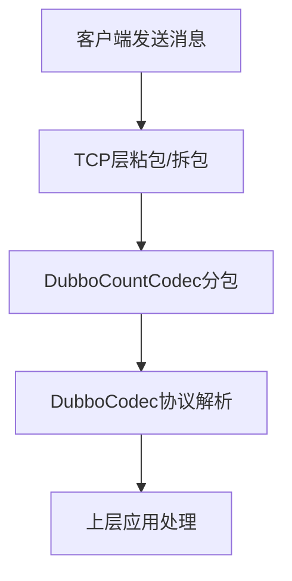
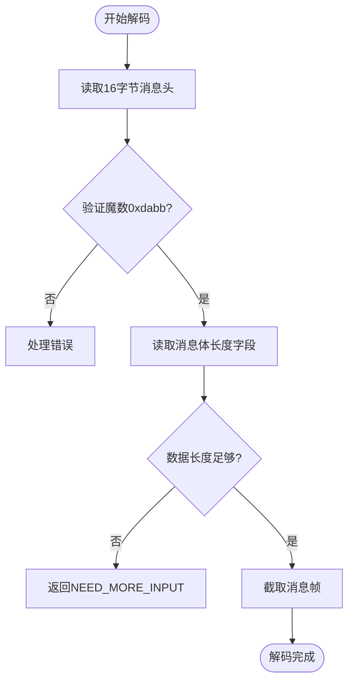
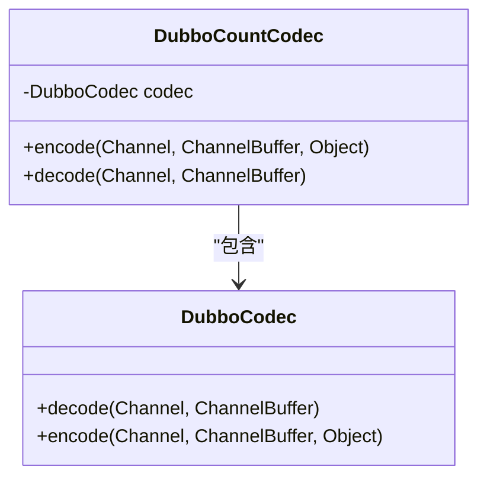
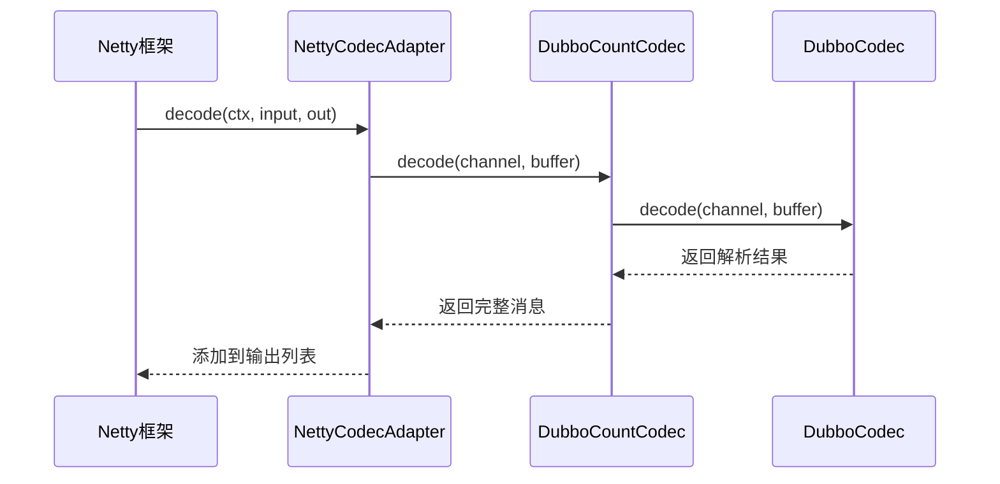
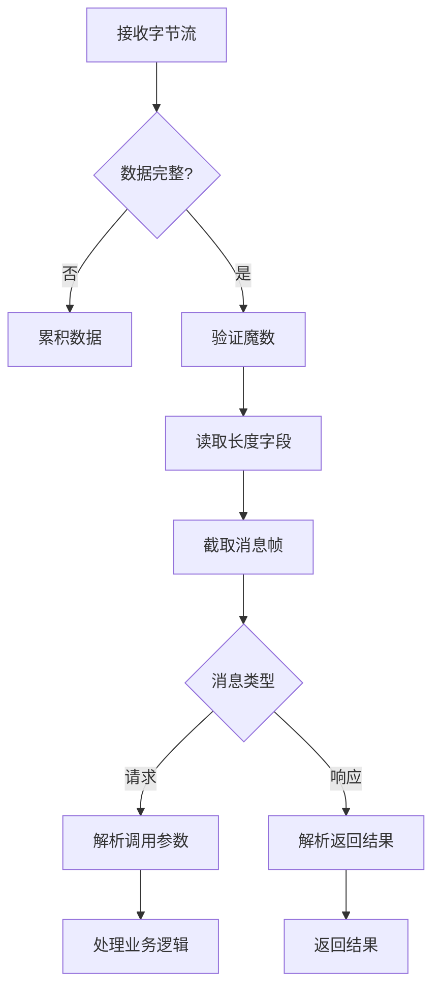

# 粘包与拆包处理

<cite>
**本文档引用文件**   
- [DubboCountCodec.java](file://dubbo-rpc\dubbo-rpc-dubbo\src\main\java\org\apache\dubbo\rpc\protocol\dubbo\DubboCountCodec.java)
- [DubboCodec.java](file://dubbo-rpc\dubbo-rpc-dubbo\src\main\java\org\apache\dubbo\rpc\protocol\dubbo\DubboCodec.java)
- [ExchangeCodec.java](file://dubbo-remoting\dubbo-remoting-api\src\main\java\org\apache\dubbo\remoting\exchange\codec\ExchangeCodec.java)
- [NettyCodecAdapter.java](file://dubbo-remoting\dubbo-remoting-netty4\src\main\java\org\apache\dubbo\remoting\transport\netty4\NettyCodecAdapter.java)
- [DubboCountCodecTest.java](file://dubbo-rpc\dubbo-rpc-dubbo\src\test\java\org\apache\dubbo\rpc\protocol\dubbo\DubboCountCodecTest.java)
</cite>

## 目录
1. [引言](#引言)
2. [Dubbo协议粘包与拆包问题概述](#dubbo协议粘包与拆包问题概述)
3. [DubboCountCodec核心机制分析](#dubbocountcodec核心机制分析)
4. [DubboCountCodec与DubboCodec协作关系](#dubbocountcodec与dubbocodec协作关系)
5. [Netty ChannelPipeline中的编解码器执行流程](#netty-channelpipeline中的编解码器执行流程)
6. [消息分帧与协议解析流程](#消息分帧与协议解析流程)
7. [调试方法与性能优化建议](#调试方法与性能优化建议)
8. [总结](#总结)

## 引言

在分布式服务通信中，TCP协议作为底层传输协议存在粘包与拆包问题。Dubbo框架通过精心设计的编解码机制有效解决了这一问题。本文深入分析Dubbo协议如何通过DubboCountCodec编解码器解决TCP传输中的粘包与拆包问题，重点探讨其基于长度字段的分包机制、与DubboCodec的协作关系以及在Netty通信链路中的执行流程。

## Dubbo协议粘包与拆包问题概述

TCP协议是面向字节流的可靠传输协议，不保证消息边界。在高并发场景下，多个小消息可能被合并为一个TCP包（粘包），或一个大消息被拆分为多个TCP包（拆包）。Dubbo协议通过在消息头中定义长度字段来解决这一问题。

Dubbo协议消息格式包含16字节固定头部，其中第12-15字节为消息体长度字段。该设计使得接收方能够根据长度字段准确截取完整的消息帧，确保上层应用接收到完整且独立的协议消息。

**图示来源**
- [ExchangeCodec.java](file://dubbo-remoting\dubbo-remoting-api\src\main\java\org\apache\dubbo\remoting\exchange\codec\ExchangeCodec.java#L60-L64)

## DubboCountCodec核心机制分析

DubboCountCodec是Dubbo协议的核心编解码器，实现了基于长度字段的分包机制。它继承了Netty的解码器模式，通过读取消息头中的长度字段来确定消息边界。

在解码过程中，DubboCountCodec首先读取16字节消息头，验证魔数（Magic Number）0xdabb，然后从第12字节处读取4字节的消息体长度。根据该长度值，从字节流中截取指定长度的消息体，形成完整的消息帧。

当接收到的数据不足以构成完整消息头或消息体时，DubboCountCodec返回NEED_MORE_INPUT，指示Netty继续累积数据。这种机制确保了即使在数据被拆分的情况下，也能正确重组完整消息。

**图示来源**
- [ExchangeCodec.java](file://dubbo-remoting\dubbo-remoting-api\src\main\java\org\apache\dubbo\remoting\exchange\codec\ExchangeCodec.java#L95-L135)

**本节来源**
- [DubboCountCodec.java](file://dubbo-rpc\dubbo-rpc-dubbo\src\main\java\org\apache\dubbo\rpc\protocol\dubbo\DubboCountCodec.java#L54-L76)
- [ExchangeCodec.java](file://dubbo-remoting\dubbo-remoting-api\src\main\java\org\apache\dubbo\remoting\exchange\codec\ExchangeCodec.java#L95-L135)

## DubboCountCodec与DubboCodec协作关系

DubboCountCodec与DubboCodec形成了清晰的职责分离：前者负责消息分帧，后者负责协议解析。这种设计遵循了单一职责原则，提高了代码的可维护性和可扩展性。

DubboCountCodec内部持有一个DubboCodec实例，在完成消息分帧后，将完整的消息帧委托给DubboCodec进行协议解析。这种组合模式使得分包逻辑与协议解析逻辑解耦，便于独立演进。

当处理多消息（MultiMessage）时，DubboCountCodec会循环调用DubboCodec进行编码，确保每个消息都能被正确分帧和解析。这种设计支持了批量消息传输的场景，提高了通信效率。

**图示来源**
- [DubboCountCodec.java](file://dubbo-rpc\dubbo-rpc-dubbo\src\main\java\org\apache\dubbo\rpc\protocol\dubbo\DubboCountCodec.java#L36-L40)
- [DubboCodec.java](file://dubbo-rpc\dubbo-rpc-dubbo\src\main\java\org\apache\dubbo\rpc\protocol\dubbo\DubboCodec.java#L61)

**本节来源**
- [DubboCountCodec.java](file://dubbo-rpc\dubbo-rpc-dubbo\src\main\java\org\apache\dubbo\rpc\protocol\dubbo\DubboCountCodec.java#L36-L52)
- [DubboCodec.java](file://dubbo-rpc\dubbo-rpc-dubbo\src\main\java\org\apache\dubbo\rpc\protocol\dubbo\DubboCodec.java#L61)

## Netty ChannelPipeline中的编解码器执行流程

在Netty的ChannelPipeline中，Dubbo编解码器以适配器模式集成。NettyCodecAdapter将Dubbo的编解码接口转换为Netty的ChannelHandler，实现了与Netty框架的无缝集成。

在解码阶段，Netty的ByteToMessageDecoder调用DubboCountCodec的decode方法。当返回NEED_MORE_INPUT时，Netty会继续累积数据；当获得完整消息时，将其添加到输出列表中，供后续处理器使用。

编码过程则相反，MessageToByteEncoder将消息委托给DubboCountCodec进行编码，最终写入ByteBuf。这种设计充分利用了Netty的高性能IO能力，同时保持了Dubbo协议的独立性。

**图示来源**
- [NettyCodecAdapter.java](file://dubbo-remoting\dubbo-remoting-netty4\src\main\java\org\apache\dubbo\remoting\transport\netty4\NettyCodecAdapter.java#L91-L117)

**本节来源**
- [NettyCodecAdapter.java](file://dubbo-remoting\dubbo-remoting-netty4\src\main\java\org\apache\dubbo\remoting\transport\netty4\NettyCodecAdapter.java#L91-L123)

## 消息分帧与协议解析流程

Dubbo的消息处理流程分为两个关键阶段：分帧和解析。分帧阶段由DubboCountCodec完成，负责从字节流中识别和截取完整的消息帧；解析阶段由DubboCodec完成，负责将字节流反序列化为具体的请求或响应对象。

在分帧阶段，系统首先验证消息头的魔数，确保数据的正确性。然后读取长度字段，根据长度值判断是否需要更多数据。只有当获得完整消息时，才会进行下一步的协议解析。

协议解析阶段根据消息类型（请求或响应）调用相应的处理逻辑。对于请求消息，会反序列化调用参数；对于响应消息，会反序列化返回结果。整个过程通过异常处理机制确保了系统的健壮性。

**本节来源**
- [ExchangeCodec.java](file://dubbo-remoting\dubbo-remoting-api\src\main\java\org\apache\dubbo\remoting\exchange\codec\ExchangeCodec.java#L95-L200)
- [DubboCodec.java](file://dubbo-rpc\dubbo-rpc-dubbo\src\main\java\org\apache\dubbo\rpc\protocol\dubbo\DubboCodec.java#L92-L228)

## 调试方法与性能优化建议

在调试粘包问题时，可以通过启用Dubbo的调试日志来观察消息的分帧过程。重点关注NEED_MORE_INPUT的返回情况，这有助于理解数据累积的行为。

性能优化方面，建议合理设置Netty的接收缓冲区大小，避免频繁的内存分配。同时，可以通过调整序列化方式来优化消息体大小，减少网络传输开销。

对于高并发场景，可以考虑启用批量消息（MultiMessage）功能，将多个小消息合并传输，减少网络往返次数。此外，监控消息长度分布，设置合理的最大消息大小限制，可以有效防止内存溢出。

在开发测试中，可以使用DubboCountCodecTest中的测试用例作为参考，验证自定义编解码器的正确性。通过模拟各种边界情况，确保编解码器的健壮性。

**本节来源**
- [DubboCountCodecTest.java](file://dubbo-rpc\dubbo-rpc-dubbo\src\test\java\org\apache\dubbo\rpc\protocol\dubbo\DubboCountCodecTest.java#L43-L91)
- [ExchangeCodec.java](file://dubbo-remoting\dubbo-remoting-api\src\main\java\org\apache\dubbo\remoting\exchange\codec\ExchangeCodec.java#L120-L131)

## 总结

Dubbo通过DubboCountCodec实现了高效的粘包与拆包处理机制。该机制基于消息头中的长度字段，结合Netty的流式处理能力，确保了消息的完整性和独立性。DubboCountCodec与DubboCodec的职责分离设计，既保证了分包的准确性，又保持了协议解析的灵活性。

通过深入理解这一机制，开发者可以更好地掌握Dubbo的通信原理，有效解决实际应用中的网络传输问题，并进行针对性的性能优化。