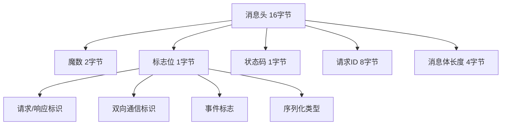
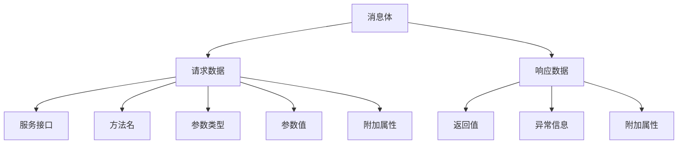
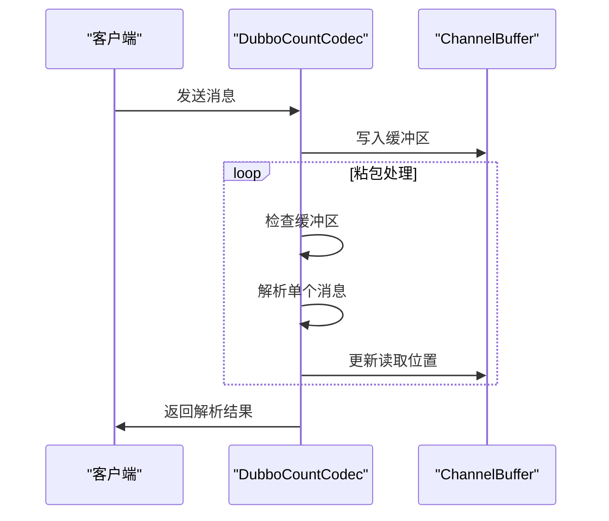
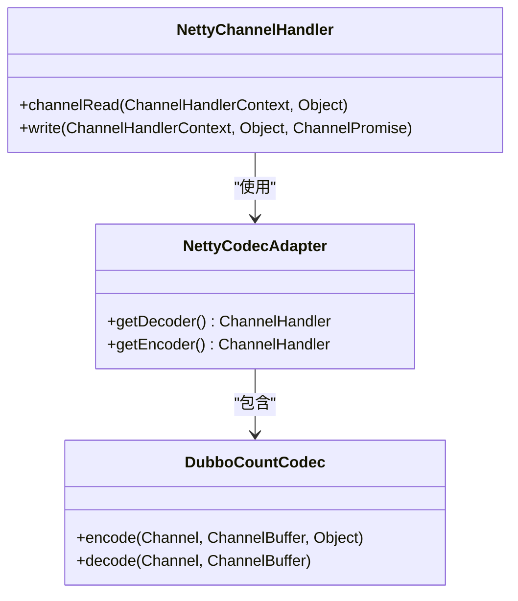
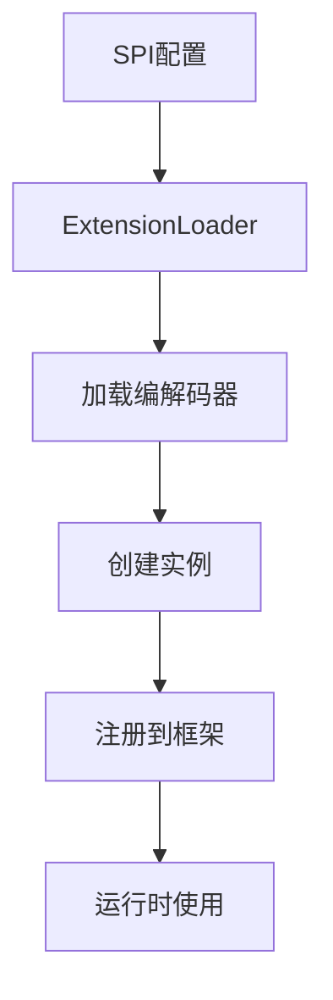

# 编解码机制

<cite>
**本文档引用文件**   
- [DubboCountCodec.java](file://dubbo-rpc\dubbo-rpc-dubbo\src\main\java\org\apache\dubbo\rpc\protocol\dubbo\DubboCountCodec.java)
- [DubboCodec.java](file://dubbo-rpc\dubbo-rpc-dubbo\src\main\java\org\apache\dubbo\rpc\protocol\dubbo\DubboCodec.java)
- [ExchangeCodec.java](file://dubbo-remoting\dubbo-remoting-api\src\main\java\org\apache\dubbo\remoting\exchange\codec\ExchangeCodec.java)
- [Codec2.java](file://dubbo-remoting\dubbo-remoting-api\src\main\java\org\apache\dubbo\remoting\Codec2.java)
- [Constants.java](file://dubbo-serialization\dubbo-serialization-api\src\main\java\org\apache\dubbo\common\serialize\Constants.java)
- [NettyCodecAdapter.java](file://dubbo-remoting\dubbo-remoting-netty4\src\main\java\org\apache\dubbo\remoting\transport\netty4\NettyCodecAdapter.java)
- [org.apache.dubbo.remoting.Codec2](file://dubbo-rpc\dubbo-rpc-dubbo\src\main\resources\META-INF\dubbo\internal\org.apache.dubbo.remoting.Codec2)
</cite>

## 目录
1. [引言](#引言)
2. [消息头结构](#消息头结构)
3. [消息体编码规则](#消息体编码规则)
4. [粘包/拆包处理](#粘包拆包处理)
5. [与Netty框架的协同工作](#与netty框架的协同工作)
6. [自定义编解码器扩展](#自定义编解码器扩展)
7. [性能优化建议](#性能优化建议)
8. [可视化示意图](#可视化示意图)
9. [结论](#结论)

## 引言
Dubbo协议基于TCP的二进制消息格式设计，通过高效的编解码机制实现高性能的远程过程调用。该协议采用16字节固定长度的消息头，包含魔数、序列化类型、事件标志等关键字段，确保消息的正确解析和传输。Dubbo通过DubboCountCodec和DubboCodec等核心组件实现消息的编码和解码，并与Netty框架深度集成，提供可靠的网络通信能力。本文将深入解析Dubbo协议的编解码机制，为开发者提供全面的技术指导。

**本文档引用文件**   
- [DubboCountCodec.java](file://dubbo-rpc\dubbo-rpc-dubbo\src\main\java\org\apache\dubbo\rpc\protocol\dubbo\DubboCountCodec.java)
- [DubboCodec.java](file://dubbo-rpc\dubbo-rpc-dubbo\src\main\java\org\apache\dubbo\rpc\protocol\dubbo\DubboCodec.java)

## 消息头结构
Dubbo协议的消息头采用16字节固定长度设计，包含以下关键字段：

- **魔数（Magic Number）**：2字节，固定值为0xdabb，用于标识Dubbo协议
- **序列化类型（Serialization Type）**：5位，表示消息体的序列化方式
- **事件标志（Event Flag）**：1位，标识是否为事件消息
- **双向通信标识（Two-way Flag）**：1位，标识是否需要响应
- **请求/响应标识（Request/Response Flag）**：1位，标识消息类型
- **状态码（Status Code）**：1字节，表示响应状态
- **请求ID（Request ID）**：8字节，用于匹配请求和响应
- **消息体长度（Body Length）**：4字节，表示消息体的字节长度

**图示来源**
- [ExchangeCodec.java](file://dubbo-remoting\dubbo-remoting-api\src\main\java\org\apache\dubbo\remoting\exchange\codec\ExchangeCodec.java#L60-L69)

## 消息体编码规则
Dubbo协议的消息体编码遵循严格的规则，确保数据的正确序列化和反序列化：

- **请求消息体**：包含服务接口名、方法名、参数类型、参数值和附加属性
- **响应消息体**：包含返回值、异常信息和附加属性
- **序列化方式**：支持多种序列化协议，如Hessian2、JSON、Protobuf等
- **参数编码**：基本类型直接编码，复杂类型递归编码
- **附件编码**：以键值对形式编码，支持字符串和字节数组

**图示来源**
- [DubboCodec.java](file://dubbo-rpc\dubbo-rpc-dubbo\src\main\java\org\apache\dubbo\rpc\protocol\dubbo\DubboCodec.java#L269-L301)
- [Constants.java](file://dubbo-serialization\dubbo-serialization-api\src\main\java\org\apache\dubbo\common\serialize\Constants.java#L19-L40)

## 粘包/拆包处理
Dubbo通过DubboCountCodec实现粘包和拆包处理，确保消息的完整性和正确性：

- **粘包处理**：当多个消息被合并传输时，逐个解析每个消息
- **拆包处理**：当一个消息被分割传输时，等待完整数据到达后再解析
- **多消息支持**：通过MultiMessage类支持批量消息处理
- **缓冲区管理**：使用ChannelBuffer管理输入输出缓冲区

**图示来源**
- [DubboCountCodec.java](file://dubbo-rpc\dubbo-rpc-dubbo\src\main\java\org\apache\dubbo\rpc\protocol\dubbo\DubboCountCodec.java#L54-L75)

## 与Netty框架的协同工作
Dubbo通过NettyCodecAdapter与Netty框架集成，实现高效的网络通信：

- **编解码适配**：将Dubbo编解码器适配为Netty的ChannelHandler
- **事件循环**：利用Netty的EventLoop处理I/O事件
- **线程模型**：支持在I/O线程或业务线程中解码数据
- **缓冲区管理**：使用Netty的ByteBuf进行高效内存管理

**图示来源**
- [NettyCodecAdapter.java](file://dubbo-remoting\dubbo-remoting-netty4\src\main\java\org\apache\dubbo\remoting\transport\netty4\NettyCodecAdapter.java)
- [DubboCountCodec.java](file://dubbo-rpc\dubbo-rpc-dubbo\src\main\java\org\apache\dubbo\rpc\protocol\dubbo\DubboCountCodec.java)

## 自定义编解码器扩展
Dubbo通过SPI机制支持自定义编解码器的扩展：

- **SPI配置**：在META-INF/dubbo/internal/org.apache.dubbo.remoting.Codec2中配置
- **接口实现**：实现Codec2接口并重写encode和decode方法
- **扩展点加载**：通过ExtensionLoader加载自定义编解码器
- **运行时替换**：在运行时动态替换默认编解码器

**图示来源**
- [org.apache.dubbo.remoting.Codec2](file://dubbo-rpc\dubbo-rpc-dubbo\src\main\resources\META-INF\dubbo\internal\org.apache.dubbo.remoting.Codec2)
- [Codec2.java](file://dubbo-remoting\dubbo-remoting-api\src\main\java\org\apache\dubbo\remoting\Codec2.java)

## 性能优化建议
为提高Dubbo协议的性能，建议采取以下优化措施：

- **选择高效的序列化方式**：优先使用Hessian2或Protobuf等高效序列化协议
- **减少消息体大小**：避免传输不必要的数据，压缩大对象
- **合理设置线程模型**：根据业务特点选择合适的解码线程模型
- **优化网络参数**：调整TCP缓冲区大小和连接超时时间
- **监控和调优**：使用Dubbo的监控功能进行性能分析和调优

## 可视化示意图

**图示来源**
- [整体架构](file://)

## 结论
Dubbo协议的编解码机制通过精心设计的消息格式和高效的实现，为分布式系统提供了可靠的通信基础。通过深入理解16字节消息头的结构、消息体的编码规则以及与Netty框架的协同工作方式，开发者可以更好地利用Dubbo的强大功能。同时，通过SPI机制扩展自定义编解码器和实施性能优化建议，可以进一步提升系统的性能和可维护性。