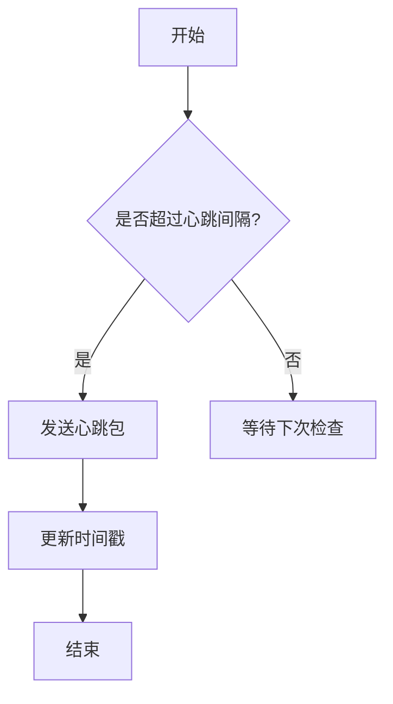
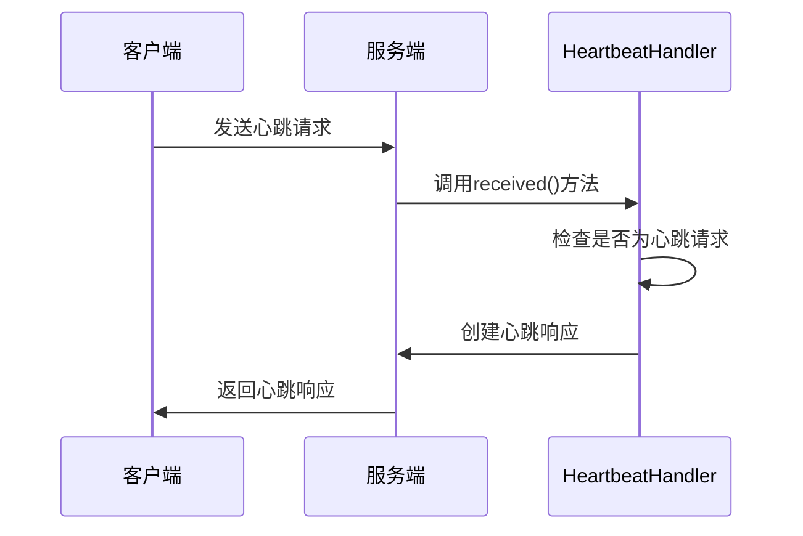
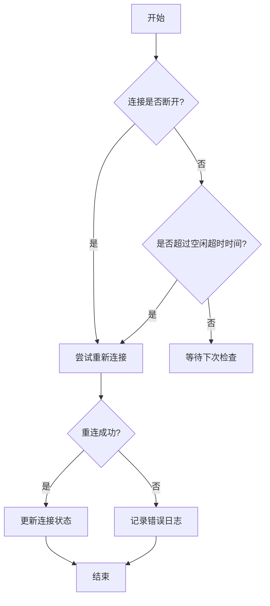

# 心跳检测

<cite>
**本文档引用的文件**
- [ReconnectTimerTask.java](file://dubbo-remoting\dubbo-remoting-api\src\main\java\org\apache\dubbo\remoting\exchange\support\header\ReconnectTimerTask.java)
- [HeartbeatHandler.java](file://dubbo-remoting\dubbo-remoting-api\src\main\java\org\apache\dubbo\remoting\exchange\support\header\HeartbeatHandler.java)
- [Constants.java](file://dubbo-remoting\dubbo-remoting-api\src\main\java\org\apache\dubbo\remoting\Constants.java)
- [HeaderExchangeClient.java](file://dubbo-remoting\dubbo-remoting-api\src\main\java\org\apache\dubbo\remoting\exchange\support\header\HeaderExchangeClient.java)
- [HeartbeatTimerTask.java](file://dubbo-remoting\dubbo-remoting-api\src\main\java\org\apache\dubbo\remoting\exchange\support\header\HeartbeatTimerTask.java)
- [UrlUtils.java](file://dubbo-remoting\dubbo-remoting-api\src\main\java\org\apache\dubbo\remoting\utils\UrlUtils.java)
</cite>

## 目录
1. [心跳检测机制概述](#心跳检测机制概述)
2. [心跳包发送频率与超时时间配置](#心跳包发送频率与超时时间配置)
3. [服务端与客户端心跳处理逻辑](#服务端与客户端心跳处理逻辑)
4. [重连机制与ReconnectTimerTask](#重连机制与ReconnectTimerTask)
5. [心跳检测失败的常见原因与解决方案](#心跳检测失败的常见原因与解决方案)
6. [生产环境中的心跳机制实践](#生产环境中的心跳机制实践)

## 心跳检测机制概述

Dubbo协议的心跳检测机制是确保长连接环境下服务可用性的关键组件。该机制通过定期发送心跳包来检测连接的活跃性，及时发现并处理网络中断或服务宕机的情况。心跳检测基于Netty的HashedWheelTimer时间轮算法实现，通过定时任务检查通道的读写时间戳，当超过指定时间未收到数据时，触发心跳或重连操作。

心跳机制的核心目标是在长连接环境下维持连接的健康状态，避免因网络抖动或服务异常导致的连接中断。Dubbo通过在客户端和服务端双向检测连接状态，确保任何一方出现异常都能及时发现并采取相应措施。

**本节来源**
- [Constants.java](file://dubbo-remoting\dubbo-remoting-api\src\main\java\org\apache\dubbo\remoting\Constants.java#L55-L60)
- [HeartbeatHandler.java](file://dubbo-remoting\dubbo-remoting-api\src\main\java\org\apache\dubbo\remoting\exchange\support\header\HeartbeatHandler.java#L1-L35)

## 心跳包发送频率与超时时间配置

Dubbo心跳机制的发送频率和超时时间通过URL参数进行配置，主要涉及两个关键参数：`heartbeat`和`heartbeat.timeout`。`heartbeat`参数定义了心跳包的发送间隔，默认值为60000毫秒（60秒），而`heartbeat.timeout`参数定义了心跳超时时间，用于判断连接是否应该关闭。

在`Constants.java`文件中，定义了心跳相关的常量：
```java
String HEARTBEAT_KEY = "heartbeat";
int DEFAULT_HEARTBEAT = 60 * 1000;
String HEARTBEAT_TIMEOUT_KEY = "heartbeat.timeout";
```

心跳超时时间的计算遵循特定规则：超时时间必须至少是心跳间隔的两倍，以确保在网络延迟的情况下不会误判连接失效。这一规则在`UrlUtils.getIdleTimeout()`方法中实现，当配置的超时时间小于心跳间隔的两倍时，会抛出`IllegalStateException`异常。

心跳检测的检查频率由`HEARTBEAT_CHECK_TICK`常量控制，其值为3，表示每3个时间单位检查一次是否需要发送心跳包。这种设计避免了过于频繁的检查带来的性能开销，同时保证了检测的及时性。



**本节来源**
- [Constants.java](file://dubbo-remoting\dubbo-remoting-api\src\main\java\org\apache\dubbo\remoting\Constants.java#L156-L158)
- [UrlUtils.java](file://dubbo-remoting\dubbo-remoting-api\src\main\java\org\apache\dubbo\remoting\utils\UrlUtils.java#L62-L69)
- [HeartbeatTimerTask.java](file://dubbo-remoting\dubbo-remoting-api\src\main\java\org\apache\dubbo\remoting\exchange\support\header\HeartbeatTimerTask.java#L33-L39)

## 服务端与客户端心跳处理逻辑

Dubbo的心跳处理逻辑在服务端和客户端有不同的实现方式。服务端主要负责接收心跳请求并返回响应，而客户端则负责发送心跳请求并处理超时情况。

在服务端，`HeartbeatHandler`类负责处理心跳请求。当接收到心跳请求时，服务端会立即返回一个心跳响应，表明服务仍然存活。`HeartbeatHandler`通过`isHeartbeatRequest()`方法识别心跳请求，并通过`received()`方法处理。处理过程中，会更新通道的读取时间戳，确保连接不会因长时间无数据传输而被关闭。



在客户端，心跳机制通过`HeartbeatTimerTask`定时任务实现。该任务定期检查通道的最后读写时间，当发现超过心跳间隔未进行数据传输时，会主动发送心跳包。`HeartbeatTimerTask`的`doTask()`方法实现了这一逻辑，通过比较当前时间与最后读写时间戳的差值来决定是否需要发送心跳。

客户端还实现了连接状态的检测逻辑。在`HeaderExchangeClient.isConnected()`方法中，通过检查最后读取时间戳与当前时间的差值是否超过空闲超时时间来判断连接是否仍然有效。这种设计确保了客户端能够及时发现连接异常并采取相应措施。

**本节来源**
- [HeartbeatHandler.java](file://dubbo-remoting\dubbo-remoting-api\src\main\java\org\apache\dubbo\remoting\exchange\support\header\HeartbeatHandler.java#L66-L92)
- [HeartbeatTimerTask.java](file://dubbo-remoting\dubbo-remoting-api\src\main\java\org\apache\dubbo\remoting\exchange\support\header\HeartbeatTimerTask.java#L42-L70)
- [HeaderExchangeClient.java](file://dubbo-remoting\dubbo-remoting-api\src\main\java\org\apache\dubbo\remoting\exchange\support\header\HeaderExchangeClient.java#L118-L128)

## 重连机制与ReconnectTimerTask

Dubbo的重连机制通过`ReconnectTimerTask`类实现，该类负责在连接断开或心跳超时时尝试重新建立连接。`ReconnectTimerTask`继承自`AbstractTimerTask`，利用HashedWheelTimer时间轮算法定期检查连接状态。

`ReconnectTimerTask`的核心逻辑在`doTask()`方法中实现。该方法首先检查通道是否已断开连接，如果是，则尝试重新连接。如果连接仍然存在但长时间未收到数据（超过空闲超时时间），则认为连接已失效，触发重连操作。这种设计确保了在网络抖动或服务短暂不可用的情况下，客户端能够自动恢复连接。



`ReconnectTimerTask`的构造函数接收四个参数：通道提供者、时间轮、心跳超时tick和空闲超时时间。其中，空闲超时时间通过`idleTimeout`字段保存，并在`doTask()`方法中用于判断是否需要重连。这种设计使得重连机制能够灵活适应不同的网络环境和业务需求。

值得注意的是，Dubbo文档中提到的`DubboCountDownLatchedReconnectTimerTask`在当前代码库中并未找到相关实现。实际的重连功能由`ReconnectTimerTask`类完成，该类通过定期检查连接状态并尝试重连来确保服务的可用性。

**本节来源**
- [ReconnectTimerTask.java](file://dubbo-remoting\dubbo-remoting-api\src\main\java\org\apache\dubbo\remoting\exchange\support\header\ReconnectTimerTask.java#L34-L81)
- [HeaderExchangeClient.java](file://dubbo-remoting\dubbo-remoting-api\src\main\java\org\apache\dubbo\remoting\exchange\support\header\HeaderExchangeClient.java#L221-L230)

## 心跳检测失败的常见原因与解决方案

心跳检测失败可能由多种原因引起，包括网络问题、配置不当、系统资源不足等。了解这些常见原因及其解决方案对于维护系统的稳定性至关重要。

最常见的原因是网络问题，如网络延迟、丢包或防火墙拦截。当网络延迟超过心跳超时时间时，即使服务正常运行，也会被误判为不可用。解决方案是适当增加`heartbeat.timeout`的值，使其能够容忍正常的网络波动。

配置不当是另一个常见原因。如果`heartbeat`和`heartbeat.timeout`的配置不合理，可能导致频繁的心跳检测或过早的连接关闭。根据Dubbo的规则，`heartbeat.timeout`必须至少是`heartbeat`的两倍，否则会抛出异常。正确的配置方法是在URL中明确指定这两个参数，例如：`dubbo://127.0.0.1:20880?heartbeat=30000&heartbeat.timeout=60000`。

系统资源不足也可能导致心跳检测失败。当服务器CPU或内存资源紧张时，可能无法及时处理心跳请求，导致超时。解决方案包括优化系统性能、增加资源或调整心跳频率以减轻系统负担。

此外，时钟不同步问题也可能影响心跳检测的准确性。由于心跳机制依赖于时间戳比较，如果客户端和服务端的系统时钟存在较大偏差，可能导致错误的连接状态判断。确保所有节点的时钟同步是避免此类问题的关键。

**本节来源**
- [UrlUtils.java](file://dubbo-remoting\dubbo-remoting-api\src\main\java\org\apache\dubbo\remoting\utils\UrlUtils.java#L62-L69)
- [Constants.java](file://dubbo-remoting\dubbo-remoting-api\src\main\java\org\apache\dubbo\remoting\Constants.java#L157-L158)
- [ReconnectTimerTask.java](file://dubbo-remoting\dubbo-remoting-api\src\main\java\org\apache\dubbo\remoting\exchange\support\header\ReconnectTimerTask.java#L59-L65)

## 生产环境中的心跳机制实践

在生产环境中，合理配置和使用心跳机制对于确保服务的高可用性至关重要。实际案例表明，恰当的心跳配置能够显著提高系统的稳定性和容错能力。

一个典型的生产环境配置示例是将心跳间隔设置为30秒，超时时间设置为60秒。这种配置在保证及时发现连接异常的同时，避免了过于频繁的心跳检测带来的网络开销。对于网络环境较差的场景，可以适当增加超时时间至90秒或更长，以容忍更大的网络延迟。

在微服务架构中，心跳机制的重要性更加突出。当某个服务实例因故障下线时，通过心跳检测能够快速发现并从负载均衡列表中移除该实例，避免请求被路由到不可用的服务。同时，当服务恢复后，心跳机制能够自动检测到并重新将其加入可用实例列表。

监控和告警是生产环境中不可或缺的环节。建议将心跳状态纳入监控系统，当出现频繁重连或心跳超时的情况时，及时发出告警。这有助于运维人员快速发现潜在的网络或服务问题，采取预防性措施。

最佳实践还包括定期审查和优化心跳配置。随着业务发展和网络环境变化，原有的配置可能不再适用。通过持续监控和分析心跳数据，可以不断优化配置参数，确保系统在各种情况下都能保持最佳性能。

**本节来源**
- [HeaderExchangeClient.java](file://dubbo-remoting\dubbo-remoting-api\src\main\java\org\apache\dubbo\remoting\exchange\support\header\HeaderExchangeClient.java#L71-L75)
- [Constants.java](file://dubbo-remoting\dubbo-remoting-api\src\main\java\org\apache\dubbo\remoting\Constants.java#L156-L158)
- [UrlUtils.java](file://dubbo-remoting\dubbo-remoting-api\src\main\java\org\apache\dubbo\remoting\utils\UrlUtils.java#L72-L84)