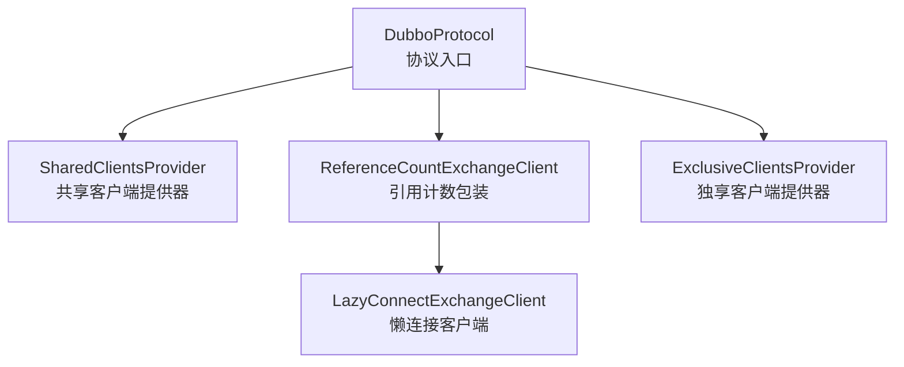
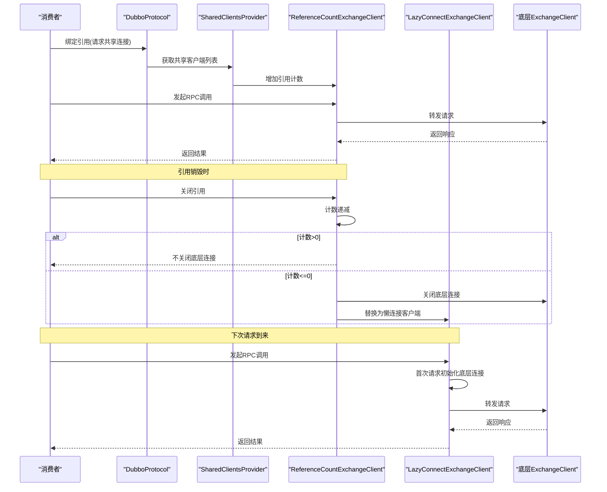
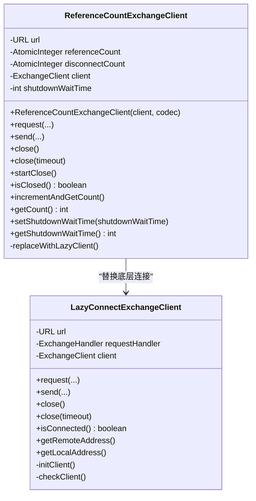
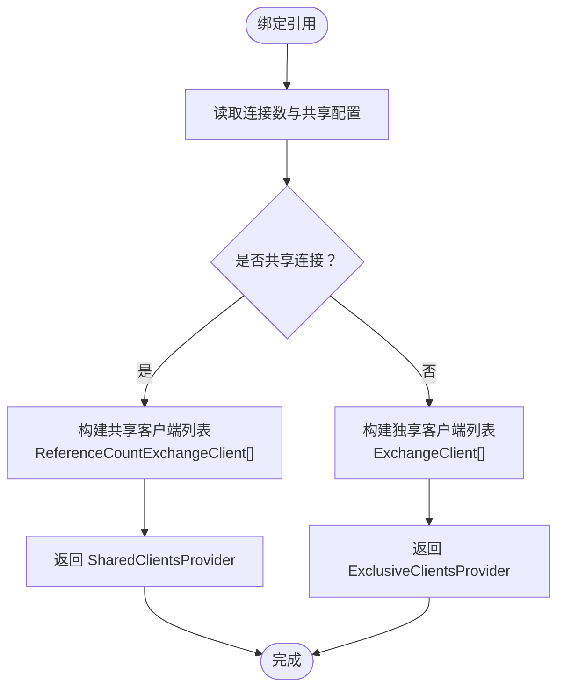
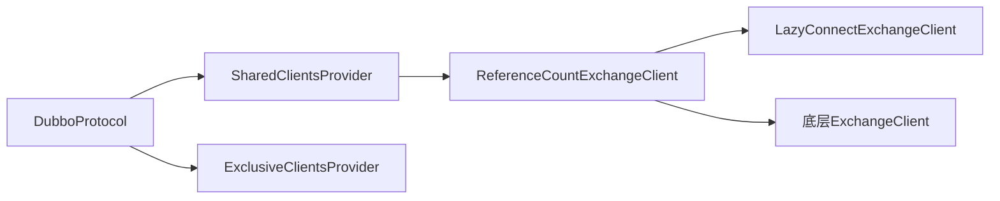

# 连接复用

<cite>
**本文引用的文件**
- [ReferenceCountExchangeClient.java](file://dubbo-rpc/dubbo-rpc-dubbo/src/main/java/org/apache/dubbo/rpc/protocol/dubbo/ReferenceCountExchangeClient.java)
- [DubboProtocol.java](file://dubbo-rpc/dubbo-rpc-dubbo/src/main/java/org/apache/dubbo/rpc/protocol/dubbo/DubboProtocol.java)
- [SharedClientsProvider.java](file://dubbo-rpc/dubbo-rpc-dubbo/src/main/java/org/apache/dubbo/rpc/protocol/dubbo/SharedClientsProvider.java)
- [LazyConnectExchangeClient.java](file://dubbo-rpc/dubbo-rpc-dubbo/src/main/java/org/apache/dubbo/rpc/protocol/dubbo/LazyConnectExchangeClient.java)
- [ReferenceCountExchangeClientTest.java](file://dubbo-rpc/dubbo-rpc-dubbo/src/test/java/org/apache/dubbo/rpc/protocol/dubbo/ReferenceCountExchangeClientTest.java)
- [ClientsProvider.java](file://dubbo-rpc/dubbo-rpc-dubbo/src/main/java/org/apache/dubbo/rpc/protocol/dubbo/ClientsProvider.java)
</cite>

## 目录
1. [简介](#简介)
2. [项目结构](#项目结构)
3. [核心组件](#核心组件)
4. [架构总览](#架构总览)
5. [详细组件分析](#详细组件分析)
6. [依赖关系分析](#依赖关系分析)
7. [性能考量](#性能考量)
8. [故障排查指南](#故障排查指南)
9. [结论](#结论)
10. [附录](#附录)

## 简介
本文件围绕 Dubbo 协议中的“连接复用”机制展开，重点解释 ReferenceCountExchangeClient 如何通过引用计数实现多个服务引用共享同一个物理连接；阐述在多接口引用同一服务提供者时，连接复用如何降低系统资源消耗与网络开销；梳理连接复用的生命周期管理（创建、引用计数增减、最终关闭触发条件）；给出实际代码路径示例以展示工作流程；并说明在何种场景下连接复用可能失效，最后提供最佳实践与调试建议。

## 项目结构
与连接复用直接相关的核心代码位于 dubbo-rpc-dubbo 模块：
- ReferenceCountExchangeClient：对底层 ExchangeClient 的包装，负责引用计数与懒连接替换。
- DubboProtocol：协议入口，决定是否共享连接、构建客户端列表、销毁阶段关闭共享客户端。
- SharedClientsProvider：共享客户端提供器，负责批量增加引用计数、关闭共享客户端、移除不可用共享客户端。
- LazyConnectExchangeClient：懒连接客户端，按需建立物理连接并在请求时初始化。
- ClientsProvider 接口：统一客户端提供器抽象。
- ReferenceCountExchangeClientTest：覆盖多连接共享、计数异常处理等场景。

图表来源
- [DubboProtocol.java](file://dubbo-rpc/dubbo-rpc-dubbo/src/main/java/org/apache/dubbo/rpc/protocol/dubbo/DubboProtocol.java#L440-L546)
- [SharedClientsProvider.java](file://dubbo-rpc/dubbo-rpc-dubbo/src/main/java/org/apache/dubbo/rpc/protocol/dubbo/SharedClientsProvider.java#L29-L135)
- [ReferenceCountExchangeClient.java](file://dubbo-rpc/dubbo-rpc-dubbo/src/main/java/org/apache/dubbo/rpc/protocol/dubbo/ReferenceCountExchangeClient.java#L39-L226)
- [LazyConnectExchangeClient.java](file://dubbo-rpc/dubbo-rpc-dubbo/src/main/java/org/apache/dubbo/rpc/protocol/dubbo/LazyConnectExchangeClient.java#L48-L279)

章节来源
- [DubboProtocol.java](file://dubbo-rpc/dubbo-rpc-dubbo/src/main/java/org/apache/dubbo/rpc/protocol/dubbo/DubboProtocol.java#L440-L546)
- [SharedClientsProvider.java](file://dubbo-rpc/dubbo-rpc-dubbo/src/main/java/org/apache/dubbo/rpc/protocol/dubbo/SharedClientsProvider.java#L29-L135)
- [ReferenceCountExchangeClient.java](file://dubbo-rpc/dubbo-rpc-dubbo/src/main/java/org/apache/dubbo/rpc/protocol/dubbo/ReferenceCountExchangeClient.java#L39-L226)
- [LazyConnectExchangeClient.java](file://dubbo-rpc/dubbo-rpc-dubbo/src/main/java/org/apache/dubbo/rpc/protocol/dubbo/LazyConnectExchangeClient.java#L48-L279)

## 核心组件
- ReferenceCountExchangeClient：持有底层 ExchangeClient，维护引用计数；当计数归零时关闭底层连接并替换为 LazyConnectExchangeClient，以便后续请求“复活”。
- DubboProtocol：根据配置决定是否共享连接；构建共享客户端列表；在协议销毁阶段强制关闭共享客户端。
- SharedClientsProvider：封装共享客户端集合，支持批量增加引用计数、关闭共享客户端、检测可用性并调度移除。
- LazyConnectExchangeClient：按需建立物理连接，首次请求前保持“已连接”状态以避免误重连；请求时初始化底层连接。
- ClientsProvider：客户端提供器接口，区分共享与独享两种模式。

章节来源
- [ReferenceCountExchangeClient.java](file://dubbo-rpc/dubbo-rpc-dubbo/src/main/java/org/apache/dubbo/rpc/protocol/dubbo/ReferenceCountExchangeClient.java#L39-L226)
- [DubboProtocol.java](file://dubbo-rpc/dubbo-rpc-dubbo/src/main/java/org/apache/dubbo/rpc/protocol/dubbo/DubboProtocol.java#L440-L546)
- [SharedClientsProvider.java](file://dubbo-rpc/dubbo-rpc-dubbo/src/main/java/org/apache/dubbo/rpc/protocol/dubbo/SharedClientsProvider.java#L29-L135)
- [LazyConnectExchangeClient.java](file://dubbo-rpc/dubbo-rpc-dubbo/src/main/java/org/apache/dubbo/rpc/protocol/dubbo/LazyConnectExchangeClient.java#L48-L279)
- [ClientsProvider.java](file://dubbo-rpc/dubbo-rpc-dubbo/src/main/java/org/apache/dubbo/rpc/protocol/dubbo/ClientsProvider.java#L1-L27)

## 架构总览
连接复用的整体流程如下：
- 消费端在绑定引用时，DubboProtocol 根据配置选择共享连接或独享连接。
- 共享连接模式下，DubboProtocol 构建一组 ReferenceCountExchangeClient，每个都包装一个底层 ExchangeClient。
- 多个服务引用共享同一组 ReferenceCountExchangeClient，通过 SharedClientsProvider 批量增加引用计数。
- 当某个引用销毁时，对应 ReferenceCountExchangeClient 的引用计数递减；当计数归零时，关闭底层连接并替换为 LazyConnectExchangeClient。
- 后续请求再次到来时，LazyConnectExchangeClient 初始化底层连接，恢复通信。

图表来源
- [DubboProtocol.java](file://dubbo-rpc/dubbo-rpc-dubbo/src/main/java/org/apache/dubbo/rpc/protocol/dubbo/DubboProtocol.java#L440-L546)
- [SharedClientsProvider.java](file://dubbo-rpc/dubbo-rpc-dubbo/src/main/java/org/apache/dubbo/rpc/protocol/dubbo/SharedClientsProvider.java#L48-L106)
- [ReferenceCountExchangeClient.java](file://dubbo-rpc/dubbo-rpc-dubbo/src/main/java/org/apache/dubbo/rpc/protocol/dubbo/ReferenceCountExchangeClient.java#L155-L201)
- [LazyConnectExchangeClient.java](file://dubbo-rpc/dubbo-rpc-dubbo/src/main/java/org/apache/dubbo/rpc/protocol/dubbo/LazyConnectExchangeClient.java#L80-L120)

## 详细组件分析

### ReferenceCountExchangeClient：引用计数与懒连接替换
- 引用计数：构造时计数+1；每次共享使用时由 SharedClientsProvider 批量+1；每次销毁时递减；当计数<=0时关闭底层连接并替换为 LazyConnectExchangeClient。
- 懒连接替换：replaceWithLazyClient 将底层 client 替换为 LazyConnectExchangeClient，避免空闲连接占用资源；后续请求会触发 LazyConnectExchangeClient 初始化底层连接。
- 生命周期：close(timeout) 支持超时参数；startClose 触发底层开始关闭；isClosed 反映当前状态。

图表来源
- [ReferenceCountExchangeClient.java](file://dubbo-rpc/dubbo-rpc-dubbo/src/main/java/org/apache/dubbo/rpc/protocol/dubbo/ReferenceCountExchangeClient.java#L39-L226)
- [LazyConnectExchangeClient.java](file://dubbo-rpc/dubbo-rpc-dubbo/src/main/java/org/apache/dubbo/rpc/protocol/dubbo/LazyConnectExchangeClient.java#L48-L279)

章节来源
- [ReferenceCountExchangeClient.java](file://dubbo-rpc/dubbo-rpc-dubbo/src/main/java/org/apache/dubbo/rpc/protocol/dubbo/ReferenceCountExchangeClient.java#L50-L201)

### DubboProtocol：共享连接决策与客户端构建
- 共享连接决策：根据 URL 中的连接数参数与共享连接配置，决定是否共享连接；默认共享，可配置独享。
- 客户端构建：构建 ReferenceCountExchangeClient 列表；设置关闭等待时间；按需创建懒连接客户端。
- 销毁阶段：协议销毁时遍历并强制关闭所有共享客户端，确保资源回收。

图表来源
- [DubboProtocol.java](file://dubbo-rpc/dubbo-rpc-dubbo/src/main/java/org/apache/dubbo/rpc/protocol/dubbo/DubboProtocol.java#L440-L546)

章节来源
- [DubboProtocol.java](file://dubbo-rpc/dubbo-rpc-dubbo/src/main/java/org/apache/dubbo/rpc/protocol/dubbo/DubboProtocol.java#L440-L546)

### SharedClientsProvider：批量引用计数与可用性检查
- 批量增加引用计数：当共享客户端可用时，对所有客户端执行引用计数+1。
- 关闭策略：逐个关闭共享客户端；若全部不可用，则调度移除该共享客户端。
- 可用性检查：任一客户端为 null、计数<=0 或已关闭则判定不可用。

章节来源
- [SharedClientsProvider.java](file://dubbo-rpc/dubbo-rpc-dubbo/src/main/java/org/apache/dubbo/rpc/protocol/dubbo/SharedClientsProvider.java#L48-L106)

### LazyConnectExchangeClient：按需建立物理连接
- 首次请求初始化：首次请求时通过 Exchangers.connect 建立底层连接；后续请求直接复用。
- 连接状态：在未建立连接前，isConnected 返回 true 以避免误重连；必要时可快速失败。
- 关闭行为：close/close(timeout) 会关闭底层连接并将 client 置空，下次请求再初始化。

章节来源
- [LazyConnectExchangeClient.java](file://dubbo-rpc/dubbo-rpc-dubbo/src/main/java/org/apache/dubbo/rpc/protocol/dubbo/LazyConnectExchangeClient.java#L80-L213)

### 测试用例：多接口共享同一物理连接
- 多共享连接测试：两个不同服务接口共享相同数量的连接，断言客户端列表相等且本地地址一致。
- 多次销毁测试：重复销毁不会错误地警告；引用计数异常仍能成功调用。
- 计数异常与复活：多次关闭后，LazyConnectExchangeClient 会在请求时“复活”，并按周期输出警告日志。

章节来源
- [ReferenceCountExchangeClientTest.java](file://dubbo-rpc/dubbo-rpc-dubbo/src/test/java/org/apache/dubbo/rpc/protocol/dubbo/ReferenceCountExchangeClientTest.java#L90-L131)
- [ReferenceCountExchangeClientTest.java](file://dubbo-rpc/dubbo-rpc-dubbo/src/test/java/org/apache/dubbo/rpc/protocol/dubbo/ReferenceCountExchangeClientTest.java#L134-L213)

## 依赖关系分析
- ReferenceCountExchangeClient 实现 ExchangeClient，委托底层 ExchangeClient 执行网络操作；内部维护引用计数与懒连接替换逻辑。
- SharedClientsProvider 依赖 ReferenceCountExchangeClient 列表，负责批量引用计数与关闭。
- DubboProtocol 在绑定引用时选择 ClientsProvider 实现（共享或独享），并在销毁阶段强制关闭共享客户端。
- LazyConnectExchangeClient 作为懒连接实现，被 ReferenceCountExchangeClient 在计数归零时替换。

图表来源
- [DubboProtocol.java](file://dubbo-rpc/dubbo-rpc-dubbo/src/main/java/org/apache/dubbo/rpc/protocol/dubbo/DubboProtocol.java#L440-L546)
- [SharedClientsProvider.java](file://dubbo-rpc/dubbo-rpc-dubbo/src/main/java/org/apache/dubbo/rpc/protocol/dubbo/SharedClientsProvider.java#L29-L135)
- [ReferenceCountExchangeClient.java](file://dubbo-rpc/dubbo-rpc-dubbo/src/main/java/org/apache/dubbo/rpc/protocol/dubbo/ReferenceCountExchangeClient.java#L39-L226)
- [LazyConnectExchangeClient.java](file://dubbo-rpc/dubbo-rpc-dubbo/src/main/java/org/apache/dubbo/rpc/protocol/dubbo/LazyConnectExchangeClient.java#L48-L279)

章节来源
- [ClientsProvider.java](file://dubbo-rpc/dubbo-rpc-dubbo/src/main/java/org/apache/dubbo/rpc/protocol/dubbo/ClientsProvider.java#L1-L27)
- [DubboProtocol.java](file://dubbo-rpc/dubbo-rpc-dubbo/src/main/java/org/apache/dubbo/rpc/protocol/dubbo/DubboProtocol.java#L440-L546)

## 性能考量
- 减少连接数：共享连接显著降低 TCP 连接数与内核资源占用，减少握手与心跳开销。
- 懒连接优化：未使用的连接不占用资源；首次请求才建立物理连接，缩短空闲期。
- 引用计数保护：避免过早关闭仍在使用的连接，提升稳定性。
- 关闭等待：通过 shutdownWaitTime 控制优雅关闭等待时间，平衡吞吐与资源回收。

[本节为通用指导，无需列出具体文件来源]

## 故障排查指南
- 连接未复用
  - 检查 URL 是否显式设置独享连接数参数；默认共享，需确认未覆盖。
  - 参考路径：[DubboProtocol.java](file://dubbo-rpc/dubbo-rpc-dubbo/src/main/java/org/apache/dubbo/rpc/protocol/dubbo/DubboProtocol.java#L440-L546)
- 多次销毁导致计数异常
  - 使用测试用例验证：重复销毁不应产生错误告警；若出现异常，检查引用计数逻辑。
  - 参考路径：[ReferenceCountExchangeClientTest.java](file://dubbo-rpc/dubbo-rpc-dubbo/src/test/java/org/apache/dubbo/rpc/protocol/dubbo/ReferenceCountExchangeClientTest.java#L134-L172)
- 连接被提前关闭
  - 检查 SharedClientsProvider 的可用性检查逻辑；任一客户端不可用将触发移除。
  - 参考路径：[SharedClientsProvider.java](file://dubbo-rpc/dubbo-rpc-dubbo/src/main/java/org/apache/dubbo/rpc/protocol/dubbo/SharedClientsProvider.java#L82-L92)
- 懒连接复活与告警
  - LazyConnectExchangeClient 在请求时初始化底层连接；按周期输出告警日志，提示不应调用懒连接客户端。
  - 参考路径：[LazyConnectExchangeClient.java](file://dubbo-rpc/dubbo-rpc-dubbo/src/main/java/org/apache/dubbo/rpc/protocol/dubbo/LazyConnectExchangeClient.java#L130-L145)
- 调试验证
  - 通过测试用例断言共享连接数量与客户端列表一致性，验证多接口共享同一物理连接。
  - 参考路径：[ReferenceCountExchangeClientTest.java](file://dubbo-rpc/dubbo-rpc-dubbo/src/test/java/org/apache/dubbo/rpc/protocol/dubbo/ReferenceCountExchangeClientTest.java#L110-L131)

章节来源
- [ReferenceCountExchangeClientTest.java](file://dubbo-rpc/dubbo-rpc-dubbo/src/test/java/org/apache/dubbo/rpc/protocol/dubbo/ReferenceCountExchangeClientTest.java#L90-L131)
- [SharedClientsProvider.java](file://dubbo-rpc/dubbo-rpc-dubbo/src/main/java/org/apache/dubbo/rpc/protocol/dubbo/SharedClientsProvider.java#L82-L92)
- [LazyConnectExchangeClient.java](file://dubbo-rpc/dubbo-rpc-dubbo/src/main/java/org/apache/dubbo/rpc/protocol/dubbo/LazyConnectExchangeClient.java#L130-L145)

## 结论
Dubbo 的连接复用通过 ReferenceCountExchangeClient 的引用计数与 LazyConnectExchangeClient 的懒连接机制，实现了多服务引用共享同一物理连接的目标。该机制在多接口引用同一服务提供者时显著降低系统资源消耗与网络开销。生命周期管理清晰：创建时计数+1，使用时批量+1，销毁时递减，计数归零触发关闭并替换为懒连接；协议销毁阶段强制关闭共享客户端，确保资源回收。在正确配置与使用下，连接复用稳定可靠；若出现异常，可通过测试用例与日志进行定位。

[本节为总结性内容，无需列出具体文件来源]

## 附录
- 最佳实践
  - 默认启用共享连接，除非有特殊需求。
  - 合理设置共享连接数量，避免过多连接导致上下文切换与内存占用。
  - 关注 LazyConnectExchangeClient 的告警日志，避免在非预期路径上直接使用懒连接客户端。
  - 在高并发场景下，结合优雅关闭等待时间与心跳参数，平衡吞吐与稳定性。
- 关键代码路径参考
  - 共享连接决策与构建：[DubboProtocol.java](file://dubbo-rpc/dubbo-rpc-dubbo/src/main/java/org/apache/dubbo/rpc/protocol/dubbo/DubboProtocol.java#L440-L546)
  - 批量引用计数与关闭：[SharedClientsProvider.java](file://dubbo-rpc/dubbo-rpc-dubbo/src/main/java/org/apache/dubbo/rpc/protocol/dubbo/SharedClientsProvider.java#L48-L106)
  - 引用计数与懒连接替换：[ReferenceCountExchangeClient.java](file://dubbo-rpc/dubbo-rpc-dubbo/src/main/java/org/apache/dubbo/rpc/protocol/dubbo/ReferenceCountExchangeClient.java#L155-L201)
  - 懒连接初始化与复活：[LazyConnectExchangeClient.java](file://dubbo-rpc/dubbo-rpc-dubbo/src/main/java/org/apache/dubbo/rpc/protocol/dubbo/LazyConnectExchangeClient.java#L80-L120)
  - 多接口共享连接测试：[ReferenceCountExchangeClientTest.java](file://dubbo-rpc/dubbo-rpc-dubbo/src/test/java/org/apache/dubbo/rpc/protocol/dubbo/ReferenceCountExchangeClientTest.java#L110-L131)