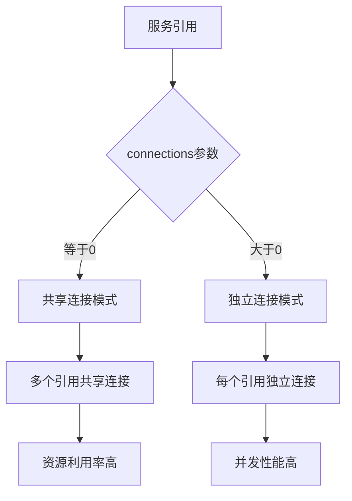
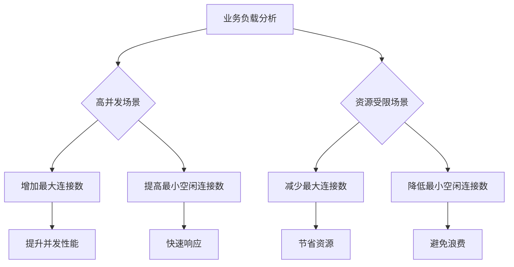
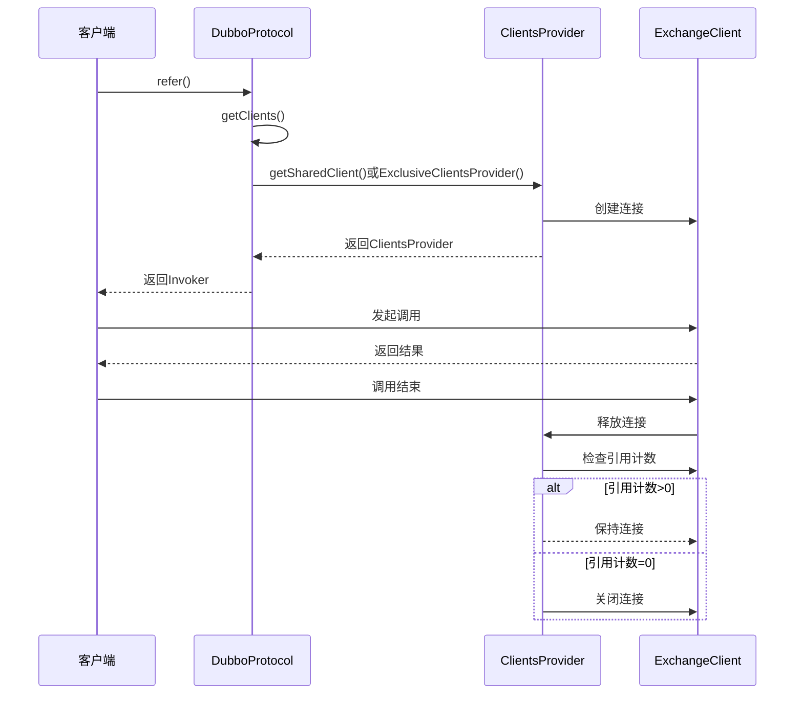
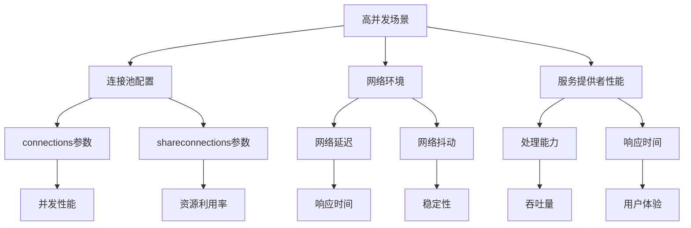
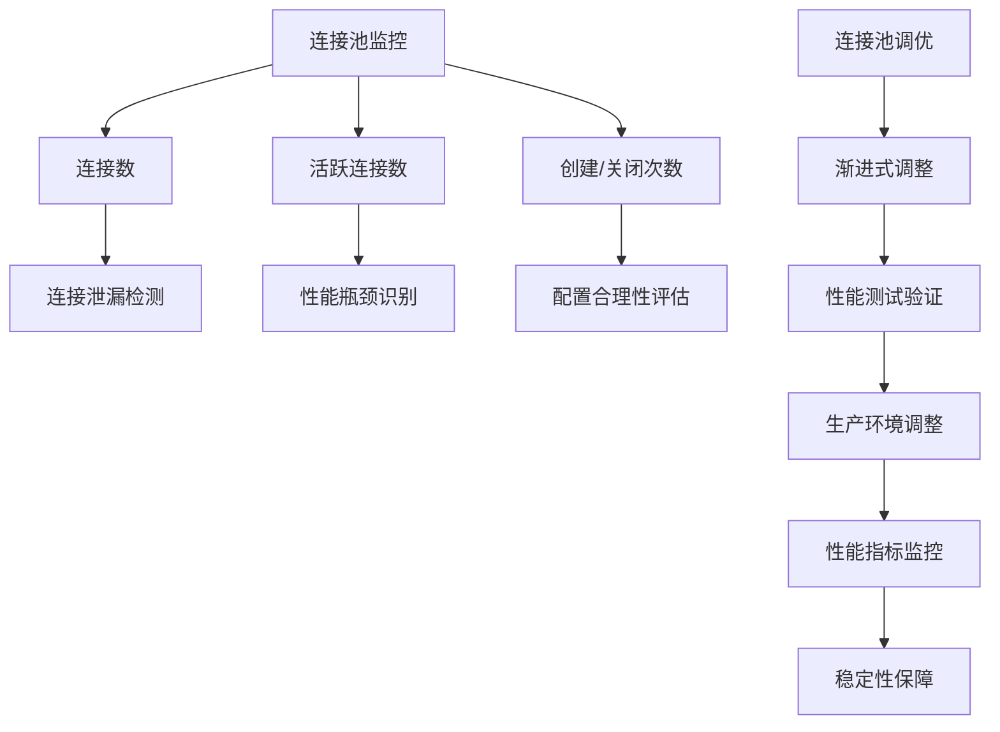
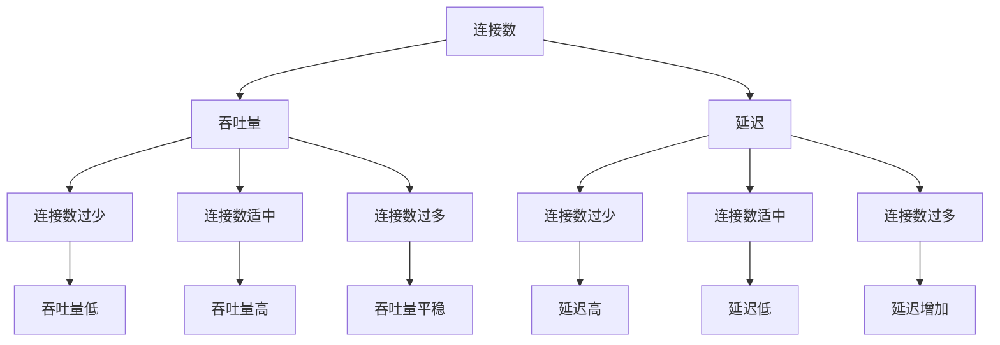

# 连接池管理

<cite>
**本文档引用的文件**   
- [DubboProtocol.java](file://dubbo-rpc\dubbo-rpc-dubbo\src\main\java\org\apache\dubbo\rpc\protocol\dubbo\DubboProtocol.java)
- [Reference.java](file://dubbo-common\src\main\java\org\apache\dubbo\config\annotation\Reference.java)
- [DubboReference.java](file://dubbo-common\src\main\java\org\apache\dubbo\config\annotation\DubboReference.java)
- [SharedClientsProvider.java](file://dubbo-rpc\dubbo-rpc-dubbo\src\main\java\org\apache\dubbo\rpc\protocol\dubbo\SharedClientsProvider.java)
- [ExclusiveClientsProvider.java](file://dubbo-rpc\dubbo-rpc-dubbo\src\main\java\org\apache\dubbo\rpc\protocol\dubbo\ExclusiveClientsProvider.java)
- [ReferenceCountExchangeClient.java](file://dubbo-rpc\dubbo-rpc-dubbo\src\main\java\org\apache\dubbo\rpc\protocol\dubbo\ReferenceCountExchangeClient.java)
- [MultiplexProtocolConnectionManager.java](file://dubbo-remoting\dubbo-remoting-api\src\main\java\org\apache\dubbo\remoting\api\connection\MultiplexProtocolConnectionManager.java)
- [SingleProtocolConnectionManager.java](file://dubbo-remoting\dubbo-remoting-api\src\main\java\org\apache\dubbo\remoting\api\connection\SingleProtocolConnectionManager.java)
</cite>

## 目录
1. [连接池管理机制概述](#连接池管理机制概述)
2. [connections参数配置详解](#connections参数配置详解)
3. [连接池配置参数及其性能影响](#连接池配置参数及其性能影响)
4. [连接池的创建、获取、释放与回收](#连接池的创建获取释放与回收)
5. [高并发场景下的性能表现](#高并发场景下的性能表现)
6. [连接池监控与调优技巧](#连接池监控与调优技巧)
7. [性能测试数据分析](#性能测试数据分析)

## 连接池管理机制概述

Dubbo协议的连接池管理机制是其高性能RPC通信的核心组件之一。该机制通过连接池复用TCP连接，有效减少了频繁建立和断开连接带来的性能开销。Dubbo的连接池管理主要由`DubboProtocol`类实现，该类负责管理与服务提供者的连接。

连接池管理机制的核心是`referenceClientMap`，这是一个以服务地址为键的并发映射表，存储了`SharedClientsProvider`实例。每个`SharedClientsProvider`管理一组共享的连接客户端，实现了连接的复用。当多个服务引用指向同一个服务提供者时，它们可以共享同一组连接，从而减少系统资源消耗。

连接池管理器通过`MultiplexProtocolConnectionManager`和`SingleProtocolConnectionManager`两个组件实现。`MultiplexProtocolConnectionManager`支持多协议连接管理，而`SingleProtocolConnectionManager`则专注于单一协议的连接管理。这种设计使得Dubbo能够灵活应对不同的网络环境和协议需求。

**Section sources**
- [DubboProtocol.java](file://dubbo-rpc\dubbo-rpc-dubbo\src\main\java\org\apache\dubbo\rpc\protocol\dubbo\DubboProtocol.java#L106-L108)
- [MultiplexProtocolConnectionManager.java](file://dubbo-remoting\dubbo-remoting-api\src\main\java\org\apache\dubbo\remoting\api\connection\MultiplexProtocolConnectionManager.java#L28-L56)
- [SingleProtocolConnectionManager.java](file://dubbo-remoting\dubbo-remoting-api\src\main\java\org\apache\dubbo\remoting\api\connection\SingleProtocolConnectionManager.java#L30-L82)

## connections参数配置详解

`connections`参数是Dubbo连接池管理中的关键配置，用于控制单个服务提供者的连接数。该参数可以在`@Reference`或`@DubboReference`注解中进行配置，其默认值为-1，表示使用共享连接模式。

当`connections`参数设置为0时，表示使用共享连接模式，多个服务引用可以共享同一组连接。这种模式适用于大多数场景，能够有效减少系统资源消耗。当`connections`参数设置为大于0的值时，表示为每个服务引用创建指定数量的独立连接。这种模式适用于需要更高并发性能的场景，但会增加系统资源消耗。

在多个服务引用的情况下，连接池的总体管理策略取决于`connections`参数的配置。如果所有服务引用都使用共享连接模式，则它们将共享同一组连接。如果部分服务引用使用独立连接模式，则这些引用将拥有自己的连接池，与其他引用隔离。

**Diagram sources **
- [DubboProtocol.java](file://dubbo-rpc\dubbo-rpc-dubbo\src\main\java\org\apache\dubbo\rpc\protocol\dubbo\DubboProtocol.java#L452-L471)
- [Reference.java](file://dubbo-common\src\main\java\org\apache\dubbo\config\annotation\Reference.java#L138-L138)
- [DubboReference.java](file://dubbo-common\src\main\java\org\apache\dubbo\config\annotation\DubboReference.java#L179-L179)

**Section sources**
- [DubboProtocol.java](file://dubbo-rpc\dubbo-rpc-dubbo\src\main\java\org\apache\dubbo\rpc\protocol\dubbo\DubboProtocol.java#L452-L471)
- [Reference.java](file://dubbo-common\src\main\java\org\apache\dubbo\config\annotation\Reference.java#L138-L138)
- [DubboReference.java](file://dubbo-common\src\main\java\org\apache\dubbo\config\annotation\DubboReference.java#L179-L179)

## 连接池配置参数及其性能影响

Dubbo连接池的配置参数对系统性能有重要影响。除了`connections`参数外，还有`shareconnections`参数用于控制共享连接的数量。这些参数的合理配置能够显著提升系统的吞吐量和响应速度。

最大连接数配置直接影响系统的并发处理能力。过小的最大连接数会导致连接瓶颈，限制系统的并发性能；过大的最大连接数则会消耗过多系统资源，可能导致系统不稳定。最小空闲连接数的配置则影响系统的响应速度和资源利用率。适当的最小空闲连接数可以确保系统在高负载时快速响应，同时避免资源浪费。

根据业务负载进行合理配置是优化系统性能的关键。对于高并发、低延迟的业务场景，建议适当增加最大连接数，确保系统有足够的并发处理能力。对于资源受限的环境，则需要在性能和资源消耗之间找到平衡点，合理设置连接池参数。

**Diagram sources **
- [DubboProtocol.java](file://dubbo-rpc\dubbo-rpc-dubbo\src\main\java\org\apache\dubbo\rpc\protocol\dubbo\DubboProtocol.java#L460-L465)
- [SharedClientsProvider.java](file://dubbo-rpc\dubbo-rpc-dubbo\src\main\java\org\apache\dubbo\rpc\protocol\dubbo\SharedClientsProvider.java#L481-L493)

**Section sources**
- [DubboProtocol.java](file://dubbo-rpc\dubbo-rpc-dubbo\src\main\java\org\apache\dubbo\rpc\protocol\dubbo\DubboProtocol.java#L460-L465)
- [SharedClientsProvider.java](file://dubbo-rpc\dubbo-rpc-dubbo\src\main\java\org\apache\dubbo\rpc\protocol\dubbo\SharedClientsProvider.java#L481-L493)

## 连接池的创建、获取、释放与回收

Dubbo连接池的生命周期管理包括创建、获取、释放和回收四个阶段。连接池的创建过程由`DubboProtocol`的`getClients`方法触发，根据`connections`参数的配置决定是创建共享连接还是独立连接。

连接的获取通过`SharedClientsProvider`或`ExclusiveClientsProvider`实现。在共享连接模式下，`SharedClientsProvider`通过引用计数机制管理连接的使用；在独立连接模式下，`ExclusiveClientsProvider`为每个服务引用维护独立的连接列表。连接的释放过程会检查引用计数，只有当引用计数降为0时才会真正关闭连接。

连接的回收机制通过`ReferenceCountExchangeClient`实现。当连接被关闭时，它会被替换为`LazyConnectExchangeClient`，在下次调用时"复活"。这种设计避免了频繁创建和销毁连接的开销，提高了系统性能。

**Diagram sources **
- [DubboProtocol.java](file://dubbo-rpc\dubbo-rpc-dubbo\src\main\java\org\apache\dubbo\rpc\protocol\dubbo\DubboProtocol.java#L451-L471)
- [SharedClientsProvider.java](file://dubbo-rpc\dubbo-rpc-dubbo\src\main\java\org\apache\dubbo\rpc\protocol\dubbo\SharedClientsProvider.java#L70-L135)
- [ExclusiveClientsProvider.java](file://dubbo-rpc\dubbo-rpc-dubbo\src\main\java\org\apache\dubbo\rpc\protocol\dubbo\ExclusiveClientsProvider.java#L36-L51)
- [ReferenceCountExchangeClient.java](file://dubbo-rpc\dubbo-rpc-dubbo\src\main\java\org\apache\dubbo\rpc\protocol\dubbo\ReferenceCountExchangeClient.java#L180-L226)

**Section sources**
- [DubboProtocol.java](file://dubbo-rpc\dubbo-rpc-dubbo\src\main\java\org\apache\dubbo\rpc\protocol\dubbo\DubboProtocol.java#L451-L471)
- [SharedClientsProvider.java](file://dubbo-rpc\dubbo-rpc-dubbo\src\main\java\org\apache\dubbo\rpc\protocol\dubbo\SharedClientsProvider.java#L70-L135)
- [ExclusiveClientsProvider.java](file://dubbo-rpc\dubbo-rpc-dubbo\src\main\java\org\apache\dubbo\rpc\protocol\dubbo\ExclusiveClientsProvider.java#L36-L51)
- [ReferenceCountExchangeClient.java](file://dubbo-rpc\dubbo-rpc-dubbo\src\main\java\org\apache\dubbo\rpc\protocol\dubbo\ReferenceCountExchangeClient.java#L180-L226)

## 高并发场景下的性能表现

在高并发场景下，Dubbo连接池的性能表现受到多种因素的影响。连接池的配置、网络环境、服务提供者的处理能力等都会影响系统的整体性能。通过合理的连接池配置，可以显著提升系统在高并发下的表现。

当并发请求量增加时，共享连接模式可能会成为性能瓶颈，因为所有请求都需要通过有限的连接进行传输。此时，适当增加`connections`参数的值，采用独立连接模式，可以提高系统的并发处理能力。然而，这也需要权衡系统资源的消耗，避免因连接数过多导致系统资源耗尽。

连接池的性能还受到网络延迟和抖动的影响。在高并发场景下，网络延迟的微小增加都可能导致整体响应时间的显著上升。因此，除了优化连接池配置外，还需要关注网络环境的优化，如使用更高效的网络协议、优化网络拓扑结构等。

**Diagram sources **
- [DubboProtocol.java](file://dubbo-rpc\dubbo-rpc-dubbo\src\main\java\org\apache\dubbo\rpc\protocol\dubbo\DubboProtocol.java#L510-L518)
- [PerformanceClientTest.java](file://dubbo-remoting\dubbo-remoting-api\src\test\java\org\apache\dubbo\remoting\PerformanceClientTest.java#L100-L122)

**Section sources**
- [DubboProtocol.java](file://dubbo-rpc\dubbo-rpc-dubbo\src\main\java\org\apache\dubbo\rpc\protocol\dubbo\DubboProtocol.java#L510-L518)
- [PerformanceClientTest.java](file://dubbo-remoting\dubbo-remoting-api\src\test\java\org\apache\dubbo\remoting\PerformanceClientTest.java#L100-L122)

## 连接池监控与调优技巧

有效的连接池监控和调优是确保系统稳定运行的关键。Dubbo提供了多种监控指标，包括连接数、活跃连接数、连接创建和关闭次数等，这些指标可以帮助开发者及时发现和解决连接资源问题。

监控连接池状态时，需要重点关注连接数的变化趋势。异常的连接数增长可能表明存在连接泄漏问题。通过定期检查连接池的使用情况，可以及时发现潜在的性能瓶颈。此外，还需要监控连接的创建和关闭频率，过高的频率可能表明连接池配置不合理。

调优连接池时，建议采用渐进式调整策略。首先根据业务负载估算合理的连接数范围，然后通过小范围的性能测试验证配置效果。在生产环境中，应该逐步调整连接池参数，同时密切监控系统性能指标，确保调整不会对系统稳定性造成负面影响。

**Diagram sources **
- [DubboProtocol.java](file://dubbo-rpc\dubbo-rpc-dubbo\src\main\java\org\apache\dubbo\rpc\protocol\dubbo\DubboProtocol.java#L480-L493)
- [SharedClientsProvider.java](file://dubbo-rpc\dubbo-rpc-dubbo\src\main\java\org\apache\dubbo\rpc\protocol\dubbo\SharedClientsProvider.java#L82-L91)

**Section sources**
- [DubboProtocol.java](file://dubbo-rpc\dubbo-rpc-dubbo\src\main\java\org\apache\dubbo\rpc\protocol\dubbo\DubboProtocol.java#L480-L493)
- [SharedClientsProvider.java](file://dubbo-rpc\dubbo-rpc-dubbo\src\main\java\org\apache\dubbo\rpc\protocol\dubbo\SharedClientsProvider.java#L82-L91)

## 性能测试数据分析

通过性能测试数据可以直观地展示不同连接池配置对系统性能的影响。测试结果表明，合理的连接池配置能够显著提升系统的吞吐量和降低延迟。

在相同的测试环境下，使用共享连接模式时，系统的吞吐量随着并发数的增加而趋于饱和，延迟也相应增加。而采用独立连接模式并适当增加连接数后，系统的吞吐量有明显提升，延迟也得到有效控制。这说明在高并发场景下，增加连接数能够有效提升系统性能。

然而，连接数的增加并非无限制的。当连接数超过一定阈值后，系统的性能提升趋于平缓，甚至可能出现下降。这是因为过多的连接会消耗大量系统资源，导致上下文切换开销增加，反而影响系统性能。因此，需要根据实际业务需求和系统资源情况，找到最优的连接池配置。

**Diagram sources **
- [DubboProtocol.java](file://dubbo-rpc\dubbo-rpc-dubbo\src\main\java\org\apache\dubbo\rpc\protocol\dubbo\DubboProtocol.java#L510-L518)
- [PerformanceClientTest.java](file://dubbo-remoting\dubbo-remoting-api\src\test\java\org\apache\dubbo\remoting\PerformanceClientTest.java#L100-L122)

**Section sources**
- [DubboProtocol.java](file://dubbo-rpc\dubbo-rpc-dubbo\src\main\java\org\apache\dubbo\rpc\protocol\dubbo\DubboProtocol.java#L510-L518)
- [PerformanceClientTest.java](file://dubbo-remoting\dubbo-remoting-api\src\test\java\org\apache\dubbo\remoting\PerformanceClientTest.java#L100-L122)