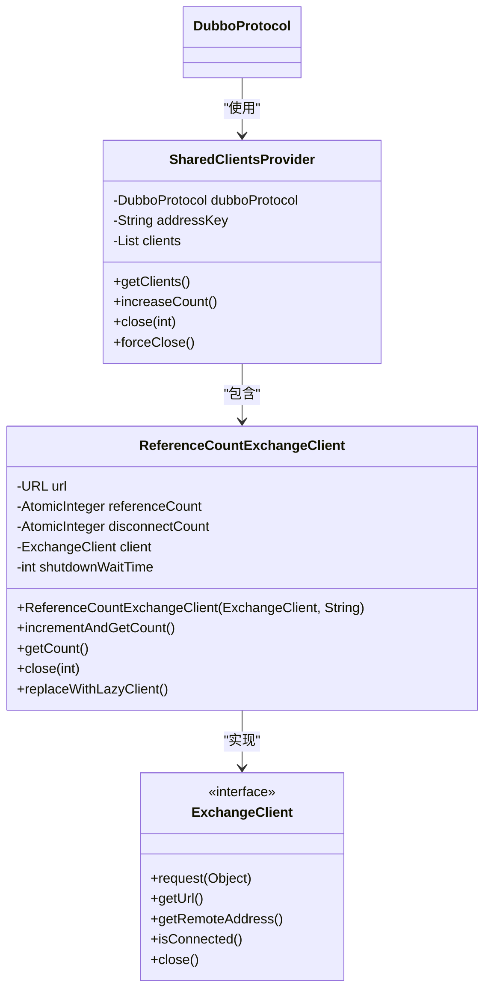
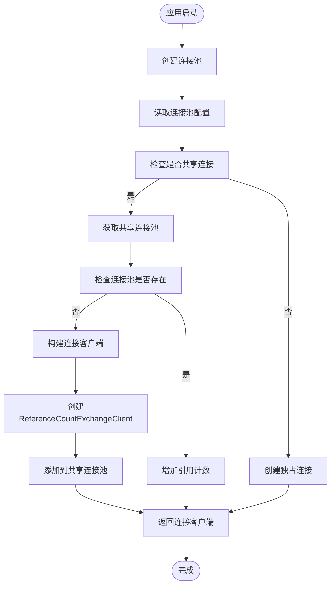
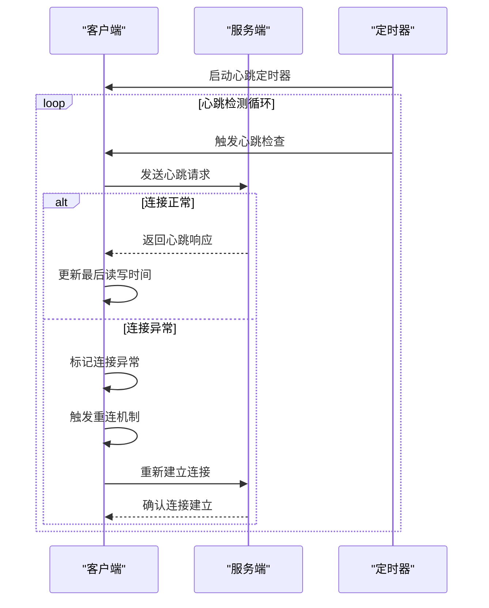
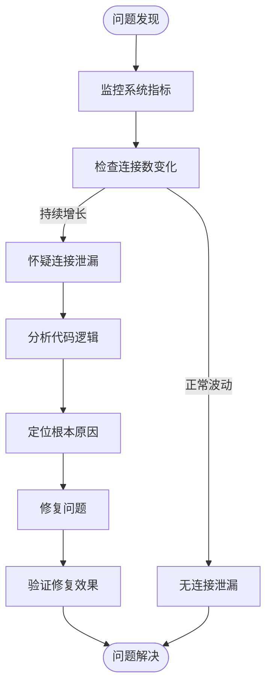
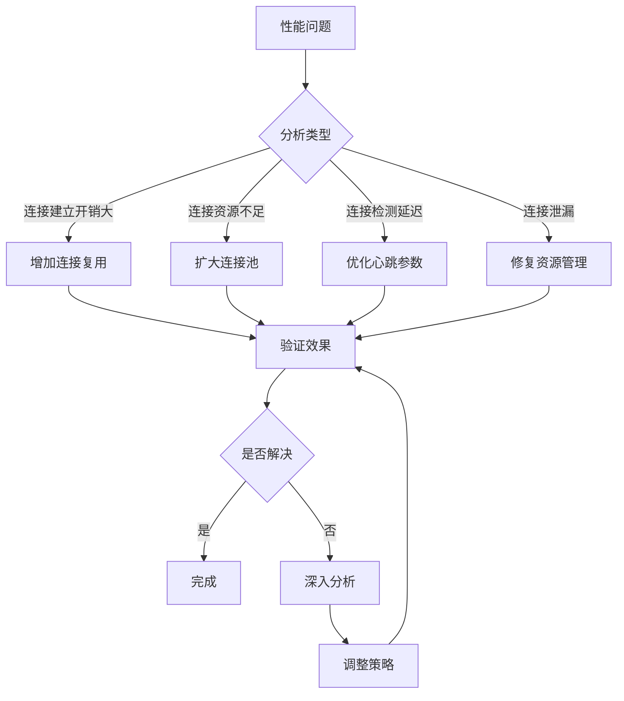

# 连接管理

<cite>
**本文档引用文件**   
- [DubboProtocol.java](file://dubbo-rpc/dubbo-rpc-dubbo/src/main/java/org/apache/dubbo/rpc/protocol/dubbo/DubboProtocol.java)
- [ReferenceCountExchangeClient.java](file://dubbo-rpc/dubbo-rpc-dubbo/src/main/java/org/apache/dubbo/rpc/protocol/dubbo/ReferenceCountExchangeClient.java)
- [SharedClientsProvider.java](file://dubbo-rpc/dubbo-rpc-dubbo/src/main/java/org/apache/dubbo/rpc/protocol/dubbo/SharedClientsProvider.java)
- [Constants.java](file://dubbo-remoting/dubbo-remoting-api/src/main/java/org/apache/dubbo/remoting/Constants.java)
- [LazyConnectExchangeClient.java](file://dubbo-rpc/dubbo-rpc-dubbo/src/main/java/org/apache/dubbo/rpc/protocol/dubbo/LazyConnectExchangeClient.java)
</cite>

## 目录
1. [引言](#引言)
2. [连接复用机制](#连接复用机制)
3. [连接池设计](#连接池设计)
4. [心跳检测机制](#心跳检测机制)
5. [连接泄漏诊断](#连接泄漏诊断)
6. [性能调优建议](#性能调优建议)

## 引言
Dubbo协议的连接管理机制是其高性能通信的核心组成部分。该机制通过长连接复用和连接池设计，有效减少了频繁建立和断开连接的开销，提高了系统整体性能。Dubbo采用ReferenceCountExchangeClient实现连接的共享与复用，通过引用计数的方式管理连接生命周期，确保在多个服务调用者之间高效共享连接资源。本文档将深入分析Dubbo的连接管理机制，为开发者提供从基础概念到高级调优的全面指导。

## 连接复用机制

Dubbo通过ReferenceCountExchangeClient实现连接的共享与复用。该机制的核心是引用计数模式，通过维护连接的引用计数来管理连接的生命周期。当多个服务调用者需要与同一服务提供者通信时，它们可以共享同一个物理连接，而不是为每个调用者创建独立的连接。

**图源**
- [ReferenceCountExchangeClient.java](file://dubbo-rpc/dubbo-rpc-dubbo/src/main/java/org/apache/dubbo/rpc/protocol/dubbo/ReferenceCountExchangeClient.java#L40-L226)
- [SharedClientsProvider.java](file://dubbo-rpc/dubbo-rpc-dubbo/src/main/java/org/apache/dubbo/rpc/protocol/dubbo/SharedClientsProvider.java#L29-L135)
- [DubboProtocol.java](file://dubbo-rpc/dubbo-rpc-dubbo/src/main/java/org/apache/dubbo/rpc/protocol/dubbo/DubboProtocol.java#L95-L652)

**连接复用流程：**
1. 当第一个服务调用者需要连接服务提供者时，DubboProtocol创建ReferenceCountExchangeClient实例
2. 该实例包装底层的ExchangeClient，并将引用计数初始化为1
3. 当后续服务调用者需要连接同一服务提供者时，从共享连接池中获取已存在的ReferenceCountExchangeClient
4. 每次获取连接时，调用incrementAndGetCount()方法增加引用计数
5. 当服务调用者不再需要连接时，调用close()方法减少引用计数
6. 当引用计数降为0时，底层连接被关闭或替换为LazyConnectExchangeClient以备后续使用

**连接复用优势：**
- 减少TCP连接建立和断开的开销
- 降低系统资源消耗（文件描述符、内存等）
- 提高通信效率，减少网络延迟
- 支持连接的"复活"机制，当连接被关闭后仍可重新建立

**连接复用配置：**
通过URL参数控制连接复用行为：
- `connections`：指定每个服务的连接数
- `shareconnections`：指定共享连接的数量
- `lazy`：是否启用懒加载连接

**连接复用状态管理：**
ReferenceCountExchangeClient通过replaceWithLazyClient()方法实现连接的"复活"机制。当连接被关闭后，它会被替换为LazyConnectExchangeClient，当有新的调用请求时，会自动重新建立连接。

**连接复用场景：**
- 多个服务消费者调用同一服务提供者
- 同一服务消费者的多个线程并发调用
- 服务提供者集群的负载均衡场景

**连接复用限制：**
- 连接复用仅在同一服务提供者地址间有效
- 不同服务接口的调用不能共享连接
- 安全性要求高的场景可能需要独立连接

**连接复用监控：**
通过引用计数可以监控连接的使用情况，及时发现连接泄漏等问题。

**连接复用扩展：**
开发者可以通过扩展SharedClientsProvider来自定义连接复用策略。

**连接复用性能：**
连接复用显著降低了连接建立的开销，特别是在高并发场景下，性能提升尤为明显。

**连接复用安全性：**
连接复用不会影响通信的安全性，每个调用的上下文信息都是独立的。

**连接复用兼容性：**
连接复用机制与Dubbo的各种传输协议（Netty、Mina等）兼容。

**连接复用测试：**
通过ReferenceCountExchangeClientTest可以验证连接复用的正确性。

**连接复用优化：**
合理配置连接池参数可以进一步优化连接复用的效果。

**连接复用故障排除：**
当连接复用出现问题时，可以通过日志和监控信息进行排查。

**连接复用最佳实践：**
- 合理设置连接池大小
- 监控连接使用情况
- 及时处理连接泄漏
- 定期进行连接健康检查

**连接复用未来发展：**
随着网络环境的变化，连接复用机制可能会引入更多智能化的管理策略。

**连接复用总结：**
连接复用是Dubbo高性能通信的基础，通过引用计数和共享连接池的设计，实现了连接资源的高效利用。

**本节源码**
- [DubboProtocol.java](file://dubbo-rpc/dubbo-rpc-dubbo/src/main/java/org/apache/dubbo/rpc/protocol/dubbo/DubboProtocol.java#L450-L534)
- [ReferenceCountExchangeClient.java](file://dubbo-rpc/dubbo-rpc-dubbo/src/main/java/org/apache/dubbo/rpc/protocol/dubbo/ReferenceCountExchangeClient.java#L51-L226)
- [SharedClientsProvider.java](file://dubbo-rpc/dubbo-rpc-dubbo/src/main/java/org/apache/dubbo/rpc/protocol/dubbo/SharedClientsProvider.java#L48-L106)

## 连接池设计

Dubbo的连接池设计通过SharedClientsProvider和ReferenceCountExchangeClient协同工作，实现了高效的连接资源管理。连接池的核心目标是平衡连接资源的利用率和系统性能，避免连接过多导致资源浪费，同时防止连接过少影响并发性能。

**图源**
- [DubboProtocol.java](file://dubbo-rpc/dubbo-rpc-dubbo/src/main/java/org/apache/dubbo/rpc/protocol/dubbo/DubboProtocol.java#L450-L519)
- [SharedClientsProvider.java](file://dubbo-rpc/dubbo-rpc-dubbo/src/main/java/org/apache/dubbo/rpc/protocol/dubbo/SharedClientsProvider.java#L36-L41)
- [ReferenceCountExchangeClient.java](file://dubbo-rpc/dubbo-rpc-dubbo/src/main/java/org/apache/dubbo/rpc/protocol/dubbo/ReferenceCountExchangeClient.java#L51-L55)

**连接池配置参数：**

| 参数 | 默认值 | 说明 | 影响 |
|------|--------|------|------|
| connections | 0 | 每个服务的连接数 | 0表示共享连接，大于0表示独占连接 |
| shareconnections | 1 | 共享连接数 | 决定共享连接池的大小 |
| heartbeat | 60000 | 心跳间隔（毫秒） | 影响连接活跃度检测频率 |
| connect.timeout | 3000 | 连接超时时间（毫秒） | 影响连接建立的等待时间 |
| channel.shutdown.timeout | 0 | 通道关闭超时时间 | 影响连接关闭的等待时间 |

**连接池工作流程：**
1. 服务引用时，DubboProtocol根据URL参数决定连接模式
2. 如果connections=0，则使用共享连接模式
3. 在共享连接模式下，通过getSharedClient()获取或创建SharedClientsProvider
4. SharedClientsProvider维护一个ReferenceCountExchangeClient列表
5. 每个ReferenceCountExchangeClient包含一个实际的ExchangeClient
6. 当服务调用完成时，连接不会立即关闭，而是等待引用计数降为0

**连接池性能影响：**
- 连接数过少：可能导致并发请求排队，影响吞吐量
- 连接数过多：消耗过多系统资源，可能导致文件描述符耗尽
- 合理的连接池大小：需要根据业务并发量和系统资源综合考虑

**连接池监控指标：**
- 活跃连接数
- 空闲连接数
- 连接创建速率
- 连接关闭速率
- 连接等待时间

**连接池调优建议：**
- 根据业务峰值并发量设置连接池大小
- 监控连接使用率，避免资源浪费
- 考虑网络延迟和业务处理时间
- 定期进行压力测试验证配置效果

**连接池故障处理：**
- 连接泄漏：通过引用计数监控及时发现
- 连接超时：调整连接超时参数
- 连接风暴：限制连接创建速率
- 连接耗尽：增加连接池大小或优化业务逻辑

**连接池扩展性：**
- 支持自定义连接池实现
- 可以集成外部连接池管理工具
- 支持动态调整连接池参数

**连接池安全性：**
- 连接池本身不涉及安全问题
- 需要确保连接的认证和授权机制
- 防止恶意用户耗尽连接资源

**连接池兼容性：**
- 与各种传输协议兼容
- 支持不同的序列化方式
- 适应不同的网络环境

**连接池测试验证：**
- 单元测试验证连接池基本功能
- 集成测试验证多服务场景
- 压力测试验证性能表现
- 故障测试验证容错能力

**连接池最佳实践：**
- 合理设置连接池参数
- 监控连接池运行状态
- 及时处理连接异常
- 定期优化连接池配置

**连接池未来发展方向：**
- 智能化连接池管理
- 自适应连接池调整
- 更精细的连接池监控
- 更强大的连接池诊断能力

**本节源码**
- [DubboProtocol.java](file://dubbo-rpc/dubbo-rpc-dubbo/src/main/java/org/apache/dubbo/rpc/protocol/dubbo/DubboProtocol.java#L450-L534)
- [SharedClientsProvider.java](file://dubbo-rpc/dubbo-rpc-dubbo/src/main/java/org/apache/dubbo/rpc/protocol/dubbo/SharedClientsProvider.java#L29-L135)
- [Constants.java](file://dubbo-remoting/dubbo-remoting-api/src/main/java/org/apache/dubbo/remoting/Constants.java#L159-L161)

## 心跳检测机制

Dubbo的心跳检测机制是保障长连接可靠性的关键组件。通过定期发送心跳包，系统能够及时发现网络异常和连接故障，确保服务调用的稳定性和可靠性。心跳机制不仅用于检测连接的存活状态，还用于触发重连策略，实现故障自动恢复。

**图源**
- [Constants.java](file://dubbo-remoting/dubbo-remoting-api/src/main/java/org/apache/dubbo/remoting/Constants.java#L155-L158)
- [DubboProtocol.java](file://dubbo-rpc/dubbo-rpc-dubbo/src/main/java/org/apache/dubbo/rpc/protocol/dubbo/DubboProtocol.java#L76-L77)
- [ReconnectTimerTask.java](file://dubbo-remoting/dubbo-remoting-api/src/main/java/org/apache/dubbo/remoting/exchange/support/header/ReconnectTimerTask.java#L34-L48)

**心跳检测工作原理：**
1. 客户端和服务端建立连接后，启动心跳定时器
2. 定时器按照预设间隔（默认60秒）触发心跳检查
3. 客户端向服务端发送心跳请求
4. 服务端收到心跳请求后返回响应
5. 客户端更新连接的最后读写时间戳
6. 如果在超时时间内未收到响应，则认为连接异常

**心跳检测配置方法：**
- `heartbeat`：心跳间隔时间（毫秒），默认60000ms
- `heartbeat.timeout`：心跳超时时间，通常为心跳间隔的3倍
- 可以通过URL参数或配置文件进行设置

**心跳检测重连策略：**
1. 检测到连接异常后，启动重连机制
2. 按照指数退避算法进行重试
3. 重试间隔逐渐增加，避免网络风暴
4. 达到最大重试次数后，标记服务不可用
5. 当网络恢复时，自动重新建立连接

**心跳检测性能影响：**
- 心跳间隔过短：增加网络开销和系统负载
- 心跳间隔过长：故障发现延迟，影响服务可用性
- 需要根据网络环境和业务需求平衡

**心跳检测监控指标：**
- 心跳成功率
- 心跳响应时间
- 连接异常次数
- 重连成功率
- 心跳超时率

**心跳检测调优建议：**
- 网络环境较差时，适当增加心跳间隔
- 对可用性要求高的业务，缩短心跳间隔
- 监控心跳异常率，及时发现网络问题
- 结合业务特点调整心跳参数

**心跳检测故障处理：**
- 网络抖动：通过重连机制自动恢复
- 服务宕机：快速发现并切换到备用服务
- 连接泄漏：通过心跳超时机制清理
- 资源耗尽：限制重连频率

**心跳检测安全性：**
- 心跳包不携带业务数据，安全性较高
- 需要防止恶意心跳攻击
- 可以结合认证机制增强安全性

**心跳检测兼容性：**
- 与各种传输协议兼容
- 适应不同的网络环境
- 支持跨语言调用

**心跳检测测试验证：**
- 单元测试验证心跳基本功能
- 集成测试验证多节点场景
- 故障注入测试验证容错能力
- 压力测试验证性能表现

**心跳检测最佳实践：**
- 合理设置心跳参数
- 监控心跳运行状态
- 及时处理心跳异常
- 定期优化心跳配置

**心跳检测未来发展方向：**
- 智能化心跳策略
- 自适应心跳间隔
- 更精细的心跳监控
- 更强大的故障诊断能力

**本节源码**
- [Constants.java](file://dubbo-remoting/dubbo-remoting-api/src/main/java/org/apache/dubbo/remoting/Constants.java#L155-L158)
- [DubboProtocol.java](file://dubbo-rpc/dubbo-rpc-dubbo/src/main/java/org/apache/dubbo/rpc/protocol/dubbo/DubboProtocol.java#L401-L402)
- [ReconnectTimerTask.java](file://dubbo-remoting/dubbo-remoting-api/src/main/java/org/apache/dubbo/remoting/exchange/support/header/ReconnectTimerTask.java#L34-L48)

## 连接泄漏诊断

连接泄漏是分布式系统中常见的性能问题，可能导致资源耗尽和服务不可用。Dubbo提供了多种机制来诊断和解决连接泄漏问题，帮助开发者及时发现和修复潜在的连接管理缺陷。

**连接泄漏常见原因：**
- 服务调用后未正确释放连接
- 异常情况下连接未关闭
- 连接池配置不合理
- 业务逻辑中存在死循环或长时间阻塞
- 网络异常导致连接状态不一致

**连接泄漏诊断方法：**

**图源**
- [ReferenceCountExchangeClient.java](file://dubbo-rpc/dubbo-rpc-dubbo/src/main/java/org/apache/dubbo/rpc/protocol/dubbo/ReferenceCountExchangeClient.java#L156-L172)
- [SharedClientsProvider.java](file://dubbo-rpc/dubbo-rpc-dubbo/src/main/java/org/apache/dubbo/rpc/protocol/dubbo/SharedClientsProvider.java#L57-L67)
- [DubboProtocol.java](file://dubbo-rpc/dubbo-rpc-dubbo/src/main/java/org/apache/dubbo/rpc/protocol/dubbo/DubboProtocol.java#L587-L632)

**连接泄漏监控指标：**
- 连接数随时间的变化趋势
- 活跃连接与空闲连接的比例
- 连接创建和关闭的速率
- 引用计数的分布情况
- 连接等待时间

**连接泄漏诊断工具：**
- JVM监控工具（JConsole、VisualVM等）
- Dubbo管理控制台
- 日志分析工具
- 分布式追踪系统
- 自定义监控脚本

**连接泄漏解决方案：**
1. **代码层面修复：**
   - 确保在finally块中关闭连接
   - 使用try-with-resources语法
   - 检查异常处理逻辑
   - 验证连接释放时机

2. **配置层面优化：**
   - 设置合理的连接超时时间
   - 配置连接池的最大连接数
   - 启用连接空闲检测
   - 调整心跳检测参数

3. **架构层面改进：**
   - 引入连接池监控告警
   - 实现连接使用审计
   - 建立连接健康检查机制
   - 设计连接泄漏自动恢复

**连接泄漏预防措施：**
- 建立代码审查规范
- 实施单元测试覆盖
- 进行压力测试验证
- 定期进行代码审计
- 建立监控告警机制

**连接泄漏案例分析：**
- 案例1：异步调用未正确处理回调
- 案例2：循环调用导致连接累积
- 案例3：异常情况下连接未释放
- 案例4：连接池配置不合理

**连接泄漏调试技巧：**
- 使用堆转储分析连接对象
- 监控连接创建和关闭的调用栈
- 记录连接的生命周期日志
- 模拟高并发场景进行测试
- 使用分布式追踪定位问题

**连接泄漏最佳实践：**
- 建立连接管理规范
- 实施自动化测试
- 建立监控告警体系
- 定期进行性能优化
- 建立问题处理流程

**连接泄漏未来发展方向：**
- 智能化连接泄漏检测
- 自动化连接泄漏修复
- 更精细的连接使用分析
- 更强大的连接管理能力

**本节源码**
- [ReferenceCountExchangeClient.java](file://dubbo-rpc/dubbo-rpc-dubbo/src/main/java/org/apache/dubbo/rpc/protocol/dubbo/ReferenceCountExchangeClient.java#L156-L172)
- [SharedClientsProvider.java](file://dubbo-rpc/dubbo-rpc-dubbo/src/main/java/org/apache/dubbo/rpc/protocol/dubbo/SharedClientsProvider.java#L57-L67)
- [DubboProtocol.java](file://dubbo-rpc/dubbo-rpc-dubbo/src/main/java/org/apache/dubbo/rpc/protocol/dubbo/DubboProtocol.java#L587-L632)

## 性能调优建议

Dubbo连接管理的性能调优需要综合考虑系统资源、业务需求和网络环境。通过合理的配置和优化，可以显著提升系统的吞吐量和响应速度。

**连接管理性能调优原则：**
- 平衡资源利用率和系统性能
- 根据业务特点进行针对性优化
- 持续监控和调整配置参数
- 建立性能基线进行对比

**连接池参数调优：**
1. **连接数设置：**
   - 估算业务峰值并发量
   - 考虑服务处理时间和网络延迟
   - 预留一定的缓冲空间
   - 避免过度配置导致资源浪费

2. **连接超时设置：**
   - 连接超时：根据网络状况设置，通常3-5秒
   - 读写超时：根据业务处理时间设置，留有余量
   - 关闭超时：根据资源清理时间设置

3. **心跳参数调优：**
   - 心跳间隔：网络稳定时可适当延长
   - 心跳超时：通常为心跳间隔的2-3倍
   - 重连策略：采用指数退避算法

**性能调优策略：**

**图源**
- [DubboProtocol.java](file://dubbo-rpc/dubbo-rpc-dubbo/src/main/java/org/apache/dubbo/rpc/protocol/dubbo/DubboProtocol.java#L450-L534)
- [Constants.java](file://dubbo-remoting/dubbo-remoting-api/src/main/java/org/apache/dubbo/remoting/Constants.java#L155-L158)
- [LazyConnectExchangeClient.java](file://dubbo-rpc/dubbo-rpc-dubbo/src/main/java/org/apache/dubbo/rpc/protocol/dubbo/LazyConnectExchangeClient.java#L61-L67)

**性能监控指标：**
- 连接建立时间
- 请求响应时间
- 连接使用率
- 系统资源消耗
- 错误率和超时率

**性能测试方法：**
- 基准测试：建立性能基线
- 压力测试：验证系统极限
- 稳定性测试：验证长时间运行表现
- 故障测试：验证容错能力

**性能调优步骤：**
1. 建立性能监控体系
2. 识别性能瓶颈
3. 制定优化方案
4. 实施配置调整
5. 验证优化效果
6. 持续监控和优化

**高级调优技巧：**
- 动态调整连接池大小
- 实现连接预热机制
- 优化连接建立流程
- 减少连接上下文开销
- 实现连接智能路由

**性能调优注意事项：**
- 避免过度优化
- 考虑系统整体影响
- 做好配置变更管理
- 建立回滚机制
- 记录调优过程

**性能调优最佳实践：**
- 建立性能管理规范
- 实施自动化监控
- 定期进行性能评估
- 建立知识库
- 培训团队成员

**性能调优未来发展方向：**
- 智能化性能调优
- 自适应参数调整
- 更精细的性能分析
- 更强大的性能预测

**本节源码**
- [DubboProtocol.java](file://dubbo-rpc/dubbo-rpc-dubbo/src/main/java/org/apache/dubbo/rpc/protocol/dubbo/DubboProtocol.java#L450-L534)
- [Constants.java](file://dubbo-remoting/dubbo-remoting-api/src/main/java/org/apache/dubbo/remoting/Constants.java#L155-L158)
- [LazyConnectExchangeClient.java](file://dubbo-rpc/dubbo-rpc-dubbo/src/main/java/org/apache/dubbo/rpc/protocol/dubbo/LazyConnectExchangeClient.java#L61-L67)