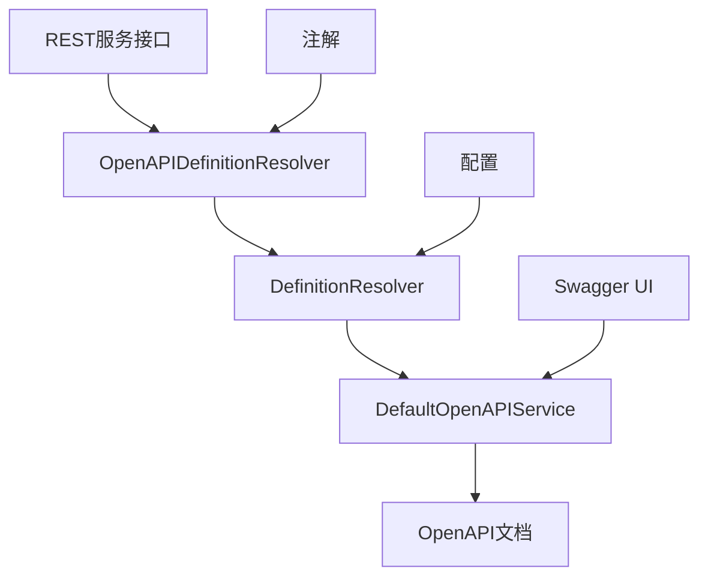
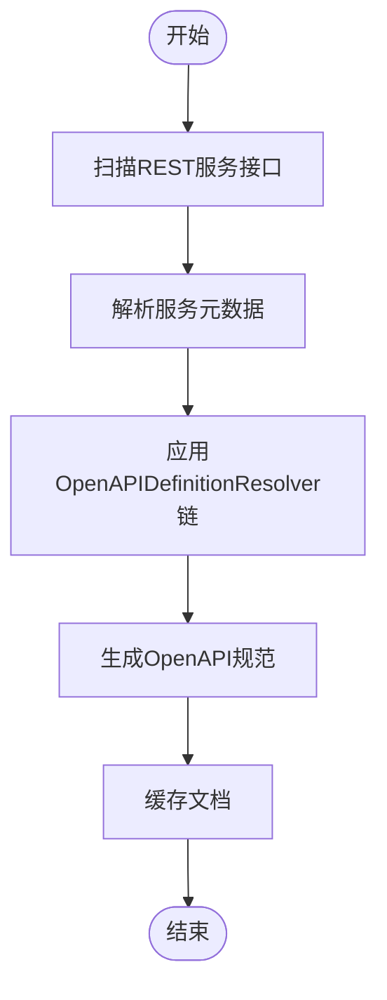
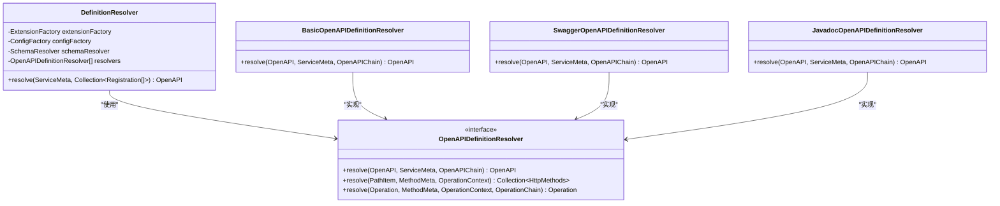
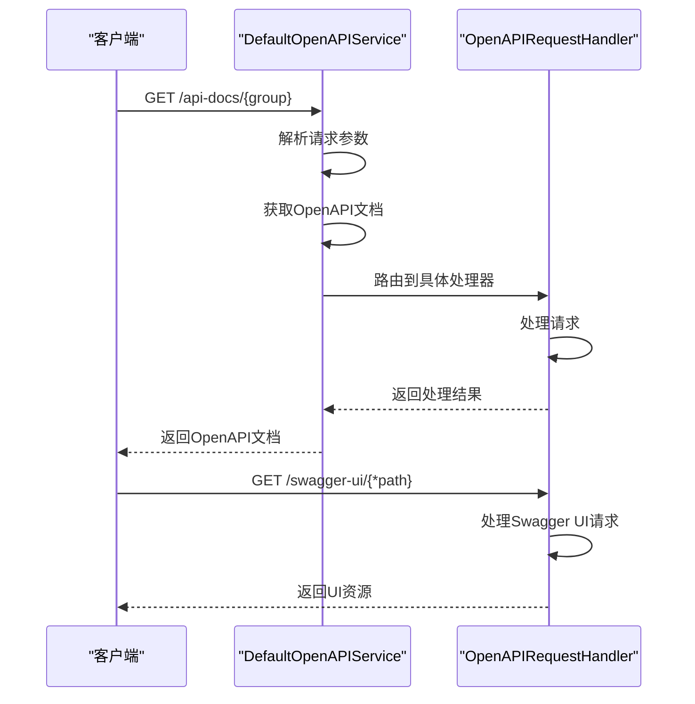
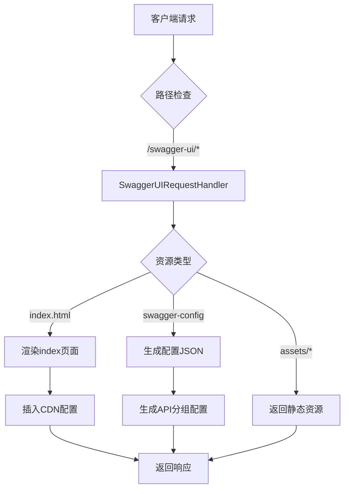
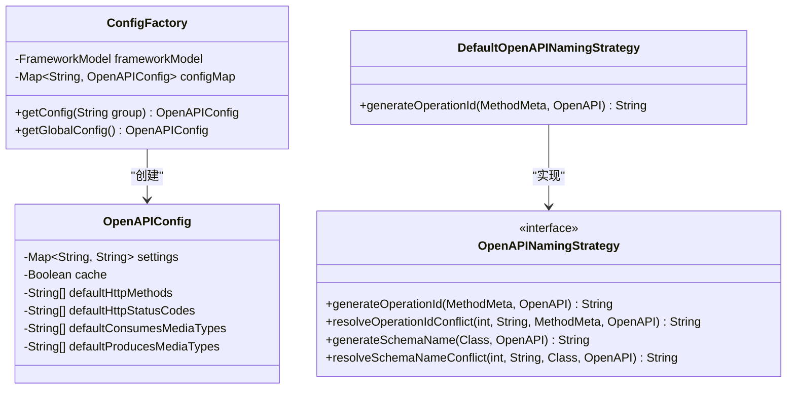
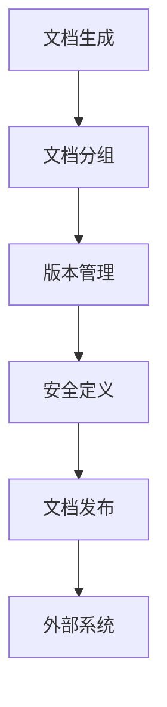

# OpenAPI集成

<cite>
**本文档引用的文件**
- [DefaultOpenAPIService.java](file://dubbo-plugin\dubbo-rest-openapi\src\main\java\org\apache\dubbo\rpc\protocol\tri\rest\openapi\DefaultOpenAPIService.java)
- [DefinitionResolver.java](file://dubbo-plugin\dubbo-rest-openapi\src\main\java\org\apache\dubbo\rpc\protocol\tri\rest\openapi\DefinitionResolver.java)
- [OpenAPIDefinitionResolver.java](file://dubbo-plugin\dubbo-rest-openapi\src\main\java\org\apache\dubbo\rpc\protocol\tri\rest\openapi\OpenAPIDefinitionResolver.java)
- [SwaggerUIRequestHandler.java](file://dubbo-plugin\dubbo-rest-openapi\src\main\java\org\apache\dubbo\rpc\protocol\tri\rest\support\swagger\SwaggerUIRequestHandler.java)
- [ConfigFactory.java](file://dubbo-plugin\dubbo-rest-openapi\src\main\java\org\apache\dubbo\rpc\protocol\tri\rest\openapi\ConfigFactory.java)
- [OpenAPIExtension](file://dubbo-plugin\dubbo-rest-openapi\src\main\resources\META-INF\dubbo\internal\org.apache.dubbo.rpc.protocol.tri.rest.openapi.OpenAPIExtension)
- [index.html](file://dubbo-plugin\dubbo-rest-openapi\src\main\resources\META-INF\resources\swagger-ui\index.html)
</cite>

## 目录
1. [简介](#简介)
2. [REST协议与OpenAPI集成概述](#rest协议与openapi集成概述)
3. [OpenAPI文档自动生成机制](#openapi文档自动生成机制)
4. [OpenAPIDefinitionResolver工作原理](#openapidefinitionresolver工作原理)
5. [OpenAPIRequestHandler工作原理](#openapirequesthandler工作原理)
6. [Swagger UI界面配置与启用](#swagger-ui界面配置与启用)
7. [API文档自定义规则](#api文档自定义规则)
8. [高级特性](#高级特性)
9. [最佳实践](#最佳实践)

## 简介
本文档详细介绍了Dubbo框架中REST协议与OpenAPI（Swagger）的集成能力。文档涵盖了OpenAPI规范文档的自动生成机制，包括如何从Dubbo服务接口和REST注解推导出API定义。同时，深入解析了OpenAPIDefinitionResolver和OpenAPIRequestHandler的核心工作原理，以及如何自定义API文档生成规则。此外，文档还描述了如何启用和配置Swagger UI界面，提供交互式API文档和测试功能，并涵盖版本管理、文档分组、安全定义等高级特性。

## REST协议与OpenAPI集成概述
Dubbo框架通过dubbo-rest-openapi模块实现了REST协议与OpenAPI的深度集成。该集成允许开发者通过RESTful API暴露Dubbo服务，并自动生成符合OpenAPI 3.0规范的API文档。核心组件包括DefaultOpenAPIService、DefinitionResolver、OpenAPIDefinitionResolver等，它们协同工作以实现API定义的解析、合并、过滤和编码。

**图表来源**
- [DefaultOpenAPIService.java](file://dubbo-plugin\dubbo-rest-openapi\src\main\java\org\apache\dubbo\rpc\protocol\tri\rest\openapi\DefaultOpenAPIService.java)
- [DefinitionResolver.java](file://dubbo-plugin\dubbo-rest-openapi\src\main\java\org\apache\dubbo\rpc\protocol\tri\rest\openapi\DefinitionResolver.java)
- [OpenAPIDefinitionResolver.java](file://dubbo-plugin\dubbo-rest-openapi\src\main\java\org\apache\dubbo\rpc\protocol\tri\rest\openapi\OpenAPIDefinitionResolver.java)

## OpenAPI文档自动生成机制
Dubbo通过扫描服务接口和REST注解来自动推导API定义。当服务启动时，框架会收集所有注册的REST服务，通过DefinitionResolver解析每个服务的元数据，并利用OpenAPIDefinitionResolver链式处理来生成完整的OpenAPI文档。

**图表来源**
- [DefinitionResolver.java](file://dubbo-plugin\dubbo-rest-openapi\src\main\java\org\apache\dubbo\rpc\protocol\tri\rest\openapi\DefinitionResolver.java)
- [DefaultOpenAPIService.java](file://dubbo-plugin\dubbo-rest-openapi\src\main\java\org\apache\dubbo\rpc\protocol\tri\rest\openapi\DefaultOpenAPIService.java)

## OpenAPIDefinitionResolver工作原理
OpenAPIDefinitionResolver是OpenAPI文档生成的核心扩展点，采用责任链模式处理API定义。系统预置了多种实现，包括basic、swagger和javadoc解析器，它们按照优先级顺序执行。

**图表来源**
- [OpenAPIDefinitionResolver.java](file://dubbo-plugin\dubbo-rest-openapi\src\main\java\org\apache\dubbo\rpc\protocol\tri\rest\openapi\OpenAPIDefinitionResolver.java)
- [DefinitionResolver.java](file://dubbo-plugin\dubbo-rest-openapi\src\main\java\org\apache\dubbo\rpc\protocol\tri\rest\openapi\DefinitionResolver.java)
- [OpenAPIExtension](file://dubbo-plugin\dubbo-rest-openapi\src\main\resources\META-INF\dubbo\internal\org.apache.dubbo.rpc.protocol.tri.rest.openapi.OpenAPIExtension)

## OpenAPIRequestHandler工作原理
OpenAPIRequestHandler负责处理OpenAPI相关的HTTP请求，包括文档获取和UI展示。系统通过Radix Tree路由机制将不同路径的请求分发给相应的处理器。

**图表来源**
- [DefaultOpenAPIService.java](file://dubbo-plugin\dubbo-rest-openapi\src\main\java\org\apache\dubbo\rpc\protocol\tri\rest\openapi\DefaultOpenAPIService.java)
- [SwaggerUIRequestHandler.java](file://dubbo-plugin\dubbo-rest-openapi\src\main\java\org\apache\dubbo\rpc\protocol\tri\rest\support\swagger\SwaggerUIRequestHandler.java)

## Swagger UI界面配置与启用
Swagger UI通过SwaggerUIRequestHandler提供服务，支持CDN和本地资源两种模式。系统会自动配置Swagger UI的入口点，并通过configFactory管理相关配置。

**图表来源**
- [SwaggerUIRequestHandler.java](file://dubbo-plugin\dubbo-rest-openapi\src\main\java\org\apache\dubbo\rpc\protocol\tri\rest\support\swagger\SwaggerUIRequestHandler.java)
- [index.html](file://dubbo-plugin\dubbo-rest-openapi\src\main\resources\META-INF\resources\swagger-ui\index.html)

## API文档自定义规则
通过配置工厂（ConfigFactory）和扩展机制，开发者可以自定义API文档的生成规则。系统支持通过配置属性、注解和SPI扩展等多种方式进行自定义。

**图表来源**
- [ConfigFactory.java](file://dubbo-plugin\dubbo-rest-openapi\src\main\java\org\apache\dubbo\rpc\protocol\tri\rest\openapi\ConfigFactory.java)
- [DefaultOpenAPINamingStrategy.java](file://dubbo-plugin\dubbo-rest-openapi\src\main\java\org\apache\dubbo\rpc\protocol\tri\rest\openapi\DefaultOpenAPINamingStrategy.java)

## 高级特性
### 文档分组与版本管理
系统支持通过group参数实现API文档的分组管理，每个服务可以属于不同的文档组。同时，通过服务版本和服务分组信息，实现了API的版本管理。

### 安全定义
通过OpenAPI的securitySchemes机制，可以定义各种安全认证方式，包括API Key、OAuth2、OpenID Connect等。

### 文档发布
系统提供了OpenAPIDocumentPublisher扩展点，支持将生成的OpenAPI文档发布到外部系统，如API网关、文档中心等。

## 最佳实践
1. 合理使用文档分组，按业务模块组织API文档
2. 充分利用Javadoc注解，提高API文档的可读性
3. 配置合理的缓存策略，提高文档访问性能
4. 使用自定义命名策略，确保operationId的唯一性
5. 定期刷新文档，确保API定义的及时更新