# REST协议

<cite>
**本文档引用的文件**
- [RestRequestHandlerMapping.java](file://dubbo-rpc\dubbo-rpc-triple\src\main\java\org\apache\dubbo\rpc\protocol\tri\rest\mapping\RestRequestHandlerMapping.java)
- [JaxrsRequestMappingResolver.java](file://dubbo-plugin\dubbo-rest-jaxrs\src\main\java\org\apache\dubbo\rpc\protocol\tri\rest\support\jaxrs\JaxrsRequestMappingResolver.java)
- [SpringMvcRequestMappingResolver.java](file://dubbo-plugin\dubbo-rest-spring\src\main\java\org\apache\dubbo\rpc\protocol\tri\rest\support\spring\SpringMvcRequestMappingResolver.java)
- [PathParamArgumentResolver.java](file://dubbo-plugin\dubbo-rest-jaxrs\src\main\java\org\apache\dubbo\rpc\protocol\tri\rest\support\jaxrs\PathParamArgumentResolver.java)
- [PathVariableArgumentResolver.java](file://dubbo-plugin\dubbo-rest-spring\src\main\java\org\apache\dubbo\rpc\protocol\tri\rest\support\spring\PathVariableArgumentResolver.java)
- [QueryParamArgumentResolver.java](file://dubbo-plugin\dubbo-rest-jaxrs\src\main\java\org\apache\dubbo\rpc\protocol\tri\rest\support\jaxrs\QueryParamArgumentResolver.java)
- [RequestParamArgumentResolver.java](file://dubbo-plugin\dubbo-rest-spring\src\main\java\org\apache\dubbo\rpc\protocol\tri\rest\support\spring\RequestParamArgumentResolver.java)
- [SpringDemoService.java](file://dubbo-plugin\dubbo-rest-spring\src\test\java\org\apache\dubbo\rpc\protocol\tri\rest\support\spring\service\SpringDemoService.java)
- [DefaultOpenAPIService.java](file://dubbo-plugin\dubbo-rest-openapi\src\main\java\org\apache\dubbo\rpc\protocol\tri\rest\openapi\DefaultOpenAPIService.java)
</cite>

## 目录
1. [引言](#引言)
2. [REST协议架构](#rest协议架构)
3. [JAX-RS和Spring MVC注解支持](#jax-rs和spring-mvc注解支持)
4. [HTTP传输与序列化](#http传输与序列化)
5. [服务暴露与调用](#服务暴露与调用)
6. [参数绑定与异常处理](#参数绑定与异常处理)
7. [文件上传下载](#文件上传下载)
8. [迁移指南](#迁移指南)
9. [高级特性](#高级特性)
10. [结论](#结论)

## 引言
REST协议是Dubbo框架中用于连接Dubbo生态系统与Web生态的重要桥梁。它允许开发者将传统的RESTful服务无缝集成到Dubbo架构中，同时也能通过Dubbo调用外部的RESTful API。本协议基于HTTP/1.1传输机制，支持JSON和XML序列化，为微服务架构提供了灵活的通信方式。

## REST协议架构

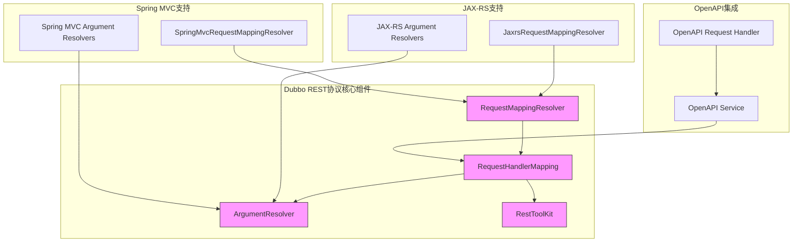

**图示来源**
- [JaxrsRequestMappingResolver.java](file://dubbo-plugin\dubbo-rest-jaxrs\src\main\java\org\apache\dubbo\rpc\protocol\tri\rest\support\jaxrs\JaxrsRequestMappingResolver.java)
- [SpringMvcRequestMappingResolver.java](file://dubbo-plugin\dubbo-rest-spring\src\main\java\org\apache\dubbo\rpc\protocol\tri\rest\support\spring\SpringMvcRequestMappingResolver.java)
- [RestRequestHandlerMapping.java](file://dubbo-rpc\dubbo-rpc-triple\src\main\java\org\apache\dubbo\rpc\protocol\tri\rest\mapping\RestRequestHandlerMapping.java)

**本节来源**
- [RestRequestHandlerMapping.java](file://dubbo-rpc\dubbo-rpc-triple\src\main\java\org\apache\dubbo\rpc\protocol\tri\rest\mapping\RestRequestHandlerMapping.java)
- [JaxrsRequestMappingResolver.java](file://dubbo-plugin\dubbo-rest-jaxrs\src\main\java\org\apache\dubbo\rpc\protocol\tri\rest\support\jaxrs\JaxrsRequestMappingResolver.java)
- [SpringMvcRequestMappingResolver.java](file://dubbo-plugin\dubbo-rest-spring\src\main\java\org\apache\dubbo\rpc\protocol\tri\rest\support\spring\SpringMvcRequestMappingResolver.java)

## JAX-RS和Spring MVC注解支持

### JAX-RS注解支持

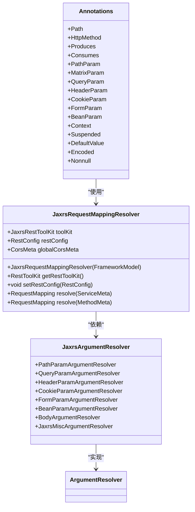

**图示来源**
- [Annotations.java](file://dubbo-plugin\dubbo-rest-jaxrs\src\main\java\org\apache\dubbo\rpc\protocol\tri\rest\support\jaxrs\Annotations.java)
- [JaxrsRequestMappingResolver.java](file://dubbo-plugin\dubbo-rest-jaxrs\src\main\java\org\apache\dubbo\rpc\protocol\tri\rest\support\jaxrs\JaxrsRequestMappingResolver.java)

**本节来源**
- [JaxrsRequestMappingResolver.java](file://dubbo-plugin\dubbo-rest-jaxrs\src\main\java\org\apache\dubbo\rpc\protocol\tri\rest\support\jaxrs\JaxrsRequestMappingResolver.java)
- [Annotations.java](file://dubbo-plugin\dubbo-rest-jaxrs\src\main\java\org\apache\dubbo\rpc\protocol\tri\rest\support\jaxrs\Annotations.java)

### Spring MVC注解支持

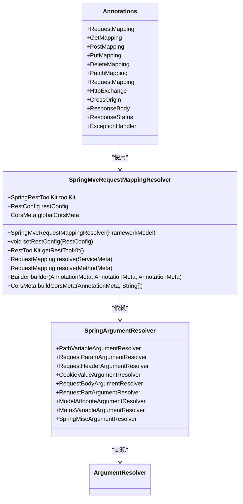

**图示来源**
- [SpringMvcRequestMappingResolver.java](file://dubbo-plugin\dubbo-rest-spring\src\main\java\org\apache\dubbo\rpc\protocol\tri\rest\support\spring\SpringMvcRequestMappingResolver.java)
- [Annotations.java](file://dubbo-plugin\dubbo-rest-spring\src\main\java\org\apache\dubbo\rpc\protocol\tri\rest\support\spring\Annotations.java)

**本节来源**
- [SpringMvcRequestMappingResolver.java](file://dubbo-plugin\dubbo-rest-spring\src\main\java\org\apache\dubbo\rpc\protocol\tri\rest\support\spring\SpringMvcRequestMappingResolver.java)
- [Annotations.java](file://dubbo-plugin\dubbo-rest-spring\src\main\java\org\apache\dubbo\rpc\protocol\tri\rest\support\spring\Annotations.java)

## HTTP传输与序列化

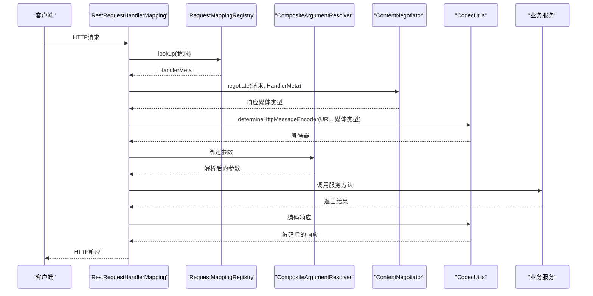

**图示来源**
- [RestRequestHandlerMapping.java](file://dubbo-rpc\dubbo-rpc-triple\src\main\java\org\apache\dubbo\rpc\protocol\tri\rest\mapping\RestRequestHandlerMapping.java)
- [RequestMappingRegistry.java](file://dubbo-rpc\dubbo-rpc-triple\src\main\java\org\apache\dubbo\rpc\protocol\tri\rest\mapping\RequestMappingRegistry.java)
- [CompositeArgumentResolver.java](file://dubbo-rpc\dubbo-rpc-triple\src\main\java\org\apache\dubbo\rpc\protocol\tri\rest\argument\CompositeArgumentResolver.java)

**本节来源**
- [RestRequestHandlerMapping.java](file://dubbo-rpc\dubbo-rpc-triple\src\main\java\org\apache\dubbo\rpc\protocol\tri\rest\mapping\RestRequestHandlerMapping.java)

## 服务暴露与调用

### 服务暴露流程

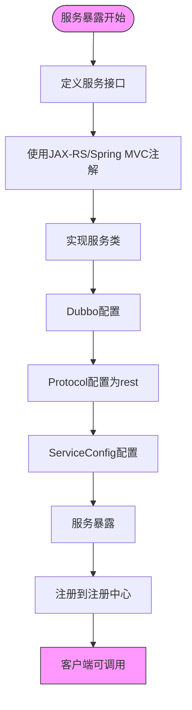

### 外部REST API调用

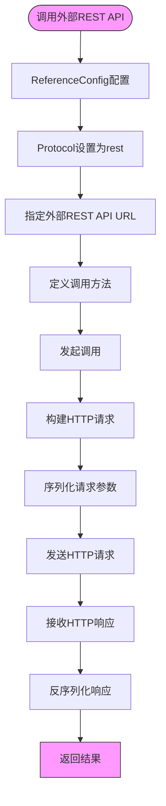

**本节来源**
- [RestRequestHandlerMapping.java](file://dubbo-rpc\dubbo-rpc-triple\src\main\java\org\apache\dubbo\rpc\protocol\tri\rest\mapping\RestRequestHandlerMapping.java)
- [JaxrsRequestMappingResolver.java](file://dubbo-plugin\dubbo-rest-jaxrs\src\main\java\org\apache\dubbo\rpc\protocol\tri\rest\support\jaxrs\JaxrsRequestMappingResolver.java)
- [SpringMvcRequestMappingResolver.java](file://dubbo-plugin\dubbo-rest-spring\src\main\java\org\apache\dubbo\rpc\protocol\tri\rest\support\spring\SpringMvcRequestMappingResolver.java)

## 参数绑定与异常处理

### 参数绑定机制

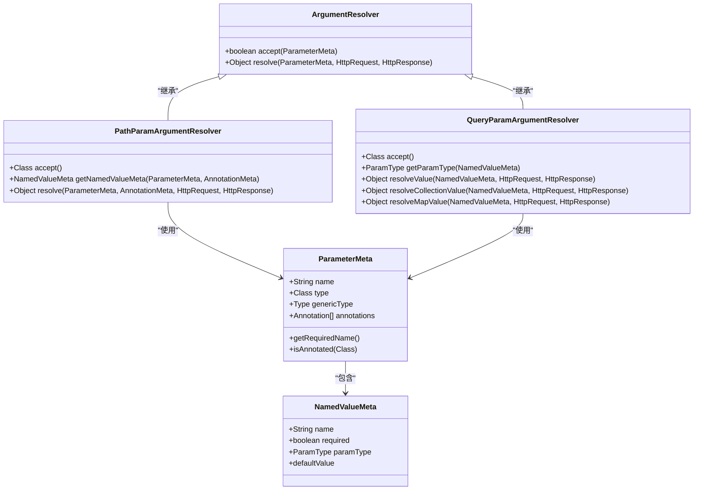

**图示来源**
- [PathParamArgumentResolver.java](file://dubbo-plugin\dubbo-rest-jaxrs\src\main\java\org\apache\dubbo\rpc\protocol\tri\rest\support\jaxrs\PathParamArgumentResolver.java)
- [PathVariableArgumentResolver.java](file://dubbo-plugin\dubbo-rest-spring\src\main\java\org\apache\dubbo\rpc\protocol\tri\rest\support\spring\PathVariableArgumentResolver.java)
- [QueryParamArgumentResolver.java](file://dubbo-plugin\dubbo-rest-jaxrs\src\main\java\org\apache\dubbo\rpc\protocol\tri\rest\support\jaxrs\QueryParamArgumentResolver.java)
- [RequestParamArgumentResolver.java](file://dubbo-plugin\dubbo-rest-spring\src\main\java\org\apache\dubbo\rpc\protocol\tri\rest\support\spring\RequestParamArgumentResolver.java)

**本节来源**
- [PathParamArgumentResolver.java](file://dubbo-plugin\dubbo-rest-jaxrs\src\main\java\org\apache\dubbo\rpc\protocol\tri\rest\support\jaxrs\PathParamArgumentResolver.java)
- [PathVariableArgumentResolver.java](file://dubbo-plugin\dubbo-rest-spring\src\main\java\org\apache\dubbo\rpc\protocol\tri\rest\support\spring\PathVariableArgumentResolver.java)
- [QueryParamArgumentResolver.java](file://dubbo-plugin\dubbo-rest-jaxrs\src\main\java\org\apache\dubbo\rpc\protocol\tri\rest\support\jaxrs\QueryParamArgumentResolver.java)
- [RequestParamArgumentResolver.java](file://dubbo-plugin\dubbo-rest-spring\src\main\java\org\apache\dubbo\rpc\protocol\tri\rest\support\spring\RequestParamArgumentResolver.java)

### 异常处理

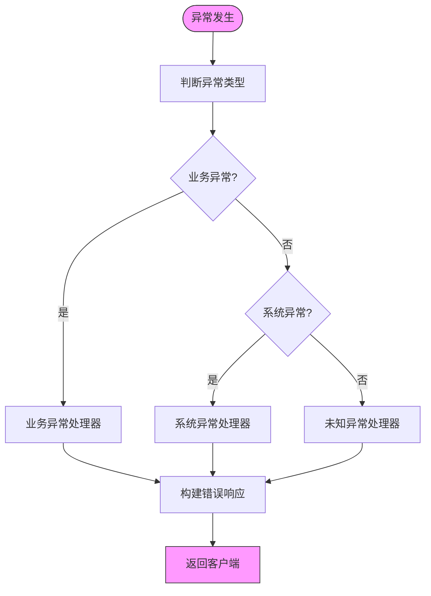

## 文件上传下载

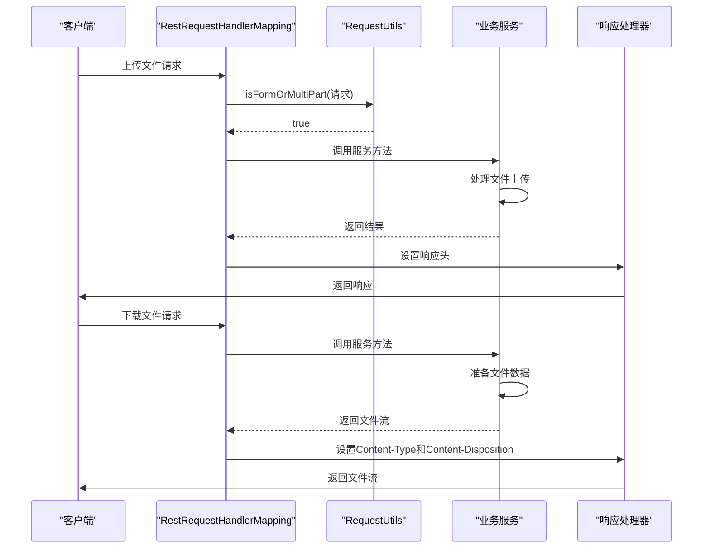

**本节来源**
- [RestRequestHandlerMapping.java](file://dubbo-rpc\dubbo-rpc-triple\src\main\java\org\apache\dubbo\rpc\protocol\tri\rest\mapping\RestRequestHandlerMapping.java)
- [RequestUtils.java](file://dubbo-rpc\dubbo-rpc-triple\src\main\java\org\apache\dubbo\rpc\protocol\tri\rest\util\RequestUtils.java)

## 迁移指南

### 从JAX-RS迁移

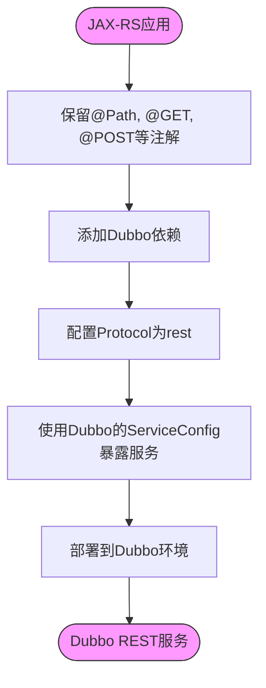

### 从Spring MVC迁移

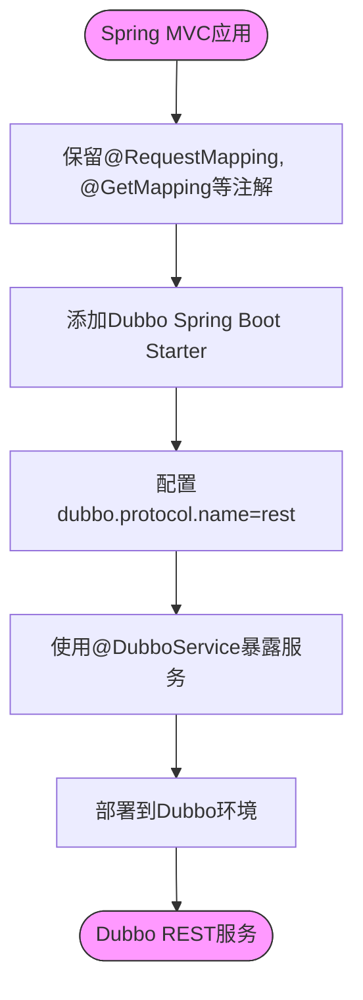

**本节来源**
- [SpringDemoService.java](file://dubbo-plugin\dubbo-rest-spring\src\test\java\org\apache\dubbo\rpc\protocol\tri\rest\support\spring\service\SpringDemoService.java)
- [JaxrsRequestMappingResolver.java](file://dubbo-plugin\dubbo-rest-jaxrs\src\main\java\org\apache\dubbo\rpc\protocol\tri\rest\support\jaxrs\JaxrsRequestMappingResolver.java)
- [SpringMvcRequestMappingResolver.java](file://dubbo-plugin\dubbo-rest-spring\src\main\java\org\apache\dubbo\rpc\protocol\tri\rest\support\spring\SpringMvcRequestMappingResolver.java)

## 高级特性

### OpenAPI/Swagger集成

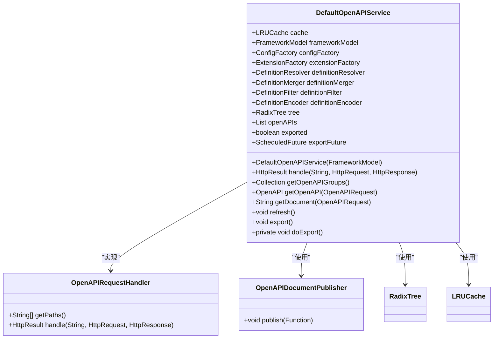

**图示来源**
- [DefaultOpenAPIService.java](file://dubbo-plugin\dubbo-rest-openapi\src\main\java\org\apache\dubbo\rpc\protocol\tri\rest\openapi\DefaultOpenAPIService.java)
- [OpenAPIRequestHandler.java](file://dubbo-plugin\dubbo-rest-openapi\src\main\java\org\apache\dubbo\rpc\protocol\tri\rest\openapi\OpenAPIRequestHandler.java)

**本节来源**
- [DefaultOpenAPIService.java](file://dubbo-plugin\dubbo-rest-openapi\src\main\java\org\apache\dubbo\rpc\protocol\tri\rest\openapi\DefaultOpenAPIService.java)

### 安全性配置

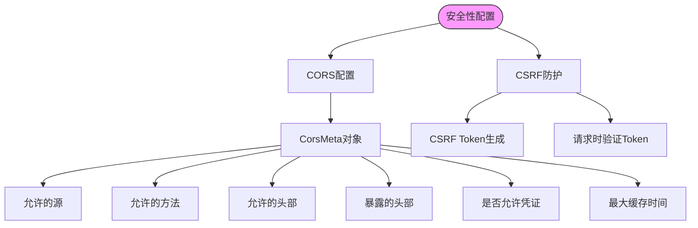

**本节来源**
- [SpringMvcRequestMappingResolver.java](file://dubbo-plugin\dubbo-rest-spring\src\main\java\org\apache\dubbo\rpc\protocol\tri\rest\support\spring\SpringMvcRequestMappingResolver.java)
- [CorsUtils.java](file://dubbo-rpc\dubbo-rpc-triple\src\main\java\org\apache\dubbo\rpc\protocol\tri\rest\cors\CorsUtils.java)

### 性能优化

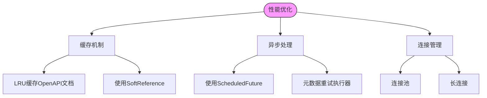

**本节来源**
- [DefaultOpenAPIService.java](file://dubbo-plugin\dubbo-rest-openapi\src\main\java\org\apache\dubbo\rpc\protocol\tri\rest\openapi\DefaultOpenAPIService.java)
- [RestRequestHandlerMapping.java](file://dubbo-rpc\dubbo-rpc-triple\src\main\java\org\apache\dubbo\rpc\protocol\tri\rest\mapping\RestRequestHandlerMapping.java)

## 结论
Dubbo的REST协议为微服务架构提供了强大的Web集成能力。通过支持JAX-RS和Spring MVC注解，开发者可以轻松地将现有RESTful服务迁移到Dubbo平台，同时也能通过Dubbo调用外部RESTful API。协议基于HTTP/1.1传输，支持JSON和XML序列化，提供了完整的参数绑定、异常处理和文件上传下载功能。通过OpenAPI/Swagger集成，可以自动生成API文档，提高开发效率。安全性配置和性能优化特性使得该协议适用于生产环境。对于希望将传统Web框架与Dubbo集成的开发者，本协议提供了平滑的迁移路径和丰富的扩展点。