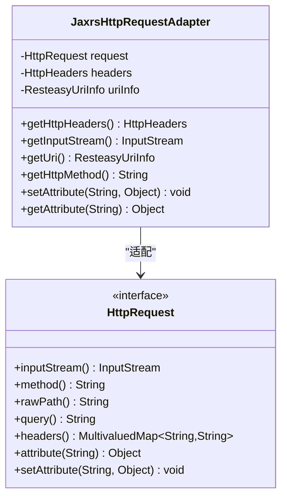
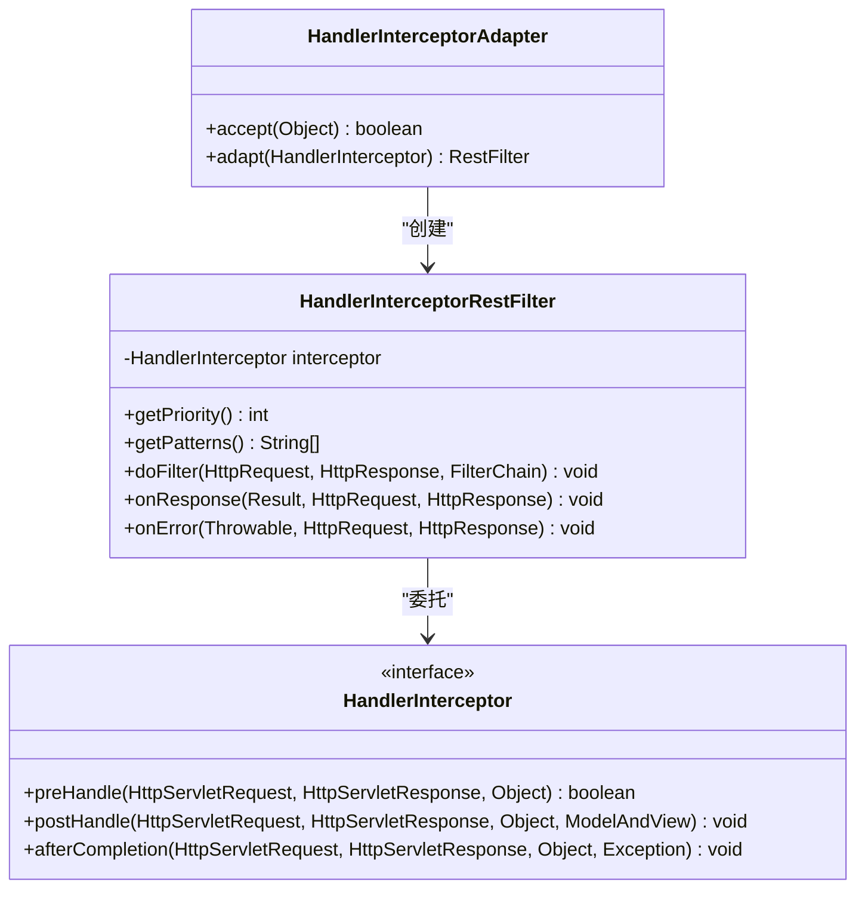
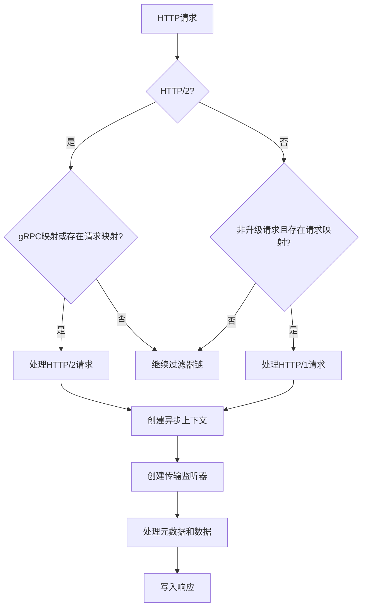
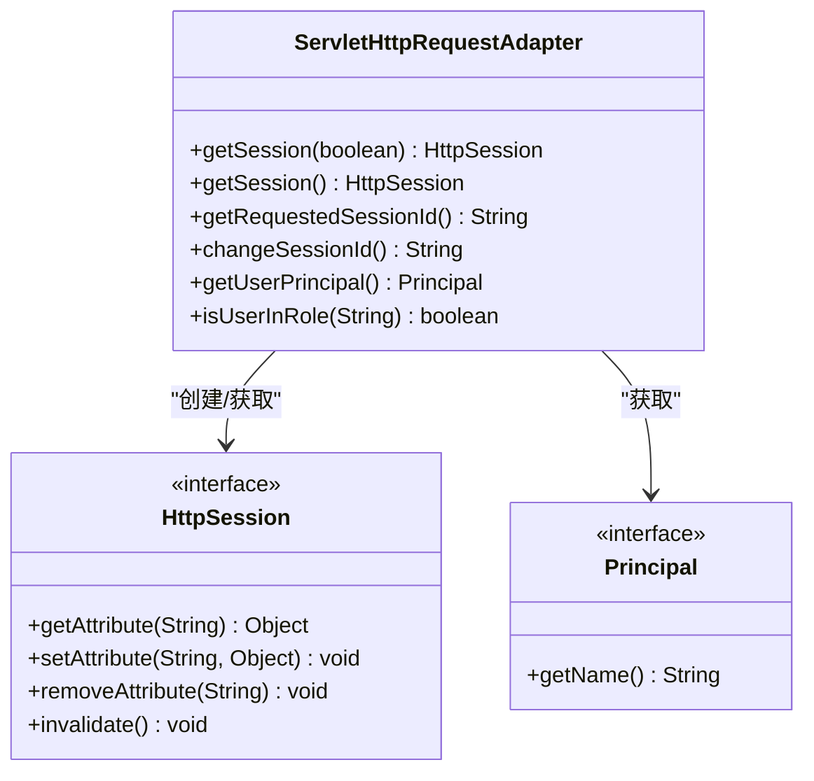
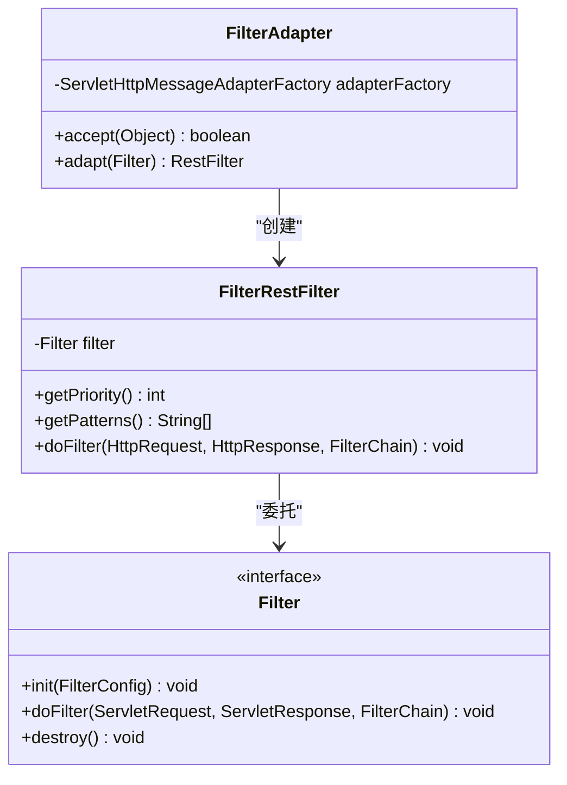
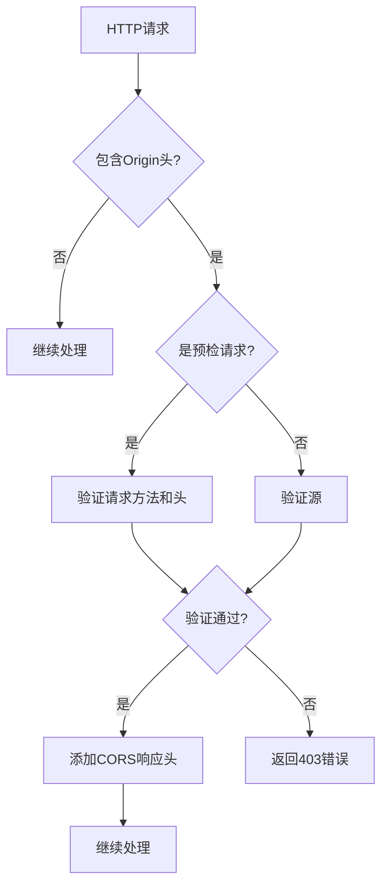
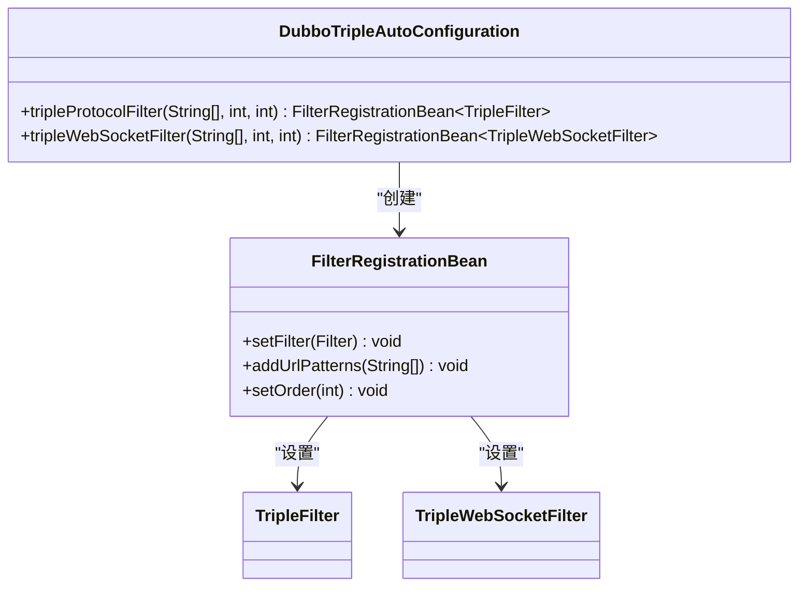

# Web框架集成

<cite>
**本文档中引用的文件**  
- [JaxrsHttpRequestAdapter.java](file://dubbo-plugin\dubbo-rest-jaxrs\src\main\java\org\apache\dubbo\rpc\protocol\tri\rest\support\jaxrs\JaxrsHttpRequestAdapter.java)
- [HandlerInterceptorAdapter.java](file://dubbo-plugin\dubbo-rest-spring\src\main\java\org\apache\dubbo\rpc\protocol\tri\rest\support\spring\HandlerInterceptorAdapter.java)
- [TripleFilter.java](file://dubbo-plugin\dubbo-triple-servlet\src\main\java\org\apache\dubbo\rpc\protocol\tri\servlet\TripleFilter.java)
- [CorsHeaderFilter.java](file://dubbo-rpc\dubbo-rpc-triple\src\main\java\org\apache\dubbo\rpc\protocol\tri\rest\cors\CorsHeaderFilter.java)
- [FilterAdapter.java](file://dubbo-plugin\dubbo-triple-servlet\src\main\java\org\apache\dubbo\rpc\protocol\tri\rest\support\servlet\FilterAdapter.java)
- [DubboTripleAutoConfiguration.java](file://dubbo-spring-boot-project\dubbo-spring-boot-autoconfigure\src\main\java\org\apache\dubbo\spring\boot\autoconfigure\DubboTripleAutoConfiguration.java)
- [application.yml](file://dubbo-demo\dubbo-demo-spring-boot\dubbo-demo-spring-boot-servlet\src\main\resources\application.yml)
</cite>

## 目录
1. [引言](#引言)
2. [REST协议与主流Web框架集成](#rest协议与主流web框架集成)
3. [JAX-RS集成机制](#jax-rs集成机制)
4. [Spring MVC集成机制](#spring-mvc集成机制)
5. [TripleFilter实现原理](#triplefilter实现原理)
6. [会话管理与拦截器链](#会话管理与拦截器链)
7. [过滤器与AOP支持](#过滤器与aop支持)
8. [Web安全特性](#web安全特性)
9. [实际集成示例](#实际集成示例)
10. [兼容性考虑](#兼容性考虑)
11. [结论](#结论)

## 引言
本文档详细介绍了Dubbo框架中REST协议与主流Web框架（JAX-RS和Spring MVC）的集成方式。文档重点阐述了请求适配器、拦截器、过滤器等核心组件的实现机制，以及如何将Dubbo服务暴露为标准的Servlet端点。同时，文档还涵盖了跨域（CORS）、CSRF防护、安全认证等Web安全特性，并提供了在现有Web应用中集成Dubbo REST服务的实际示例。

## REST协议与主流Web框架集成
Dubbo通过插件化架构实现了与主流Web框架的无缝集成。核心机制是通过适配器模式将Dubbo的RPC调用转换为标准的HTTP请求/响应，同时保持与现有Web框架的兼容性。集成主要通过以下组件实现：
- **请求适配器**：将HTTP请求转换为Dubbo内部的请求格式
- **拦截器适配器**：将Web框架的拦截器集成到Dubbo的过滤器链中
- **Servlet过滤器**：将Dubbo服务暴露为标准的Servlet端点

**Section sources**
- [JaxrsHttpRequestAdapter.java](file://dubbo-plugin\dubbo-rest-jaxrs\src\main\java\org\apache\dubbo\rpc\protocol\tri\rest\support\jaxrs\JaxrsHttpRequestAdapter.java)
- [HandlerInterceptorAdapter.java](file://dubbo-plugin\dubbo-rest-spring\src\main\java\org\apache\dubbo\rpc\protocol\tri\rest\support\spring\HandlerInterceptorAdapter.java)

## JAX-RS集成机制
Dubbo通过`JaxrsHttpRequestAdapter`类实现与JAX-RS框架的集成。该适配器实现了JAX-RS的`HttpRequest`接口，将Dubbo的`HttpRequest`对象转换为JAX-RS框架可以识别的格式。



**Diagram sources**
- [JaxrsHttpRequestAdapter.java](file://dubbo-plugin\dubbo-rest-jaxrs\src\main\java\org\apache\dubbo\rpc\protocol\tri\rest\support\jaxrs\JaxrsHttpRequestAdapter.java)

**Section sources**
- [JaxrsHttpRequestAdapter.java](file://dubbo-plugin\dubbo-rest-jaxrs\src\main\java\org\apache\dubbo\rpc\protocol\tri\rest\support\jaxrs\JaxrsHttpRequestAdapter.java)

## Spring MVC集成机制
Dubbo通过`HandlerInterceptorAdapter`类实现与Spring MVC框架的集成。该适配器实现了`RestExtensionAdapter`接口，将Spring MVC的`HandlerInterceptor`转换为Dubbo的`RestFilter`。



**Diagram sources**
- [HandlerInterceptorAdapter.java](file://dubbo-plugin\dubbo-rest-spring\src\main\java\org\apache\dubbo\rpc\protocol\tri\rest\support\spring\HandlerInterceptorAdapter.java)

**Section sources**
- [HandlerInterceptorAdapter.java](file://dubbo-plugin\dubbo-rest-spring\src\main\java\org\apache\dubbo\rpc\protocol\tri\rest\support\spring\HandlerInterceptorAdapter.java)

## TripleFilter实现原理
`TripleFilter`是Dubbo将服务暴露为标准Servlet端点的核心组件。它通过Servlet过滤器机制拦截HTTP请求，并根据请求协议（HTTP/1.1或HTTP/2）和内容类型决定如何处理请求。



**Diagram sources**
- [TripleFilter.java](file://dubbo-plugin\dubbo-triple-servlet\src\main\java\org\apache\dubbo\rpc\protocol\tri\servlet\TripleFilter.java)

**Section sources**
- [TripleFilter.java](file://dubbo-plugin\dubbo-triple-servlet\src\main\java\org\apache\dubbo\rpc\protocol\tri\servlet\TripleFilter.java)

## 会话管理与拦截器链
Dubbo通过`ServletHttpRequestAdapter`类提供会话管理功能。该适配器实现了Servlet的`HttpServletRequest`接口，支持会话相关的方法。



**Diagram sources**
- [ServletHttpRequestAdapter.java](file://dubbo-plugin\dubbo-triple-servlet\src\main\java\org\apache\dubbo\rpc\protocol\tri\rest\support\servlet\ServletHttpRequestAdapter.java)

**Section sources**
- [ServletHttpRequestAdapter.java](file://dubbo-plugin\dubbo-triple-servlet\src\main\java\org\apache\dubbo\rpc\protocol\tri\rest\support\servlet\ServletHttpRequestAdapter.java)

## 过滤器与AOP支持
Dubbo通过`FilterAdapter`类实现与标准Servlet过滤器的集成。该适配器将Servlet过滤器转换为Dubbo的`RestFilter`，并将其加入到过滤器链中。



**Diagram sources**
- [FilterAdapter.java](file://dubbo-plugin\dubbo-triple-servlet\src\main\java\org\apache\dubbo\rpc\protocol\tri\rest\support\servlet\FilterAdapter.java)

**Section sources**
- [FilterAdapter.java](file://dubbo-plugin\dubbo-triple-servlet\src\main\java\org\apache\dubbo\rpc\protocol\tri\rest\support\servlet\FilterAdapter.java)

## Web安全特性
### 跨域(CORS)支持
Dubbo通过`CorsHeaderFilter`类实现CORS支持。该过滤器根据配置的CORS元数据处理跨域请求，包括预检请求和实际请求。



**Diagram sources**
- [CorsHeaderFilter.java](file://dubbo-rpc\dubbo-rpc-triple\src\main\java\org\apache\dubbo\rpc\protocol\tri\rest\cors\CorsHeaderFilter.java)

### CSRF防护
Dubbo通过集成Spring Security等安全框架实现CSRF防护。开发者可以在Spring配置中启用CSRF保护，并配置相应的过滤器。

### 安全认证
Dubbo支持通过拦截器和过滤器实现安全认证。开发者可以实现自定义的认证逻辑，如JWT验证、OAuth2等。

**Section sources**
- [CorsHeaderFilter.java](file://dubbo-rpc\dubbo-rpc-triple\src\main\java\org\apache\dubbo\rpc\protocol\tri\rest\cors\CorsHeaderFilter.java)

## 实际集成示例
### Spring Boot配置
在Spring Boot应用中，可以通过配置文件启用Dubbo REST服务：

```yaml
dubbo:
  servlet:
    enabled: true
    filter-url-patterns: "/*"
    filter-order: -1000000
  server:
    port: 8080
```

**Diagram sources**
- [application.yml](file://dubbo-demo\dubbo-demo-spring-boot\dubbo-demo-spring-boot-servlet\src\main\resources\application.yml)

### 自动配置
Dubbo通过`DubboTripleAutoConfiguration`类提供自动配置功能，自动注册必要的Servlet过滤器。



**Diagram sources**
- [DubboTripleAutoConfiguration.java](file://dubbo-spring-boot-project\dubbo-spring-boot-autoconfigure\src\main\java\org\apache\dubbo\spring\boot\autoconfigure\DubboTripleAutoConfiguration.java)

**Section sources**
- [DubboTripleAutoConfiguration.java](file://dubbo-spring-boot-project\dubbo-spring-boot-autoconfigure\src\main\java\org\apache\dubbo\spring\boot\autoconfigure\DubboTripleAutoConfiguration.java)
- [application.yml](file://dubbo-demo\dubbo-demo-spring-boot\dubbo-demo-spring-boot-servlet\src\main\resources\application.yml)

## 兼容性考虑
在将Dubbo REST服务集成到现有Web应用时，需要考虑以下兼容性问题：
- **URL映射冲突**：确保Dubbo服务的URL映射不会与现有应用的映射冲突
- **过滤器顺序**：合理配置过滤器的执行顺序，确保安全过滤器在Dubbo过滤器之前执行
- **会话管理**：确保会话管理机制与现有应用兼容
- **异常处理**：统一异常处理机制，确保错误响应格式一致

## 结论
Dubbo通过灵活的适配器模式和插件化架构，实现了与主流Web框架的无缝集成。通过`JaxrsHttpRequestAdapter`、`HandlerInterceptorAdapter`和`TripleFilter`等核心组件，Dubbo能够将服务暴露为标准的RESTful API，同时保持与现有Web应用架构的兼容性。开发者可以利用这些机制，在现有Web应用中轻松集成Dubbo服务，并享受Dubbo带来的高性能RPC调用优势。