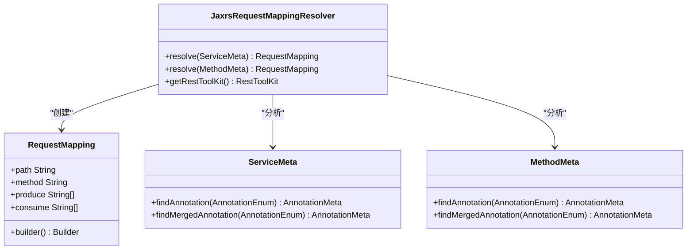
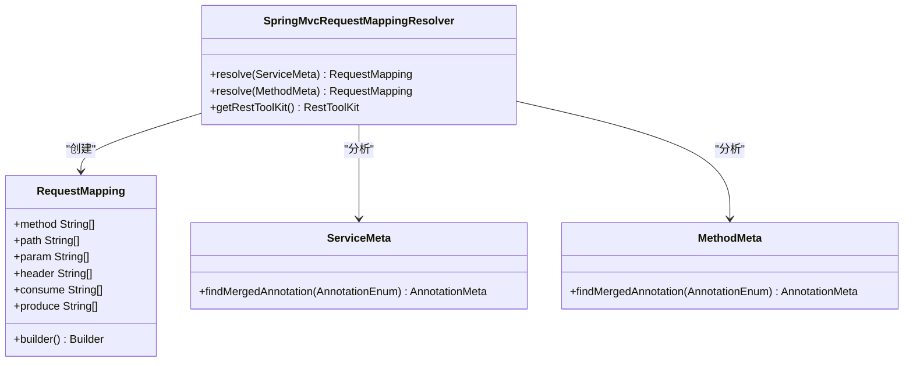
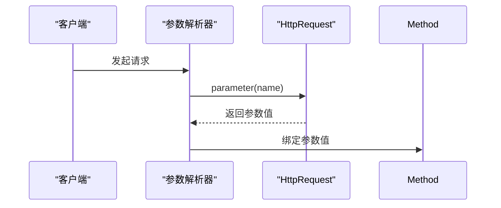
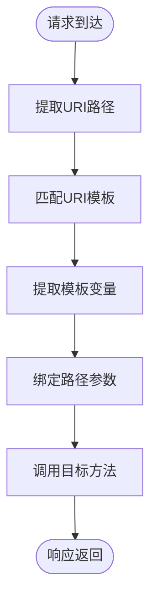
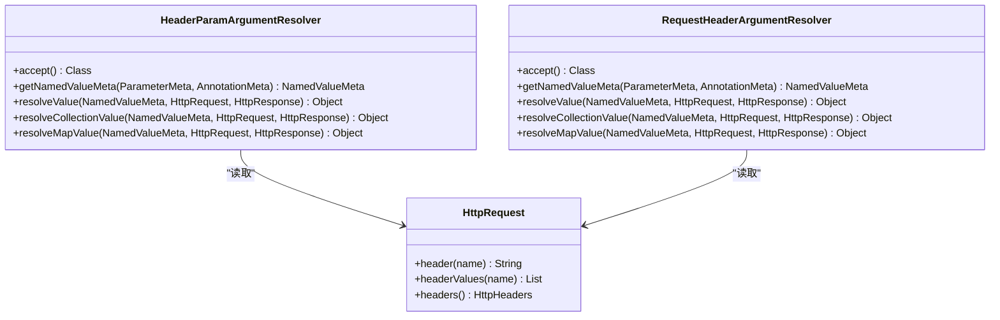
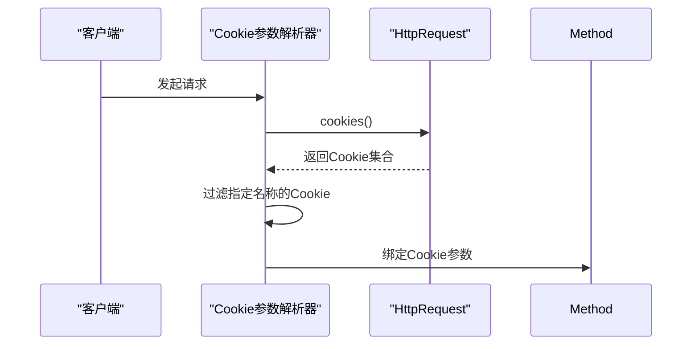
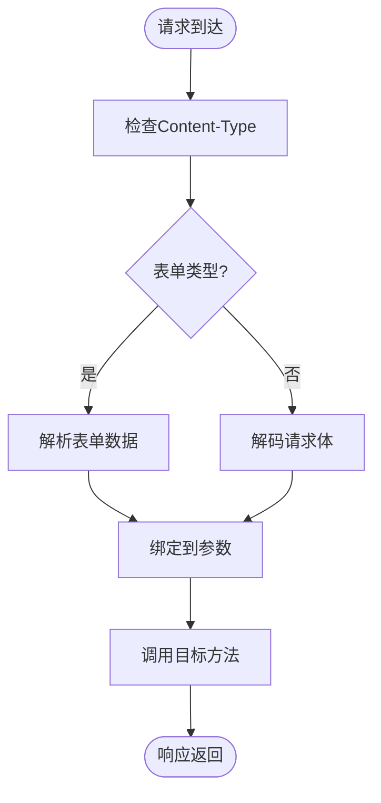
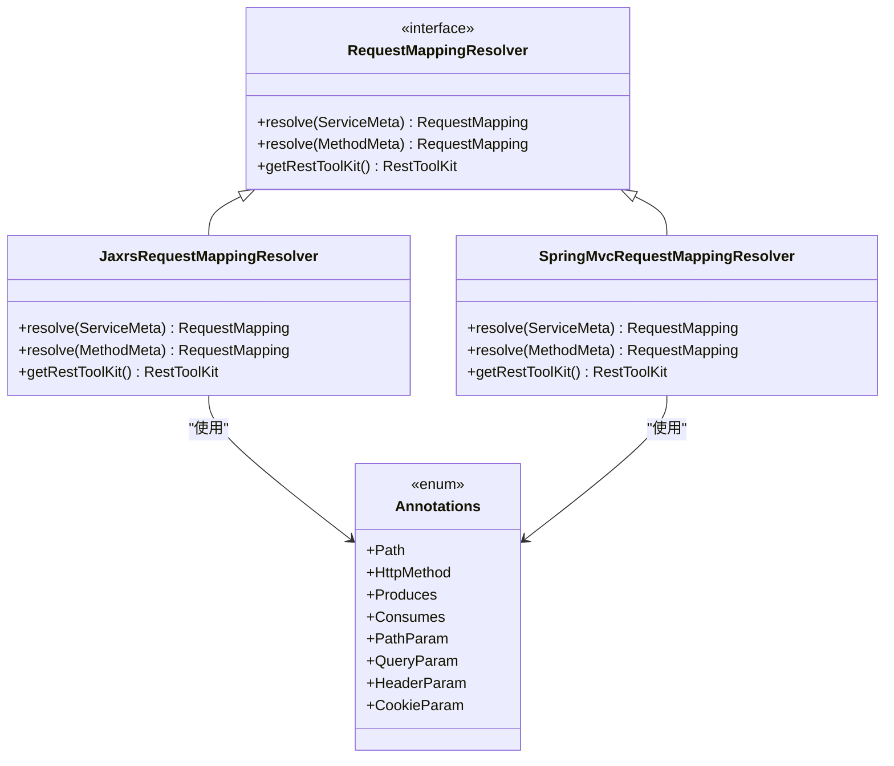
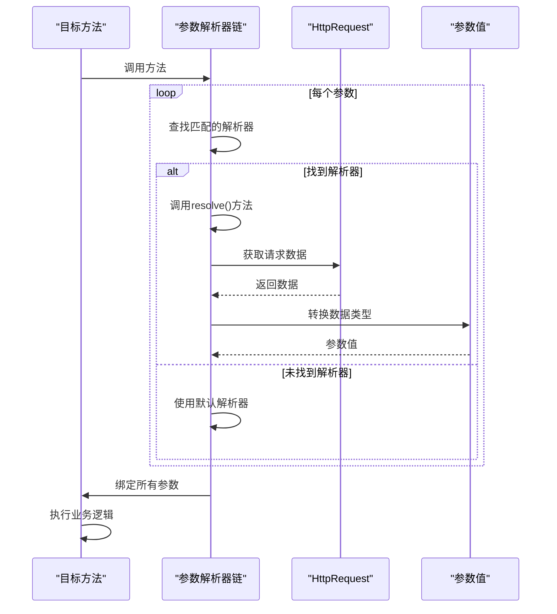
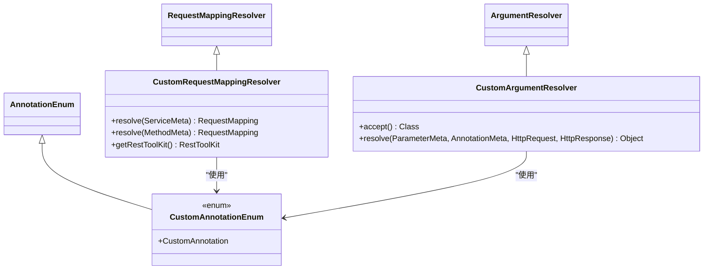

# 注解支持

<cite>
**本文档中引用的文件**   
- [JaxrsRequestMappingResolver.java](file://dubbo-plugin\dubbo-rest-jaxrs\src\main\java\org\apache\dubbo\rpc\protocol\tri\rest\support\jaxrs\JaxrsRequestMappingResolver.java)
- [SpringMvcRequestMappingResolver.java](file://dubbo-plugin\dubbo-rest-spring\src\main\java\org\apache\dubbo\rpc\protocol\tri\rest\support\spring\SpringMvcRequestMappingResolver.java)
- [Annotations.java](file://dubbo-plugin\dubbo-rest-jaxrs\src\main\java\org\apache\dubbo\rpc\protocol\tri\rest\support\jaxrs\Annotations.java)
- [Annotations.java](file://dubbo-plugin\dubbo-rest-spring\src\main\java\org\apache\dubbo\rpc\protocol\tri\rest\support\spring\Annotations.java)
- [QueryParamArgumentResolver.java](file://dubbo-plugin\dubbo-rest-jaxrs\src\main\java\org\apache\dubbo\rpc\protocol\tri\rest\support\jaxrs\QueryParamArgumentResolver.java)
- [RequestParamArgumentResolver.java](file://dubbo-plugin\dubbo-rest-spring\src\main\java\org\apache\dubbo\rpc\protocol\tri\rest\support\spring\RequestParamArgumentResolver.java)
- [PathParamArgumentResolver.java](file://dubbo-plugin\dubbo-rest-jaxrs\src\main\java\org\apache\dubbo\rpc\protocol\tri\rest\support\jaxrs\PathParamArgumentResolver.java)
- [PathVariableArgumentResolver.java](file://dubbo-plugin\dubbo-rest-spring\src\main\java\org\apache\dubbo\rpc\protocol\tri\rest\support\spring\PathVariableArgumentResolver.java)
- [HeaderParamArgumentResolver.java](file://dubbo-plugin\dubbo-rest-jaxrs\src\main\java\org\apache\dubbo\rpc\protocol\tri\rest\support\jaxrs\HeaderParamArgumentResolver.java)
- [RequestHeaderArgumentResolver.java](file://dubbo-plugin\dubbo-rest-spring\src\main\java\org\apache\dubbo\rpc\protocol\tri\rest\support\spring\RequestHeaderArgumentResolver.java)
- [CookieParamArgumentResolver.java](file://dubbo-plugin\dubbo-rest-jaxrs\src\main\java\org\apache\dubbo\rpc\protocol\tri\rest\support\jaxrs\CookieParamArgumentResolver.java)
- [RequestBodyArgumentResolver.java](file://dubbo-plugin\dubbo-rest-spring\src\main\java\org\apache\dubbo\rpc\protocol\tri\rest\support\spring\RequestBodyArgumentResolver.java)
- [RequestMappingResolver.java](file://dubbo-rpc\dubbo-rpc-triple\src\main\java\org\apache\dubbo\rpc\protocol\tri\rest\mapping\RequestMappingResolver.java)
</cite>

## 目录
1. [引言](#引言)
2. [REST注解支持概述](#rest注解支持概述)
3. [HTTP方法注解](#http方法注解)
4. [参数绑定注解](#参数绑定注解)
5. [REST资源定义](#rest资源定义)
6. [注解解析器工作原理](#注解解析器工作原理)
7. [最佳实践与扩展](#最佳实践与扩展)
8. [结论](#结论)

## 引言
Dubbo框架提供了对REST协议的全面支持，允许开发者使用JAX-RS和Spring MVC注解来定义RESTful服务。本文档详细介绍了Dubbo如何通过注解支持REST协议，包括路径映射、HTTP方法绑定、参数绑定和内容类型协商等核心功能。文档将深入分析注解解析器的工作机制，并为开发者提供使用这些注解的最佳实践。

## REST注解支持概述
Dubbo通过`dubbo-rest-jaxrs`和`dubbo-rest-spring`两个插件模块分别支持JAX-RS和Spring MVC注解。这些插件实现了统一的注解解析机制，将标准的REST注解转换为Dubbo的路由规则，从而在Dubbo服务中暴露REST接口。

JAX-RS支持模块通过`JaxrsRequestMappingResolver`类处理javax.ws.rs包下的注解，而Spring MVC支持模块通过`SpringMvcRequestMappingResolver`类处理org.springframework.web.bind.annotation包下的注解。两个解析器都实现了`RequestMappingResolver`接口，确保了统一的解析流程。

**本节来源**
- [JaxrsRequestMappingResolver.java](file://dubbo-plugin\dubbo-rest-jaxrs\src\main\java\org\apache\dubbo\rpc\protocol\tri\rest\support\jaxrs\JaxrsRequestMappingResolver.java)
- [SpringMvcRequestMappingResolver.java](file://dubbo-plugin\dubbo-rest-spring\src\main\java\org\apache\dubbo\rpc\protocol\tri\rest\support\spring\SpringMvcRequestMappingResolver.java)
- [RequestMappingResolver.java](file://dubbo-rpc\dubbo-rpc-triple\src\main\java\org\apache\dubbo\rpc\protocol\tri\rest\mapping\RequestMappingResolver.java)

## HTTP方法注解
Dubbo支持通过注解定义HTTP方法绑定，包括@GET、@POST、@PUT和@DELETE等标准HTTP方法注解。

### JAX-RS方法注解
在JAX-RS支持中，HTTP方法通过`@HttpMethod`元注解定义，具体的HTTP方法注解如`@GET`、`@POST`等都是`@HttpMethod`的特化。`JaxrsRequestMappingResolver`通过查找方法上的HTTP方法注解来确定请求的HTTP方法类型。



**图示来源**
- [JaxrsRequestMappingResolver.java](file://dubbo-plugin\dubbo-rest-jaxrs\src\main\java\org\apache\dubbo\rpc\protocol\tri\rest\support\jaxrs\JaxrsRequestMappingResolver.java#L34-L106)

### Spring MVC方法注解
在Spring MVC支持中，HTTP方法通过`@RequestMapping`注解的method属性来指定。`SpringMvcRequestMappingResolver`从`@RequestMapping`或`@HttpExchange`注解中提取HTTP方法信息，并将其转换为相应的HTTP方法。



**图示来源**
- [SpringMvcRequestMappingResolver.java](file://dubbo-plugin\dubbo-rest-spring\src\main\java\org\apache\dubbo\rpc\protocol\tri\rest\support\spring\SpringMvcRequestMappingResolver.java#L37-L155)

## 参数绑定注解
Dubbo提供了丰富的参数绑定注解支持，允许开发者将HTTP请求中的各种数据绑定到方法参数上。

### 查询参数绑定
查询参数通过`@QueryParam`（JAX-RS）或`@RequestParam`（Spring MVC）注解进行绑定。这些注解解析器从HTTP请求的查询字符串中提取参数值。



**图示来源**
- [QueryParamArgumentResolver.java](file://dubbo-plugin\dubbo-rest-jaxrs\src\main\java\org\apache\dubbo\rpc\protocol\tri\rest\support\jaxrs\QueryParamArgumentResolver.java#L29-L55)
- [RequestParamArgumentResolver.java](file://dubbo-plugin\dubbo-rest-spring\src\main\java\org\apache\dubbo\rpc\protocol\tri\rest\support\spring\RequestParamArgumentResolver.java#L29-L55)

### 路径参数绑定
路径参数通过`@PathParam`（JAX-RS）或`@PathVariable`（Spring MVC）注解进行绑定。这些注解解析器从URI模板变量中提取参数值。



**图示来源**
- [PathParamArgumentResolver.java](file://dubbo-plugin\dubbo-rest-jaxrs\src\main\java\org\apache\dubbo\rpc\protocol\tri\rest\support\jaxrs\PathParamArgumentResolver.java#L37-L76)
- [PathVariableArgumentResolver.java](file://dubbo-plugin\dubbo-rest-spring\src\main\java\org\apache\dubbo\rpc\protocol\tri\rest\support\spring\PathVariableArgumentResolver.java#L37-L73)

### 头部参数绑定
头部参数通过`@HeaderParam`（JAX-RS）或`@RequestHeader`（Spring MVC）注解进行绑定。这些注解解析器从HTTP请求头中提取参数值。



**图示来源**
- [HeaderParamArgumentResolver.java](file://dubbo-plugin\dubbo-rest-jaxrs\src\main\java\org\apache\dubbo\rpc\protocol\tri\rest\support\jaxrs\HeaderParamArgumentResolver.java#L28-L54)
- [RequestHeaderArgumentResolver.java](file://dubbo-plugin\dubbo-rest-spring\src\main\java\org\apache\dubbo\rpc\protocol\tri\rest\support\spring\RequestHeaderArgumentResolver.java)

### Cookie参数绑定
Cookie参数通过`@CookieParam`（JAX-RS）注解进行绑定。该注解解析器从HTTP请求的Cookie头中提取参数值。



**图示来源**
- [CookieParamArgumentResolver.java](file://dubbo-plugin\dubbo-rest-jaxrs\src\main\java\org\apache\dubbo\rpc\protocol\tri\rest\support\jaxrs\CookieParamArgumentResolver.java#L35-L80)

### 请求体参数绑定
请求体参数通过`@RequestBody`（Spring MVC）注解进行绑定。该注解解析器从HTTP请求体中提取并反序列化数据。



**图示来源**
- [RequestBodyArgumentResolver.java](file://dubbo-plugin\dubbo-rest-spring\src\main\java\org\apache\dubbo\rpc\protocol\tri\rest\support\spring\RequestBodyArgumentResolver.java#L34-L85)

## REST资源定义
Dubbo通过注解系统支持完整的REST资源定义，包括路径映射、HTTP方法绑定和内容类型协商。

### 路径映射
路径映射通过`@Path`（JAX-RS）或`@RequestMapping`（Spring MVC）注解定义。这些注解指定了资源的访问路径，支持路径模板和变量。

```mermaid
erDiagram
RESOURCE ||--o{ METHOD : "包含"
RESOURCE {
string path
string produces[]
string consumes[]
}
METHOD {
string path
string method
string produces[]
string consumes[]
}
METHOD ||--o{ PARAMETER : "包含"
PARAMETER {
string name
ParamType type
boolean required
}
PARAMETER }o--|> QUERY_PARAM : "查询参数"
PARAMETER }o--|> PATH_PARAM : "路径参数"
PARAMETER }o--|> HEADER_PARAM : "头部参数"
PARAMETER }o--|> COOKIE_PARAM : "Cookie参数"
PARAMETER }o--|> BODY_PARAM : "请求体参数"
```

**图示来源**
- [JaxrsRequestMappingResolver.java](file://dubbo-plugin\dubbo-rest-jaxrs\src\main\java\org\apache\dubbo\rpc\protocol\tri\rest\support\jaxrs\JaxrsRequestMappingResolver.java#L55-L63)
- [SpringMvcRequestMappingResolver.java](file://dubbo-plugin\dubbo-rest-spring\src\main\java\org\apache\dubbo\rpc\protocol\tri\rest\support\spring\SpringMvcRequestMappingResolver.java#L58-L75)

### 内容类型协商
内容类型协商通过`@Produces`（JAX-RS）或`@RequestMapping.produces`（Spring MVC）和`@Consumes`（JAX-RS）或`@RequestMapping.consumes`（Spring MVC）注解实现。这些注解指定了资源支持的媒体类型。

```mermaid
stateDiagram-v2
[*] --> RequestReceived
RequestReceived --> CheckAcceptHeader : "检查Accept头"
CheckAcceptHeader --> FindMatchingType : "查找匹配的produces类型"
FindMatchingType --> IsMatch{"找到匹配?"}
IsMatch --> |是| SetContentType : "设置响应Content-Type"
IsMatch --> |否| Return406 : "返回406 Not Acceptable"
SetContentType --> ProcessRequest
ProcessRequest --> CheckContentType : "检查Content-Type头"
CheckContentType --> IsSupported{"类型支持?"}
IsSupported --> |是| ParseRequestBody
IsSupported --> |否| Return415 : "返回415 Unsupported Media Type"
ParseRequestBody --> InvokeMethod
InvokeMethod --> ReturnResponse
ReturnResponse --> [*]
```

**图示来源**
- [JaxrsRequestMappingResolver.java](file://dubbo-plugin\dubbo-rest-jaxrs\src\main\java\org\apache\dubbo\rpc\protocol\tri\rest\support\jaxrs\JaxrsRequestMappingResolver.java#L96-L102)
- [SpringMvcRequestMappingResolver.java](file://dubbo-plugin\dubbo-rest-spring\src\main\java\org\apache\dubbo\rpc\protocol\tri\rest\support\spring\SpringMvcRequestMappingResolver.java#L125-L128)

## 注解解析器工作原理
Dubbo的注解解析器采用统一的架构设计，通过`RequestMappingResolver`接口定义了标准的解析流程。

### 解析器激活机制
注解解析器通过`@Activate`注解的`onClass`属性实现条件激活。当类路径中存在相应的注解类时，对应的解析器才会被激活。



**图示来源**
- [JaxrsRequestMappingResolver.java](file://dubbo-plugin\dubbo-rest-jaxrs\src\main\java\org\apache\dubbo\rpc\protocol\tri\rest\support\jaxrs\JaxrsRequestMappingResolver.java#L33-L34)
- [SpringMvcRequestMappingResolver.java](file://dubbo-plugin\dubbo-rest-spring\src\main\java\org\apache\dubbo\rpc\protocol\tri\rest\support\spring\SpringMvcRequestMappingResolver.java#L36-L37)
- [Annotations.java](file://dubbo-plugin\dubbo-rest-jaxrs\src\main\java\org\apache\dubbo\rpc\protocol\tri\rest\support\jaxrs\Annotations.java#L23-L41)
- [Annotations.java](file://dubbo-plugin\dubbo-rest-spring\src\main\java\org\apache\dubbo\rpc\protocol\tri\rest\support\spring\Annotations.java#L23-L39)

### 参数解析流程
参数解析器采用责任链模式，每个解析器负责处理特定类型的注解。解析器通过`accept()`方法声明支持的注解类型，并在`resolve()`方法中执行具体的解析逻辑。



**图示来源**
- [QueryParamArgumentResolver.java](file://dubbo-plugin\dubbo-rest-jaxrs\src\main\java\org\apache\dubbo\rpc\protocol\tri\rest\support\jaxrs\QueryParamArgumentResolver.java#L31-L33)
- [RequestParamArgumentResolver.java](file://dubbo-plugin\dubbo-rest-spring\src\main\java\org\apache\dubbo\rpc\protocol\tri\rest\support\spring\RequestParamArgumentResolver.java#L31-L33)

## 最佳实践与扩展
### 初学者使用最佳实践
1. **统一注解风格**：在一个项目中选择JAX-RS或Spring MVC注解风格，避免混合使用。
2. **明确路径定义**：使用`@Path`或`@RequestMapping`明确定义资源路径，避免路径冲突。
3. **合理使用参数注解**：根据参数来源选择合适的注解，如查询参数用`@QueryParam`，路径参数用`@PathParam`。
4. **内容类型声明**：使用`@Produces`和`@Consumes`明确声明支持的媒体类型，提高API的可发现性。

### 高级开发者扩展方式
高级开发者可以通过实现自定义注解处理器来扩展Dubbo的REST支持功能。主要扩展点包括：

1. **自定义RequestMappingResolver**：实现`RequestMappingResolver`接口，支持新的注解框架。
2. **自定义ArgumentResolver**：实现`ArgumentResolver`接口，支持新的参数绑定方式。
3. **自定义AnnotationEnum**：扩展注解枚举，支持新的注解类型。



**本节来源**
- [JaxrsRequestMappingResolver.java](file://dubbo-plugin\dubbo-rest-jaxrs\src\main\java\org\apache\dubbo\rpc\protocol\tri\rest\support\jaxrs\JaxrsRequestMappingResolver.java)
- [SpringMvcRequestMappingResolver.java](file://dubbo-plugin\dubbo-rest-spring\src\main\java\org\apache\dubbo\rpc\protocol\tri\rest\support\spring\SpringMvcRequestMappingResolver.java)
- [QueryParamArgumentResolver.java](file://dubbo-plugin\dubbo-rest-jaxrs\src\main\java\org\apache\dubbo\rpc\protocol\tri\rest\support\jaxrs\QueryParamArgumentResolver.java)
- [RequestParamArgumentResolver.java](file://dubbo-plugin\dubbo-rest-spring\src\main\java\org\apache\dubbo\rpc\protocol\tri\rest\support\spring\RequestParamArgumentResolver.java)

## 结论
Dubbo通过`dubbo-rest-jaxrs`和`dubbo-rest-spring`插件提供了对JAX-RS和Spring MVC注解的全面支持。通过`JaxrsRequestMappingResolver`和`SpringMvcRequestMappingResolver`两个核心解析器，Dubbo能够将标准的REST注解转换为内部的路由规则，从而在Dubbo服务中暴露REST接口。

注解解析器采用统一的架构设计，通过`RequestMappingResolver`接口定义了标准的解析流程。参数绑定机制通过一系列`ArgumentResolver`实现，每个解析器负责处理特定类型的注解，确保了扩展性和灵活性。

对于初学者，建议遵循最佳实践，选择统一的注解风格并合理使用各种注解。对于高级开发者，可以通过实现自定义的解析器和处理器来扩展Dubbo的REST支持功能，满足特定的业务需求。