# 消息转换

<cite>
**本文档中引用的文件**  
- [JsonCodec.java](file://dubbo-remoting\dubbo-remoting-http12\src\main\java\org\apache\dubbo\remoting\http12\message\codec\JsonCodec.java)
- [XmlCodec.java](file://dubbo-remoting\dubbo-remoting-http12\src\main\java\org\apache\dubbo\remoting\http12\message\codec\XmlCodec.java)
- [ParamConverterFactory.java](file://dubbo-plugin\dubbo-rest-jaxrs\src\main\java\org\apache\dubbo\rpc\protocol\tri\rest\support\jaxrs\ParamConverterFactory.java)
- [CompositeArgumentResolver.java](file://dubbo-rpc\dubbo-rpc-triple\src\main\java\org\apache\dubbo\rpc\protocol\tri\rest\argument\CompositeArgumentResolver.java)
- [CompositeArgumentConverter.java](file://dubbo-rpc\dubbo-rpc-triple\src\main\java\org\apache\dubbo\rpc\protocol\tri\rest\argument\CompositeArgumentConverter.java)
- [ContentNegotiator.java](file://dubbo-rpc\dubbo-rpc-triple\src\main\java\org\apache\dubbo\rpc\protocol\tri\rest\mapping\ContentNegotiator.java)
- [MultiValueMapCreator.java](file://dubbo-plugin\dubbo-rest-spring\src\main\java\org\apache\dubbo\rpc\protocol\tri\rest\support\spring\MultiValueMapCreator.java)
- [MultivaluedMapCreator.java](file://dubbo-plugin\dubbo-rest-jaxrs\src\main\java\org\apache\dubbo\rpc\protocol\tri\rest\support\jaxrs\MultivaluedMapCreator.java)
</cite>

## 目录
1. [引言](#引言)
2. [REST协议消息转换机制](#rest协议消息转换机制)
3. [JSON和XML序列化/反序列化](#json和xml序列化反序列化)
4. [请求参数到方法参数的转换](#请求参数到方法参数的转换)
5. [复杂对象、集合和文件上传处理](#复杂对象集合和文件上传处理)
6. [消息体转换器和多值映射创建器](#消息体转换器和多值映射创建器)
7. [自定义消息转换逻辑](#自定义消息转换逻辑)
8. [内容协商与媒体类型支持](#内容协商与媒体类型支持)
9. [字符编码处理](#字符编码处理)
10. [性能优化建议](#性能优化建议)

## 引言

Dubbo框架中的REST协议消息转换机制是实现服务间通信的核心组件之一。该机制负责处理HTTP请求和响应中的消息转换，包括JSON和XML的序列化/反序列化、请求参数到方法参数的转换、复杂对象和集合的处理等。本文档详细介绍了这一机制的实现原理和使用方法，为开发者提供全面的技术指导。

## REST协议消息转换机制

Dubbo的REST协议消息转换机制基于HTTP/1.2协议实现，通过一系列编解码器和转换器来处理消息的序列化和反序列化。该机制的核心组件包括消息编解码器、参数转换工厂、参数解析器和内容协商器等。

消息转换流程始于HTTP请求的接收，系统首先根据请求的Content-Type头信息选择合适的解码器对消息体进行解码，然后通过参数解析器将请求参数转换为方法参数，最后调用目标方法并使用编码器将响应结果序列化为指定格式返回给客户端。

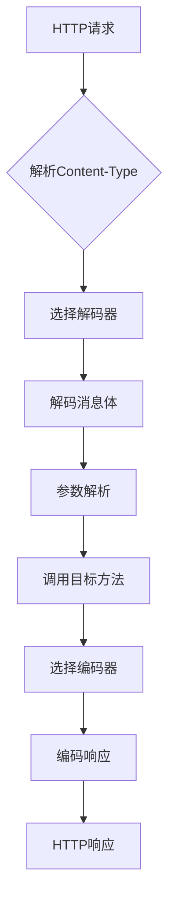

**图来源**
- [JsonCodec.java](file://dubbo-remoting\dubbo-remoting-http12\src\main\java\org\apache\dubbo\remoting\http12\message\codec\JsonCodec.java)
- [XmlCodec.java](file://dubbo-remoting\dubbo-remoting-http12\src\main\java\org\apache\dubbo\remoting\http12\message\codec\XmlCodec.java)

## JSON和XML序列化/反序列化

Dubbo框架提供了对JSON和XML格式的完整支持，通过专门的编解码器实现序列化和反序列化功能。

### JSON序列化/反序列化

JSON编解码由`JsonCodec`类实现，该类使用`HttpJsonUtils`工具类进行JSON的序列化和反序列化操作。`JsonCodec`支持将Java对象转换为JSON字符串，以及将JSON字符串转换为Java对象。

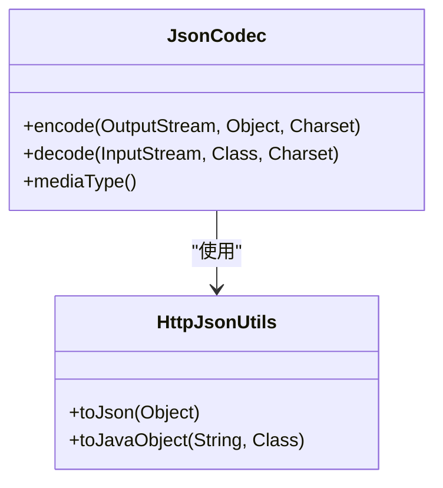

**图来源**
- [JsonCodec.java](file://dubbo-remoting\dubbo-remoting-http12\src\main\java\org\apache\dubbo\remoting\http12\message\codec\JsonCodec.java)

### XML序列化/反序列化

XML编解码由`XmlCodec`类实现，该类基于JAXB（Java Architecture for XML Binding）技术进行XML的序列化和反序列化。`XmlCodec`使用`JAXBContext`创建`Marshaller`和`Unmarshaller`对象来处理XML的编组和解组操作。

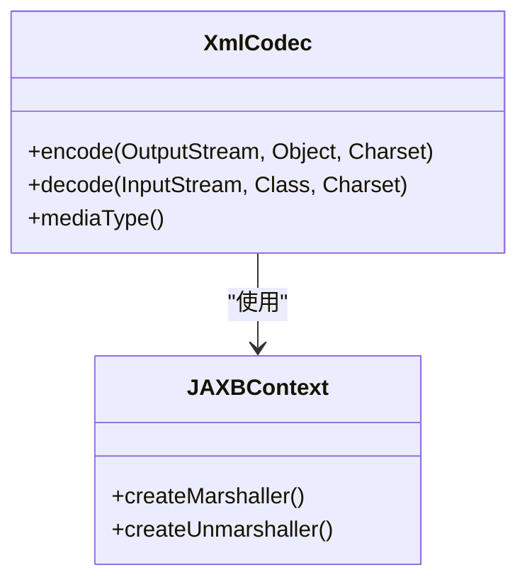

**图来源**
- [XmlCodec.java](file://dubbo-remoting\dubbo-remoting-http12\src\main\java\org\apache\dubbo\remoting\http12\message\codec\XmlCodec.java)

## 请求参数到方法参数的转换

请求参数到方法参数的转换是REST协议消息转换机制的重要组成部分，该过程由参数解析器（ArgumentResolver）和参数转换器（ArgumentConverter）协同完成。

### 参数解析流程

参数解析流程始于`CompositeArgumentResolver`类，该类作为参数解析器的组合器，负责协调各个具体的参数解析器。当接收到HTTP请求时，系统会遍历所有注册的参数解析器，找到能够处理当前参数的解析器进行解析。

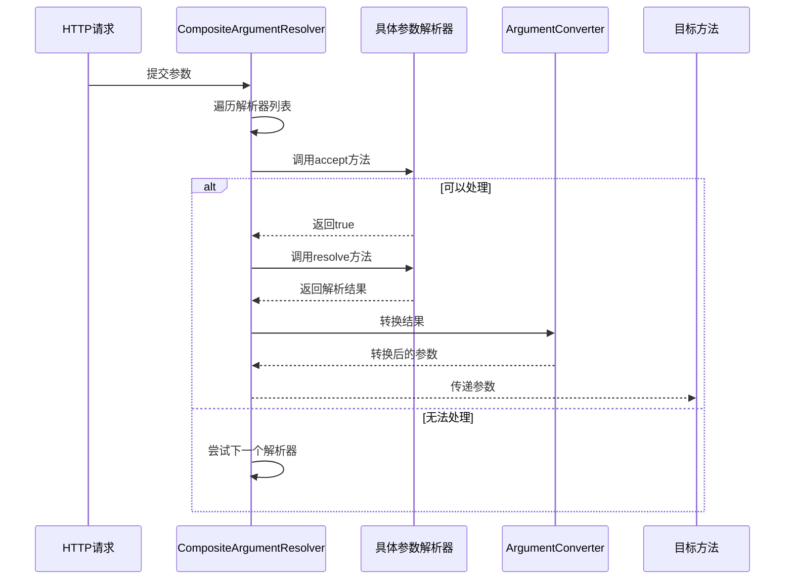

**图来源**
- [CompositeArgumentResolver.java](file://dubbo-rpc\dubbo-rpc-triple\src\main\java\org\apache\dubbo\rpc\protocol\tri\rest\argument\CompositeArgumentResolver.java)

### 参数转换机制

参数转换由`CompositeArgumentConverter`类实现，该类作为参数转换器的组合器，负责协调各个具体的参数转换器。当参数解析完成后，系统会使用合适的转换器将解析结果转换为目标类型。

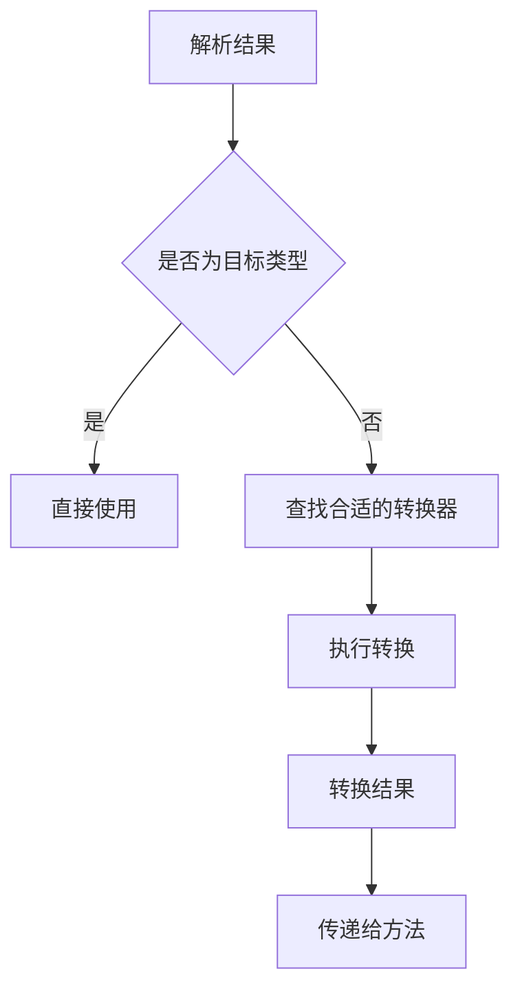

**图来源**
- [CompositeArgumentConverter.java](file://dubbo-rpc\dubbo-rpc-triple\src\main\java\org\apache\dubbo\rpc\protocol\tri\rest\argument\CompositeArgumentConverter.java)

## 复杂对象、集合和文件上传处理

Dubbo框架提供了对复杂对象、集合和文件上传的完整支持，通过专门的解析器和处理器来处理这些复杂场景。

### 复杂对象处理

复杂对象的处理主要通过Bean参数解析器实现。当方法参数被`@BeanParam`注解标记时，系统会使用`BeanArgumentBinder`类来解析该参数。`BeanArgumentBinder`会递归地解析对象的各个属性，将请求参数映射到对象的相应字段。

### 集合处理

集合的处理由`NamedValueArgumentResolverSupport`类提供支持。该类提供了`resolveCollectionValue`方法来处理集合类型的参数。系统会根据请求参数的结构，将多个值组合成集合对象。

### 文件上传处理

文件上传处理由`RequestPartArgumentResolver`类实现。该类专门处理`@RequestPart`注解标记的参数，能够解析multipart/form-data类型的请求，提取上传的文件数据。

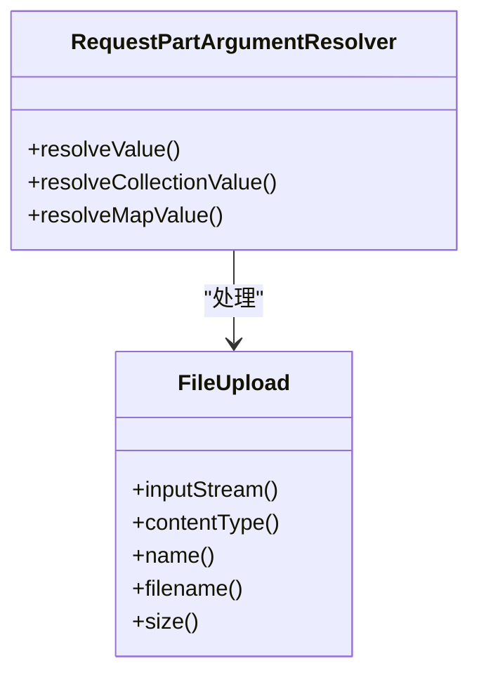

**图来源**
- [RequestPartArgumentResolver.java](file://dubbo-plugin\dubbo-rest-spring\src\main\java\org\apache\dubbo\rpc\protocol\tri\rest\support\spring\RequestPartArgumentResolver.java)

## 消息体转换器和多值映射创建器

消息体转换器（ParamConverterFactory）和多值映射创建器（MultiValueMapCreator）是Dubbo REST协议中两个重要的辅助组件。

### 消息体转换器

`ParamConverterFactory`是JAX-RS规范中`ParamConverterProvider`的实现，负责创建`ParamConverter`实例。该工厂通过`ServiceLoader`机制加载所有可用的`ParamConverterProvider`，并根据参数类型和注解选择合适的转换器。

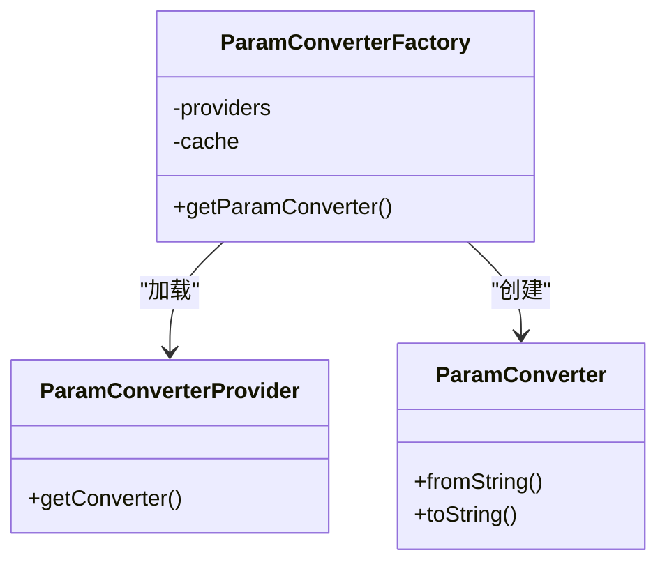

**图来源**
- [ParamConverterFactory.java](file://dubbo-plugin\dubbo-rest-jaxrs\src\main\java\org\apache\dubbo\rpc\protocol\tri\rest\support\jaxrs\ParamConverterFactory.java)

### 多值映射创建器

多值映射创建器用于创建`MultiValueMap`类型的参数。Dubbo提供了针对不同框架的实现，如Spring框架的`MultiValueMapCreator`和JAX-RS框架的`MultivaluedMapCreator`。

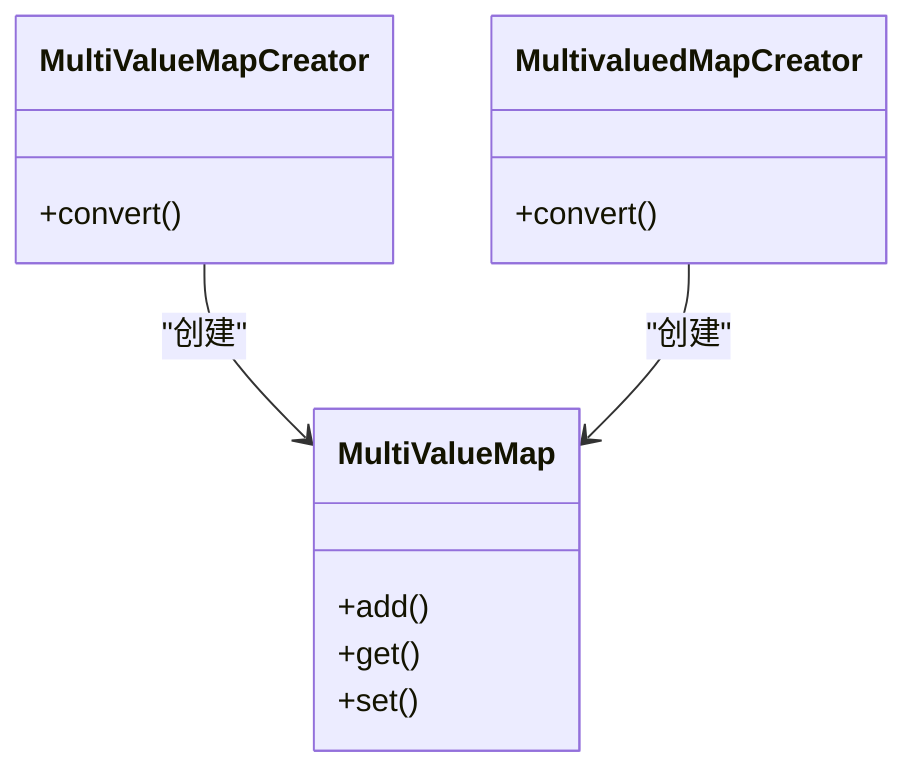

**图来源**
- [MultiValueMapCreator.java](file://dubbo-plugin\dubbo-rest-spring\src\main\java\org\apache\dubbo\rpc\protocol\tri\rest\support\spring\MultiValueMapCreator.java)
- [MultivaluedMapCreator.java](file://dubbo-plugin\dubbo-rest-jaxrs\src\main\java\org\apache\dubbo\rpc\protocol\tri\rest\support\jaxrs\MultivaluedMapCreator.java)

## 自定义消息转换逻辑

Dubbo框架提供了灵活的扩展机制，允许开发者自定义消息转换逻辑，包括实现自定义的ArgumentResolver和ArgumentConverter。

### 自定义ArgumentResolver

要实现自定义的参数解析器，需要创建一个类实现`ArgumentResolver`接口，并使用`@Activate`注解标记。开发者需要实现`accept`方法来判断是否能够处理特定参数，以及`resolve`方法来执行具体的解析逻辑。

### 自定义ArgumentConverter

要实现自定义的参数转换器，需要创建一个类实现`ArgumentConverter`接口，并使用`@Activate`注解标记。开发者需要实现`convert`方法来定义从源类型到目标类型的转换逻辑。

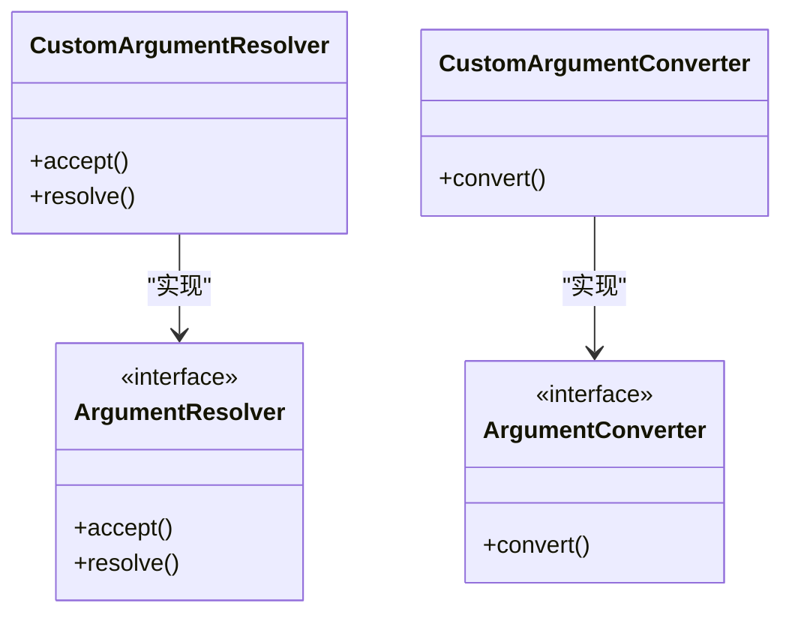

**图来源**
- [ArgumentResolver.java](file://dubbo-rpc\dubbo-rpc-triple\src\main\java\org\apache\dubbo\rpc\protocol\tri\rest\argument\ArgumentResolver.java)
- [ArgumentConverter.java](file://dubbo-rpc\dubbo-rpc-triple\src\main\java\org\apache\dubbo\rpc\protocol\tri\rest\argument\ArgumentConverter.java)

## 内容协商与媒体类型支持

内容协商是REST协议中的重要特性，允许客户端和服务器就响应格式达成一致。Dubbo框架通过`ContentNegotiator`类实现内容协商功能。

### 内容协商流程

内容协商流程按照以下优先级顺序确定响应的媒体类型：
1. 根据produces属性确定
2. 根据Accept请求头确定
3. 根据format参数确定
4. 根据URL扩展名确定

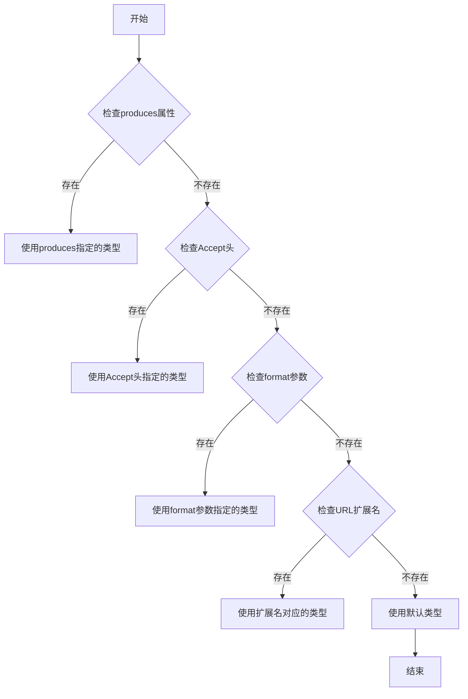

**图来源**
- [ContentNegotiator.java](file://dubbo-rpc\dubbo-rpc-triple\src\main\java\org\apache\dubbo\rpc\protocol\tri\rest\mapping\ContentNegotiator.java)

### 媒体类型支持

Dubbo框架支持多种媒体类型，包括：
- application/json
- application/xml
- text/plain
- application/x-www-form-urlencoded
- multipart/form-data

系统通过`MediaType`类定义这些媒体类型，并在编解码过程中使用。

## 字符编码处理

字符编码处理是消息转换过程中的重要环节，确保数据在不同系统间的正确传输和显示。

### 字符编码解析

系统通过`HttpUtils.parseCharset`方法从Content-Type头信息中解析字符编码。该方法会查找charset参数的值，并返回相应的字符集名称。

### 字符编码设置

在设置响应的Content-Type时，系统会自动添加charset参数。如果未指定字符编码，默认使用UTF-8编码。

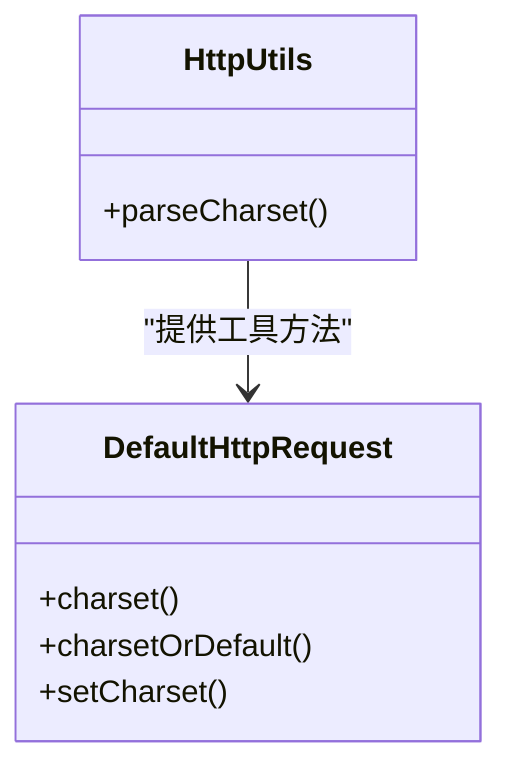

**图来源**
- [HttpUtils.java](file://dubbo-remoting\dubbo-remoting-http12\src\main\java\org\apache\dubbo\remoting\http12\HttpUtils.java)
- [DefaultHttpRequest.java](file://dubbo-remoting\dubbo-remoting-http12\src\main\java\org\apache\dubbo\remoting\http12\message\DefaultHttpRequest.java)

## 性能优化建议

为了提高REST协议消息转换的性能，建议采取以下优化措施：

1. **缓存编解码器实例**：重复创建编解码器实例会带来性能开销，建议对常用的编解码器实例进行缓存。

2. **优化参数解析器顺序**：将常用的参数解析器放在前面，可以减少不必要的遍历操作。

3. **使用合适的数据格式**：在性能要求较高的场景下，优先使用JSON格式而非XML格式，因为JSON的解析速度通常更快。

4. **避免频繁的类型转换**：尽量减少不必要的类型转换操作，特别是在高并发场景下。

5. **合理使用内容协商**：明确指定produces和consumes属性，避免运行时进行内容协商带来的额外开销。

6. **优化集合处理**：对于大型集合的处理，考虑使用流式处理而非一次性加载到内存中。

7. **文件上传优化**：对于大文件上传，建议使用分块上传机制，避免内存溢出。

通过以上优化措施，可以显著提升REST协议消息转换的性能，满足高并发、低延迟的应用需求。