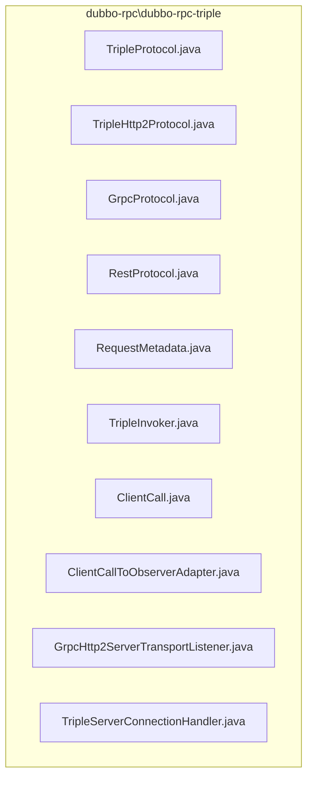
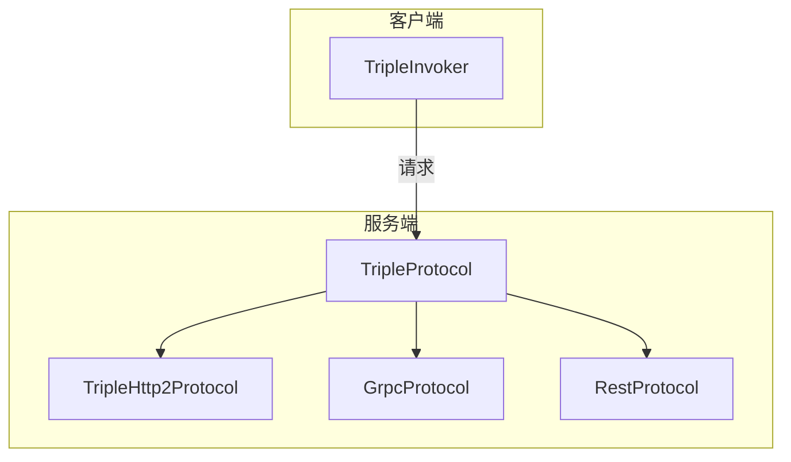
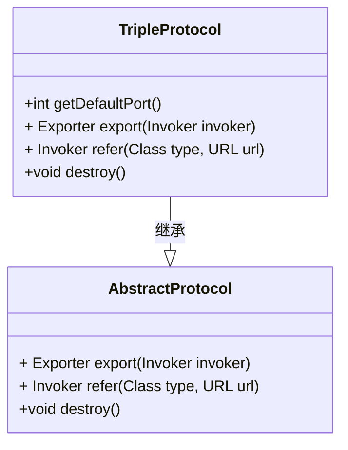
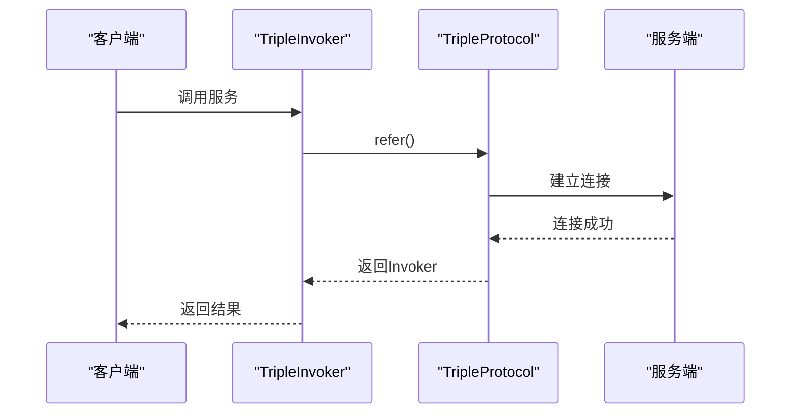
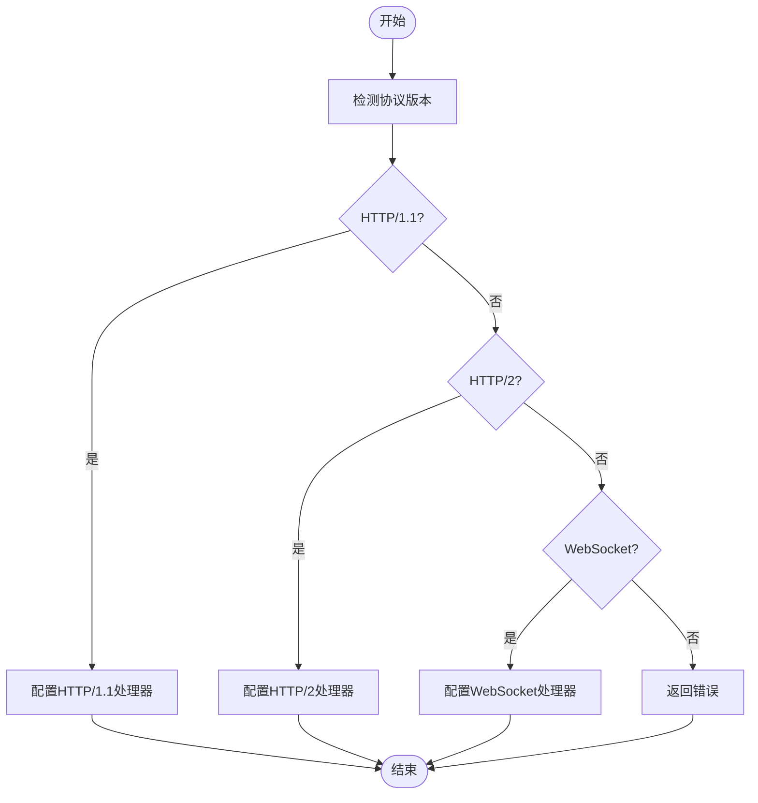
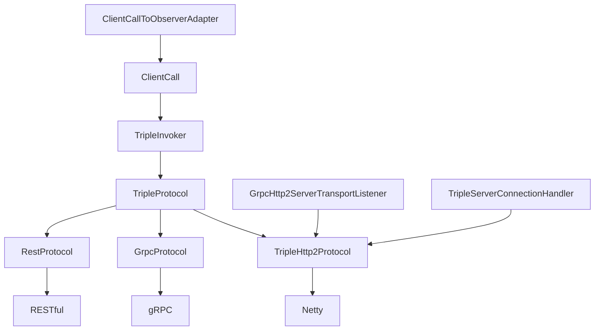

# Triple协议

<cite>
**本文档引用的文件**   
- [TripleProtocol.java](file://dubbo-rpc\dubbo-rpc-triple\src\main\java\org\apache\dubbo\rpc\protocol\tri\TripleProtocol.java)
- [TripleHttp2Protocol.java](file://dubbo-rpc\dubbo-rpc-triple\src\main\java\org\apache\dubbo\rpc\protocol\tri\TripleHttp2Protocol.java)
- [GrpcProtocol.java](file://dubbo-rpc\dubbo-rpc-triple\src\main\java\org\apache\dubbo\rpc\protocol\tri\GrpcProtocol.java)
- [RestProtocol.java](file://dubbo-rpc\dubbo-rpc-triple\src\main\java\org\apache\dubbo\rpc\protocol\tri\RestProtocol.java)
- [RequestMetadata.java](file://dubbo-rpc\dubbo-rpc-triple\src\main\java\org\apache\dubbo\rpc\protocol\tri\RequestMetadata.java)
- [TripleInvoker.java](file://dubbo-rpc\dubbo-rpc-triple\src\main\java\org\apache\dubbo\rpc\protocol\tri\TripleInvoker.java)
- [ClientCall.java](file://dubbo-rpc\dubbo-rpc-triple\src\main\java\org\apache\dubbo\rpc\protocol\tri\call\ClientCall.java)
- [ClientCallToObserverAdapter.java](file://dubbo-rpc\dubbo-rpc-triple\src\main\java\org\apache\dubbo\rpc\protocol\tri\observer\ClientCallToObserverAdapter.java)
- [GrpcHttp2ServerTransportListener.java](file://dubbo-rpc\dubbo-rpc-triple\src\main\java\org\apache\dubbo\rpc\protocol\tri\h12\grpc\GrpcHttp2ServerTransportListener.java)
- [TripleServerConnectionHandler.java](file://dubbo-rpc\dubbo-rpc-triple\src\main\java\org\apache\dubbo\rpc\protocol\tri\transport\TripleServerConnectionHandler.java)
</cite>

## 目录
1. [简介](#简介)
2. [项目结构](#项目结构)
3. [核心组件](#核心组件)
4. [架构概述](#架构概述)
5. [详细组件分析](#详细组件分析)
6. [依赖分析](#依赖分析)
7. [性能考虑](#性能考虑)
8. [故障排除指南](#故障排除指南)
9. [结论](#结论)

## 简介
Triple协议是Dubbo框架中的高性能默认协议，基于HTTP/2传输机制构建。该协议不仅兼容gRPC，还支持Protobuf序列化和标准gRPC方法签名，实现了客户端流、服务端流以及双向流的流式调用功能。通过IDL定义接口并生成存根代码，开发者可以轻松地定义和实现Triple服务。此外，Triple协议还具备元数据交换机制和OpenAPI集成能力，为从gRPC迁移的用户提供指南，并为经验丰富的开发者提供协议扩展点和自定义拦截器的实现方式。本文档将详细介绍Triple协议的各项特性和实现细节。

## 项目结构
Triple协议的实现主要位于`dubbo-rpc\dubbo-rpc-triple`模块中，该模块包含了协议的核心类和相关组件。以下是关键文件的组织结构：

**图源**
- [TripleProtocol.java](file://dubbo-rpc\dubbo-rpc-triple\src\main\java\org\apache\dubbo\rpc\protocol\tri\TripleProtocol.java)
- [TripleHttp2Protocol.java](file://dubbo-rpc\dubbo-rpc-triple\src\main\java\org\apache\dubbo\rpc\protocol\tri\TripleHttp2Protocol.java)

**章节源**
- [TripleProtocol.java](file://dubbo-rpc\dubbo-rpc-triple\src\main\java\org\apache\dubbo\rpc\protocol\tri\TripleProtocol.java)
- [TripleHttp2Protocol.java](file://dubbo-rpc\dubbo-rpc-triple\src\main\java\org\apache\dubbo\rpc\protocol\tri\TripleHttp2Protocol.java)

## 核心组件
Triple协议的核心组件包括`TripleProtocol`、`TripleHttp2Protocol`、`GrpcProtocol`和`RestProtocol`等。这些组件共同构成了协议的基础架构，支持多种传输模式和服务调用方式。

**章节源**
- [TripleProtocol.java](file://dubbo-rpc\dubbo-rpc-triple\src\main\java\org\apache\dubbo\rpc\protocol\tri\TripleProtocol.java)
- [GrpcProtocol.java](file://dubbo-rpc\dubbo-rpc-triple\src\main\java\org\apache\dubbo\rpc\protocol\tri\GrpcProtocol.java)
- [RestProtocol.java](file://dubbo-rpc\dubbo-rpc-triple\src\main\java\org\apache\dubbo\rpc\protocol\tri\RestProtocol.java)

## 架构概述
Triple协议的架构设计充分利用了HTTP/2的多路复用、头部压缩和流控制等特性，确保了高效的数据传输。协议通过`TripleProtocol`类作为入口点，管理服务的导出和引用。`TripleHttp2Protocol`负责处理HTTP/2协议的具体实现，而`GrpcProtocol`和`RestProtocol`则分别支持gRPC和RESTful服务的调用。

**图源**
- [TripleProtocol.java](file://dubbo-rpc\dubbo-rpc-triple\src\main\java\org\apache\dubbo\rpc\protocol\tri\TripleProtocol.java)
- [TripleHttp2Protocol.java](file://dubbo-rpc\dubbo-rpc-triple\src\main\java\org\apache\dubbo\rpc\protocol\tri\TripleHttp2Protocol.java)

## 详细组件分析

### TripleProtocol分析
`TripleProtocol`是Triple协议的主类，负责服务的导出和引用。它通过`export`方法将服务暴露出去，并通过`refer`方法引用远程服务。`TripleProtocol`还管理服务的状态，确保服务在启动和关闭时正确设置状态。

#### 类图

**图源**
- [TripleProtocol.java](file://dubbo-rpc\dubbo-rpc-triple\src\main\java\org\apache\dubbo\rpc\protocol\tri\TripleProtocol.java)

#### 序列图

**图源**
- [TripleInvoker.java](file://dubbo-rpc\dubbo-rpc-triple\src\main\java\org\apache\dubbo\rpc\protocol\tri\TripleInvoker.java)
- [TripleProtocol.java](file://dubbo-rpc\dubbo-rpc-triple\src\main\java\org\apache\dubbo\rpc\protocol\tri\TripleProtocol.java)

**章节源**
- [TripleProtocol.java](file://dubbo-rpc\dubbo-rpc-triple\src\main\java\org\apache\dubbo\rpc\protocol\tri\TripleProtocol.java)
- [TripleInvoker.java](file://dubbo-rpc\dubbo-rpc-triple\src\main\java\org\apache\dubbo\rpc\protocol\tri\TripleInvoker.java)

### TripleHttp2Protocol分析
`TripleHttp2Protocol`是Triple协议中处理HTTP/2协议的核心类。它通过`configClientPipeline`和`configServerProtocolHandler`方法配置客户端和服务端的管道，支持HTTP/1.1升级到HTTP/2，并处理WebSocket连接。

#### 流程图

**图源**
- [TripleHttp2Protocol.java](file://dubbo-rpc\dubbo-rpc-triple\src\main\java\org\apache\dubbo\rpc\protocol\tri\TripleHttp2Protocol.java)

**章节源**
- [TripleHttp2Protocol.java](file://dubbo-rpc\dubbo-rpc-triple\src\main\java\org\apache\dubbo\rpc\protocol\tri\TripleHttp2Protocol.java)

### GrpcProtocol和RestProtocol分析
`GrpcProtocol`和`RestProtocol`分别继承自`TripleProtocol`，用于支持gRPC和RESTful服务的调用。它们通过特定的配置和处理逻辑，确保与gRPC和RESTful服务的兼容性。

**章节源**
- [GrpcProtocol.java](file://dubbo-rpc\dubbo-rpc-triple\src\main\java\org\apache\dubbo\rpc\protocol\tri\GrpcProtocol.java)
- [RestProtocol.java](file://dubbo-rpc\dubbo-rpc-triple\src\main\java\org\apache\dubbo\rpc\protocol\tri\RestProtocol.java)

## 依赖分析
Triple协议的实现依赖于多个核心组件和外部库，包括Netty、gRPC和Dubbo的其他模块。这些依赖关系确保了协议的高性能和高可靠性。

**图源**
- [TripleProtocol.java](file://dubbo-rpc\dubbo-rpc-triple\src\main\java\org\apache\dubbo\rpc\protocol\tri\TripleProtocol.java)
- [TripleHttp2Protocol.java](file://dubbo-rpc\dubbo-rpc-triple\src\main\java\org\apache\dubbo\rpc\protocol\tri\TripleHttp2Protocol.java)

**章节源**
- [TripleProtocol.java](file://dubbo-rpc\dubbo-rpc-triple\src\main\java\org\apache\dubbo\rpc\protocol\tri\TripleProtocol.java)
- [TripleHttp2Protocol.java](file://dubbo-rpc\dubbo-rpc-triple\src\main\java\org\apache\dubbo\rpc\protocol\tri\TripleHttp2Protocol.java)

## 性能考虑
Triple协议通过多种机制优化性能，包括多路复用、头部压缩和流控制。这些机制减少了网络延迟，提高了数据传输效率。此外，协议还支持自定义压缩算法和流控策略，进一步提升了性能。

**章节源**
- [TripleHttp2Protocol.java](file://dubbo-rpc\dubbo-rpc-triple\src\main\java\org\apache\dubbo\rpc\protocol\tri\TripleHttp2Protocol.java)
- [RequestMetadata.java](file://dubbo-rpc\dubbo-rpc-triple\src\main\java\org\apache\dubbo\rpc\protocol\tri\RequestMetadata.java)

## 故障排除指南
在使用Triple协议时，可能会遇到各种问题，如连接失败、超时和数据传输错误。以下是一些常见的故障排除步骤：

1. **检查网络连接**：确保客户端和服务端之间的网络连接正常。
2. **验证配置**：检查`dubbo.properties`文件中的配置是否正确。
3. **查看日志**：查看客户端和服务端的日志，寻找错误信息。
4. **测试服务**：使用简单的测试服务验证协议的正确性。

**章节源**
- [TripleInvoker.java](file://dubbo-rpc\dubbo-rpc-triple\src\main\java\org\apache\dubbo\rpc\protocol\tri\TripleInvoker.java)
- [TripleServerConnectionHandler.java](file://dubbo-rpc\dubbo-rpc-triple\src\main\java\org\apache\dubbo\rpc\protocol\tri\transport\TripleServerConnectionHandler.java)

## 结论
Triple协议作为Dubbo框架的高性能默认协议，通过基于HTTP/2的传输机制，实现了高效的多路复用、头部压缩和流控制。其与gRPC的兼容性设计，支持Protobuf序列化和标准gRPC方法签名，使得开发者可以轻松地定义和实现服务。流式调用功能支持客户端流、服务端流和双向流，提供了灵活的编程模型。通过详细的文档和示例，本文档为初学者和经验丰富的开发者提供了全面的指导，帮助他们更好地理解和使用Triple协议。