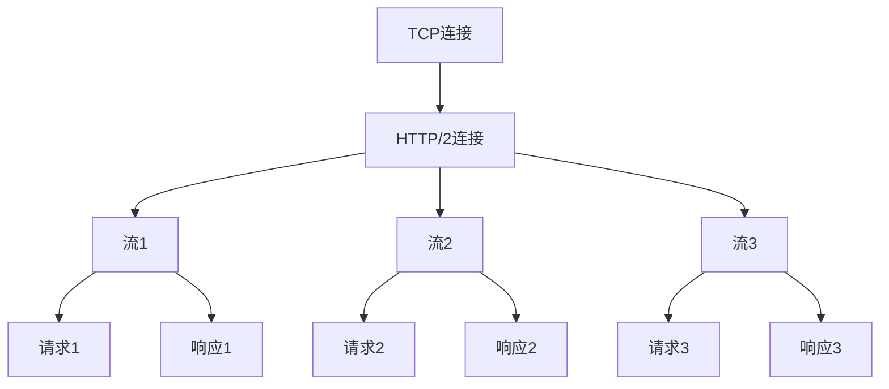
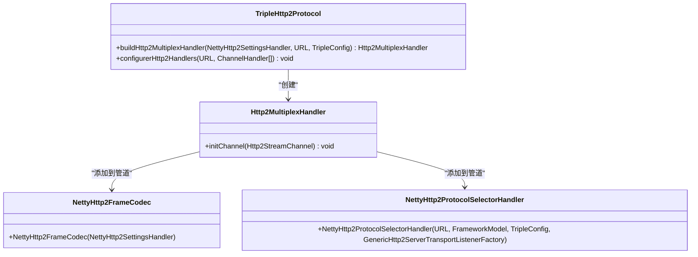
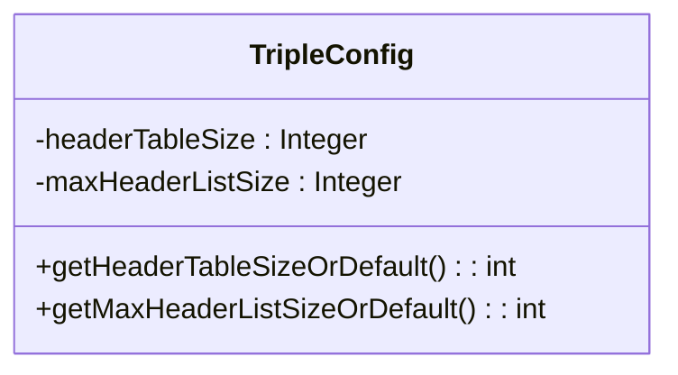
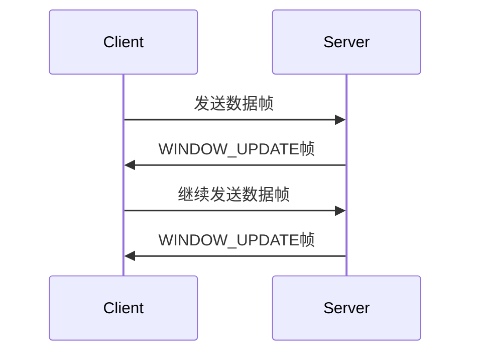
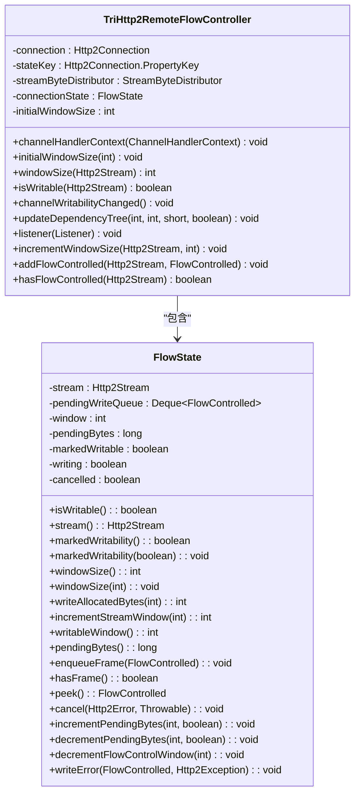
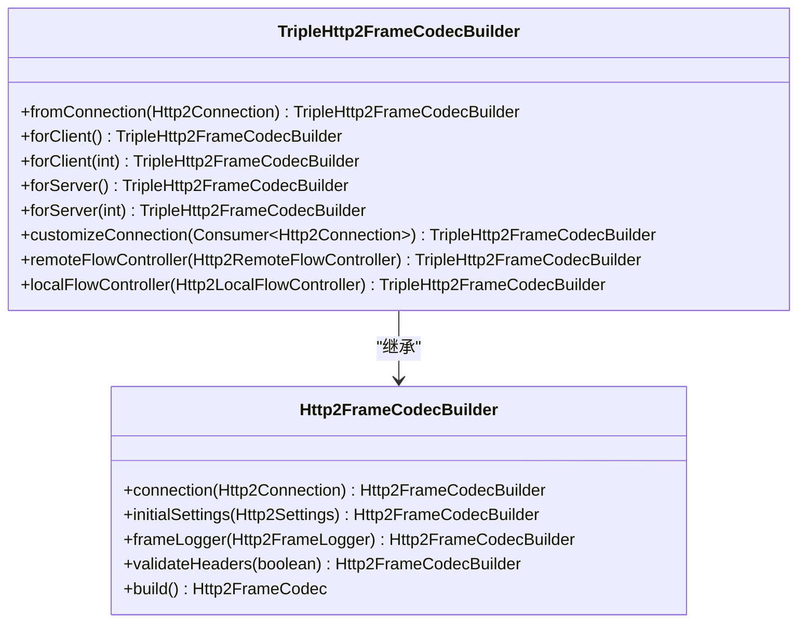
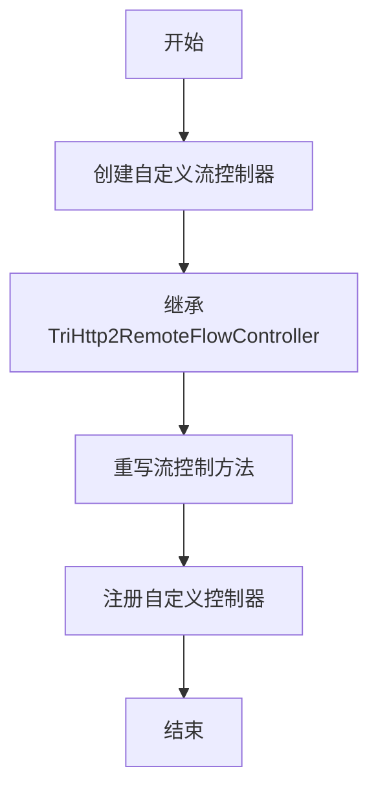
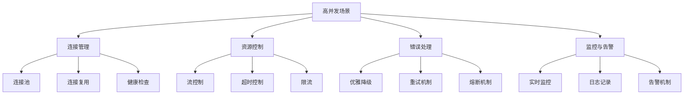

# 传输机制

<cite>
**本文档引用的文件**   
- [TripleHttp2Protocol.java](file://dubbo-rpc\dubbo-rpc-triple\src\main\java\org\apache\dubbo\rpc\protocol\tri\TripleHttp2Protocol.java)
- [TripleConfig.java](file://dubbo-common\src\main\java\org\apache\dubbo\config\nested\TripleConfig.java)
- [TripleHttp2FrameCodecBuilder.java](file://dubbo-rpc\dubbo-rpc-triple\src\main\java\org\apache\dubbo\rpc\protocol\tri\TripleHttp2FrameCodecBuilder.java)
- [TriHttp2RemoteFlowController.java](file://dubbo-rpc\dubbo-rpc-triple\src\main\java\org\apache\dubbo\rpc\protocol\tri\TriHttp2RemoteFlowController.java)
- [NettyHttp2FrameCodec.java](file://dubbo-remoting\dubbo-remoting-http12\src\main\java\org\apache\dubbo\remoting\http12\netty4\h2\NettyHttp2FrameCodec.java)
- [TripleServerConnectionHandler.java](file://dubbo-rpc\dubbo-rpc-triple\src\main\java\org\apache\dubbo\rpc\protocol\tri\transport\TripleServerConnectionHandler.java)
- [AbstractTripleClientStream.java](file://dubbo-rpc\dubbo-rpc-triple\src\main\java\org\apache\dubbo\rpc\protocol\tri\stream\AbstractTripleClientStream.java)
</cite>

## 目录
1. [简介](#简介)
2. [HTTP/2基础概念](#http2基础概念)
3. [多路复用机制](#多路复用机制)
4. [头部压缩机制](#头部压缩机制)
5. [流控制机制](#流控制机制)
6. [配置参数说明](#配置参数说明)
7. [Netty HTTP/2编解码器定制](#netty-http2编解码器定制)
8. [性能测试与调优建议](#性能测试与调优建议)
9. [高并发场景最佳实践](#高并发场景最佳实践)
10. [总结](#总结)

## 简介
Triple协议是基于HTTP/2实现的高性能RPC协议，它充分利用了HTTP/2协议的多路复用、头部压缩和流控制等特性，为分布式系统提供了高效、可靠的通信机制。本文档详细介绍了Triple协议传输机制的实现原理，重点分析了其基于HTTP/2的实现细节，包括多路复用、头部压缩和流控制等核心机制。通过本文档，开发者可以深入了解Triple协议的工作原理，掌握相关配置参数，并学习在高并发场景下的最佳实践。

**Section sources**
- [TripleHttp2Protocol.java](file://dubbo-rpc\dubbo-rpc-triple\src\main\java\org\apache\dubbo\rpc\protocol\tri\TripleHttp2Protocol.java#L76-L250)

## HTTP/2基础概念
HTTP/2是HTTP协议的第二代主要版本，它在保持HTTP/1.1语义的同时，通过二进制分帧层对协议进行了重大改进。HTTP/2的核心特性包括：

- **二进制分帧层**：HTTP/2将所有传输的信息分割为更小的消息和帧，并对它们采用二进制格式编码。这使得协议解析更加高效和健壮。
- **多路复用**：在一个TCP连接上可以并行发送多个请求和响应，解决了HTTP/1.x中的队头阻塞问题。
- **头部压缩**：使用HPACK算法对HTTP头部进行压缩，显著减少了头部信息的传输开销。
- **流优先级**：允许客户端为请求设置优先级，服务器可以根据优先级合理分配资源。
- **服务器推送**：服务器可以主动向客户端推送资源，减少客户端的请求延迟。

Triple协议基于HTTP/2构建，充分利用了这些特性来提升RPC调用的性能和效率。

## 多路复用机制
多路复用是HTTP/2最核心的特性之一，它允许在单个TCP连接上并行处理多个请求和响应，从而显著减少了连接开销和延迟。

### 实现原理
在Triple协议中，多路复用机制通过Netty的`Http2MultiplexHandler`实现。当客户端与服务器建立连接后，该处理器负责管理多个逻辑流（Stream），每个流可以独立地发送请求和接收响应。



**Diagram sources**
- [TripleHttp2Protocol.java](file://dubbo-rpc\dubbo-rpc-triple\src\main\java\org\apache\dubbo\rpc\protocol\tri\TripleHttp2Protocol.java#L197-L208)

### 代码实现
在`TripleHttp2Protocol`类中，通过`buildHttp2MultiplexHandler`方法构建多路复用处理器：



**Diagram sources**
- [TripleHttp2Protocol.java](file://dubbo-rpc\dubbo-rpc-triple\src\main\java\org\apache\dubbo\rpc\protocol\tri\TripleHttp2Protocol.java#L197-L208)

**Section sources**
- [TripleHttp2Protocol.java](file://dubbo-rpc\dubbo-rpc-triple\src\main\java\org\apache\dubbo\rpc\protocol\tri\TripleHttp2Protocol.java#L197-L208)

## 头部压缩机制
HTTP/2使用HPACK算法对头部进行压缩，显著降低了网络带宽消耗，提升了传输效率。

### 实现原理
HPACK算法通过以下方式实现头部压缩：
- **静态表**：包含常见的HTTP头部字段和值。
- **动态表**：在连接生命周期内维护，存储最近使用的头部字段和值。
- **霍夫曼编码**：对字符串进行压缩编码。

在Triple协议中，头部压缩由Netty的HTTP/2编解码器自动处理，开发者无需关心具体实现细节。

### 配置参数
头部压缩的相关配置参数在`TripleConfig`类中定义：



**Diagram sources**
- [TripleConfig.java](file://dubbo-common\src\main\java\org\apache\dubbo\config\nested\TripleConfig.java#L106-L147)

**Section sources**
- [TripleConfig.java](file://dubbo-common\src\main\java\org\apache\dubbo\config\nested\TripleConfig.java#L106-L147)

## 流控制机制
流控制是HTTP/2的重要特性，它防止发送方淹没接收方，确保稳定的数据传输。

### 实现原理
HTTP/2的流控制基于窗口机制，每个流和整个连接都有独立的流量控制窗口。接收方通过WINDOW_UPDATE帧告知发送方可以接收多少数据。

在Triple协议中，流控制机制通过自定义的`TriHttp2RemoteFlowController`实现，该类继承自Netty的流控制器，并根据Dubbo的需求进行了定制。



**Diagram sources**
- [TriHttp2RemoteFlowController.java](file://dubbo-rpc\dubbo-rpc-triple\src\main\java\org\apache\dubbo\rpc\protocol\tri\TriHttp2RemoteFlowController.java#L54-L781)

### 代码实现
`TriHttp2RemoteFlowController`类实现了`Http2RemoteFlowController`接口，负责管理流控制状态：



**Diagram sources**
- [TriHttp2RemoteFlowController.java](file://dubbo-rpc\dubbo-rpc-triple\src\main\java\org\apache\dubbo\rpc\protocol\tri\TriHttp2RemoteFlowController.java#L54-L781)

**Section sources**
- [TriHttp2RemoteFlowController.java](file://dubbo-rpc\dubbo-rpc-triple\src\main\java\org\apache\dubbo\rpc\protocol\tri\TriHttp2RemoteFlowController.java#L54-L781)

## 配置参数说明
Triple协议提供了丰富的配置参数，允许开发者根据具体需求进行调优。

### 核心配置参数
以下是Triple协议的主要配置参数及其说明：

| 参数名称 | 描述 | 默认值 | 适用范围 |
|--------|------|-------|--------|
| maxConcurrentStreams | 最大并发流数 | Integer.MAX_VALUE | HTTP/2 |
| initialWindowSize | 初始窗口大小 | 8,388,608 | HTTP/2 |
| connectionInitialWindowSize | 连接初始窗口大小 | 65,536 | HTTP/2 |
| maxFrameSize | 最大帧大小 | 8,388,608 | HTTP/2 |
| maxHeaderListSize | 最大头部列表大小 | 32,768 | HTTP/2 |
| headerTableSize | 头部表大小 | 4,096 | HTTP/1 |
| maxInitialLineLength | HTTP头部第一行最大长度 | 4,096 | HTTP/1 |
| maxHeaderSize | 最大头部大小 | 8,192 | HTTP/1 |
| maxChunkSize | 最大块大小 | 8,388,608 | HTTP/1 |

**Section sources**
- [TripleConfig.java](file://dubbo-common\src\main\java\org\apache\dubbo\config\nested\TripleConfig.java#L90-L152)

### 配置示例
在Dubbo配置中，可以通过以下方式设置Triple协议参数：

```xml
<dubbo:protocol name="tri" port="50051">
    <dubbo:parameter key="maxConcurrentStreams" value="1000"/>
    <dubbo:parameter key="initialWindowSize" value="1048576"/>
    <dubbo:parameter key="maxFrameSize" value="1048576"/>
</dubbo:protocol>
```

## Netty HTTP/2编解码器定制
对于有特殊需求的开发者，Triple协议提供了Netty HTTP/2编解码器的定制方法。

### 编解码器构建
Triple协议通过`TripleHttp2FrameCodecBuilder`类对Netty的HTTP/2编解码器进行封装和扩展：



**Diagram sources**
- [TripleHttp2FrameCodecBuilder.java](file://dubbo-rpc\dubbo-rpc-triple\src\main\java\org\apache\dubbo\rpc\protocol\tri\TripleHttp2FrameCodecBuilder.java#L30-L71)

### 自定义流控制器
开发者可以通过继承`TriHttp2RemoteFlowController`类来实现自定义的流控制逻辑：



**Section sources**
- [TripleHttp2FrameCodecBuilder.java](file://dubbo-rpc\dubbo-rpc-triple\src\main\java\org\apache\dubbo\rpc\protocol\tri\TripleHttp2FrameCodecBuilder.java#L62-L69)

## 性能测试与调优建议
为了充分发挥Triple协议的性能优势，需要进行合理的性能测试和调优。

### 性能测试指标
在进行性能测试时，应关注以下关键指标：

| 指标 | 描述 | 目标值 |
|------|------|-------|
| 吞吐量 | 单位时间内处理的请求数 | 越高越好 |
| 延迟 | 请求从发送到收到响应的时间 | 越低越好 |
| CPU使用率 | 服务器CPU资源占用情况 | 合理范围内 |
| 内存使用 | 服务器内存占用情况 | 合理范围内 |
| 连接数 | 同时保持的连接数量 | 越多越好 |

### 调优建议
根据性能测试结果，可以采取以下调优措施：

1. **调整流控制参数**：根据网络状况和业务需求，合理设置`initialWindowSize`和`maxConcurrentStreams`参数。
2. **优化头部压缩**：通过调整`headerTableSize`参数来平衡内存使用和压缩效率。
3. **调整帧大小**：根据传输数据的特点，设置合适的`maxFrameSize`参数。
4. **连接复用**：充分利用HTTP/2的多路复用特性，减少连接建立开销。
5. **异步处理**：采用异步非阻塞的方式处理请求，提高系统吞吐量。

**Section sources**
- [TripleConfig.java](file://dubbo-common\src\main\java\org\apache\dubbo\config\nested\TripleConfig.java#L120-L147)

## 高并发场景最佳实践
在高并发场景下，为了确保系统的稳定性和性能，需要遵循以下最佳实践：

### 连接管理
- **连接池**：使用连接池管理HTTP/2连接，避免频繁创建和销毁连接。
- **连接复用**：充分利用单个连接上的多路复用能力，减少连接数量。
- **连接健康检查**：定期检查连接状态，及时关闭异常连接。

### 资源控制
- **流控制**：合理设置流控制参数，防止客户端或服务器被淹没。
- **超时控制**：设置合理的请求超时时间，避免资源长时间占用。
- **限流**：在服务端实施限流策略，防止系统过载。

### 错误处理
- **优雅降级**：在系统压力过大时，提供降级方案保证核心功能可用。
- **重试机制**：对于临时性错误，实现智能重试机制。
- **熔断机制**：当错误率达到阈值时，自动熔断，防止雪崩效应。

### 监控与告警
- **实时监控**：监控关键性能指标，如QPS、延迟、错误率等。
- **日志记录**：详细记录请求日志，便于问题排查。
- **告警机制**：设置合理的告警阈值，及时发现和处理异常。



**Diagram sources**
- [TripleServerConnectionHandler.java](file://dubbo-rpc\dubbo-rpc-triple\src\main\java\org\apache\dubbo\rpc\protocol\tri\transport\TripleServerConnectionHandler.java#L39-L124)
- [AbstractTripleClientStream.java](file://dubbo-rpc\dubbo-rpc-triple\src\main\java\org\apache\dubbo\rpc\protocol\tri\stream\AbstractTripleClientStream.java#L72-L479)

**Section sources**
- [TripleServerConnectionHandler.java](file://dubbo-rpc\dubbo-rpc-triple\src\main\java\org\apache\dubbo\rpc\protocol\tri\transport\TripleServerConnectionHandler.java#L39-L124)
- [AbstractTripleClientStream.java](file://dubbo-rpc\dubbo-rpc-triple\src\main\java\org\apache\dubbo\rpc\protocol\tri\stream\AbstractTripleClientStream.java#L72-L479)

## 总结
Triple协议基于HTTP/2构建，充分利用了多路复用、头部压缩和流控制等特性，为分布式系统提供了高效、可靠的通信机制。通过本文档的介绍，我们详细了解了Triple协议的传输机制，包括其核心组件的实现原理、配置参数的使用方法以及在高并发场景下的最佳实践。

对于初学者，建议从HTTP/2的基础概念入手，理解多路复用、头部压缩和流控制的基本原理。对于经验丰富的开发者，可以通过定制Netty HTTP/2编解码器来满足特殊需求。在实际应用中，应根据具体场景进行性能测试和调优，确保系统在高并发下的稳定性和性能。

通过合理使用Triple协议，可以显著提升分布式系统的通信效率，降低网络开销，为构建高性能的微服务架构提供有力支持。