# 元数据与OpenAPI集成

<cite>
**本文档引用的文件**   
- [MetadataServiceDelegation.java](file://dubbo-registry\dubbo-registry-api\src\main\java\org\apache\dubbo\registry\client\metadata\MetadataServiceDelegation.java)
- [OpenAPIRequest.java](file://dubbo-metadata\dubbo-metadata-api\src\main\java\org\apache\dubbo\metadata\OpenAPIRequest.java)
- [DefaultOpenAPIService.java](file://dubbo-plugin\dubbo-rest-openapi\src\main\java\org\apache\dubbo\rpc\protocol\tri\rest\openapi\DefaultOpenAPIService.java)
- [TripleProtocol.java](file://dubbo-rpc\dubbo-rpc-triple\src\main\java\org\apache\dubbo\rpc\protocol\tri\TripleProtocol.java)
- [GetOpenAPI.java](file://dubbo-plugin\dubbo-qos\src\main\java\org\apache\dubbo\qos\command\impl\GetOpenAPI.java)
- [CorsMeta.java](file://dubbo-rpc\dubbo-rpc-triple\src\main\java\org\apache\dubbo\rpc\protocol\tri\rest\mapping\meta\CorsMeta.java)
- [CorsConfig.java](file://dubbo-common\src\main\java\org\apache\dubbo\config\nested\CorsConfig.java)
- [CorsHeaderFilter.java](file://dubbo-rpc\dubbo-rpc-triple\src\main\java\org\apache\dubbo\rpc\protocol\tri\rest\cors\CorsHeaderFilter.java)
- [SwaggerUIRequestHandler.java](file://dubbo-plugin\dubbo-rest-openapi\src\main\java\org\apache\dubbo\rpc\protocol\tri\rest\support\swagger\SwaggerUIRequestHandler.java)
- [RestConfig.java](file://dubbo-common\src\main\java\org\apache\dubbo\config\nested\RestConfig.java)
- [DefinitionResolver.java](file://dubbo-plugin\dubbo-rest-openapi\src\main\java\org\apache\dubbo\rpc\protocol\tri\rest\openapi\DefinitionResolver.java)
- [OpenAPIInfo.java](file://dubbo-metadata\dubbo-metadata-api\src\main\java\org\apache\dubbo\metadata\OpenAPIInfo.java)
- [ApplicationConfig.java](file://dubbo-common\src\main\java\org\apache\dubbo\config\ApplicationConfig.java)
</cite>

## 目录
1. [引言](#引言)
2. [Triple协议元数据服务](#triple协议元数据服务)
3. [OpenAPI自动生成机制](#openapi自动生成机制)
4. [服务元数据查询方式](#服务元数据查询方式)
5. [OpenAPI基础概念](#openapi基础概念)
6. [安全配置](#安全配置)
7. [文档版本管理](#文档版本管理)
8. [跨域资源共享(CORS)设置](#跨域资源共享cors设置)
9. [与主流API网关集成](#与主流api网关集成)
10. [自定义OpenAPI扩展与插件开发](#自定义openapi扩展与插件开发)
11. [结论](#结论)

## 引言
本文档详细介绍了Dubbo框架中Triple协议的元数据与OpenAPI集成机制。通过分析代码库，我们将深入探讨如何利用元数据交换服务（Metadata Service）实现服务接口的动态发现和描述，以及如何自动生成OpenAPI文档。文档涵盖了从基础概念到高级配置的各个方面，为开发者提供了完整的集成指南。

## Triple协议元数据服务
Triple协议通过元数据服务实现服务接口的动态发现和描述。元数据服务作为服务提供者和消费者之间的桥梁，负责收集、存储和分发服务的元数据信息。

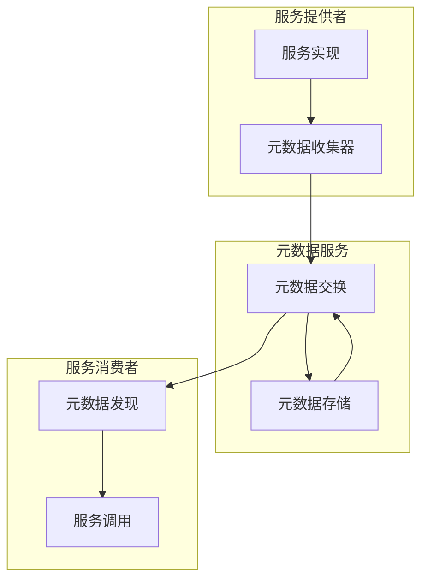

**图示来源**
- [MetadataServiceDelegation.java](file://dubbo-registry\dubbo-registry-api\src\main\java\org\apache\dubbo\registry\client\metadata\MetadataServiceDelegation.java#L223-L231)

Triple协议的元数据服务通过`MetadataServiceDelegation`类实现，该类提供了`getOpenAPI`方法来获取OpenAPI文档。当OpenAPI功能启用时，系统会从应用模型中获取`OpenAPIService`实例并返回文档内容；否则抛出404异常。

**章节来源**
- [MetadataServiceDelegation.java](file://dubbo-registry\dubbo-registry-api\src\main\java\org\apache\dubbo\registry\client\metadata\MetadataServiceDelegation.java#L223-L231)
- [TripleProtocol.java](file://dubbo-rpc\dubbo-rpc-triple\src\main\java\org\apache\dubbo\rpc\protocol\tri\TripleProtocol.java#L71)

## OpenAPI自动生成机制
Dubbo框架通过`DefaultOpenAPIService`类实现了OpenAPI文档的自动生成机制。该机制能够从服务接口的注解和方法签名中提取信息，动态生成符合OpenAPI规范的文档。

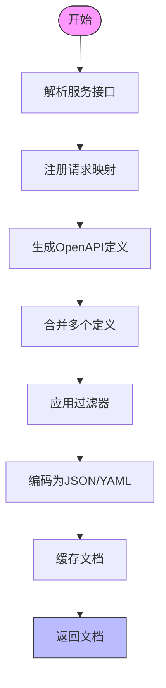

**图示来源**
- [DefaultOpenAPIService.java](file://dubbo-plugin\dubbo-rest-openapi\src\main\java\org\apache\dubbo\rpc\protocol\tri\rest\openapi\DefaultOpenAPIService.java#L147-L172)

OpenAPI文档的生成过程包括以下几个关键步骤：
1. **服务解析**：通过`RequestMappingRegistry`获取所有注册的服务映射
2. **定义解析**：使用`DefinitionResolver`解析每个服务的OpenAPI定义
3. **定义合并**：通过`DefinitionMerger`合并多个服务的定义
4. **过滤处理**：应用`DefinitionFilter`进行条件过滤
5. **文档编码**：使用`DefinitionEncoder`将定义编码为JSON或YAML格式

文档生成支持缓存机制，使用LRU缓存存储已生成的文档，提高访问性能。缓存键由请求参数和路径信息组合而成，确保不同请求条件下的文档独立缓存。

**章节来源**
- [DefaultOpenAPIService.java](file://dubbo-plugin\dubbo-rest-openapi\src\main\java\org\apache\dubbo\rpc\protocol\tri\rest\openapi\DefaultOpenAPIService.java#L67-L242)
- [DefinitionResolver.java](file://dubbo-plugin\dubbo-rest-openapi\src\main\java\org\apache\dubbo\rpc\protocol\tri\rest\openapi\DefinitionResolver.java#L81-L140)

## 服务元数据查询方式
Dubbo提供了多种方式查询服务元数据，包括QoS命令和REST API两种主要途径。

### QoS命令查询
通过QoS（Quality of Service）命令可以方便地查询服务元数据。`GetOpenAPI`命令是专门用于获取OpenAPI描述的QoS命令。

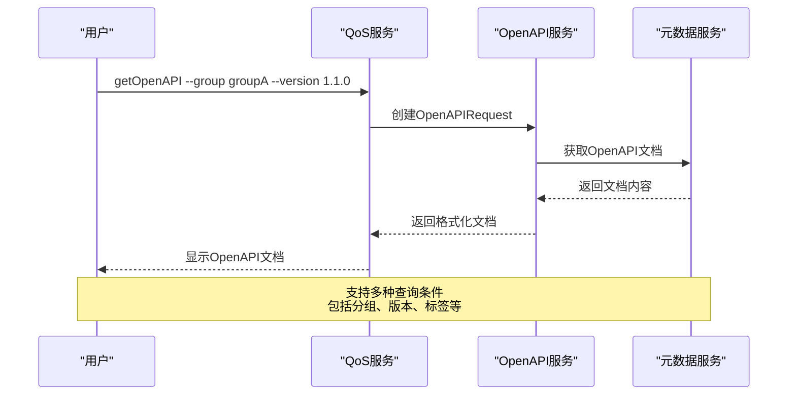

**图示来源**
- [GetOpenAPI.java](file://dubbo-plugin\dubbo-qos\src\main\java\org\apache\dubbo\qos\command\impl\GetOpenAPI.java#L48-L93)

QoS命令支持丰富的查询参数：
- `--group`: 按服务分组查询
- `--version`: 按服务版本查询
- `--tag`: 按标签查询
- `--service`: 按服务名称查询
- `--openapi`: 指定OpenAPI规范版本
- `--format`: 指定输出格式（JSON/YAML）

### REST API查询
除了QoS命令，还可以通过REST API查询服务元数据。系统提供了标准的REST端点来访问OpenAPI文档。

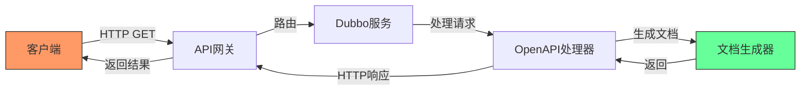

REST API支持以下端点：
- `/api-docs`: 获取默认分组的OpenAPI文档
- `/api-docs/{group}`: 获取指定分组的OpenAPI文档
- `/swagger-ui`: 访问Swagger UI界面

**章节来源**
- [GetOpenAPI.java](file://dubbo-plugin\dubbo-qos\src\main\java\org\apache\dubbo\qos\command\impl\GetOpenAPI.java#L28-L93)
- [DefaultOpenAPIService.java](file://dubbo-plugin\dubbo-rest-openapi\src\main\java\org\apache\dubbo\rpc\protocol\tri\rest\openapi\DefaultOpenAPIService.java#L99-L100)
- [SwaggerUIRequestHandler.java](file://dubbo-plugin\dubbo-rest-openapi\src\main\java\org\apache\dubbo\rpc\protocol\tri\rest\support\swagger\SwaggerUIRequestHandler.java#L72)

## OpenAPI基础概念
OpenAPI（原Swagger）是一种用于描述RESTful API的规范，它提供了一种标准化的方式来定义API的结构、参数、响应等信息。

### OpenAPI核心组件
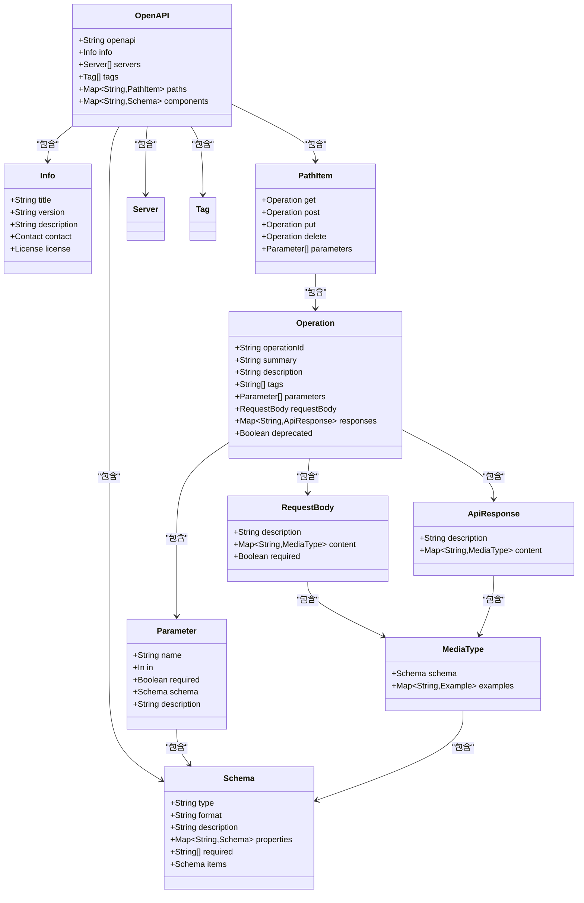

**图示来源**
- [OpenAPI.java](file://dubbo-plugin\dubbo-rest-openapi\src\main\java\org\apache\dubbo\rpc\protocol\tri\rest\openapi\model\OpenAPI.java)
- [Operation.java](file://dubbo-plugin\dubbo-rest-openapi\src\main\java\org\apache\dubbo\rpc\protocol\tri\rest\openapi\model\Operation.java)

OpenAPI文档的核心组件包括：
- **OpenAPI对象**：文档的根对象，包含API的全局信息
- **Info对象**：描述API的基本信息，如标题、版本、描述等
- **Servers对象**：定义API服务器的URL
- **Paths对象**：描述API的各个端点及其操作
- **Components对象**：可重用的组件，如Schema、Parameters等

### 参数位置（Parameter In）
OpenAPI定义了四种参数位置：
- **path**：路径参数，出现在URL路径中
- **query**：查询参数，出现在URL查询字符串中
- **header**：头部参数，出现在HTTP头部中
- **cookie**：Cookie参数，出现在Cookie头部中

这些参数位置在Dubbo的元数据服务中通过`ParamType`枚举进行映射，确保RESTful API的参数能够正确地转换为OpenAPI定义。

**章节来源**
- [OpenAPI.java](file://dubbo-plugin\dubbo-rest-openapi\src\main\java\org\apache\dubbo\rpc\protocol\tri\rest\openapi\model\OpenAPI.java)
- [ParamType.java](file://dubbo-remoting\dubbo-remoting-http12\src\main\java\org\apache\dubbo\remoting\http12\rest\ParamType.java)

## 安全配置
Dubbo框架提供了完善的安全配置机制，包括API密钥认证、访问控制等安全特性。

### API密钥认证
系统通过`AccessKeyAuthenticator`类实现API密钥认证机制。该机制在请求中添加签名信息，确保请求的完整性和真实性。

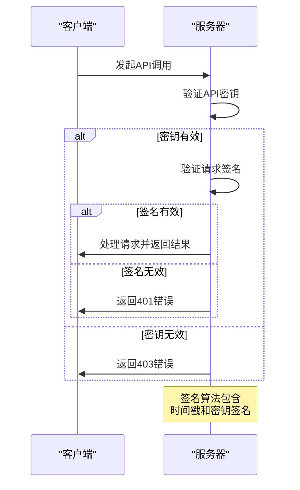

**图示来源**
- [AccessKeyAuthenticator.java](file://dubbo-plugin\dubbo-auth\src\main\java\org\apache\dubbo\auth\AccessKeyAuthenticator.java#L40-L48)

API密钥认证的工作流程：
1. 客户端在请求中包含访问密钥（AK）和签名
2. 服务器验证访问密钥的有效性
3. 使用密钥对请求内容进行签名验证
4. 验证时间戳防止重放攻击
5. 通过所有验证后处理请求

### 访问控制配置
通过`ApplicationConfig`类可以配置QoS服务的访问控制策略，包括IP白名单、权限级别等。

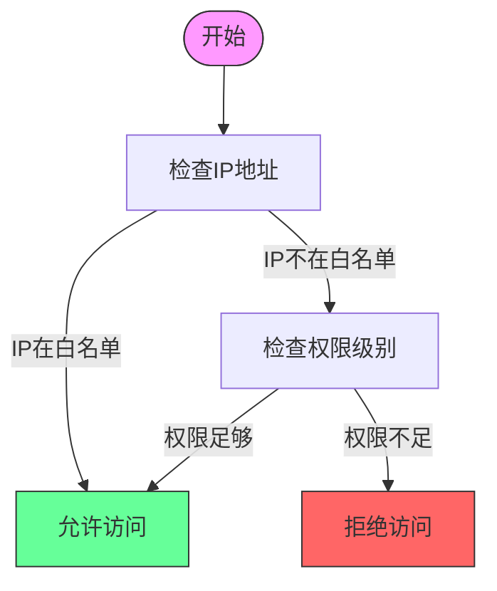

**图示来源**
- [ApplicationConfig.java](file://dubbo-common\src\main\java\org\apache\dubbo\config\ApplicationConfig.java#L582-L606)

访问控制配置参数：
- `qosAcceptForeignIp`: 是否允许外部IP访问
- `qosAcceptForeignIpWhitelist`: 外部IP白名单
- `qosAnonymousAccessPermissionLevel`: 匿名访问权限级别

**章节来源**
- [AccessKeyAuthenticator.java](file://dubbo-plugin\dubbo-auth\src\main\java\org\apache\dubbo\auth\AccessKeyAuthenticator.java#L32-L49)
- [ApplicationConfig.java](file://dubbo-common\src\main\java\org\apache\dubbo\config\ApplicationConfig.java#L564-L606)

## 文档版本管理
Dubbo框架提供了完善的文档版本管理机制，支持多版本OpenAPI文档的生成和管理。

### 版本控制策略
系统通过`OpenAPIRequest`类中的版本字段实现文档版本控制。每个OpenAPI文档都有明确的版本号，遵循主版本.次版本.修订版本的命名规范。

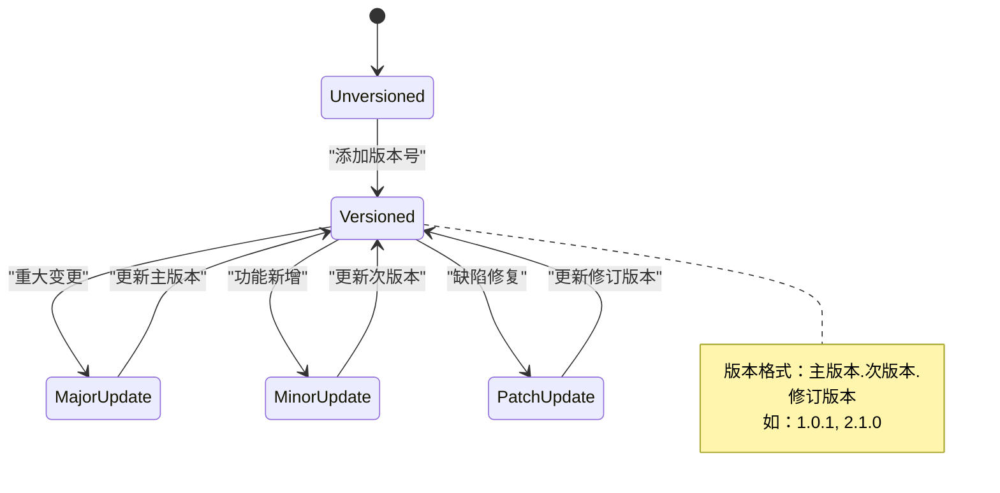

**图示来源**
- [OpenAPIRequest.java](file://dubbo-metadata\dubbo-metadata-api\src\main\java\org\apache\dubbo\metadata\OpenAPIRequest.java#L114-L134)

版本管理的最佳实践：
1. **语义化版本**：遵循语义化版本规范（SemVer）
2. **向后兼容**：保持API的向后兼容性
3. **文档更新**：每次版本变更都更新文档
4. **版本归档**：保留历史版本文档

### 多版本文档支持
系统支持同时生成和管理多个版本的OpenAPI文档。通过`getOpenAPIGroups`方法可以获取所有可用的文档分组。

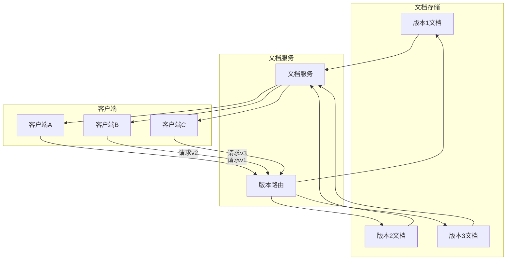

**图示来源**
- [DefaultOpenAPIService.java](file://dubbo-plugin\dubbo-rest-openapi\src\main\java\org\apache\dubbo\rpc\protocol\tri\rest\openapi\DefaultOpenAPIService.java#L117-L129)

**章节来源**
- [OpenAPIRequest.java](file://dubbo-metadata\dubbo-metadata-api\src\main\java\org\apache\dubbo\metadata\OpenAPIRequest.java#L114-L134)
- [DefaultOpenAPIService.java](file://dubbo-plugin\dubbo-rest-openapi\src\main\java\org\apache\dubbo\rpc\protocol\tri\rest\openapi\DefaultOpenAPIService.java#L117-L129)

## 跨域资源共享(CORS)设置
Dubbo框架提供了完整的CORS（跨域资源共享）支持，确保API可以在不同域之间安全地被访问。

### CORS配置
通过`CorsConfig`类可以配置CORS相关参数，包括允许的源、方法、头部等。

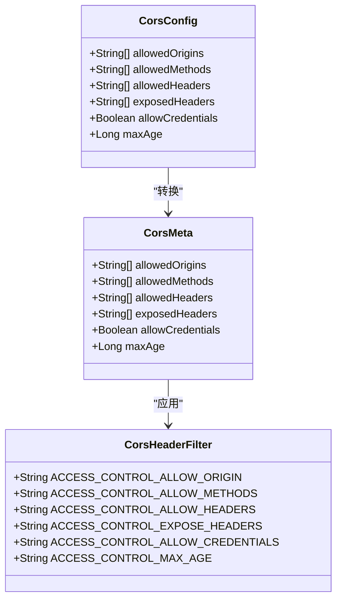

**图示来源**
- [CorsConfig.java](file://dubbo-common\src\main\java\org\apache\dubbo\config\nested\CorsConfig.java#L59-L118)
- [CorsMeta.java](file://dubbo-rpc\dubbo-rpc-triple\src\main\java\org\apache\dubbo\rpc\protocol\tri\rest\mapping\meta\CorsMeta.java#L82-L312)
- [CorsHeaderFilter.java](file://dubbo-rpc\dubbo-rpc-triple\src\main\java\org\apache\dubbo\rpc\protocol\tri\rest\cors\CorsHeaderFilter.java#L50-L141)

CORS配置参数说明：
- **allowedOrigins**: 允许的源列表，支持通配符
- **allowedMethods**: 允许的HTTP方法列表
- **allowedHeaders**: 允许的请求头部列表
- **exposedHeaders**: 暴露给客户端的响应头部列表
- **allowCredentials**: 是否允许携带凭据
- **maxAge**: 预检请求缓存时间（秒）

### CORS处理流程
CORS请求的处理流程包括预检请求处理和实际请求处理两个阶段。

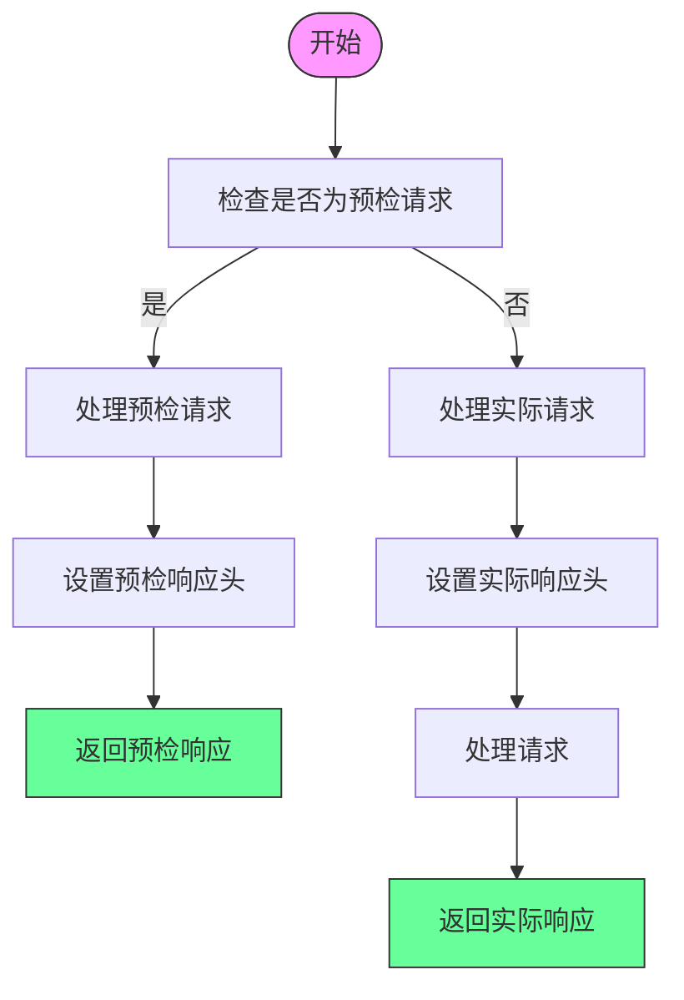

**图示来源**
- [CorsHeaderFilter.java](file://dubbo-rpc\dubbo-rpc-triple\src\main\java\org\apache\dubbo\rpc\protocol\tri\rest\cors\CorsHeaderFilter.java#L110-L140)

CORS处理的关键步骤：
1. 检查请求源是否在允许列表中
2. 验证请求方法是否被允许
3. 验证请求头部是否被允许
4. 设置相应的CORS响应头部
5. 处理实际请求并返回结果

**章节来源**
- [CorsConfig.java](file://dubbo-common\src\main\java\org\apache\dubbo\config\nested\CorsConfig.java#L59-L118)
- [CorsMeta.java](file://dubbo-rpc\dubbo-rpc-triple\src\main\java\org\apache\dubbo\rpc\protocol\tri\rest\mapping\meta\CorsMeta.java#L82-L312)
- [CorsHeaderFilter.java](file://dubbo-rpc\dubbo-rpc-triple\src\main\java\org\apache\dubbo\rpc\protocol\tri\rest\cors\CorsHeaderFilter.java#L50-L141)

## 与主流API网关集成
Dubbo框架可以与主流API网关（如Nginx、Kong）无缝集成，提供统一的API管理和访问入口。

### Nginx集成
通过Nginx可以实现Dubbo服务的反向代理和负载均衡。

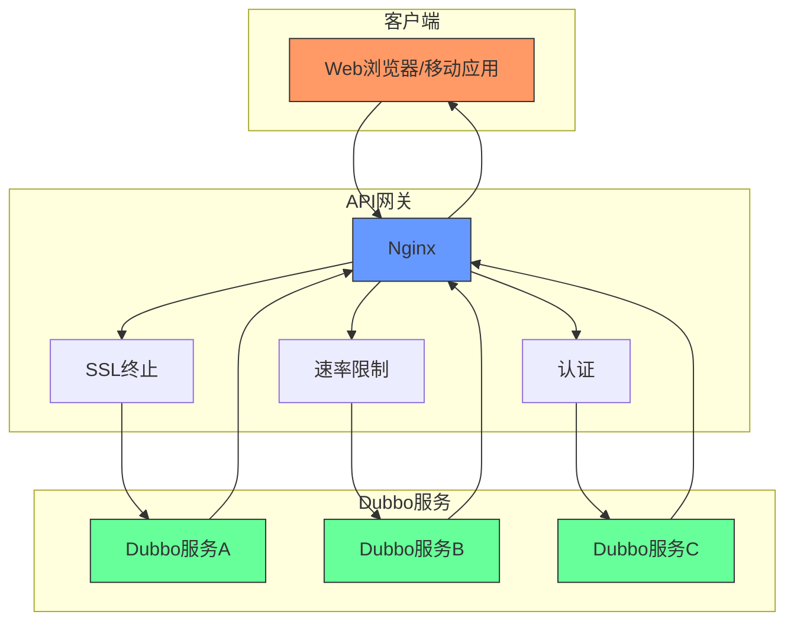

**图示来源**
- [RestConfig.java](file://dubbo-common\src\main\java\org\apache\dubbo\config\nested\RestConfig.java#L195-L209)

Nginx配置示例：
```nginx
server {
    listen 80;
    server_name api.example.com;
    
    location /api/ {
        proxy_pass http://dubbo-services/;
        proxy_set_header Host $host;
        proxy_set_header X-Real-IP $remote_addr;
        proxy_set_header X-Forwarded-For $proxy_add_x_forwarded_for;
        
        # CORS支持
        add_header Access-Control-Allow-Origin *;
        add_header Access-Control-Allow-Methods "GET, POST, PUT, DELETE, OPTIONS";
        add_header Access-Control-Allow-Headers "Content-Type, Authorization";
    }
}
```

### Kong集成
Kong作为API网关，可以为Dubbo服务提供丰富的插件支持。

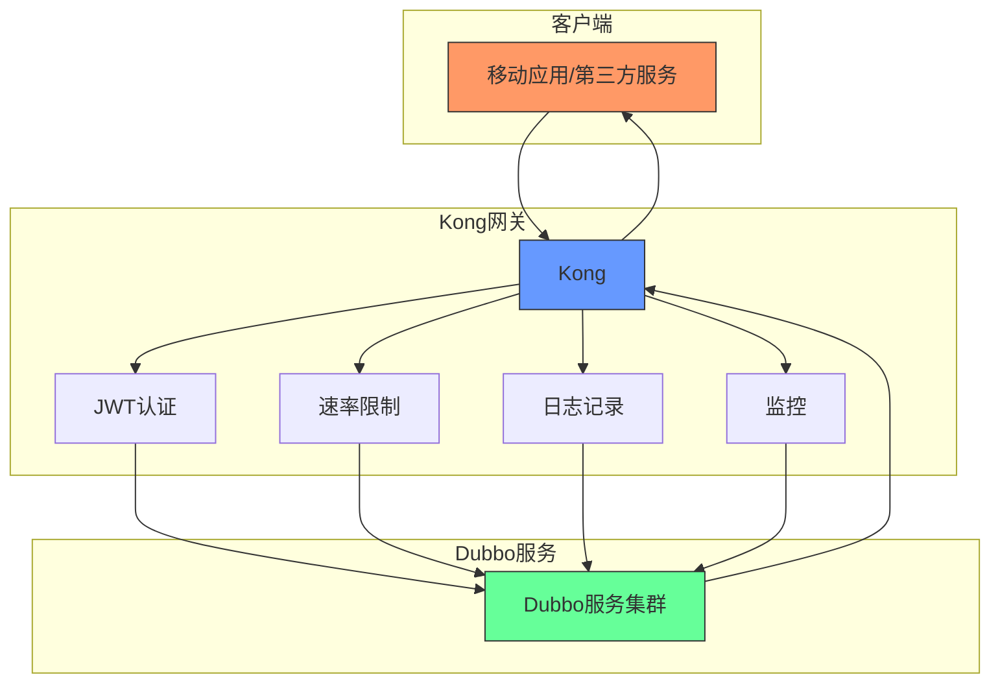

**图示来源**
- [RestConfig.java](file://dubbo-common\src\main\java\org\apache\dubbo\config\nested\RestConfig.java#L211-L239)

Kong集成优势：
- **统一认证**：集中管理API密钥和JWT认证
- **流量控制**：实现精细化的速率限制
- **监控分析**：收集API调用指标和日志
- **插件扩展**：通过插件系统扩展功能

**章节来源**
- [RestConfig.java](file://dubbo-common\src\main\java\org\apache\dubbo\config\nested\RestConfig.java#L179-L240)

## 自定义OpenAPI扩展与插件开发
Dubbo框架提供了灵活的扩展机制，允许开发者自定义OpenAPI生成逻辑和开发插件。

### 扩展点机制
系统通过Java SPI（Service Provider Interface）机制实现扩展点管理。

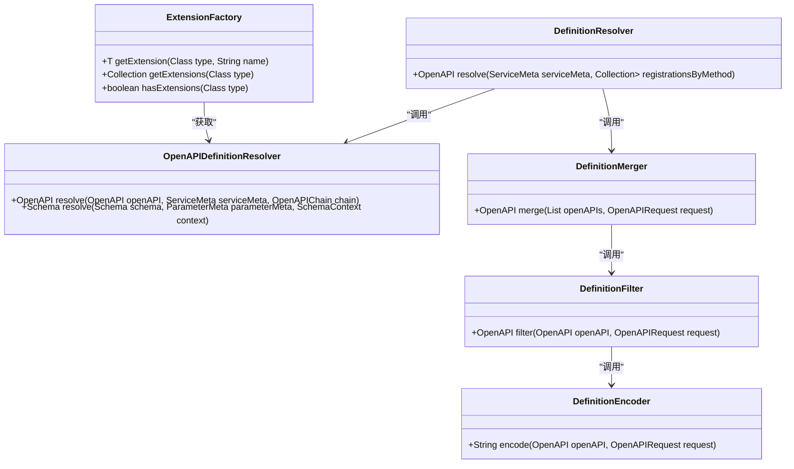

**图示来源**
- [ExtensionFactory.java](file://dubbo-plugin\dubbo-rest-openapi\src\main\java\org\apache\dubbo\rpc\protocol\tri\rest\openapi\ExtensionFactory.java)
- [OpenAPIDefinitionResolver.java](file://dubbo-plugin\dubbo-rest-openapi\src\main\java\org\apache\dubbo\rpc\protocol\tri\rest\openapi\OpenAPIDefinitionResolver.java)

关键扩展点：
- **OpenAPIDefinitionResolver**：定义解析器，用于从服务接口生成OpenAPI定义
- **SchemaResolver**：模式解析器，用于解析数据类型的OpenAPI模式
- **OpenAPIDocumentPublisher**：文档发布器，用于发布生成的OpenAPI文档
- **OpenAPIRequestHandler**：请求处理器，用于处理OpenAPI相关的HTTP请求

### 自定义解析器开发
开发者可以通过实现`OpenAPIDefinitionResolver`接口来自定义OpenAPI生成逻辑。

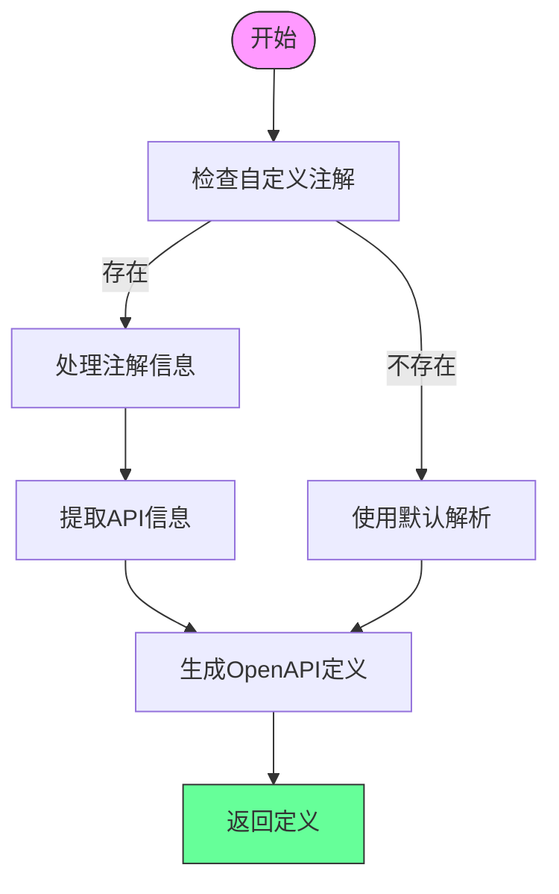

**图示来源**
- [JavadocOpenAPIDefinitionResolver.java](file://dubbo-plugin\dubbo-rest-openapi\src\main\java\org\apache\dubbo\rpc\protocol\tri\rest\support\swagger\JavadocOpenAPIDefinitionResolver.java#L58-L77)
- [SwaggerOpenAPIDefinitionResolver.java](file://dubbo-plugin\dubbo-rest-openapi\src\main\java\org\apache\dubbo\rpc\protocol\tri\rest\support\swagger\SwaggerOpenAPIDefinitionResolver.java#L79-L108)

自定义解析器开发步骤：
1. 创建实现`OpenAPIDefinitionResolver`接口的类
2. 使用`@Activate`注解注册扩展
3. 实现`resolve`方法，定义自定义解析逻辑
4. 在`META-INF/dubbo`目录下创建扩展配置文件

示例代码结构：
```java
@Activate(order = 1000, onClass = "com.example.CustomAnnotation")
public class CustomOpenAPIDefinitionResolver implements OpenAPIDefinitionResolver {
    
    @Override
    public OpenAPI resolve(OpenAPI openAPI, ServiceMeta serviceMeta, OpenAPIChain chain) {
        // 自定义解析逻辑
        return openAPI;
    }
}
```

**章节来源**
- [JavadocOpenAPIDefinitionResolver.java](file://dubbo-plugin\dubbo-rest-openapi\src\main\java\org\apache\dubbo\rpc\protocol\tri\rest\support\swagger\JavadocOpenAPIDefinitionResolver.java#L58-L77)
- [SwaggerOpenAPIDefinitionResolver.java](file://dubbo-plugin\dubbo-rest-openapi\src\main\java\org\apache\dubbo\rpc\protocol\tri\rest\support\swagger\SwaggerOpenAPIDefinitionResolver.java#L79-L108)
- [ExtensionFactory.java](file://dubbo-plugin\dubbo-rest-openapi\src\main\java\org\apache\dubbo\rpc\protocol\tri\rest\openapi\ExtensionFactory.java)

## 结论
本文档详细介绍了Dubbo框架中Triple协议的元数据与OpenAPI集成机制。通过分析代码库，我们深入了解了元数据服务的工作原理、OpenAPI文档的自动生成机制、服务元数据的查询方式以及相关的安全配置和跨域设置。

核心要点总结：
1. **元数据服务**：通过`MetadataServiceDelegation`实现服务接口的动态发现和描述
2. **OpenAPI生成**：基于扩展点机制，从服务接口自动生成符合规范的OpenAPI文档
3. **查询方式**：支持QoS命令和REST API两种方式查询服务元数据
4. **安全配置**：提供API密钥认证和访问控制策略，确保API安全
5. **CORS支持**：完整的跨域资源共享配置，支持前端应用跨域调用
6. **网关集成**：与Nginx、Kong等主流API网关无缝集成
7. **扩展开发**：灵活的扩展机制，支持自定义OpenAPI生成逻辑

这些特性使得Dubbo框架能够很好地支持现代微服务架构中的API管理和文档化需求，为开发者提供了强大的工具来构建和维护高质量的分布式系统。

**章节来源**
- [MetadataServiceDelegation.java](file://dubbo-registry\dubbo-registry-api\src\main\java\org\apache\dubbo\registry\client\metadata\MetadataServiceDelegation.java#L223-L231)
- [DefaultOpenAPIService.java](file://dubbo-plugin\dubbo-rest-openapi\src\main\java\org\apache\dubbo\rpc\protocol\tri\rest\openapi\DefaultOpenAPIService.java#L67-L242)
- [GetOpenAPI.java](file://dubbo-plugin\dubbo-qos\src\main\java\org\apache\dubbo\qos\command\impl\GetOpenAPI.java#L28-L93)
- [CorsConfig.java](file://dubbo-common\src\main\java\org\apache\dubbo\config\nested\CorsConfig.java#L59-L118)
- [RestConfig.java](file://dubbo-common\src\main\java\org\apache\dubbo\config\nested\RestConfig.java#L179-L240)