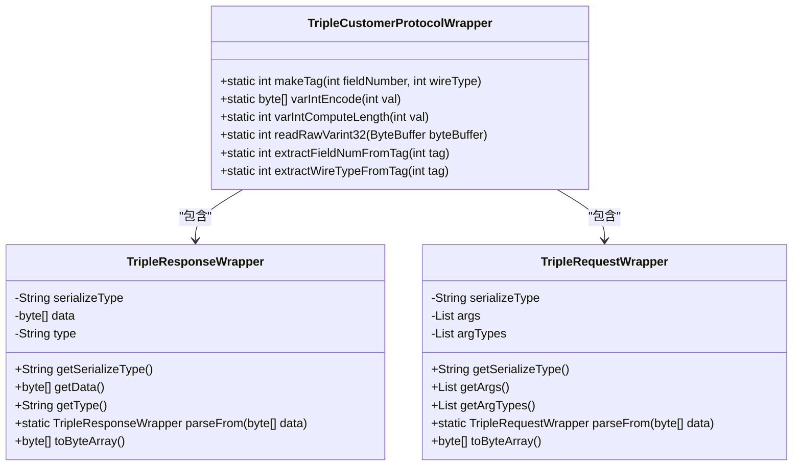
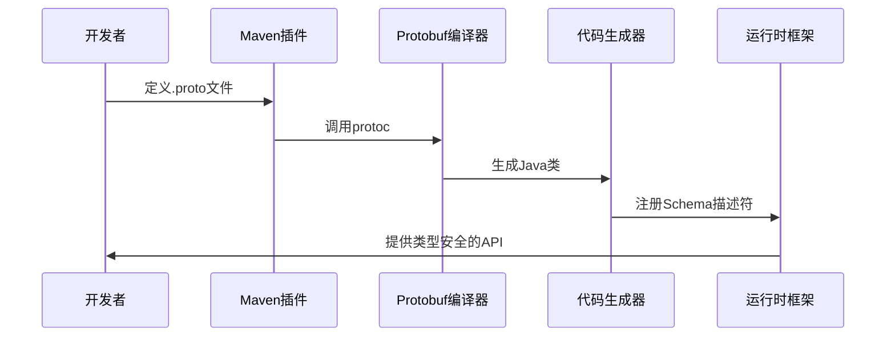
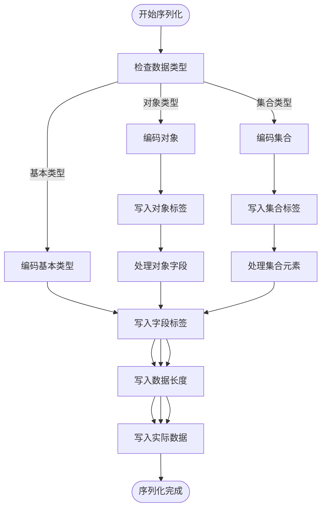
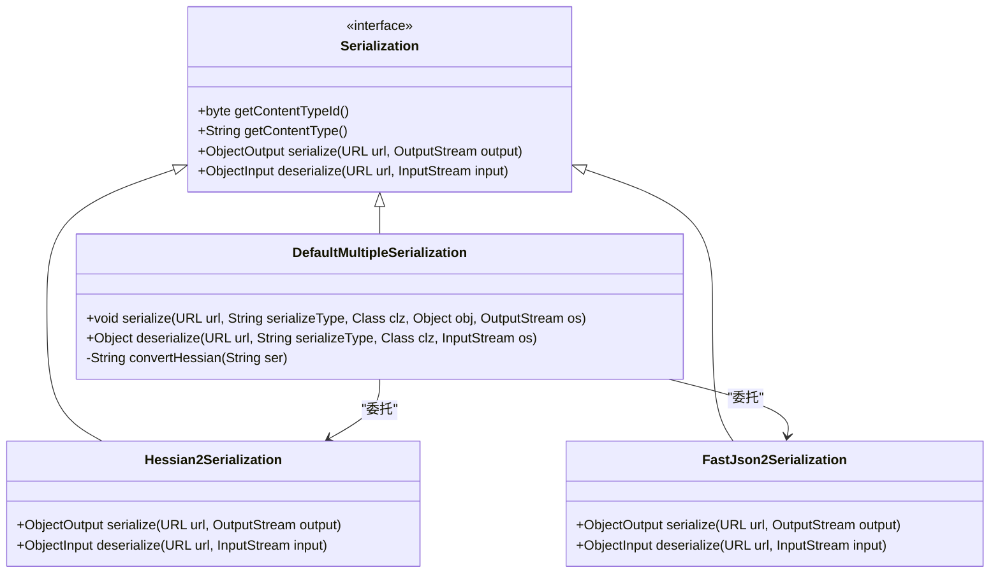
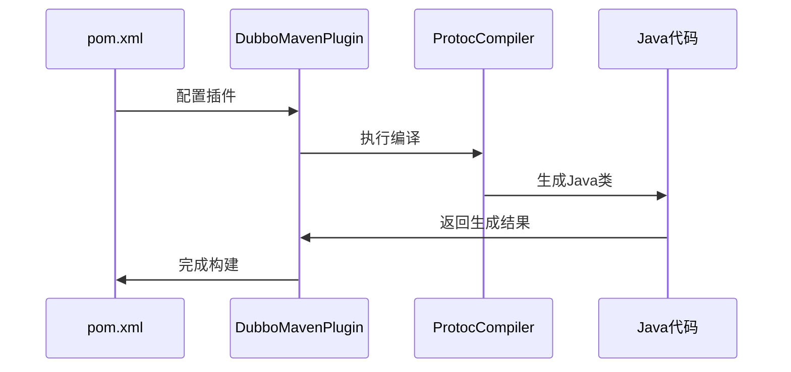
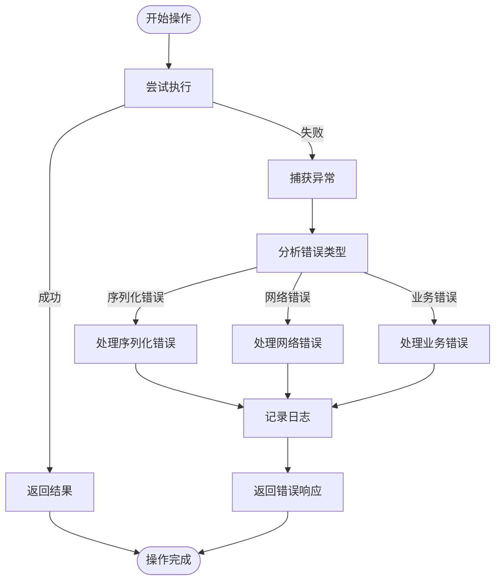

# 序列化与反序列化

<cite>
**本文档引用的文件**   
- [TripleCustomerProtocolWrapper.java](file://dubbo-rpc\dubbo-rpc-triple\src\main\java\org\apache\dubbo\rpc\protocol\tri\TripleCustomerProtocolWrapper.java)
- [TripleCustomerProtocolWrapperTest.java](file://dubbo-rpc\dubbo-rpc-triple\src\test\java\org\apache\dubbo\rpc\protocol\tri\TripleCustomerProtocolWrapperTest.java)
- [DefaultMultipleSerialization.java](file://dubbo-serialization\dubbo-serialization-api\src\main\java\org\apache\dubbo\common\serialize\DefaultMultipleSerialization.java)
- [Hessian2ObjectOutput.java](file://dubbo-serialization\dubbo-serialization-hessian2\src\main\java\org\apache\dubbo\common\serialize\hessian2\Hessian2ObjectOutput.java)
- [Hessian2ObjectInput.java](file://dubbo-serialization\dubbo-serialization-hessian2\src\main\java\org\apache\dubbo\common\serialize\hessian2\Hessian2ObjectInput.java)
- [Hessian2Serialization.java](file://dubbo-serialization\dubbo-serialization-hessian2\src\main\java\org\apache\dubbo\common\serialize\hessian2\Hessian2Serialization.java)
- [Serialization.java](file://dubbo-serialization\dubbo-serialization-api\src\main\java\org\apache\dubbo\common\serialize\Serialization.java)
- [FastJson2Serialization.java](file://dubbo-serialization\dubbo-serialization-fastjson2\src\main\java\org\apache\dubbo\common\serialize\fastjson2\FastJson2Serialization.java)
- [DubboProtocPlugin.java](file://dubbo-maven-plugin\src\main\java\org\apache\dubbo\maven\plugin\protoc\DubboProtocPlugin.java)
- [TripleProtocol.java](file://dubbo-rpc\dubbo-rpc-triple\src\main\java\org\apache\dubbo\rpc\protocol\tri\TripleProtocol.java)
- [message.proto](file://dubbo-demo\dubbo-demo-spring-boot-idl\dubbo-demo-spring-boot-idl-provider\src\main\proto\message.proto)
- [TripleWebSocketFilter.java](file://dubbo-plugin\dubbo-triple-websocket\src\main\java\org\apache\dubbo\rpc\protocol\tri\websocket\TripleWebSocketFilter.java)
</cite>

## 目录
1. [引言](#引言)
2. [Triple协议序列化格式](#triple协议序列化格式)
3. [Protobuf原生支持与IDL集成](#protobuf原生支持与idl集成)
4. [序列化类型映射与编码规则](#序列化类型映射与编码规则)
5. [多序列化方式集成](#多序列化方式集成)
6. [IDL到Java代码生成流程](#idl到java代码生成流程)
7. [Protobuf基础语法教程](#protobuf基础语法教程)
8. [自定义序列化器SPI扩展](#自定义序列化器spi扩展)
9. [性能对比与兼容性](#性能对比与兼容性)
10. [错误处理策略](#错误处理策略)

## 引言

Triple协议是Dubbo框架中基于HTTP/2的高性能RPC协议，其核心优势在于对序列化的灵活支持。本文档深入解析Triple协议的序列化与反序列化机制，重点阐述其对Protobuf的原生支持、多种序列化方式的集成以及IDL到Java代码的生成流程。通过分析代码实现和设计模式，为开发者提供全面的技术指导。

## Triple协议序列化格式

Triple协议采用自定义的二进制序列化格式，通过`TripleCustomerProtocolWrapper`类实现请求和响应的包装。该格式基于变长整数编码（VarInt）和Protobuf的Wire Type设计，确保高效的数据传输。



**图示来源**
- [TripleCustomerProtocolWrapper.java](file://dubbo-rpc\dubbo-rpc-triple\src\main\java\org\apache\dubbo\rpc\protocol\tri\TripleCustomerProtocolWrapper.java)

**本节来源**
- [TripleCustomerProtocolWrapper.java](file://dubbo-rpc\dubbo-rpc-triple\src\main\java\org\apache\dubbo\rpc\protocol\tri\TripleCustomerProtocolWrapper.java)
- [TripleCustomerProtocolWrapperTest.java](file://dubbo-rpc\dubbo-rpc-triple\src\test\java\org\apache\dubbo\rpc\protocol\tri\TripleCustomerProtocolWrapperTest.java)

## Protobuf原生支持与IDL集成

Triple协议通过`DubboProtocPlugin`和`SchemaDescriptorRegistry`实现对Protobuf的原生支持。开发者可以通过`.proto`文件定义服务接口和消息结构，框架会自动生成相应的Java代码。



**图示来源**
- [DubboProtocPlugin.java](file://dubbo-maven-plugin\src\main\java\org\apache\dubbo\maven\plugin\protoc\DubboProtocPlugin.java)
- [MessageServiceTest.java](file://dubbo-demo\dubbo-demo-spring-boot-idl\dubbo-demo-spring-boot-idl-provider\src\test\java\org\apache\dubbo\springboot\idl\demo\MessageServiceTest.java)

**本节来源**
- [DubboProtocPlugin.java](file://dubbo-maven-plugin\src\main\java\org\apache\dubbo\maven\plugin\protoc\DubboProtocPlugin.java)
- [message.proto](file://dubbo-demo\dubbo-demo-spring-boot-idl\dubbo-demo-spring-boot-idl-provider\src\main\proto\message.proto)

## 序列化类型映射与编码规则

Triple协议定义了严格的类型映射规则，通过`Serialization`接口实现不同序列化方式的统一抽象。核心编码规则包括：

1. **字段编码**：使用`makeTag`方法生成字段标签，包含字段编号和线类型
2. **变长整数**：采用VarInt编码减少小数值的存储空间
3. **字符串编码**：使用UTF-8编码并前置长度信息



**图示来源**
- [TripleCustomerProtocolWrapper.java](file://dubbo-rpc\dubbo-rpc-triple\src\main\java\org\apache\dubbo\rpc\protocol\tri\TripleCustomerProtocolWrapper.java)

**本节来源**
- [TripleCustomerProtocolWrapper.java](file://dubbo-rpc\dubbo-rpc-triple\src\main\java\org\apache\dubbo\rpc\protocol\tri\TripleCustomerProtocolWrapper.java)
- [Serialization.java](file://dubbo-serialization\dubbo-serialization-api\src\main\java\org\apache\dubbo\common\serialize\Serialization.java)

## 多序列化方式集成

Dubbo通过SPI机制支持多种序列化方式，包括Hessian2、FastJSON2等。`DefaultMultipleSerialization`类作为默认实现，负责协调不同序列化器的使用。



**图示来源**
- [Serialization.java](file://dubbo-serialization\dubbo-serialization-api\src\main\java\org\apache\dubbo\common\serialize\Serialization.java)
- [DefaultMultipleSerialization.java](file://dubbo-serialization\dubbo-serialization-api\src\main\java\org\apache\dubbo\common\serialize\DefaultMultipleSerialization.java)

**本节来源**
- [DefaultMultipleSerialization.java](file://dubbo-serialization\dubbo-serialization-api\src\main\java\org\apache\dubbo\common\serialize\DefaultMultipleSerialization.java)
- [Hessian2Serialization.java](file://dubbo-serialization\dubbo-serialization-hessian2\src\main\java\org\apache\dubbo\common\serialize\hessian2\Hessian2Serialization.java)
- [FastJson2Serialization.java](file://dubbo-serialization\dubbo-serialization-fastjson2\src\main\java\org\apache\dubbo\common\serialize\fastjson2\FastJson2Serialization.java)

## IDL到Java代码生成流程

IDL到Java代码的生成流程通过Maven插件自动化完成。`dubbo-maven-plugin`负责调用Protobuf编译器，将`.proto`文件转换为Java类。



**图示来源**
- [DubboProtocPlugin.java](file://dubbo-maven-plugin\src\main\java\org\apache\dubbo\maven\plugin\protoc\DubboProtocPlugin.java)
- [pom.xml](file://dubbo-demo\dubbo-demo-spring-boot-idl\dubbo-demo-spring-boot-idl-provider\pom.xml)

**本节来源**
- [DubboProtocPlugin.java](file://dubbo-maven-plugin\src\main\java\org\apache\dubbo\maven\plugin\protoc\DubboProtocPlugin.java)
- [pom.xml](file://dubbo-demo\dubbo-demo-spring-boot-idl\dubbo-demo-spring-boot-idl-provider\pom.xml)

## Protobuf基础语法教程

Protobuf使用`.proto`文件定义数据结构和服务接口。基本语法包括：

```protobuf
syntax = "proto3";

option java_multiple_files = true;
option java_package = "org.apache.dubbo.demo.message";
option java_outer_classname = "Message";

package message;

// 请求消息
message HelloRequest {
    string name = 1;
}

// 响应消息
message HelloReply {
    string message = 1;
}

// 服务定义
service MessageService {
    rpc sayHello(HelloRequest) returns (HelloReply);
}
```

关键语法要素：
- `syntax`：指定Protobuf版本
- `option`：设置生成代码的选项
- `package`：定义命名空间
- `message`：定义消息结构
- `rpc`：定义服务方法

**本节来源**
- [message.proto](file://dubbo-demo\dubbo-demo-spring-boot-idl\dubbo-demo-spring-boot-idl-provider\src\main\proto\message.proto)

## 自定义序列化器SPI扩展

开发者可以通过实现`Serialization`接口创建自定义序列化器。SPI扩展机制允许在运行时动态加载和使用自定义序列化器。

```mermaid
classDiagram
class CustomSerialization {
+byte getContentTypeId()
+String getContentType()
+ObjectOutput serialize(URL url, OutputStream output)
+ObjectInput deserialize(URL url, InputStream input)
}
class Serialization {
<<interface>>
+byte getContentTypeId()
+String getContentType()
+ObjectOutput serialize(URL url, OutputStream output)
+ObjectInput deserialize(URL url, InputStream input)
}
Serialization <|-- CustomSerialization
CustomSerialization --> "自定义编码器" : "实现"
CustomSerialization --> "自定义解码器" : "实现"
```

**图示来源**
- [Serialization.java](file://dubbo-serialization\dubbo-serialization-api\src\main\java\org\apache\dubbo\common\serialize\Serialization.java)

**本节来源**
- [Serialization.java](file://dubbo-serialization\dubbo-serialization-api\src\main\java\org\apache\dubbo\common\serialize\Serialization.java)

## 性能对比与兼容性

Triple协议在性能和兼容性方面表现出色。与传统序列化方式相比，其优势包括：

| 序列化方式 | 性能 | 兼容性 | 适用场景 |
|-----------|------|--------|----------|
| Protobuf | 高 | 高 | 跨语言服务 |
| Hessian2 | 中 | 高 | Java内部通信 |
| FastJSON2 | 中 | 中 | JSON接口 |

兼容性考虑：
- 支持HTTP/2和WebSocket协议
- 向下兼容旧版本Dubbo
- 支持多种压缩算法

**本节来源**
- [TripleProtocol.java](file://dubbo-rpc\dubbo-rpc-triple\src\main\java\org\apache\dubbo\rpc\protocol\tri\TripleProtocol.java)
- [TripleWebSocketFilter.java](file://dubbo-plugin\dubbo-triple-websocket\src\main\java\org\apache\dubbo\rpc\protocol\tri\websocket\TripleWebSocketFilter.java)

## 错误处理策略

Triple协议采用分层错误处理机制，确保系统的稳定性和可维护性。关键策略包括：

1. **异常捕获**：在序列化/反序列化过程中捕获并处理异常
2. **错误码映射**：将底层异常映射为标准错误码
3. **日志记录**：详细记录错误信息便于排查



**图示来源**
- [TripleCustomerProtocolWrapper.java](file://dubbo-rpc\dubbo-rpc-triple\src\main\java\org\apache\dubbo\rpc\protocol\tri\TripleCustomerProtocolWrapper.java)

**本节来源**
- [TripleCustomerProtocolWrapper.java](file://dubbo-rpc\dubbo-rpc-triple\src\main\java\org\apache\dubbo\rpc\protocol\tri\TripleCustomerProtocolWrapper.java)
- [TripleProtocol.java](file://dubbo-rpc\dubbo-rpc-triple\src\main\java\org\apache\dubbo\rpc\protocol\tri\TripleProtocol.java)