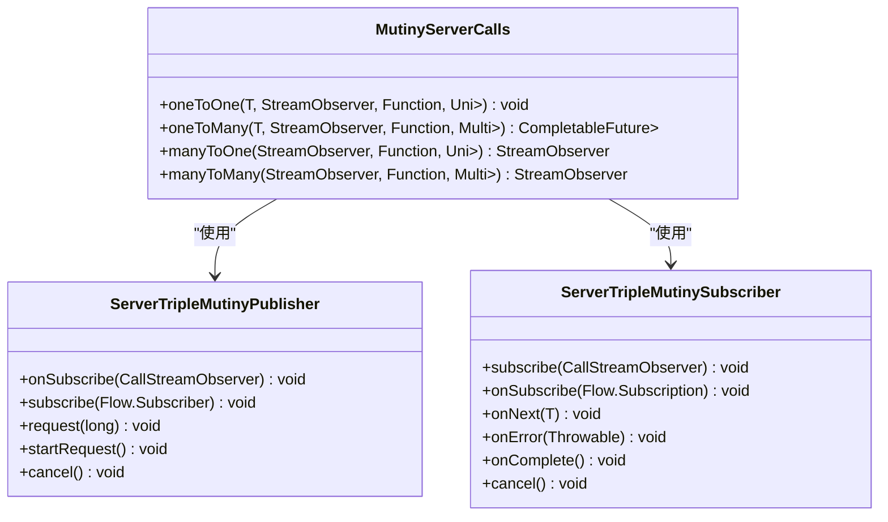
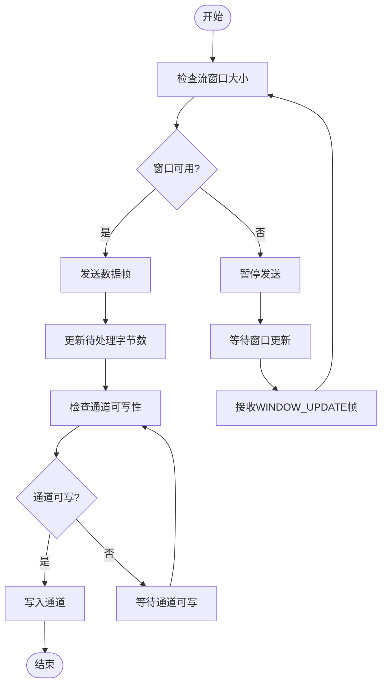
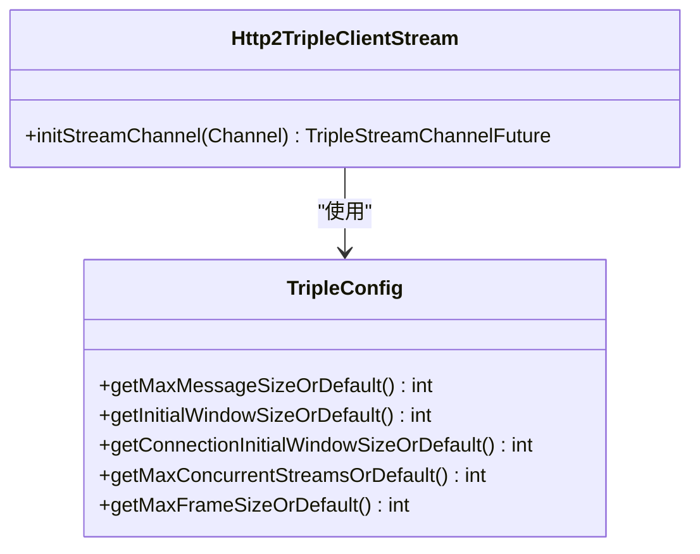
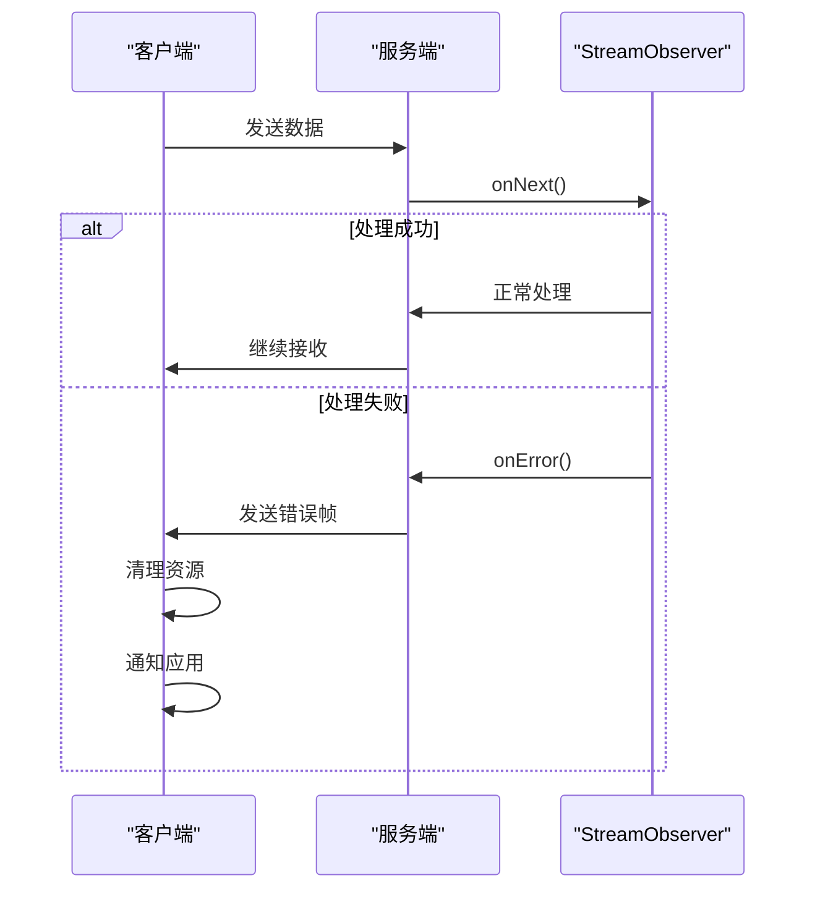
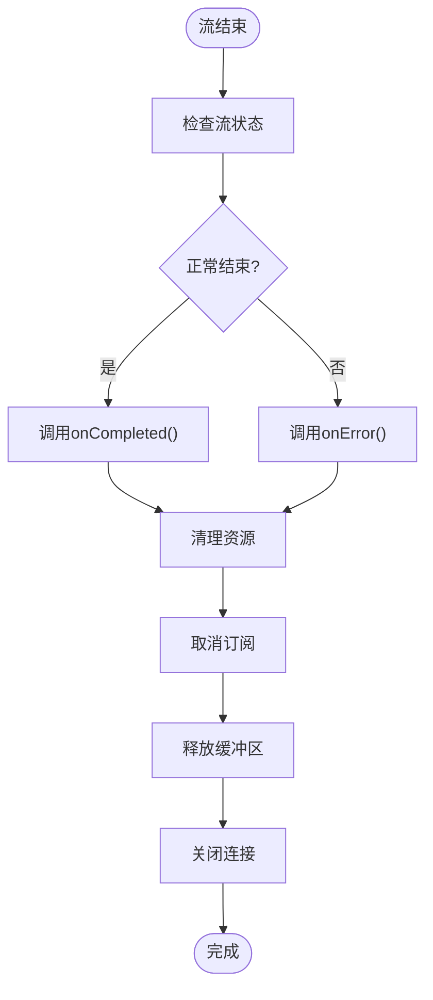

# 流式调用

<cite>
**本文档引用文件**   
- [MutinyServerCalls.java](file://dubbo-plugin\dubbo-mutiny\src\main\java\org\apache\dubbo\mutiny\calls\MutinyServerCalls.java)
- [AbstractTripleMutinyPublisher.java](file://dubbo-plugin\dubbo-mutiny\src\main\java\org\apache\dubbo\mutiny\AbstractTripleMutinyPublisher.java)
- [AbstractTripleMutinySubscriber.java](file://dubbo-plugin\dubbo-mutiny\src\main\java\org\apache\dubbo\mutiny\AbstractTripleMutinySubscriber.java)
- [TripleConfig.java](file://dubbo-common\src\main\java\org\apache\dubbo\config\nested\TripleConfig.java)
- [TriHttp2RemoteFlowController.java](file://dubbo-rpc\dubbo-rpc-triple\src\main\java\org\apache\dubbo\rpc\protocol\tri\TriHttp2RemoteFlowController.java)
- [ClientCallToObserverAdapter.java](file://dubbo-rpc\dubbo-rpc-triple\src\main\java\org\apache\dubbo\rpc\protocol\tri\observer\ClientCallToObserverAdapter.java)
- [CallStreamObserver.java](file://dubbo-rpc\dubbo-rpc-triple\src\main\java\org\apache\dubbo\rpc\protocol\tri\observer\CallStreamObserver.java)
- [Http2TripleClientStream.java](file://dubbo-rpc\dubbo-rpc-triple\src\main\java\org\apache\dubbo\rpc\protocol\tri\h12\http2\Http2TripleClientStream.java)
- [MutinyDubbo3TripleGenerator.java](file://dubbo-plugin\dubbo-compiler\src\main\java\org\apache\dubbo\gen\tri\mutiny\MutinyDubbo3TripleGenerator.java)
- [AbstractTripleReactorPublisher.java](file://dubbo-plugin\dubbo-reactive\src\main\java\org\apache\dubbo\reactive\AbstractTripleReactorPublisher.java)
</cite>

## 目录
1. [简介](#简介)
2. [Triple协议流式调用模式](#triple协议流式调用模式)
3. [编程模型与API](#编程模型与api)
4. [背压机制](#背压机制)
5. [流控参数调优](#流控参数调优)
6. [异常恢复策略](#异常恢复策略)
7. [超时处理与连接保持](#超时处理与连接保持)
8. [资源清理](#资源清理)
9. [与传统RPC调用对比](#与传统rpc调用对比)
10. [总结](#总结)

## 简介
Triple协议是Dubbo框架中基于HTTP/2的高性能RPC协议，支持三种流式调用模式：客户端流、服务端流和双向流。这些模式基于Reactive Streams规范，提供了非阻塞、背压感知的数据流处理能力。客户端流模式适用于日志聚合等场景，服务端流模式适用于实时数据推送，双向流模式适用于聊天应用等交互式场景。本文档详细介绍了这三种模式的实现原理、编程模型和使用方法。

## Triple协议流式调用模式

### 客户端流模式
客户端流模式（Client Streaming）允许客户端向服务端发送多个消息，服务端最终返回一个响应。这种模式适用于需要批量提交数据的场景，如日志聚合。在实现上，客户端通过`StreamObserver`接口发送数据流，服务端通过`Multi<T>`接收数据流并处理。

### 服务端流模式
服务端流模式（Server Streaming）允许服务端向客户端推送多个消息，客户端发送一个请求后接收数据流。这种模式适用于实时数据推送场景，如股票行情、实时通知等。服务端通过`Multi<R>`生成数据流，客户端通过`StreamObserver`接收数据流。

### 双向流模式
双向流模式（Bidirectional Streaming）允许客户端和服务端同时发送和接收数据流，实现全双工通信。这种模式适用于聊天应用、实时协作等交互式场景。双方都通过`StreamObserver`接口发送和接收数据流，实现持续的双向通信。

**Section sources**
- [MutinyServerCalls.java](file://dubbo-plugin\dubbo-mutiny\src\main\java\org\apache\dubbo\mutiny\calls\MutinyServerCalls.java#L36-L153)

## 编程模型与API

### Mutiny API实现
Triple协议提供了Mutiny API实现，通过`Uni`和`Multi`类型支持响应式编程。`Uni`表示单个异步值，`Multi`表示异步数据流。服务端调用通过`MutinyServerCalls`类提供四种方法：
- `oneToOne`: 一对一调用
- `oneToMany`: 一对多调用
- `manyToOne`: 多对一调用  
- `manyToMany`: 多对多调用

**Diagram sources **
- [MutinyServerCalls.java](file://dubbo-plugin\dubbo-mutiny\src\main\java\org\apache\dubbo\mutiny\calls\MutinyServerCalls.java#L36-L153)
- [AbstractTripleMutinyPublisher.java](file://dubbo-plugin\dubbo-mutiny\src\main\java\org\apache\dubbo\mutiny\AbstractTripleMutinyPublisher.java#L31-L162)
- [AbstractTripleMutinySubscriber.java](file://dubbo-plugin\dubbo-mutiny\src\main\java\org\apache\dubbo\mutiny\AbstractTripleMutinySubscriber.java#L28-L102)

### Reactive Streams API实现
除了Mutiny API，Triple协议还提供了Reactive Streams API实现，通过`Publisher`和`Subscriber`接口支持响应式编程。`AbstractTripleReactorPublisher`和`AbstractTripleReactorSubscriber`类提供了Reactor模式的实现，与Mutiny API类似但基于不同的响应式库。

**Section sources**
- [AbstractTripleReactorPublisher.java](file://dubbo-plugin\dubbo-reactive\src\main\java\org\apache\dubbo\reactive\AbstractTripleReactorPublisher.java#L34-L170)

## 背压机制
背压（Backpressure）是流式调用中的关键机制，用于控制数据流速，防止内存溢出。Triple协议基于HTTP/2的流控制机制实现背压，通过`FlowControlStreamObserver`接口提供流控制功能。

### 流控制实现
`TriHttp2RemoteFlowController`类实现了HTTP/2的远程流控制，通过`FlowState`管理每个流的窗口大小和待处理字节数。当接收方的缓冲区接近满时，会暂停数据接收，直到有足够的空间。

**Diagram sources **
- [TriHttp2RemoteFlowController.java](file://dubbo-rpc\dubbo-rpc-triple\src\main\java\org\apache\dubbo\rpc\protocol\tri\TriHttp2RemoteFlowController.java#L54-L781)

### 背压策略
Triple协议提供了两种背压策略：
1. **自动流控制**：默认启用，接收方自动请求数据
2. **手动流控制**：通过`disableAutoFlowControl()`方法禁用自动流控制，由应用显式调用`request()`方法请求数据

**Section sources**
- [CallStreamObserver.java](file://dubbo-rpc\dubbo-rpc-triple\src\main\java\org\apache\dubbo\rpc\protocol\tri\observer\CallStreamObserver.java#L44-L51)
- [ClientCallToObserverAdapter.java](file://dubbo-rpc\dubbo-rpc-triple\src\main\java\org\apache\dubbo\rpc\protocol\tri\observer\ClientCallToObserverAdapter.java#L74-L78)

## 流控参数调优
Triple协议提供了丰富的流控参数，可以通过`TripleConfig`类进行配置和调优。

### 关键流控参数
| 参数 | 默认值 | 说明 |
|------|-------|------|
| maxMessageSize | 50MB | 最大消息大小 |
| initialWindowSize | 8MB | 初始窗口大小 |
| connectionInitialWindowSize | 64KB | 连接初始窗口大小 |
| maxConcurrentStreams | Integer.MAX_VALUE | 最大并发流数 |
| maxFrameSize | 8MB | 最大帧大小 |

**Diagram sources **
- [TripleConfig.java](file://dubbo-common\src\main\java\org\apache\dubbo\config\nested\TripleConfig.java#L27-L406)
- [Http2TripleClientStream.java](file://dubbo-rpc\dubbo-rpc-triple\src\main\java\org\apache\dubbo\rpc\protocol\tri\h12\http2\Http2TripleClientStream.java#L36-L75)

### 调优建议
1. **大消息场景**：增加`maxMessageSize`和`initialWindowSize`
2. **高并发场景**：调整`maxConcurrentStreams`以平衡资源使用
3. **低延迟场景**：减小`maxFrameSize`以降低延迟
4. **内存受限场景**：减小所有窗口大小参数以降低内存使用

**Section sources**
- [TripleConfig.java](file://dubbo-common\src\main\java\org\apache\dubbo\config\nested\TripleConfig.java#L27-L406)

## 异常恢复策略
流式调用中的异常恢复是确保系统可靠性的关键。Triple协议提供了完善的异常处理机制。

### 异常处理流程

**Diagram sources **
- [ClientCallToObserverAdapter.java](file://dubbo-rpc\dubbo-rpc-triple\src\main\java\org\apache\dubbo\rpc\protocol\tri\observer\ClientCallToObserverAdapter.java#L44-L48)
- [MutinyServerCalls.java](file://dubbo-plugin\dubbo-mutiny\src\main\java\org\apache\dubbo\mutiny\calls\MutinyServerCalls.java#L148-L152)

### 恢复策略
1. **重试机制**：对于可重试的异常，实现指数退避重试
2. **断路器模式**：在连续失败后打开断路器，避免雪崩
3. **降级策略**：在服务不可用时返回默认值或缓存数据
4. **资源清理**：确保在异常情况下正确清理流资源

**Section sources**
- [MutinyServerCalls.java](file://dubbo-plugin\dubbo-mutiny\src\main\java\org\apache\dubbo\mutiny\calls\MutinyServerCalls.java#L148-L152)

## 超时处理与连接保持
流式调用需要特别关注超时和连接保持问题，以确保系统的稳定性和可靠性。

### 超时配置
Triple协议支持多种超时配置：
- **连接超时**：建立连接的超时时间
- **请求超时**：单个请求的超时时间
- **流超时**：整个流的超时时间
- **心跳超时**：连接保持的心跳间隔

### 连接保持机制
通过HTTP/2的PING帧实现连接保持，定期发送心跳包检测连接状态。当连接异常断开时，客户端可以自动重连。

**Section sources**
- [TripleConfig.java](file://dubbo-common\src\main\java\org\apache\dubbo\config\nested\TripleConfig.java#L27-L406)

## 资源清理
流式调用中的资源清理至关重要，必须确保在流结束或异常时正确释放资源。

### 清理流程
1. **取消订阅**：调用`cancel()`方法取消流订阅
2. **关闭观察者**：调用`onCompleted()`或`onError()`关闭流
3. **释放缓冲区**：清理流控制相关的缓冲区
4. **关闭连接**：在所有流结束后关闭底层连接

**Diagram sources **
- [AbstractTripleMutinyPublisher.java](file://dubbo-plugin\dubbo-mutiny\src\main\java\org\apache\dubbo\mutiny\AbstractTripleMutinyPublisher.java#L114-L118)
- [AbstractTripleMutinySubscriber.java](file://dubbo-plugin\dubbo-mutiny\src\main\java\org\apache\dubbo\mutiny\AbstractTripleMutinySubscriber.java#L91-L96)

**Section sources**
- [AbstractTripleMutinyPublisher.java](file://dubbo-plugin\dubbo-mutiny\src\main\java\org\apache\dubbo\mutiny\AbstractTripleMutinyPublisher.java#L114-L118)
- [AbstractTripleMutinySubscriber.java](file://dubbo-plugin\dubbo-mutiny\src\main\java\org\apache\dubbo\mutiny\AbstractTripleMutinySubscriber.java#L91-L96)

## 与传统RPC调用对比
流式调用与传统RPC调用在多个方面存在显著差异。

### 对比表格
| 特性 | 传统RPC调用 | 流式调用 |
|------|------------|---------|
| 通信模式 | 请求-响应 | 流式通信 |
| 数据传输 | 单次批量 | 持续流式 |
| 背压支持 | 无 | 有 |
| 内存使用 | 高（需缓存完整数据） | 低（流式处理） |
| 延迟 | 较高（等待完整响应） | 较低（即时处理） |
| 适用场景 | 简单CRUD操作 | 实时数据处理 |

### 选择建议
- **传统RPC调用**：适用于简单的请求-响应场景，如查询、更新等操作
- **流式调用**：适用于大数据量传输、实时数据处理、交互式应用等场景

## 总结
Triple协议的流式调用提供了强大的流处理能力，支持客户端流、服务端流和双向流三种模式。通过Mutiny和Reactive Streams API，开发者可以轻松实现响应式编程。背压机制确保了系统的稳定性，防止内存溢出。合理的流控参数调优和异常恢复策略是构建可靠流式应用的关键。与传统RPC调用相比，流式调用在处理大数据量和实时数据方面具有明显优势，是现代分布式系统的重要组成部分。