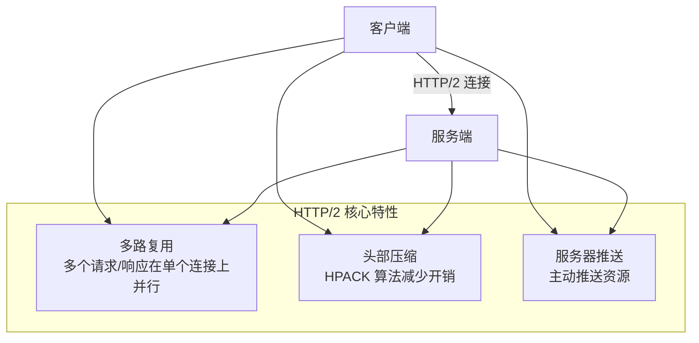
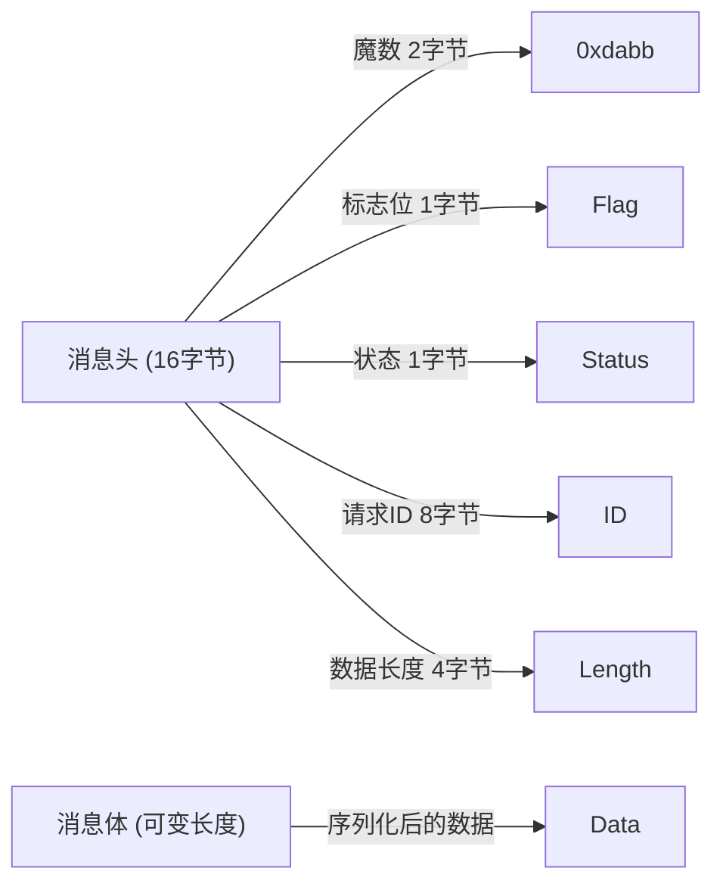
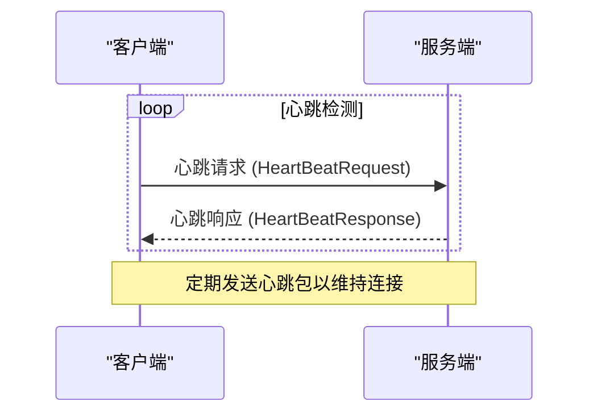
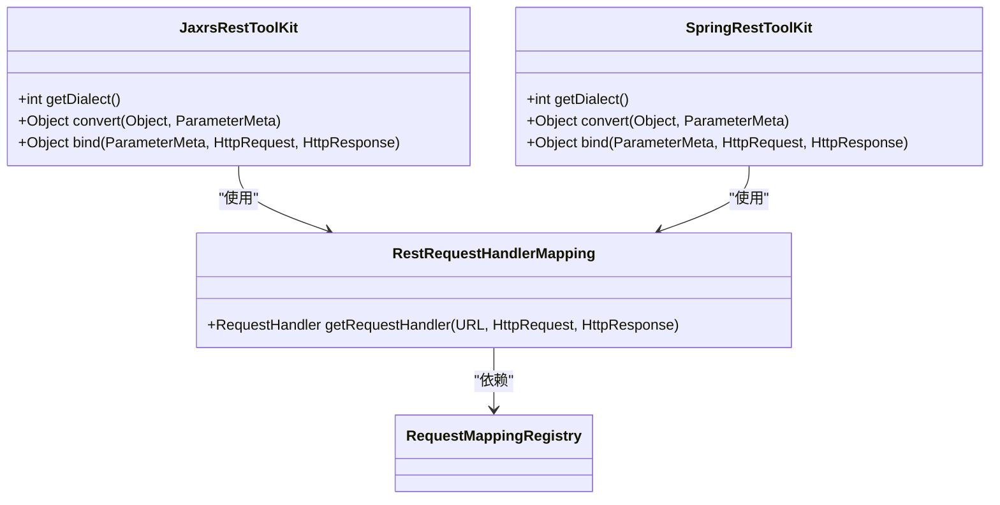

# 通信协议

<cite>
**本文档引用文件**  
- [TripleProtocol.java](file://dubbo-rpc\dubbo-rpc-triple\src\main\java\org\apache\dubbo\rpc\protocol\tri\TripleProtocol.java)
- [DubboProtocol.java](file://dubbo-rpc\dubbo-rpc-dubbo\src\main\java\org\apache\dubbo\rpc\protocol\dubbo\DubboProtocol.java)
- [AbstractProtocol.java](file://dubbo-rpc\dubbo-rpc-api\src\main\java\org\apache\dubbo\rpc\protocol\AbstractProtocol.java)
- [HeaderExchangeClient.java](file://dubbo-remoting\dubbo-remoting-api\src\main\java\org\apache\dubbo\remoting\exchange\support\header\HeaderExchangeClient.java)
- [ExchangeCodec.java](file://dubbo-remoting\dubbo-remoting-api\src\main\java\org\apache\dubbo\remoting\exchange\codec\ExchangeCodec.java)
- [RequestMetadata.java](file://dubbo-rpc\dubbo-rpc-triple\src\main\java\org\apache\dubbo\rpc\protocol\tri\RequestMetadata.java)
- [RequestMappingRegistry.java](file://dubbo-rpc\dubbo-rpc-triple\src\main\java\org\apache\dubbo\rpc\protocol\tri\rest\mapping\RequestMappingRegistry.java)
- [JaxrsRestToolKit.java](file://dubbo-plugin\dubbo-rest-jaxrs\src\main\java\org\apache\dubbo\rpc\protocol\tri\rest\support\jaxrs\JaxrsRestToolKit.java)
- [SpringRestToolKit.java](file://dubbo-plugin\dubbo-rest-spring\src\main\java\org\apache\dubbo\rpc\protocol\tri\rest\support\spring\SpringRestToolKit.java)
- [ProtocolConfig.java](file://dubbo-common\src\main\java\org\apache\dubbo\config\ProtocolConfig.java)
- [Http3Config.java](file://dubbo-common\src\main\java\org\apache\dubbo\config\nested\Http3Config.java)
</cite>

## 目录
1. [引言](#引言)
2. [Triple协议（gRPC兼容）](#triple协议gRPC兼容)
3. [Dubbo原生协议（TCP）](#dubbo原生协议TCP)
4. [REST协议](#rest协议)
5. [协议对比分析](#协议对比分析)
6. [协议扩展与自定义](#协议扩展与自定义)
7. [配置与使用示例](#配置与使用示例)
8. [高级特性](#高级特性)
9. [结论](#结论)

## 引言
Apache Dubbo 是一个高性能的 Java RPC 框架，其核心优势之一是支持多种通信协议。本文档旨在全面介绍 Dubbo 的多协议支持能力，重点分析 Triple 协议、Dubbo 原生协议和 REST 协议的实现原理、配置方法和使用场景。通过本指南，开发者可以深入理解不同协议的技术细节，根据应用需求选择最合适的通信方式，并掌握协议扩展和性能调优等高级特性。

## Triple协议（gRPC兼容）
Triple 协议是 Dubbo 3.x 版本的核心协议，它完全兼容 gRPC，基于 HTTP/2 传输，支持 Protobuf 序列化和流式调用，为构建高性能、跨语言的微服务提供了坚实基础。

### 基于HTTP/2的传输
Triple 协议利用 HTTP/2 的多路复用、头部压缩和服务器推送等特性，显著提升了通信效率。在 `TripleProtocol` 类中，通过 `PortUnificationExchanger` 实现了协议的端口统一，能够自动识别并处理 HTTP/1.1、HTTP/2 和 HTTP/3 流量。`TripleHttp2Protocol` 类负责配置 HTTP/2 的编解码器和处理器，如 `Http2FrameCodec` 和 `Http2MultiplexHandler`，确保了与 gRPC 的完全兼容。



**协议来源**
- [TripleProtocol.java](file://dubbo-rpc\dubbo-rpc-triple\src\main\java\org\apache\dubbo\rpc\protocol\tri\TripleProtocol.java)
- [TripleHttp2Protocol.java](file://dubbo-rpc\dubbo-rpc-triple\src\main\java\org\apache\dubbo\rpc\protocol\tri\TripleHttp2Protocol.java)

### Protobuf序列化
Triple 协议默认使用 Protobuf 作为序列化格式，这是一种高效、紧凑的二进制格式，非常适合网络传输。`RequestMetadata` 类中的 `toHeaders` 方法展示了如何设置 gRPC 特定的头部，如 `content-type: application/grpc+proto`，以指示使用 Protobuf 序列化。开发者可以通过配置 `serialization` 参数来指定其他序列化方式，但 Protobuf 是性能和兼容性的最佳选择。

**协议来源**
- [RequestMetadata.java](file://dubbo-rpc\dubbo-rpc-triple\src\main\java\org\apache\dubbo\rpc\protocol\tri\RequestMetadata.java)

### 流式调用支持
Triple 协议完整支持 gRPC 的四种流式调用模式：简单 RPC、服务器流式 RPC、客户端流式 RPC 和双向流式 RPC。在 `TripleHttp3ProtocolTest` 的测试用例中，`bidirectionalStream` 方法演示了如何实现双向流式调用，客户端和服务端可以同时发送和接收消息流，这对于实时通信、聊天应用等场景至关重要。

**协议来源**
- [TripleHttp3ProtocolTest.java](file://dubbo-rpc\dubbo-rpc-triple\src\test\java\org\apache\dubbo\rpc\protocol\tri\TripleHttp3ProtocolTest.java)

## Dubbo原生协议（TCP）
Dubbo 原生协议是一种基于 TCP 的高性能二进制协议，专为 Dubbo 设计，具有低延迟和高吞吐量的特点。

### 二进制编解码
Dubbo 原生协议定义了自有的二进制数据格式，以实现高效的序列化和反序列化。`ExchangeCodec` 类定义了协议的魔数（Magic Code `0xdabb`）、消息标志位（Flag）和数据长度等核心字段。消息标志位中的第8位表示请求/响应，第7位表示是否为双向调用，第6位表示是否为心跳包，第1-5位表示序列化器的ID。这种紧凑的二进制结构减少了网络传输的数据量。



**协议来源**
- [ExchangeCodec.java](file://dubbo-remoting\dubbo-remoting-api\src\main\java\org\apache\dubbo\remoting\exchange\codec\ExchangeCodec.java)

### 心跳检测
为了维持长连接的活跃状态并及时发现断开的连接，Dubbo 原生协议实现了心跳检测机制。`HeaderExchangeClient` 类中使用 `HashedWheelTimer` 定时器来周期性地发送心跳请求。`HeartBeatRequest` 类代表心跳请求，`HeartbeatTimerTask` 负责执行心跳任务。如果在指定时间内未收到响应，则认为连接已断开，并触发重连逻辑。



**协议来源**
- [HeaderExchangeClient.java](file://dubbo-remoting\dubbo-remoting-api\src\main\java\org\apache\dubbo\remoting\exchange\support\header\HeaderExchangeClient.java)
- [HeartBeatRequest.java](file://dubbo-remoting\dubbo-remoting-api\src\main\java\org\apache\dubbo\remoting\exchange\HeartBeatRequest.java)

### 连接复用机制
Dubbo 原生协议支持连接复用，即多个服务调用可以共享同一个 TCP 连接，这大大减少了连接创建和销毁的开销。`DubboProtocol` 类中的 `referenceClientMap` 维护了主机:端口到 `SharedClientsProvider` 的映射，后者管理着一组共享的 `ReferenceCountExchangeClient`。通过引用计数，可以安全地在多个 `Invoker` 之间共享连接，并在所有引用都释放后关闭连接。

**协议来源**
- [DubboProtocol.java](file://dubbo-rpc\dubbo-rpc-dubbo\src\main\java\org\apache\dubbo\rpc\protocol\dubbo\DubboProtocol.java)

## REST协议
Dubbo 的 REST 协议允许服务通过标准的 HTTP 方法（GET、POST、PUT、DELETE）进行访问，便于与非 Java 客户端集成和构建 Web API。

### JAX-RS和Spring MVC注解支持
Dubbo 通过 `dubbo-rest-jaxrs` 和 `dubbo-rest-spring` 插件支持 JAX-RS 和 Spring MVC 注解。`JaxrsRestToolKit` 和 `SpringRestToolKit` 类分别处理这两种注解风格。`Annotations` 枚举类定义了所有支持的 JAX-RS 注解，如 `@Path`、`@GET`、`@PathParam` 等。`JaxrsMiscArgumentResolver` 类负责解析 `@Context`、`@CookieParam` 等特殊参数。这使得开发者可以像编写标准的 RESTful 服务一样来定义 Dubbo 服务。



**协议来源**
- [JaxrsRestToolKit.java](file://dubbo-plugin\dubbo-rest-jaxrs\src\main\java\org\apache\dubbo\rpc\protocol\tri\rest\support\jaxrs\JaxrsRestToolKit.java)
- [SpringRestToolKit.java](file://dubbo-plugin\dubbo-rest-spring\src\main\java\org\apache\dubbo\rpc\protocol\tri\rest\support\spring\SpringRestToolKit.java)
- [RestRequestHandlerMapping.java](file://dubbo-rpc\dubbo-rpc-triple\src\main\java\org\apache\dubbo\rpc\protocol\tri\rest\mapping\RestRequestHandlerMapping.java)

## 协议对比分析
下表对 Dubbo 支持的主要协议进行了全面对比，帮助开发者根据具体需求做出选择。

| 特性/协议 | Triple (gRPC) | Dubbo 原生 (TCP) | REST |
| :--- | :--- | :--- | :--- |
| **传输协议** | HTTP/2 | TCP | HTTP/1.1 |
| **序列化** | Protobuf (默认), JSON | Hessian2, JSON, Fastjson2 等 | JSON, XML, Protobuf |
| **性能** | 高 (多路复用) | 极高 (二进制, 低延迟) | 中等 |
| **兼容性** | 极佳 (gRPC 生态) | 仅限 Dubbo | 极佳 (通用 HTTP) |
| **流式调用** | 支持 (四种模式) | 不支持 | 有限支持 (SSE) |
| **跨语言** | 优秀 | 较差 | 优秀 |
| **使用场景** | 高性能微服务, 跨语言调用 | 内部高性能服务调用 | 对外 API, Web 集成 |

## 协议扩展与自定义
Dubbo 的协议层设计高度可扩展，开发者可以通过 SPI (Service Provider Interface) 机制实现自定义协议。

### 协议扩展接口
所有协议都必须实现 `org.apache.dubbo.rpc.Protocol` 接口。`AbstractProtocol` 类提供了协议实现的基类，封装了通用的导出（export）和引用（refer）逻辑。要创建一个新协议，需要继承 `AbstractProtocol` 并实现 `protocolBindingRefer` 抽象方法，同时在 `META-INF/dubbo/internal/org.apache.dubbo.rpc.Protocol` 文件中注册协议。

### 自定义协议实现
实现自定义协议的关键步骤包括：
1.  **定义协议类**：继承 `AbstractProtocol`，实现核心逻辑。
2.  **注册协议**：在 `META-INF/dubbo/internal/org.apache.dubbo.rpc.Protocol` 文件中添加条目，如 `myprotocol=com.example.MyProtocol`。
3.  **处理编解码**：实现 `org.apache.dubbo.remoting.Codec2` 接口来定义消息的编码和解码规则。
4.  **管理连接**：利用 `org.apache.dubbo.remoting.Client` 和 `org.apache.dubbo.remoting.Server` 接口来管理网络连接。

**协议来源**
- [AbstractProtocol.java](file://dubbo-rpc\dubbo-rpc-api\src\main\java\org\apache\dubbo\rpc\protocol\AbstractProtocol.java)
- [org.apache.dubbo.rpc.Protocol](file://dubbo-rpc\dubbo-rpc-triple\src\main\resources\META-INF\dubbo\internal\org.apache.dubbo.rpc.Protocol)

## 配置与使用示例
以下示例展示了如何在 Dubbo 中配置和使用不同的通信协议。

### 配置文件示例
```xml
<!-- 配置 Triple 协议 -->
<dubbo:protocol name="tri" port="50051" />
<!-- 配置 Dubbo 原生协议 -->
<dubbo:protocol name="dubbo" port="20880" />
<!-- 配置 REST 协议 -->
<dubbo:protocol name="rest" port="8080" server="netty4" />
```

### 代码配置示例
```java
// 使用 TripleBuilder 配置 Triple 协议参数
ProtocolConfig protocol = new ProtocolConfig();
protocol.setName("tri");
TripleConfig triple = new TripleBuilder()
    .maxConcurrentStreams(100)
    .initialWindowSize(65535)
    .maxFrameSize(16384)
    .build();
protocol.setTriple(triple);
```

**协议来源**
- [ProtocolConfig.java](file://dubbo-common\src\main\java\org\apache\dubbo\config\ProtocolConfig.java)
- [TripleBuilder.java](file://dubbo-config\dubbo-config-api\src\main\java\org\apache\dubbo\config\bootstrap\builders\TripleBuilder.java)

## 高级特性
### 性能调优
- **Triple 协议**：通过 `TripleConfig` 调整 `maxConcurrentStreams`、`initialWindowSize` 等 HTTP/2 参数来优化性能。
- **Dubbo 原生协议**：调整线程池大小、连接数（`connections`）和心跳间隔（`heartbeat`）。
- **通用**：使用 `serialization` 参数选择更高效的序列化器，如 `hessian2` 或 `fastjson2`。

### 安全配置
- **TLS/SSL**：所有协议都支持通过配置 `ssl-enabled`、`ssl-keystore` 等参数来启用 HTTPS 或 TLS 加密。
- **认证与授权**：通过集成 `dubbo-auth` 插件实现服务级别的安全控制。

### 跨语言支持
- **Triple 协议**：由于兼容 gRPC，可以轻松与 Go、Python、C++ 等语言的服务进行交互。只需生成对应语言的 Protobuf 客户端即可。
- **REST 协议**：任何支持 HTTP 的语言都可以作为客户端调用 Dubbo 服务。

**协议来源**
- [Http3Config.java](file://dubbo-common\src\main\java\org\apache\dubbo\config\nested\Http3Config.java)

## 结论
Dubbo 的多协议支持是其作为现代微服务框架的核心竞争力。Triple 协议凭借其 gRPC 兼容性和高性能，成为构建新一代微服务的理想选择。Dubbo 原生协议则在纯 Java 环境下提供了极致的性能。REST 协议则极大地增强了系统的开放性和集成能力。开发者应根据服务的性能要求、客户端类型和集成需求，灵活选择合适的通信协议，并利用其丰富的配置选项和扩展机制，构建出高效、稳定、可扩展的分布式系统。