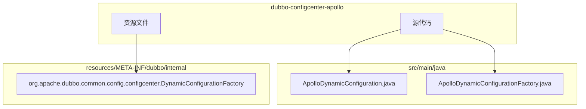
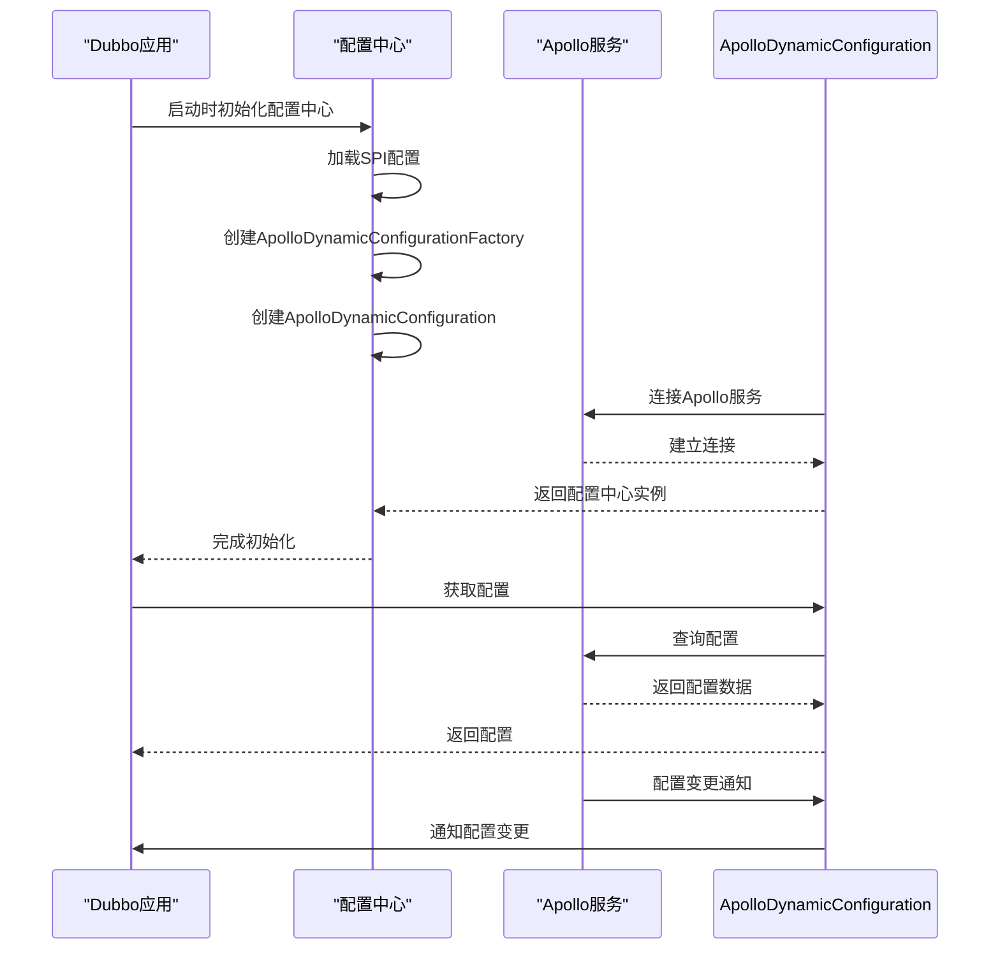
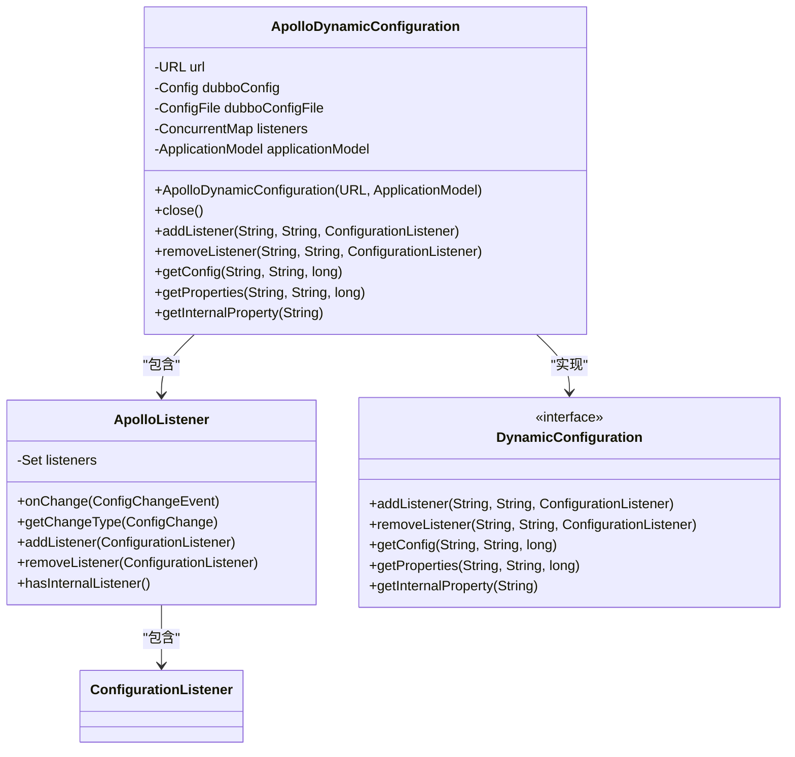
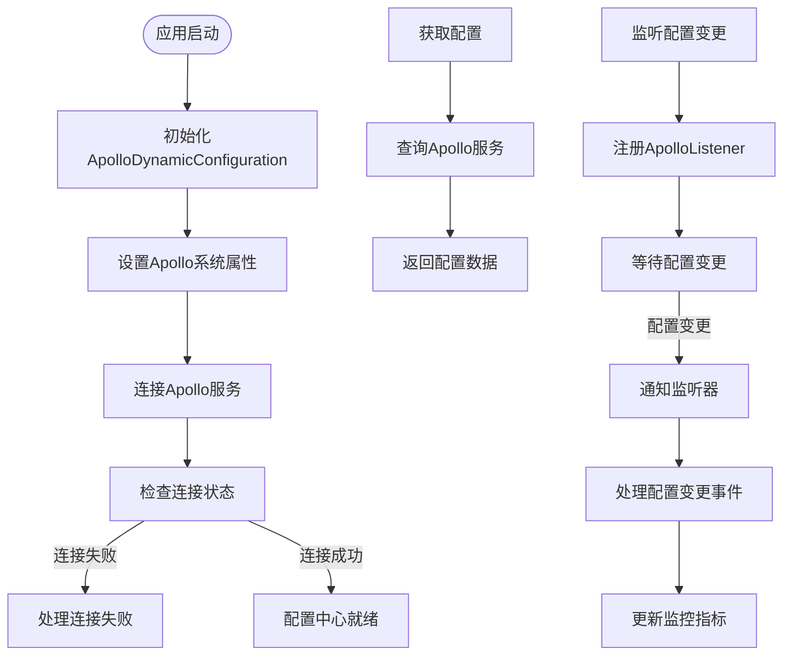
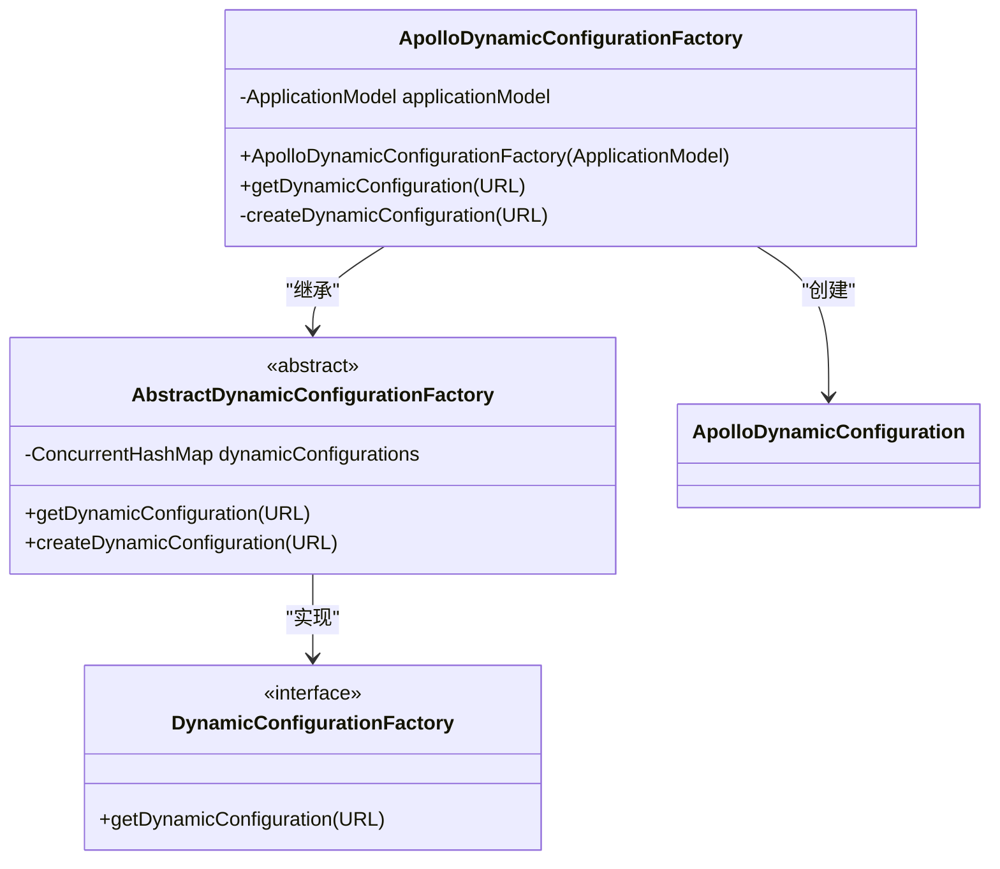
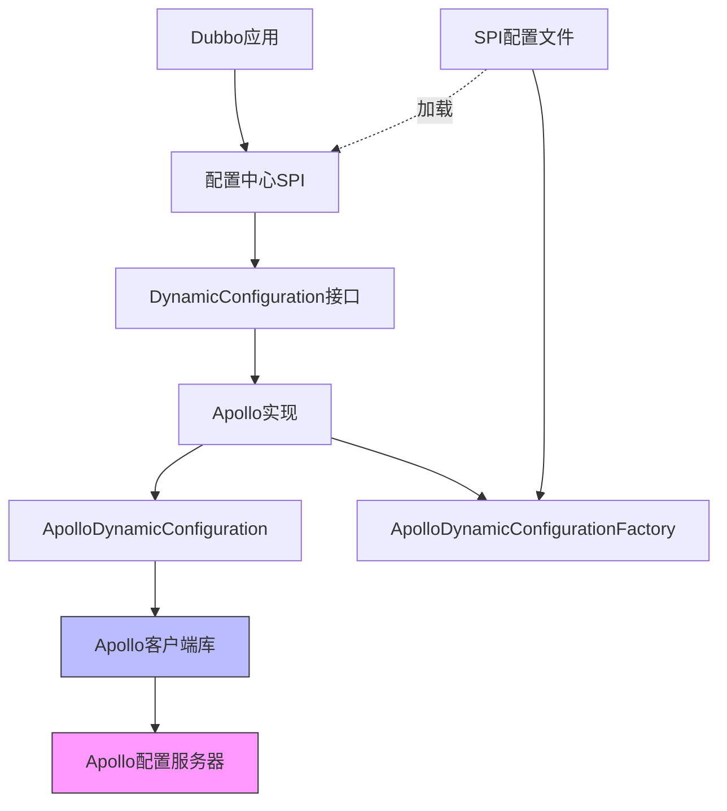

# Apollo配置中心集成

<cite>
**本文档引用的文件**   
- [ApolloDynamicConfiguration.java](file://dubbo-configcenter/dubbo-configcenter-apollo/src/main/java/org/apache/dubbo/configcenter/support/apollo/ApolloDynamicConfiguration.java)
- [ApolloDynamicConfigurationFactory.java](file://dubbo-configcenter/dubbo-configcenter-apollo/src/main/java/org/apache/dubbo/configcenter/support/apollo/ApolloDynamicConfigurationFactory.java)
- [org.apache.dubbo.common.config.configcenter.DynamicConfigurationFactory](file://dubbo-configcenter/dubbo-configcenter-apollo/src/main/resources/META-INF/dubbo/internal/org.apache.dubbo.common.config.configcenter.DynamicConfigurationFactory)
- [DynamicConfiguration.java](file://dubbo-common/src/main/java/org/apache/dubbo/common/config/configcenter/DynamicConfiguration.java)
- [AbstractDynamicConfigurationFactory.java](file://dubbo-common/src/main/java/org/apache/dubbo/common/config/configcenter/AbstractDynamicConfigurationFactory.java)
- [ApolloDynamicConfigurationTest.java](file://dubbo-configcenter/dubbo-configcenter-apollo/src/test/java/org/apache/dubbo/configcenter/support/apollo/ApolloDynamicConfigurationTest.java)
</cite>

## 目录
1. [简介](#简介)
2. [项目结构](#项目结构)
3. [核心组件](#核心组件)
4. [架构概述](#架构概述)
5. [详细组件分析](#详细组件分析)
6. [依赖分析](#依赖分析)
7. [性能考虑](#性能考虑)
8. [故障排除指南](#故障排除指南)
9. [结论](#结论)

## 简介
本文档详细说明了Dubbo框架中Apollo配置中心的集成机制。文档涵盖了ApolloDynamicConfiguration的实现原理，包括与Apollo配置服务的通信方式、配置获取和变更监听机制。同时解释了ApolloDynamicConfigurationFactory如何创建和管理Apollo配置实例，阐述了Apollo的命名空间、集群和环境概念在Dubbo中的映射关系。文档还提供了Apollo配置中心的配置方法和参数说明，包括Meta Server地址、AppId、命名空间等，并展示了在Dubbo应用中集成Apollo配置中心的完整代码示例。

## 项目结构
Apollo配置中心的实现位于dubbo-configcenter模块下的dubbo-configcenter-apollo子模块中。该模块实现了Dubbo配置中心SPI接口，提供了与Apollo配置服务的集成能力。

**Diagram sources**
- [ApolloDynamicConfiguration.java](file://dubbo-configcenter/dubbo-configcenter-apollo/src/main/java/org/apache/dubbo/configcenter/support/apollo/ApolloDynamicConfiguration.java)
- [ApolloDynamicConfigurationFactory.java](file://dubbo-configcenter/dubbo-configcenter-apollo/src/main/java/org/apache/dubbo/configcenter/support/apollo/ApolloDynamicConfigurationFactory.java)
- [org.apache.dubbo.common.config.configcenter.DynamicConfigurationFactory](file://dubbo-configcenter/dubbo-configcenter-apollo/src/main/resources/META-INF/dubbo/internal/org.apache.dubbo.common.config.configcenter.DynamicConfigurationFactory)

**Section sources**
- [ApolloDynamicConfiguration.java](file://dubbo-configcenter/dubbo-configcenter-apollo/src/main/java/org/apache/dubbo/configcenter/support/apollo/ApolloDynamicConfiguration.java)
- [ApolloDynamicConfigurationFactory.java](file://dubbo-configcenter/dubbo-configcenter-apollo/src/main/java/org/apache/dubbo/configcenter/support/apollo/ApolloDynamicConfigurationFactory.java)

## 核心组件
Apollo配置中心集成的核心组件包括ApolloDynamicConfiguration和ApolloDynamicConfigurationFactory两个主要类。ApolloDynamicConfiguration实现了Dubbo的DynamicConfiguration接口，负责与Apollo配置服务的实际通信，包括配置获取、变更监听等功能。ApolloDynamicConfigurationFactory则是工厂类，负责创建和管理ApolloDynamicConfiguration实例。

**Section sources**
- [ApolloDynamicConfiguration.java](file://dubbo-configcenter/dubbo-configcenter-apollo/src/main/java/org/apache/dubbo/configcenter/support/apollo/ApolloDynamicConfiguration.java)
- [ApolloDynamicConfigurationFactory.java](file://dubbo-configcenter/dubbo-configcenter-apollo/src/main/java/org/apache/dubbo/configcenter/support/apollo/ApolloDynamicConfigurationFactory.java)

## 架构概述
Apollo配置中心集成的架构基于Dubbo的可扩展配置中心设计，通过SPI机制实现。当Dubbo应用启动时，会根据配置中心的协议（apollo://）加载相应的工厂类，创建配置中心实例。

**Diagram sources**
- [ApolloDynamicConfiguration.java](file://dubbo-configcenter/dubbo-configcenter-apollo/src/main/java/org/apache/dubbo/configcenter/support/apollo/ApolloDynamicConfiguration.java)
- [ApolloDynamicConfigurationFactory.java](file://dubbo-configcenter/dubbo-configcenter-apollo/src/main/java/org/apache/dubbo/configcenter/support/apollo/ApolloDynamicConfigurationFactory.java)

## 详细组件分析

### ApolloDynamicConfiguration分析
ApolloDynamicConfiguration是Apollo配置中心的核心实现类，实现了DynamicConfiguration接口，负责与Apollo服务的通信和配置管理。

#### 类结构分析

**Diagram sources**
- [ApolloDynamicConfiguration.java](file://dubbo-configcenter/dubbo-configcenter-apollo/src/main/java/org/apache/dubbo/configcenter/support/apollo/ApolloDynamicConfiguration.java)

#### 配置获取与监听机制

**Diagram sources**
- [ApolloDynamicConfiguration.java](file://dubbo-configcenter/dubbo-configcenter-apollo/src/main/java/org/apache/dubbo/configcenter/support/apollo/ApolloDynamicConfiguration.java)

**Section sources**
- [ApolloDynamicConfiguration.java](file://dubbo-configcenter/dubbo-configcenter-apollo/src/main/java/org/apache/dubbo/configcenter/support/apollo/ApolloDynamicConfiguration.java)

### ApolloDynamicConfigurationFactory分析
ApolloDynamicConfigurationFactory是Apollo配置中心的工厂类，负责创建和管理ApolloDynamicConfiguration实例。

#### 工厂模式实现

**Diagram sources**
- [ApolloDynamicConfigurationFactory.java](file://dubbo-configcenter/dubbo-configcenter-apollo/src/main/java/org/apache/dubbo/configcenter/support/apollo/ApolloDynamicConfigurationFactory.java)
- [AbstractDynamicConfigurationFactory.java](file://dubbo-common/src/main/java/org/apache/dubbo/common/config/configcenter/AbstractDynamicConfigurationFactory.java)

**Section sources**
- [ApolloDynamicConfigurationFactory.java](file://dubbo-configcenter/dubbo-configcenter-apollo/src/main/java/org/apache/dubbo/configcenter/support/apollo/ApolloDynamicConfigurationFactory.java)

## 依赖分析
Apollo配置中心集成依赖于Dubbo的核心配置中心接口和Apollo客户端库。通过SPI机制，Dubbo能够动态加载Apollo配置中心实现。

**Diagram sources**
- [ApolloDynamicConfiguration.java](file://dubbo-configcenter/dubbo-configcenter-apollo/src/main/java/org/apache/dubbo/configcenter/support/apollo/ApolloDynamicConfiguration.java)
- [ApolloDynamicConfigurationFactory.java](file://dubbo-configcenter/dubbo-configcenter-apollo/src/main/java/org/apache/dubbo/configcenter/support/apollo/ApolloDynamicConfigurationFactory.java)
- [org.apache.dubbo.common.config.configcenter.DynamicConfigurationFactory](file://dubbo-configcenter/dubbo-configcenter-apollo/src/main/resources/META-INF/dubbo/internal/org.apache.dubbo.common.config.configcenter.DynamicConfigurationFactory)

**Section sources**
- [ApolloDynamicConfiguration.java](file://dubbo-configcenter/dubbo-configcenter-apollo/src/main/java/org/apache/dubbo/configcenter/support/apollo/ApolloDynamicConfiguration.java)
- [ApolloDynamicConfigurationFactory.java](file://dubbo-configcenter/dubbo-configcenter-apollo/src/main/java/org/apache/dubbo/configcenter/support/apollo/ApolloDynamicConfigurationFactory.java)

## 性能考虑
Apollo配置中心集成在设计时考虑了性能优化，包括连接复用、配置缓存和变更监听等机制。通过合理的配置和使用，可以确保配置中心的高效运行。

## 故障排除指南
当Apollo配置中心集成出现问题时，可以通过以下步骤进行排查：

**Section sources**
- [ApolloDynamicConfiguration.java](file://dubbo-configcenter/dubbo-configcenter-apollo/src/main/java/org/apache/dubbo/configcenter/support/apollo/ApolloDynamicConfiguration.java)
- [ApolloDynamicConfigurationTest.java](file://dubbo-configcenter/dubbo-configcenter-apollo/src/test/java/org/apache/dubbo/configcenter/support/apollo/ApolloDynamicConfigurationTest.java)

## 结论
Apollo配置中心集成提供了一种高效、可靠的配置管理方案，通过与Dubbo框架的深度集成，实现了配置的集中管理和动态更新。开发者可以根据实际需求，灵活配置和使用Apollo配置中心，提升应用的可维护性和可扩展性。