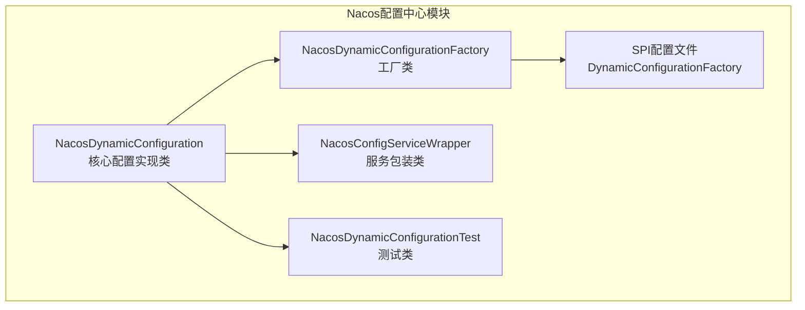
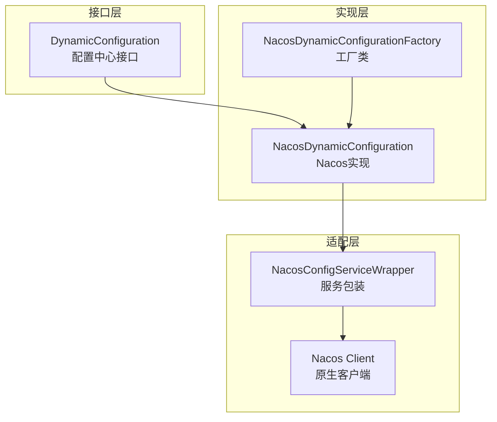
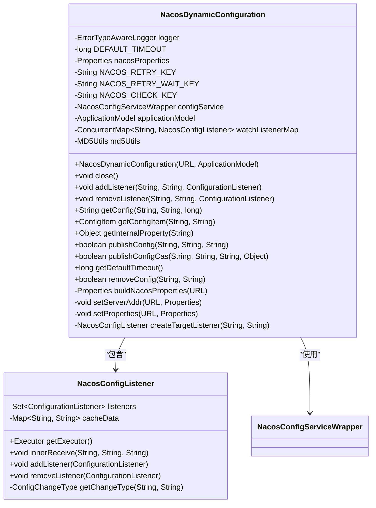
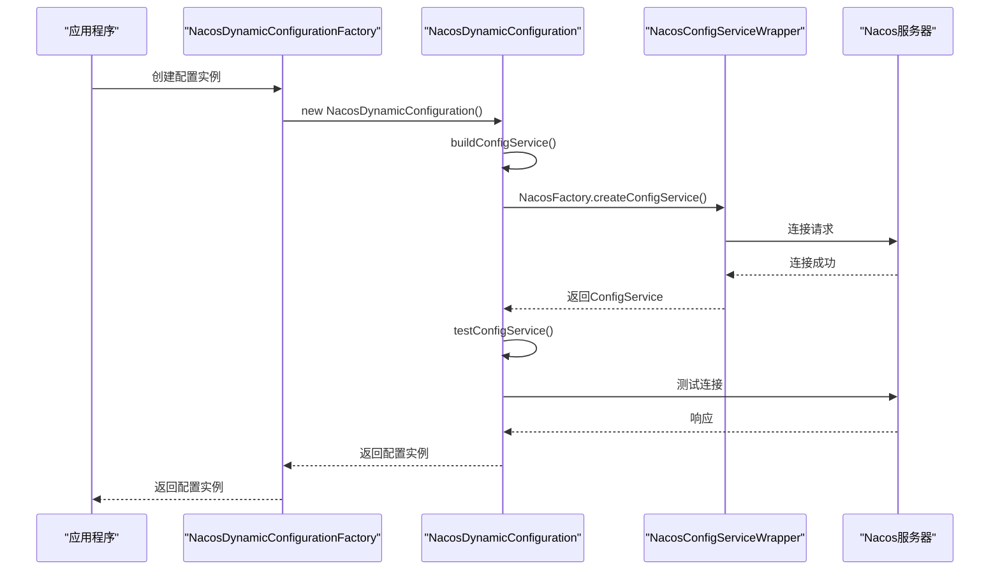
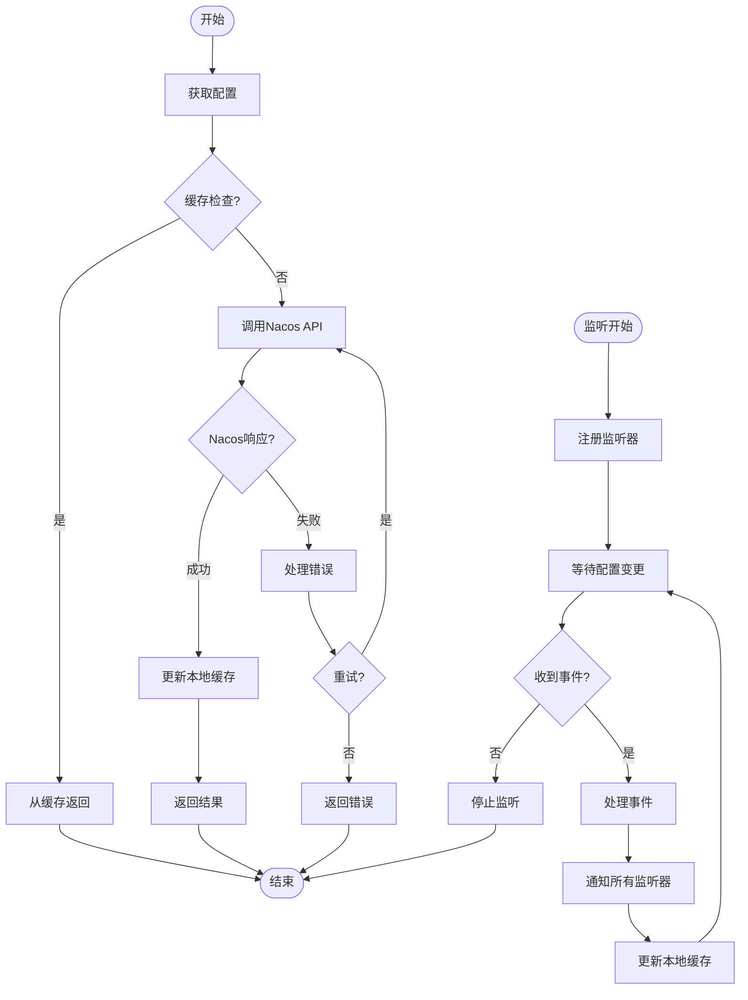
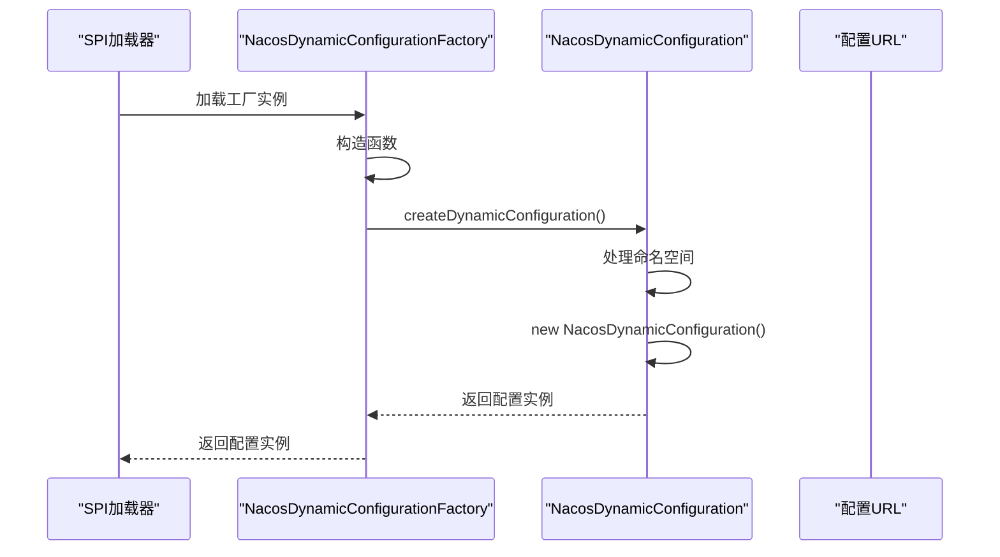
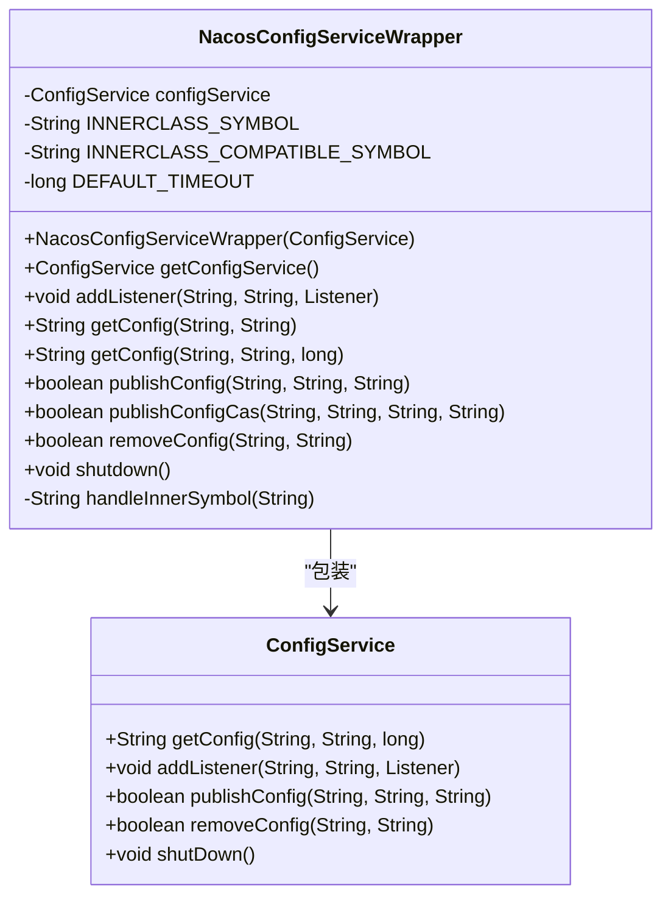
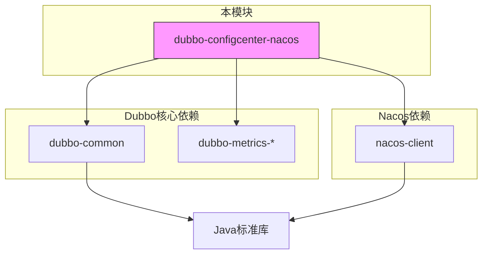

# Nacos配置中心集成

<cite>
**本文档引用的文件**  
- [NacosDynamicConfiguration.java](file://dubbo-configcenter\dubbo-configcenter-nacos\src\main\java\org\apache\dubbo\configcenter\support\nacos\NacosDynamicConfiguration.java)
- [NacosDynamicConfigurationFactory.java](file://dubbo-configcenter\dubbo-configcenter-nacos\src\main\java\org\apache\dubbo\configcenter\support\nacos\NacosDynamicConfigurationFactory.java)
- [NacosConfigServiceWrapper.java](file://dubbo-configcenter\dubbo-configcenter-nacos\src\main\java\org\apache\dubbo\configcenter\support\nacos\NacosConfigServiceWrapper.java)
- [DynamicConfigurationFactory](file://dubbo-configcenter\dubbo-configcenter-nacos\src\main\resources\META-INF\dubbo\internal\org.apache.dubbo.common.config.configcenter.DynamicConfigurationFactory)
- [NacosDynamicConfigurationTest.java](file://dubbo-configcenter\dubbo-configcenter-nacos\src\test\java\org\apache\dubbo\configcenter\support\nacos\NacosDynamicConfigurationTest.java)
- [ConfigCenterConfig.java](file://dubbo-common\src\main\java\org\apache\dubbo\config\ConfigCenterConfig.java)
- [pom.xml](file://dubbo-configcenter\dubbo-configcenter-nacos\pom.xml)
</cite>

## 目录
1. [简介](#简介)
2. [项目结构](#项目结构)
3. [核心组件](#核心组件)
4. [架构概述](#架构概述)
5. [详细组件分析](#详细组件分析)
6. [依赖分析](#依赖分析)
7. [性能考虑](#性能考虑)
8. [故障排除指南](#故障排除指南)
9. [结论](#结论)

## 简介
本文档详细介绍了Dubbo框架中Nacos配置中心的集成机制。文档深入分析了NacosDynamicConfiguration的实现原理，包括与Nacos服务端的连接管理、配置获取和监听功能。同时解释了NacosDynamicConfigurationFactory如何创建和管理Nacos配置实例，阐述了Nacos配置的命名空间、分组和数据ID的映射规则。文档还提供了Nacos配置中心的配置方法和参数说明，以及在Dubbo应用中集成Nacos配置中心的完整代码示例，为不同层次的开发者提供指导。

## 项目结构
Nacos配置中心集成模块位于dubbo-configcenter-nacos目录下，是Dubbo配置中心支持的多种实现之一。该模块提供了Nacos作为配置中心的完整实现，包括连接管理、配置获取、监听等功能。

**图示来源**
- [NacosDynamicConfiguration.java](file://dubbo-configcenter\dubbo-configcenter-nacos\src\main\java\org\apache\dubbo\configcenter\support\nacos\NacosDynamicConfiguration.java)
- [NacosDynamicConfigurationFactory.java](file://dubbo-configcenter\dubbo-configcenter-nacos\src\main\java\org\apache\dubbo\configcenter\support\nacos\NacosDynamicConfigurationFactory.java)
- [NacosConfigServiceWrapper.java](file://dubbo-configcenter\dubbo-configcenter-nacos\src\main\java\org\apache\dubbo\configcenter\support\nacos\NacosConfigServiceWrapper.java)
- [DynamicConfigurationFactory](file://dubbo-configcenter\dubbo-configcenter-nacos\src\main\resources\META-INF\dubbo\internal\org.apache.dubbo.common.config.configcenter.DynamicConfigurationFactory)

**本节来源**
- [NacosDynamicConfiguration.java](file://dubbo-configcenter\dubbo-configcenter-nacos\src\main\java\org\apache\dubbo\configcenter\support\nacos\NacosDynamicConfiguration.java)
- [NacosDynamicConfigurationFactory.java](file://dubbo-configcenter\dubbo-configcenter-nacos\src\main\java\org\apache\dubbo\configcenter\support\nacos\NacosDynamicConfigurationFactory.java)

## 核心组件
Nacos配置中心集成的核心组件包括NacosDynamicConfiguration、NacosDynamicConfigurationFactory和NacosConfigServiceWrapper。NacosDynamicConfiguration实现了DynamicConfiguration接口，提供了与Nacos配置中心交互的所有功能。NacosDynamicConfigurationFactory是工厂类，负责创建NacosDynamicConfiguration实例。NacosConfigServiceWrapper是对Nacos ConfigService的包装，处理了特殊字符的兼容性问题。

**本节来源**
- [NacosDynamicConfiguration.java](file://dubbo-configcenter\dubbo-configcenter-nacos\src\main\java\org\apache\dubbo\configcenter\support\nacos\NacosDynamicConfiguration.java)
- [NacosDynamicConfigurationFactory.java](file://dubbo-configcenter\dubbo-configcenter-nacos\src\main\java\org\apache\dubbo\configcenter\support\nacos\NacosDynamicConfigurationFactory.java)
- [NacosConfigServiceWrapper.java](file://dubbo-configcenter\dubbo-configcenter-nacos\src\main\java\org\apache\dubbo\configcenter\support\nacos\NacosConfigServiceWrapper.java)

## 架构概述
Nacos配置中心集成的架构基于SPI（Service Provider Interface）机制实现，通过工厂模式创建配置实例，使用包装器模式处理Nacos客户端的特殊需求。整个架构分为三层：接口层、实现层和适配层。

**图示来源**
- [NacosDynamicConfiguration.java](file://dubbo-configcenter\dubbo-configcenter-nacos\src\main\java\org\apache\dubbo\configcenter\support\nacos\NacosDynamicConfiguration.java)
- [NacosDynamicConfigurationFactory.java](file://dubbo-configcenter\dubbo-configcenter-nacos\src\main\java\org\apache\dubbo\configcenter\support\nacos\NacosDynamicConfigurationFactory.java)
- [NacosConfigServiceWrapper.java](file://dubbo-configcenter\dubbo-configcenter-nacos\src\main\java\org\apache\dubbo\configcenter\support\nacos\NacosConfigServiceWrapper.java)

## 详细组件分析

### NacosDynamicConfiguration分析
NacosDynamicConfiguration是Nacos配置中心的核心实现类，实现了DynamicConfiguration接口的所有方法。它负责与Nacos服务器建立连接、获取配置、监听配置变更等核心功能。

#### 类结构分析

**图示来源**
- [NacosDynamicConfiguration.java](file://dubbo-configcenter\dubbo-configcenter-nacos\src\main\java\org\apache\dubbo\configcenter\support\nacos\NacosDynamicConfiguration.java)

#### 连接管理流程

**图示来源**
- [NacosDynamicConfiguration.java](file://dubbo-configcenter\dubbo-configcenter-nacos\src\main\java\org\apache\dubbo\configcenter\support\nacos\NacosDynamicConfiguration.java)
- [NacosDynamicConfigurationFactory.java](file://dubbo-configcenter\dubbo-configcenter-nacos\src\main\java\org\apache\dubbo\configcenter\support\nacos\NacosDynamicConfigurationFactory.java)

#### 配置获取与监听流程

**图示来源**
- [NacosDynamicConfiguration.java](file://dubbo-configcenter\dubbo-configcenter-nacos\src\main\java\org\apache\dubbo\configcenter\support\nacos\NacosDynamicConfiguration.java)

**本节来源**
- [NacosDynamicConfiguration.java](file://dubbo-configcenter\dubbo-configcenter-nacos\src\main\java\org\apache\dubbo\configcenter\support\nacos\NacosDynamicConfiguration.java)
- [NacosDynamicConfigurationTest.java](file://dubbo-configcenter\dubbo-configcenter-nacos\src\test\java\org\apache\dubbo\configcenter\support\nacos\NacosDynamicConfigurationTest.java)

### NacosDynamicConfigurationFactory分析
NacosDynamicConfigurationFactory是Nacos配置实例的工厂类，负责创建和管理NacosDynamicConfiguration实例。它通过SPI机制被Dubbo框架调用，确保了配置中心实现的可扩展性。

#### 工厂创建流程

**图示来源**
- [NacosDynamicConfigurationFactory.java](file://dubbo-configcenter\dubbo-configcenter-nacos\src\main\java\org\apache\dubbo\configcenter\support\nacos\NacosDynamicConfigurationFactory.java)

**本节来源**
- [NacosDynamicConfigurationFactory.java](file://dubbo-configcenter\dubbo-configcenter-nacos\src\main\java\org\apache\dubbo\configcenter\support\nacos\NacosDynamicConfigurationFactory.java)
- [DynamicConfigurationFactory](file://dubbo-configcenter\dubbo-configcenter-nacos\src\main\resources\META-INF\dubbo\internal\org.apache.dubbo.common.config.configcenter.DynamicConfigurationFactory)

### NacosConfigServiceWrapper分析
NacosConfigServiceWrapper是对Nacos原生ConfigService的包装类，主要解决了特殊字符兼容性问题，确保了Dubbo与Nacos之间的稳定通信。

#### 包装器功能

**图示来源**
- [NacosConfigServiceWrapper.java](file://dubbo-configcenter\dubbo-configcenter-nacos\src\main\java\org\apache\dubbo\configcenter\support\nacos\NacosConfigServiceWrapper.java)

**本节来源**
- [NacosConfigServiceWrapper.java](file://dubbo-configcenter\dubbo-configcenter-nacos\src\main\java\org\apache\dubbo\configcenter\support\nacos\NacosConfigServiceWrapper.java)

## 依赖分析
Nacos配置中心模块依赖于Dubbo核心模块和Nacos客户端库，通过清晰的依赖关系实现了配置中心功能的解耦和可扩展性。

**图示来源**
- [pom.xml](file://dubbo-configcenter\dubbo-configcenter-nacos\pom.xml)

**本节来源**
- [pom.xml](file://dubbo-configcenter\dubbo-configcenter-nacos\pom.xml)
- [NacosDynamicConfiguration.java](file://dubbo-configcenter\dubbo-configcenter-nacos\src\main\java\org\apache\dubbo\configcenter\support\nacos\NacosDynamicConfiguration.java)

## 性能考虑
Nacos配置中心集成在性能方面进行了多项优化，包括连接重试机制、配置缓存、异步监听等。默认的配置获取超时时间为5000毫秒，连接失败时会进行最多10次重试，每次间隔1000毫秒。这些配置可以通过URL参数进行调整，以适应不同的生产环境需求。

## 故障排除指南
当Nacos配置中心集成出现问题时，可以按照以下步骤进行排查：
1. 检查Nacos服务器地址和端口是否正确
2. 验证Nacos服务器是否正常运行
3. 检查网络连接是否通畅
4. 查看日志中的错误信息，特别是连接失败和配置获取失败的详细信息
5. 确认命名空间和分组配置是否正确

**本节来源**
- [NacosDynamicConfiguration.java](file://dubbo-configcenter\dubbo-configcenter-nacos\src\main\java\org\apache\dubbo\configcenter\support\nacos\NacosDynamicConfiguration.java)
- [NacosDynamicConfigurationTest.java](file://dubbo-configcenter\dubbo-configcenter-nacos\src\test\java\org\apache\dubbo\configcenter\support\nacos\NacosDynamicConfigurationTest.java)

## 结论
Dubbo的Nacos配置中心集成提供了一套完整、稳定、高性能的配置管理解决方案。通过清晰的架构设计和良好的扩展性，使得Dubbo应用能够方便地使用Nacos作为配置中心。开发者可以根据具体需求调整配置参数，优化性能表现。对于初学者，可以通过简单的配置快速集成；对于经验丰富的开发者，则可以深入理解其实现机制，进行高级特性和性能调优。