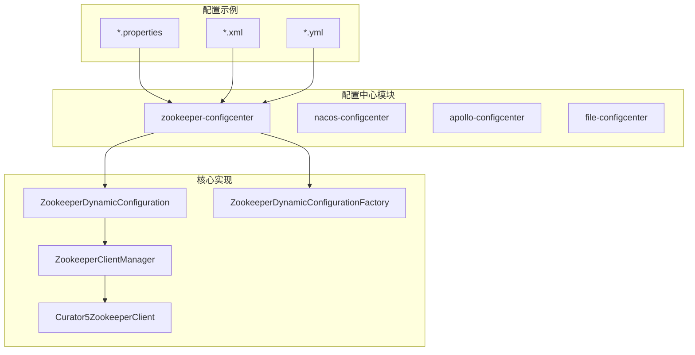
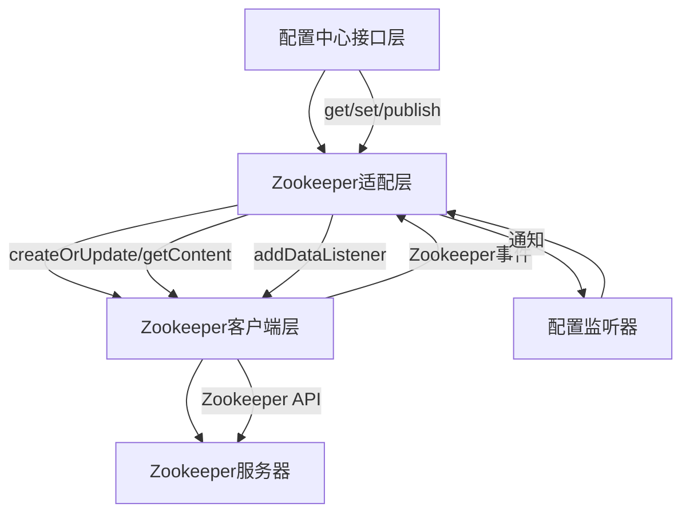
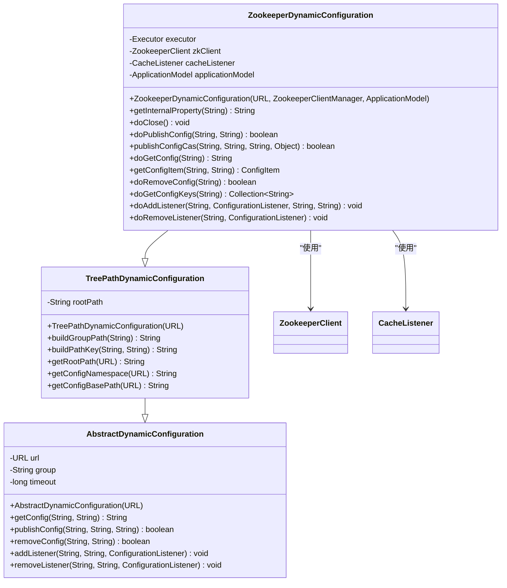
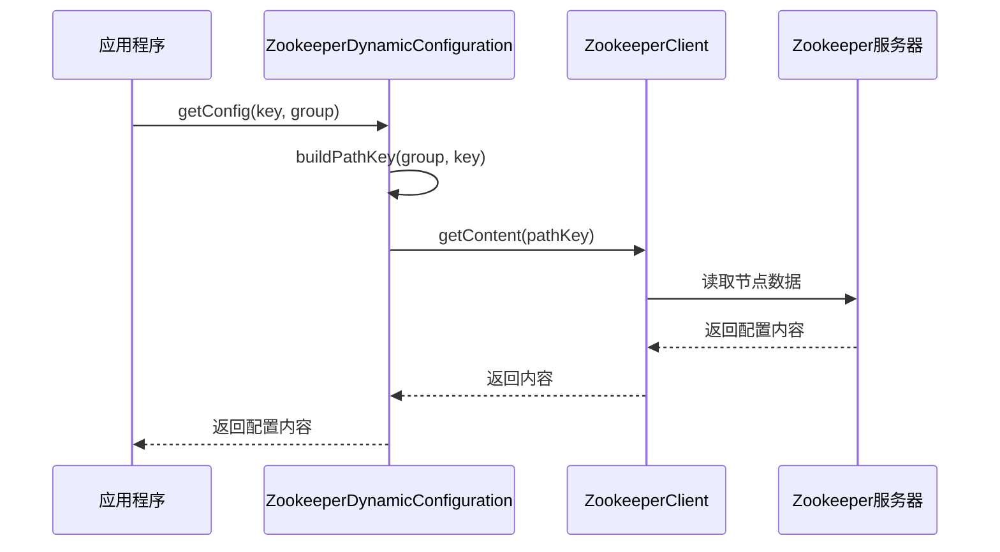
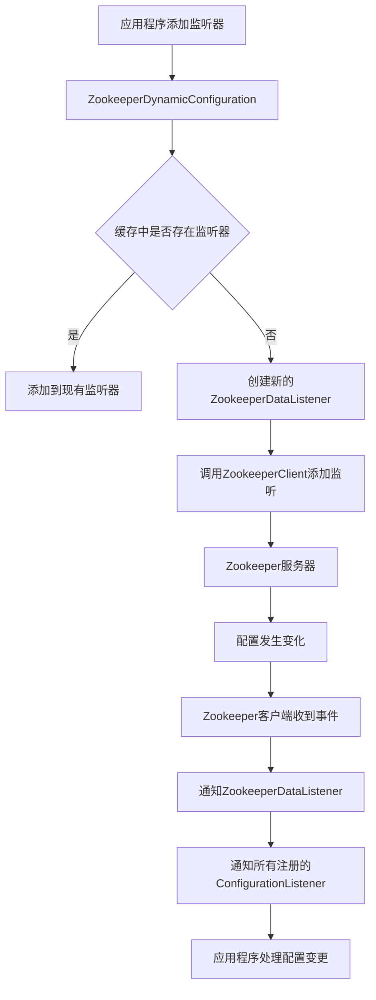
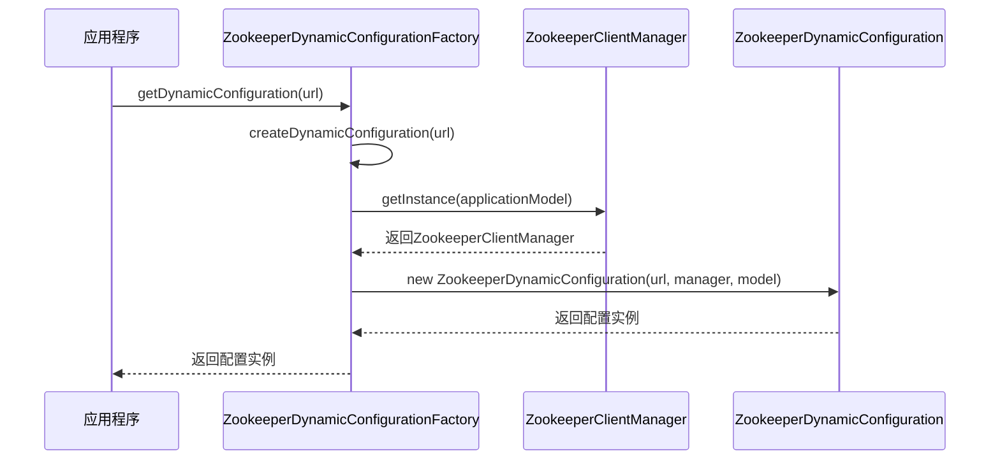
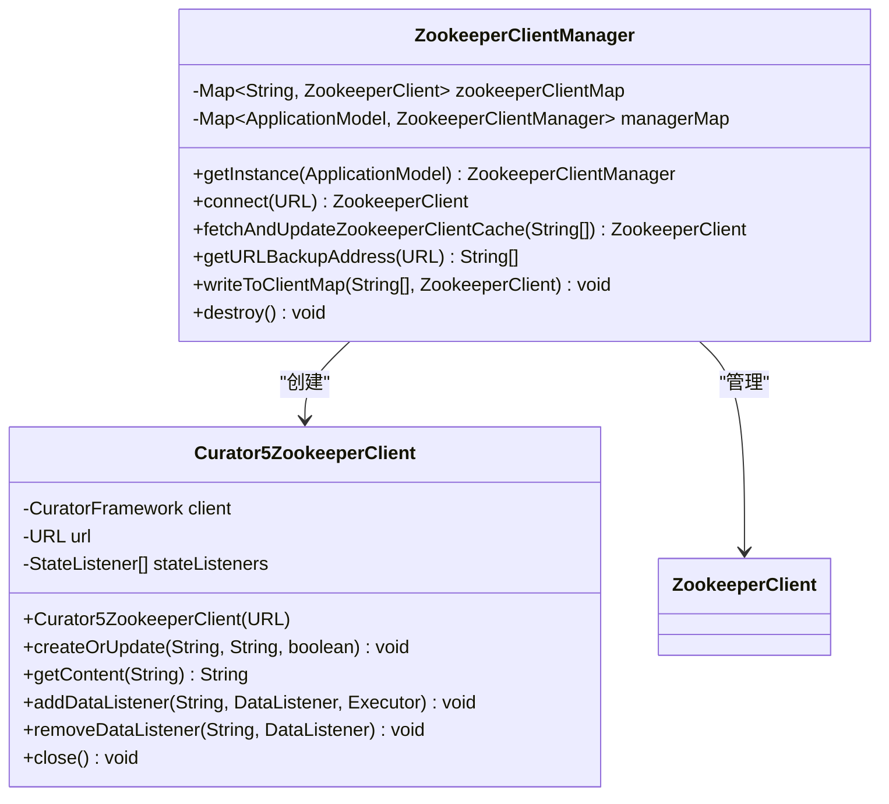
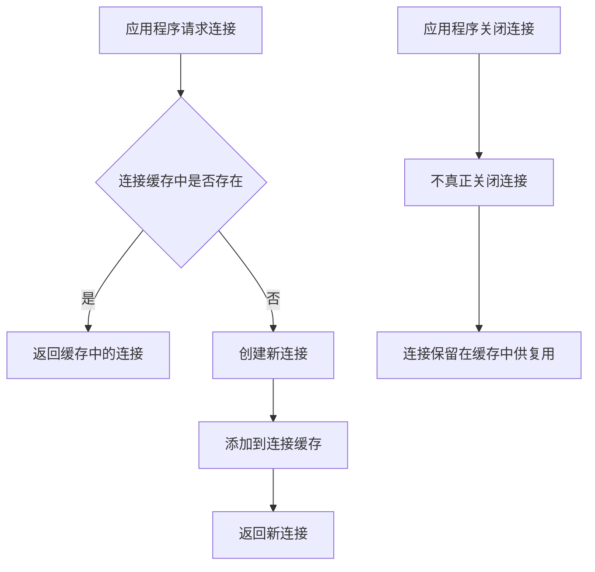
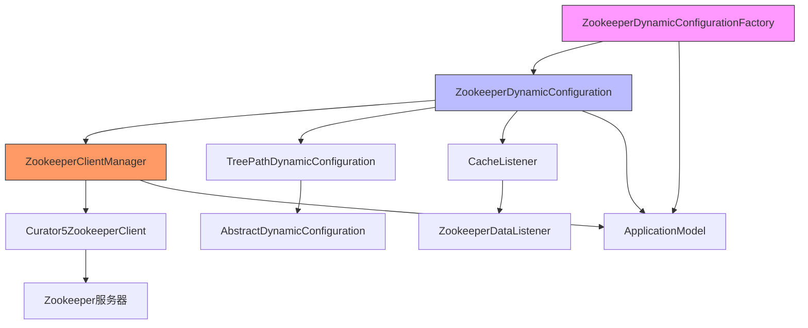

# Zookeeper配置中心集成

<cite>
**本文档引用文件**  
- [ZookeeperDynamicConfiguration.java](file://dubbo-configcenter\dubbo-configcenter-zookeeper\src\main\java\org\apache\dubbo\configcenter\support\zookeeper\ZookeeperDynamicConfiguration.java)
- [ZookeeperDynamicConfigurationFactory.java](file://dubbo-configcenter\dubbo-configcenter-zookeeper\src\main\java\org\apache\dubbo\configcenter\support\zookeeper\ZookeeperDynamicConfigurationFactory.java)
- [TreePathDynamicConfiguration.java](file://dubbo-common\src\main\java\org\apache\dubbo\common\config\configcenter\TreePathDynamicConfiguration.java)
- [ZookeeperClientManager.java](file://dubbo-remoting\dubbo-remoting-zookeeper-curator5\src\main\java\org\apache\dubbo\remoting\zookeeper\curator5\ZookeeperClientManager.java)
- [zookeeper-dubbb-consumer.properties](file://dubbo-config\dubbo-config-spring\src\test\resources\META-INF\service-introspection\zookeeper-dubbb-consumer.properties)
- [zookeeper-dubbo-consumer.xml](file://dubbo-config\dubbo-config-spring\src\test\resources\META-INF\service-introspection\zookeeper-dubbo-consumer.xml)
</cite>

## 目录
1. [简介](#简介)
2. [项目结构](#项目结构)
3. [核心组件](#核心组件)
4. [架构概述](#架构概述)
5. [详细组件分析](#详细组件分析)
6. [依赖分析](#依赖分析)
7. [性能考虑](#性能考虑)
8. [故障排除指南](#故障排除指南)
9. [结论](#结论)

## 简介
本文档详细说明了Dubbo框架中Zookeeper配置中心的集成机制。重点阐述了ZookeeperDynamicConfiguration的实现原理，包括连接管理、节点监听和数据获取等核心功能。文档还解释了Zookeeper的znode结构设计和配置存储路径规则，以及ZookeeperDynamicConfigurationFactory如何创建和管理配置实例。同时提供了在Dubbo应用中集成Zookeeper配置中心的完整配置方法和代码示例，为不同层次的开发者提供实用的指导。

## 项目结构
Dubbo项目中的Zookeeper配置中心实现主要分布在`dubbo-configcenter-zookeeper`模块中，该模块提供了Zookeeper作为配置中心的核心功能。配置中心的实现遵循Dubbo的扩展机制，通过SPI（Service Provider Interface）方式进行集成。

**图表来源**
- [ZookeeperDynamicConfiguration.java](file://dubbo-configcenter\dubbo-configcenter-zookeeper\src\main\java\org\apache\dubbo\configcenter\support\zookeeper\ZookeeperDynamicConfiguration.java)
- [ZookeeperDynamicConfigurationFactory.java](file://dubbo-configcenter\dubbo-configcenter-zookeeper\src\main\java\org\apache\dubbo\configcenter\support\zookeeper\ZookeeperDynamicConfigurationFactory.java)
- [ZookeeperClientManager.java](file://dubbo-remoting\dubbo-remoting-zookeeper-curator5\src\main\java\org\apache\dubbo\remoting\zookeeper\curator5\ZookeeperClientManager.java)

**章节来源**
- [ZookeeperDynamicConfiguration.java](file://dubbo-configcenter\dubbo-configcenter-zookeeper\src\main\java\org\apache\dubbo\configcenter\support\zookeeper\ZookeeperDynamicConfiguration.java)
- [ZookeeperDynamicConfigurationFactory.java](file://dubbo-configcenter\dubbo-configcenter-zookeeper\src\main\java\org\apache\dubbo\configcenter\support\zookeeper\ZookeeperDynamicConfigurationFactory.java)

## 核心组件
Zookeeper配置中心的核心组件包括ZookeeperDynamicConfiguration、ZookeeperDynamicConfigurationFactory和ZookeeperClientManager。ZookeeperDynamicConfiguration是主要的配置管理类，负责与Zookeeper服务器进行交互，实现配置的读取、写入和监听功能。ZookeeperDynamicConfigurationFactory是工厂类，负责创建和管理ZookeeperDynamicConfiguration实例。ZookeeperClientManager则负责Zookeeper客户端的连接管理和生命周期管理。

**章节来源**
- [ZookeeperDynamicConfiguration.java](file://dubbo-configcenter\dubbo-configcenter-zookeeper\src\main\java\org\apache\dubbo\configcenter\support\zookeeper\ZookeeperDynamicConfiguration.java)
- [ZookeeperDynamicConfigurationFactory.java](file://dubbo-configcenter\dubbo-configcenter-zookeeper\src\main\java\org\apache\dubbo\configcenter\support\zookeeper\ZookeeperDynamicConfigurationFactory.java)
- [ZookeeperClientManager.java](file://dubbo-remoting\dubbo-remoting-zookeeper-curator5\src\main\java\org\apache\dubbo\remoting\zookeeper\curator5\ZookeeperClientManager.java)

## 架构概述
Zookeeper配置中心的架构设计遵循分层原则，将连接管理、配置操作和事件监听等功能分离。整体架构分为三层：最上层是配置中心接口层，提供统一的配置操作API；中间层是Zookeeper适配层，负责将通用配置操作转换为Zookeeper特定的操作；最底层是Zookeeper客户端层，负责与Zookeeper服务器建立连接并执行具体操作。

**图表来源**
- [ZookeeperDynamicConfiguration.java](file://dubbo-configcenter\dubbo-configcenter-zookeeper\src\main\java\org\apache\dubbo\configcenter\support\zookeeper\ZookeeperDynamicConfiguration.java)
- [ZookeeperClientManager.java](file://dubbo-remoting\dubbo-remoting-zookeeper-curator5\src\main\java\org\apache\dubbo\remoting\zookeeper\curator5\ZookeeperClientManager.java)

## 详细组件分析

### ZookeeperDynamicConfiguration分析
ZookeeperDynamicConfiguration是Zookeeper配置中心的核心实现类，继承自TreePathDynamicConfiguration，实现了DynamicConfiguration接口。该类负责处理所有与Zookeeper相关的配置操作。

#### 类结构分析

**图表来源**
- [ZookeeperDynamicConfiguration.java](file://dubbo-configcenter\dubbo-configcenter-zookeeper\src\main\java\org\apache\dubbo\configcenter\support\zookeeper\ZookeeperDynamicConfiguration.java)
- [TreePathDynamicConfiguration.java](file://dubbo-common\src\main\java\org\apache\dubbo\common\config\configcenter\TreePathDynamicConfiguration.java)

#### 配置获取流程

**图表来源**
- [ZookeeperDynamicConfiguration.java](file://dubbo-configcenter\dubbo-configcenter-zookeeper\src\main\java\org\apache\dubbo\configcenter\support\zookeeper\ZookeeperDynamicConfiguration.java)
- [ZookeeperClientManager.java](file://dubbo-remoting\dubbo-remoting-zookeeper-curator5\src\main\java\org\apache\dubbo\remoting\zookeeper\curator5\ZookeeperClientManager.java)

#### 配置监听流程

**图表来源**
- [ZookeeperDynamicConfiguration.java](file://dubbo-configcenter\dubbo-configcenter-zookeeper\src\main\java\org\apache\dubbo\configcenter\support\zookeeper\ZookeeperDynamicConfiguration.java)
- [ZookeeperClientManager.java](file://dubbo-remoting\dubbo-remoting-zookeeper-curator5\src\main\java\org\apache\dubbo\remoting\zookeeper\curator5\ZookeeperClientManager.java)

**章节来源**
- [ZookeeperDynamicConfiguration.java](file://dubbo-configcenter\dubbo-configcenter-zookeeper\src\main\java\org\apache\dubbo\configcenter\support\zookeeper\ZookeeperDynamicConfiguration.java)

### ZookeeperDynamicConfigurationFactory分析
ZookeeperDynamicConfigurationFactory是Zookeeper配置实例的工厂类，负责创建和管理ZookeeperDynamicConfiguration实例。

#### 工厂创建流程

**图表来源**
- [ZookeeperDynamicConfigurationFactory.java](file://dubbo-configcenter\dubbo-configcenter-zookeeper\src\main\java\org\apache\dubbo\configcenter\support\zookeeper\ZookeeperDynamicConfigurationFactory.java)
- [ZookeeperClientManager.java](file://dubbo-remoting\dubbo-remoting-zookeeper-curator5\src\main\java\org\apache\dubbo\remoting\zookeeper\curator5\ZookeeperClientManager.java)

**章节来源**
- [ZookeeperDynamicConfigurationFactory.java](file://dubbo-configcenter\dubbo-configcenter-zookeeper\src\main\java\org\apache\dubbo\configcenter\support\zookeeper\ZookeeperDynamicConfigurationFactory.java)

### Zookeeper客户端管理分析
ZookeeperClientManager负责Zookeeper客户端的连接管理和生命周期管理，确保客户端连接的高效复用。

#### 客户端连接管理

**图表来源**
- [ZookeeperClientManager.java](file://dubbo-remoting\dubbo-remoting-zookeeper-curator5\src\main\java\org\apache\dubbo\remoting\zookeeper\curator5\ZookeeperClientManager.java)
- [Curator5ZookeeperClient.java](file://dubbo-remoting\dubbo-remoting-zookeeper-curator5\src\main\java\org\apache\dubbo\remoting\zookeeper\curator5\Curator5ZookeeperClient.java)

#### 连接复用机制

**图表来源**
- [ZookeeperClientManager.java](file://dubbo-remoting\dubbo-remoting-zookeeper-curator5\src\main\java\org\apache\dubbo\remoting\zookeeper\curator5\ZookeeperClientManager.java)

**章节来源**
- [ZookeeperClientManager.java](file://dubbo-remoting\dubbo-remoting-zookeeper-curator5\src\main\java\org\apache\dubbo\remoting\zookeeper\curator5\ZookeeperClientManager.java)

## 依赖分析
Zookeeper配置中心的实现依赖于多个核心组件，这些组件之间形成了清晰的依赖关系。

**图表来源**
- [ZookeeperDynamicConfigurationFactory.java](file://dubbo-configcenter\dubbo-configcenter-zookeeper\src\main\java\org\apache\dubbo\configcenter\support\zookeeper\ZookeeperDynamicConfigurationFactory.java)
- [ZookeeperDynamicConfiguration.java](file://dubbo-configcenter\dubbo-configcenter-zookeeper\src\main\java\org\apache\dubbo\configcenter\support\zookeeper\ZookeeperDynamicConfiguration.java)
- [ZookeeperClientManager.java](file://dubbo-remoting\dubbo-remoting-zookeeper-curator5\src\main\java\org\apache\dubbo\remoting\zookeeper\curator5\ZookeeperClientManager.java)

**章节来源**
- [ZookeeperDynamicConfigurationFactory.java](file://dubbo-configcenter\dubbo-configcenter-zookeeper\src\main\java\org\apache\dubbo\configcenter\support\zookeeper\ZookeeperDynamicConfigurationFactory.java)
- [ZookeeperDynamicConfiguration.java](file://dubbo-configcenter\dubbo-configcenter-zookeeper\src\main\java\org\apache\dubbo\configcenter\support\zookeeper\ZookeeperDynamicConfiguration.java)
- [ZookeeperClientManager.java](file://dubbo-remoting\dubbo-remoting-zookeeper-curator5\src\main\java\org\apache\dubbo\remoting\zookeeper\curator5\ZookeeperClientManager.java)

## 性能考虑
Zookeeper配置中心在设计时考虑了多个性能优化点：

1. **连接复用**：通过ZookeeperClientManager实现客户端连接的全局复用，避免频繁创建和销毁连接。
2. **线程池管理**：ZookeeperDynamicConfiguration内部使用独立的线程池处理异步事件，避免阻塞主线程。
3. **缓存机制**：对配置监听器进行缓存管理，减少重复注册和注销的开销。
4. **批量操作**：支持批量获取配置项，减少网络往返次数。

## 故障排除指南
在使用Zookeeper配置中心时可能遇到以下常见问题：

1. **连接失败**：检查Zookeeper服务器地址和端口是否正确，确保网络可达。
2. **配置未更新**：确认监听器已正确注册，检查Zookeeper节点路径是否正确。
3. **性能问题**：监控Zookeeper服务器负载，考虑增加连接超时时间和会话超时时间。
4. **权限问题**：如果使用了Zookeeper的ACL功能，确保客户端有足够的权限访问相关节点。

**章节来源**
- [ZookeeperDynamicConfiguration.java](file://dubbo-configcenter\dubbo-configcenter-zookeeper\src\main\java\org\apache\dubbo\configcenter\support\zookeeper\ZookeeperDynamicConfiguration.java)
- [ZookeeperClientManager.java](file://dubbo-remoting\dubbo-remoting-zookeeper-curator5\src\main\java\org\apache\dubbo\remoting\zookeeper\curator5\ZookeeperClientManager.java)

## 结论
本文档详细介绍了Dubbo框架中Zookeeper配置中心的集成机制。通过分析ZookeeperDynamicConfiguration、ZookeeperDynamicConfigurationFactory和ZookeeperClientManager等核心组件，展示了Zookeeper作为配置中心的完整实现。文档还提供了配置存储路径规则、连接管理机制和事件监听流程的详细说明，为开发者提供了全面的参考。Zookeeper配置中心的设计充分考虑了性能和可靠性，通过连接复用、线程池管理和缓存机制等优化手段，确保了配置管理的高效性和稳定性。