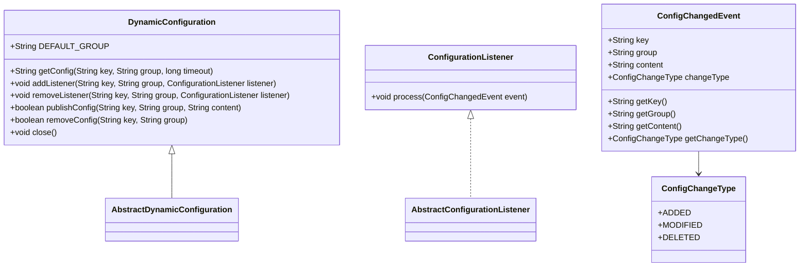
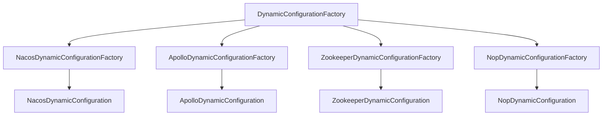
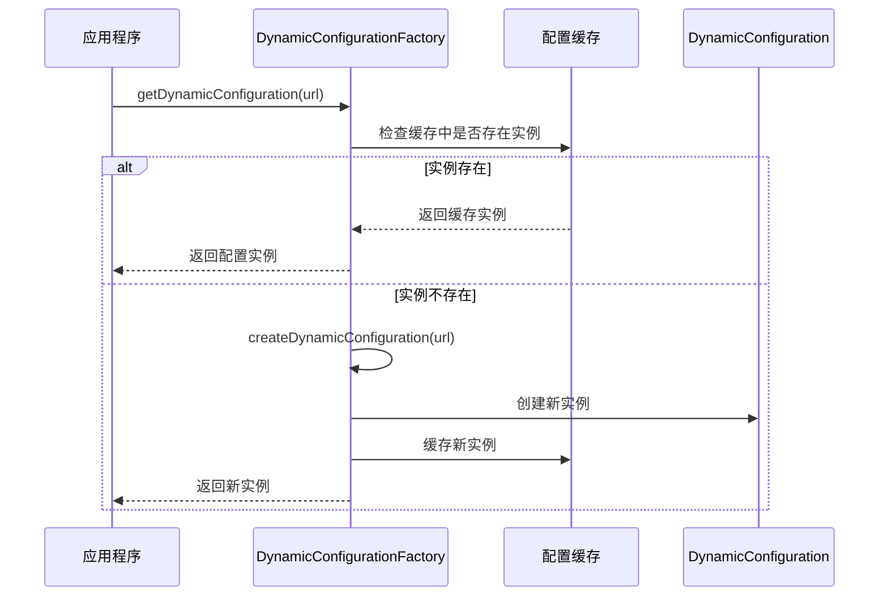
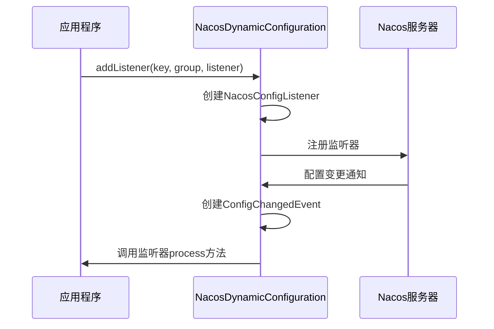
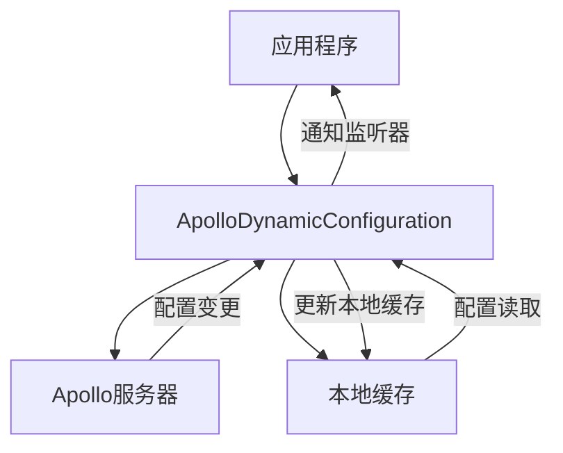
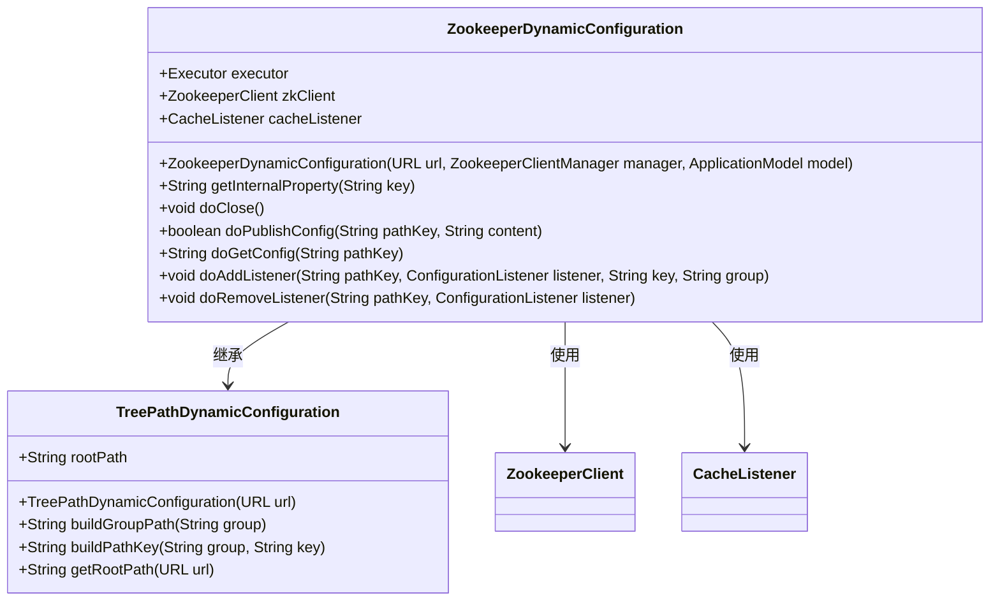
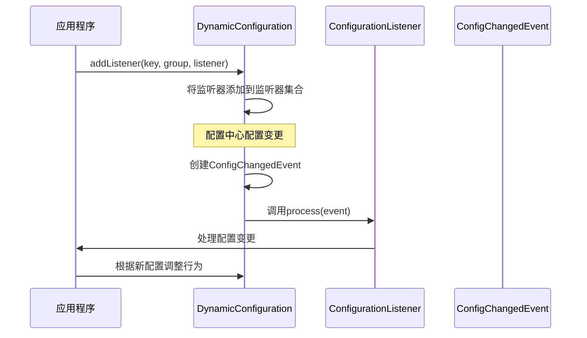
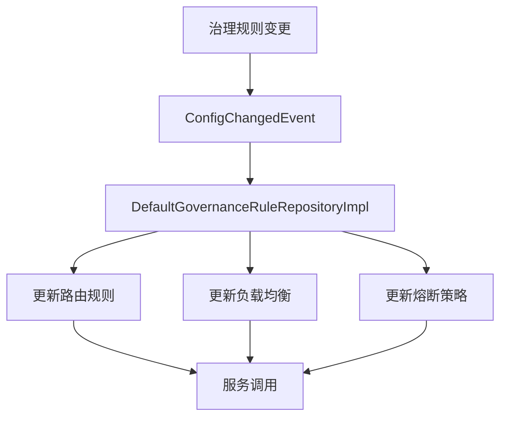
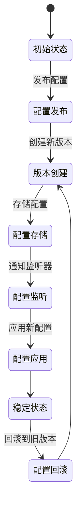
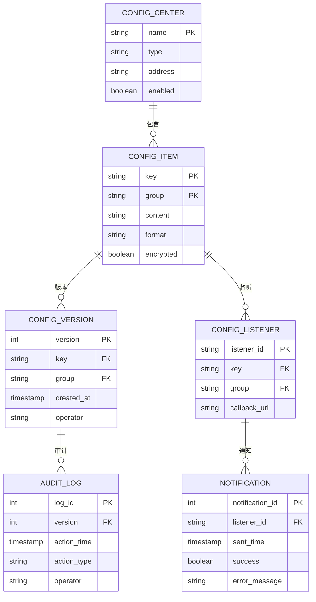

# 动态配置

<cite>
**本文档引用的文件**   
- [NacosDynamicConfiguration.java](file://dubbo-configcenter\dubbo-configcenter-nacos\src\main\java\org\apache\dubbo\configcenter\support\nacos\NacosDynamicConfiguration.java)
- [ApolloDynamicConfiguration.java](file://dubbo-configcenter\dubbo-configcenter-apollo\src\main\java\org\apache\dubbo\configcenter\support\apollo\ApolloDynamicConfiguration.java)
- [ZookeeperDynamicConfiguration.java](file://dubbo-configcenter\dubbo-configcenter-zookeeper\src\main\java\org\apache\dubbo\configcenter\support\zookeeper\ZookeeperDynamicConfiguration.java)
- [DynamicConfiguration.java](file://dubbo-common\src\main\java\org\apache\dubbo\common\config\configcenter\DynamicConfiguration.java)
- [ConfigurationListener.java](file://dubbo-common\src\main\java\org\apache\dubbo\common\config\configcenter\ConfigurationListener.java)
- [ConfigChangedEvent.java](file://dubbo-common\src\main\java\org\apache\dubbo\common\config\configcenter\ConfigChangedEvent.java)
- [AbstractDynamicConfigurationFactory.java](file://dubbo-common\src\main\java\org\apache\dubbo\common\config\configcenter\AbstractDynamicConfigurationFactory.java)
- [TreePathDynamicConfiguration.java](file://dubbo-common\src\main\java\org\apache\dubbo\common\config\configcenter\TreePathDynamicConfiguration.java)
- [DefaultGovernanceRuleRepositoryImpl.java](file://dubbo-cluster\src\main\java\org\apache\dubbo\rpc\cluster\governance\DefaultGovernanceRuleRepositoryImpl.java)
- [ServiceDiscoveryRegistryDirectory.java](file://dubbo-registry\dubbo-registry-api\src\main\java\org\apache\dubbo\registry\client\ServiceDiscoveryRegistryDirectory.java)
</cite>

## 目录
1. [引言](#引言)
2. [动态配置核心概念](#动态配置核心概念)
3. [动态配置工作原理](#动态配置工作原理)
4. [配置中心集成](#配置中心集成)
5. [配置监听器机制](#配置监听器机制)
6. [高级特性](#高级特性)
7. [最佳实践](#最佳实践)

## 引言

Dubbo的动态配置机制是其服务治理能力的核心组成部分，它允许在运行时动态调整服务配置，实现配置的热更新和实时响应。该机制通过统一的接口抽象，支持多种配置中心的集成，为微服务架构提供了灵活、可靠的配置管理解决方案。本文档将深入探讨Dubbo动态配置的实现机制，涵盖基本概念、工作原理、配置中心集成方式、监听器使用方法以及高级特性。

## 动态配置核心概念

Dubbo的动态配置系统围绕几个核心概念构建，这些概念共同构成了其灵活的配置管理能力。

### DynamicConfiguration 接口

`DynamicConfiguration` 是Dubbo动态配置的核心接口，定义了配置管理的基本操作。该接口继承自 `Configuration` 和 `AutoCloseable`，提供了配置的获取、发布、监听和关闭功能。主要方法包括：

- `getConfig(String key, String group, long timeout)`：根据键、组和超时时间获取配置内容
- `addListener(String key, String group, ConfigurationListener listener)`：注册配置监听器
- `removeListener(String key, String group, ConfigurationListener listener)`：移除配置监听器
- `publishConfig(String key, String group, String content)`：发布配置内容
- `removeConfig(String key, String group)`：移除配置

### ConfigurationListener 接口

`ConfigurationListener` 是配置变更的监听器接口，当配置发生变化时，监听器会收到通知。该接口继承自 `EventListener`，定义了 `process(ConfigChangedEvent event)` 方法，用于处理配置变更事件。



**图源**
- [DynamicConfiguration.java](file://dubbo-common\src\main\java\org\apache\dubbo\common\config\configcenter\DynamicConfiguration.java#L36-L226)
- [ConfigurationListener.java](file://dubbo-common\src\main\java\org\apache\dubbo\common\config\configcenter\ConfigurationListener.java#L1-L33)
- [ConfigChangedEvent.java](file://dubbo-common\src\main\java\org\apache\dubbo\common\config\configcenter\ConfigChangedEvent.java#L1-L95)

## 动态配置工作原理

Dubbo的动态配置机制通过工厂模式和SPI机制实现，确保了配置管理的灵活性和可扩展性。

### DynamicConfigurationFactory 工厂模式

`DynamicConfigurationFactory` 是创建 `DynamicConfiguration` 实例的工厂接口，采用SPI（Service Provider Interface）机制实现。Dubbo通过在 `META-INF/dubbo/internal/org.apache.dubbo.common.config.configcenter.DynamicConfigurationFactory` 文件中定义不同的实现，支持多种配置中心。



**图源**
- [NacosDynamicConfigurationFactory.java](file://dubbo-configcenter\dubbo-configcenter-nacos\src\main\java\org\apache\dubbo\configcenter\support\nacos\NacosDynamicConfigurationFactory.java#L1-L32)
- [ApolloDynamicConfigurationFactory.java](file://dubbo-configcenter\dubbo-configcenter-apollo\src\main\java\org\apache\dubbo\configcenter\support\apollo\ApolloDynamicConfigurationFactory.java#L1-L36)
- [DynamicConfigurationFactory.java](file://dubbo-common\src\main\java\org\apache\dubbo\common\config\configcenter\DynamicConfigurationFactory.java#L1-L30)

### 抽象工厂实现

`AbstractDynamicConfigurationFactory` 是抽象工厂实现，提供了缓存能力，避免重复创建 `DynamicConfiguration` 实例。该类使用 `ConcurrentHashMap` 缓存已创建的配置实例，确保线程安全。



**图源**
- [AbstractDynamicConfigurationFactory.java](file://dubbo-common\src\main\java\org\apache\dubbo\common\config\configcenter\AbstractDynamicConfigurationFactory.java#L1-L44)

## 配置中心集成

Dubbo支持多种配置中心的集成，每种配置中心都有其特定的实现方式和特性。

### Nacos 配置中心

Nacos是Dubbo推荐的配置中心之一，提供了强大的配置管理能力。`NacosDynamicConfiguration` 实现了与Nacos的集成，通过Nacos的Java SDK与配置中心进行通信。

**核心特性：**
- 支持配置的发布、获取和监听
- 提供配置的版本管理和灰度发布
- 支持配置的加密存储
- 提供配置的健康检查和自动重连



**代码路径**
- [NacosDynamicConfiguration.java](file://dubbo-configcenter\dubbo-configcenter-nacos\src\main\java\org\apache\dubbo\configcenter\support\nacos\NacosDynamicConfiguration.java#L1-L398)

### Apollo 配置中心

Apollo是携程开源的分布式配置中心，`ApolloDynamicConfiguration` 实现了与Apollo的集成。Apollo提供了完善的配置管理界面和丰富的配置管理功能。

**核心特性：**
- 支持多环境、多集群的配置管理
- 提供配置的灰度发布和权限控制
- 支持配置的版本回滚
- 提供配置的审计功能



**代码路径**
- [ApolloDynamicConfiguration.java](file://dubbo-configcenter\dubbo-configcenter-apollo\src\main\java\org\apache\dubbo\configcenter\support\apollo\ApolloDynamicConfiguration.java#L1-L304)

### Zookeeper 配置中心

Zookeeper是Dubbo传统的配置中心，`ZookeeperDynamicConfiguration` 实现了与Zookeeper的集成。Zookeeper提供了高可用的分布式协调服务。

**核心特性：**
- 基于Zookeeper的ZNode实现配置存储
- 利用Zookeeper的Watcher机制实现配置监听
- 提供高可用的配置管理
- 支持配置的持久化和临时节点



**图源**
- [ZookeeperDynamicConfiguration.java](file://dubbo-configcenter\dubbo-configcenter-zookeeper\src\main\java\org\apache\dubbo\configcenter\support\zookeeper\ZookeeperDynamicConfiguration.java#L1-L178)
- [TreePathDynamicConfiguration.java](file://dubbo-common\src\main\java\org\apache\dubbo\common\config\configcenter\TreePathDynamicConfiguration.java#L1-L174)

## 配置监听器机制

配置监听器是实现配置热更新的关键组件，通过监听器机制，应用程序可以实时响应配置变更。

### 监听器注册与通知

配置监听器的注册和通知流程如下：

1. 应用程序调用 `addListener` 方法注册监听器
2. `DynamicConfiguration` 实现类将监听器与特定的配置键和组关联
3. 当配置中心的配置发生变化时，配置中心会通知 `DynamicConfiguration`
4. `DynamicConfiguration` 创建 `ConfigChangedEvent` 事件
5. `DynamicConfiguration` 遍历所有监听器并调用其 `process` 方法



**代码路径**
- [NacosDynamicConfiguration.java](file://dubbo-configcenter\dubbo-configcenter-nacos\src\main\java\org\apache\dubbo\configcenter\support\nacos\NacosDynamicConfiguration.java#L232-L242)
- [ApolloDynamicConfiguration.java](file://dubbo-configcenter\dubbo-configcenter-apollo\src\main\java\org\apache\dubbo\configcenter\support\apollo\ApolloDynamicConfiguration.java#L170-L186)

### 服务治理规则监听

在服务治理场景中，`DefaultGovernanceRuleRepositoryImpl` 类使用配置监听器来监听治理规则的变更。当治理规则发生变化时，系统会自动更新路由规则、负载均衡策略等。



**代码路径**
- [DefaultGovernanceRuleRepositoryImpl.java](file://dubbo-cluster\src\main\java\org\apache\dubbo\rpc\cluster\governance\DefaultGovernanceRuleRepositoryImpl.java#L31-L59)

## 高级特性

Dubbo的动态配置系统提供了多种高级特性，满足复杂场景下的配置管理需求。

### 配置热更新

配置热更新是动态配置的核心功能，通过监听器机制实现。当配置发生变化时，应用程序可以立即感知并应用新配置，无需重启服务。

**实现要点：**
- 使用线程池异步处理配置变更事件
- 提供配置变更的原子性保证
- 支持配置变更的批量处理

### 配置加密

Dubbo支持配置的加密存储，敏感配置（如数据库密码）可以加密后存储在配置中心。应用程序在获取配置时自动解密。

**实现方式：**
- 在配置发布时进行加密
- 在配置获取时进行解密
- 支持多种加密算法

### 配置版本管理

配置版本管理允许追踪配置的历史变更，支持配置的版本回滚和审计。

**功能特点：**
- 记录每次配置变更的版本号
- 支持按版本号查询历史配置
- 提供配置变更的审计日志



## 最佳实践

### 初学者示例

对于初学者，可以从简单的配置监听开始：

```java
// 创建配置中心URL
URL configCenterUrl = URL.valueOf("nacos://127.0.0.1:8848");

// 获取动态配置实例
DynamicConfiguration dynamicConfiguration = 
    DynamicConfigurationFactory.getDynamicConfiguration(configCenterUrl);

// 注册配置监听器
dynamicConfiguration.addListener("my.config.key", "my.group", new ConfigurationListener() {
    @Override
    public void process(ConfigChangedEvent event) {
        System.out.println("配置变更: " + event.getContent());
        // 在这里处理配置变更
    }
});

// 获取配置
String config = dynamicConfiguration.getConfig("my.config.key", "my.group", 5000);
```

### 高级技巧

对于经验丰富的开发者，可以使用以下高级技巧：

1. **复合配置管理**：使用 `CompositeDynamicConfiguration` 管理多个配置中心
2. **配置缓存优化**：合理设置本地缓存策略，减少对配置中心的请求
3. **错误处理**：实现健壮的错误处理机制，处理配置中心不可用的情况
4. **性能监控**：集成监控系统，跟踪配置获取和监听的性能



**图源**
- [CompositeDynamicConfiguration.java](file://dubbo-common\src\main\java\org\apache\dubbo\common\config\configcenter\wrapper\CompositeDynamicConfiguration.java#L73-L123)