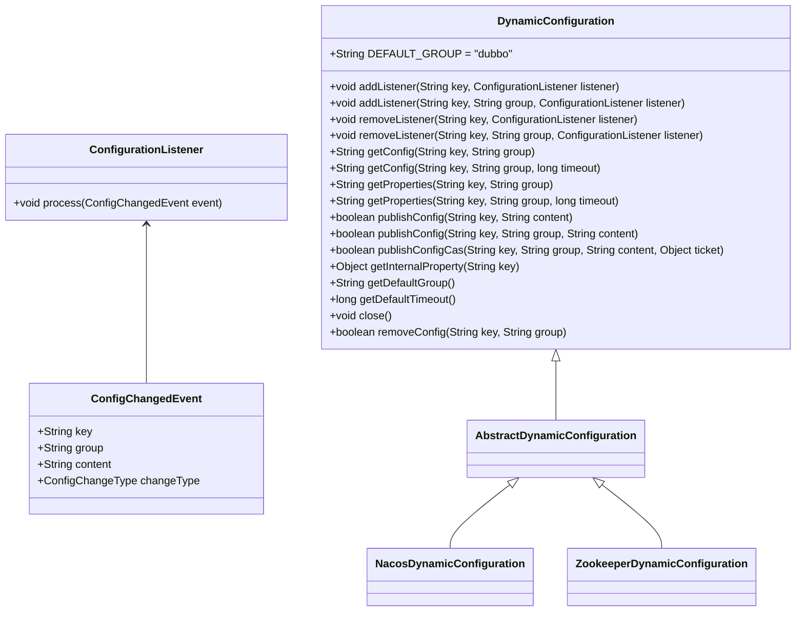
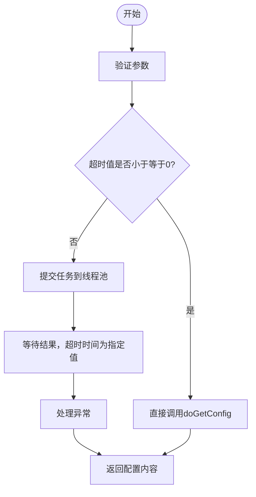
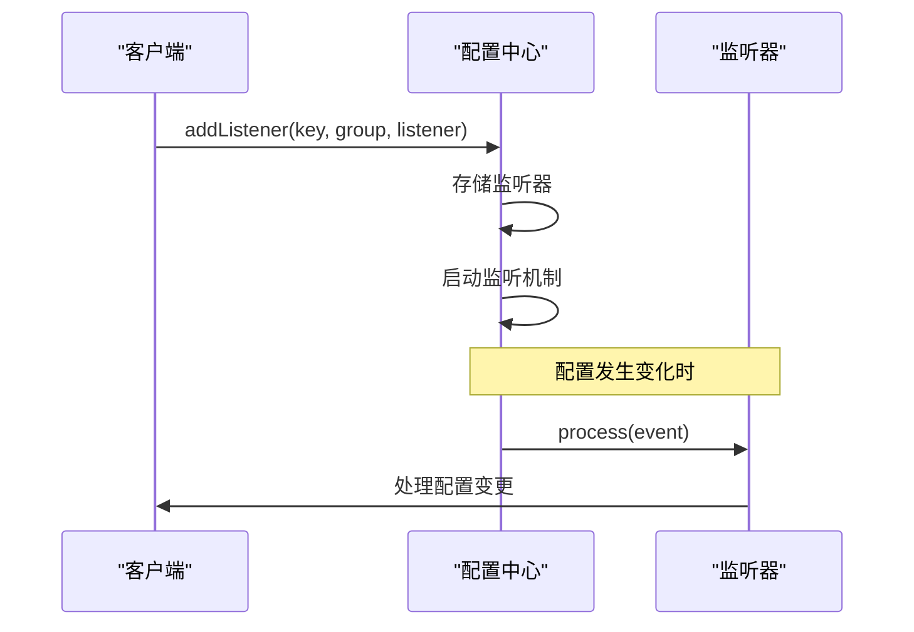
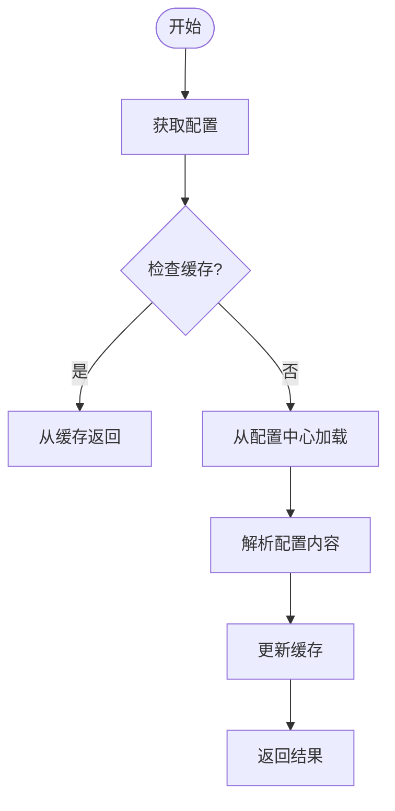
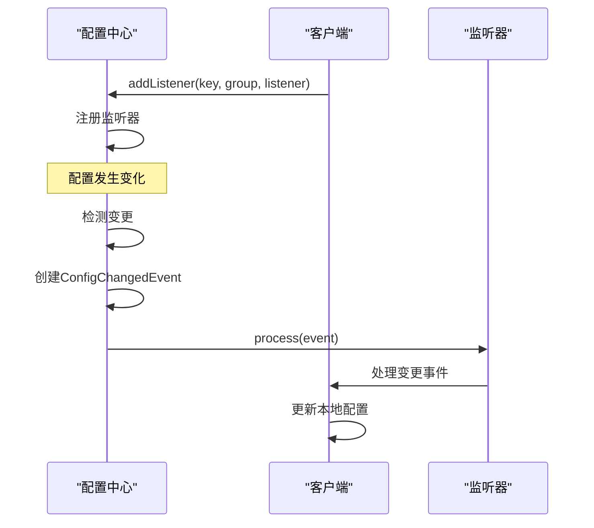
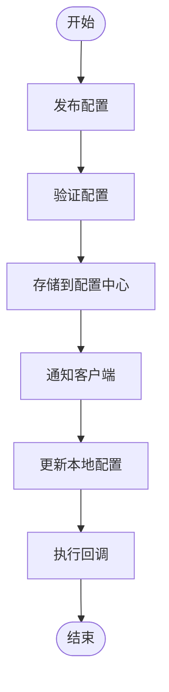
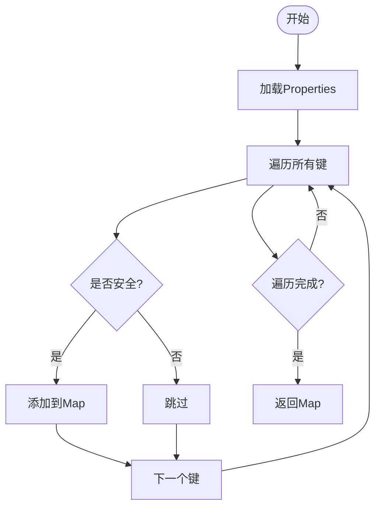
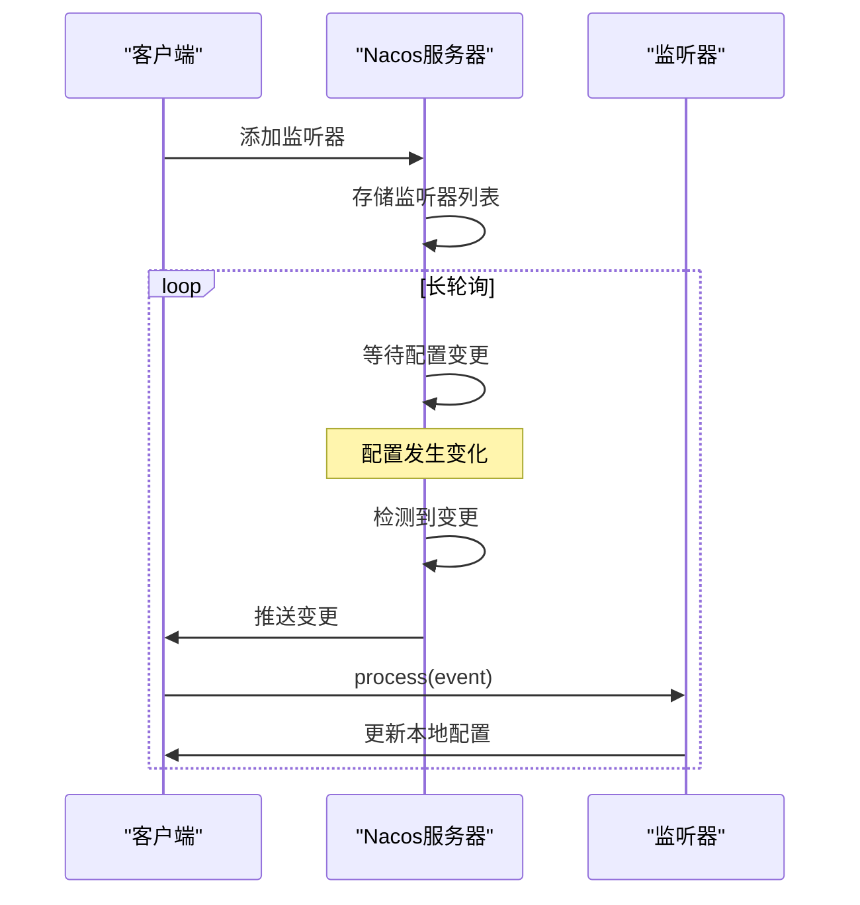
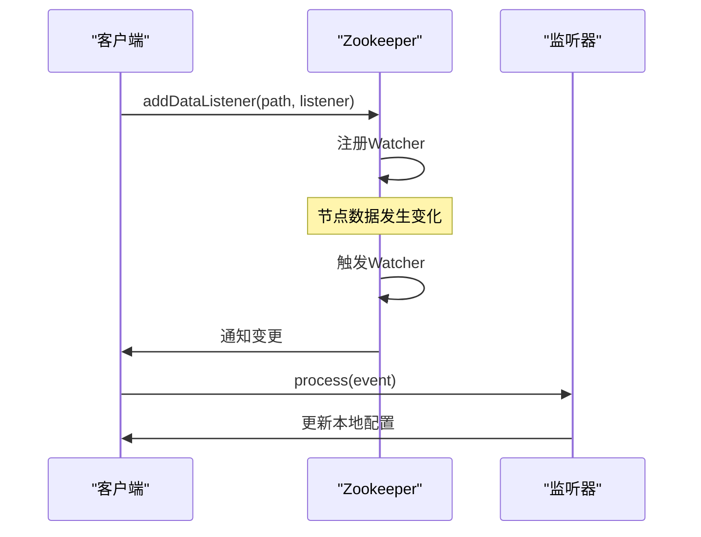
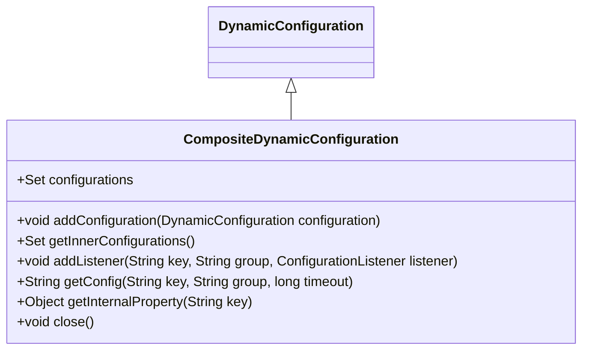

# 动态配置概念

<cite>
**本文档中引用的文件**  
- [DynamicConfiguration.java](file://dubbo-common\src\main\java\org\apache\dubbo\common\config\configcenter\DynamicConfiguration.java)
- [AbstractDynamicConfiguration.java](file://dubbo-common\src\main\java\org\apache\dubbo\common\config\configcenter\AbstractDynamicConfiguration.java)
- [ConfigurationListener.java](file://dubbo-common\src\main\java\org\apache\dubbo\common\config\configcenter\ConfigurationListener.java)
- [ConfigChangedEvent.java](file://dubbo-common\src\main\java\org\apache\dubbo\common\config\configcenter\ConfigChangedEvent.java)
- [NacosDynamicConfiguration.java](file://dubbo-configcenter\dubbo-configcenter-nacos\src\main\java\org\apache\dubbo\configcenter\support\nacos\NacosDynamicConfiguration.java)
- [ZookeeperDynamicConfiguration.java](file://dubbo-configcenter\dubbo-configcenter-zookeeper\src\main\java\org\apache\dubbo\configcenter\support\zookeeper\ZookeeperDynamicConfiguration.java)
- [TreePathDynamicConfiguration.java](file://dubbo-common\src\main\java\org\apache\dubbo\common\config\configcenter\TreePathDynamicConfiguration.java)
- [DynamicConfigurationFactory.java](file://dubbo-common\src\main\java\org\apache\dubbo\common\config\configcenter\DynamicConfigurationFactory.java)
- [ConfigurationUtils.java](file://dubbo-common\src\main\java\org\apache\dubbo\common\config\ConfigurationUtils.java)
- [CompositeDynamicConfiguration.java](file://dubbo-common\src\main\java\org\apache\dubbo\common\config\configcenter\wrapper\CompositeDynamicConfiguration.java)
</cite>

## 目录
1. [引言](#引言)
2. [动态配置核心思想](#动态配置核心思想)
3. [DynamicConfiguration接口设计](#dynamicconfiguration接口设计)
4. [配置层次结构与命名空间](#配置层次结构与命名空间)
5. [配置获取、监听与更新流程](#配置获取监听与更新流程)
6. [配置数据格式解析机制](#配置数据格式解析机制)
7. [配置实时推送实现](#配置实时推送实现)
8. [最佳实践与性能优化](#最佳实践与性能优化)
9. [总结](#总结)

## 引言

Dubbo的动态配置机制是微服务架构中实现服务治理的核心组件之一。它允许在运行时动态调整服务配置，而无需重启服务实例，从而实现服务的平滑升级和灵活治理。动态配置中心作为Dubbo架构的重要组成部分，为服务提供者和消费者提供了统一的配置管理能力，支持多种配置中心实现，如Nacos、Zookeeper、Apollo等。

**本节来源**
- [DynamicConfiguration.java](file://dubbo-common\src\main\java\org\apache\dubbo\common\config\configcenter\DynamicConfiguration.java#L22-L35)

## 动态配置核心思想

Dubbo动态配置的核心思想是将配置信息从代码中解耦，集中存储在外部配置中心，实现配置的集中化管理和动态更新。这种设计模式具有以下优势：

1. **配置与代码分离**：配置信息独立于应用程序代码，便于统一管理和维护。
2. **动态更新能力**：配置变更可以实时推送到所有服务实例，无需重启服务。
3. **多环境支持**：通过命名空间和分组机制，支持开发、测试、生产等不同环境的配置隔离。
4. **高可用性**：配置中心通常采用集群部署，确保配置服务的高可用性。
5. **版本控制**：配置变更历史可追溯，支持配置回滚。

动态配置机制在微服务架构中扮演着至关重要的角色，它不仅简化了配置管理，还为服务治理提供了基础支持，如动态路由、流量控制、熔断降级等功能都依赖于动态配置能力。

**本节来源**
- [DynamicConfiguration.java](file://dubbo-common\src\main\java\org\apache\dubbo\common\config\configcenter\DynamicConfiguration.java#L22-L35)
- [ConfigurationUtils.java](file://dubbo-common\src\main\java\org\apache\dubbo\common\config\ConfigurationUtils.java#L47-L57)

## DynamicConfiguration接口设计

`DynamicConfiguration`接口是Dubbo动态配置体系的核心，定义了配置操作的标准方法。该接口继承自`Configuration`和`AutoCloseable`，提供了配置的获取、监听、发布等基本操作。



**图示来源**
- [DynamicConfiguration.java](file://dubbo-common\src\main\java\org\apache\dubbo\common\config\configcenter\DynamicConfiguration.java#L36-L225)
- [ConfigurationListener.java](file://dubbo-common\src\main\java\org\apache\dubbo\common\config\configcenter\ConfigurationListener.java#L24-L33)
- [ConfigChangedEvent.java](file://dubbo-common\src\main\java\org\apache\dubbo\common\config\configcenter\ConfigChangedEvent.java#L27-L94)

### 主要方法说明

#### getConfig方法
`getConfig`方法用于获取指定键和分组的配置内容。该方法支持超时机制，当配置获取超时时会抛出`IllegalStateException`异常。接口提供了默认的超时值获取方法`getDefaultTimeout()`，默认实现返回-1L表示无限等待。



**图示来源**
- [AbstractDynamicConfiguration.java](file://dubbo-common\src\main\java\org\apache\dubbo\common\config\configcenter\AbstractDynamicConfiguration.java#L114-L122)

#### getInternalProperty方法
`getInternalProperty`方法用于获取内部属性值，通常用于获取框架内部使用的配置项。该方法不区分分组，直接在默认分组下查找配置。

**本节来源**
- [DynamicConfiguration.java](file://dubbo-common\src\main\java\org\apache\dubbo\common\config\configcenter\DynamicConfiguration.java#L196-L205)

#### addListener方法
`addListener`方法用于注册配置监听器，当指定配置项发生变化时，监听器会收到通知。该方法支持两种调用方式：指定分组和使用默认分组。



**图示来源**
- [DynamicConfiguration.java](file://dubbo-common\src\main\java\org\apache\dubbo\common\config\configcenter\DynamicConfiguration.java#L60-L79)

## 配置层次结构与命名空间

Dubbo动态配置采用层次化的组织结构，通过命名空间和分组机制实现配置的隔离和管理。

### 命名空间管理

命名空间是最高级别的配置隔离机制，通常用于区分不同的应用或环境。通过`CONFIG_NAMESPACE_KEY`参数指定命名空间，如果没有指定则使用默认的`dubbo`命名空间。

```mermaid
graph TD
Root[/] --> Namespace["命名空间"]
Namespace --> Group["分组"]
Group --> Key["配置键"]
Key --> Value["配置值"]
```

**图示来源**
- [TreePathDynamicConfiguration.java](file://dubbo-common\src\main\java\org\apache\dubbo\common\config\configcenter\TreePathDynamicConfiguration.java#L156-L158)

### 分组机制

分组是次级的配置隔离机制，通常用于区分不同类型的配置，如服务配置、应用配置、全局配置等。默认分组为`dubbo`，可以通过`getDefaultGroup()`方法获取。

### 路径构建

配置的完整路径由命名空间、分组和键名共同构成，采用树形结构组织。`TreePathDynamicConfiguration`类提供了路径构建的通用实现：

- `buildRootPath()`：构建根路径
- `buildGroupPath()`：构建分组路径
- `buildPathKey()`：构建完整的配置键路径

**本节来源**
- [TreePathDynamicConfiguration.java](file://dubbo-common\src\main\java\org\apache\dubbo\common\config\configcenter\TreePathDynamicConfiguration.java#L117-L123)
- [DynamicConfiguration.java](file://dubbo-common\src\main\java\org\apache\dubbo\common\config\configcenter\DynamicConfiguration.java#L38)

## 配置获取、监听与更新流程

### 配置获取流程

配置获取流程涉及多个层次的配置源，Dubbo采用组合配置模式，将不同来源的配置合并为一个统一的视图。



**图示来源**
- [ConfigurationUtils.java](file://dubbo-common\src\main\java\org\apache\dubbo\common\config\ConfigurationUtils.java#L207-L231)

### 配置监听流程

配置监听机制采用观察者模式，当配置发生变化时，配置中心会通知所有注册的监听器。



**图示来源**
- [NacosDynamicConfiguration.java](file://dubbo-configcenter\dubbo-configcenter-nacos\src\main\java\org\apache\dubbo\configcenter\support\nacos\NacosDynamicConfiguration.java#L232-L242)
- [ZookeeperDynamicConfiguration.java](file://dubbo-configcenter\dubbo-configcenter-zookeeper\src\main\java\org\apache\dubbo\configcenter\support\zookeeper\ZookeeperDynamicConfiguration.java#L158-L167)

### 配置更新流程

配置更新流程包括配置发布和变更通知两个阶段。



**图示来源**
- [NacosDynamicConfiguration.java](file://dubbo-configcenter\dubbo-configcenter-nacos\src\main\java\org\apache\dubbo\configcenter\support\nacos\NacosDynamicConfiguration.java#L287-L295)
- [ZookeeperDynamicConfiguration.java](file://dubbo-configcenter\dubbo-configcenter-zookeeper\src\main\java\org\apache\dubbo\configcenter\support\zookeeper\ZookeeperDynamicConfiguration.java#L116-L118)

## 配置数据格式解析机制

Dubbo支持多种配置数据格式，包括properties、yaml、json等。配置解析机制主要由`ConfigurationUtils`类提供。

### Properties格式解析

Properties格式是最常用的配置格式，采用键值对的形式存储配置。

```java
// 示例：dubbo.properties
dubbo.application.name=demo-provider
dubbo.protocol.port=20880
dubbo.registry.address=zookeeper://127.0.0.1:2181
```

解析过程：
1. 使用`Properties`类加载配置内容
2. 遍历所有属性键
3. 过滤安全敏感的配置项
4. 转换为Map结构返回



**本节来源**
- [ConfigurationUtils.java](file://dubbo-common\src\main\java\org\apache\dubbo\common\config\ConfigurationUtils.java#L207-L231)

### Yaml格式解析

Yaml格式支持层次化的配置结构，更适合复杂的配置场景。

```yaml
# 示例：application.yml
dubbo:
  application:
    name: demo-provider
  protocol:
    port: 20880
  registry:
    address: zookeeper://127.0.0.1:2181
```

Yaml解析使用Spring的`YamlProcessor`和`Yaml`库实现，将Yaml文档转换为扁平化的键值对。

**本节来源**
- [YamlPropertySourceFactory.java](file://dubbo-config\dubbo-config-spring\src\test\java\org\apache\dubbo\config\spring\beans\factory\config\YamlPropertySourceFactory.java#L47-L52)

### JSON格式解析

JSON格式广泛用于Web应用，支持复杂的数据结构。

```json
{
  "dubbo": {
    "application": {
      "name": "demo-provider"
    },
    "protocol": {
      "port": 20880
    },
    "registry": {
      "address": "zookeeper://127.0.0.1:2181"
    }
  }
}
```

JSON解析机制与Yaml类似，将JSON文档转换为扁平化的键值对结构。

## 配置实时推送实现

### Nacos实现

Nacos配置中心通过长轮询和事件通知机制实现配置的实时推送。



Nacos实现的关键类是`NacosConfigListener`，它继承自`AbstractSharedListener`，负责接收配置变更事件并通知注册的监听器。

**本节来源**
- [NacosDynamicConfiguration.java](file://dubbo-configcenter\dubbo-configcenter-nacos\src\main\java\org\apache\dubbo\configcenter\support\nacos\NacosDynamicConfiguration.java#L333-L372)

### Zookeeper实现

Zookeeper配置中心利用Zookeeper的Watcher机制实现配置的实时推送。



Zookeeper实现的关键类是`ZookeeperDataListener`，它包装了Dubbo的`ConfigurationListener`，适配Zookeeper的监听器接口。

**本节来源**
- [ZookeeperDynamicConfiguration.java](file://dubbo-configcenter\dubbo-configcenter-zookeeper\src\main\java\org\apache\dubbo\configcenter\support\zookeeper\ZookeeperDynamicConfiguration.java#L158-L167)

### 复合配置实现

Dubbo支持复合配置，可以同时从多个配置中心获取配置。



`CompositeDynamicConfiguration`类实现了配置的聚合，当获取配置时会依次从各个配置中心查找，直到找到有效的配置。

**图示来源**
- [CompositeDynamicConfiguration.java](file://dubbo-common\src\main\java\org\apache\dubbo\common\config\configcenter\wrapper\CompositeDynamicConfiguration.java#L41-L122)

## 最佳实践与性能优化

### 配置缓存

为了提高配置获取性能，Dubbo实现了配置缓存机制。

```java
// 配置缓存实现
public class ConfigurationCache {
    private final Map<String, String> cache = new ConcurrentHashMap<>();
    
    public String computeIfAbsent(String key, Function<String, String> loader) {
        return cache.computeIfAbsent(key, loader);
    }
}
```

**本节来源**
- [ConfigurationCache.java](file://dubbo-common\src\main\java\org\apache\dubbo\common\config\ConfigurationCache.java#L25-L29)

### 线程池优化

动态配置操作使用独立的线程池执行，避免阻塞主线程。

```java
// 线程池配置
private final ThreadPoolExecutor workersThreadPool;
private static final int DEFAULT_THREAD_POOL_SIZE = 1;
private static final long DEFAULT_THREAD_POOL_KEEP_ALIVE_TIME = TimeUnit.MINUTES.toMillis(1);
```

**本节来源**
- [AbstractDynamicConfiguration.java](file://dubbo-common\src\main\java\org\apache\dubbo\common\config\configcenter\AbstractDynamicConfiguration.java#L85-L75)

### 安全控制

Dubbo对敏感配置项进行了安全控制，防止恶意配置。

```java
// 安全配置项
private static final Set<String> securityKey;
static {
    Set<String> keys = new HashSet<>();
    keys.add("accesslog");
    keys.add("router");
    keys.add("rule");
    keys.add("runtime");
    keys.add("type");
    securityKey = Collections.unmodifiableSet(keys);
}
```

**本节来源**
- [ConfigurationUtils.java](file://dubbo-common\src\main\java\org\apache\dubbo\common\config\ConfigurationUtils.java#L60-L71)

### 最佳实践建议

1. **合理设置超时时间**：避免无限等待导致线程阻塞
2. **使用配置缓存**：减少对配置中心的频繁访问
3. **分组管理配置**：按功能或环境对配置进行分组
4. **监控配置变更**：及时发现和处理配置异常
5. **配置版本控制**：保留配置变更历史，支持回滚

## 总结

Dubbo的动态配置机制为微服务架构提供了强大的配置管理能力。通过`DynamicConfiguration`接口的抽象设计，实现了配置操作的统一标准；通过层次化的命名空间和分组机制，实现了配置的有效隔离；通过监听器模式，实现了配置的实时推送。这些设计使得Dubbo能够灵活应对复杂的微服务场景，为服务治理提供了坚实的基础。

对于初学者，建议从基本的配置获取和监听开始，逐步理解动态配置的工作原理；对于高级用户，可以深入研究配置中心的实现细节，优化配置管理策略，提升系统性能和稳定性。

**本节来源**
- [DynamicConfiguration.java](file://dubbo-common\src\main\java\org\apache\dubbo\common\config\configcenter\DynamicConfiguration.java#L22-L35)
- [AbstractDynamicConfiguration.java](file://dubbo-common\src\main\java\org\apache\dubbo\common\config\configcenter\AbstractDynamicConfiguration.java#L40-L313)
- [ConfigurationUtils.java](file://dubbo-common\src\main\java\org\apache\dubbo\common\config\ConfigurationUtils.java#L47-L505)