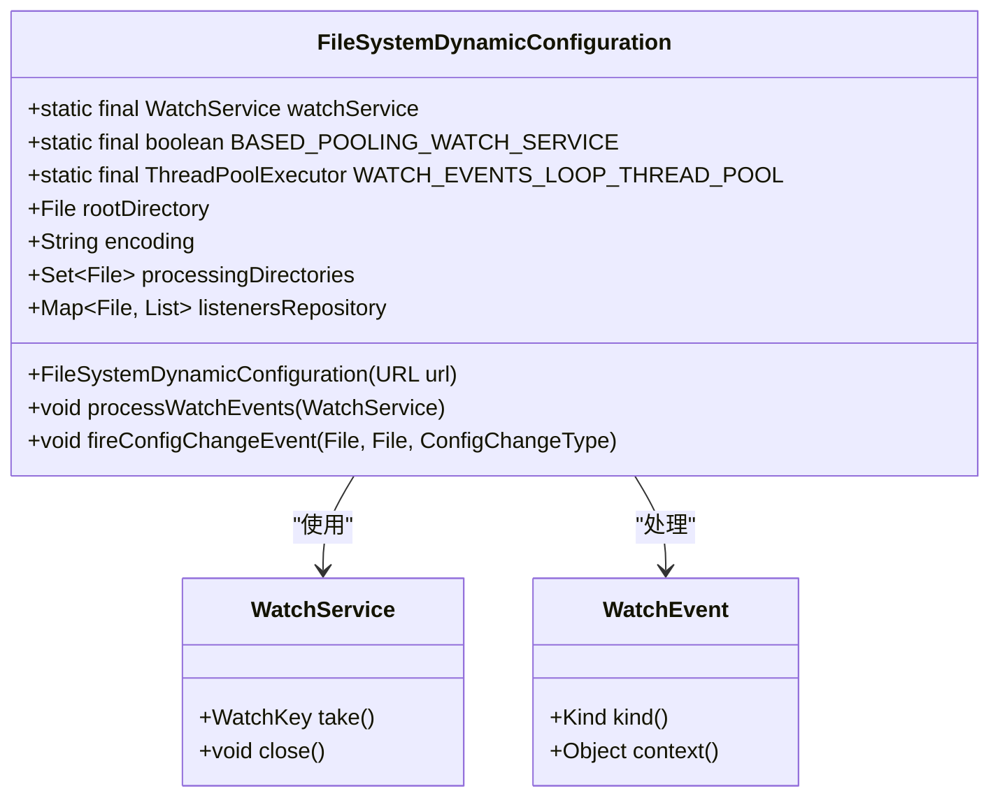
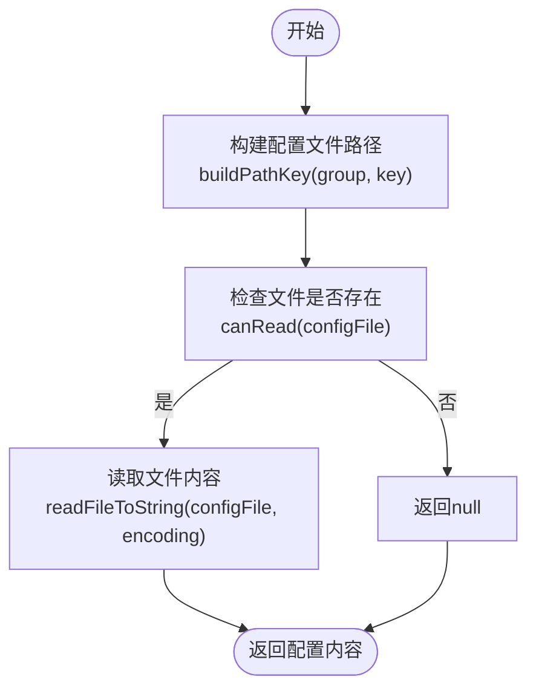
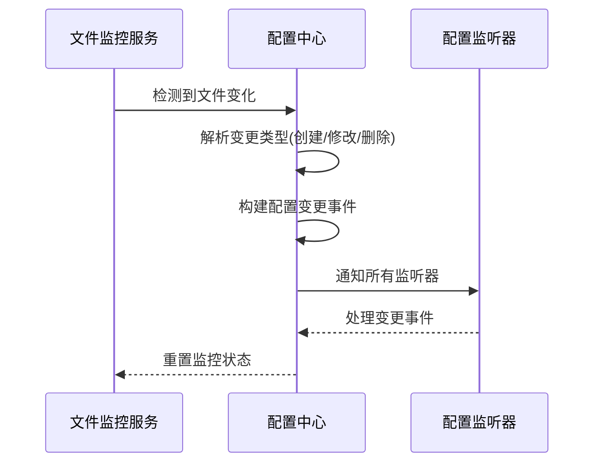
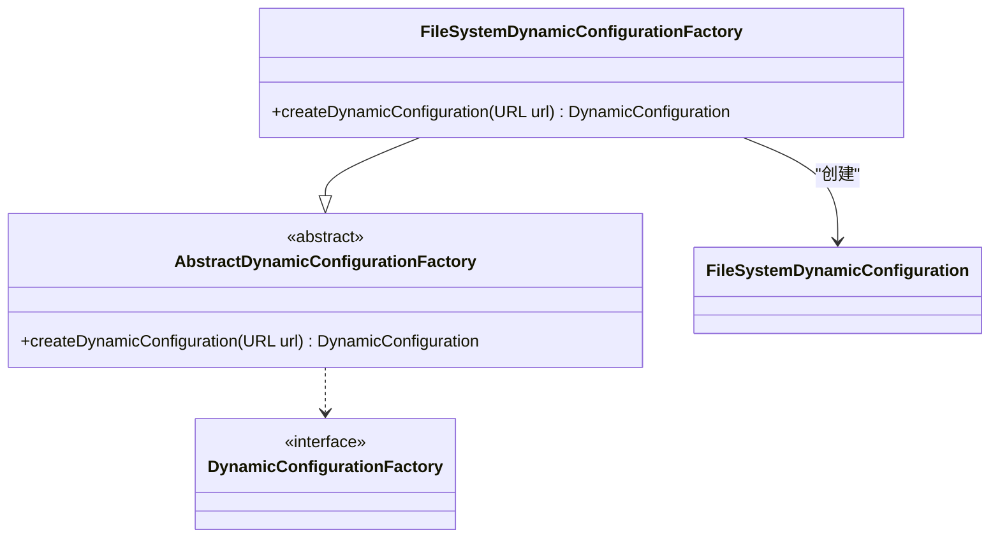
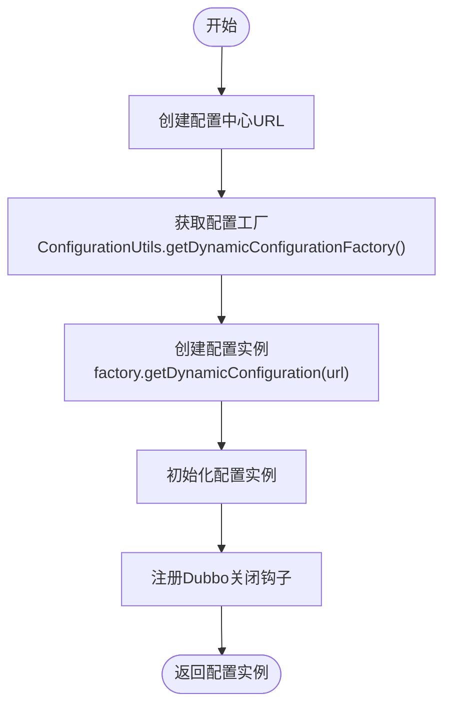
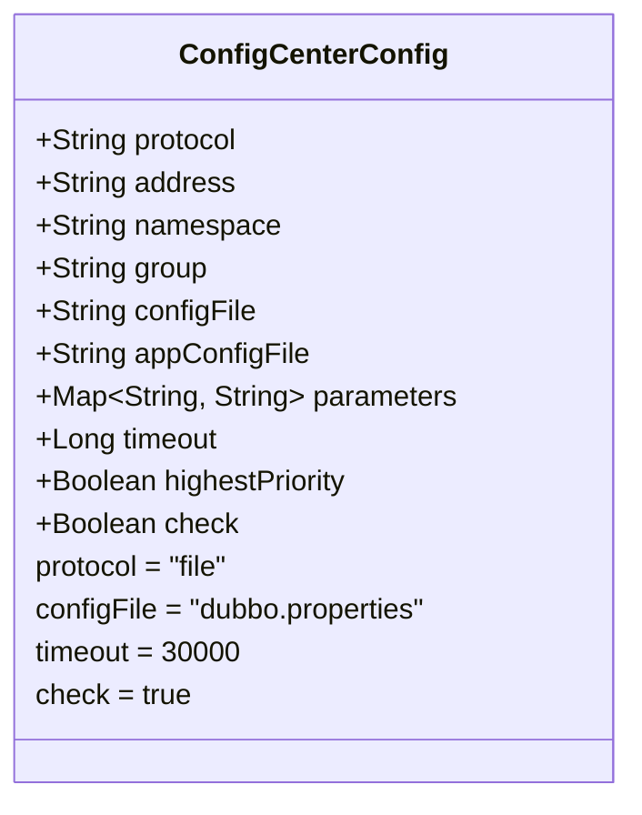
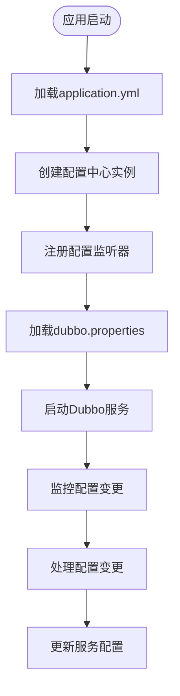

# 文件配置中心集成

<cite>
**本文档引用的文件**  
- [FileSystemDynamicConfiguration.java](file://dubbo-configcenter\dubbo-configcenter-file\src\main\java\org\apache\dubbo\common\config\configcenter\file\FileSystemDynamicConfiguration.java)
- [FileSystemDynamicConfigurationFactory.java](file://dubbo-configcenter\dubbo-configcenter-file\src\main\java\org\apache\dubbo\common\config\configcenter\file\FileSystemDynamicConfigurationFactory.java)
- [TreePathDynamicConfiguration.java](file://dubbo-common\src\main\java\org\apache\dubbo\common\config\configcenter\TreePathDynamicConfiguration.java)
- [ConfigCenterConfig.java](file://dubbo-common\src\main\java\org\apache\dubbo\config\ConfigCenterConfig.java)
- [DubboBootstrap.java](file://dubbo-config\dubbo-config-api\src\main\java\org\apache\dubbo\config\bootstrap\DubboBootstrap.java)
- [application.yml](file://dubbo-demo\dubbo-demo-spring-boot\dubbo-demo-spring-boot-provider\src\main\resources\application.yml)
</cite>

## 目录
1. [简介](#简介)
2. [核心组件分析](#核心组件分析)
3. [文件系统动态配置实现机制](#文件系统动态配置实现机制)
4. [配置工厂创建与管理](#配置工厂创建与管理)
5. [配置存储路径与格式](#配置存储路径与格式)
6. [配置参数说明](#配置参数说明)
7. [Dubbo应用集成示例](#dubbo应用集成示例)
8. [初学者集成步骤](#初学者集成步骤)
9. [性能优化与可靠性建议](#性能优化与可靠性建议)

## 简介
文件配置中心是Dubbo框架中用于管理分布式配置的重要组件。本文档详细介绍了基于文件系统的配置中心实现，包括FileSystemDynamicConfiguration的核心机制、配置文件的存储结构、监控机制以及在Dubbo应用中的集成方法。通过本指南，开发者可以深入了解文件配置中心的工作原理，并掌握其在实际项目中的应用。

## 核心组件分析

文件配置中心的核心组件包括FileSystemDynamicConfiguration和FileSystemDynamicConfigurationFactory。前者负责具体的配置读取、写入和变更检测，后者负责创建和管理配置实例。这些组件共同构成了Dubbo文件配置中心的基础架构。

**核心组件**
- FileSystemDynamicConfiguration：文件系统动态配置实现
- FileSystemDynamicConfigurationFactory：配置工厂
- TreePathDynamicConfiguration：树形路径配置基类
- ConfigCenterConfig：配置中心配置类

**Section sources**
- [FileSystemDynamicConfiguration.java](file://dubbo-configcenter\dubbo-configcenter-file\src\main\java\org\apache\dubbo\common\config\configcenter\file\FileSystemDynamicConfiguration.java#L82-L651)
- [FileSystemDynamicConfigurationFactory.java](file://dubbo-configcenter\dubbo-configcenter-file\src\main\java\org\apache\dubbo\common\config\configcenter\file\FileSystemDynamicConfigurationFactory.java#L29-L35)

## 文件系统动态配置实现机制

### 文件系统监控
FileSystemDynamicConfiguration使用Java NIO.2的WatchService机制来监控文件系统的变化。在静态初始化块中，系统会创建WatchService实例并检测是否基于轮询机制：



**Diagram sources**
- [FileSystemDynamicConfiguration.java](file://dubbo-configcenter\dubbo-configcenter-file\src\main\java\org\apache\dubbo\common\config\configcenter\file\FileSystemDynamicConfiguration.java#L150-L156)

### 配置文件读取
配置文件的读取通过doGetConfig方法实现，该方法会根据组(group)和键(key)构建文件路径，然后读取文件内容：



**Diagram sources**
- [FileSystemDynamicConfiguration.java](file://dubbo-configcenter\dubbo-configcenter-file\src\main\java\org\apache\dubbo\common\config\configcenter\file\FileSystemDynamicConfiguration.java#L398-L401)

### 变更检测
当配置文件发生变化时，系统会触发变更事件。变更检测流程如下：



**Diagram sources**
- [FileSystemDynamicConfiguration.java](file://dubbo-configcenter\dubbo-configcenter-file\src\main\java\org\apache\dubbo\common\config\configcenter\file\FileSystemDynamicConfiguration.java#L294-L338)

## 配置工厂创建与管理

### FileSystemDynamicConfigurationFactory实现
FileSystemDynamicConfigurationFactory继承自AbstractDynamicConfigurationFactory，负责创建FileSystemDynamicConfiguration实例：



**Diagram sources**
- [FileSystemDynamicConfigurationFactory.java](file://dubbo-configcenter\dubbo-configcenter-file\src\main\java\org\apache\dubbo\common\config\configcenter\file\FileSystemDynamicConfigurationFactory.java#L29-L35)

### 配置实例创建流程
配置实例的创建流程如下：



**Diagram sources**
- [FileSystemDynamicConfiguration.java](file://dubbo-configcenter\dubbo-configcenter-file\src\main\java\org\apache\dubbo\common\config\configcenter\file\FileSystemDynamicConfiguration.java#L226-L234)

## 配置存储路径与格式

### 存储路径结构
文件配置中心的存储路径遵循树形结构，根目录下按组(group)组织配置文件：

```
.dubbo/config-center/
├── dubbo/
│   ├── service1.properties
│   ├── service2.yml
│   └── router.rules
├── application/
│   ├── database.properties
│   └── cache.yml
└── global/
    ├── logback.xml
    └── security.properties
```

### 文件格式支持
文件配置中心支持多种文件格式，包括：
- Properties格式：.properties文件
- YAML格式：.yml或.yaml文件
- JSON格式：.json文件
- XML格式：.xml文件

### 命名规则
配置文件的命名遵循以下规则：
- 组名(group)作为目录名
- 键名(key)作为文件名
- 文件扩展名表示配置格式
- 特殊字符使用URL编码

**Section sources**
- [FileSystemDynamicConfiguration.java](file://dubbo-configcenter\dubbo-configcenter-file\src\main\java\org\apache\dubbo\common\config\configcenter\file\FileSystemDynamicConfiguration.java#L240-L242)
- [TreePathDynamicConfiguration.java](file://dubbo-common\src\main\java\org\apache\dubbo\common\config\configcenter\TreePathDynamicConfiguration.java#L117-L123)

## 配置参数说明

### 核心配置参数
文件配置中心支持以下核心参数：

| 参数名称 | 默认值 | 说明 |
|---------|-------|------|
| file.dir | ~/.dubbo/config-center | 配置中心根目录 |
| file.encoding | UTF-8 | 配置文件编码 |
| file.thread-pool-size | 1 | 线程池大小 |
| file.keep-alive-time | 60000 | 线程存活时间(毫秒) |

### 配置中心配置
通过ConfigCenterConfig类配置文件配置中心：



**Diagram sources**
- [ConfigCenterConfig.java](file://dubbo-common\src\main\java\org\apache\dubbo\config\ConfigCenterConfig.java#L113-L162)

## Dubbo应用集成示例

### Spring Boot集成配置
在Spring Boot应用中集成文件配置中心的完整示例：



**Diagram sources**
- [application.yml](file://dubbo-demo\dubbo-demo-spring-boot\dubbo-demo-spring-boot-provider\src\main\resources\application.yml#L21-L33)

### 代码集成示例
```java
// 使用DubboBootstrap配置文件配置中心
DubboBootstrap.getInstance()
    .configCenter(builder -> builder
        .protocol("file")
        .address("/path/to/config-center")
        .configFile("dubbo.properties")
        .timeout(30000L)
        .check(true)
    )
    .start();
```

**Section sources**
- [DubboBootstrap.java](file://dubbo-config\dubbo-config-api\src\main\java\org\apache\dubbo\config\bootstrap\DubboBootstrap.java#L674-L689)
- [application.yml](file://dubbo-demo\dubbo-demo-spring-boot\dubbo-demo-spring-boot-provider\src\main\resources\application.yml#L30-L33)

## 初学者集成步骤

### 基础集成步骤
对于初学者，集成文件配置中心的步骤如下：

1. **添加依赖**：确保项目中包含dubbo-configcenter-file模块
2. **配置路径**：设置配置中心目录路径
3. **创建配置文件**：在指定目录下创建配置文件
4. **启动应用**：启动应用并验证配置加载

### 快速入门示例
```yaml
dubbo:
  config-center:
    protocol: file
    address: /opt/dubbo/config-center
    configFile: dubbo.properties
```

**Section sources**
- [application.yml](file://dubbo-demo\dubbo-demo-spring-boot\dubbo-demo-spring-boot-provider\src\main\resources\application.yml#L30-L33)

## 性能优化与可靠性建议

### 性能优化建议
1. **合理设置监控间隔**：避免过于频繁的文件系统监控
2. **优化线程池配置**：根据实际负载调整线程池大小
3. **减少配置文件大小**：避免单个配置文件过大
4. **使用高效文件格式**：优先使用Properties或JSON格式

### 可靠性保障建议
1. **配置文件备份**：定期备份重要配置文件
2. **权限管理**：严格控制配置目录的访问权限
3. **监控告警**：监控配置中心的健康状态
4. **变更审计**：记录配置变更历史

**Section sources**
- [FileSystemDynamicConfiguration.java](file://dubbo-configcenter\dubbo-configcenter-file\src\main\java\org\apache\dubbo\common\config\configcenter\file\FileSystemDynamicConfiguration.java#L149-L156)
- [ConfigCenterConfig.java](file://dubbo-common\src\main\java\org\apache\dubbo\config\ConfigCenterConfig.java#L144-L162)