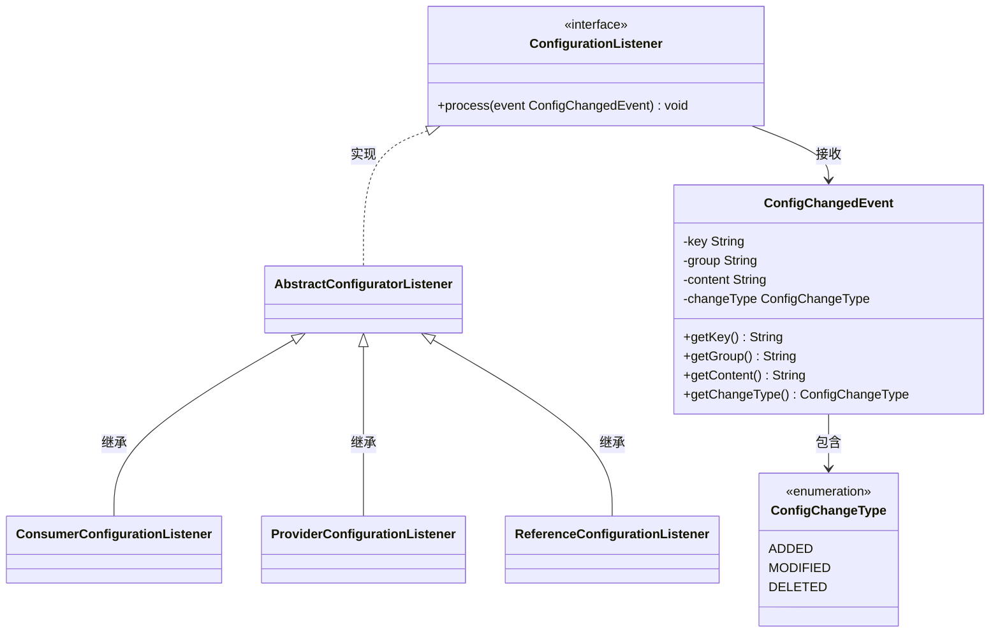
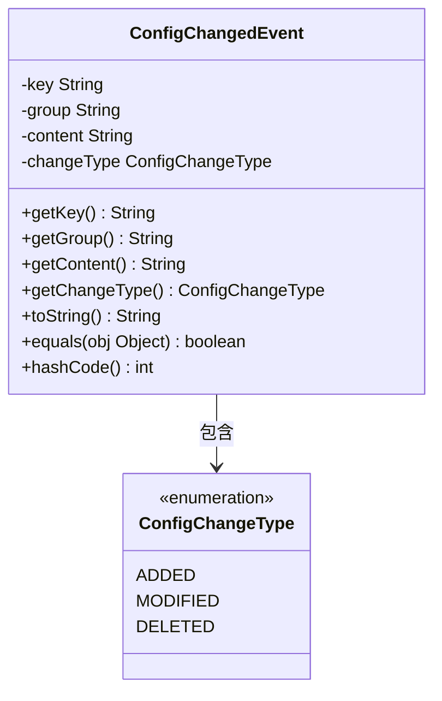
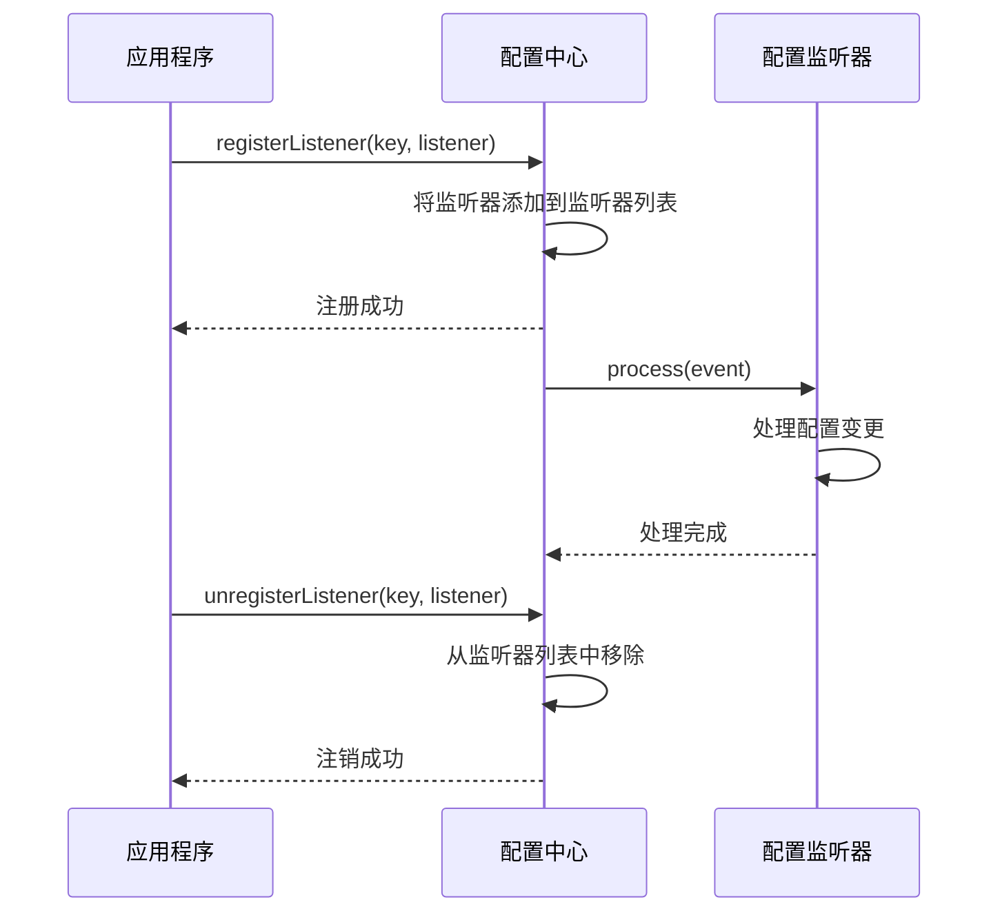
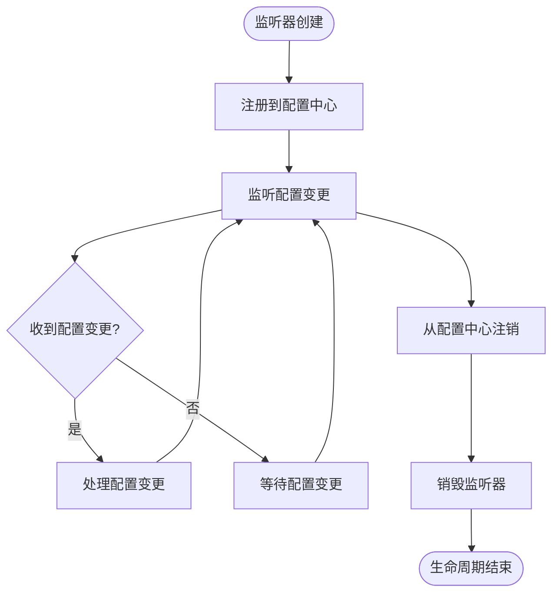
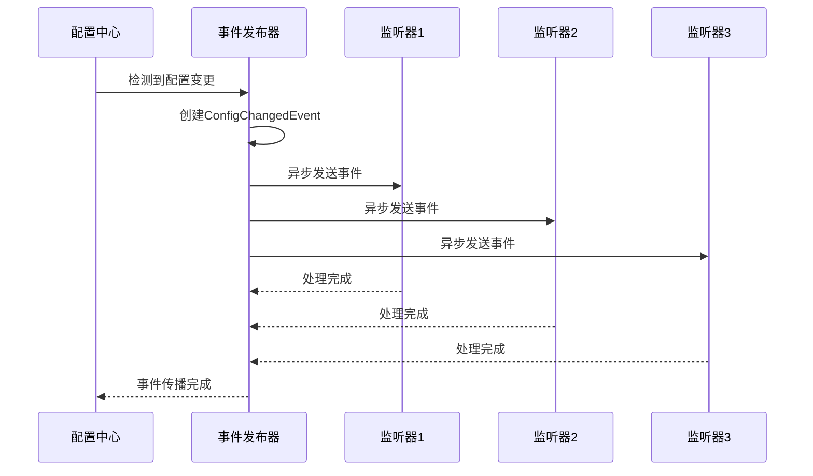
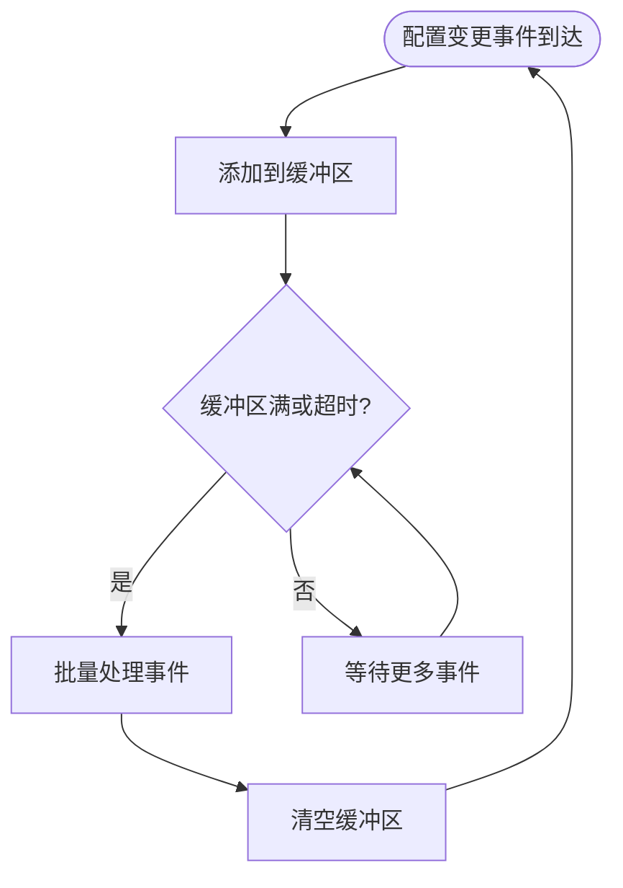

# 配置监听器

<cite>
**本文档引用的文件**
- [ConfigurationListener.java](file://dubbo-common\src\main\java\org\apache\dubbo\common\config\configcenter\ConfigurationListener.java)
- [ConfigChangedEvent.java](file://dubbo-common\src\main\java\org\apache\dubbo\common\config\configcenter\ConfigChangedEvent.java)
- [ConfigChangeType.java](file://dubbo-common\src\main\java\org\apache\dubbo\common\config\configcenter\ConfigChangeType.java)
- [AbstractConfiguratorListener.java](file://dubbo-registry\dubbo-registry-api\src\main\java\org\apache\dubbo\registry\integration\AbstractConfiguratorListener.java)
- [ApolloDynamicConfiguration.java](file://dubbo-configcenter\dubbo-configcenter-apollo\src\main\java\org\apache\dubbo\configcenter\support\apollo\ApolloDynamicConfiguration.java)
- [FileSystemDynamicConfiguration.java](file://dubbo-configcenter\dubbo-configcenter-file\src\main\java\org\apache\dubbo\common\config\configcenter\file\FileSystemDynamicConfiguration.java)
- [NacosDynamicConfiguration.java](file://dubbo-configcenter\dubbo-configcenter-nacos\src\main\java\org\apache\dubbo\configcenter\support\nacos\NacosDynamicConfiguration.java)
- [ServiceDiscoveryRegistryDirectory.java](file://dubbo-registry\dubbo-registry-api\src\main\java\org\apache\dubbo\registry\client\ServiceDiscoveryRegistryDirectory.java)
- [RegistryDirectory.java](file://dubbo-registry\dubbo-registry-api\src\main\java\org\apache\dubbo\registry\integration\RegistryDirectory.java)
</cite>

## 目录
1. [引言](#引言)
2. [配置监听器接口设计](#配置监听器接口设计)
3. [配置变更事件](#配置变更事件)
4. [监听器注册与管理](#监听器注册与管理)
5. [生命周期管理](#生命周期管理)
6. [事件传播机制与线程模型](#事件传播机制与线程模型)
7. [配置监听器实现示例](#配置监听器实现示例)
8. [高级使用技巧](#高级使用技巧)
9. [最佳实践](#最佳实践)
10. [总结](#总结)

## 引言
配置监听器是Dubbo框架中用于监听配置中心配置变更的核心组件。当配置发生变化时，配置监听器能够及时收到通知并执行相应的业务逻辑。本文档详细说明了ConfigurationListener接口的设计和使用方法，阐述了如何注册和管理配置监听器，以及监听器的生命周期管理。同时，本文档还解释了配置变更事件的传播机制和线程模型，并提供了多种配置监听器的实现示例。

## 配置监听器接口设计
ConfigurationListener接口是Dubbo配置监听器的核心接口，定义了监听器的基本行为。该接口继承自java.util.EventListener，用于接收配置变更事件。



**图源**
- [ConfigurationListener.java](file://dubbo-common\src\main\java\org\apache\dubbo\common\config\configcenter\ConfigurationListener.java)
- [ConfigChangedEvent.java](file://dubbo-common\src\main\java\org\apache\dubbo\common\config\configcenter\ConfigChangedEvent.java)
- [ConfigChangeType.java](file://dubbo-common\src\main\java\org\apache\dubbo\common\config\configcenter\ConfigChangeType.java)
- [AbstractConfiguratorListener.java](file://dubbo-registry\dubbo-registry-api\src\main\java\org\apache\dubbo\registry\integration\AbstractConfiguratorListener.java)

**章节源**
- [ConfigurationListener.java](file://dubbo-common\src\main\java\org\apache\dubbo\common\config\configcenter\ConfigurationListener.java)

### ConfigurationListener接口
ConfigurationListener接口定义了配置监听器必须实现的方法：

```java
public interface ConfigurationListener extends EventListener {
    void process(ConfigChangedEvent event);
}
```

- **process方法**：当配置发生变化时，配置中心会调用此方法通知监听器。参数ConfigChangedEvent包含了配置变更的详细信息。

### 方法调用时机
process方法的调用时机如下：
1. 当配置中心的配置发生变化时（新增、修改或删除）
2. 监听器成功注册到配置中心后
3. 配置中心定期检查配置变更时

### 参数含义
ConfigChangedEvent对象包含以下重要信息：
- **key**：配置的唯一标识符
- **group**：配置所属的分组
- **content**：配置的具体内容
- **changeType**：配置变更类型，包括ADDED（新增）、MODIFIED（修改）和DELETED（删除）

## 配置变更事件
配置变更事件由ConfigChangedEvent类表示，该类封装了配置变更的所有相关信息。



**图源**
- [ConfigChangedEvent.java](file://dubbo-common\src\main\java\org\apache\dubbo\common\config\configcenter\ConfigChangedEvent.java)
- [ConfigChangeType.java](file://dubbo-common\src\main\java\org\apache\dubbo\common\config\configcenter\ConfigChangeType.java)

**章节源**
- [ConfigChangedEvent.java](file://dubbo-common\src\main\java\org\apache\dubbo\common\config\configcenter\ConfigChangedEvent.java)

### 事件属性
ConfigChangedEvent包含以下关键属性：

| 属性 | 类型 | 描述 |
|------|------|------|
| key | String | 配置的唯一标识符，用于定位具体的配置项 |
| group | String | 配置所属的分组，用于组织和分类配置 |
| content | String | 配置的具体内容，通常是JSON或YAML格式的字符串 |
| changeType | ConfigChangeType | 配置变更的类型，指示是新增、修改还是删除 |

### 变更类型
ConfigChangeType枚举定义了三种配置变更类型：

- **ADDED**：表示配置项被新增
- **MODIFIED**：表示配置项被修改
- **DELETED**：表示配置项被删除

这些变更类型帮助监听器根据不同的变更情况执行相应的处理逻辑。

## 监听器注册与管理
配置监听器的注册和管理是通过配置中心实现的。不同的配置中心（如Nacos、Apollo、Zookeeper等）提供了相应的注册机制。



**图源**
- [ApolloDynamicConfiguration.java](file://dubbo-configcenter\dubbo-configcenter-apollo\src\main\java\org\apache\dubbo\configcenter\support\apollo\ApolloDynamicConfiguration.java)
- [FileSystemDynamicConfiguration.java](file://dubbo-configcenter\dubbo-configcenter-file\src\main\java\org\apache\dubbo\common\config\configcenter\file\FileSystemDynamicConfiguration.java)
- [NacosDynamicConfiguration.java](file://dubbo-configcenter\dubbo-configcenter-nacos\src\main\java\org\apache\dubbo\configcenter\support\nacos\NacosDynamicConfiguration.java)

**章节源**
- [ApolloDynamicConfiguration.java](file://dubbo-configcenter\dubbo-configcenter-apollo\src\main\java\org\apache\dubbo\configcenter\support\apollo\ApolloDynamicConfiguration.java)

### 注册监听器
注册监听器的典型流程如下：

1. 获取配置中心实例
2. 调用addListener方法注册监听器
3. 指定监听的配置key和分组

在Apollo配置中心的实现中，addListener方法的实现如下：
```java
void addListener(ConfigurationListener configurationListener) {
    this.listeners.add(configurationListener);
}
```

### 移除监听器
移除监听器的流程与注册类似：

1. 获取配置中心实例
2. 调用removeListener方法移除监听器
3. 指定要移除的监听器实例

在Apollo配置中心的实现中，removeListener方法的实现如下：
```java
void removeListener(ConfigurationListener configurationListener) {
    this.listeners.remove(configurationListener);
}
```

### 监听器管理
配置中心通常使用线程安全的集合来管理监听器，确保在多线程环境下的正确性。例如，使用CopyOnWriteArrayList来存储监听器列表，这样可以在遍历监听器的同时进行添加和删除操作，而不会引发并发修改异常。

## 生命周期管理
配置监听器的生命周期管理涉及监听器的创建、注册、使用和销毁等阶段。



**图源**
- [ServiceDiscoveryRegistryDirectory.java](file://dubbo-registry\dubbo-registry-api\src\main\java\org\apache\dubbo\registry\client\ServiceDiscoveryRegistryDirectory.java)
- [RegistryDirectory.java](file://dubbo-registry\dubbo-registry-api\src\main\java\org\apache\dubbo\registry\integration\RegistryDirectory.java)

**章节源**
- [ServiceDiscoveryRegistryDirectory.java](file://dubbo-registry\dubbo-registry-api\src\main\java\org\apache\dubbo\registry\client\ServiceDiscoveryRegistryDirectory.java)

### 生命周期阶段
配置监听器的生命周期包含以下几个阶段：

1. **创建阶段**：实例化监听器对象
2. **注册阶段**：将监听器注册到配置中心
3. **活跃阶段**：监听器处于活跃状态，等待配置变更事件
4. **注销阶段**：将监听器从配置中心注销
5. **销毁阶段**：释放监听器占用的资源

### 生命周期控制
在ServiceDiscoveryRegistryDirectory中，监听器的生命周期控制如下：

```java
@Override
public void subscribe(URL url) {
    if (moduleModel.modelEnvironment().getConfiguration()
            .convert(Boolean.class, Constants.ENABLE_CONFIGURATION_LISTEN, true)) {
        enableConfigurationListen = true;
        getConsumerConfigurationListener(moduleModel).addNotifyListener(this);
        referenceConfigurationListener = new ReferenceConfigurationListener(this.moduleModel, this, url);
    } else {
        enableConfigurationListen = false;
    }
    super.subscribe(url);
}

@Override
public void unSubscribe(URL url) {
    super.unSubscribe(url);
    this.originalUrls = null;
    if (moduleModel.modelEnvironment().getConfiguration()
            .convert(Boolean.class, Constants.ENABLE_CONFIGURATION_LISTEN, true)) {
        getConsumerConfigurationListener(moduleModel).removeNotifyListener(this);
        referenceConfigurationListener.stop();
    }
}
```

当订阅服务时，创建并注册监听器；当取消订阅时，注销并停止监听器。

## 事件传播机制与线程模型
配置变更事件的传播机制和线程模型是配置监听器实现中的关键部分，直接影响系统的性能和可靠性。



**图源**
- [FileSystemDynamicConfiguration.java](file://dubbo-configcenter\dubbo-configcenter-file\src\main\java\org\apache\dubbo\common\config\configcenter\file\FileSystemDynamicConfiguration.java)
- [NacosDynamicConfiguration.java](file://dubbo-configcenter\dubbo-configcenter-nacos\src\main\java\org\apache\dubbo\configcenter\support\nacos\NacosDynamicConfiguration.java)

**章节源**
- [FileSystemDynamicConfiguration.java](file://dubbo-configcenter\dubbo-configcenter-file\src\main\java\org\apache\dubbo\common\config\configcenter\file\FileSystemDynamicConfiguration.java)

### 事件传播机制
配置变更事件的传播机制主要包括以下步骤：

1. **事件检测**：配置中心检测到配置文件或数据库中的配置发生变化
2. **事件创建**：创建ConfigChangedEvent对象，封装变更信息
3. **事件分发**：将事件分发给所有注册了该配置key的监听器
4. **事件处理**：各个监听器异步处理配置变更事件

### 线程模型
配置监听器采用异步线程模型来处理配置变更，确保不会阻塞主业务流程：

- **独立线程池**：使用专门的线程池处理配置变更事件
- **异步处理**：事件处理在独立线程中执行，不阻塞事件发布
- **线程安全**：使用线程安全的数据结构存储监听器列表

在FileSystemDynamicConfiguration中，使用了专门的线程池来处理文件系统事件：

```java
private static final ThreadPoolExecutor WATCH_EVENTS_LOOP_THREAD_POOL;
```

### 性能考虑
为了保证高性能，配置监听器实现考虑了以下因素：

- **批量处理**：将多个配置变更事件合并处理
- **事件去重**：避免重复处理相同的配置变更
- **延迟处理**：对于频繁变更的配置，采用延迟处理策略

## 配置监听器实现示例
本节提供多种配置监听器的实现示例，从简单的日志监听器到复杂的业务逻辑监听器。

### 简单的日志监听器
最简单的配置监听器实现是日志监听器，它只是将配置变更信息记录到日志中：

```java
public class LoggingConfigurationListener implements ConfigurationListener {
    private static final Logger logger = LoggerFactory.getLogger(LoggingConfigurationListener.class);
    
    @Override
    public void process(ConfigChangedEvent event) {
        logger.info("配置变更: key={}, group={}, changeType={}, content={}", 
                   event.getKey(), event.getGroup(), event.getChangeType(), event.getContent());
    }
}
```

**章节源**
- [ConfigurationListener.java](file://dubbo-common\src\main\java\org\apache\dubbo\common\config\configcenter\ConfigurationListener.java)

### 复杂的业务逻辑监听器
复杂的业务逻辑监听器可以根据配置变更执行相应的业务操作：

```java
public class BusinessLogicConfigurationListener implements ConfigurationListener {
    private final BusinessService businessService;
    private final ObjectMapper objectMapper;
    
    public BusinessLogicConfigurationListener(BusinessService businessService) {
        this.businessService = businessService;
        this.objectMapper = new ObjectMapper();
    }
    
    @Override
    public void process(ConfigChangedEvent event) {
        try {
            switch (event.getChangeType()) {
                case ADDED:
                case MODIFIED:
                    handleConfigUpdate(event);
                    break;
                case DELETED:
                    handleConfigDelete(event);
                    break;
            }
        } catch (Exception e) {
            logger.error("处理配置变更失败", e);
        }
    }
    
    private void handleConfigUpdate(ConfigChangedEvent event) throws JsonProcessingException {
        BusinessConfig config = objectMapper.readValue(event.getContent(), BusinessConfig.class);
        businessService.updateConfiguration(config);
    }
    
    private void handleConfigDelete(ConfigChangedEvent event) {
        businessService.removeConfiguration(event.getKey());
    }
}
```

**章节源**
- [ConfigurationListener.java](file://dubbo-common\src\main\java\org\apache\dubbo\common\config\configcenter\ConfigurationListener.java)

### 配置缓存监听器
配置缓存监听器用于维护本地配置缓存，提高配置读取性能：

```java
public class CacheConfigurationListener implements ConfigurationListener {
    private final Map<String, String> configCache = new ConcurrentHashMap<>();
    private final ReadWriteLock cacheLock = new ReentrantReadWriteLock();
    
    @Override
    public void process(ConfigChangedEvent event) {
        String key = buildCacheKey(event.getKey(), event.getGroup());
        
        cacheLock.writeLock().lock();
        try {
            switch (event.getChangeType()) {
                case ADDED:
                case MODIFIED:
                    configCache.put(key, event.getContent());
                    break;
                case DELETED:
                    configCache.remove(key);
                    break;
            }
        } finally {
            cacheLock.writeLock().unlock();
        }
    }
    
    public String getConfig(String key, String group) {
        String cacheKey = buildCacheKey(key, group);
        
        cacheLock.readLock().lock();
        try {
            return configCache.get(cacheKey);
        } finally {
            cacheLock.readLock().unlock();
        }
    }
    
    private String buildCacheKey(String key, String group) {
        return group + ":" + key;
    }
}
```

**章节源**
- [ConfigurationListener.java](file://dubbo-common\src\main\java\org\apache\dubbo\common\config\configcenter\ConfigurationListener.java)

## 高级使用技巧
本节介绍配置监听器的高级使用技巧，帮助开发者更好地利用配置监听器功能。

### 批量处理
对于频繁变更的配置，可以采用批量处理策略，减少处理开销：



**图源**
- [FileSystemDynamicConfiguration.java](file://dubbo-configcenter\dubbo-configcenter-file\src\main\java\org\apache\dubbo\common\config\configcenter\file\FileSystemDynamicConfiguration.java)

**章节源**
- [FileSystemDynamicConfiguration.java](file://dubbo-configcenter\dubbo-configcenter-file\src\main\java\org\apache\dubbo\common\config\configcenter\file\FileSystemDynamicConfiguration.java)

### 异步处理
使用异步处理可以避免阻塞主线程，提高系统响应性：

```java
public class AsyncConfigurationListener implements ConfigurationListener {
    private final ExecutorService executorService;
    private final ConfigurationHandler handler;
    
    public AsyncConfigurationListener(ConfigurationHandler handler) {
        this.handler = handler;
        this.executorService = Executors.newFixedThreadPool(5);
    }
    
    @Override
    public void process(ConfigChangedEvent event) {
        executorService.submit(() -> {
            try {
                handler.handle(event);
            } catch (Exception e) {
                logger.error("异步处理配置变更失败", e);
            }
        });
    }
    
    public void shutdown() {
        executorService.shutdown();
        try {
            if (!executorService.awaitTermination(30, TimeUnit.SECONDS)) {
                executorService.shutdownNow();
            }
        } catch (InterruptedException e) {
            executorService.shutdownNow();
            Thread.currentThread().interrupt();
        }
    }
}
```

**章节源**
- [ConfigurationListener.java](file://dubbo-common\src\main\java\org\apache\dubbo\common\config\configcenter\ConfigurationListener.java)

### 错误恢复机制
实现错误恢复机制可以提高系统的可靠性：

```java
public class ReliableConfigurationListener implements ConfigurationListener {
    private static final int MAX_RETRY_COUNT = 3;
    private final RetryPolicy retryPolicy;
    private final ConfigurationHandler handler;
    
    public ReliableConfigurationListener(ConfigurationHandler handler) {
        this.handler = handler;
        this.retryPolicy = new ExponentialBackoffRetry(1000, MAX_RETRY_COUNT);
    }
    
    @Override
    public void process(ConfigChangedEvent event) {
        int retryCount = 0;
        while (retryCount < MAX_RETRY_COUNT) {
            try {
                handler.handle(event);
                return; // 处理成功，退出
            } catch (Exception e) {
                retryCount++;
                if (retryCount >= MAX_RETRY_COUNT) {
                    logger.error("配置变更处理失败，已达到最大重试次数", e);
                    break;
                }
                
                try {
                    long sleepTime = retryPolicy.getSleepTimeMs(retryCount);
                    Thread.sleep(sleepTime);
                } catch (InterruptedException ie) {
                    Thread.currentThread().interrupt();
                    break;
                }
                
                logger.warn("配置变更处理失败，第{}次重试", retryCount);
            }
        }
    }
}
```

**章节源**
- [ConfigurationListener.java](file://dubbo-common\src\main\java\org\apache\dubbo\common\config\configcenter\ConfigurationListener.java)

## 最佳实践
本节总结配置监听器使用的最佳实践，帮助开发者避免常见问题。

### 幂等性处理
配置变更处理应该具有幂等性，即多次处理相同的配置变更不会产生不同的结果：

```java
public class IdempotentConfigurationListener implements ConfigurationListener {
    private final Set<String> processedEvents = Collections.newSetFromMap(
        new ConcurrentHashMap<String, Boolean>());
    
    @Override
    public void process(ConfigChangedEvent event) {
        String eventId = generateEventId(event);
        
        if (processedEvents.add(eventId)) {
            try {
                // 处理配置变更
                handleConfigurationChange(event);
            } finally {
                // 定期清理已处理的事件ID，避免内存泄漏
                scheduleCleanup();
            }
        } else {
            logger.debug("重复的配置变更事件，已忽略: {}", eventId);
        }
    }
    
    private String generateEventId(ConfigChangedEvent event) {
        return event.getKey() + ":" + event.getGroup() + ":" + 
               event.getChangeType() + ":" + event.getContent().hashCode();
    }
}
```

**章节源**
- [ConfigurationListener.java](file://dubbo-common\src\main\java\org\apache\dubbo\common\config\configcenter\ConfigurationListener.java)

### 顺序性保证
在某些场景下，需要保证配置变更的处理顺序：

```java
public class OrderedConfigurationListener implements ConfigurationListener {
    private final Map<String, Queue<ConfigChangedEvent>> eventQueues = new ConcurrentHashMap<>();
    private final Map<String, Lock> queueLocks = new ConcurrentHashMap<>();
    
    @Override
    public void process(ConfigChangedEvent event) {
        String key = event.getKey();
        Queue<ConfigChangedEvent> queue = eventQueues.computeIfAbsent(key, k -> new ConcurrentLinkedQueue<>());
        Lock lock = queueLocks.computeIfAbsent(key, k -> new ReentrantLock());
        
        queue.offer(event);
        
        lock.lock();
        try {
            processQueue(queue);
        } finally {
            lock.unlock();
        }
    }
    
    private void processQueue(Queue<ConfigChangedEvent> queue) {
        ConfigChangedEvent event;
        while ((event = queue.poll()) != null) {
            try {
                handleEvent(event);
            } catch (Exception e) {
                logger.error("处理配置变更失败", e);
            }
        }
    }
}
```

**章节源**
- [ConfigurationListener.java](file://dubbo-common\src\main\java\org\apache\dubbo\common\config\configcenter\ConfigurationListener.java)

### 性能优化
性能优化是配置监听器实现中的重要考虑因素：

1. **减少锁竞争**：使用无锁数据结构或细粒度锁
2. **批量处理**：合并多个配置变更事件
3. **异步处理**：避免阻塞主线程
4. **缓存机制**：缓存频繁访问的配置

## 总结
配置监听器是Dubbo框架中实现动态配置管理的核心组件。通过ConfigurationListener接口，开发者可以轻松实现对配置变更的监听和处理。本文档详细介绍了配置监听器的设计、使用方法和最佳实践，包括接口设计、事件传播机制、线程模型、生命周期管理等方面。

配置监听器的实现需要考虑幂等性、顺序性和性能等关键因素。通过合理的批量处理、异步处理和错误恢复机制，可以构建出高可靠、高性能的配置管理系统。开发者可以根据具体业务需求，选择合适的监听器实现方式，从简单的日志监听器到复杂的业务逻辑监听器，灵活应对各种场景。

配置监听器的正确使用能够显著提升系统的灵活性和可维护性，使应用能够动态适应运行环境的变化，实现真正的微服务治理。