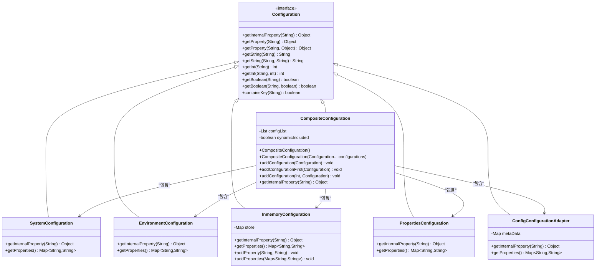
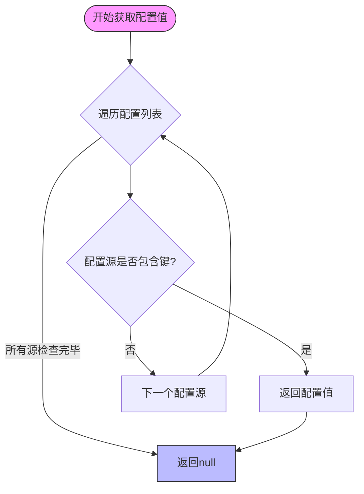
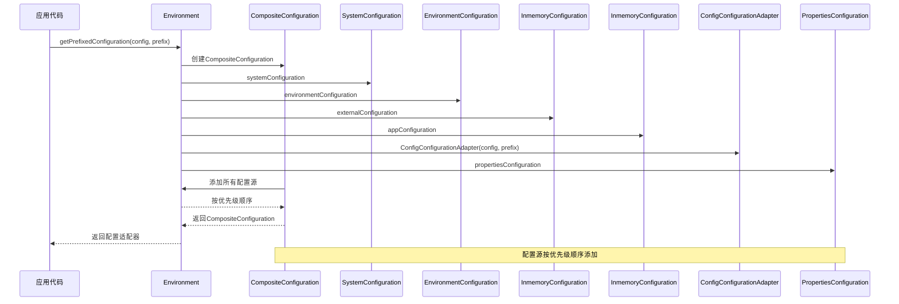
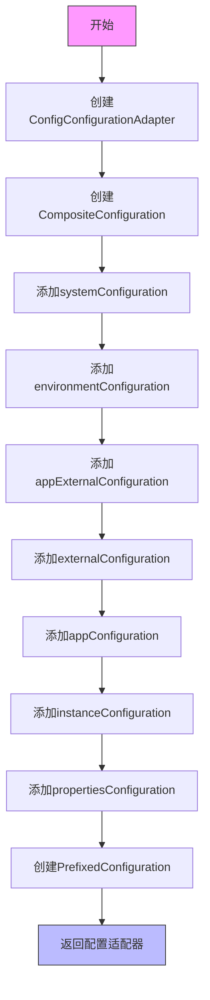
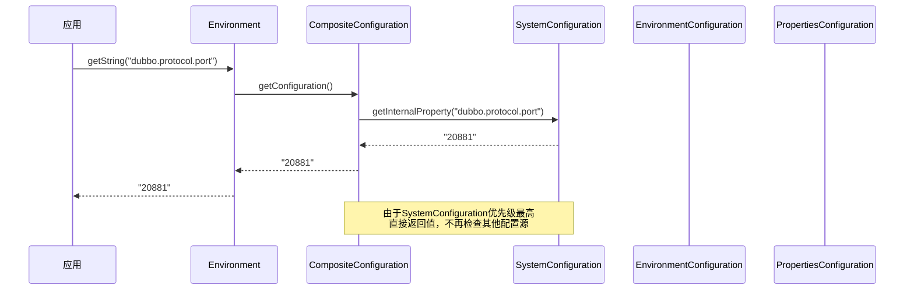

# 优先级规则

<cite>
**本文档引用的文件**   
- [Environment.java](file://dubbo-common\src\main\java\org\apache\dubbo\common\config\Environment.java)
- [CompositeConfiguration.java](file://dubbo-common\src\main\java\org\apache\dubbo\common\config\CompositeConfiguration.java)
- [Configuration.java](file://dubbo-common\src\main\java\org\apache\dubbo\common\config\Configuration.java)
- [SystemConfiguration.java](file://dubbo-common\src\main\java\org\apache\dubbo\common\config\SystemConfiguration.java)
- [EnvironmentConfiguration.java](file://dubbo-common\src\main\java\org\apache\dubbo\common\config\EnvironmentConfiguration.java)
- [PropertiesConfiguration.java](file://dubbo-common\src\main\java\org\apache\dubbo\common\config\PropertiesConfiguration.java)
- [InmemoryConfiguration.java](file://dubbo-common\src\main\java\org\apache\dubbo\common\config\InmemoryConfiguration.java)
- [ConfigConfigurationAdapter.java](file://dubbo-common\src\main\java\org\apache\dubbo\config\context\ConfigConfigurationAdapter.java)
- [ConfigurationUtils.java](file://dubbo-common\src\main\java\org\apache\dubbo\common\config\ConfigurationUtils.java)
</cite>

## 目录
1. [引言](#引言)
2. [配置来源优先级顺序](#配置来源优先级顺序)
3. [优先级处理机制](#优先级处理机制)
4. [配置值获取流程](#配置值获取流程)
5. [实际示例](#实际示例)
6. [结论](#结论)

## 引言

Dubbo配置系统采用分层优先级机制来处理来自不同来源的配置。当同一配置项在多个来源中出现时，系统会根据预定义的优先级顺序来确定最终生效的配置值。这种设计确保了配置的灵活性和可管理性，允许用户在不同层级上覆盖配置。

**配置来源优先级顺序**
- [Environment.java](file://dubbo-common\src\main\java\org\apache\dubbo\common\config\Environment.java#L188-L189)
- [CompositeConfiguration.java](file://dubbo-common\src\main\java\org\apache\dubbo\common\config\CompositeConfiguration.java#L79-L84)

## 配置来源优先级顺序

Dubbo配置系统定义了明确的配置来源优先级顺序，从高到低如下：

1. **JVM系统属性** (`-D`参数) - 最高优先级
2. **操作系统环境变量** 
3. **应用外部配置** (如配置中心的全局/默认配置)
4. **外部配置** (如配置中心的应用配置)
5. **应用配置** (如Spring Environment/PropertySources/application.properties)
6. **代码配置** (API、XML、注解等)
7. **dubbo.properties文件** - 最低优先级

这个优先级顺序在`Environment`类中明确定义，确保了配置值的获取遵循一致的规则。

```mermaid
graph TD
A[JVM系统属性<br/>(-D参数)] --> B[操作系统环境变量]
B --> C[应用外部配置<br/>(配置中心全局配置)]
C --> D[外部配置<br/>(配置中心应用配置)]
D --> E[应用配置<br/>(Spring Environment等)]
E --> F[代码配置<br/>(API/XML/注解)]
F --> G[dubbo.properties文件]
style A fill:#f9f,stroke:#333
style G fill:#bbf,stroke:#333
```

**图示来源**
- [Environment.java](file://dubbo-common\src\main\java\org\apache\dubbo\common\config\Environment.java#L188-L189)

## 优先级处理机制

Dubbo通过`CompositeConfiguration`类实现配置优先级处理机制。该类维护一个配置列表，按照优先级顺序存储不同来源的配置，并在获取配置值时按顺序查找。

### 核心组件

**CompositeConfiguration**：组合配置类，负责管理多个配置源并按优先级顺序查找配置值。



**图示来源**
- [CompositeConfiguration.java](file://dubbo-common\src\main\java\org\apache\dubbo\common\config\CompositeConfiguration.java)
- [Configuration.java](file://dubbo-common\src\main\java\org\apache\dubbo\common\config\Configuration.java)

### 优先级实现原理

`CompositeConfiguration`的`getInternalProperty`方法实现了优先级查找逻辑：



**图示来源**
- [CompositeConfiguration.java](file://dubbo-common\src\main\java\org\apache\dubbo\common\config\CompositeConfiguration.java#L79-L84)

## 配置值获取流程

当Dubbo需要获取配置值时，会通过`Environment`类的`getPrefixedConfiguration`方法创建一个`CompositeConfiguration`实例，该实例按优先级顺序组合所有配置源。

### 获取流程



**图示来源**
- [Environment.java](file://dubbo-common\src\main\java\org\apache\dubbo\common\config\Environment.java#L186-L198)

### 具体实现

`Environment`类中的`getPrefixedConfiguration`方法定义了配置源的组合顺序：



**图示来源**
- [Environment.java](file://dubbo-common\src\main\java\org\apache\dubbo\common\config\Environment.java#L186-L198)

## 实际示例

### 示例1：端口配置

假设需要配置服务端口，不同来源的配置如下：

```mermaid
graph TD
A[JVM系统属性] --> |dubbo.protocol.port=20881| B[最终生效]
C[环境变量] --> |DUBBO_PROTOCOL_PORT=20882| D[被覆盖]
E[配置中心] --> |dubbo.protocol.port=20883| F[被覆盖]
G[application.properties] --> |dubbo.protocol.port=20884| H[被覆盖]
I[代码配置] --> |setPort(20885)| J[被覆盖]
K[dubbo.properties] --> |dubbo.protocol.port=20886| L[被覆盖]
style A fill:#f9f,stroke:#333
style B fill:#f9f,stroke:#333
```

在这种情况下，尽管所有配置源都设置了端口，但由于JVM系统属性具有最高优先级，最终生效的端口是20881。

### 示例2：配置覆盖流程



**图示来源**
- [CompositeConfiguration.java](file://dubbo-common\src\main\java\org\apache\dubbo\common\config\CompositeConfiguration.java#L79-L84)

## 结论

Dubbo配置系统的优先级规则设计合理，通过`CompositeConfiguration`类实现了清晰的配置源优先级处理机制。配置来源按优先级从高到低依次为：JVM系统属性、操作系统环境变量、应用外部配置、外部配置、应用配置、代码配置和dubbo.properties文件。

这种设计允许用户在不同层级上灵活地覆盖配置，最高优先级的JVM系统属性可以用于临时覆盖其他所有配置，而最低优先级的dubbo.properties文件则适合作为默认配置。通过这种分层机制，Dubbo实现了配置的灵活性和可管理性，满足了不同场景下的配置需求。

**配置机制总结**
- [Environment.java](file://dubbo-common\src\main\java\org\apache\dubbo\common\config\Environment.java)
- [CompositeConfiguration.java](file://dubbo-common\src\main\java\org\apache\dubbo\common\config\CompositeConfiguration.java)