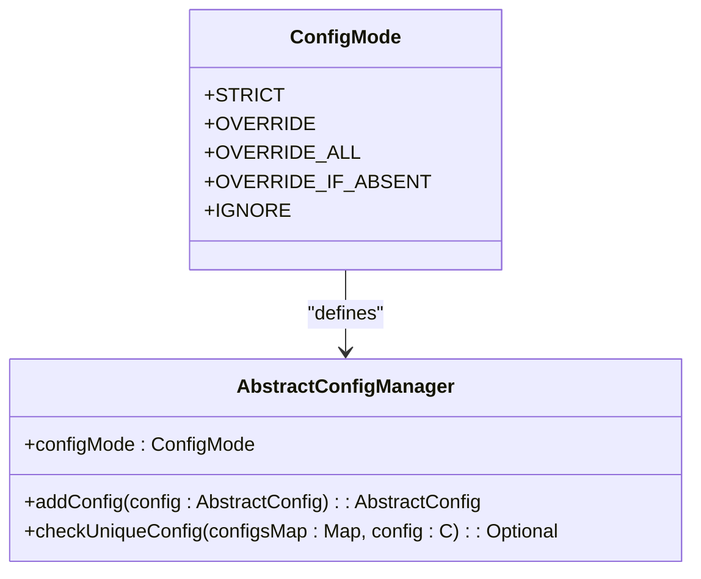
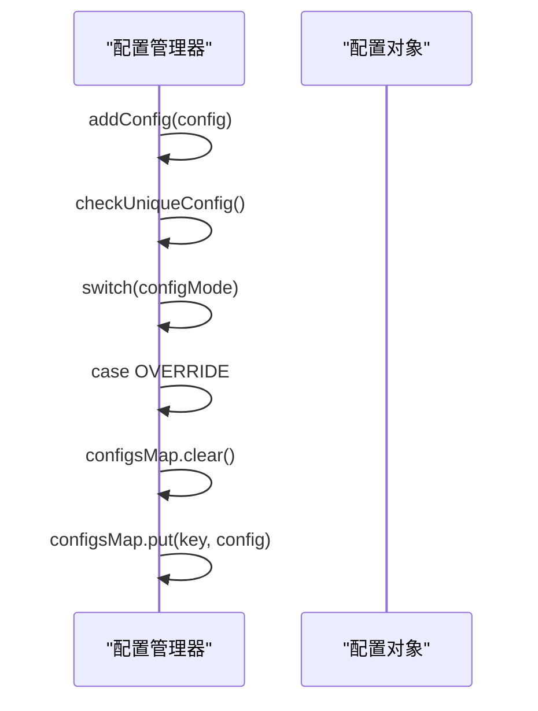
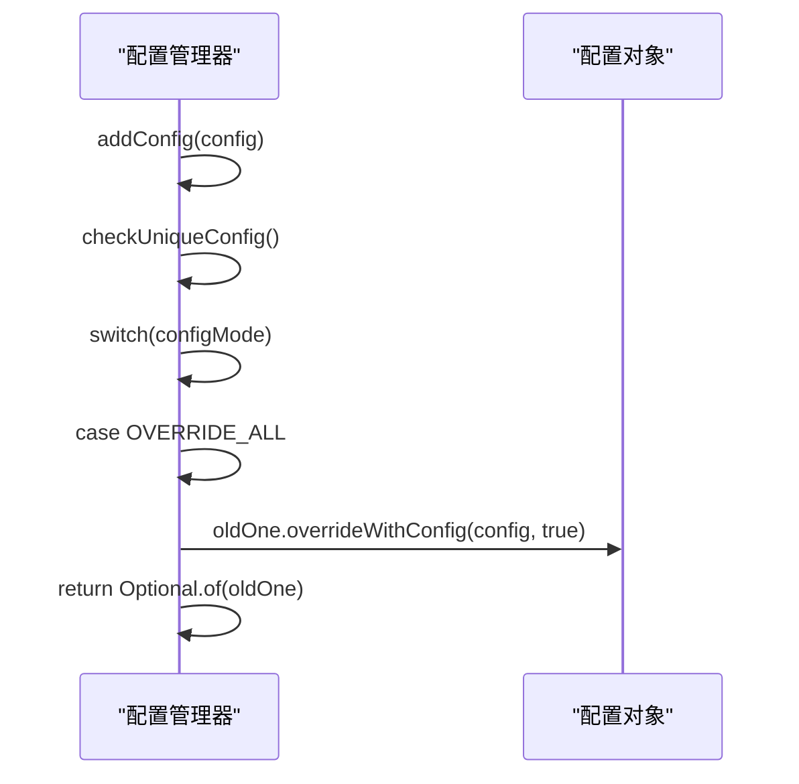
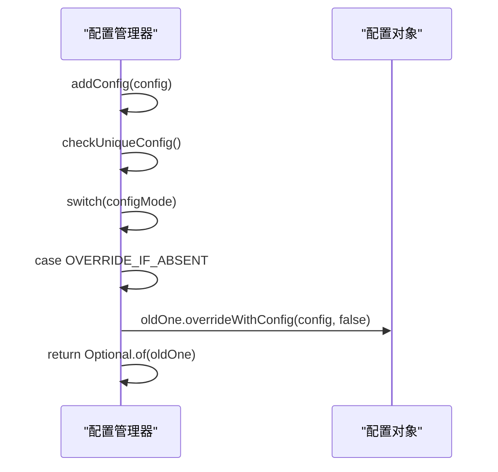
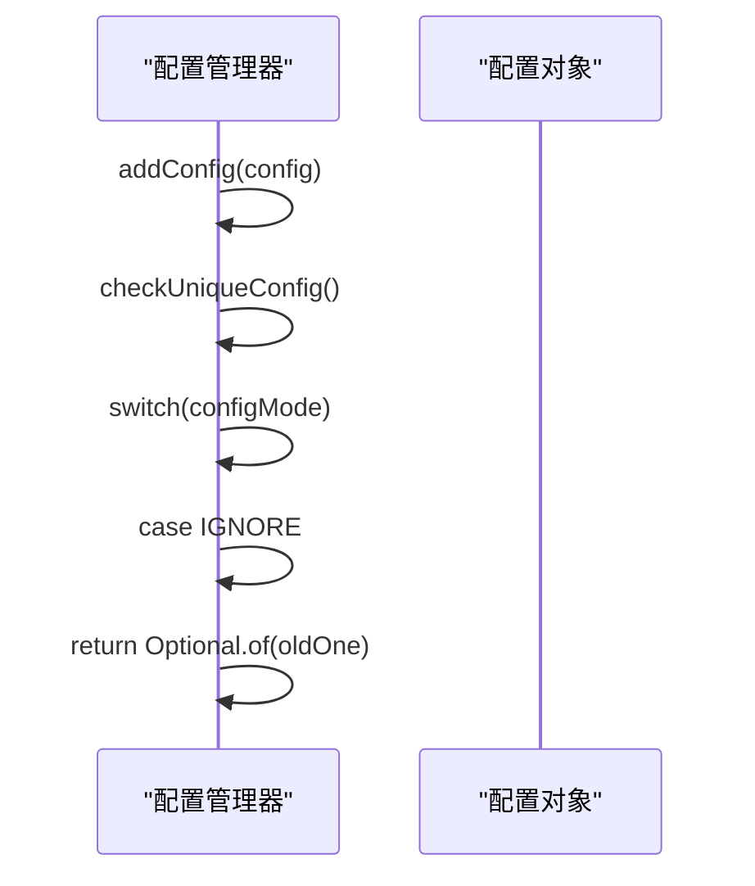
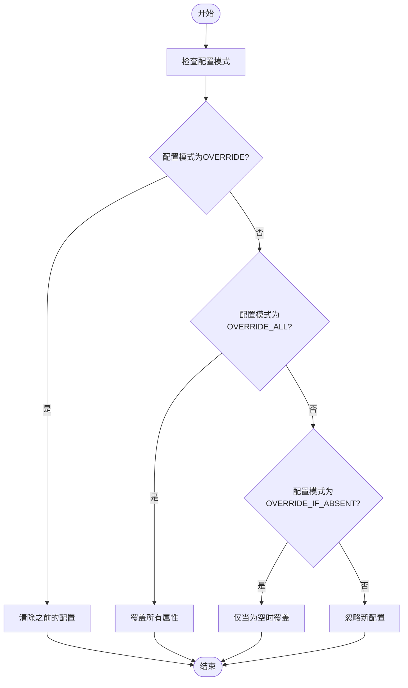
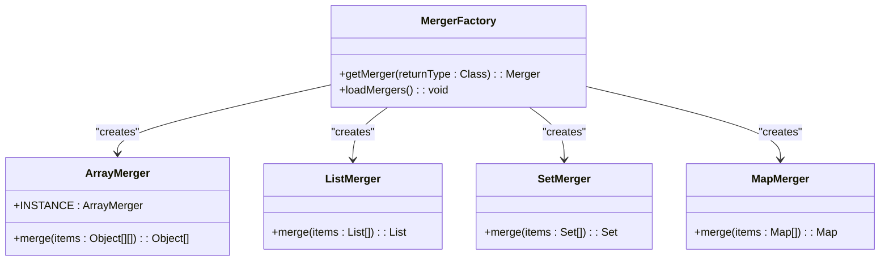
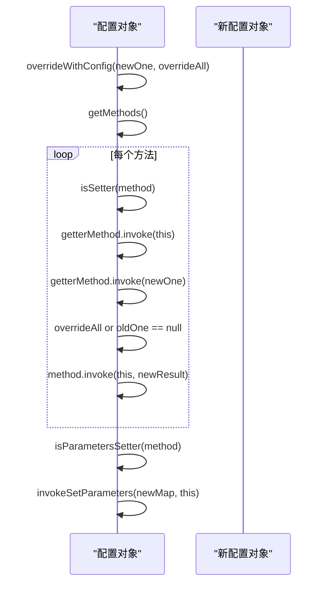

# 合并策略

<cite>
**本文档引用的文件**   
- [DefaultProviderURLMergeProcessor.java](file://dubbo-cluster/src/main/java/org/apache/dubbo/rpc/cluster/support/merger/DefaultProviderURLMergeProcessor.java)
- [AbstractConfigManager.java](file://dubbo-common/src/main/java/org/apache/dubbo/config/context/AbstractConfigManager.java)
- [ConfigMode.java](file://dubbo-common/src/main/java/org/apache/dubbo/config/context/ConfigMode.java)
- [Parameters.java](file://dubbo-common/src/main/java/org/apache/dubbo/common/Parameters.java)
- [AbstractConfig.java](file://dubbo-common/src/main/java/org/apache/dubbo/config/AbstractConfig.java)
- [ResultMergerTest.java](file://dubbo-cluster/src/test/java/org/apache/dubbo/rpc/cluster/merger/ResultMergerTest.java)
- [MergerFactory.java](file://dubbo-cluster/src/main/java/org/apache/dubbo/rpc/cluster/merger/MergerFactory.java)
- [ArrayMerger.java](file://dubbo-cluster/src/main/java/org/apache/dubbo/rpc/cluster/merger/ArrayMerger.java)
- [MapMerger.java](file://dubbo-cluster/src/main/java/org/apache/dubbo/rpc/cluster/merger/MapMerger.java)
- [ListMerger.java](file://dubbo-cluster/src/main/java/org/apache/dubbo/rpc/cluster/merger/ListMerger.java)
</cite>

## 目录
1. [引言](#引言)
2. [配置合并机制概述](#配置合并机制概述)
3. [核心合并策略](#核心合并策略)
4. [不同配置类型的合并方式](#不同配置类型的合并方式)
5. [合并策略的应用场景](#合并策略的应用场景)
6. [最佳实践](#最佳实践)
7. [结论](#结论)

## 引言
Dubbo配置系统提供了一套灵活的配置合并机制，用于处理多个配置来源提供的相同配置项。当多个配置来源同时存在时，Dubbo通过定义的合并策略来决定如何处理这些配置项。本文档详细介绍了Dubbo配置系统的配置合并机制，包括覆盖策略、追加策略和深度合并策略，以及不同类型配置（如字符串、数字、集合、对象）的合并方式。

## 配置合并机制概述
Dubbo配置系统的配置合并机制主要通过`ConfigMode`枚举类型来定义不同的处理模式。`ConfigMode`枚举类型定义了对于唯一配置类型的处理模式，例如`ApplicationConfig`、`ModuleConfig`、`MonitorConfig`、`SslConfig`、`MetricsConfig`等。该枚举类型用于控制当多个同类型配置同时存在时的处理策略。



**Diagram sources**
- [ConfigMode.java](file://dubbo-common/src/main/java/org/apache/dubbo/config/context/ConfigMode.java#L45-L75)
- [AbstractConfigManager.java](file://dubbo-common/src/main/java/org/apache/dubbo/config/context/AbstractConfigManager.java#L179-L181)

## 核心合并策略
Dubbo配置系统提供了多种核心合并策略，用于处理不同场景下的配置合并需求。

### 覆盖策略
覆盖策略（OVERRIDE）接受最后一个配置，覆盖之前的配置。这种策略适用于需要确保最新配置生效的场景。



**Diagram sources**
- [AbstractConfigManager.java](file://dubbo-common/src/main/java/org/apache/dubbo/config/context/AbstractConfigManager.java#L570-L580)

### 全量覆盖策略
全量覆盖策略（OVERRIDE_ALL）接受最后一个配置，覆盖之前配置的所有属性，无论之前的属性是否为空。这种策略适用于需要完全替换旧配置的场景。



**Diagram sources**
- [AbstractConfigManager.java](file://dubbo-common/src/main/java/org/apache/dubbo/config/context/AbstractConfigManager.java#L582-L593)
- [AbstractConfig.java](file://dubbo-common/src/main/java/org/apache/dubbo/config/AbstractConfig.java#L634-L713)

### 条件覆盖策略
条件覆盖策略（OVERRIDE_IF_ABSENT）接受最后一个配置，仅当之前配置的属性为空时才覆盖。这种策略适用于需要保留已有配置值，仅在必要时更新的场景。



**Diagram sources**
- [AbstractConfigManager.java](file://dubbo-common/src/main/java/org/apache/dubbo/config/context/AbstractConfigManager.java#L594-L605)
- [AbstractConfig.java](file://dubbo-common/src/main/java/org/apache/dubbo/config/AbstractConfig.java#L634-L713)

### 忽略策略
忽略策略（IGNORE）接受第一个配置，忽略后续的配置。这种策略适用于需要确保初始配置不被修改的场景。



**Diagram sources**
- [AbstractConfigManager.java](file://dubbo-common/src/main/java/org/apache/dubbo/config/context/AbstractConfigManager.java#L559-L569)

## 不同配置类型的合并方式
Dubbo配置系统支持多种配置类型的合并，包括字符串、数字、集合和对象等。

### 字符串和数字的合并
字符串和数字类型的配置项通常采用简单的覆盖策略。当多个配置来源提供相同的字符串或数字配置项时，后出现的配置会覆盖先出现的配置。



**Diagram sources**
- [AbstractConfigManager.java](file://dubbo-common/src/main/java/org/apache/dubbo/config/context/AbstractConfigManager.java#L551-L608)

### 集合类型的合并
集合类型的配置项（如数组、列表、集合）采用追加策略进行合并。Dubbo提供了多种集合合并器，如`ArrayMerger`、`ListMerger`和`SetMerger`。



**Diagram sources**
- [MergerFactory.java](file://dubbo-cluster/src/main/java/org/apache/dubbo/rpc/cluster/merger/MergerFactory.java#L35-L68)
- [ArrayMerger.java](file://dubbo-cluster/src/main/java/org/apache/dubbo/rpc/cluster/merger/ArrayMerger.java#L24-L72)
- [ListMerger.java](file://dubbo-cluster/src/main/java/org/apache/dubbo/rpc/cluster/merger/ListMerger.java#L29-L41)
- [SetMerger.java](file://dubbo-cluster/src/main/java/org/apache/dubbo/rpc/cluster/merger/SetMerger.java#L29-L41)
- [MapMerger.java](file://dubbo-cluster/src/main/java/org/apache/dubbo/rpc/cluster/merger/MapMerger.java#L28-L38)

### 对象类型的合并
对象类型的配置项采用深度合并策略。Dubbo通过`overrideWithConfig`方法实现对象的深度合并，根据配置模式决定如何合并属性。



**Diagram sources**
- [AbstractConfig.java](file://dubbo-common/src/main/java/org/apache/dubbo/config/AbstractConfig.java#L634-L713)

## 合并策略的应用场景
### 简单合并示例
对于初学者，可以使用简单的覆盖策略来合并配置。例如，当多个配置文件提供相同的`application.name`配置项时，后出现的配置会覆盖先出现的配置。

```java
// 示例：简单覆盖策略
ApplicationConfig config1 = new ApplicationConfig();
config1.setName("app1");

ApplicationConfig config2 = new ApplicationConfig();
config2.setName("app2");

// 根据配置模式，config2会覆盖config1
configManager.addConfig(config2);
```

**Section sources**
- [AbstractConfigManager.java](file://dubbo-common/src/main/java/org/apache/dubbo/config/context/AbstractConfigManager.java#L253-L284)

### 复杂合并场景
对于经验丰富的开发者，可以使用复杂的合并策略来处理更复杂的配置需求。例如，当需要合并多个服务提供者的配置时，可以使用深度合并策略。

```java
// 示例：复杂合并场景
ProviderConfig provider1 = new ProviderConfig();
provider1.setTimeout(1000);
provider1.setRetries(3);

ProviderConfig provider2 = new ProviderConfig();
provider2.setTimeout(2000);
provider2.setLoadbalance("roundrobin");

// 使用OVERRIDE_ALL模式，provider2会覆盖provider1的所有属性
configManager.addConfig(provider2);
```

**Section sources**
- [AbstractConfig.java](file://dubbo-common/src/main/java/org/apache/dubbo/config/AbstractConfig.java#L634-L713)

## 最佳实践
1. **选择合适的合并策略**：根据业务需求选择合适的合并策略。对于关键配置，建议使用`OVERRIDE_ALL`策略确保配置的完整性。
2. **避免配置冲突**：尽量避免在多个配置来源中定义相同的配置项，以减少配置冲突的可能性。
3. **使用配置前缀**：为不同模块的配置使用不同的前缀，以避免命名冲突。
4. **定期审查配置**：定期审查和清理过时的配置，确保配置系统的整洁和高效。

## 结论
Dubbo配置系统的配置合并机制提供了一套灵活且强大的工具，用于处理多个配置来源提供的相同配置项。通过理解不同的合并策略和它们的应用场景，开发者可以更好地管理和维护复杂的分布式系统配置。本文档详细介绍了覆盖策略、追加策略和深度合并策略，以及不同类型配置的合并方式，为初学者和经验丰富的开发者提供了实用的指导和最佳实践。