# 环境应用

<cite>
**本文档引用的文件**  
- [ApplicationConfig.java](file://dubbo-common\src\main\java\org\apache\dubbo\config\ApplicationConfig.java)
- [Environment.java](file://dubbo-common\src\main\java\org\apache\dubbo\common\config\Environment.java)
- [CompositeConfiguration.java](file://dubbo-common\src\main\java\org\apache\dubbo\common\config\CompositeConfiguration.java)
- [OrderedPropertiesConfiguration.java](file://dubbo-common\src\main\java\org\apache\dubbo\common\config\OrderedPropertiesConfiguration.java)
- [PropertiesConfiguration.java](file://dubbo-common\src\main\java\org\apache\dubbo\common\config\PropertiesConfiguration.java)
- [EnvironmentConfiguration.java](file://dubbo-common\src\main\java\org\apache\dubbo\common\config\EnvironmentConfiguration.java)
- [NacosDynamicConfiguration.java](file://dubbo-configcenter\dubbo-configcenter-nacos\src\main\java\org\apache\dubbo\configcenter\support\nacos\NacosDynamicConfiguration.java)
- [application.yml](file://dubbo-demo\dubbo-demo-spring-boot\dubbo-demo-spring-boot-provider\src\main\resources\application.yml)
- [DefaultApplicationDeployer.java](file://dubbo-config\dubbo-config-api\src\main\java\org\apache\dubbo\config\deploy\DefaultApplicationDeployer.java)
</cite>

## 目录
1. [引言](#引言)
2. [配置优先级机制](#配置优先级机制)
3. [环境隔离与配置管理](#环境隔离与配置管理)
4. [不同环境中的配置策略](#不同环境中的配置策略)
5. [配置来源与优先级顺序](#配置来源与优先级顺序)
6. [环境特定配置最佳实践](#环境特定配置最佳实践)
7. [实际应用示例](#实际应用示例)
8. [初学者配置示例](#初学者配置示例)
9. [高级环境管理场景](#高级环境管理场景)
10. [结论](#结论)

## 引言

Dubbo框架提供了强大的配置管理能力，支持在不同部署环境中灵活地管理配置。本文档详细介绍了Dubbo配置优先级在开发、测试、预发布和生产环境中的应用，重点阐述了如何通过配置优先级实现环境隔离和配置管理。

Dubbo的配置系统设计遵循了"约定优于配置"的原则，同时提供了多层次的配置覆盖机制，使得开发者可以在不同环境之间无缝切换，而无需修改代码。这种设计不仅提高了开发效率，也增强了系统的可维护性和可扩展性。

通过深入分析Dubbo的配置优先级机制，本文档将为开发者提供一套完整的环境配置管理方案，从基础概念到高级实践，帮助团队更好地管理分布式系统中的配置。

## 配置优先级机制

Dubbo的配置优先级机制是其环境管理的核心。该机制通过一个精心设计的配置查找顺序，确保在不同环境下能够正确地应用相应的配置值。

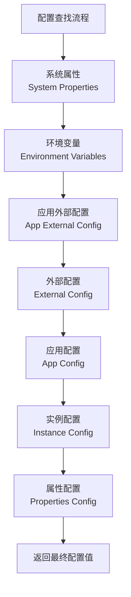

**配置来源说明**：
- **系统属性**：通过JVM参数设置的配置，如`-Ddubbo.application.name=myapp`
- **环境变量**：操作系统级别的环境变量，如`DUBBO_APPLICATION_NAME`
- **应用外部配置**：来自配置中心的应用特定配置
- **外部配置**：来自配置中心的全局配置
- **应用配置**：来自Spring Environment或application.properties的配置
- **实例配置**：通过API、XML或注解直接设置的配置
- **属性配置**：来自dubbo.properties文件的配置

这种分层的配置查找机制确保了配置的灵活性和可覆盖性，使得高优先级的配置可以覆盖低优先级的配置。

**配置优先级机制**
- [Environment.java](file://dubbo-common\src\main\java\org\apache\dubbo\common\config\Environment.java#L186-L201)

## 环境隔离与配置管理

Dubbo通过环境隔离机制实现了不同部署环境之间的配置分离。这种隔离不仅体现在配置值的差异上，还体现在配置加载和应用的整个生命周期中。

### 环境隔离实现

Dubbo支持多种环境类型，包括开发、测试、预发布和生产环境。每种环境都有其特定的配置策略和管理方式。

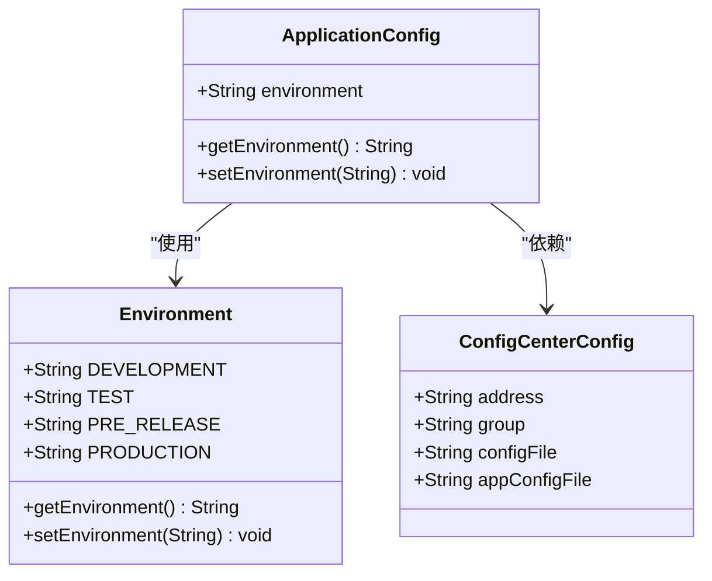

**环境隔离的关键特性**：
1. **环境标识**：通过`application.environment`属性明确标识当前运行环境
2. **配置中心隔离**：不同环境可以连接到不同的配置中心实例
3. **配置命名空间**：通过group和namespace实现配置的逻辑隔离
4. **动态更新**：支持运行时配置更新，无需重启应用

环境隔离的实现确保了不同环境之间的配置不会相互干扰，同时也为配置的版本控制和回滚提供了基础。

**环境隔离实现**
- [ApplicationConfig.java](file://dubbo-common\src\main\java\org\apache\dubbo\config\ApplicationConfig.java#L107-L135)
- [Environment.java](file://dubbo-common\src\main\java\org\apache\dubbo\common\config\Environment.java#L69-L76)

## 不同环境中的配置策略

针对不同的部署环境，Dubbo提供了相应的配置策略，以满足各环境的特定需求。

### 开发环境配置策略

开发环境的配置策略侧重于便利性和调试能力：

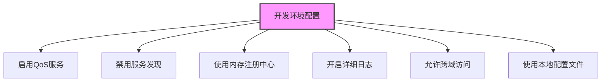

开发环境的配置特点：
- **快速启动**：减少依赖外部服务，加快应用启动速度
- **调试友好**：提供丰富的调试信息和管理接口
- **灵活性**：允许频繁修改配置，支持热更新
- **安全性**：通常禁用严格的安全检查，便于开发测试

### 测试环境配置策略

测试环境的配置策略平衡了真实性和可控性：

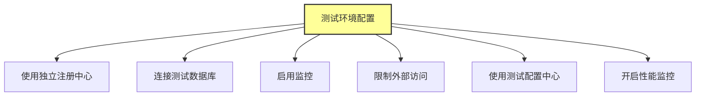

测试环境的配置特点：
- **环境一致性**：尽可能模拟生产环境的配置
- **数据隔离**：使用独立的测试数据，避免影响生产数据
- **监控完备**：全面的监控和日志记录，便于问题排查
- **访问控制**：限制外部访问，确保测试数据的安全性

### 预发布环境配置策略

预发布环境的配置策略旨在最大程度地模拟生产环境：

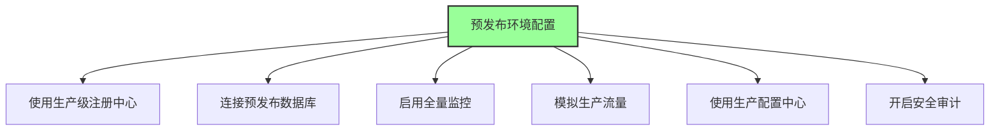

预发布环境的配置特点：
- **高度仿真**：配置尽可能接近生产环境
- **流量验证**：用于验证新版本在真实流量下的表现
- **风险控制**：作为生产发布的最后一道防线
- **回滚机制**：具备快速回滚能力，降低发布风险

### 生产环境配置策略

生产环境的配置策略强调稳定性、安全性和性能：

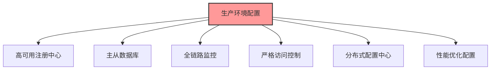

生产环境的配置特点：
- **高可用性**：所有组件都具备高可用设计
- **安全性**：严格的访问控制和安全策略
- **性能优化**：针对生产负载进行性能调优
- **监控告警**：完善的监控体系和告警机制
- **审计合规**：满足各种合规性要求

**不同环境配置策略**
- [application.yml](file://dubbo-demo\dubbo-demo-spring-boot\dubbo-demo-spring-boot-provider\src\main\resources\application.yml#L1-L44)

## 配置来源与优先级顺序

Dubbo的配置系统整合了多种配置来源，形成了一个完整的配置优先级体系。

### 配置来源层次结构

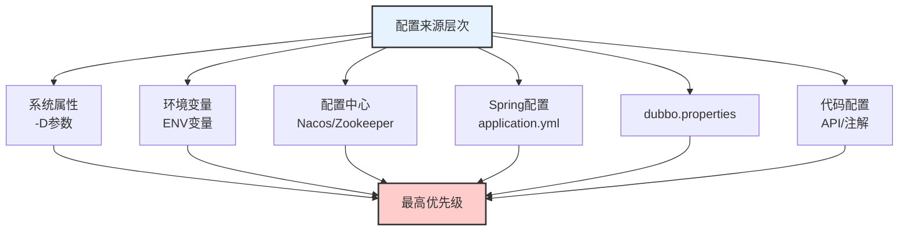

### 配置优先级处理流程

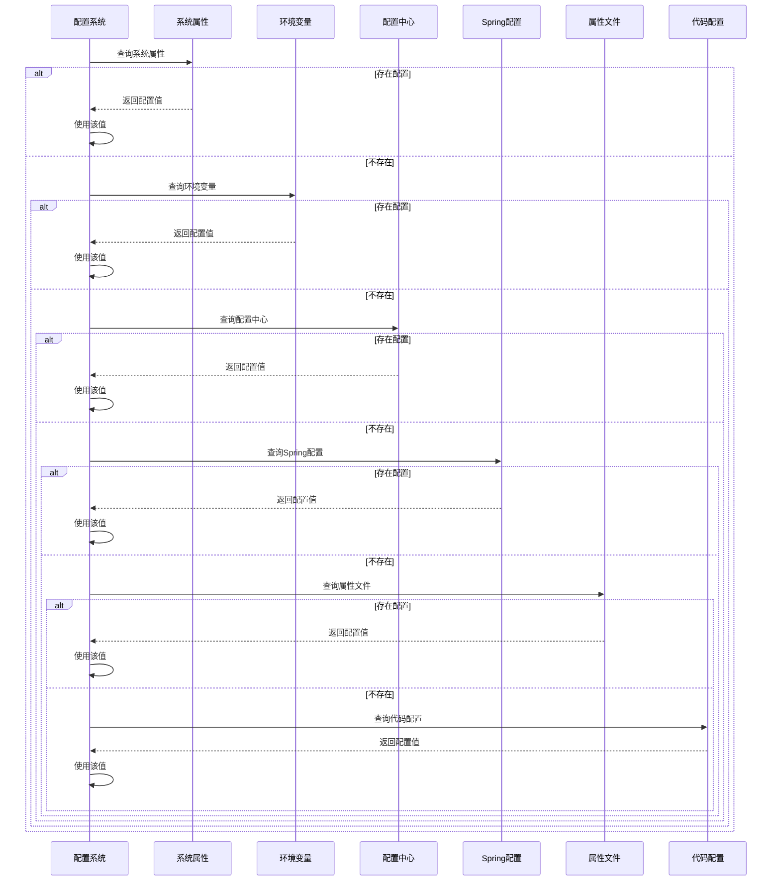

### 配置优先级实现细节

Dubbo通过`CompositeConfiguration`类实现了配置优先级的组合：

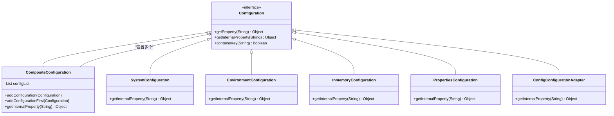

`CompositeConfiguration`按照添加顺序依次查询各个配置源，一旦找到非空值就立即返回，从而实现了优先级机制。

**配置来源与优先级顺序**
- [CompositeConfiguration.java](file://dubbo-common\src\main\java\org\apache\dubbo\common\config\CompositeConfiguration.java#L78-L95)
- [Environment.java](file://dubbo-common\src\main\java\org\apache\dubbo\common\config\Environment.java#L186-L201)

## 环境特定配置最佳实践

为了有效管理不同环境的配置，以下是一些经过验证的最佳实践。

### 使用环境变量管理配置

环境变量是管理环境特定配置的首选方式，因为它们易于设置且不会被意外提交到版本控制系统中。

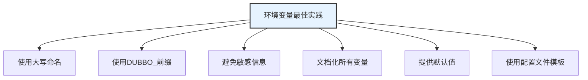

**环境变量命名规范**：
- 使用`DUBBO_`作为前缀，如`DUBBO_APPLICATION_NAME`
- 采用大写字母和下划线，如`DUBBO_REGISTRY_ADDRESS`
- 避免使用特殊字符，只使用字母、数字和下划线
- 保持命名一致性，便于理解和维护

### 配置文件管理策略

配置文件是管理复杂配置的有效方式，特别是在Spring Boot应用中。

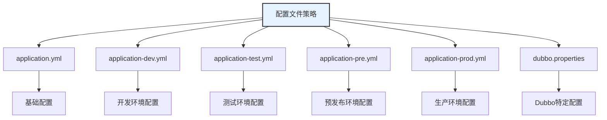

**配置文件管理要点**：
1. **分层配置**：使用Spring Profile实现配置文件的分层
2. **配置继承**：基础配置被各环境配置继承和覆盖
3. **敏感信息**：避免在配置文件中存储敏感信息
4. **版本控制**：将配置文件纳入版本控制，便于追踪变更
5. **文档化**：为每个配置项提供详细的文档说明

### 系统属性的应用

系统属性提供了运行时配置的能力，特别适合在容器化环境中使用。

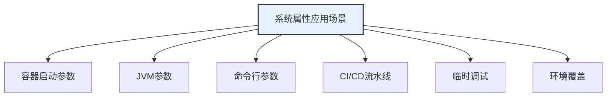

**系统属性使用建议**：
- 在Docker容器中使用`-e`参数设置环境变量
- 在Kubernetes中使用`env`字段定义环境变量
- 在CI/CD流水线中动态设置环境相关的配置
- 避免在代码中硬编码系统属性的键名
- 提供清晰的文档说明每个系统属性的作用

### 配置中心集成

配置中心是现代微服务架构中管理配置的核心组件。

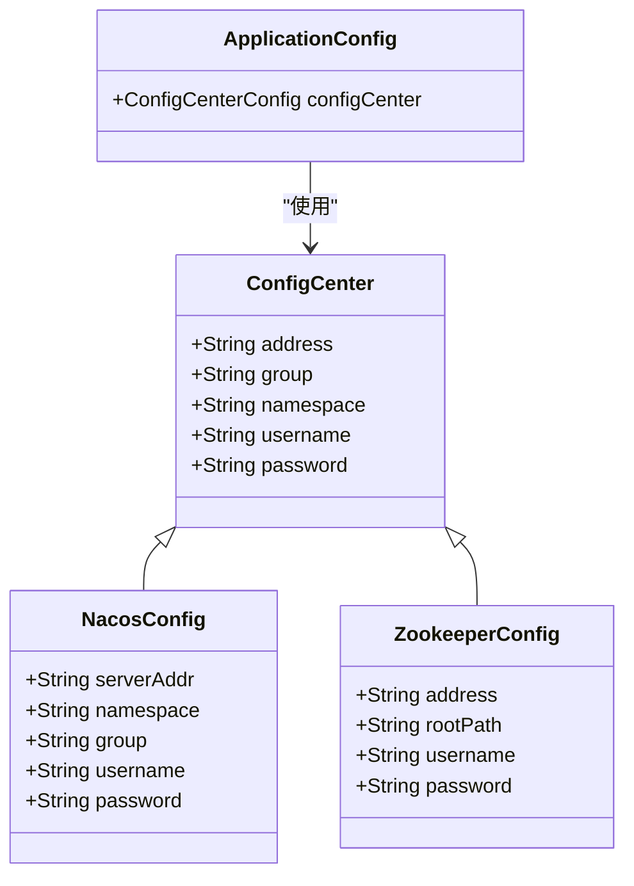

**配置中心最佳实践**：
- 为不同环境使用不同的命名空间或分组
- 实现配置的版本控制和审计功能
- 设置配置变更的审批流程
- 监控配置中心的健康状态
- 实现配置的备份和恢复机制

**环境特定配置最佳实践**
- [EnvironmentConfiguration.java](file://dubbo-common\src\main\java\org\apache\dubbo\common\config\EnvironmentConfiguration.java#L1-L30)
- [ConfigCenterBean.java](file://dubbo-config\dubbo-config-spring\src\main\java\org\apache\dubbo\config\spring\ConfigCenterBean.java#L64-L86)

## 实际应用示例

通过实际示例展示Dubbo配置优先级在不同场景下的应用。

### 多环境配置示例

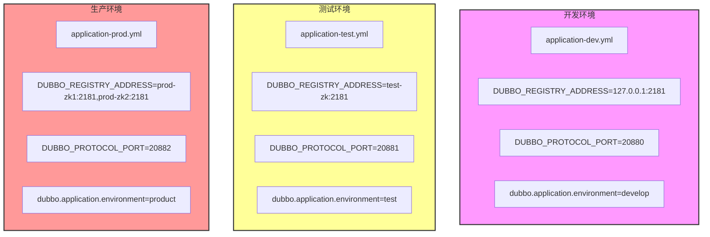

**配置优先级应用示例**：
1. **基础配置**：在`application.yml`中定义通用配置
2. **环境覆盖**：在环境特定配置文件中覆盖通用配置
3. **运行时覆盖**：通过环境变量或系统属性进一步覆盖
4. **动态更新**：通过配置中心实时更新配置

### 配置优先级冲突解决

当多个配置源提供相同配置项时，Dubbo按照预定义的优先级顺序解决冲突。

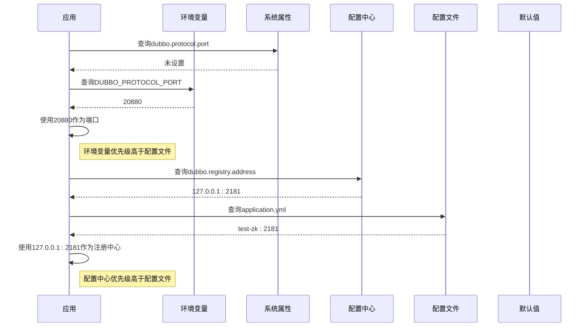

**配置优先级规则**：
1. 系统属性和环境变量具有最高优先级
2. 配置中心配置优先级高于本地配置文件
3. 运行时配置优先级高于启动时配置
4. 显式配置优先级高于隐式配置

### 动态配置更新示例

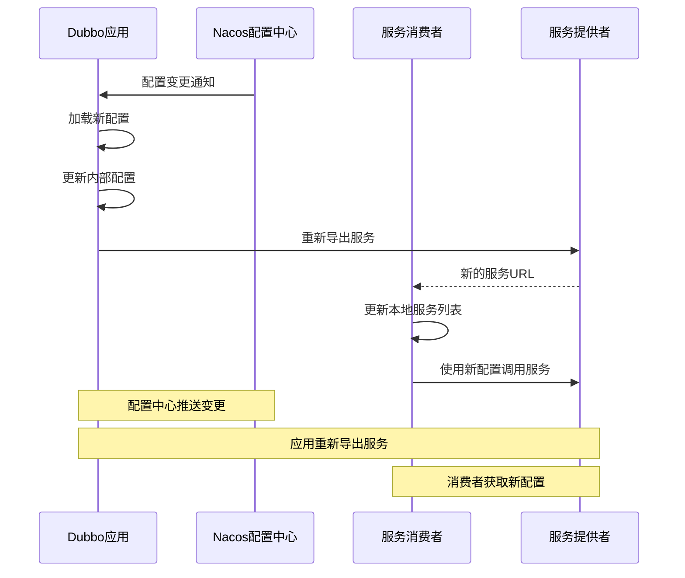

动态配置更新流程：
1. 配置中心检测到配置变更
2. 通知所有监听该配置的应用实例
3. 应用实例加载新配置并更新内部状态
4. 服务提供者重新导出服务，生成新的服务URL
5. 服务消费者通过注册中心获取更新后的服务列表
6. 后续调用使用新配置

**实际应用示例**
- [DefaultApplicationDeployer.java](file://dubbo-config\dubbo-config-api\src\main\java\org\apache\dubbo\config\deploy\DefaultApplicationDeployer.java#L413-L1186)
- [NacosDynamicConfiguration.java](file://dubbo-configcenter\dubbo-configcenter-nacos\src\main\java\org\apache\dubbo\configcenter\support\nacos\NacosDynamicConfiguration.java#L1-L398)

## 初学者配置示例

为初学者提供简单的环境配置示例，帮助快速上手。

### 基础配置文件示例

```yaml
# application.yml
dubbo:
  application:
    name: demo-service
    environment: develop
  protocol:
    name: dubbo
    port: 20880
  registry:
    address: N/A
  config-center:
    address: N/A
```

```yaml
# application-dev.yml
dubbo:
  registry:
    address: zookeeper://127.0.0.1:2181
  config-center:
    address: zookeeper://127.0.0.1:2181
```

```yaml
# application-prod.yml
dubbo:
  registry:
    address: zookeeper://prod-zk1:2181,prod-zk2:2181
  config-center:
    address: nacos://nacos-server:8848
  protocol:
    port: 20882
```

### 环境变量设置示例

```bash
# 开发环境
export DUBBO_APPLICATION_NAME=demo-service-dev
export DUBBO_REGISTRY_ADDRESS=zookeeper://127.0.0.1:2181
export DUBBO_PROTOCOL_PORT=20880

# 生产环境
export DUBBO_APPLICATION_NAME=demo-service-prod
export DUBBO_REGISTRY_ADDRESS=zookeeper://prod-zk1:2181,prod-zk2:2181
export DUBBO_PROTOCOL_PORT=20882
```

### 启动脚本示例

```bash
#!/bin/bash
# start-dev.sh
java -Dspring.profiles.active=dev \
     -Ddubbo.application.environment=develop \
     -jar demo-service.jar
```

```bash
#!/bin/bash
# start-prod.sh
java -Dspring.profiles.active=prod \
     -Ddubbo.application.environment=product \
     -Ddubbo.registry.address=zookeeper://prod-zk1:2181,prod-zk2:2181 \
     -jar demo-service.jar
```

### 简单的Java配置示例

```java
@Configuration
public class DubboConfig {
    
    @Value("${dubbo.application.name}")
    private String applicationName;
    
    @Value("${dubbo.protocol.port}")
    private int protocolPort;
    
    @Bean
    public ApplicationConfig applicationConfig() {
        ApplicationConfig config = new ApplicationConfig();
        config.setName(applicationName);
        return config;
    }
    
    @Bean
    public ProtocolConfig protocolConfig() {
        ProtocolConfig config = new ProtocolConfig();
        config.setName("dubbo");
        config.setPort(protocolPort);
        return config;
    }
    
    @Bean
    public ServiceConfig<DemoService> serviceConfig(DemoService demoService) {
        ServiceConfig<DemoService> service = new ServiceConfig<>();
        service.setInterface(DemoService.class);
        service.setRef(demoService);
        return service;
    }
}
```

**初学者配置示例**
- [application.yml](file://dubbo-demo\dubbo-demo-spring-boot\dubbo-demo-spring-boot-provider\src\main\resources\application.yml#L1-L44)

## 高级环境管理场景

针对复杂的企业级应用场景，提供高级的环境管理方案。

### 多配置中心级联

在大型分布式系统中，可能需要使用多个配置中心实现配置的分级管理。

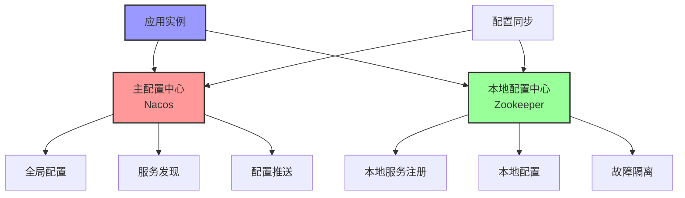

**多配置中心优势**：
- **高可用性**：主配置中心故障时，本地配置中心可维持基本服务
- **低延迟**：本地配置中心提供更快的配置访问
- **故障隔离**：局部故障不会影响全局配置系统
- **分级管理**：全局配置与本地配置分离，职责清晰

### 配置灰度发布

通过配置的灰度发布，实现新功能的渐进式上线。

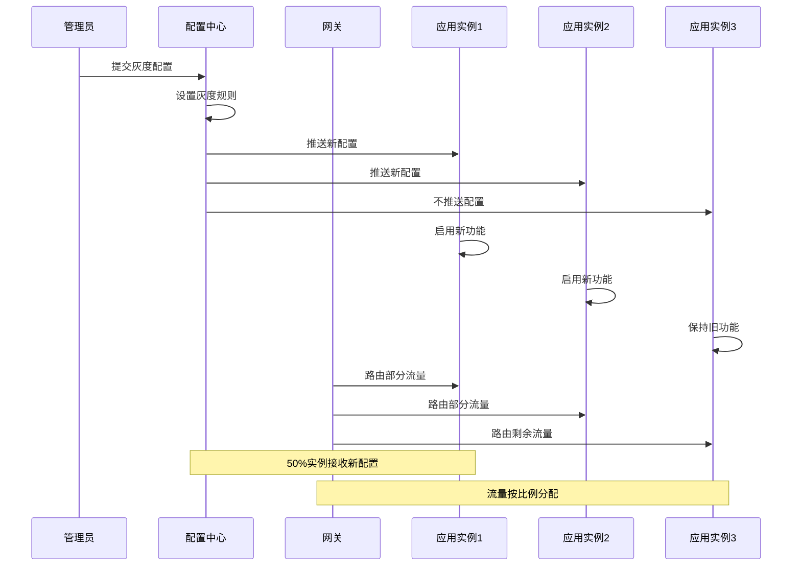

**灰度发布流程**：
1. 在配置中心定义灰度规则
2. 选择目标实例或用户群体
3. 逐步推送新配置
4. 监控新配置的效果
5. 根据反馈决定是否全量发布

### 配置版本控制

实现配置的版本控制，支持配置的回滚和审计。

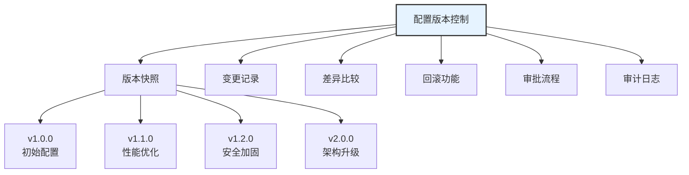

**版本控制要点**：
- 每次配置变更生成版本快照
- 记录变更人、时间和原因
- 支持版本间的差异比较
- 提供一键回滚功能
- 实现变更的审批流程
- 保留完整的审计日志

### 配置安全策略

在生产环境中，配置安全至关重要。

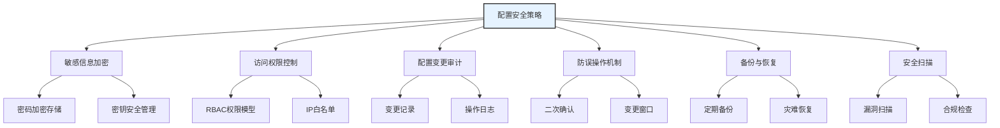

**安全策略实施**：
- 敏感配置项（如密码、密钥）必须加密存储
- 实现基于角色的访问控制（RBAC）
- 记录所有配置变更操作，便于审计
- 关键配置变更需要多重确认
- 定期备份配置数据，确保可恢复性
- 定期进行安全扫描和合规性检查

**高级环境管理场景**
- [DefaultApplicationDeployer.java](file://dubbo-config\dubbo-config-api\src\main\java\org\apache\dubbo\config\deploy\DefaultApplicationDeployer.java#L413-L1186)
- [NacosDynamicConfiguration.java](file://dubbo-configcenter\dubbo-configcenter-nacos\src\main\java\org\apache\dubbo\configcenter\support\nacos\NacosDynamicConfiguration.java#L1-L398)

## 结论

Dubbo的配置优先级机制为分布式系统的环境管理提供了强大而灵活的解决方案。通过深入理解配置优先级的工作原理和最佳实践，开发者可以有效地管理不同环境中的配置，实现环境隔离和配置管理的目标。

本文档详细介绍了Dubbo配置优先级在开发、测试、预发布和生产环境中的应用，涵盖了从基础概念到高级实践的各个方面。关键要点包括：

1. **配置优先级机制**：理解Dubbo配置查找的顺序和优先级规则
2. **环境隔离**：通过环境变量、配置文件和系统属性实现环境隔离
3. **配置管理**：利用配置中心实现集中化、动态化的配置管理
4. **最佳实践**：遵循环境特定配置的最佳实践，确保配置的安全性和可维护性
5. **实际应用**：通过实际示例学习如何在不同场景下应用配置优先级

对于初学者，建议从简单的配置文件和环境变量开始，逐步掌握Dubbo的配置管理能力。对于经验丰富的开发者，可以探索多配置中心级联、配置灰度发布和配置安全策略等高级场景，以满足复杂企业应用的需求。

通过合理应用这些配置管理策略，团队可以提高开发效率，降低运维成本，并确保系统在不同环境中的稳定运行。