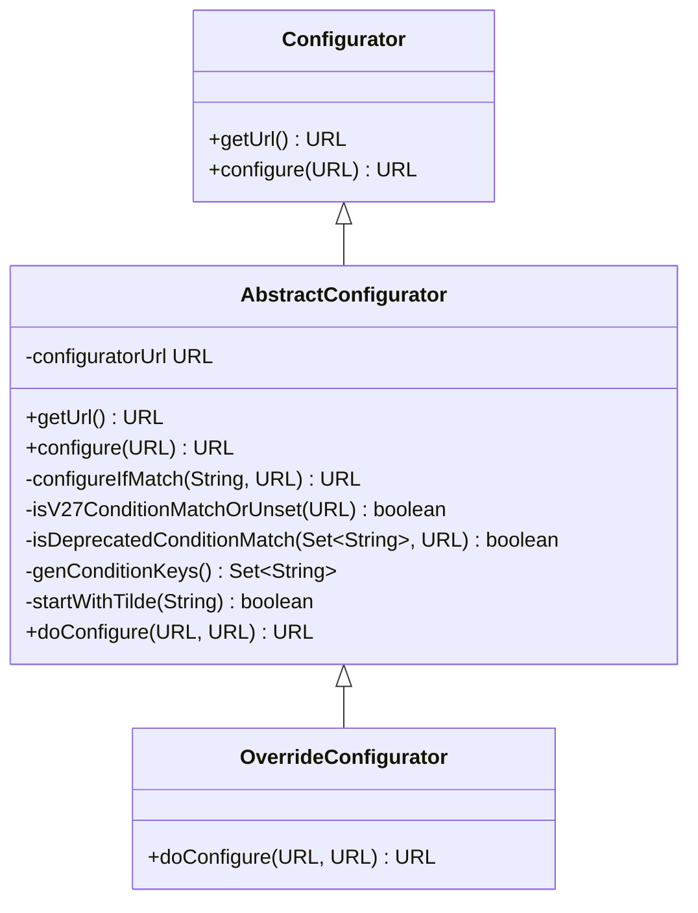
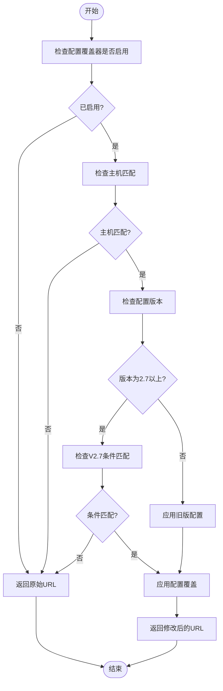
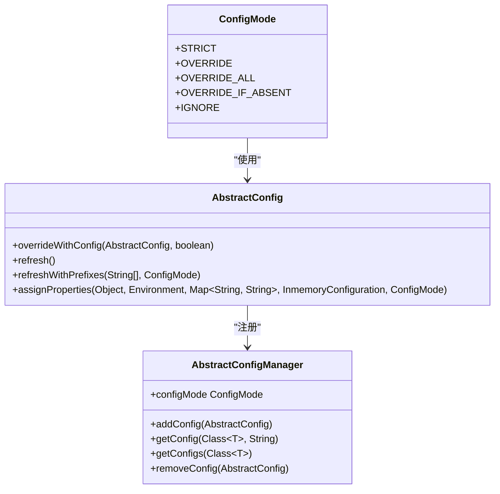
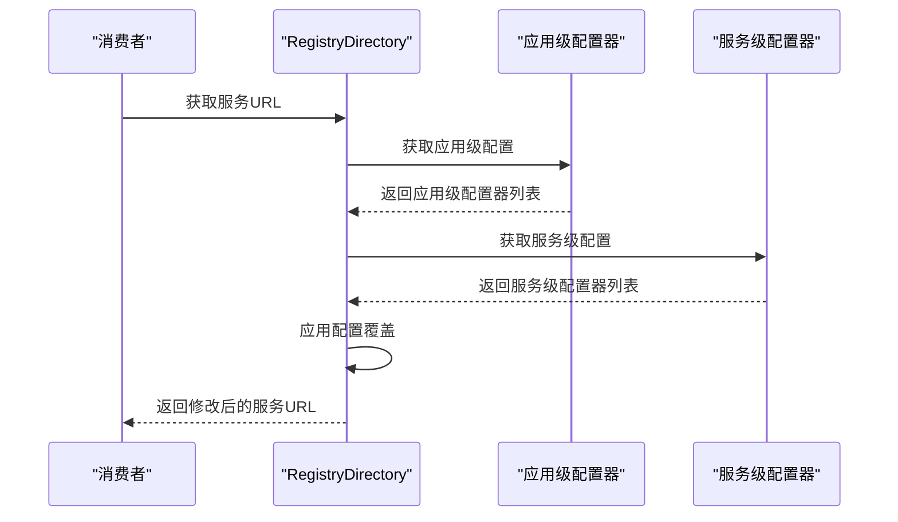

# 覆盖逻辑

<cite>
**本文档引用文件**   
- [Configurator.java](file://dubbo-cluster\src\main\java\org\apache\dubbo\rpc\cluster\Configurator.java)
- [AbstractConfigurator.java](file://dubbo-cluster\src\main\java\org\apache\dubbo\rpc\cluster\configurator\AbstractConfigurator.java)
- [OverrideConfigurator.java](file://dubbo-cluster\src\main\java\org\apache\dubbo\rpc\cluster\configurator\override\OverrideConfigurator.java)
- [ConfigMode.java](file://dubbo-common\src\main\java\org\apache\dubbo\config\context\ConfigMode.java)
- [AbstractConfig.java](file://dubbo-common\src\main\java\org\apache\dubbo\config\AbstractConfig.java)
- [AbstractConfigManager.java](file://dubbo-common\src\main\java\org\apache\dubbo\config\context\AbstractConfigManager.java)
- [RegistryProtocol.java](file://dubbo-registry\dubbo-registry-api\src\main\java\org\apache\dubbo\registry\integration\RegistryProtocol.java)
- [ServiceDiscoveryRegistryDirectory.java](file://dubbo-registry\dubbo-registry-api\src\main\java\org\apache\dubbo\registry\client\ServiceDiscoveryRegistryDirectory.java)
- [AbstractConfiguratorListener.java](file://dubbo-registry\dubbo-registry-api\src\main\java\org\apache\dubbo\registry\integration\AbstractConfiguratorListener.java)
- [ConfiguratorConfig.java](file://dubbo-cluster\src\main\java\org\apache\dubbo\rpc\cluster\configurator\parser\model\ConfiguratorConfig.java)
- [OverrideConfiguratorTest.java](file://dubbo-cluster\src\test\java\org\apache\dubbo\rpc\cluster\configurator\override\OverrideConfiguratorTest.java)
</cite>

## 目录
1. [引言](#引言)
2. [配置覆盖机制概述](#配置覆盖机制概述)
3. [配置覆盖的触发条件和执行过程](#配置覆盖的触发条件和执行过程)
4. [显式覆盖与隐式覆盖的区别](#显式覆盖与隐式覆盖的区别)
5. [不同作用域的配置覆盖规则](#不同作用域的配置覆盖规则)
6. [跨作用域配置覆盖的限制和注意事项](#跨作用域配置覆盖的限制和注意事项)
7. [配置覆盖的实际应用示例](#配置覆盖的实际应用示例)
8. [最佳实践](#最佳实践)
9. [结论](#结论)

## 引言
Dubbo配置系统的配置覆盖机制是其核心功能之一，允许在运行时动态修改服务配置。该机制通过配置覆盖器（Configurator）实现，支持在不同作用域（应用级、服务级、方法级）进行配置覆盖。本文档详细阐述了Dubbo配置覆盖的实现原理、触发条件、执行过程以及在不同场景下的应用。

## 配置覆盖机制概述
Dubbo的配置覆盖机制基于`Configurator`接口实现，该接口定义了配置覆盖的核心方法。配置覆盖器通过`configure`方法对服务URL进行修改，从而实现配置的动态覆盖。配置覆盖机制支持多种作用域，包括应用级、服务级和方法级，允许在不同粒度上进行配置管理。



**图源**
- [Configurator.java](file://dubbo-cluster\src\main\java\org\apache\dubbo\rpc\cluster\Configurator.java#L37-L121)
- [AbstractConfigurator.java](file://dubbo-cluster\src\main\java\org\apache\dubbo\rpc\cluster\configurator\AbstractConfigurator.java#L51-L244)
- [OverrideConfigurator.java](file://dubbo-cluster\src\main\java\org\apache\dubbo\rpc\cluster\configurator\override\OverrideConfigurator.java#L24-L37)

## 配置覆盖的触发条件和执行过程
配置覆盖的触发条件主要基于URL匹配和条件判断。当配置覆盖器的URL与目标服务URL匹配时，配置覆盖过程被触发。执行过程包括以下几个步骤：

1. **URL匹配**：检查配置覆盖器URL与目标服务URL是否匹配
2. **条件判断**：根据配置版本和条件匹配规则判断是否应用覆盖
3. **配置应用**：调用`doConfigure`方法应用配置覆盖



**图源**
- [AbstractConfigurator.java](file://dubbo-cluster\src\main\java\org\apache\dubbo\rpc\cluster\configurator\AbstractConfigurator.java#L69-L97)
- [AbstractConfigurator.java](file://dubbo-cluster\src\main\java\org\apache\dubbo\rpc\cluster\configurator\AbstractConfigurator.java#L125-L151)

## 显式覆盖与隐式覆盖的区别
显式覆盖和隐式覆盖是Dubbo配置覆盖的两种主要模式，它们在实现方式和应用场景上有所不同。

### 显式覆盖
显式覆盖是通过直接指定配置参数进行覆盖，通常在配置文件或代码中明确指定要覆盖的配置项。显式覆盖的特点是：
- 配置项明确指定
- 覆盖行为可预测
- 适用于已知配置变更场景

### 隐式覆盖
隐式覆盖是通过条件匹配和规则引擎进行覆盖，通常基于服务属性、应用名称等条件自动应用配置。隐式覆盖的特点是：
- 基于条件自动匹配
- 覆盖行为动态决定
- 适用于复杂条件场景



**图源**
- [ConfigMode.java](file://dubbo-common\src\main\java\org\apache\dubbo\config\context\ConfigMode.java#L45-L75)
- [AbstractConfig.java](file://dubbo-common\src\main\java\org\apache\dubbo\config\AbstractConfig.java#L634-L713)
- [AbstractConfigManager.java](file://dubbo-common\src\main\java\org\apache\dubbo\config\context\AbstractConfigManager.java#L570-L605)

## 不同作用域的配置覆盖规则
Dubbo支持在不同作用域进行配置覆盖，包括应用级、服务级和方法级。每个作用域有不同的处理规则和优先级。

### 应用级覆盖
应用级覆盖作用于整个应用，影响该应用下的所有服务。应用级覆盖的配置存储在`app-name.configurators`中。

### 服务级覆盖
服务级覆盖作用于特定服务，只影响指定的服务实例。服务级覆盖的配置存储在`service-name.configurators`中。

### 方法级覆盖
方法级覆盖作用于服务的特定方法，提供最细粒度的配置控制。方法级覆盖通常通过服务配置中的方法配置实现。



**图源**
- [ServiceDiscoveryRegistryDirectory.java](file://dubbo-registry\dubbo-registry-api\src\main\java\org\apache\dubbo\registry\client\ServiceDiscoveryRegistryDirectory.java#L270-L299)
- [AbstractConfiguratorListener.java](file://dubbo-registry\dubbo-registry-api\src\main\java\org\apache\dubbo\registry\integration\AbstractConfiguratorListener.java#L73-L83)

## 跨作用域配置覆盖的限制和注意事项
跨作用域配置覆盖存在一些限制和注意事项，需要在使用时特别关注。

### 优先级规则
当多个作用域的配置覆盖器同时存在时，遵循以下优先级规则：
1. 服务级覆盖优先于应用级覆盖
2. 显式覆盖优先于隐式覆盖
3. 高优先级配置覆盖器优先于低优先级配置覆盖器

### 安全性考虑
配置覆盖机制涉及敏感配置项的修改，需要考虑安全性：
- 限制敏感配置项的覆盖权限
- 验证配置覆盖器的来源可信性
- 记录配置覆盖操作日志

### 性能影响
频繁的配置覆盖操作可能影响系统性能：
- 配置覆盖器的匹配和应用需要计算资源
- 频繁的配置变更可能导致服务不稳定
- 需要合理设置配置覆盖的频率和范围

## 配置覆盖的实际应用示例
以下是一些配置覆盖的实际应用示例，展示其在不同场景下的使用。

### 简单覆盖示例
```java
// 创建应用级配置覆盖器
URL appConfigurator = URL.valueOf("override://0.0.0.0/com.foo.BarService?timeout=200");
OverrideConfigurator configurator = new OverrideConfigurator(appConfigurator);

// 应用配置覆盖
URL originalUrl = URL.valueOf("dubbo://172.24.160.179:21880/com.foo.BarService");
URL modifiedUrl = configurator.configure(originalUrl);
// 结果：timeout参数被覆盖为200
```

**代码源**
- [OverrideConfiguratorTest.java](file://dubbo-cluster\src\test\java\org\apache\dubbo\rpc\cluster\configurator\override\OverrideConfiguratorTest.java#L38-L54)

### 复杂覆盖场景
```java
// 创建基于条件的配置覆盖器（V3.0版本）
URL consumerConfiguratorUrl = URL.valueOf("override://0.0.0.0/com.foo.BarService");
Map<String, String> params = new HashMap<>();
params.put("side", "consumer");
params.put("configVersion", "v3.0");
params.put("application", "foo");
params.put("timeout", "10000");

// 设置条件匹配规则
ConditionMatch matcher = new ConditionMatch();
ParamMatch paramMatch = new ParamMatch();
paramMatch.setKey("match_key");
StringMatch stringMatch = new StringMatch();
stringMatch.setExact("value");
paramMatch.setValue(stringMatch);
matcher.setParam(Arrays.asList(paramMatch));
consumerConfiguratorUrl = consumerConfiguratorUrl.putAttribute(MATCH_CONDITION, matcher);
consumerConfiguratorUrl = consumerConfiguratorUrl.addParameters(params);

// 创建配置覆盖器并应用
OverrideConfigurator configurator = new OverrideConfigurator(consumerConfiguratorUrl);
URL resultUrl = configurator.configure(originalUrl);
```

**代码源**
- [OverrideConfiguratorTest.java](file://dubbo-cluster\src\test\java\org\apache\dubbo\rpc\cluster\configurator\override\OverrideConfiguratorTest.java#L128-L162)

## 最佳实践
在使用Dubbo配置覆盖机制时，应遵循以下最佳实践：

### 配置管理
- 使用统一的配置中心管理配置覆盖规则
- 为配置覆盖器设置合理的优先级
- 定期审查和清理过期的配置覆盖规则

### 监控和日志
- 记录配置覆盖操作的详细日志
- 监控配置覆盖对系统性能的影响
- 设置配置覆盖异常的告警机制

### 测试和验证
- 在测试环境中验证配置覆盖规则
- 使用灰度发布策略逐步应用配置覆盖
- 准备配置覆盖失败的回滚方案

## 结论
Dubbo的配置覆盖机制为微服务架构提供了强大的动态配置能力。通过理解配置覆盖的触发条件、执行过程和不同作用域的处理规则，开发者可以有效地利用这一机制来管理服务配置。同时，需要注意跨作用域配置覆盖的限制和安全性考虑，遵循最佳实践以确保系统的稳定性和可靠性。