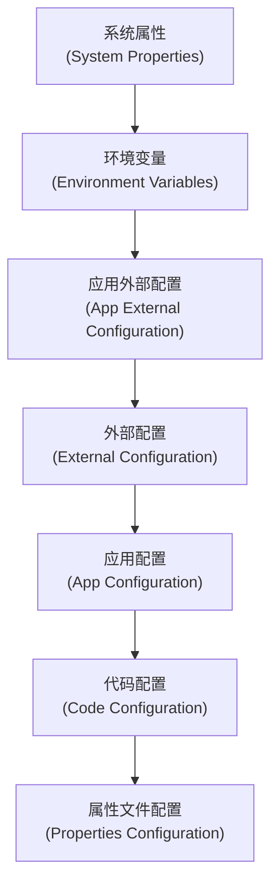
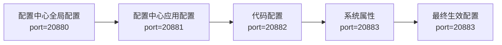

# 配置优先级

<cite>
**本文档中引用的文件**   
- [Environment.java](file://dubbo-common\src\main\java\org\apache\dubbo\common\config\Environment.java)
- [ConfigurationUtils.java](file://dubbo-common\src\main\java\org\apache\dubbo\common\config\ConfigurationUtils.java)
- [CompositeConfiguration.java](file://dubbo-common\src\main\java\org\apache\dubbo\common\config\CompositeConfiguration.java)
- [PropertiesConfiguration.java](file://dubbo-common\src\main\java\org\apache\dubbo\common\config\PropertiesConfiguration.java)
- [SystemConfiguration.java](file://dubbo-common\src\main\java\org\apache\dubbo\common\config\SystemConfiguration.java)
- [EnvironmentConfiguration.java](file://dubbo-common\src\main\java\org\apache\dubbo\common\config\EnvironmentConfiguration.java)
- [DefaultProviderURLMergeProcessor.java](file://dubbo-cluster\src\main\java\org\apache\dubbo\rpc\cluster\support\merger\DefaultProviderURLMergeProcessor.java)
- [AbstractConfigManager.java](file://dubbo-common\src\main\java\org\apache\dubbo\config\context\AbstractConfigManager.java)
</cite>

## 目录
1. [引言](#引言)
2. [配置来源与优先级顺序](#配置来源与优先级顺序)
3. [配置合并策略](#配置合并策略)
4. [配置覆盖逻辑](#配置覆盖逻辑)
5. [实际应用示例](#实际应用示例)
6. [不同部署环境中的应用](#不同部署环境中的应用)
7. [最佳实践](#最佳实践)

## 引言
Dubbo配置系统采用多层级的配置优先级机制，确保在不同场景下能够灵活地管理和应用配置。该机制通过有序地合并和覆盖来自不同来源的配置，最终确定生效的配置值。本文档详细阐述Dubbo配置系统的优先级处理机制，包括配置来源的优先级顺序、合并策略、覆盖逻辑以及在不同部署环境中的应用。

## 配置来源与优先级顺序
Dubbo配置系统支持多种配置来源，按照优先级从高到低的顺序如下：

1. **系统属性**（System Properties）：通过JVM参数（-D）设置的配置，具有最高优先级。
2. **环境变量**（Environment Variables）：操作系统级别的环境变量。
3. **应用外部配置**（App External Configuration）：配置中心中针对特定应用的配置。
4. **外部配置**（External Configuration）：配置中心中的全局或默认配置。
5. **应用配置**（App Configuration）：本地应用配置，如Spring Environment中的属性。
6. **代码配置**（Code Configuration）：通过API、XML或注解方式在代码中定义的配置。
7. **属性文件配置**（Properties Configuration）：类路径下的`dubbo.properties`文件。

这一优先级顺序在`Environment`类的`getPrefixedConfiguration`方法中明确定义：



**Diagram sources**
- [Environment.java](file://dubbo-common\src\main\java\org\apache\dubbo\common\config\Environment.java#L188-L198)

**Section sources**
- [Environment.java](file://dubbo-common\src\main\java\org\apache\dubbo\common\config\Environment.java#L186-L201)

## 配置合并策略
Dubbo使用`CompositeConfiguration`类来实现配置的合并。该类维护一个配置列表，并按照优先级顺序依次查找配置项。当查找某个配置项时，会从列表的第一个配置开始，逐个检查，直到找到非空值为止。

```java
@Override
public Object getInternalProperty(String key) {
    for (Configuration config : configList) {
        try {
            Object value = config.getProperty(key);
            if (!ConfigurationUtils.isEmptyValue(value)) {
                return value;
            }
        } catch (Exception e) {
            logger.error("Error when trying to get value for key " + key + " from " + config);
        }
    }
    return null;
}
```

这种策略确保了高优先级的配置能够覆盖低优先级的配置。例如，如果系统属性中定义了某个配置项，则无论其他配置源中是否有该配置项，都将使用系统属性中的值。

**Section sources**
- [CompositeConfiguration.java](file://dubbo-common\src\main\java\org\apache\dubbo\common\config\CompositeConfiguration.java#L78-L94)

## 配置覆盖逻辑
配置覆盖逻辑主要体现在`DefaultProviderURLMergeProcessor`类中，该类负责合并远程URL和本地参数。其核心逻辑是：

1. 首先将远程URL的所有参数复制到结果映射中。
2. 然后移除一些特定的参数（如线程池相关参数），这些参数通常由提供者决定。
3. 最后将本地参数合并到结果映射中，本地参数会覆盖远程参数。

```java
@Override
public URL mergeUrl(URL remoteUrl, Map<String, String> localParametersMap) {
    Map<String, String> map = new HashMap<>();
    Map<String, String> remoteMap = remoteUrl.getParameters();

    if (remoteMap != null && remoteMap.size() > 0) {
        map.putAll(remoteMap);

        // 移除由提供者决定的参数
        map.remove(THREAD_NAME_KEY);
        map.remove(THREADPOOL_KEY);
        // ... 其他参数
    }

    if (localParametersMap != null && localParametersMap.size() > 0) {
        map.putAll(localParametersMap);
    }

    return new URL(remoteUrl.getProtocol(), remoteUrl.getUsername(), remoteUrl.getPassword(),
                   remoteUrl.getHost(), remoteUrl.getPort(), remoteUrl.getPath(), map);
}
```

这种覆盖逻辑确保了本地配置能够优先于远程配置生效，同时保留了远程配置中的必要信息。

**Section sources**
- [DefaultProviderURLMergeProcessor.java](file://dubbo-cluster\src\main\java\org\apache\dubbo\rpc\cluster\support\merger\DefaultProviderURLMergeProcessor.java#L49-L80)

## 实际应用示例
### 简单优先级示例
假设我们有以下配置：

- 系统属性：`dubbo.application.name=systemApp`
- 环境变量：`DUBBO_APPLICATION_NAME=envApp`
- `dubbo.properties`文件：`dubbo.application.name=propsApp`

根据优先级顺序，最终生效的应用名称将是`systemApp`，因为系统属性的优先级最高。

### 复杂优先级场景
考虑一个更复杂的场景，其中配置来自多个来源：

1. 配置中心全局配置：`dubbo.protocol.port=20880`
2. 配置中心应用配置：`dubbo.protocol.port=20881`
3. 代码配置：`ProtocolConfig.setPort(20882)`
4. 系统属性：`-Ddubbo.protocol.port=20883`

在这种情况下，最终的协议端口将是`20883`，因为系统属性的优先级最高。



**Diagram sources**
- [Environment.java](file://dubbo-common\src\main\java\org\apache\dubbo\common\config\Environment.java#L188-L198)

## 不同部署环境中的应用
在不同的部署环境中，配置优先级机制的应用有所不同：

### 开发环境
在开发环境中，通常使用系统属性或环境变量来快速覆盖配置，便于调试和测试。例如：
```bash
java -Ddubbo.protocol.port=20888 -jar myapp.jar
```

### 测试环境
在测试环境中，可以使用配置中心来管理配置，通过应用配置来覆盖全局配置，实现不同测试场景的配置管理。

### 生产环境
在生产环境中，建议使用配置中心来集中管理配置，通过严格的权限控制和版本管理来确保配置的安全性和稳定性。系统属性和环境变量应谨慎使用，避免意外覆盖重要配置。

## 最佳实践
1. **合理使用配置来源**：根据环境选择合适的配置来源，避免过度依赖高优先级的配置。
2. **配置中心优先**：在生产环境中优先使用配置中心来管理配置，便于集中管理和动态更新。
3. **避免硬编码**：尽量避免在代码中硬编码配置，使用配置文件或配置中心来管理。
4. **配置验证**：在应用启动时验证关键配置的正确性，避免因配置错误导致服务异常。
5. **文档化配置**：为所有配置项提供详细的文档说明，包括默认值、取值范围和优先级信息。

**Section sources**
- [AbstractConfigManager.java](file://dubbo-common\src\main\java\org\apache\dubbo\config\context\AbstractConfigManager.java#L221-L246)