# API配置

<cite>
**本文档引用的文件**   
- [ApplicationConfig.java](file://dubbo-common/src/main/java/org/apache/dubbo/config/ApplicationConfig.java)
- [ProtocolConfig.java](file://dubbo-common/src/main/java/org/apache/dubbo/config/ProtocolConfig.java)
- [ServiceConfig.java](file://dubbo-config/dubbo-config-api/src/main/java/org/apache/dubbo/config/ServiceConfig.java)
- [ReferenceConfig.java](file://dubbo-config/dubbo-config-api/src/main/java/org/apache/dubbo/config/ReferenceConfig.java)
- [AbstractConfig.java](file://dubbo-common/src/main/java/org/apache/dubbo/config/AbstractConfig.java)
- [ConsumerConfig.java](file://dubbo-common/src/main/java/org/apache/dubbo/config/ConsumerConfig.java)
- [RegistryConfig.java](file://dubbo-common/src/main/java/org/apache/dubbo/config/RegistryConfig.java)
- [MonitorConfig.java](file://dubbo-common/src/main/java/org/apache/dubbo/config/MonitorConfig.java)
</cite>

## 目录
1. [API配置概述](#api配置概述)
2. [核心配置类详解](#核心配置类详解)
3. [API配置执行流程](#api配置执行流程)
4. [编程式配置示例](#编程式配置示例)
5. [高级配置用法](#高级配置用法)
6. [配置优先级与动态配置](#配置优先级与动态配置)
7. [配置合并与生命周期管理](#配置合并与生命周期管理)

## API配置概述

API配置是Dubbo框架中一种编程式的配置方式，允许开发者通过Java代码直接创建和配置服务。与XML或注解配置相比，API配置提供了更高的灵活性和控制力，特别适用于需要动态配置或复杂配置逻辑的场景。

API配置的核心是通过创建配置类的实例并设置其属性来完成服务的配置。这些配置类包括ApplicationConfig、ProtocolConfig、ServiceConfig等，它们共同构成了Dubbo服务的完整配置体系。API配置遵循构建者模式，支持链式调用，使得配置代码更加简洁和易读。

**Section sources**
- [ApplicationConfig.java](file://dubbo-common/src/main/java/org/apache/dubbo/config/ApplicationConfig.java#L82-L83)
- [ProtocolConfig.java](file://dubbo-common/src/main/java/org/apache/dubbo/config/ProtocolConfig.java#L40-L41)
- [ServiceConfig.java](file://dubbo-config/dubbo-config-api/src/main/java/org/apache/dubbo/config/ServiceConfig.java#L126-L127)

## 核心配置类详解

### ApplicationConfig

ApplicationConfig用于配置Dubbo应用的基本信息，是所有配置的起点。它定义了应用的名称、版本、负责人等元数据，以及全局的QoS（服务质量）设置。

```mermaid
classDiagram
class ApplicationConfig {
-String name
-String version
-String owner
-String organization
-String environment
-String compiler
-String logger
-List<RegistryConfig> registries
-String registryIds
-MonitorConfig monitor
-String dumpDirectory
-Boolean dumpEnable
-Boolean qosEnable
-Boolean qosCheck
-String qosHost
-Integer qosPort
-Boolean qosAcceptForeignIp
-String qosAcceptForeignIpWhitelist
-String qosAnonymousAccessPermissionLevel
-String qosAnonymousAllowCommands
-Map<String, String> parameters
-String shutwait
-String hostname
-String metadataType
-Boolean registerConsumer
-String repository
-Boolean enableFileCache
-String protocol
-String metadataServiceProtocol
-Integer metadataServicePort
-Integer mappingRetryInterval
-String livenessProbe
-String readinessProbe
-String startupProbe
-String registerMode
-Boolean enableEmptyProtection
-String serializeCheckStatus
-Boolean autoTrustSerializeClass
-Integer trustSerializeClassLevel
-Boolean checkSerializable
-String executorManagementMode
-Boolean onlyUseMetadataV2
+ApplicationConfig()
+ApplicationConfig(ApplicationModel)
+ApplicationConfig(String)
+ApplicationConfig(ApplicationModel, String)
+String getName()
+void setName(String)
+String getVersion()
+void setVersion(String)
+String getOwner()
+void setOwner(String)
+String getOrganization()
+void setOrganization(String)
+String getArchitecture()
+void setArchitecture(String)
+String getEnvironment()
+void setEnvironment(String)
+RegistryConfig getRegistry()
+void setRegistry(RegistryConfig)
+List<RegistryConfig> getRegistries()
+void setRegistries(List<? extends RegistryConfig>)
+String getRegistryIds()
+void setRegistryIds(String)
+MonitorConfig getMonitor()
+void setMonitor(String)
+void setMonitor(MonitorConfig)
+String getCompiler()
+void setCompiler(String)
+String getLogger()
+void setLogger(String)
+String getDumpDirectory()
+void setDumpDirectory(String)
+Boolean getDumpEnable()
+void setDumpEnable(Boolean)
+Boolean getQosEnable()
+void setQosEnable(Boolean)
+Boolean getQosCheck()
+void setQosCheck(Boolean)
+String getQosHost()
+void setQosHost(String)
+Integer getQosPort()
+void setQosPort(Integer)
+Boolean getQosAcceptForeignIp()
+void setQosAcceptForeignIp(Boolean)
+String getQosAcceptForeignIpWhitelist()
+void setQosAcceptForeignIpWhitelist(String)
+String getQosAnonymousAccessPermissionLevel()
+void setQosAnonymousAccessPermissionLevel(String)
+String getQosAnonymousAllowCommands()
+void setQosAnonymousAllowCommands(String)
+Boolean getQosEnableCompatible()
+void setQosEnableCompatible(Boolean)
+String getQosHostCompatible()
+void setQosHostCompatible(String)
+Integer getQosPortCompatible()
+void setQosPortCompatible(Integer)
+Boolean getQosAcceptForeignIpCompatible()
+void setQosAcceptForeignIpCompatible(Boolean)
+String getQosAcceptForeignIpWhitelistCompatible()
+void setQosAcceptForeignIpWhitelistCompatible(String)
+String getQosAnonymousAccessPermissionLevelCompatible()
+void setQosAnonymousAccessPermissionLevelCompatible(String)
+Map<String, String> getParameters()
+void setParameters(Map<String, String>)
+String getShutwait()
+void setShutwait(String)
+String getHostname()
+String getMetadataType()
+void setMetadataType(String)
+Boolean getRegisterConsumer()
+void setRegisterConsumer(Boolean)
+String getRepository()
+void setRepository(String)
+Boolean getEnableFileCache()
+void setEnableFileCache(Boolean)
+String getRegisterMode()
+void setRegisterMode(String)
+Boolean getEnableEmptyProtection()
+void setEnableEmptyProtection(Boolean)
+String getProtocol()
+void setProtocol(String)
+Integer getMetadataServicePort()
+void setMetadataServicePort(Integer)
+Integer getMappingRetryInterval()
+void setMappingRetryInterval(Integer)
+String getMetadataServiceProtocol()
+void setMetadataServiceProtocol(String)
+String getLivenessProbe()
+void setLivenessProbe(String)
+String getReadinessProbe()
+void setReadinessProbe(String)
+String getStartupProbe()
+void setStartupProbe(String)
+String getSerializeCheckStatus()
+void setSerializeCheckStatus(String)
+Boolean getAutoTrustSerializeClass()
+void setAutoTrustSerializeClass(Boolean)
+Integer getTrustSerializeClassLevel()
+void setTrustSerializeClassLevel(Integer)
+Boolean getCheckSerializable()
+void setCheckSerializable(Boolean)
+String getExecutorManagementMode()
+void setExecutorManagementMode(String)
+Boolean getOnlyUseMetadataV2()
+void setOnlyUseMetadataV2(Boolean)
+boolean isValid()
+void checkDefault()
}
```

**Diagram sources**
- [ApplicationConfig.java](file://dubbo-common/src/main/java/org/apache/dubbo/config/ApplicationConfig.java#L82-L819)

### ProtocolConfig

ProtocolConfig用于配置Dubbo服务的协议信息，包括协议名称、端口、线程池等。一个服务可以支持多个协议，每个协议都有独立的配置。

```mermaid
classDiagram
class ProtocolConfig {
-String name
-String host
-Integer port
-String contextpath
-String threadpool
-Integer corethreads
-Integer threads
-Integer iothreads
-Integer alive
-Integer queues
-String threadPoolExhaustedListeners
-Integer accepts
-String codec
-String serialization
-String preferSerialization
-String charset
-Integer payload
-Integer buffer
-Integer heartbeat
-String accesslog
-String transporter
-String exchanger
-String dispatcher
-String networker
-String server
-String client
-String telnet
-String prompt
-String status
-Boolean register
-Boolean keepAlive
-String optimizer
-String extension
-Map<String, String> parameters
-Boolean sslEnabled
-String extProtocol
-String preferredProtocol
-String jsonCheckLevel
-Boolean noInterfaceSupport
-TripleConfig triple
+ProtocolConfig()
+ProtocolConfig(ApplicationModel)
+ProtocolConfig(String)
+ProtocolConfig(ApplicationModel, String)
+ProtocolConfig(String, int)
+ProtocolConfig(ApplicationModel, String, int)
+String getName()
+void setName(String)
+String getHost()
+void setHost(String)
+Integer getPort()
+void setPort(Integer)
+String getPath()
+void setPath(String)
+String getContextpath()
+void setContextpath(String)
+String getThreadpool()
+void setThreadpool(String)
+String getJsonCheckLevel()
+void setJsonCheckLevel(String)
+String getThreadPoolExhaustedListeners()
+void setThreadPoolExhaustedListeners(String)
+Integer getCorethreads()
+void setCorethreads(Integer)
+Integer getThreads()
+void setThreads(Integer)
+Integer getIothreads()
+void setIothreads(Integer)
+Integer getAlive()
+void setAlive(Integer)
+Integer getQueues()
+void setQueues(Integer)
+Integer getAccepts()
+void setAccepts(Integer)
+String getCodec()
+void setCodec(String)
+String getSerialization()
+void setSerialization(String)
+String getPreferSerialization()
+void setPreferSerialization(String)
+String getCharset()
+void setCharset(String)
+Integer getPayload()
+void setPayload(Integer)
+Integer getBuffer()
+void setBuffer(Integer)
+Integer getHeartbeat()
+void setHeartbeat(Integer)
+String getServer()
+void setServer(String)
+String getClient()
+void setClient(String)
+String getAccesslog()
+void setAccesslog(String)
+String getTelnet()
+void setTelnet(String)
+String getPrompt()
+void setPrompt(String)
+String getStatus()
+void setStatus(String)
+Boolean isRegister()
+void setRegister(Boolean)
+String getTransporter()
+void setTransporter(String)
+String getExchanger()
+void setExchanger(String)
+String getDispather()
+void setDispather(String)
+String getDispatcher()
+void setDispatcher(String)
+String getNetworker()
+void setNetworker(String)
+Map<String, String> getParameters()
+void setParameters(Map<String, String>)
+Boolean getSslEnabled()
+void setSslEnabled(Boolean)
+Boolean getKeepAlive()
+void setKeepAlive(Boolean)
+String getOptimizer()
+void setOptimizer(String)
+String getExtension()
+void setExtension(String)
+boolean isValid()
+String getExtProtocol()
+void setExtProtocol(String)
+String getPreferredProtocol()
+void setPreferredProtocol(String)
+Boolean isNoInterfaceSupport()
+void setNoInterfaceSupport(Boolean)
+TripleConfig getTriple()
+TripleConfig getTripleOrDefault()
+void setTriple(TripleConfig)
+void mergeProtocol(ProtocolConfig)
+void checkDefault()
}
```

**Diagram sources**
- [ProtocolConfig.java](file://dubbo-common/src/main/java/org/apache/dubbo/config/ProtocolConfig.java#L40-L690)

### ServiceConfig

ServiceConfig用于配置Dubbo服务提供者，是服务导出的核心配置类。它包含了服务接口、实现类、协议、注册中心等关键信息。

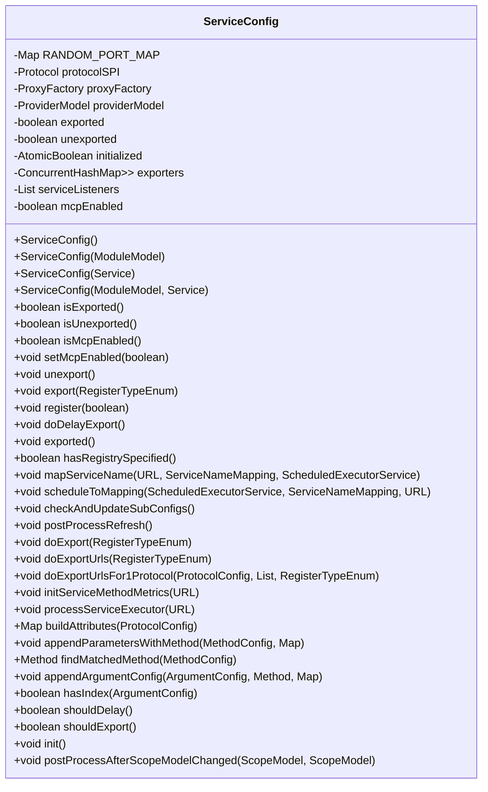

**Diagram sources**
- [ServiceConfig.java](file://dubbo-config/dubbo-config-api/src/main/java/org/apache/dubbo/config/ServiceConfig.java#L126-L800)

### ReferenceConfig

ReferenceConfig用于配置Dubbo服务消费者，是服务引用的核心配置类。它包含了服务接口、协议、注册中心等关键信息。

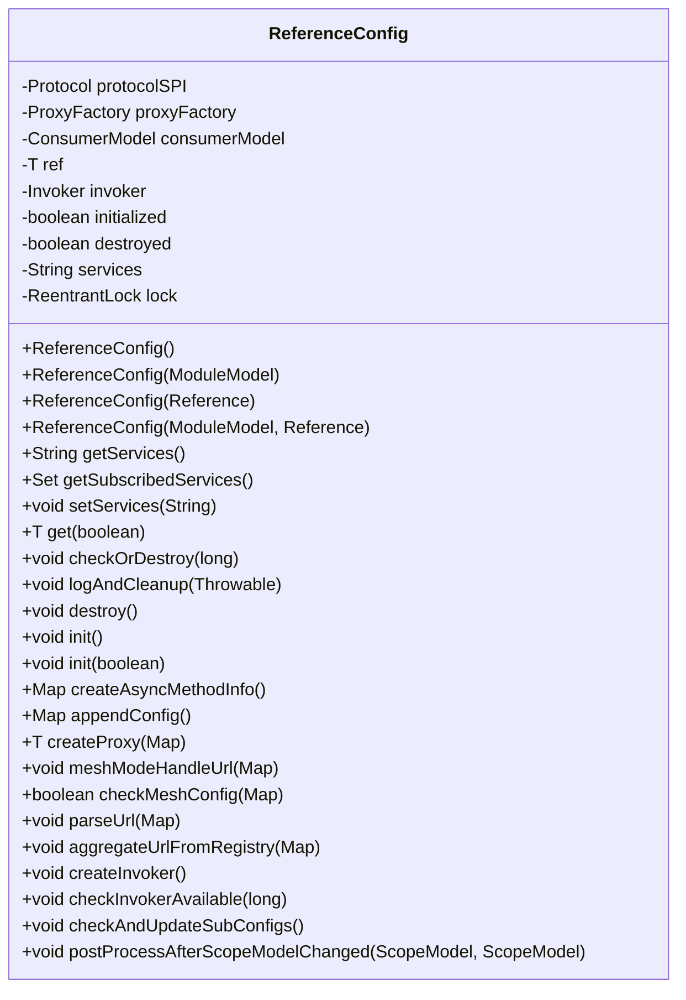

**Diagram sources**
- [ReferenceConfig.java](file://dubbo-config/dubbo-config-api/src/main/java/org/apache/dubbo/config/ReferenceConfig.java#L111-L800)

### ConsumerConfig

ConsumerConfig用于配置Dubbo服务消费者的默认配置，包括线程池、共享连接数等。

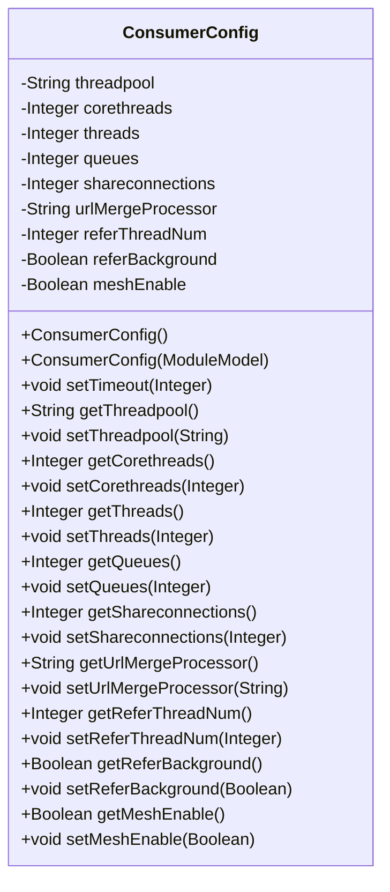

**Diagram sources**
- [ConsumerConfig.java](file://dubbo-common/src/main/java/org/apache/dubbo/config/ConsumerConfig.java#L35-L189)

### RegistryConfig

RegistryConfig用于配置注册中心，包括注册中心地址、协议等。

```mermaid
classDiagram
class RegistryConfig {
-String address
-String protocol
-Integer port
-String username
-String password
-String transport
-String cluster
-String group
-String version
-String default
-String file
-String wait
-String check
-String register
-String subscribe
-String dynamic
-String simplified
-String extraKeys
-String parameters
-String id
-String prefix
-String beanName
-String configCenter
-String registryType
-String preferredRegistryId
-String preferredRegistryProtocol
-String preferredRegistryAddress
-String preferredRegistryPort
-String preferredRegistryUsername
-String preferredRegistryPassword
-String preferredRegistryTransport
-String preferredRegistryCluster
-String preferredRegistryGroup
-String preferredRegistryVersion
-String preferredRegistryDefault
-String preferredRegistryFile
-String preferredRegistryWait
-String preferredRegistryCheck
-String preferredRegistryRegister
-String preferredRegistrySubscribe
-String preferredRegistryDynamic
-String preferredRegistrySimplified
-String preferredRegistryExtraKeys
-String preferredRegistryParameters
-String preferredRegistryId
-String preferredRegistryPrefix
-String preferredRegistryBeanName
-String preferredRegistryConfigCenter
-String preferredRegistryRegistryType
+RegistryConfig()
+RegistryConfig(ApplicationModel)
+RegistryConfig(String)
+RegistryConfig(ApplicationModel, String)
+String getAddress()
+void setAddress(String)
+String getProtocol()
+void setProtocol(String)
+Integer getPort()
+void setPort(Integer)
+String getUsername()
+void setUsername(String)
+String getPassword()
+void setPassword(String)
+String getTransport()
+void setTransport(String)
+String getCluster()
+void setCluster(String)
+String getGroup()
+void setGroup(String)
+String getVersion()
+void setVersion(String)
+String getDefault()
+void setDefault(String)
+String getFile()
+void setFile(String)
+String getWait()
+void setWait(String)
+String getCheck()
+void setCheck(String)
+String getRegister()
+void setRegister(String)
+String getSubscribe()
+void setSubscribe(String)
+String getDynamic()
+void setDynamic(String)
+String getSimplified()
+void setSimplified(String)
+String getExtraKeys()
+void setExtraKeys(String)
+String getParameters()
+void setParameters(String)
+String getId()
+void setId(String)
+String getPrefix()
+void setPrefix(String)
+String getBeanName()
+void setBeanName(String)
+String getConfigCenter()
+void setConfigCenter(String)
+String getRegistryType()
+void setRegistryType(String)
+String getPreferredRegistryId()
+void setPreferredRegistryId(String)
+String getPreferredRegistryProtocol()
+void setPreferredRegistryProtocol(String)
+String getPreferredRegistryAddress()
+void setPreferredRegistryAddress(String)
+String getPreferredRegistryPort()
+void setPreferredRegistryPort(String)
+String getPreferredRegistryUsername()
+void setPreferredRegistryUsername(String)
+String getPreferredRegistryPassword()
+void setPreferredRegistryPassword(String)
+String getPreferredRegistryTransport()
+void setPreferredRegistryTransport(String)
+String getPreferredRegistryCluster()
+void setPreferredRegistryCluster(String)
+String getPreferredRegistryGroup()
+void setPreferredRegistryGroup(String)
+String getPreferredRegistryVersion()
+void setPreferredRegistryVersion(String)
+String getPreferredRegistryDefault()
+void setPreferredRegistryDefault(String)
+String getPreferredRegistryFile()
+void setPreferredRegistryFile(String)
+String getPreferredRegistryWait()
+void setPreferredRegistryWait(String)
+String getPreferredRegistryCheck()
+void setPreferredRegistryCheck(String)
+String getPreferredRegistryRegister()
+void setPreferredRegistryRegister(String)
+String getPreferredRegistrySubscribe()
+void setPreferredRegistrySubscribe(String)
+String getPreferredRegistryDynamic()
+void setPreferredRegistryDynamic(String)
+String getPreferredRegistrySimplified()
+void setPreferredRegistrySimplified(String)
+String getPreferredRegistryExtraKeys()
+void setPreferredRegistryExtraKeys(String)
+String getPreferredRegistryParameters()
+void setPreferredRegistryParameters(String)
+String getPreferredRegistryId()
+void setPreferredRegistryId(String)
+String getPreferredRegistryPrefix()
+void setPreferredRegistryPrefix(String)
+String getPreferredRegistryBeanName()
+void setPreferredRegistryBeanName(String)
+String getPreferredRegistryConfigCenter()
+void setPreferredRegistryConfigCenter(String)
+String getPreferredRegistryRegistryType()
+void setPreferredRegistryRegistryType(String)
+boolean isValid()
+void checkDefault()
}
```

**Diagram sources**
- [RegistryConfig.java](file://dubbo-common/src/main/java/org/apache/dubbo/config/RegistryConfig.java)

### MonitorConfig

MonitorConfig用于配置监控中心，包括监控中心地址、协议等。

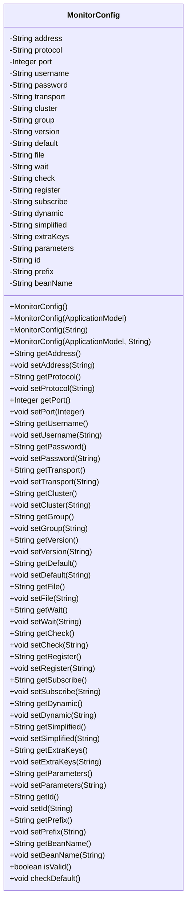

**Diagram sources**
- [MonitorConfig.java](file://dubbo-common/src/main/java/org/apache/dubbo/config/MonitorConfig.java)

## API配置执行流程

API配置的执行流程主要分为配置创建、配置刷新、服务导出和引用四个阶段。整个流程由Dubbo的配置管理器统一协调，确保配置的正确性和一致性。

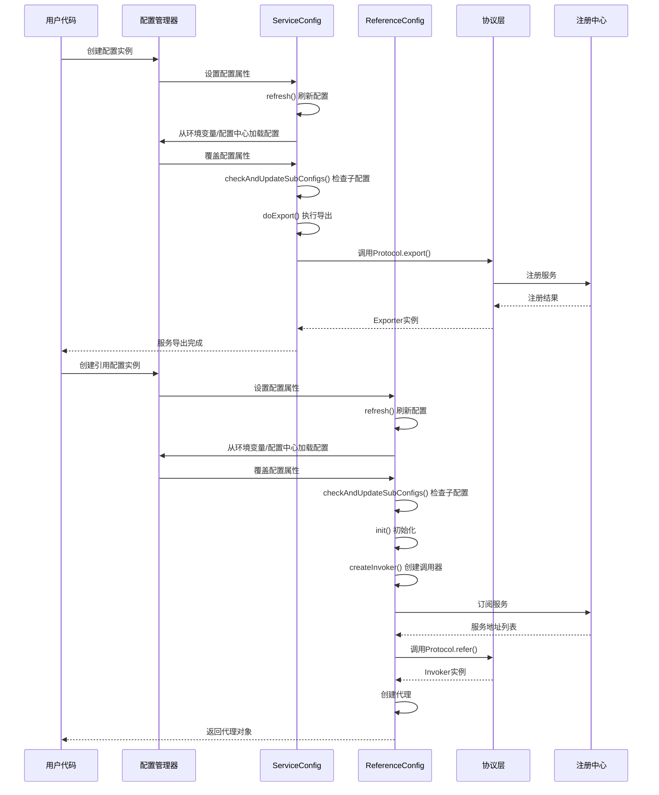

**Diagram sources**
- [ServiceConfig.java](file://dubbo-config/dubbo-config-api/src/main/java/org/apache/dubbo/config/ServiceConfig.java#L324-L364)
- [ReferenceConfig.java](file://dubbo-config/dubbo-config-api/src/main/java/org/apache/dubbo/config/ReferenceConfig.java#L229-L247)

## 编程式配置示例

### 基础API配置示例

以下是一个基础的API配置示例，展示了如何通过Java代码配置一个Dubbo服务提供者和消费者。

```java
// 创建应用配置
ApplicationConfig application = new ApplicationConfig();
application.setName("demo-provider");

// 创建注册中心配置
RegistryConfig registry = new RegistryConfig();
registry.setAddress("zookeeper://127.0.0.1:2181");

// 创建协议配置
ProtocolConfig protocol = new ProtocolConfig();
protocol.setName("dubbo");
protocol.setPort(20880);

// 创建服务提供者配置
ServiceConfig<DemoService> service = new ServiceConfig<>();
service.setApplication(application);
service.setRegistry(registry);
service.setProtocol(protocol);
service.setInterface(DemoService.class);
service.setRef(new DemoServiceImpl());

// 导出服务
service.export();

// 创建服务消费者配置
ReferenceConfig<DemoService> reference = new ReferenceConfig<>();
reference.setApplication(application);
reference.setRegistry(registry);
reference.setInterface(DemoService.class);

// 获取服务代理
DemoService demoService = reference.get();
```

**Section sources**
- [ApplicationConfig.java](file://dubbo-common/src/main/java/org/apache/dubbo/config/ApplicationConfig.java#L360-L373)
- [ProtocolConfig.java](file://dubbo-common/src/main/java/org/apache/dubbo/config/ProtocolConfig.java#L249-L273)
- [ServiceConfig.java](file://dubbo-config/dubbo-config-api/src/main/java/org/apache/dubbo/config/ServiceConfig.java#L171-L183)
- [ReferenceConfig.java](file://dubbo-config/dubbo-config-api/src/main/java/org/apache/dubbo/config/ReferenceConfig.java#L168-L182)

### 高级API配置示例

以下是一个高级的API配置示例，展示了链式调用、配置合并等高级用法。

```java
// 使用链式调用创建和配置服务
ServiceConfig<DemoService> service = new ServiceConfig<DemoService>()
    .setApplication(new ApplicationConfig().setName("demo-provider"))
    .setRegistry(new RegistryConfig().setAddress("zookeeper://127.0.0.1:2181"))
    .setProtocol(new ProtocolConfig().setName("dubbo").setPort(20880))
    .setInterface(DemoService.class)
    .setRef(new DemoServiceImpl())
    .setVersion("1.0.0")
    .setGroup("demo")
    .setTimeout(5000)
    .setRetries(3);

// 导出服务
service.export();

// 使用链式调用创建和配置消费者
ReferenceConfig<DemoService> reference = new ReferenceConfig<DemoService>()
    .setApplication(new ApplicationConfig().setName("demo-consumer"))
    .setRegistry(new RegistryConfig().setAddress("zookeeper://127.0.0.1:2181"))
    .setInterface(DemoService.class)
    .setVersion("1.0.0")
    .setGroup("demo")
    .setTimeout(5000)
    .setCheck(false);

// 获取服务代理
DemoService demoService = reference.get();

// 配置合并示例
ProtocolConfig baseProtocol = new ProtocolConfig();
baseProtocol.setName("dubbo");
baseProtocol.setPort(20880);
baseProtocol.setThreads(200);

ProtocolConfig overrideProtocol = new ProtocolConfig();
overrideProtocol.setThreads(300);
overrideProtocol.setPayload(8388608);

// 合并配置，overrideProtocol的配置会覆盖baseProtocol的配置
baseProtocol.mergeProtocol(overrideProtocol);
```

**Section sources**
- [ServiceConfig.java](file://dubbo-config/dubbo-config-api/src/main/java/org/apache/dubbo/config/ServiceConfig.java#L171-L183)
- [ReferenceConfig.java](file://dubbo-config/dubbo-config-api/src/main/java/org/apache/dubbo/config/ReferenceConfig.java#L168-L182)
- [ProtocolConfig.java](file://dubbo-common/src/main/java/org/apache/dubbo/config/ProtocolConfig.java#L666-L689)

## 高级配置用法

### 链式调用

Dubbo的API配置支持链式调用，这使得配置代码更加简洁和易读。通过在每个setter方法中返回this，可以连续调用多个配置方法。

```java
ServiceConfig<DemoService> service = new ServiceConfig<DemoService>()
    .setApplication(new ApplicationConfig().setName("demo-provider"))
    .setRegistry(new RegistryConfig().setAddress("zookeeper://127.0.0.1:2181"))
    .setProtocol(new ProtocolConfig().setName("dubbo").setPort(20880))
    .setInterface(DemoService.class)
    .setRef(new DemoServiceImpl())
    .setVersion("1.0.0")
    .setGroup("demo")
    .setTimeout(5000)
    .setRetries(3);
```

**Section sources**
- [ServiceConfig.java](file://dubbo-config/dubbo-config-api/src/main/java/org/apache/dubbo/config/ServiceConfig.java#L171-L183)

### 配置合并

Dubbo提供了配置合并功能，允许将一个配置对象的属性合并到另一个配置对象中。这在需要基于基础配置创建多个相似配置时非常有用。

```java
// 基础协议配置
ProtocolConfig baseProtocol = new ProtocolConfig();
baseProtocol.setName("dubbo");
baseProtocol.setPort(20880);
baseProtocol.setThreads(200);

// 覆盖配置
ProtocolConfig overrideProtocol = new ProtocolConfig();
overrideProtocol.setThreads(300);
overrideProtocol.setPayload(8388608);

// 合并配置
baseProtocol.mergeProtocol(overrideProtocol);
```

**Section sources**
- [ProtocolConfig.java](file://dubbo-common/src/main/java/org/apache/dubbo/config/ProtocolConfig.java#L666-L689)

### 动态配置

Dubbo支持动态配置，允许在运行时修改配置。这在需要根据运行时条件调整服务行为时非常有用。

```java
// 创建服务配置
ServiceConfig<DemoService> service = new ServiceConfig<>();
service.setInterface(DemoService.class);
service.setRef(new DemoServiceImpl());

// 动态设置应用配置
ApplicationConfig appConfig = new ApplicationConfig();
appConfig.setName("dynamic-provider");
service.setApplication(appConfig);

// 动态设置注册中心配置
RegistryConfig registryConfig = new RegistryConfig();
registryConfig.setAddress("zookeeper://127.0.0.1:2181");
service.setRegistry(registryConfig);

// 动态设置协议配置
ProtocolConfig protocolConfig = new ProtocolConfig();
protocolConfig.setName("dubbo");
protocolConfig.setPort(20880);
service.setProtocol(protocolConfig);

// 导出服务
service.export();
```

**Section sources**
- [ServiceConfig.java](file://dubbo-config/dubbo-config-api/src/main/java/org/apache/dubbo/config/ServiceConfig.java#L171-L183)

## 配置优先级与动态配置

### 配置优先级

Dubbo的配置系统遵循一定的优先级规则，确保配置的正确性和一致性。配置优先级从高到低依次为：

1. API配置（最高优先级）
2. 注解配置
3. XML配置
4. 属性文件配置（最低优先级）

当同一配置项在多个配置源中出现时，优先级高的配置会覆盖优先级低的配置。

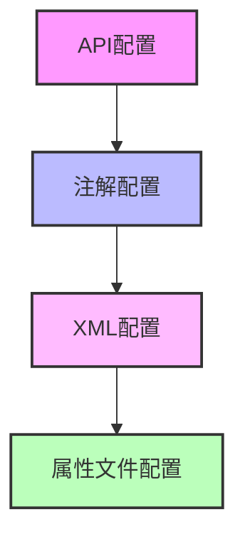

**Diagram sources**
- [AbstractConfig.java](file://dubbo-common/src/main/java/org/apache/dubbo/config/AbstractConfig.java#L718-L737)

### 动态配置优势

动态配置在Dubbo中具有显著优势，特别是在微服务架构中：

1. **灵活性**：可以在运行时根据条件动态调整服务配置
2. **可维护性**：无需重启服务即可更新配置
3. **适应性**：可以根据系统负载动态调整线程池大小等参数
4. **灰度发布**：可以逐步调整服务配置，实现平滑的版本升级

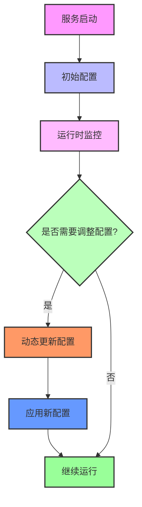

**Diagram sources**
- [ServiceConfig.java](file://dubbo-config/dubbo-config-api/src/main/java/org/apache/dubbo/config/ServiceConfig.java#L324-L364)

## 配置合并与生命周期管理

### 配置合并机制

Dubbo的配置合并机制允许将多个配置对象合并为一个，这在需要创建相似但略有不同的配置时非常有用。配置合并遵循"非空覆盖"原则，即只有当目标配置的属性为空时，才会使用源配置的属性。

```java
public void mergeProtocol(ProtocolConfig sourceConfig) {
    if (sourceConfig == null) {
        return;
    }
    Field[] targetFields = getClass().getDeclaredFields();
    try {
        Map<String, Object> protocolConfigMap = CollectionUtils.objToMap(sourceConfig);
        for (Field targetField : targetFields) {
            Optional.ofNullable(protocolConfigMap.get(targetField.getName()))
                    .ifPresent(value -> {
                        try {
                            targetField.setAccessible(true);
                            if (targetField.get(this) == null) {
                                targetField.set(this, value);
                            }
                        } catch (IllegalAccessException e) {
                            throw new RuntimeException(e);
                        }
                    });
        }
    } catch (Exception e) {
        logger.error(COMMON_UNEXPECTED_EXCEPTION, "", "", "merge protocol config fail, error: ", e);
    }
}
```

**Section sources**
- [ProtocolConfig.java](file://dubbo-common/src/main/java/org/apache/dubbo/config/ProtocolConfig.java#L666-L689)

### 生命周期管理

Dubbo的配置对象具有明确的生命周期，包括创建、刷新、导出/引用和销毁等阶段。正确管理配置对象的生命周期对于确保服务的稳定运行至关重要。

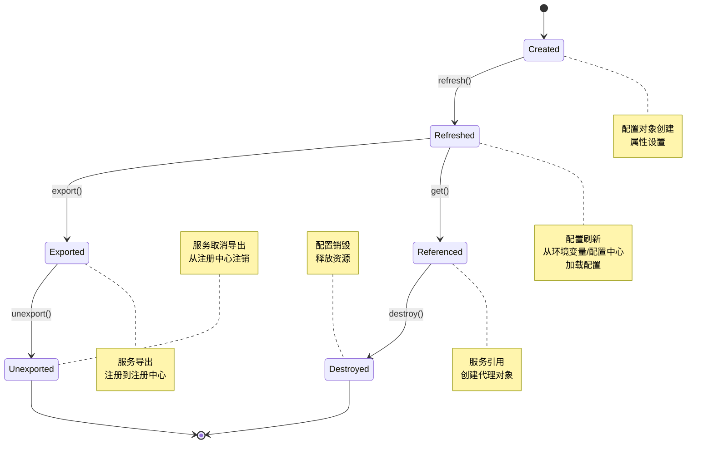

**Diagram sources**
- [ServiceConfig.java](file://dubbo-config/dubbo-config-api/src/main/java/org/apache/dubbo/config/ServiceConfig.java#L214-L255)
- [ReferenceConfig.java](file://dubbo-config/dubbo-config-api/src/main/java/org/apache/dubbo/config/ReferenceConfig.java#L297-L326)