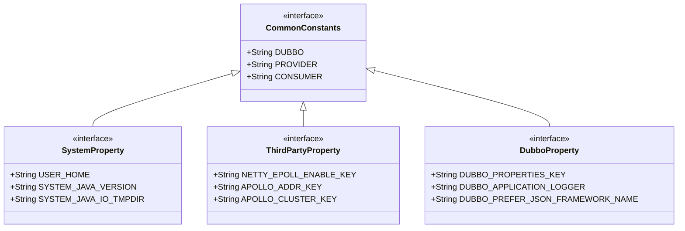
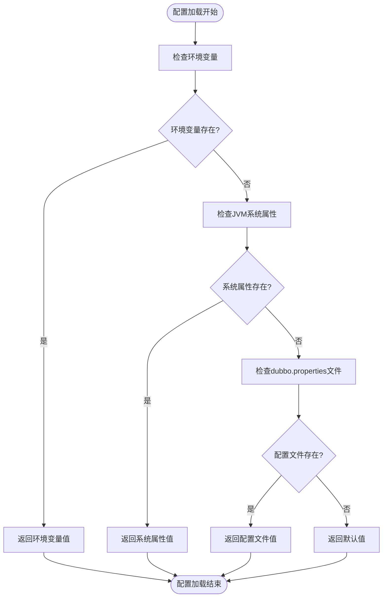
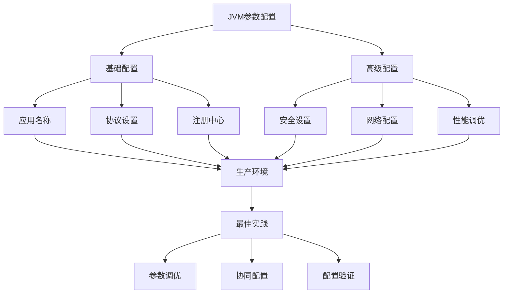

# JVM参数

<cite>
**本文档引用的文件**
- [CommonConstants.java](file://dubbo-common\src\main\java\org\apache\dubbo\common\constants\CommonConstants.java)
- [ConfigUtils.java](file://dubbo-common\src\main\java\org\apache\dubbo\common\utils\ConfigUtils.java)
- [SystemPropertyConfigUtils.java](file://dubbo-common\src\main\java\org\apache\dubbo\common\utils\SystemPropertyConfigUtils.java)
- [PropertiesConfiguration.java](file://dubbo-common\src\main\java\org\apache\dubbo\common\config\PropertiesConfiguration.java)
- [pom.xml](file://pom.xml)
- [dubbo.properties](file://dubbo-common\src\test\resources\dubbo.properties)
</cite>

## 目录
1. [引言](#引言)
2. [JVM参数语法与作用范围](#jvm参数语法与作用范围)
3. [系统属性与配置优先级](#系统属性与配置优先级)
4. [JVM参数配置示例](#jvm参数配置示例)
5. [生产环境部署考量](#生产环境部署考量)
6. [最佳实践](#最佳实践)
7. [结论](#结论)

## 引言

JVM参数是Dubbo框架配置的重要组成部分，通过JVM启动参数（-D参数）可以灵活地配置Dubbo的各种行为。本文档详细介绍了如何使用JVM参数配置Dubbo，包括参数语法、作用范围、优先级关系以及在生产环境中的应用。JVM参数作为系统属性的一种，为开发者提供了在应用启动时进行配置的便捷方式，特别适用于环境特定的配置需求。

**本文档引用的文件**
- [CommonConstants.java](file://dubbo-common\src\main\java\org\apache\dubbo\common\constants\CommonConstants.java)

## JVM参数语法与作用范围

JVM参数通过`-D`前缀来定义系统属性，其基本语法格式为`-Dkey=value`。在Dubbo中，这些参数主要用于配置应用的基本信息、注册中心地址、协议设置等核心配置。根据代码分析，Dubbo定义了多种类型的系统属性：

1. **系统相关属性**：定义在`CommonConstants.SystemProperty`接口中，如`user.home`、`java.version`等
2. **第三方相关属性**：定义在`CommonConstants.ThirdPartyProperty`接口中，如`netty.epoll.enable`、`apollo.meta`等
3. **Dubbo自定义属性**：定义在`CommonConstants.DubboProperty`接口中，如`dubbo.properties.file`、`dubbo.application.logger`等

这些属性在应用启动时被`SystemPropertyConfigUtils`类加载和验证，确保只有预定义的属性才能被设置。属性的加载过程遵循严格的验证机制，如果尝试设置未在`CommonConstants`中定义的属性，将会抛出`IllegalStateException`异常。



**图源**
- [CommonConstants.java](file://dubbo-common\src\main\java\org\apache\dubbo\common\constants\CommonConstants.java#L645-L795)

**本节源**
- [CommonConstants.java](file://dubbo-common\src\main\java\org\apache\dubbo\common\constants\CommonConstants.java#L645-L795)
- [SystemPropertyConfigUtils.java](file://dubbo-common\src\main\java\org\apache\dubbo\common\utils\SystemPropertyConfigUtils.java#L29-L123)

## 系统属性与配置优先级

Dubbo的配置系统采用多层优先级机制，JVM参数作为系统属性是其中重要的一环。配置的加载顺序和优先级如下：

1. **系统环境变量**：首先检查系统环境变量
2. **JVM系统属性**：然后检查JVM系统属性（-D参数）
3. **dubbo.properties文件**：最后加载`dubbo.properties`文件中的配置

这种优先级设计确保了更具体的配置可以覆盖更通用的配置。`ConfigUtils`类中的`getSystemProperty`方法实现了这一逻辑，它首先尝试从环境变量获取值，如果不存在则从JVM系统属性获取。



**图源**
- [ConfigUtils.java](file://dubbo-common\src\main\java\org\apache\dubbo\common\utils\ConfigUtils.java#L183-L188)
- [SystemPropertyConfigUtils.java](file://dubbo-common\src\main\java\org\apache\dubbo\common\utils\SystemPropertyConfigUtils.java#L58-L64)

**本节源**
- [ConfigUtils.java](file://dubbo-common\src\main\java\org\apache\dubbo\common\utils\ConfigUtils.java#L183-L188)
- [SystemPropertyConfigUtils.java](file://dubbo-common\src\main\java\org\apache\dubbo\common\utils\SystemPropertyConfigUtils.java#L58-L64)
- [PropertiesConfiguration.java](file://dubbo-common\src\main\java\org\apache\dubbo\common\config\PropertiesConfiguration.java#L38-L40)

## JVM参数配置示例

### 基础配置示例

对于初学者，可以通过简单的JVM参数快速配置Dubbo应用：

```bash
-Ddubbo.application.name=my-app
-Ddubbo.protocol.name=dubbo
-Ddubbo.protocol.port=20880
-Ddubbo.registry.address=zookeeper://127.0.0.1:2181
```

这些参数分别配置了应用名称、协议类型和端口、注册中心地址等基本信息。在`dubbo.properties`文件中也可以进行类似配置：

```properties
dubbo.application.name=demo-app
dubbo.protocol.name=dubbo
dubbo.protocol.port=-1
dubbo.registry.address=${zookeeper.connection.address}
```

### 高级配置示例

对于经验丰富的开发者，可以使用更复杂的配置：

```bash
-Ddubbo.properties.file=custom-dubbo.properties
-Ddubbo.application.logger=log4j
-Ddubbo.network.interface.preferred=eth0
-Ddubbo.security.serialize.allowedClassList=com.example.MyClass,com.example.OtherClass
```

这些参数分别指定了自定义的属性文件、日志框架、首选网络接口和序列化白名单类。

```mermaid
sequenceDiagram
participant JVM as "JVM启动"
participant SystemProperty as "系统属性"
participant ConfigUtils as "ConfigUtils"
participant Properties as "dubbo.properties"
JVM->>SystemProperty : 设置-D参数
SystemProperty->>ConfigUtils : 调用getSystemProperty()
ConfigUtils->>SystemProperty : 检查环境变量
alt 环境变量存在
SystemProperty-->>ConfigUtils : 返回环境变量值
else
ConfigUtils->>SystemProperty : 检查JVM属性
SystemProperty-->>ConfigUtils : 返回JVM属性值
end
ConfigUtils->>Properties : 加载dubbo.properties
Properties-->>ConfigUtils : 返回配置值
ConfigUtils-->>JVM : 提供最终配置
```

**图源**
- [ConfigUtils.java](file://dubbo-common\src\main\java\org\apache\dubbo\common\utils\ConfigUtils.java#L166-L174)
- [dubbo.properties](file://dubbo-common\src\test\resources\dubbo.properties)

**本节源**
- [ConfigUtils.java](file://dubbo-common\src\main\java\org\apache\dubbo\common\utils\ConfigUtils.java#L166-L174)
- [dubbo.properties](file://dubbo-common\src\test\resources\dubbo.properties)

## 生产环境部署考量

在生产环境中使用JVM参数配置Dubbo时，需要考虑以下因素：

### 优势
1. **灵活性**：可以在不修改代码的情况下调整配置
2. **环境隔离**：不同环境可以使用不同的启动参数
3. **快速部署**：无需重新打包即可修改配置
4. **与容器化集成**：易于与Docker、Kubernetes等容器平台集成

### 限制
1. **安全性**：敏感信息（如密码）不应通过JVM参数传递
2. **可维护性**：大量参数可能导致启动命令过长且难以管理
3. **调试困难**：参数错误可能导致应用启动失败且难以诊断
4. **版本控制**：JVM参数通常不在版本控制系统中，难以追踪变更

在`pom.xml`文件中可以看到JVM参数的典型使用场景，用于测试环境的配置：

```xml
<argline>-server -Xms256m -Xmx512m -XX:MetaspaceSize=64m -XX:MaxMetaspaceSize=128m -Dfile.encoding=UTF-8
  -Djava.net.preferIPv4Stack=true</argline>
```

这展示了JVM参数不仅用于Dubbo配置，还用于JVM本身的调优。

**本节源**
- [pom.xml](file://pom.xml#L136-L137)
- [ConfigUtils.java](file://dubbo-common\src\main\java\org\apache\dubbo\common\utils\ConfigUtils.java)

## 最佳实践

### 参数调优
1. **合理设置内存参数**：根据应用负载调整Xms、Xmx等参数
2. **启用必要的功能**：如`-Ddubbo.network.interface.preferred`指定首选网络接口
3. **安全配置**：使用`-Ddubbo.security.serialize.allowedClassList`限制反序列化类

### 与其他配置方式协同
1. **与dubbo.properties结合**：将通用配置放在properties文件中，环境特定配置通过JVM参数覆盖
2. **与Spring Boot集成**：在Spring Boot应用中，JVM参数可以与application.yml配置协同工作
3. **与配置中心集成**：JVM参数可以指定配置中心地址，实现动态配置管理

### 配置验证
1. **启动时验证**：确保所有必需的参数都已正确设置
2. **日志记录**：记录关键配置的最终值，便于问题排查
3. **监控告警**：对关键配置项设置监控，及时发现异常变更



**图源**
- [CommonConstants.java](file://dubbo-common\src\main\java\org\apache\dubbo\common\constants\CommonConstants.java)
- [ConfigUtils.java](file://dubbo-common\src\main\java\org\apache\dubbo\common\utils\ConfigUtils.java)

**本节源**
- [CommonConstants.java](file://dubbo-common\src\main\java\org\apache\dubbo\common\constants\CommonConstants.java)
- [ConfigUtils.java](file://dubbo-common\src\main\java\org\apache\dubbo\common\utils\ConfigUtils.java)

## 结论

JVM参数是Dubbo配置体系中的重要组成部分，为开发者提供了灵活的配置方式。通过`-D`参数可以方便地设置系统属性，这些属性在应用启动时被加载并与其他配置源（如环境变量、properties文件）共同构成完整的配置体系。理解JVM参数的语法、作用范围和优先级对于有效使用Dubbo至关重要。在生产环境中，应权衡JVM参数的灵活性和可维护性，结合其他配置方式，遵循最佳实践，确保应用的稳定性和安全性。